## 版本控制

### 1.什么是版本控制

在项目开发过程中，项目文件需要不断迭代更新，经常会出现代码逻辑问题，就需要回退到老的可用版本，或者项目开发是多人协同开发，每个人开发不同的模块，随着后期的整合，不同的模块的代码放到一起，也非常容易出现代码冲突的问题，所以就需要版本控制，用于监控每个文件或者多个文件的内容变化，便于后期灾难恢复时，可以回退到指定的可用版本中去


### 2.版本控制的方式有哪些

- 集中式版本控制（SVN）：使用单一的服务器集中管理，保存文件所有修改过的版本，协同开发的人员，只需要安装对应的客户端，去链接服务端，就可以更新或者提交数据到服务器

  - 优点：管理方便，安全性好，因为设置不同账号，进行权限控制，操作简单update或者commit，
  - 缺点：容易出现单点故障，必须连接服务器，否者什么都干不了，很多公司项目比较重要，会在公司搭建SVN，只允许在公司开发

  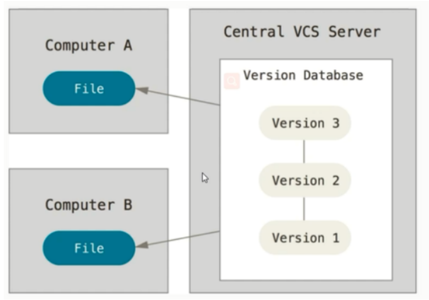

- 分布式版本控制(git)：相比之前SVN只有一台服务器，而git每个客户端都会保存，服务端的所有代码和不同版本（也是一台服务器），后期如果任何一处服务器出现问题，都可以通过任意一台客户端去恢复

  - 优点：每个客户端都会由服务端的完整备份，不依赖于服务器，可以居家办公，甚至可以离线工作（后期有网络了再推送到远程服务器）

  - 缺点：操作起来比较繁琐，需要记忆很多git命令（面试题）权限控制比较难处理，安全性相比SVN不高

    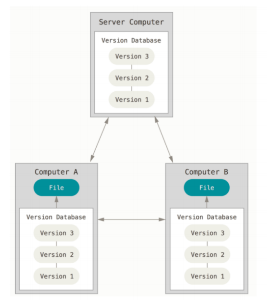

### 3.git

#### 3.1 git工作流程

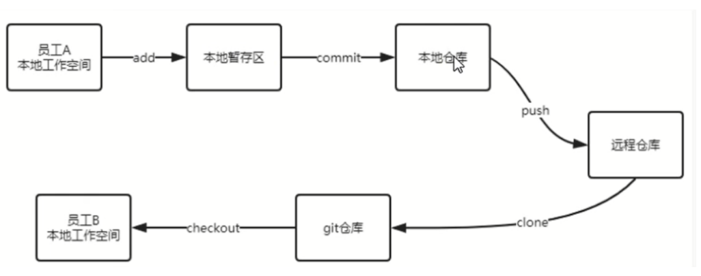

- 本地暂存区：用于存储准备要提交的代码，底层命令：add
- 本地仓库：用于将本地暂存区代码提交之后存储的位置，底层命令：commit
- 远程仓库：通常表示（github（国外的），gitee（国内的））用于将本地仓库的代码，推送到远程服务器的位置，底层命令：push


#### 3.2 git环境搭建

- 安装git：通过群文件或者官网下载，双击下一步安装即可（但是你要知道安装的位置）

  - 结果：文件夹，右键查看是否由git bash here （进入操作git的界面，类似于linux）

- 在github或者gitee创建账号，进入里面创建远程仓库

  - 百度搜索gitee，注册登录git账号

  - 创建远程仓库

    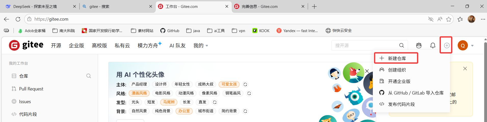

    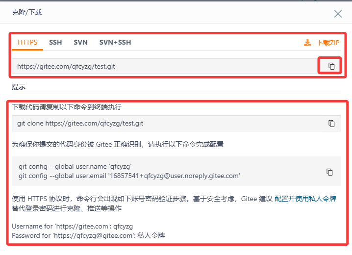

#### 3.3 git的基本操作

+ 自定义一个目录当成本地仓库

+ 本地仓库的包右键，选择git bash here 进入，操作git的界面

  + 第一次进入需要配置用户信息，确保提交的代码可以被gitee识别

    ```bash
    git config --global user.name 'qfcyzg' 
    git config --global user.email '16857541+qfcyzg@user.noreply.gitee.com'
    ```

+ 通过git命令，初始化git仓库（git才会认为这个目录是本地仓库，创建一个隐藏文件.git）

  ```bash
  git init
  ```

+ 通过git命令，查看本地仓库的文件状态（红色（没有在本地暂存区），绿色（已经在暂存区））

  ```bash
  git status
  ```

+ 通过git命令，添加文件或者删除文件，到本地暂存区

  ```bash
  #添加文件
  git add 文件或目录
  #删除文件
  git rm --cached 文件或目录
  ##删除目录
  git rm -f --cached 目录
  ```

#### 3.4 .gitignore文件

在企业级项目中，通常会配合 `.gitignore` 来忽略一些**不应该提交到仓库**的文件，避免泄露敏感信息或提交无意义的临时产物。

常见应该忽略的内容如下：

- **环境配置文件**：`.env`、`.env.*`、`application-dev.yml`、`application-local.yml`

- **IDE 个人配置**：`.idea/`、`.vscode/`、`*.iml`

- **依赖和构建产物**：`node_modules/`、`target/`、`build/`、`dist/`、`out/`

- **日志文件**：`*.log`、`logs/`、`npm-debug.log*`

- **缓存和临时文件**：`__pycache__/`、`*.pyc`、`.pytest_cache/`、`.ipynb_checkpoints/`

- **系统文件**：`.DS_Store`、`Thumbs.db`、`._*`

- **测试报告与覆盖率文件**：`coverage/`、`htmlcov/`、`.coverage`

- **本地数据库和数据文件**：`*.db`、`*.sqlite`

- **敏感密钥和证书**：`*.pem`、`*.key`、`*.jks`、`*.p12`

> 原则：凡是“可以重新生成的文件”“个人本地配置”“敏感信息”，一般都不要提交到 Git 仓库。

一个常见的 `.gitignore` 例子：

```gitignore
.env
.env.*
.idea/
.vscode/
node_modules/
target/
build/
dist/
out/
*.log
*.pyc
__pycache__/
.DS_Store
Thumbs.db
coverage/
htmlcov/
*.pem
*.key
```

通过git命令，提交本地暂存区的文件到本地仓库

```bash
git commit -m "提交版本信息，描述"
```

有了网络，就可以把本地仓库的内容推送到远程仓库

```bash
#第一次提交远程仓库，需要先让本地和远程进行关联
git remote add 仓库名 gitee仓库地址
git remote add origin https://gitee.com/qfcyzg/test.git
#后续每次推送远程仓库（第一次推送，要输入gitee账号密码）
git push 仓库名（origin） 分支名（master/main）

##bug：推送的时候，如果远程仓库的代码，本地仓库没有，那么推送的时候会出现错误
##解决方法：通过git 命令将最新版更新到本地仓库，等成功了，在推送你自己的本地仓库
git pull --rebase origin master
```

如果是一个新的git仓库，项目经理，需要通过git拉取代码下来学习，

+ 方式1：按照上面的方式，先remote关联远程，再push拉取项目

  ```bash
  git init
  git remote add origin gitee仓库地址
  git pull --rebase origin master
  ```

+ 方式2：可以直接利用git clone命令，把远程仓库项目克隆到

  ```bash
  git clone gitee仓库地址
  ```


#### 3.5 git常用命令 --- 面试题

- git init：初始化仓库

- git add：添加本地暂存区

- git status：查看文件状态（只会显示没被追踪过的，或者追踪过但修改过的）
  - git ls-files：查看已被追踪的文件（至少加入过暂存区）
  - git switch：切换分支
  
- git commit -m "你的描述"：提交本地仓库

- git remote：让本地仓库和远程仓库进行关联
  - git remote -v：可以查看远程仓库地址
  - git remote set-url origin <新的仓库地址> 修改远程仓库地址
  - git remote remove origin：删除现有仓库
  
- git pull：拉取远程仓库的代码到本地仓库

- git push：推送本地仓库代码到远程

  ```
  git push 仓库名 分支
  ```

- git clone ：从远程仓库克隆项目到本地

- git checkout 分支名：切换分支，前提是当前分支，没有需要提交的
  - git checkout 分支名 `commit-hash`：回到之前的某个版本


### 4.idea集成git进行操作

- 让idea知道在什么地方安装了git

  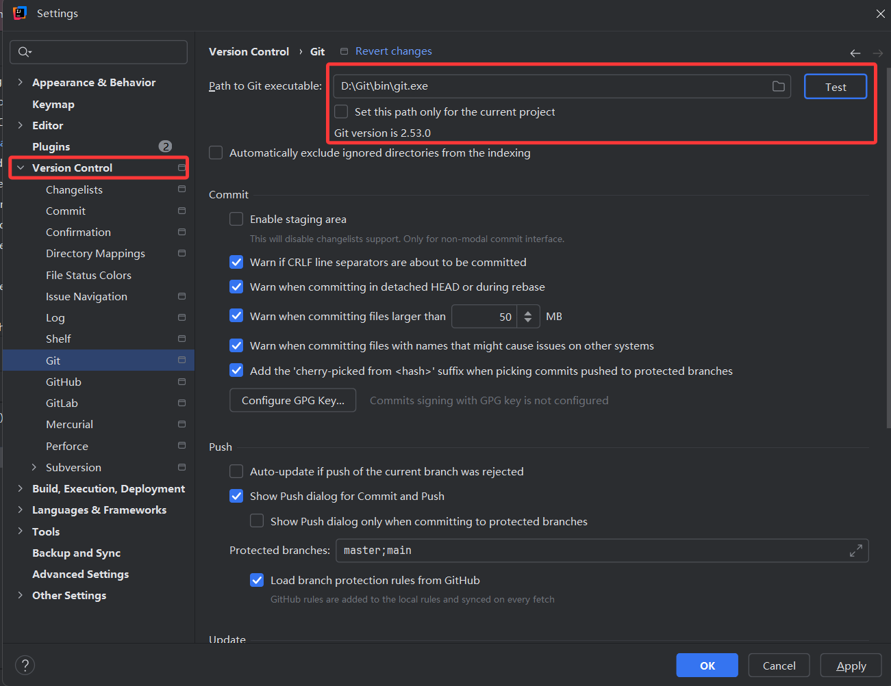

- 在gitee或者github创建一个远程仓库

- 通过idea创建git本地仓库

- 通过项目右键，选择git --- >add添加本地暂存区

- 选择项目右键，找到git ---- > commit（push）提交并且推送远程仓库

  

- 如果代码修改了，想再次提交和推送

  > add--->commit ---->push
  >
  > - 如果push失败了，有可能是远程仓库有的新内容（其他人提交的）本地仓库没有，所以在push之前，先做pull拉取最新项目下来

- 如果再提交和推送时，出现了版本冲突（多人协同开发，代码不一致问题），要及时解决.......

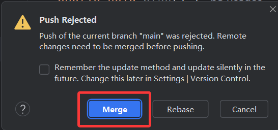

> 面试题：git提交并推送的时候，如果和其他人的代码出现代码冲突，你是如何解决的？
>
> 答案：如果出现了冲突，会弹出一个窗口，是通过marge进行不同版本代码合并（比如：idea的代码版本，本地仓库的版本，远程仓库的版本）
>
> 如何合并代码：要先去和修改这些代码的人员去沟通，沟通好之后统一版本，以为为主，如果找不到沟通的人员，可以将远程仓库不一致的代码，保存起来，再拉取远程代码，再提交......也可以不推送远程，只提交到本地仓库，等什么时候，沟通好了再推送远程


- 如果刚进公司，需要从远程仓库，拉取代码到本地idea

  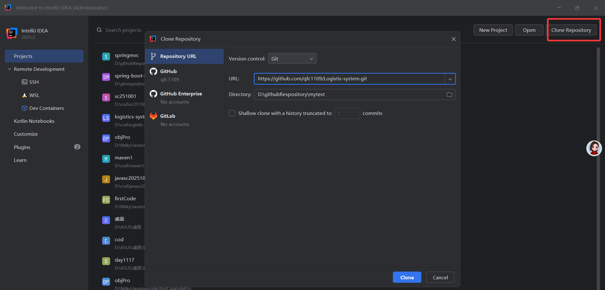


### 5.分支

在实际开发过程中，当遇到一个新的需求，并不会在主分支（master）进行开发，而是在主分支基础上，创建一个新的分支，当新建的分支代码经过了审核后，测试也通过了，再将这个分支合并到主分支，分支操作主要分为以下几种：

- 新建分支：

  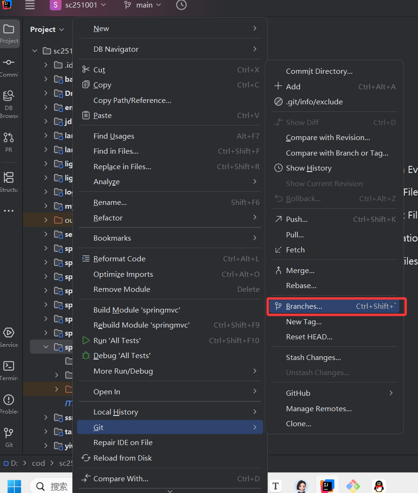

  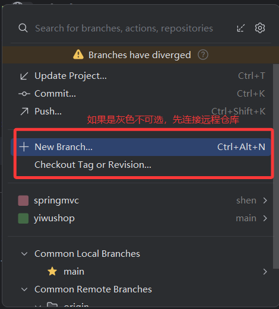

- 使用新建的分支，添加代码提交推送

  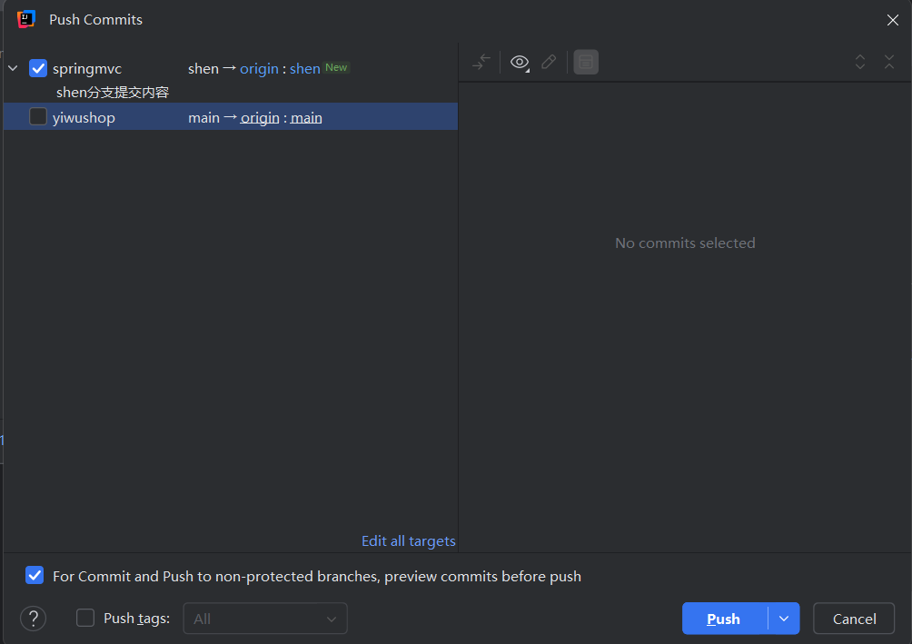

- 切换分支

  

- 合共分支：是其他分支，向主分支合并，同时在合并的时候，也可能会出现版本冲突（代码不一致）

  解决方案：参考上面的面试题

  ==合并分支之前，要切换到主分支==

- ==注：每次合并后，最好先提交推送一下，保存一下版本，一定不要多个分支一起合并到主分支在提交推送==

