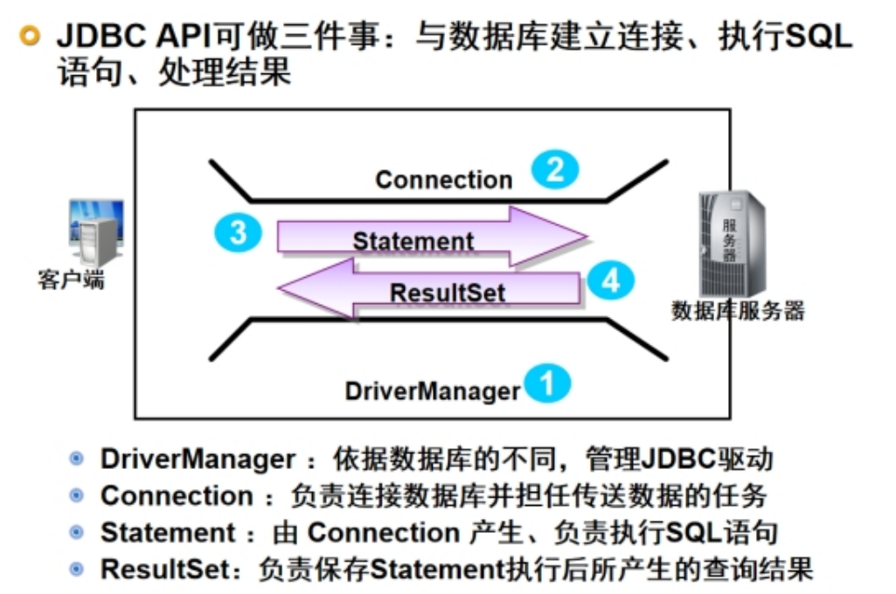

## JDBC

### 1. 为什么要学JDBC？

早期存储数据库，是通过序列化存储，缺点：不适合做大量数据存储所以学习了数据库，最后肯定还需要学习java如何和数据库进行交互，而JDBC主要目的就是用来和数据库交互，而且以后可以更好的学习mybatis框架


### 2. 什么是JDBC？

JDBC(java database connection)：是表示java数据库连接，是javaEE一个核心组件，主要用于执行sql语句的，它提供了一套完整的类和接口，这些类和接口就是为了定义访问数据库规则，但是具体要实现什么数据库，需要对应的数据库厂商提供的==驱动包（jar包）==来访问


### 3. JDBC涉及到的类和接口 ---笔试题（选择题）

- DriverManager：驱动管理类，加载驱动包信息，可以创建数据库的连接
- Connection：数据库连接对象，负责和数据库交互，还负责创建statement对象
- statement：用于执行sql语句的（增、删、改、查）
- ResultSet：只有查询语句会返回结果集对象，它会保存查询语句的结果，还需要将结果集里面的数据处理成java中的对象




### 4. JDBC使用步骤 --- 笔试题

- 加载驱动类（前提：需要先导入驱动包）
- 通过`DriverManager`管理驱动类，创建数据库连接对象
- 通过连接对象，创建==statement==对象
- 通过statement对象，执行sql语句
- 只有==查询语句==才要返回结果集==ResultSet==对象，需要处理结果集
- 关闭资源

```java
public static void select() throws ClassNotFoundException, SQLException {
        //1.加载驱动类（先导入驱动包）
//        String driver = "com.mysql.cj.jdbc.Driver";
        Class.forName(driver);
        //2.通过DriverManager管理驱动包，创建连接
        // 协议://ip地址:端口:/项目名称/项目资源?参数名=参数值 & 参数2=值2
        // ?参数名=参数值& 参数2=值2 用于在地址上传递一些可选参数
        //常用可选参数：
        //1. userUnicode：表示unicode编码来进行存储
        //2. characterEncoding:修改字符集编码（让中文存储到mysql不乱码）
        //3.autoReconnect:是否自动连接
        //4.rewriteBatchedStatement:是否开启批处理（一口气可以新增很多条数据）
        //5.serverTimezone：设置时区，不是必选的，主要看数据库和系统时间是否有差异
        // serverTimezone=Asia/Shanghai
        //6.useSSL:是否使用SSL协议 一般mysql5.7需要配置
        // useSSL=false
//        String url = "jdbc:mysql://localhost:3306/sc251001?useUnicode=true&characterEncoding=utf8&autoReconnect=true&rewriteBatchedStatement=true";
//        String username = "root";
//        String password = "root";
        Connection conn = DriverManager.getConnection(url, username, password);
        System.out.println("连接成功:" + conn);

        //3.通过连接对象创建statement对象
        Statement stmt = conn.createStatement();
        //4.通过statement对象执行sql语句
//        stmt.execute(); 用于执行增删改查 四种语法，但是它的返回值是boolean类型，无法查看查询的数据，不推荐使用
//        stmt.executeUpdate(); 用于执行增删改 三种语句，返回值是int（表示受影响的行数），推荐使用
//        stmt.executeQuery(); 用于执行查询语句 返回ResultSet，推荐使用
//        stmt.executeBatch(); 用于执行批量操作的时候，比如批量新增100条数据，看需求
        String sql = "select * from dept";
        ResultSet rs = stmt.executeQuery(sql);
        // 5.只有查询语句才有这个步骤，处理结果集 （类似于迭代器）
        List<Dept> list = new ArrayList<>();
        while (rs.next()) {//判断是否有下一行数据，如果有进循环
            //循环一次，获取一行数据
            //rs.getxxx(int 或者 String) 用于获取每行数据不同字段的值
            //rs.getxxx(int) 表示获取第几个字段,不推荐使用，如果表很复杂，很难控制顺序
            //rs.getxxx(String) 表示根据字段名来获取值，推荐使用，可以不用考虑查询的顺序
            //rs.getInt(); 获取数字类型
            //rs.getString() 获取字符串
            //rs.getDate() 获取日期
            int deptno = rs.getInt("deptno");
            String dname = rs.getString("dname");
            String loc = rs.getString("loc");
            System.out.println(deptno + "\t" + dname + "\t" + loc);
            list.add(new Dept(deptno, dname, loc));
        }

        //6.关闭资源 conn,stmt,rs,但是关闭，要注意好顺序，遵循栈的原则，先创建后关闭
        rs.close();
        stmt.close();
        conn.close();
    }
```


### 5 .sql注入  ---高频面试题

==sql注入==：一般前端传递了一些非法参数，通过字符串拼接的形式来处理它的sql语句，最终执行sql语句的时候，可能执行效果，无法满足预期，达到了欺骗服务器的目的，比如：`delete from 表 name='随便写' or 1=1`，就属于非法参数，虽然name不成立，但是1=1一定成立，就会造成全表删除


#### 5.1解决方案

使用预编译对象`PreparedStatement` 替代 `Statement`来解决sql注入的问题，它就会先编译sql语句，让sql语句的结构固定，sql语句的参数通过`?`作占位符，来对参数进行赋值，同时还可以一次编译，多次运行，执行效率还会高一些

```java
 public static void insert(Emp e) throws SQLException, ClassNotFoundException {//新增员工
        Class.forName(driver);
        Connection conn = DriverManager.getConnection(url, username, password);
        String sql = "insert into emp values(null,?,?,?,?,?,?,?)";
        PreparedStatement pstmt = conn.prepareStatement(sql);
        pstmt.setString(1, e.getEname());
        pstmt.setString(2, e.getJob());
        pstmt.setInt(3, e.getMgr());
        //日期会有错误，setDate(默认日期类型是java.sql.Date)
        //java.util.Date ==>Java.sql.Date
        Date time = new Date(e.getHiredate().getTime());
        pstmt.setDate(4, time);
        pstmt.setDouble(5, e.getSal());
        pstmt.setDouble(6, e.getComm());
        pstmt.setInt(7, e.getDeptno());
        int i = pstmt.executeUpdate();
        System.out.println(i);
        pstmt.close();
        conn.close();
    }
```


#### 5.2 PreparedStatement和Statement区别 ---面试题


#### 5.3 mybatis中 #{} 和 ${} 区别 ---面试题

+ ==Statement==：是通过==字符串拼接==的方式来处理参数，会存在==sql注入==的隐患，非常不安全，所以经常适用于传递表名或者字段名，处理这种不需要预编译的数据，并且它也是Mybatis框架==${}==底层实现
+ ==PreparedStatement==：是通过==?==做占位符来处理参数的，同时还是==预编译==对象，先编译sql语句，多次运行，执行效率会高一些，而且可以==防止sql注入==，推荐使用，而且也是Mybatis框架==#{}==底层实现


### 6.JDBC工具封装类

> 工具类中的方法异常不能抛出，必须try-catch
>
> 工具类中的方法都是static方法，通过类名调用

```java
package util;

import javax.swing.*;
import java.io.IOException;
import java.io.InputStream;
import java.sql.*;
import java.util.Properties;

//jdbc工具类:为了jdbc繁琐的操作，进行封装
//工具类一般用try-catch 不能抛出异常
public class JdbcUtil {
    //四个属性，环境变更会经常修改，所以不推荐放在java代码编写
    //一般推荐，把这些经常改配置，放在配置文件中编写
    //配置文件xml properties yml...
    private static String driver;
    private static String url;
    private static String username;
    private static String password;

    //写代码,先去读取配置文件，再通过key获取value
    static { //会在类加载执行一次
        InputStream is = JdbcUtil.class.getClassLoader().getResourceAsStream("resources/jdbc.properties");
        Properties p = new Properties();
        //通过读取的IO流数据，封装到Properties
        try {
            p.load(is);
        } catch (IOException e) {
            throw new RuntimeException(e);
        }
        //通过key来获取value给上面的变量赋值
        driver = p.getProperty("jdbc.driver");
        url = p.getProperty("jdbc.url");
        username = p.getProperty("jdbc.username");
        password = p.getProperty("jdbc.password");
        try {
            //加载驱动包，只需要加载一次
            Class.forName(driver);
        } catch (ClassNotFoundException e) {
            throw new RuntimeException(e);
        }

    }

    public static void main(String[] args) {
        System.out.println(driver);
        System.out.println(url);
        System.out.println(username);
        System.out.println(password);
    }

    //如果要做事务，包装同一个线程（功能）是同一个连接
    static ThreadLocal<Connection> tl = new ThreadLocal<>();
    //创建连接的通用方法
    public static Connection getConn() throws SQLException {
        Connection conn = tl.get();
        //如果没有连接，说明这是个新的功能
        if (conn == null) {
            conn = DriverManager.getConnection(url, username, password);
            tl.set(conn);
        }
        System.out.println(conn);
        //如果获取到了连接，说明这个线程已经存在连接，直接返回
        return conn;
        /*Connection conn = null;
        try {
            conn = DriverManager.getConnection(url, username, password);
        } catch (SQLException e) {
            throw new RuntimeException(e);
        }
        return conn;*/
    }

    //关闭资源的通用方法
    //bug：传参数的顺序就是以后关闭的顺序
    public static void close(AutoCloseable... as) {
        //清空ThreadLoacl的连接
        tl.set(null);
        for (AutoCloseable a : as) {
            if (a != null) {
                try {
                    a.close();
                } catch (Exception e) {
                    throw new RuntimeException(e);
                }
            }
        }
    }

    //增删改的通用方法
    //不同增删改，sql语句肯定不同，参数也肯定不同
    //bug:以后?的个数，一定要和传递的参数一一对应
    public static Connection conn2 = null;
    public static PreparedStatement pstmt2 = null;
    public static int update(String sql, Object... os) throws SQLException {
         conn2 = getConn();
         pstmt2 = null;
        try {
            pstmt2 = conn2.prepareStatement(sql);
        } catch (SQLException e) {
            throw new RuntimeException(e);
        }
        //给？赋值
        if (os != null) {
            for (int i = 0; i < os.length; i++) {
                try {
                    pstmt2.setObject(i + 1, os[i]);
                } catch (SQLException e) {
                    throw new RuntimeException(e);
                }
            }
        }
        int result = 0;
        try {
            result = pstmt2.executeUpdate();
        } catch (SQLException e) {
            throw new RuntimeException(e);
        } finally {
            //为了做事务，不能随便关
//            close(pstmt, conn);

        }
        return result;
    }


    //查询半通用方法
    public static Connection conn = null;
    public static PreparedStatement pstmt = null;

    public static ResultSet select(String sql, Object... os) throws SQLException {
        conn = getConn();
        pstmt = null;
        try {
            pstmt = conn.prepareStatement(sql);
        } catch (SQLException e) {
            throw new RuntimeException(e);
        }
        if (os != null) {
            for (int i = 0; i < os.length; i++) {
                try {
                    pstmt.setObject(i + 1, os[i]);
                } catch (SQLException e) {
                    throw new RuntimeException(e);
                }
            }
        }
        ResultSet rs = null;
        try {
            rs = pstmt.executeQuery();
        } catch (SQLException e) {
            throw new RuntimeException(e);
        }
        //不能关闭，因为rs还没有处理,外面处理完之后才能关闭
//        close(rs, pstmt, conn);
        return rs;
    }
}

```


### 7. JDBC如何做事务 ---面试题

JDBC做事务类似于mysql数据库，都是自动提交事务，如果需要自己实现事务，需要修改JDBC关闭自动提交，JDBC是==通过Connection对象来完成事务操作==的

+ 实现步骤：
  - conn.setAutoCommit(false);//设置手动提交事务
  - conn.commit();如果没有发生异常，提交事务
  - conn.rollback():如果出现异常，回滚事务

> ==bug==:遇到执行事务时，回滚事务功能失效，原因是：每个操作都创建了连接对象
>
> 要用ThreadLocal解决，保证每次事务都是用同一个连接对象
>
> ```Java
> //如果要做事务，包装同一个线程（功能）是同一个连接
>  static ThreadLocal<Connection> tl = new ThreadLocal<>();
>  public static Connection conn = null;
>  public static PreparedStatement pstmt = null;
>  //创建连接的通用方法
>  public static Connection getConn(){
>      Connection conn = tl.get();
>      //如果没有连接，说明这是个新的功能
>      if (conn == null) {
>          try {
>              conn = DriverManager.getConnection(url, username, password);
>          } catch (SQLException e) {
>              throw new RuntimeException(e);
>          }
>          tl.set(conn);
>      }
> //        System.out.println(conn);
>      //如果获取到了连接，说明这个线程已经存在连接，直接返回
>      return conn;
>      /*Connection conn = null;
>      try {
>          conn = DriverManager.getConnection(url, username, password);
>      } catch (SQLException e) {
>          throw new RuntimeException(e);
>      }
>      return conn;*/
>  }
> 
>  //关闭资源的通用方法
>  //bug：传参数的顺序就是以后关闭的顺序
>  public static void close(AutoCloseable... as) {
>      //清空ThreadLoacl的连接
>      tl.set(null);
>      for (AutoCloseable a : as) {
>          if (a != null) {
>              try {
>                  a.close();
>              } catch (Exception e) {
>                  throw new RuntimeException(e);
>              }
>          }
>      }
>  }
> ```


### 8. 什么是ThreadLocal ---面试题

ThreadLocal 是java中一种特殊的类，用于在多线程环境下维护线程的局部变量，ThreadLocal可以为每个线程提供一个独立的变量副本，这样每个线程都可以独立修改这个副本，也不会影响其他线程的变量副本，比较适合处理多线程，处理一些独立资源的场景，比如：数据库连接，session会话技术，主要通过三个方法来实现：

+ set()：设置当前线程的变量副本
+ get()：获取当前线程的变量副本
+ remove()：清除当前线程变量副本
