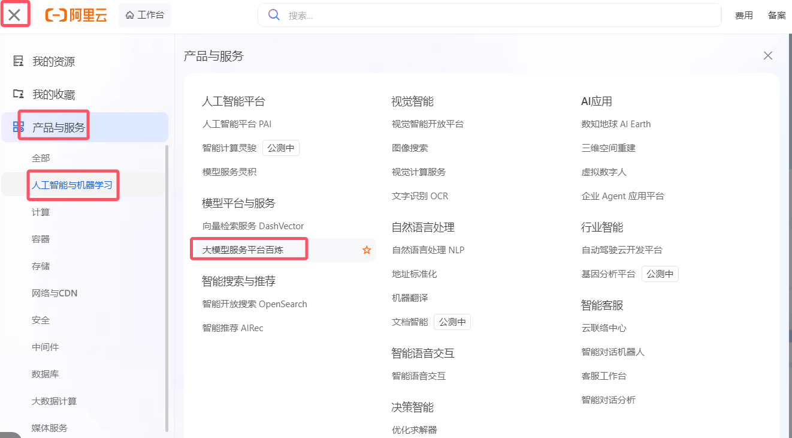
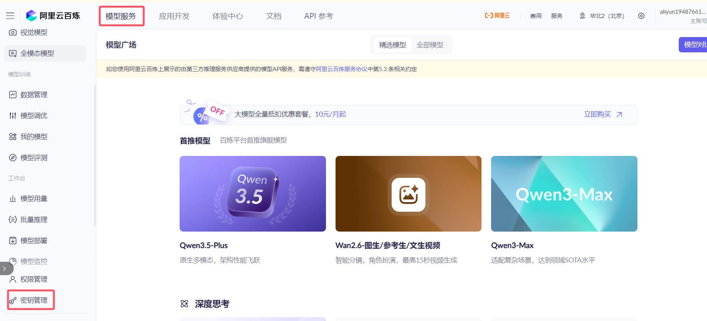
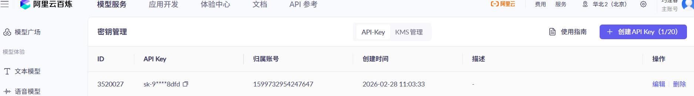
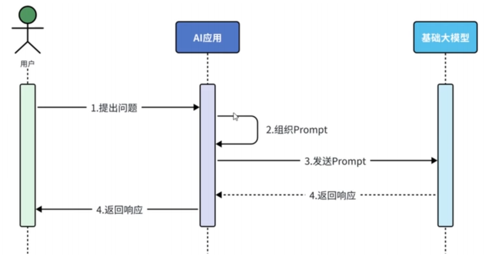
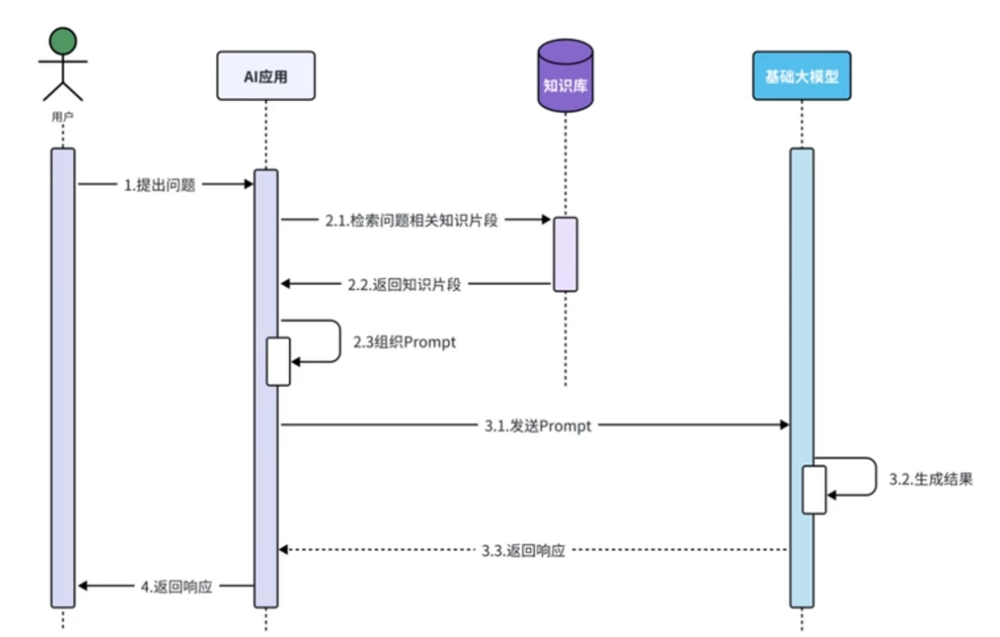
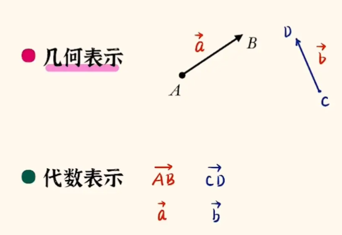
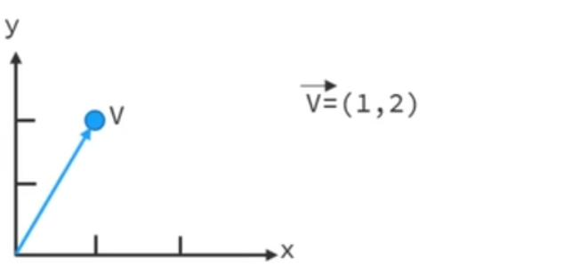
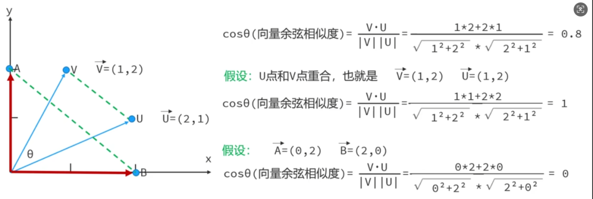
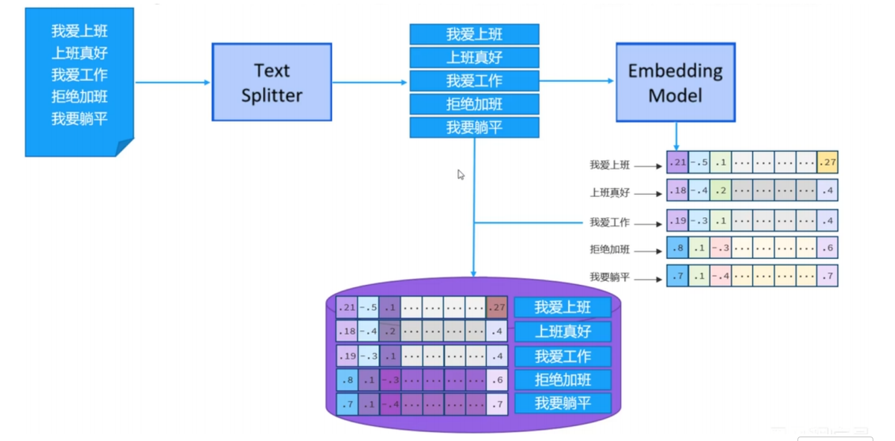
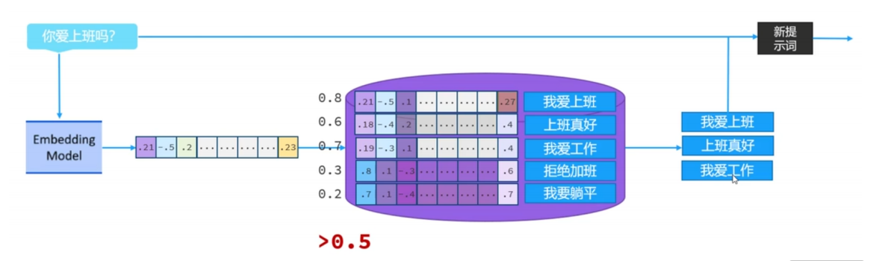

## LangChain4j

### 1.什么是AI

AI：人工智能，让机器能够像人类一样思考问题，学习和解决问题的技术，早期1950年已有AI这种说法

+ 图灵测试：具有两种角色，他们之间通过文本形式进行沟通
  + 提问者：首先会提出问题（以文本形式传输），最后提问者收到了这些信息，去分析哪个是人，哪个是机器（最后无法分辨）
  + 回答者：也有两种角色
    + 机器：分别回答提问者的问题，也以文本形式传输
    + 人：分别回答提问者的问题，也会文本形式传输
+ 所以AI就是如何让机器，具有人的特征（大语言模型，简称大模型）


### 2.java调用大模型主流方案

+ LangChain4j + qwen大模型：针对于java开发的，更加符合java的安全和面向对象的特征，侧重于大模型的逻辑处理，比如：复杂的RAG（检索知识库），和多会话技术
+ Spring AI + Deepseek大模型：侧重于大模型的标准化，和spring的规范，可以统一API调用，包括多模型切换


### 3.大模型部署

+ 自己部署：随时使用
  + 云服务器部署：
    + 优点：前期成本很低，维护起来比较简单
    + 缺点：数据不安全，长期使用，成本比较高
  + 本地机器部署：
    + 优点：数据安全，长期成本比较低
    + 缺点：维护困难
+ 别人部署：花钱使用
  + 阿里云百炼，百度智能云，火山引擎......
    + 他们准备好了大模型的环境，我们只要调用他们提供的API接口（根据使用次数，或者流量收费）
      + 优点：无需部署，不需要维护
      + 缺点：数据不安全，长期成本比较高


#### 3.1 本地部署大模型

+ 安装大模型，需要安装环境Ollama

  > 官网：ollama.com（Models-->搜索大模型）

  + 官网下载安装ollama

  + 使用ollama命令，下载并运行大模型

    例：

    ```
    ollama run qwen3:0.6b
    ```

  

#### 3.2 阿里云百炼平台大模型使用

+ 登录阿里云：www.aliyun.com

+ 开通大模型服务平台服务

+ 申请百炼平台API-KEY（非常重要，不能随便给别人）

  ```
  sk-93eec9b4c4524cf0ae9993642d078dfd
  ```

+ 选择模型，并且使用（qwen-plus）








### 4.什么是LangChain4j

LangChain4j是来源于python的LangChain框架的思想，专门为java语言开发设计的，用于构建大模型的应用程序框架，它的核心思想是简化大模型集成到java程序中的过程，可以无缝衔接到springboot，mysql，redis等主流技术

LangChain4j提供一套统一的接口来集成30种以上的主流的大模型，支持向量储存和外部工具和会话记忆等功能

> 官网：docs.langchain4j.dev


#### 4.1 Langchain4j的会话功能

##### 4.1.1 快速入门

+ 创建springboot项目

+ 引入LangChain4j依赖（`前提：jdk17+`）

  ```xml
  <dependency>
  <groupId>dev.langchain4j</groupId>
  <artifactId>langchain4j-open-ai</artifactId>
  <version>1.0.1</version>
  </dependency>
  ```

+ 构建OpenAiChatModel对象

+ 调用chat方法和大模型交互，测试

  ```java
  public static void main(String[] args) {
          //1.构建OpenAiChatModel对象
          OpenAiChatModel model = OpenAiChatModel.builder()
                  //查看阿里云官网,api文档
                  .baseUrl("https://dashscope.aliyuncs.com/compatible-mode/v1")
                  //不要写死，（不安全，不好记忆，推荐配置环境变量，让代码可以读取环境变量的值）
                  .apiKey(System.getenv("API-KEY"))
                  .modelName("qwen-plus")
                  .build();
          //2.调用该对象的chat()和大模型交互
          Scanner sc = new Scanner(System.in);
          while (true) {
              System.out.println("请输入你的问题");
              String str = sc.nextLine();
              if("exit".equals(str)) {
                  break;
              }
              String result = model.chat(str);
              System.out.println(result);
          }
  
      }
  ```


##### 4.1.2 springboot整合LangChain4j

+ 创建springboot（版本：springboot3.5.0+）

+ 引入LangChain4j的springboot依赖

  ```xml
  <dependency>
  <groupId>dev.langchain4j</groupId>
  <artifactId>langchain4j-open-ai-spring-boot-starter</artifactId>
  <version>1.0.1-beta6</version>
  </dependency>
  ```
  
+ 配置文件中（application.properties或者application.yml），配置大模型（springboot会自动装配OpenAiChatModel对象）

  properties：

  ```properties
  server.port=9999
  #整合langchain4j      ${变量名}会自动读取，系统环境变量
  langchain4j.open-ai.chat-model.api-key=${API-KEY}
  langchain4j.open-ai.chat-model.base-url=https://dashscope.aliyuncs.com/compatible-mode/v1
  langchain4j.open-ai.chat-model.model-name=qwen-plus
  ```

  yml：

  ```yml
  #yml 相比于properties，更加简洁，可以把更多相同的配置，编写一遍
  #而且更有层次感
  #注: 1.缩进很重要，是为了控制层次关系的
  #注: 2.要赋值时，一定要加一个空格，否则不识别
  
  server:
    port: 9999
  langchain4j:
    open-ai:
      chat-model:
        api-key: ${API-KEY}
        base-url: https://dashscope.aliyuncs.com/compatible-mode/v1
        model-name: qwen-plus
  ```

+ 开发后端接口测试大模型


##### 4.1.3 AiService工具类：适用于高阶langChain4j应用，比如：会话记忆，RAG知识库......

+ 引入依赖

  ```xml
  <dependency>
  <groupId>dev.langchain4j</groupId>
  <artifactId>langchain4j-spring-boot-starter</artifactId>
  <version>1.0.1-beta6</version>
  </dependency>
  ```

+ 声明业务接口

  ```java
  public interface ChatService {
      //用于和大模型聊天
      String chat(String msg);
  }
  ```

+ 使用AiServices为接口创建代理对象（通过配置类来实现）

  ```java
  //通过配置类完成
  @Configuration
  public class ChatConfig {
      @Autowired
      private OpenAiChatModel model;
  
      @Bean
      public ChatService chatService() {
          ChatService cs = AiServices.builder(ChatService.class)
                  .chatModel(model)
                  .build();
          return cs;
      }
  }
  ```

  + ==简化版==：通过==声明式注解==来完成该配置，就可以==不用编程配置类==

    ```java
    //@AiService//自动装配
    @AiService(
            //表示手动装配
            wiringMode = AiServiceWiringMode.EXPLICIT,
            //model对象bean的名称（bean的id）默认id类名首字母小写
            chatModel="openAiChatModel"
    )
    public interface ChatService {
        //用于和大模型聊天
        String Chat(String msg);
    }
    
    ```

+ 控制层注入业务层实现大模型的交互

  ```java
  @Autowired
      ChatService cs;
  
      @RequestMapping("/chat2")
      public String chat2(@RequestParam("msg") String abc) {
          String result = cs.Chat(abc);
          return result;
      }
  ```

  

##### 4.1.4 流式调用：可以提高大模型响应速度，因为它是一步一响应

+ 导入依赖

  ```xml
  <dependency>
  <groupId>org.springframework.boot</groupId>
  <artifactId>spring-boot-starter-webflux</artifactId>
  </dependency>
  <dependency>
  <groupId>dev.langchain4j</groupId>
  <artifactId>langchain4j-reactor</artifactId>
  <version>1.0.1-beta6</version>
  </dependency>
  ```

+ 配置文件中配置流式对象

  ```yml
  server:
    port: 9999
  langchain4j:
    open-ai:
      chat-model:
        api-key: ${API-KEY}
        base-url: https://dashscope.aliyuncs.com/compatible-mode/v1
        model-name: qwen-plus
      streaming-chat-model:
        api-key: ${API-KEY}
        base-url: https://dashscope.aliyuncs.com/compatible-mode/v1
        model-name: qwen-plus
  ```

+ 切换业务层方法的返回值Flux

  ```java
  //@AiService//自动装配
  @AiService(
          //表示手动装配
          wiringMode = AiServiceWiringMode.EXPLICIT,
          //model对象bean的名称（bean的id）默认id类名首字母小写
          chatModel = "openAiChatModel",
      	//启用流式调用
          streamingChatModel = "openAiStreamingChatModel"
  )
  public interface ChatService {
      //用于和大模型聊天
      public String chat(String msg);
  
      //Flux是支持流式处理的类型
      public Flux<String> chat2(String msg);
  }
  ```

+ 控制层方法返回值也返回Flux，==注意会乱码==

  ```java
  @RequestMapping(value = "/chat3", produces = "text/html;charset=utf-8")
      public Flux<String> chat3(@RequestParam("msg") String abc) {
          Flux<String> flux = cs.chat2(abc);
          return flux;
      }
  ```

  

##### 4.1.5 消息注解：一般写在业务层，接口中方法上

- @SystemMessage：设置系统消息（系统提示词），用于设置AI角色和行为准则，可以限定AI身份，这样就可以限制AI回答问题的范围属于全局规划

  ```java
  //    @SystemMessage("你是一位清华大学的java老师")
  //fromResource可以读取一个文本，用于设置一些复杂的提示词
      @SystemMessage(fromResource = "system.txt")
      public Flux<String> chat3(String msg);
  ```

  

- @User Message：设置用户消息（用户提示词）：标注用户提问的参数，可以动态的生成提示词，属于单次请求的规则

  ```java
  //{{it}}是固定的写法，用于表示，表示第一个参数
      //{{参数}}属于手动绑定，下面的方法参数需要通过@V("参数名")
      //一般适用于，接收多个参数使用
      @UserMessage("你是一位英语老师{{it}}")
      public Flux<String> chat4(String msg);
  
      @UserMessage("你是一位英语老师{{msg}}")
      public Flux<String> chat5(@V("msg") String msg);
  ```

  


##### 4.1.6 会话记忆

大模型不具备记忆能力，想让大模型记住之前聊天的内容，唯一的方案，就把之前聊天内容和用户新的提示词，一并发给大模型（这也是目前AI的瓶颈）

+ 会话ChatMemory对象（已经存在，只需要配置即可）

  ```java
  public interface ChatMemory {
      Object id();//记忆存储对象会话的唯一标识，类似于之前的sessionId
      void add(ChatMessage var1);//添加一条会话记忆
      List<ChatMessage> messages();//获取所有的会话记忆
      void clear();//清除所有会话记忆
  }
  ```

+ 配置会话ChatMemory对象（配置类）

  ```java
  @Configuration
  public class ChatConfig {
     
      //定义会话记忆对象
      @Bean
      public ChatMemory chatMemory() {
          return MessageWindowChatMemory.builder()
                  .maxMessages(5) //设置最大上下文，越大费用越高,是根据流量收费的
                  .build();
      }
  
  }
  ```

+ 启用会话记忆

  ```java
  @AiService(
          //表示手动装配
          wiringMode = AiServiceWiringMode.EXPLICIT,
          //model对象bean的名称（bean的id）默认id类名首字母小写
          chatModel = "openAiChatModel",
          streamingChatModel = "openAiStreamingChatModel",
          chatMemory = "chatMemory" //启用会话记忆
  )
  ```

  - ==bug==：不同的用户会话容易出现冲突的（模拟两个浏览器，同时向AI发送问题）所以要实现会话记忆隔离

    - 实现会话记忆隔离原理：就是每次传递数据时，需要添加一个memoryId，表示会话的唯一标识

      - 修改配置类，添加ChatMemoryProvider对象，会话记忆对象可以注释掉

        ```JAVA
        @Configuration
        public class ChatConfig {
            //定义会话记忆对象，可以注释掉
            @Bean
            public ChatMemory chatMemory() {
                return MessageWindowChatMemory.builder()
                        .maxMessages(5) //设置最大上下文，越大费用越高,是根据流量收费的
                        .build();
            }
            //会话记忆隔离对象的提供者
            @Bean
            public ChatMemoryProvider chatMemoryProvider() {
                ChatMemoryProvider pro = (memoryId) -> {
                    return MessageWindowChatMemory.builder()
                            .id(memoryId)
                            .maxMessages(5) //设置最大上下文，越大费用越高,是根据流量收费的
                            .build();
                };
                return pro;
            }
        }
        ```

      - 启用会话记忆隔离对象的提供者（同时里面已经包含了会话记忆功能，所以之前启用==会话记忆可以注释==）

        ```java
        @AiService(
                //表示手动装配
                wiringMode = AiServiceWiringMode.EXPLICIT,
                //model对象bean的名称（bean的id）默认id类名首字母小写
                chatModel = "openAiChatModel",
                streamingChatModel = "openAiStreamingChatModel",
        //        chatMemory = "chatMemory" //启用会话记忆
                chatMemoryProvider = "chatMemoryProvider" //启用会话记忆提供者
        )
        ```

      - 业务层接口方法还需要添加一个memoryId参数

        ```java
        /**
             * langchain4j业务层的方法，如果只有一个参数，会默认把他当成用户消息
             * 如果有多个参数@UserMessage注解，标注一下这是用户消息
            */
            public Flux<String> chat6(@MemoryId String memoryId, @UserMessage String msg);
        ```

      - 控制层方法也需要传递一个memoryId参数

        ```java
            @RequestMapping(value = "/chat3", produces = "text/html;charset=utf-8")
            public Flux<String> chat3(@RequestParam("memoryId") String memoryId,
                                      @RequestParam("msg") String abc) {
        //        System.out.println("abc:"+abc);
                Flux<String> flux = cs.chat6(memoryId, abc);
                return flux;
            }
        ```

  - bug2：会话记忆会随着服务器重启，自动失效，所以同时还需要实现，会话记忆持久化功能：思想就是将会话数据存储到数据库（redis）

    - 步骤：

      - 提供ChatMemoryStore实现类对象

      - 实现三个方法获取消息、存储消息和删除消息的方法（适合存储到redis，不需要特定的表结构，而且数据可以设置超过多长时间销毁）

        ```java
        @Repository // IOC扫描注解，标注数据存储
        public class MyChatMemoryStore implements ChatMemoryStore {
            @Autowired
            private StringRedisTemplate stringRedisTemplate;
        
            // Redis key 的前缀，方便区分不同的业务
            private static final String MEMORY_KEY_PREFIX = "chat:memory:";
        
            @Override
            public List<ChatMessage> getMessages(Object memoryId) {
                // 通过redis获取数据
                // 从 Redis 获取存储的 JSON 字符串
                String json = stringRedisTemplate.opsForValue().get(MEMORY_KEY_PREFIX + memoryId.toString());
                // 如果 JSON 字符串为空，返回空列表
                // 如果 JSON 字符串不为空，使用 LangChain4j 提供的反序列化工具将 JSON 转换为 ChatMessage 列表
                return json == null ? List.of() : ChatMessageDeserializer.messagesFromJson(json);
            }
        
            @Override
            public void updateMessages(Object memoryId, List<ChatMessage> messages) {
                // 通过redis添加数据，同时设置有效期（一般一天内有效）
                String key = MEMORY_KEY_PREFIX + memoryId.toString();
                // 使用 LangChain4j 提供的序列化工具将 ChatMessage 列表转换为 JSON 字符串
                String json = ChatMessageSerializer.messagesToJson(messages);
                // 将 JSON 存储到 Redis 中，有效期为 1 天（一般一天内有效）
                stringRedisTemplate.opsForValue().set(key, json, 1, TimeUnit.DAYS);
            }
        
            @Override
            public void deleteMessages(Object memoryId) {
                // 根据id删除redis数据
                String key = MEMORY_KEY_PREFIX + memoryId.toString();
                stringRedisTemplate.delete(key);
            }
        }
        ```
      
      - 配置类ChatMemoryProvider添加chatMemoryStore对象即可
      
        ```java
        @Configuration
        public class ChatConfig {
        
            //定义会话记忆对象，可以似注释掉
            @Bean
            public ChatMemory chatMemory() {
                return MessageWindowChatMemory.builder()
                        .maxMessages(5) //设置最大上下文，越大费用越高,是根据流量收费的
                        .build();
            }
        
            @Autowired
            private ChatMemoryStore store;
        
            //会话记忆隔离对象的提供者
            @Bean
            public ChatMemoryProvider chatMemoryProvider() {
                ChatMemoryProvider pro = (memoryId) -> {
                    return MessageWindowChatMemory.builder()
                            .id(memoryId)
                            .maxMessages(5) //设置最大上下文，越大费用越高,是根据流量收费的
        /                    .chatMemoryStore(store) //会话记忆存储redis
                            .build();
                };
                return pro;
            }
        }
        ```


#### 4.2 Langchain4j的RAG知识库 ---难点

RAG知识库是连接外部信息和大模型进行交互，通过结合外部的知识检索，可以让生成的答案更加准确和及时，不再是闭门造车，比如：搜索近十年的xxx信息，大模型无法给出准确答案，所以才需要RAG知识库

- 正常情况下：只能训练通用数据，最新数据无法得知，还有各个行业专业领域的数据，大模型也不知道




- 使用了RAG知识库



- 知识库：其实就是一个特殊的数据库，叫做向量数据库，常见向量数据库：Milvus，Chroma，....

  - 向量：是我们数学和物理学中可以表示大小和方向的一个量

    - 几何表示：向量可以用一条带箭头的线段来表示，线段的长度表示大小，线段的方向表示向量的方向
    - 代数表示：表示坐标的，在一个直角坐标系，向量可以用一组坐标来表示
    - 

    

    + 

    

    - 向量的余弦相似度，用于表示坐标系中两个点距离的远近（后期可以通过他来完成协同过滤算法，用于实现用户推荐功能），公式：对于两个向量V（v1，v2）和U（u1，u2）他们的余弦相似度等于两个变量的乘积的和，然后除于他们向量模的乘积（ctrl+shift+M打开公式）

      ```
      \frac{分子}{分母}
      ```

      
      $$
      \frac{v1*u1+v2*u2}
      {\sqrt{v_1^2 + v_2^2} * \sqrt{u_1^2+u_2^2}}
      $$
      

      

- ==总结==：向量余弦相似度取值范围（0，1）相似度越大，说明两个向量越接近，相似度就越高，反之值越小，相似度越低

  - 二维向量：V（v1,v2）记录x和y轴的坐标
  - 三维向量：V（v1,v2,v3）记录x和y和z轴坐标
  - 思维坐标：V（v1,...,v4）记录4个周的坐标
  - 多维向量：；；V（v1,....,vn）记录n个轴的坐标

  

+ RAG中往向量数据库中存储的过程

  

- 

  

- 总结：由于RAG知识库，向量都是文本转换过来的，类似于的文本对应的余弦相似度越大，距离也就越近，那么文本相似度就越高


##### 4.2.1 快速搭建

- 存储：把数据进行向量化，存储到向量数据库

  - 导入依赖

    ```xml
    <!--提供了内存版的向量数据库-->
    <dependency>
    <groupId>dev.langchain4j</groupId>
    <artifactId>langchain4j-easy-rag</artifactId>
    <version>1.0.1-beta6</version>
    </dependency>
    ```

  - 将一些准备好的数据文档（*.md或者 *.pdg）加载到内存中

  - 构建向量数据库操作对象

  - 把文档切割成小文本片段

    ChatConfig文件：

    ```java
     @Bean
        public EmbeddingStore myEmbeddingStore() {
            //1.加载准备好的文档到内存中(指定根目录下，文档的目录在哪里)
            List<Document> documents = ClassPathDocumentLoader.loadDocuments("content");
            //2.构建操作向量数据库对象
            InMemoryEmbeddingStore<TextSegment> store = new InMemoryEmbeddingStore<>();
            //3.把文档切割成小的文本片段，进行向量化转换，再存储
            EmbeddingStoreIngestor ingestor = EmbeddingStoreIngestor.builder()
                    .embeddingStore(store)//指定存储在哪里
                    .build();
            //内置了文本切割器，先分割，使用内置的向量模型，向量化存储到数据库
            ingestor.ingest(documents);
            return store;
        }
    ```

- 检索：就是为了从向量数据库中，查找相似度很高的文本片段

  + 构建向量数据库检索对象

    ```java
       //检索向量数据库
        @Bean
        public ContentRetriever contentRetriever() {
            return EmbeddingStoreContentRetriever.builder()
                    //指定往哪个向量数据库去检索
                    .embeddingStore(myEmbeddingStore())
                    //指定最大检索文本片段，最匹配的几个值，越多传递给大模型越多，费用也越高
                    .maxResults(3)
                    //允许的最小余弦值（相似度）
                    .minScore(0.5)
                    .build();
        }
    ```

  + 配置启用数据库检索对象

    ```java
    @AiService(
            //表示手动装配
            wiringMode = AiServiceWiringMode.EXPLICIT,
            //model对象bean的名称（bean的id）默认id类名首字母小写
            chatModel = "openAiChatModel",
            streamingChatModel = "openAiStreamingChatModel",
    //        chatMemory = "chatMemory" //启用会话记忆
            chatMemoryProvider = "chatMemoryProvider",//启用会话记忆提供者
            contentRetriever = "contentRetriever" //启用检索向量数据库对象
    )
    ```

- 核心API：

  - 向量模型：默认向量模型，功能不会很强大，可以使用百炼平台提供的向量模型
  - 向量数据库：默认使用自带的基于内存存储到数据库，一旦重启了，数据就会丢失，后期可以尝试安装一些成熟的向量数据库，比如：milvus

  


#### 4.3 LangChain4j使用Tools工具

Tools工具可以让大模型，去截取用户提交的有用的信息，进行存储，并且集合一些成熟的mysql进行交互

- 假设：开发AI预约信息服务，可以将预约信息存储到数据库表中

  - 导入依赖：

    ```xml
    <!--这里注意springboot3.5.0版本要使用对应的Mybatis版本3X-->
    <dependency>
    <groupId>org.mybatis.spring.boot</groupId>
    <artifactId>mybatis-spring-boot-starter</artifactId>
    <version>3.0.3</version>
    </dependency>
    <dependency>
    <groupId>mysql</groupId>
    <artifactId>mysql-connector-java</artifactId>
    <version>8.0.28</version>
    </dependency>
    ```

  - 配置文件整合Mybatis

    - 添加数据源
    - 添加整合映射文件
    - 启动来添加整合Mapper接口注解

    ```yml
    #创建数据源连接池
    spring:
      datasource:
        url: jdbc:mysql://localhost:3306/sc251001?useUnicode=true&characterEncoding=utf8&autoReconnect=true&rewriteBatchedStatement=true
        driver-class-name: com.mysql.cj.jdbc.Driver
        username: root
        password: root
    #整合映射文件
    mybatis:
      mapper-locations: classpath:mapper/**/*.xml
    ```

    

  - 准备Tools工具，让AI在用户提问的同时，可以自动调用业务层新增和查询的方法

    - service层

      ```java
      public interface BookingService {
          int insert(Booking booking);
      
          Booking selectByPhone(String phone);
      }
      ```

    - 实现类

      ```java
      @Service
      public class BookingServiceImpl implements BookingService {
          @Autowired
          private BookingMapper mapper;
      
          @Override
          public int insert(Booking booking) {
              return mapper.insertSelective(booking);
          }
      
          @Override
          public Booking selectByPhone(String phone) {
              return mapper.selectByPhone(phone);
          }
      }
      ```

    - 创建tools包，考试预约工具类BookingTool

    ```java
    @Component
    public class BookingTool {
        @Autowired
        private BookingService bookingService;
    
        //新增预约信息
        @Tool("添加考生预约服务")
        public int insert(
                @P("考生姓名") String name,
                @P("考生性别") String sex,
                @P("考生电话") String phone,
                @P("预约时间,格式:yyyy-MM-dd HH:mm") String time,
                @P("考生预估分数") Integer score
        ) throws ParseException {
            //业务层，依然可以传递对象
            SimpleDateFormat sdf = new SimpleDateFormat("yyyy-MM-dd HH:mm");
            Date dateTime = sdf.parse(time);
            return bookingService.insert(new Booking(null, name, sex, phone, dateTime, score));
        }
    
        //查询预约信息
        @Tool("根据考生电话查询考生预约信息") //描述方法的注解
        public Booking selectByPhone(@P("考生电话") String phone) {
            //调用业务层的查询方法
            return bookingService.selectByPhone(phone);
        }
    }
    ```

  - 启用tools工具

    ```java
    @AiService(
            //表示手动装配
            wiringMode = AiServiceWiringMode.EXPLICIT,
            //model对象bean的名称（bean的id）默认id类名首字母小写
            chatModel = "openAiChatModel",
            streamingChatModel = "openAiStreamingChatModel",
    //        chatMemory = "chatMemory" //启用会话记忆
            chatMemoryProvider = "chatMemoryProvider",//启用会话记忆提供者
            contentRetriever = "contentRetriever",//启用检索向量数据库对象
            tools = "bookingTool" //启用tools工具
    )
    ```

  - 测试：输入想要预约信息，是否会触发新增，输入查询信息，是否触发查询

