## Linux

### 1.什么是Linux

Linux是一个操作系统，内核是由一位芬兰程序员林纳斯-托瓦兹，由于个人爱好，编写并且发布到网上，是一套免费的基于Unix系统研发，支持多任务，多线程，多CPU安全特别高，稳定性特别好的一种服务器操作系统


### 2.Unix和Linux

Unix是美国贝尔公司研发，立足于构建服务器的操作系统，是一款商业软件，需要收费

linux是一种类似于Unix系统，是借鉴于Unix思想研发出来的，兼容Unix中的开源软件，基本操作和命令都是一模一样的


### 3.Linux优点

+ 开源免费
+ 模块化程度高：内核设计的非常精巧，主要分为：进度调度，内存管理，进程间的通信，虚拟化文件和网络接口......可以根据用户的需要，在内核中自由组合，使用Linux内核更加小巧
+ 广泛的硬件支持：它支持多种微处理器，目前已经成功移植到数十种平台，几乎可以运行在所有的处理器上
+ 安全性和稳定性：linux继承了Unix的稳定性和安全性，连续运行一两年不宕机非常正常，特别适合做服务器系统
+ 低配置要求：Linux对硬件要求不高，512M就可以正常运行了，而且Linux还可以选择是否安装图形化界面，但是一般公司不会安装这个，这样导致了Linux对硬件要求就更小了


### 4.安装Linux

+ Vbox：是一个虚拟机程序，可以让计算机内置一台其他计算机

  + 直接双击安装，路径不要有中文

+ sentos7.ova：是Linux系统的镜像文件

  + 新建VM文件夹，存放镜像文件

    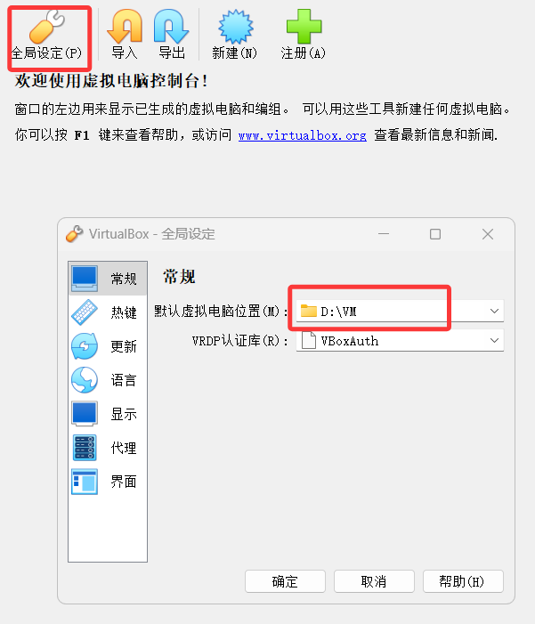

  + 导入镜像

    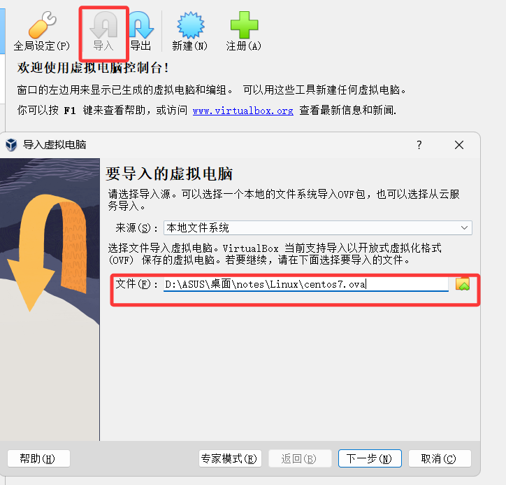

    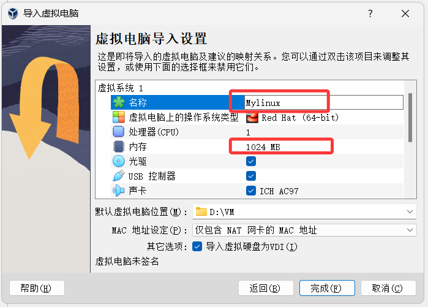

  + 等待导入成功

    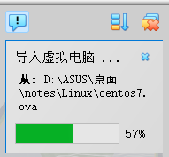

  + 直接双击启动虚拟机

    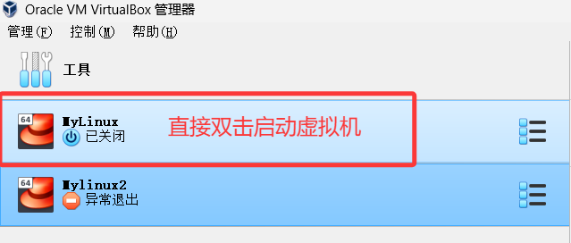

  + 如果出现==错误==，如下：原因是缓存

    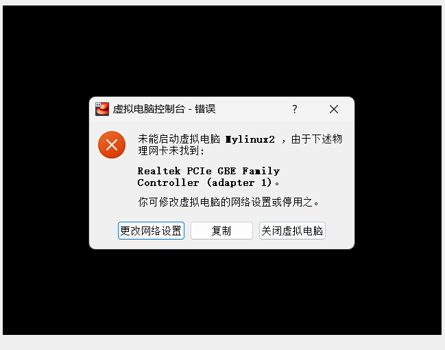

    + 方案一：关闭虚拟机

      + 如果是插网线，就是GBE Family Controller
      + 如果是wifi的话就是 另一个

      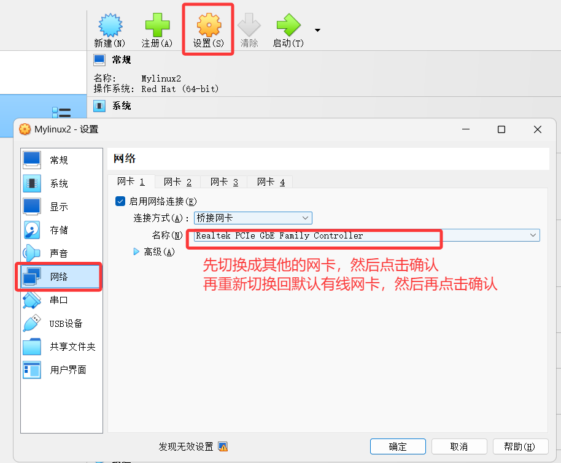

    + 方案二：可以关闭Vbox重新启动

  + 启动虚拟机，不用再进行其他操作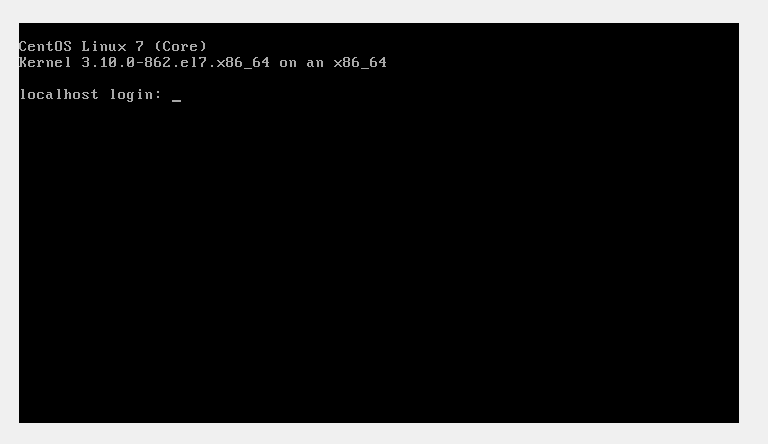

  + 进入这个界面，登录账号：root，密码：123456

+ Xftp+Xshell:类似于Navicat，用于远程连接Linux系统的工具

  + 群文件下载之后，直接解压即可
  + 双击绿化.bat（桌面就会出现两个软件）

+ Xshell操作：连接LInux的工具，操作会更方便，==前提先完成4.1 Linux设置ip地址操作==

  + 打开会话

  + 新建会话

    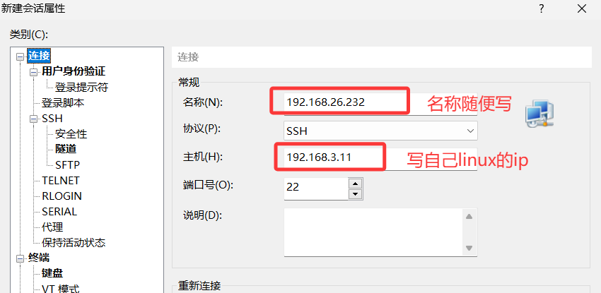

    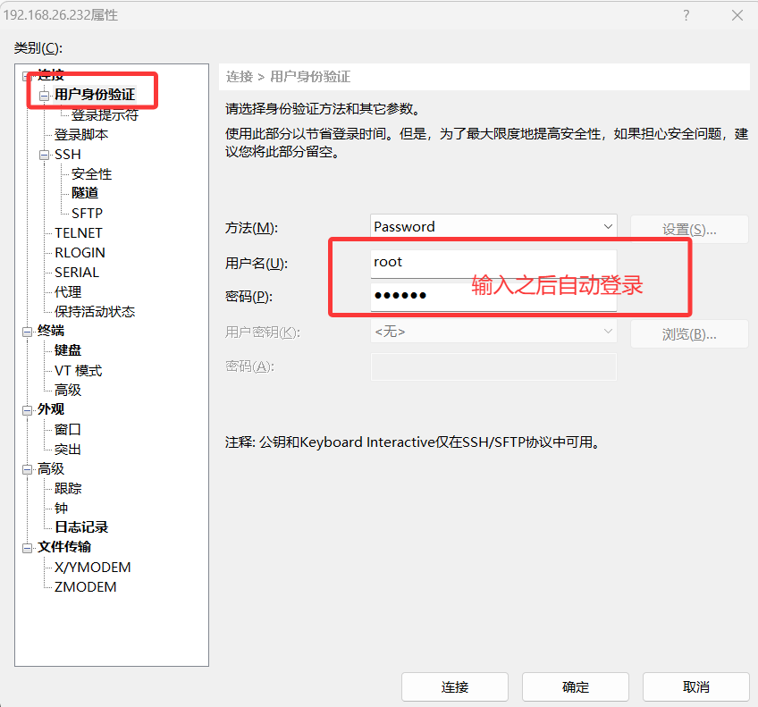


#### 4.1 linux联网 --- Linux设置ip地址

+ 网卡不能选择错了

  + 连接的是有线：设置有线网卡（GBE Family Controller）
  + 连接的是无线：设置无线网卡（Wireless....）

+ 通过windows的命令提示符窗口：ipconfig查看本机ip地址

  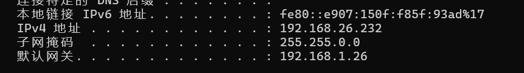

  + ipv4地址：具体计算机ip地址，==同一个网络，ip地址不能重复==

  + 子网掩码：是用来控制是否在同一个网段，linux需要保证和windows一样

    ```java
    //比如：192.168.0.100
    //比如：255.255.255.0
    //那么想保证在同一个网段，设置ip地址192.168.0.(0~254)
    //再比如：255.255.0.0
    //那么设置ip范围192.168.(0~254).(0~254)
    ```

  + 默认网关：linux保证和windows一样，这样windows有网络linux也会有网络

+ 修改Linux的ip地址步骤

  + 进入linux修改网卡的目录

    ```bash
    cd /etc/sysconfig/network-scripts
    ```

  + 查看是否存在网卡（ifcfg-网卡名随机产生的）

    ```bash
    ll 或者 ls
    ```

  + 修改网卡文件（ip地址，子网掩码，网关）

    ```bash
    vi ifcfg-xxxx
    ```

    + 进入之后，先输入`i`表示进入插入模式
    + 再修改网卡里面的内容
      + ip： 192.168.3.11
    + 按下==ESC==退出插入模式
    + `:q` 退出 `:w`保存 `:wq`保存退出

  + 通过命令重启网络，看到就是OK就可以了

    ```bash
    service network restart
    ```

    

### 5.Linux系统目录结构

- /：表示最顶层目录，根目录
  - bin：用于存放用户的二进制文件，命令文件（比如：cd、ls、ping ......）
  - boot：引导程序的文件，加载系统使用
  - dev：设备文件，比如：linux连接的不同终端（触摸屏、移动端、USB）
  - ==etc==：配置文件目录，所有配置文件都在这里，比如：配置ip地址，环境变量，防火墙
  - home：存储普通用户的个人文件夹
  - root：linux超级管理员账号，等价于windows的Adminstrator
  - lib：系统库文件
  - ==usr==：存放用户级目录，用户安装软件一般都在这里安装
  - proc：是一个进程目录
  - mnt：用于挂载文件系统的地方，比如：windows会自动加载U盘，linux需要通过命令加载类似的资源
  - ......


### 6.Linux常用命令  ---重点背、面试题

#### 6.1 通用命令

- shutdown -h now：关闭系统
- reboot：重启
- logout：注销
- clear：清空界面
- ifconfig：查看ip地址
  - ip addr：查看ip地址
- pwd：查看当前包的工作空间（查看包的完整地址）
- cd：切换目录
  - `cd .`：表示进入当前目录
  - `cd ..`：表示返回上一级
  - `cd -`：表示返回上次目录，类似于windows返回
- ls：查看目录下文件名
  - ls -l：也可以查看详细信息
- ll：查看目录下每个文件的详细信息（权限，大小，拥有者，时间，文件名）
- mkdir：创建目录，如果父级目录不存在，创建失败
  - mkdir -p：可以实现逐级创建
- vi：可以查看和创建文件，可以编辑，如果查看文件不存在，则创建文件
- rmdir：删除空目录
- rm：删除文件
- rm -rfv：递归删除，r表示递归，f强制，v展示
- cp [文件名] [复制到的位置]：复制文件
  - cp -r：递归复制目录
- mv：
  - 可以是重命名（修改的新文件和源文件在同一个目录下）
  - 也可以是剪切（如果处于不同的目录）
- ps -aux：查看系统中所有进程的信息
- ps -ef | grep [进程名]：查看指定进程信息 | 称之为管道，grep表示要搜索


#### 6.2 查看命令

- vi：就包含了查看文件的功能

- cat：查看文件的全部内容

- tail -数字：动态显示文件的后几行内容，一般用于查看服务器日志

- head -数字：动态显示文件前几行内容

- more -数字：动态分页显示，指定内容，数字表示每页多少行，ctrl+b/f切换上下一页

- grep：查看文件中的指定内容

  ```bash
  grep 'Exception' /aa/bb/xxx.log
  ```

- cat 也可以结合grep搜索

  ```bash
  cat 指定文件 | grep '内容'
  ```


#### 6.3 打包压缩命令

- tar [操作类型] [操作选项]
  - 操作类型：
    - -c：建立压缩文档
    - -x：解压文件
    - -t：查看压缩文档的内容
    - -r：向压缩文档追加新内容
    - -u：更新压缩文档
  - 操作选项：
    - -z：有gzip属性的，可选的
    - -j：有bz2属性的，可选的
      - 如果不写：默认格式都是tar格式
    - -v：显示所有过程的视图，可选的
    - -f：使用文档名称，一般压缩还是解压，是最后一个参数，是==必加项==

``` bash
#压缩和压缩命令案例：
#1.解压文件 -C大写C表示指定，解压后的路径
tar -xvf xxx.tar -C /aa/xxx/

#2.压缩文件
tar -cf 压缩包名称 /aa/bb

#3.展示压缩包
tar -tf my.tar

#4.追加新文件
tar -rf my.tar xxx.txt

#5.更新文件到压缩包
tar -uf my.tar xxx.txt
```


#### 6.4 用户相关命令

+ useradd：用于添加账号
  - 可选：
    - -u：指定uid，不指定有默认值，当前id最大值+1
    - -g：指定组id，不指定默认值和uid是一致的

- passwd：给用户设置密码的

  比如：passwd 账户名，回车后让你输入密码

- userdel：删除用户

- su 账户名：用于切换账号，管理员root可以任意切换账号，其他账号切换需要输入密码

==注：创建或者删除命令，需要管理员帐号才有效==

​	

#### 6.5 权限命令

+ chmod：用于改变文件或目录的使用权限
  + linux表示权限只有三个类型
    + r：读取，对应值4
    + w：写入，对应值2
    + x：执行，对应值1


```bash
#1.写法1：u创建者，g所属组，o其他用户
chmod u=rwx,g=rw,o=r 文件或目录

#写法2：修改用户权限
chmod u-x,g-r,o+w 文件或目录

#写法3：可以直接通过数值，来进行授权
chmod 731 文件或者目录
```


#### 6.6 防火墙命令语法：systemctl 关键字 firewalld

- systemctl enable firewalld：启用防火墙（只有启用之后才是真正生效）
- systemctl disable firewalld：禁用防火墙

+ systemctl restart firewalld：开启防火墙
+ systemctl stop firewalld:关闭防火墙
+ systemctl status firewalld: 查看防火墙状态

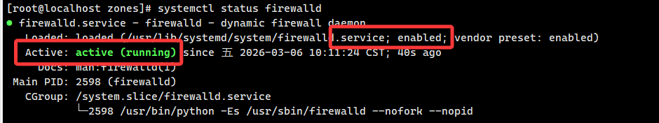


### 7.Linux搭建tomcat服务器部署 --- 面试题

#### 7.1 环境的准备

##### 7.1.1 linux安装和配置jdk环境变量

+ 下载jdk，可以在官网下载，也可以通过linux命令下载

+ 安装jdk

+ 打开并编辑，环境变量文件

  ```bash
  vi /etc/profile
  #添加两组配置
  export JAVA_HOME=/usr/local/jdk8
  export CLASSPATH=.:%JAVA_HOME%/lib/dt.jar:%JAVA_HOME%/lib/tools.jar
  
  #最后再path变量，后面追加java home
  export PATH=$PATH:$JAVA_HOME/bin
  ```

  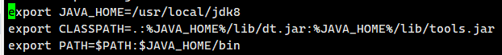

+ 刷新配置

  ```bash
  source /etc/profile
  ```

+ 测试

  ```bash
  java -version
  javac -version
  ```

  

##### 7.1.2 防火墙如何开发端口

防火墙是系统的安全机制，以后项目上线时，必须要开防火墙的，但是这样其他应用程序就无法被启用用户访问，所以需要设置端口对外开放，再开防火墙系统就会安全

- 通过vi对于防火墙配置文件进行编辑

  ```bash
  vi /etc/firewalld/zones/public.xml
  ```

- 每需要开放一个端口，只需要一组rule标签即可

  ```xml
  <rule family="ipv4">
  	<port protocol="tcp" port="9999"/>
  	<accept/>
  </rule>
  <rule family="ipv4">
  	<port protocol="tcp" port="3306"/>
  	<accept/>
  </rule>
  ```

- 配置修改后，需要重启防火墙，才会生效

- 测试：开启之后，测试是否该端口的程序

​	

#### 7.2 linux部署war包

- 前提1：数据库mysql必须开放远程访问（window安装mysql，linux部署服务器）

- 前提2：防火墙..

- 前提3：后端项目，数据库访问不能写localhost需要写windows的ip地址

  1.利用maver对项目进行打包（war）

  2.linux通过tar命令解压出tomcat服务器

  3.利用xftp将windows的war包传输到linux中的tomcat目录（webapps）

  - 如果有项目前缀，修改war包的名字，他就是前缀

  - 如果不需要前缀，修改war包的名称，变成ROOT.war

    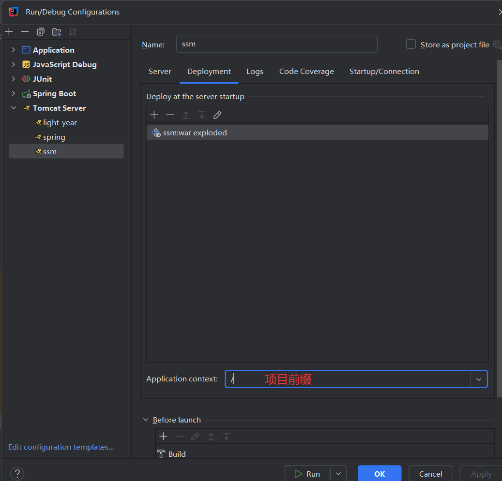

  4.修改端口号tomcat目录——>conf——>server.xml

  

  5.启动项目，tomcat目录--->bin---->startup.sh

  ```bash
  #可以再linux中输入下面指令，获取服务器资源，查看项目是否成功编译
  wget -O- http://localhost:9999
  ```

  6.测试：地址栏输入`linux的ip地址:端口号`
  
  7.关闭服务器，tomcat目录--->bin--->shutdown.sh
  
  - ps -ef | grep tomcat 查看进程信息
  - 也可以通过kill -9 进程id


#### 7.3 linux部署jar包

- 前提：注释pom.xml文件中skip标签，否者找不到主类

  ```xml
  <plugin>
                  <groupId>org.springframework.boot</groupId>
                  <artifactId>spring-boot-maven-plugin</artifactId>
                  <version>${spring-boot.version}</version>
                  <configuration>
                      <mainClass>com.sc.springboot.SpringbootApplication</mainClass>
                      <!--这个要注释，否则打包之后找不到主类-->
                      <!--<skip>true</skip>-->
                  </configuration>
     </plugin>
  ```

- 利用maven将项目打成jar包

- 通过Xftp传递jar包到linux中（位置可以自定义）

- 通过命令启动

  ```bash
  java -jar xxx.jar （ctrl+c关闭服务器）
  java -jar xxx.jar & （ctrl+c后台运行）
  #如果端口号被使用,可以是使用下面命令
  java -jar -Dserver.port=xxxx xxx.jar
  #可以使用
  ps -ef | grep springboot 查看时候在后台运行
  ```
  


#### 7.4 vscode中vue项目，如何打包部署  ---了解

+ vue build：用于将vue项目转换成html和css文件
+ 利用Hbuildx将这些html和css文件，打包成apk文件，或者ios文件
+ 把这些打包好的文件，放入对应手机安装即可
  - 注：手机网络，需要和linux部署的后端，是联通的


### 8.Linux安装mysql

#### 8.1 先保证Linux是联网状态，修改ip地址

windows如果有网络，虚拟机是设置桥接网卡，linux的网关gateway改成和windows一致即可

- ping www.baidu.com


#### 8.2 再查看是否安装过mysql，然后卸载mysql

```bash
#查看版本 mariadb是属于mysql分支
rpm -qa | grep mariadb

#假设出来：mariadb-libs-5.5.56-2.el7.x86_64
#说明安装过，要卸载
##命令：rpm -e --nodeps (上面的软件)
rpm -e --nodeps mariadb-libs-5.5.56-2.el7.x86_64
```


#### 8.3 下载安装mysql

- 下载并安装mysql：下载过程中，需要输入y确认

  ```bash
  #mysql 5
  yum install https://dev.mysql.com/get/mysql57-community-release-el7-9.noarch.rpm
  #mysql 8
  yum install https://dev.mysql.com/get/mysql80-community-release-el7-3.noarch.rpm
  ```

- 命令安装启动mysql服务（/var/log/mysqld.log）

  ```bash
  #安装
  yum install -y mysql-server --nogpgcheck
  #如果下载失败，试试下面的命令
  yum install mysql-community-server
  #启动
  systemctl start mysqld.service
  #查看是否开启mysql
  systemctl status mysqld
  ```

- 查看命令查找mysql初始密码

  ```bash
  cat /var/log/mysqld.log | grep localhost
  #搜索到密码:
  root@localhost: p(%N>!T6AW?h    ao7GR>B!aG?i
  ```

- 使用这个密码登录mysql服务器，默认身份是localhost

  ```bash
  #mysql -u账号（默认是root） -p
  mysql -uroot -p
  #如果要登录其他系统的，mysql -h ip地址 -uroot -p
  ```

- 进入mysql服务之后，会强制要求你修改mysql密码，默认规则很严格：必须有大写小写，数字还有特殊符号

  ```sql
  #alter user 'root'@'localhost' identified by '新密码';
  alter user 'root'@'localhost' identified by 'ilovechina*YZG1109';
  ```

- 查看mysql默认密码策略

  ```sql
  mi'mshow variables like 'validate_password%';
  
  #显示一下内容
  mysql> show variables like 'validate_password%';
  +-------------------------------------------------+--------+
  | Variable_name                                   | Value  |
  +-------------------------------------------------+--------+
  | validate_password.changed_characters_percentage | 0      |
  | validate_password.check_user_name               | ON     |
  | validate_password.dictionary_file               |        |
  | validate_password.length                        | 8      |
  | validate_password.mixed_case_count              | 1      |
  | validate_password.number_count                  | 1      |
  | validate_password.policy                        | MEDIUM |
  | validate_password.special_char_count            | 1      |
  +-------------------------------------------------+--------+
  8 rows in set (0.00 sec)
  ```

  + policy：用于设置密码验证级别

    - LOW（0）：只会验证长度，对应0

    - MEDIUM（1）：验证长度，数字，大小写，特殊字符，对应1

    - STRONG（2）：验证长度，数字，大小写，特殊字符，字典文件，对应2

  + length：设置密码长度

  ```sql
  set global validate_password.policy=0;
  set global validate_password.length=4;
  #如果设置失败，还要设置validate_password.check_user_name=OFF,这个会检查用户名和密码是否相同
  set global validate_password.check_user_name=OFF;
  #重新设置密码
  alter user 'root'@'localhost' identified by 'root';
  ```

- 开启远程访问（创建远程用户）

  ```sql
  #create user root@'%' identified by '密码';
  create user root@'%' identified by 'root';
  ```

- 给远程用户授权

  ```sql
  #权限名；select insert update index alter view ...
  #all privileges:可以表示所有权限
  grant 权限名 on 数据库.表 to 账号@主机
  
  #案例：给账号root授权所有数据库的所有表的所有权限
  grant all privileges on *.* to root@'%';
  ```

- windows的navicat远程连接Linux的mysql

  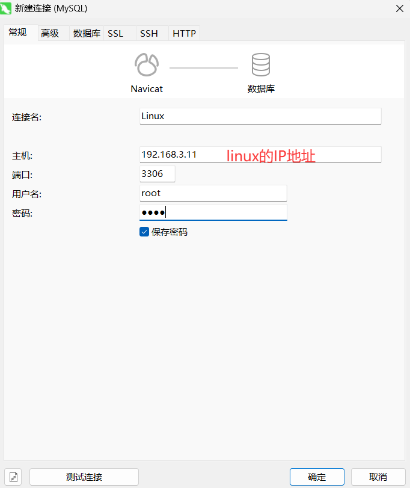


### 9.mysql备份和还原

#### 9.1 手动备份

```sql
#语法
mysqldump -u账号 -p密码 --default-character-set=utf8 -B 数据库名(也可以写多个) > 生成备份文件的地址
#语法： -B 后面添加数据库名， --all-databases:表示所有数据库
#案例：
#解析：my.$(date +%F).sql生成 my.2026-xx.sql
mysqldump -uroot -proot --default-character-set=utf8 -B sc251001 > /usr/local/sql/my.$(date +%F).sql
```

输出如下：

```bash
[root@localhost sql]# mysqldump -uroot -proot --default-character-set=utf8 -B sc251001 > /usr/local/sql/my.$(date +%F).sql
mysqldump: [Warning] Using a password on the command line interface can be insecure.
[root@localhost sql]# ls
my.2026-03-06.sql
[root@localhost sql]# 
```

- 还原数据库

  ```bash
  
  ```

  

#### 9.2 自动定期备份

在centos7系统一般可以使用 cron job，来实现定时备份的功能，本身是一种定时任务，类似于js中的setTimeout，负责定时任务调度，它会自动执行任务，比如：配置好每天凌晨12点，自动备份数据库

- 先编辑cron job配置文件

  ```bash
  vi /etc/crontab
  ```

- 配置文件末尾，添加一行代码，表示定时任务，原来的内容不要动

  ```properties
  # .---------------- minute (0 - 59)
  # |  .------------- hour (0 - 23)
  # |  |  .---------- day of month (1 - 31)
  # |  |  |  .------- month (1 - 12) OR jan,feb,mar,apr ...
  # |  |  |  |  .---- day of week (0 - 6) (Sunday=0 or 7) OR sun,mon,tue,wed,thu,fri,sat
  # |  |  |  |  |
  # *  *  *  *  * user-name  command to be executed
  
  #案例1：Linux账号root每天18：10备份
  10  18  *  *  * root mysqldump -uroot -proot --default-character-set=utf8 -B sc251001 > /usr/local/sql/my.$(date +\%Y\%m\%d-\%H:\%M:\%S).sql
  #案例2：每分钟备份一次
  */1  *  *  *  * root mysqldump -uroot -proot --default-character-set=utf8 -B sc251001 > /usr/local/sql/my.$(date +\%Y\%m\%d-\%H:\%M:\%S).sql
  ```

- 重启cron服务，让配置生效

  ```bash
  systemctl restart crond
  ```

#### 9.3 还原数据库

```bash
source /usr/local/sql/my.2026-03-06.sql
```


### 10.Redis --- LInux

#### 10.1 连接redis

1. 检查redis是否安装

   ```bash
   ls /usr/local/redis-5.0.3/src/redis-cli
   ```

2. 确认redis是否在运行（如果运行了，直接跳到第4步）

   ```bash
   ps -ef | grep redis-server
   ```

3. 启动redis服务器（守护线程模式）

   ```bash
   /usr/local/redis-5.0.3/src/redis-server /usr/local/redis-5.0.3/redis.conf --daemonize yes
   ```

4. 连接redis（使用redis-cli）

   ```bash
   /usr/local/redis-5.0.3/src/redis-cli
   ```

5. 停止redis

   ```bash
   /usr/local/redis-5.0.3/src/redis-cli shutdown
   ```

   


