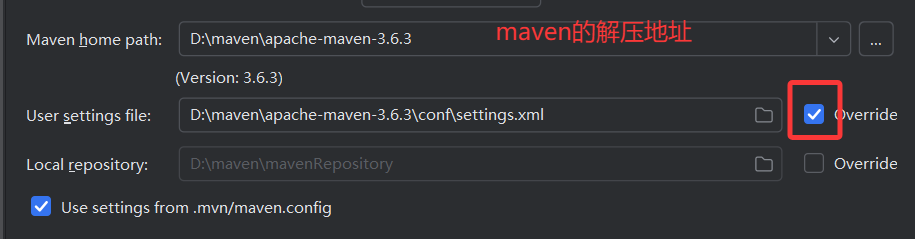
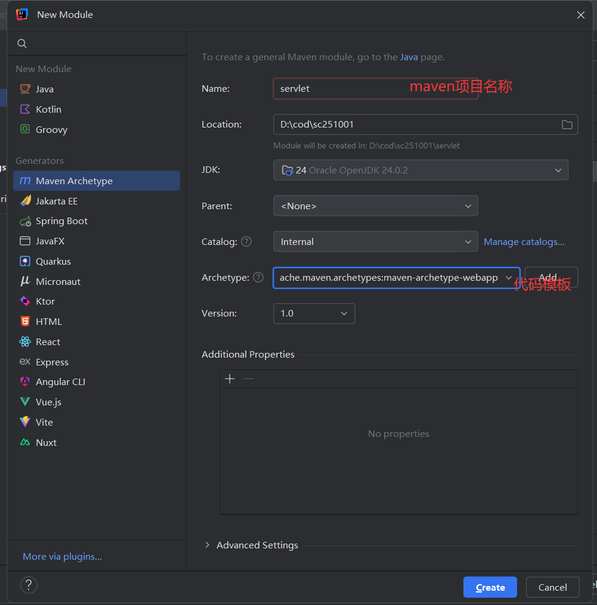
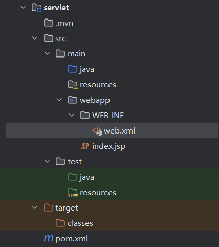
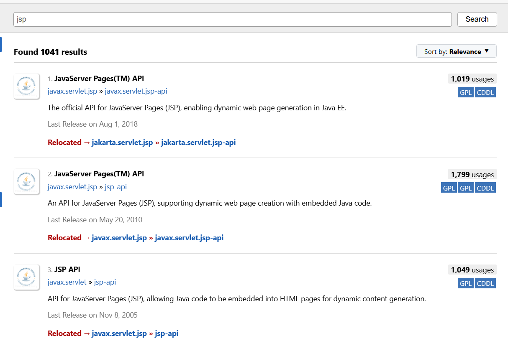
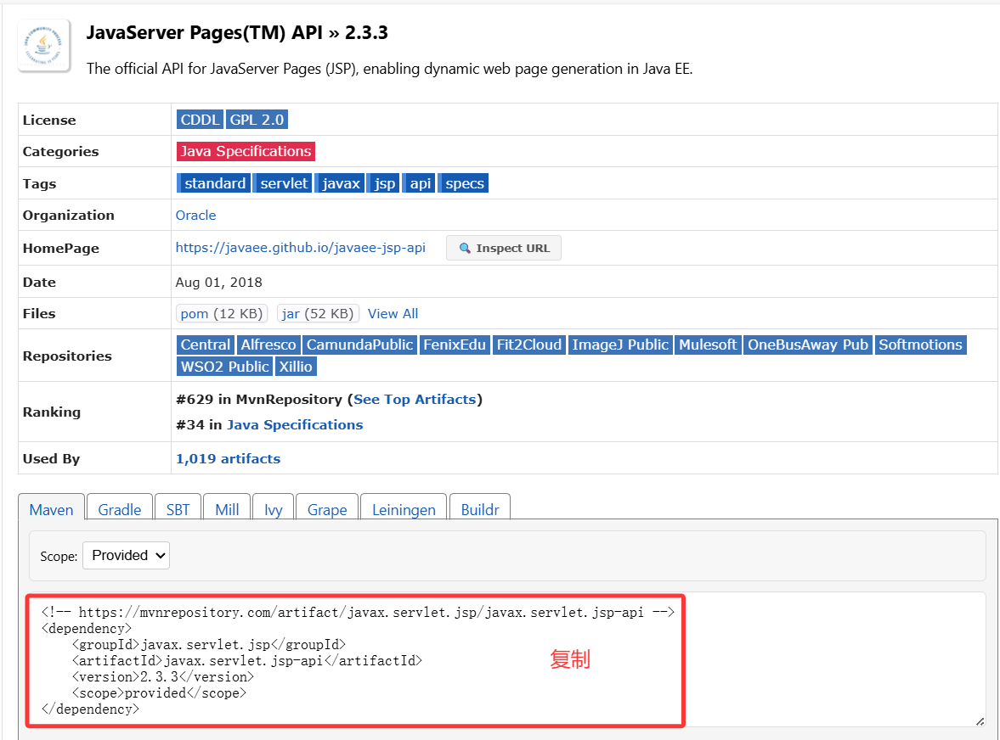
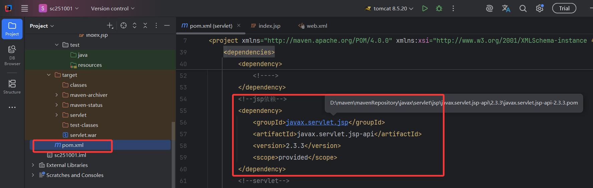
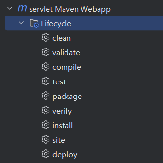
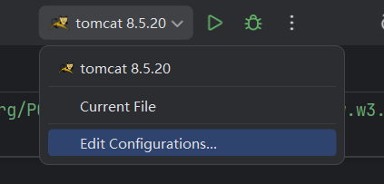
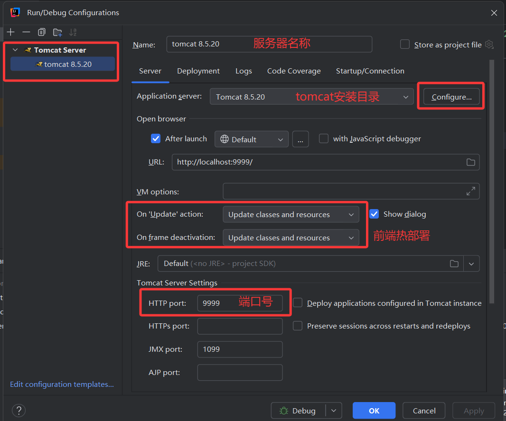
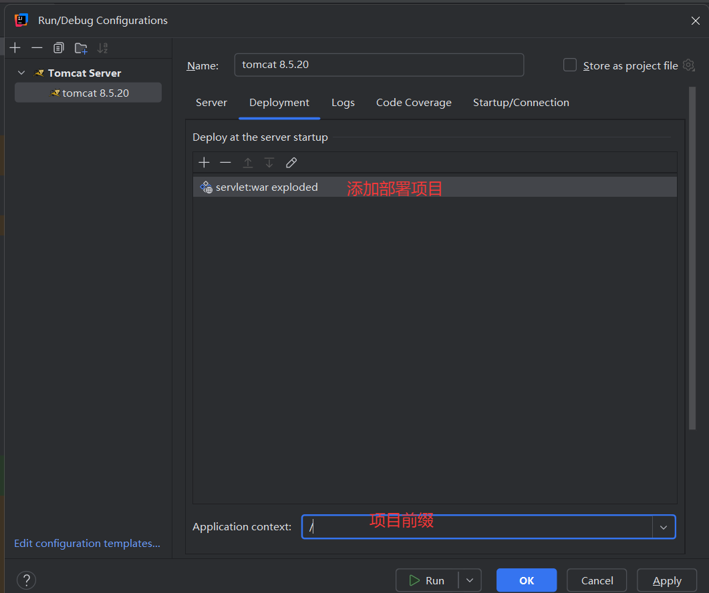

## maven

### 1. 什么是Maven

maven是基于项目对象模型（pom: project Object model）的 **项目构建** 和 **依赖管理** 工具，是为了管理整个项目生命周期的

（项目创建---->项目使用--->项目打包）--------maven负责

​										⬇

​                   web服务器发布	------------------------tomcat负责

> 下载网址：https://archive.apache.org/dist/maven/maven-3


#### 1.1 Maven 的核心作用总结为三点：

1. **依赖管理**
   自动下载和管理项目所需的库（jar包），解决版本冲突。
2. **构建工具**
   提供标准化的项目构建流程（编译、测试、打包、部署等），一行命令即可完成。
3. **项目标准化**
   统一的项目结构和配置约定（POM.xml），方便团队协作和项目维护。

本质：让 Java 项目的构建和管理更自动化、标准化。


### 2.使用maven前需要的配置

- 群文件下载，解压maven

- 配置：conf中的settings.xml（maven的唯一配置文件）

  - 本地仓库：是在本地磁盘备份一次，在远程仓库下载的相关jar包（相关依赖），目的是为了下一次如果再次使用重复的依赖，无需下载直接使用

    ```xml
    <!-- 配置本地仓库 -->
    <localRepository>D:\maven\mavenRepository</localRepository>
    ```

    

  - 远程仓库：maven默认对外提供的仓库地址，提供了所有java项目需要用到的jar（依赖），但是面向的是全球，由于需要翻墙，所以一般国内一些大型企业会配置私人服务器，也下载了里面所有的jar（依赖），这样开发人员只需要连接国内的服务器即可，推荐：阿里云远程仓库

    ```xml
    <!--配置远程仓库位置-->
        <mirror>
          <id>alimaven</id>
          <name>aliyun maven</name>
          <url>http://maven.aliyun.com/nexus/content/groups/public/</url>
          <mirrorOf>central</mirrorOf>        
        </mirror>
    ```

  

- 配置maven环境变量：是为了让计算机知道了你安装了maven

  - 环境变量添加两组变量MAVEN_HOME和M2_HOME,值写maven解压地址

  - 同时Path变量追加两组织

    ```
    %MAVEN_HOME%\bin
    %M2_HOME%\bin
    ```

    老版：path变量拉到最后，添加;表示要添加下一组

    ```
    ;%MAVEN_HOME%\bin;%M2_HOME%\bin
    ```

  

- 测试：cmd命令：`mvn -version`（依赖于java的jdk环境)


### 3.通过idea集成maven

file----->setting ------>搜索maven




### 4.创建maven项目 ---重点

+ ctrl+shift+alt+s：创建新的模块

- 选择maven项目，找到正确的代码模板




### 5.maven项目目录结构




+ ==src==：源码目录

  + main ：java和resources和webapp都是根目录，因为服务器会编译项目，把他们三个编译成同一个目录
    + java：存放java源代码目录
    + resources：存放配置文件的目录
    + webapp：存放前端资源（页面、css、js、图片、视频...）
      + WEB-INF：这个包的资源不对外共享，只能通过服务器转发访问
        + web.xml：web项目的配置文件，Tomcat服务器启动会默认加载它
      + index.jsp：JSP 页面（可直接放在`webapp`下，浏览器可访问）
  + test:
    + java：存放测试代码，比如：junit单元测试
    + resources：存放测试的配置文件

  

+ target：Maven构建（编译，打包）后生成的输出目录

  + 后续打包（比如：war包）会生成在这个目录下，解压也在这个目录下

  

+ ==pom.xml==：整个maven用于管理项目生命周期的配置文件，非常重要


### 6.pom.xml文件介绍

```XML
<!--    根节点只有一个
html 超文本标记语言  <p>段落  <a>链接
xml 可扩展标记语言 <a>  <b>  <c>...标签可以随便写
xml 被json取代，数据传输，  目前xml基本用于框架的配置文件
约束：就是一段网址，规定了这个xml可以写哪个根节点，写哪些子标签
-->
<project xmlns="http://maven.apache.org/POM/4.0.0" xmlns:xsi="http://www.w3.org/2001/XMLSchema-instance"
         xsi:schemaLocation="http://maven.apache.org/POM/4.0.0 http://maven.apache.org/maven-v4_0_0.xsd">
    <modelVersion>4.0.0</modelVersion>
    <!--组id：写公司域名倒序  com.公司简称.部门简称 -->
    <groupId>com.sc</groupId>
    <!--项目名称-->
    <artifactId>servlet</artifactId>
    <!--打包方式
        jar：将项目打成xxx.jar   一般javaSE项目，springboot项目
        war：将项目打成xxx.jar   web项目一般都是war包(servlet，SSM)
        pom：聚合项目   一般来说父项目才会设置成pom类型，
            因为他不会编译打包，用于给子项目继承，子项目就无需导入一些重复的jar(依赖)
    -->
    <packaging>war</packaging>
    <!--版本号：默认是1.0随着后期，功能拓展，可以修改版本号-->
    <version>1.0-SNAPSHOT</version>
    <!--右边显示的maven的名称，不重要-->
    <name>servlet Maven Webapp</name>
    <url>http://maven.apache.org</url>
    <!--重点1：配置一些通用版本号和配置一些通用属性-->
    <properties>
        <!--通用属性，设置编码方式和项目的编译版本-->
        <project.build.sourceEncoding>UTF-8</project.build.sourceEncoding>
        <maven.compiler.source>1.8</maven.compiler.source>
        <maven.compiler.target>1.8</maven.compiler.target>
        <!--通用版本号：标签可以任意写  下面使用的时候：${标签名}-->
        <junit.version>3.8.1</junit.version>
    </properties>

    <!--重点2：dependencies用于存放去项目使用的依赖（jar）
        每一个dependencies标签就是一个依赖
    -->
    <dependencies>
        <dependency>
            <groupId>junit</groupId>
            <artifactId>junit</artifactId>
            <version>${junit.version}</version>
            <!--scope标签：用于指定jar的作用域
                test:指定测试范围有效，编译和打包不会使用该依赖
                provided:表示已提供，比如：jsp和servlet，
                        服务器自带的包，打包时就不会使用该依赖
                compile:默认方式，可以省略，编译范围有效，打包也会使用该依赖
                runtime:运行时依赖，编译时不依赖
            -->
            <scope>test</scope>
            <!---->
        </dependency>
        <!--jsp依赖-->
        <dependency>
            <groupId>javax.servlet.jsp</groupId>
            <artifactId>javax.servlet.jsp-api</artifactId>
            <version>2.3.3</version>
            <scope>provided</scope>
        </dependency>
        <!--servlet-->
        <dependency>
            <groupId>javax.servlet</groupId>
            <artifactId>javax.servlet-api</artifactId>
            <version>4.0.1</version>
            <scope>provided</scope>
        </dependency>
        <!--jstl依赖-->
        <dependency>
            <groupId>javax.servlet</groupId>
            <artifactId>jstl</artifactId>
            <version>1.2</version>
        </dependency>
        <!--mysql依赖 对应你的数据库-->
        <dependency>
            <groupId>mysql</groupId>
            <artifactId>mysql-connector-java</artifactId>
            <version>8.0.28</version>
        </dependency>
    </dependencies>
    <build>
        <!--项目编译后的名称 war包名称-->
        <finalName>servlet</finalName>
        <!--插件：package打包功能报错--> 
        <plugins>
            <plugin>
                <groupId>org.apache.maven.plugins</groupId>
                <artifactId>maven-war-plugin</artifactId>
                <version>3.2.0</version>
            </plugin>
        </plugins>
    </build>
</project>

```


### 7.如何手动下载maven依赖

+ 通过maven远程仓库去搜索（jsp，servlet，jstl，mysql驱动包）

  > https://mvnrepository.com/

+ 选择对应的版本号

  

+ 复制出来的dependency标签

  

+ 粘贴到maven项目中的pom.xml中，==dependencies==标签里

  


### 8.maven常用命令

Lifecycle ---->命令----->双击


> + clean：清理项目，会把项目编译后的东西删除
> + validate：验证项目，是否正确，是否可以完成项目构建
> + compile：编译项目
> + test：运行测试代码
> + package：将项目打包，根据pom.xml中pageaging标签决定的
> + install：安装命令，将网上一些没有开源的包，安装到本地仓库，oracle驱动包不对外共享的，所以需要安装


## Tomcat

tomcat是一个开源的轻量级的web服务器网站，目前在中小型企业中广泛使用，tomcat默认支持1000左右的并发量，后期也可以搭建集群，是目前java开发的首选

### 1.1tomcat目标结构

- ==bin==：存放一些可执行文件，启动和关闭服务器脚本文件

  ```
  Windows系统：startup.bat	shutdown.bat
  Linux：		startup.sh	shutdown.sh
  ```

  

- ==conf==：存放tomcat配置文件目录 *.properties    *.xml

  ```
  server.xml：非常重要，修改编码方式，修改端口号
  web.xml：比较重要，tomcat全局设置，session会话时间
  
  <Connector port="9999" protocol="HTTP/1.1"
             connectionTimeout="20000"
             redirectPort="8443" />
  ```

  

- lib：存放tomcat运行需要的依赖或者jar

- ==logs==：存放日志文件，后期可以通过日志查询服务器报错情况

- temp：存放临时文件

- ==webapps==：存放要部署的项目位置，war包要放入此目录，只要服务器启动，会自动解压，自动部署

- work：存放项目中jsp编译后的文件（servlet）和一些缓存文件


### 1.2tomcat部署项目的过程

+ 准备好的项目的war包（通过maven...）

+ 修改tomcat端口号（主要是为了防止端口号冲突）

  + conf中的server.xml

+ 把war包复制到webapps里面

+ 通过bin目录下（startup.bat、shutdown.bat）启动和关闭tomcat

  > bug：有的同学启动tomcat会闪退，原因在于jdk环境变量没有配置正确

+ 通过浏览器发送一个请求（url）访问项目服务器部署的项目

  > 协议://IP地址:端口号/项目前缀/项目资源
  >
  > http://localhost:9999/servlet/index.jsp


### 1.3idea集成tomcat






