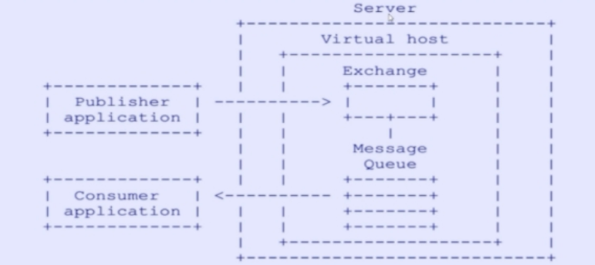
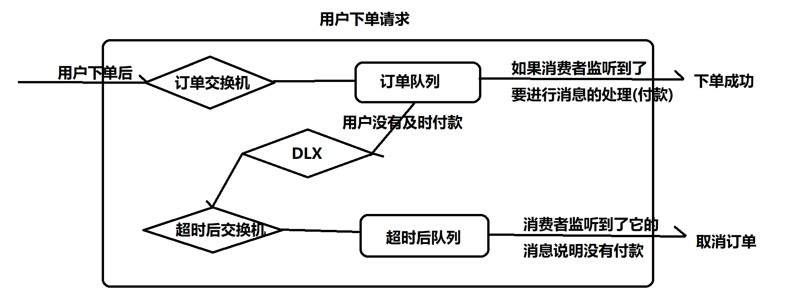

## RabbitMQ

### 1.什么是MQ

MQ全程message queue（消息队列）是一种可以实现程序和程序之间的通讯方式（比如：java项目可以和c语言项目进行通信），程序只需要读写队列中的消息即可；通常消息的发送者称之为生产者，消息的接收方称之为消费者，遵循先进先出的特性（FIFO），也称之为它是消息中间键


### 2.MQ应用场景

MQ适合不需要立即返回，而且特别耗时的操作，可以通过MQ异步处理

- 支付功能：淘宝，京东，拼多多，下单之后，要进行订单支付，需要等待用户付款结束后，才能执行后续流程（比如：发货），等待用户付款过程中，其他功能不受影响
- 验证码：邮件验证码，短信验证码（服务器生成验证码，通过第三方平台，发送到你手机里，用户收到了消息，就可以输入验证码，走后续流程）
- 保证redis和mysql数据一致性：更新mysql后，可以向MQ发送一个消息，消费者监听到消息后，才去更新redis
- ......


### 3.常见的MQ

- ActiveMQ：apache出品的，比较早期的MQ，支持高并发，但是容易出现消息堵塞，但是集群模式很好
- Kafka：apache出品的，面向于大数据方向居多，支持多个生产者和消费者，支持很高的并发量
- RocketMQ：阿里出品的，研发思路借鉴于Kafka，目前已经捐给了apache的，是纯java开发的，适合高并发，高吞吐量，大规模的分布式系统，目前：阿里主要应用在交易，充值，流的计算......
- RabbitMQ：是使用erlang语言研发的，开源的，消息代理和队列的服务器，可以使用普通的协议，实现不同程序之间的通信，底层有几个重要的组件（生产者，交换机，队列，消费者），还可以通过不同的消息模型，实现生产者和消费者异步解耦，底层基于AMOP协议，是一种面向消息的，路由队列安全性非常高的协议


### 4.什么是AMOP协议



> - publisher：消息生产者，只负责将消息发送给MQ（交换机或者队列）
>
> - consumer：消息消费者，只负责读取队列的消息
> - virtual host：虚拟地址，消费者和生产者通过该地址，还可以访问MQ中的服务
> - exchange：交换机，只有特定的模式才有交换机，作用：用于将消息发送给和交换机绑定的队列中
> - message Queue：消息队列，存放消息的位置
> - routing key：路由规则（取件码）交换机和队列绑定时，可以设置路由规则，消费者只有提供了正确的路由规则，才可以从队列中获取消息


### 5.RabbitMQ搭建过程

- rabbitMQ下载和安装：百度搜索（类似于redis）

- rabbitMQ命令：service rabbitmq-server 关键字

  - service rabbitmq-server status：查看状态

  - service rabbitmq-server start：开启

  - service rabbitmq-server stop：关闭

  - service rabbitmq-server restart：重启

  - chkconfig rabbitmq-server on：设置开机启动rabbitMQ（linux系统）

    sc config RabbitMQ start= auto：设置开机启动（windows系统）

  - rabbitmq-plugins enable rabbitmq_management：启动web管理界面；

    ==web网址默认的端口=15672；linuxip:15672就可以访问了==

- rabbitmq用户命令：

  - rabbitmqctl list_users：用户查看用户列表

  - rabbitmqctl add_user 账号 密码 ：创建账号

  - rabbitmqctl set_user_tags 账号 administrator：给指定账号添加管理员角色

  - 给指定账号设置权限

    ```
    rabbitmqctl set_permissions -p 虚拟地址(/) 账号 ".*" ".*" ".*"
    ```


### 6.RabbitMQ 五种消息模型 --- 面试题

#### 6.1 环境准备

- 导入依赖

  ```xml
  <!--rabbitmq依赖-->
  <dependency>
  <groupId>com.rabbitmq</groupId>
  <artifactId>amqp-client</artifactId>
  <version>5.14.0</version>
  </dependency>
  <!--springboot mq支持-->
  <dependency>
  <groupId>org.springframework.boot</groupId>
  <artifactId>spring-boot-starter-amqp</artifactId>
  </dependency>
  ```

- 为了测试，准备一个工具类，目的是连接RabbitMQ

  ```java
  //rabbitMQ连接工具类，只用于测试
  public class RabbitUtil {
      public static Connection getConn() {
          ConnectionFactory factory = new ConnectionFactory();
          factory.setHost("192.168.3.11");
          //设置端口号：默认端口号：5672，web端口是15672
          factory.setPort(5672);
          factory.setVirtualHost("/sc251001");
          factory.setUsername("sc251001");
          factory.setPassword("123456");
          Connection conn = null;
          try {
              conn = factory.newConnection();
          } catch (IOException e) {
              throw new RuntimeException(e);
          } catch (TimeoutException e) {
              throw new RuntimeException(e);
          }
          return conn;
      }
  
      public static void main(String[] args) {
          System.out.println(getConn());
      }
  }
  ```

  

#### 6.2 第一种：基本消息模型

一个生产者，发送消息到队列中，一个消费者，去监听这个队列的消息，生产和消费都只有一个

- 生产者代码

  ```java
  //基本消息模型的生产者
  public class Product {
      public static void main(String[] args) throws IOException, TimeoutException {
          //1.创建连接
          Connection conn = RabbitUtil.getConn();
          //2.创建通道：用于传递消息的路径，也用于创建队列和交换机
          Channel channel = conn.createChannel();
          //3.声明队列：通过通道对象才可以声明
          channel.queueDeclare(
                  "basic_queue", //队列名字
                  false, //设置是否持久化
                  false, //设置是否排他（只有声明的人可见）
                  false, //设置是否自动删除
                  null); //参数设置
          //4.发送消息:需要通过通道来传递消息
          for (int i = 0; i < 10; i++) {
              String msg = "hello basic" + i;
              channel.basicPublish(
                      "", //交换机
                      "basic_queue",     //队列名
                      null, //参数设置
                      msg.getBytes() //消息
              );
              System.out.println("发送消息成功：" + msg);
          }
          //5.关闭资源（连接和通道）
          channel.close();
          conn.close();
      }
  }
  ```

- 消费者代码

  ```java
  //基本消息模型的消费者
  public class Consumer {
      public static void main(String[] args) throws IOException {
          //前三步跟生产者相同
          Connection conn = RabbitUtil.getConn();
          Channel channel = conn.createChannel();
          channel.queueDeclare(
                  "basic_queue", //队列名字
                  false, //设置是否持久化
                  false, //设置是否排他（只有声明的人可见）
                  false, //设置是否自动删除
                  null); //参数设置
          //4.定义消费者对象（处理消息的方法，为了监听消息）
          DefaultConsumer consumer=new DefaultConsumer(channel){
              //重写该方法，用于监听队列的消息（只要队列有消息，就会自动执行该方法）
              public void handleDelivery(String consumerTag, Envelope envelope, AMQP.BasicProperties properties, byte[] body) throws IOException {
                  String msg=new String(body);
                  System.out.println("获取到了basic_queue队列的消息"+msg);
              }
          };
          //5.自动ACK（自动确认）
          channel.basicConsume(
                  "basic_queue",//监听的队列名
                  true,//是否是自动ACK消费确认机制
                  consumer//消费者对象
          );
          //消费者不用关，需要一直监听消息
      }
  }
  ```


#### 6.3 消息确认机制（ACK机制） --- 面试题

> 面试题1：什么是消息确认机制？
>
> 面试题2：什么是ACK机制？
>
> 面试题3：rabbitMQ通过什么方式保证消息不丢失？

如果消费者，收到消息之后，还没有来得及使用，突然由于各种原因（宕机，异常，蓝屏.....）那么这种情况就属于消费失败，同时rabbitMQ不清楚，所以消息就丢失了

RabbitMQ需要一个消息确认机制（ACK机制），当消费者收到消息后，要向RabbitMQ发送一个成功的回执（ACK）用于告知MQ已经消费成功，那么如果消费者收到消息后，突然出现故障，也需要向MQ发送一个失败的回执（NACK）用于告知MQ消费失败，则消息可以重回队列，便于下一次获取

==注:前提想实现消息确认机制 必须要手动ACK==


#### 6.4 第二种：工作队列（能者多劳）

一个生产者，负责生产消息到队列，有多个消费者，去监听同一个队列的消息，特点：一个消息只能被一个消费者消费，一般都是平均分配消息的

> 工作队列：还可以设置==能者多劳，前提是必须手动ACK==

- 生产者代码：

  ```java
  //工作队列：生产者
  public class Product {
      public static void main(String[] args) throws IOException, TimeoutException {
          //1.创建连接
          Connection conn = RabbitUtil.getConn();
          //2.创建通道：用于传递消息的路径，也用于创建队列和交换机
          Channel channel = conn.createChannel();
          //3.声明队列：通过通道对象才可以声明
          channel.queueDeclare(
                  "work_queue", //队列名字
                  false, //设置是否持久化
                  false, //设置是否排他（只有声明的人可见）
                  false, //设置是否自动删除
                  null); //参数设置
          //4.发送消息:需要通过通道来传递消息
          for (int i = 0; i < 10; i++) {
              String msg = "work_message" + i;
              channel.basicPublish(
                      "", //交换机
                      "work_queue", //队列名字
                      null, //参数
                      msg.getBytes()//消息
              );
              System.out.println("发送成功" + msg);
          }
          //5.关闭资源
          channel.close();
          conn.close();
      }
  }
  ```

- 消费者1代码：

  ```java
  public class Consumer2 {
      public static void main(String[] args) throws IOException {
          //前三步跟生产者相同
          Connection conn = RabbitUtil.getConn();
          Channel channel = conn.createChannel();
          channel.queueDeclare(
                  "work_queue", //队列名字
                  false, //设置是否持久化
                  false, //设置是否排他（只有声明的人可见）
                  false, //设置是否自动删除
                  null); //参数设置
          //设置能者多劳,消费处理的快，就可以分到更多的消息（需要手动ACK,自动会失效）
          channel.basicQos(1);
          //4.定义消费者对象（处理消息的方法，为了监听消息）
          DefaultConsumer consumer = new DefaultConsumer(channel) {
              //重写该方法，用于监听队列的消息（只要队列有消息，就会自动执行该方法）
              public void handleDelivery(String consumerTag, Envelope envelope, AMQP.BasicProperties properties, byte[] body) throws IOException {
                  String msg = new String(body);
                  System.out.println("获取到了work_queue队列的消息" + msg);
                  try {
                      Thread.sleep(1000);
                  } catch (InterruptedException e) {
                      throw new RuntimeException(e);
                  }
                  //手动编写消费成功
                  channel.basicAck(envelope.getDeliveryTag(), false);
  //                channel.basicNack();//消费失败
              }
          };
          //5.自动ACK（自动确认）
          channel.basicConsume(
                  "work_queue",//监听的队列名
                  false,//是否是自动ACK消费确认机制
                  consumer//消费者对象
          );
          //消费者不用关，需要一直监听消息
      }
  }
  ```

- 消费者2代码：

  ```java
  public class Consumer2 {
      public static void main(String[] args) throws IOException {
          //前三步跟生产者相同
          Connection conn = RabbitUtil.getConn();
          Channel channel = conn.createChannel();
          channel.queueDeclare(
                  "work_queue", //队列名字
                  false, //设置是否持久化
                  false, //设置是否排他（只有声明的人可见）
                  false, //设置是否自动删除
                  null); //参数设置
          //设置能者多劳,消费处理的快，就可以分到更多的消息（需要手动ACK,自动会失效）
          channel.basicQos(1);
          //4.定义消费者对象（处理消息的方法，为了监听消息）
          DefaultConsumer consumer = new DefaultConsumer(channel) {
              //重写该方法，用于监听队列的消息（只要队列有消息，就会自动执行该方法）
              public void handleDelivery(String consumerTag, Envelope envelope, AMQP.BasicProperties properties, byte[] body) throws IOException {
                  String msg = new String(body);
                  System.out.println("获取到了work_queue队列的消息" + msg);
                  try {
                      Thread.sleep(2000);
                  } catch (InterruptedException e) {
                      throw new RuntimeException(e);
                  }
                  //手动编写消费成功
                  channel.basicAck(envelope.getDeliveryTag(), false);
  //                channel.basicNack();//消费失败
              }
          };
          //5.自动ACK（自动确认）
          channel.basicConsume(
                  "work_queue",//监听的队列名
                  false,//是否是自动ACK消费确认机制
                  consumer//消费者对象
          );
          //消费者不用关，需要一直监听消息
      }
  }
  ```

  

#### 6.5 第三种：发布订阅模式（fanout）

一个生产者生产消息到交换机，然后交换机和多个队列进行绑定，那么交换机就可以把消息同时发送给多个队列，而多个消费者只需要监听对应队列的消息

特点：有一个交换机，多个队列，保证一个消息被多个人消费

- 生产者：

  ```java
  package com.sc.springboot.rabbitmq.fanout;
  
  import com.rabbitmq.client.Channel;
  import com.rabbitmq.client.Connection;
  import com.sc.springboot.util.RabbitUtil;
  
  import java.io.IOException;
  import java.util.concurrent.TimeoutException;
  
  //发布订阅模式：生产者
  public class Product {
      public static void main(String[] args) throws IOException, TimeoutException {
          //1.创建连接
          Connection conn = RabbitUtil.getConn();
          //2.创建通道：用于传递消息的路径，也用于创建队列和交换机
          Channel channel = conn.createChannel();
          //3.声明交换机(参数1：交换机名，参数2：类型(fanout,direct,topic))
          channel.exchangeDeclare("fanout_exchange", "fanout");
          for (int i = 0; i < 10; i++) {
              String msg = "fanout message" + i;
              //参数(交换机名，路由key，设置项，消息)
              channel.basicPublish(
                      "fanout_exchange",
                      "",
                      null,
                      msg.getBytes()
              );
              System.out.println("发送成功" + msg);
          }
          channel.close();
          conn.close();
      }
  }
  ```

- 消费者1：

  ```java
  package com.sc.springboot.rabbitmq.fanout;
  
  import ch.qos.logback.classic.turbo.TurboFilter;
  import com.rabbitmq.client.*;
  import com.sc.springboot.util.RabbitUtil;
  
  import java.io.IOException;
  
  public class Consumer1 {
      public static void main(String[] args) throws IOException {
          //前三步跟生产者相同
          Connection conn = RabbitUtil.getConn();
          Channel channel = conn.createChannel();
          channel.queueDeclare(
                  "fanout_queue1", //队列名字
                  false, //设置是否持久化
                  false, //设置是否排他（只有声明的人可见）
                  false, //设置是否自动删除
                  null); //参数设置
          //4.队列和交换机的绑定(队列名，交换机名，路由key)
          channel.queueBind("fanout_queue1", "fanout_exchange", "");
  
          DefaultConsumer consumer = new DefaultConsumer(channel) {
              //重写该方法，用于监听队列的消息（只要队列有消息，就会自动执行该方法）
              public void handleDelivery(String consumerTag, Envelope envelope, AMQP.BasicProperties properties, byte[] body) throws IOException {
                  String msg = new String(body);
                  System.out.println("获取到了fanout_queue1队列的消息" + msg);
              }
          };
          //5.自动ACK（自动确认）
          channel.basicConsume(
                  "fanout_queue1",//监听的队列名
                  true,//是否是自动ACK(消费确认机制)
                  consumer//消费者对象
          );
          //消费者不用关，需要一直监听消息
      }
  }
  
  ```

- 消费者2：跟消费者1一样，只需要改队列名


#### 6.6 第四种：路由模式（direct）

类似于发布订阅模式，也是一个生产者对应一个交换机，对应多个队列，以及多个消费者，区别在于消费者实现交换机和队列绑定时，还指定路由key（路由规则），发送消息也要指定路由key，最后两个key相同时，消息才可以从交换机到达队列

- 生产者代码：

  ```java
  //路由模式：生产者
  public class Product {
      public static void main(String[] args) throws IOException, TimeoutException {
          //1.创建连接
          Connection conn = RabbitUtil.getConn();
          //2.创建通道：用于传递消息的路径，也用于创建队列和交换机
          Channel channel = conn.createChannel();
          //3.声明交换机(参数1：交换机名，参数2：类型(fanout,direct,topic))
          channel.exchangeDeclare("direct_exchange", "direct");
          String[] routingKeys = {"java", "springboot", "js", "vue"};
          for (int i = 0; i < 10; i++) {
              String msg = "direct message:" + i + "路由key" + routingKeys[i % routingKeys.length];
              //参数(交换机名，路由key，设置项，消息)
              channel.basicPublish(
                      "direct_exchange",
                      routingKeys[i % routingKeys.length],
                      null,
                      msg.getBytes()
              );
              System.out.println("发送成功" + msg);
          }
          channel.close();
          conn.close();
      }
  }
  ```

- 消费者1代码：

  ```java
  public class Consumer1 {
      public static void main(String[] args) throws IOException {
          //前三步跟生产者相同
          Connection conn = RabbitUtil.getConn();
          Channel channel = conn.createChannel();
          channel.queueDeclare(
                  "direct_queue1", //队列名字
                  false, //设置是否持久化
                  false, //设置是否排他（只有声明的人可见）
                  false, //设置是否自动删除
                  null); //参数设置
          //4.队列和交换机的绑定(队列名，交换机名，路由key)
          channel.queueBind("direct_queue1", "direct_exchange", "java");
          channel.queueBind("direct_queue1", "direct_exchange", "springboot");
          DefaultConsumer consumer = new DefaultConsumer(channel) {
              //重写该方法，用于监听队列的消息（只要队列有消息，就会自动执行该方法）
              public void handleDelivery(String consumerTag, Envelope envelope, AMQP.BasicProperties properties, byte[] body) throws IOException {
                  String msg = new String(body);
                  System.out.println("获取到了direct_queue1队列的消息" + msg);
              }
          };
          //5.自动ACK（自动确认）
          channel.basicConsume(
                  "direct_queue1",//监听的队列名
                  true,//是否是自动ACK(消费确认机制)
                  consumer//消费者对象
          );
          //消费者不用关，需要一直监听消息
      }
  }
  ```

  

#### 6.7 第五种：主题订阅模式（topic）

相当于路由模式的优化版，核心组件一样的，只不过相比路由模式，它的路由key可以通过通配符的方式，来描述多个

- 通配符`*`：只能匹配一个词，比如：java.*
  - 可以匹配java.html，java.css，不可以匹配：java.a.b
- 通配符`#`：可以匹配一个词或者多个词，比如：java.#
  - 可以匹配：java.html，java.css，java.a.b

- 生产者代码：

  ```java
  //主题订阅：生产者
  public class Product {
      public static void main(String[] args) throws IOException, TimeoutException {
          //1.创建连接
          Connection conn = RabbitUtil.getConn();
          //2.创建通道：用于传递消息的路径，也用于创建队列和交换机
          Channel channel = conn.createChannel();
          //3.声明交换机(参数1：交换机名，参数2：类型(fanout,direct,topic))
          channel.exchangeDeclare("topic_exchange", "topic");
          String[] routingKeys = {"com.sc.mapper", "com.sc.service", "com.sc.controller", "com.sc.service.impl"};
          for (int i = 0; i < 10; i++) {
              String msg = "topic message:" + i + "路由key" + routingKeys[i % routingKeys.length];
              //参数(交换机名，路由key，设置项，消息)
              channel.basicPublish(
                      "topic_exchange",
                      routingKeys[i % routingKeys.length],
                      null,
                      msg.getBytes()
              );
              System.out.println("发送成功" + msg);
          }
          channel.close();
          conn.close();
      }
  }
  ```

- 消费者1代码：

  ```java
  public class Consumer1 {
      public static void main(String[] args) throws IOException {
          //前三步跟生产者相同
          Connection conn = RabbitUtil.getConn();
          Channel channel = conn.createChannel();
          channel.queueDeclare(
                  "topic_queue1", //队列名字
                  false, //设置是否持久化
                  false, //设置是否排他（只有声明的人可见）
                  false, //设置是否自动删除
                  null); //参数设置
          //4.队列和交换机的绑定(队列名，交换机名，路由key)
          channel.queueBind("topic_queue1", "topic_exchange", "com.sc.#");
          DefaultConsumer consumer = new DefaultConsumer(channel) {
              //重写该方法，用于监听队列的消息（只要队列有消息，就会自动执行该方法）
              public void handleDelivery(String consumerTag, Envelope envelope, AMQP.BasicProperties properties, byte[] body) throws IOException {
                  String msg = new String(body);
                  System.out.println("获取到了topic_queue1队列的消息" + msg);
              }
          };
          //5.自动ACK（自动确认）
          channel.basicConsume(
                  "topic_queue1",//监听的队列名
                  true,//是否是自动ACK(消费确认机制)
                  consumer//消费者对象
          );
          //消费者不用关，需要一直监听消息
      }
  }
  ```

- 消费者2代码

  ```java
  public class Consumer2 {
      public static void main(String[] args) throws IOException {
          //前三步跟生产者相同
          Connection conn = RabbitUtil.getConn();
          Channel channel = conn.createChannel();
          channel.queueDeclare(
                  "topic_queue2", //队列名字
                  false, //设置是否持久化
                  false, //设置是否排他（只有声明的人可见）
                  false, //设置是否自动删除
                  null); //参数设置
          //4.队列和交换机的绑定(队列名，交换机名，路由key)
          channel.queueBind("topic_queue2", "topic_exchange", "*.sc.*");
          DefaultConsumer consumer = new DefaultConsumer(channel) {
              //重写该方法，用于监听队列的消息（只要队列有消息，就会自动执行该方法）
              public void handleDelivery(String consumerTag, Envelope envelope, AMQP.BasicProperties properties, byte[] body) throws IOException {
                  String msg = new String(body);
                  System.out.println("获取到了topic_queue2队列的消息" + msg);
              }
          };
          //5.自动ACK（自动确认）
          channel.basicConsume(
                  "topic_queue2",//监听的队列名
                  true,//是否是自动ACK(消费确认机制)
                  consumer//消费者对象
          );
          //消费者不用关，需要一直监听消息
      }
  }
  ```

  

### 7.springboot整合rabbitMQ

- 导入依赖

  ```xml
  <!--rabbitmq依赖-->
  <dependency>
  <groupId>com.rabbitmq</groupId>
  <artifactId>amqp-client</artifactId>
  <version>5.14.0</version>
  </dependency>
  <!--springboot mq支持-->
  <dependency>
  <groupId>org.springframework.boot</groupId>
  <artifactId>spring-boot-starter-amqp</artifactId>
  </dependency>
  ```

- 配置springboot配置文件

  ```yml
  ###rabbitMQ配置
  #ip 端口 账号，密码，虚拟地址
  spring:
    rabbitmq:
      host: 192.168.3.11
  ##默认端口就是5672，可以省略
      port: 5672
      username: sc251001
      password: 123456
      virtual-host: /sc251001
  ```

  

- 创建RabbitMQ配置类 --- 核心 （根据业务功能决定）

  ```java
  import org.springframework.amqp.core.*;
  import org.springframework.amqp.rabbit.connection.ConnectionFactory;
  import org.springframework.amqp.rabbit.core.RabbitTemplate;
  import org.springframework.beans.factory.annotation.Autowired;
  import org.springframework.context.annotation.Bean;
  import org.springframework.context.annotation.Configuration;
  import org.springframework.amqp.core.Queue;
  
  import java.util.HashMap;
  import java.util.Map;
  //Rabbit配置类:重点（根据业务决定）
  //比如：搭建基本消息模型 1生产者springboot项目，2.消费者项目，3.队列
  //  1.配置RabbitTemplate（操作MQ的核心对象）-- 必配项
  //  2.配置队列
  //比如：搭建路由模式 1生产  1~n个消息  1交换机 多个队列  多次绑定
  //  1.配置Rabbit Template（操作MQ的核心对象 ）  --- 必配项
  //  2.配置交换机
  //  3.配置队列（多个需要配置多次）
  //  4.配置队列和交换机的绑定(多个需要配置多次)
  @Configuration
  public class RabbitConfig {
      @Autowired
      private ConnectionFactory factory;
  
      @Bean
      RabbitTemplate rabbitTemplate() {
  
          return new RabbitTemplate(factory);
      }
  
      //====根据需求和消息模型（配置是不同的）
      //====业务需求：通过rabbitmq模拟手机发送短信验证码
      //====消息模型：路由模式
      //配置路由交换机
      @Bean
      DirectExchange codeExchange() {
          return new DirectExchange("code_exchange");
      }
  
      //配置队列
      @Bean
      Queue codeQueue() {
          return new Queue("code_queue");
      }
  
      //定义交换机和路由绑定
      @Bean
      Binding codeBinding() {
          return BindingBuilder
                  .bind(codeQueue()) //队列
                  .to(codeExchange()) //交换机
                  .with("code"); //路由key，随便写，但是生产者发送消息时，必须和这个key一致
      }
  }
  ```

  

- 在业务层注入RabbitTemplate，向MQ发送消息

  ```java
  @Autowired
      private RabbitTemplate rabbit;
  
      @Override
      public boolean sendCode(String phone) {
          try {
              //1.服务端作为消费生产者，生产随机验证码，4位随机整数（任意的）
              Random r = new Random();
              String code = r.nextInt(9000) + 1000 + "";
              //2.发送到手机里（调用第三方平台，需要花钱的）
              //2.模拟：通过rabbitMQ模拟发送到队列（手机）//用户作为消费者
  //        rabbit.convertAndSend("交换机名","路由key",消息（object）);
              Map<String, String> map = new HashMap<>();
              map.put("phone", phone);
              map.put("code", code);
              map.put("title", "思诚科技");
              map.put("content", "短信验证码发送成功，请在30秒内使用");
              rabbit.convertAndSend("code_exchange", "code", map);
              //3 .redis存储验证码，设置30秒有效期
              redis.opsForValue().set(phone, code, 30, TimeUnit.SECONDS);
              return true;
          } catch (Exception e) {
              e.printStackTrace();
              return false;
          }
      }
  ```

  

  - 可以单独创建一个项目来实现消费者，监听MQ消息....

    ```java
    //这个是消费者，和生产者项目是可以独立的
    //前提是：消费者项目，和生产者对应的项目，必须连接在同一个rabbitMQ
    @Component  //IOC扫描注解，让它在spring中存在
    public class CodeConsumer {
    
        //消费者监听注解，只要队列有消息，就会自动执行该方法
        //(监听的队列名，提供监听的实现类)
        //监听的消息只要在方法的形参上编写即可
        @RabbitListener(
                queues = {"code_queue"},
                containerFactory = "rabbitListenerContainerFactory"
        )
        public void getCode(Map<String, String> map) {
            //
            String phone = map.get("phone");//前端输入的手机号，需要满足11位
            String code = map.get("code");
            String title = map.get("title");
            String content = map.get("content");
            String result = "【" + title + "】,您的手机尾号:" + phone.substring(7) + ",验证码:" + code + "," + content;
            System.out.println(result);
        }
    }
    ```

    

### 8.死信队列（订单延迟功能）--- 面试题

死信队列，本质上就是一个特殊的交换机，本身是存在不需要手动创建，主要作用在于，当消息发送到队列中时，如果长时间没有被人消费（死信），那么它就会把消息重新发送到一个新的交换机，做消息延迟后的处理，这个特殊的交换机就是死信队列

- 消息什么情况下会变成死信
  - 消息被拒绝：比如：接受消息时，失败了，同时配置是否重回队列没有设置好，设成了false，会变成死信
  - 队列达到峰值：队列满了，其他消息就变成死信
  - 消息TTL过期：消息达到了最大时间，没有被消费，也变成死信



- 配置类

  ```java
  //Rabbit配置类:重点（根据业务决定）
  //比如：搭建基本消息模型 1生产者springboot项目，2.消费者项目，3.队列
  //  1.配置RabbitTemplate（操作MQ的核心对象）-- 必配项
  //  2.配置队列
  //比如：搭建路由模式 1生产  1~n个消息  1交换机 多个队列  多次绑定
  //  1.配置Rabbit Template（操作MQ的核心对象 ）  --- 必配项
  //  2.配置交换机
  //  3.配置队列（多个需要配置多次）
  //  4.配置队列和交换机的绑定(多个需要配置多次)
  @Configuration
  public class RabbitConfig {
      @Autowired
      private ConnectionFactory factory;
  
      @Bean
      RabbitTemplate rabbitTemplate() {
          return new RabbitTemplate(factory);
      }
  
      //====根据需求和消息模型（配置是不同的）
      //====业务需求：模拟订单超时，超时后自动取消订单
      //====消息模型：路由模式*2
      //====2个交换机，2个队列，2次绑定
      @Bean
      //订单交换机
      DirectExchange orderExchange() {
          return ExchangeBuilder
                  .directExchange("order_exchange")
                  .durable(true)
                  .build();
      }
  
      @Bean
          //订单队列
      Queue orderQueue() {
          //定义设置项
          Map<String, Object> map = new HashMap<>();
          //死信队列本身已存在，不需要定义，所以需要在设置项传递两个固定的key
          //通过死信，叫超时后的消息转发到另一个交换机（提供交换机名）
          map.put("x-dead-letter-exchange", "order_after_exchange");
          map.put("x-dead-letter-routing-key", "order.after");
          return new Queue("order_queue",
                  true, //是否持久化
                  false,
                  false,
                  map);////注意这个一定要写
      }
  
      @Bean
          //订单队列和交换机绑定
      Binding orderBinding() {
          return BindingBuilder
                  .bind(orderQueue()) //队列
                  .to(orderExchange())    //交换机
                  .with("order");
      }
  
      @Bean
          //订单超时交换机
      DirectExchange orderAfterExchange() {
          return ExchangeBuilder
                  .directExchange("order_after_exchange")
                  .durable(true)
                  .build();
      }
  
      @Bean
          //订单超时队列
      Queue orderAfterQueue() {
          return new Queue("order_after_queue",
                  true, //是否持久化
                  false,
                  false,
                  null);
      }
  
      @Bean
          //订单超时队列和超时交换机绑定
      Binding orderAfterBinding() {
          return BindingBuilder
                  .bind(orderAfterQueue()) //超时队列
                  .to(orderAfterExchange())    //超时交换机
                  .with("order.after");
      }
  
  }
  ```

- 业务层代码

  ```java
  public void addOrder(String name) {
      //肯定要存储mysql
      //发送消息给订单交换机，发送下单消息，设置消息的有效时间30分钟
      rabbit.convertAndSend("order_exchange", "order", name,
              (msg) -> { //函数用于将消息设置好时间，再返回
                  msg.getMessageProperties().setExpiration("30000");
                  return msg;
              }
      );
  }
  ```

- 消费者1监听正常下单队列

  ```java
  //模拟用户下单，并付款成功
  @Component
  public class UserConsumer {
      @RabbitListener(
              queues={"order_queue"},
              containerFactory = "rabbitListenerContainerFactory"
      )
  
      public void order(String name){
          String result="您购买的:"+name+"付款成功,下单成功";
          System.out.println(result);
          //后期注入mapper层，存储mysql，更新订单状态（已支付）
  
      }
  }
  ```

- 消费者2监听取消订单队列

  ```java
  //模拟订单超时，取消订单
  @Component
  public class ShipConsumer {
      @RabbitListener(
              queues = {"order_after_queue"},
              containerFactory = "rabbitListenerContainerFactory"
      )
      public void orderAfter(String name) {
          String result = "您购买的:" + name + "但是30秒超时，由于没有付款订单取消";
          System.out.println(result);
      }
  }
  ```

> 模拟过程：
>
> 用户下单-------30秒内付款 -----------下单成功，把消息发送到订单队列的消费者1监听到了，发送（您购买的:"+name+"付款成功,下单成功）
>
> 用户下单--------30秒内未付款---------通过死信队列转发到超时后交换机，然后发送到订单超时队列，订单超时队列的消费者2监听到了，就取消订单，发送（您购买的:" + name + "但是30秒超时，由于没有付款订单取消）


### 9.如何第三方接口 --- 通用

#### 9.1 百度（AI）找第三方接口

- 地图接口：
- 天气接口：
- 邮件接口：
- 支付接口：
- 短信接口：feige.cn
- 文件接口：OSS接口


#### 9.2 注册 登录 进入系统后台 查看API文档

> - 进入到公司网站后台
> - 查看API文档
> - 查看请求地址：https://api.4321.sh/sms/variable
> - 查看请求方式：post
> - 请求参数格式：application/json
> - 查看请求参数：**apikey**，**secret，mobile，sign_id，content


#### 9.3 通过后端代码如何发送请求

- 第一种：通过HttpClient发送请求，需要导入依赖

  ```xml
  <!--httpClient-->
  <dependency>
  <groupId>org.apache.httpcomponents</groupId>
  <artifactId>httpclient</artifactId>
  <version>4.5.6</version>
  </dependency>
  ```

  工具类方法：

  ```java
  //第一种方式：HttpClient发送请求
      public String httpClient(String phone, String code) {
          try {
              //1.创建httpClient对象
              CloseableHttpClient client = HttpClients.createDefault();
              //2.定义发送请求的地址（参考第三方平台）
              String url = "https://api.4321.sh/sms/variable";
              //3.封装请求参数（参考第三方平台）
              List<BasicNameValuePair> params = new ArrayList<>();
              params.add(new BasicNameValuePair("apikey", "11"));
              params.add(new BasicNameValuePair("secret", "15223627683"));
              params.add(new BasicNameValuePair("mobile", phone));
              params.add(new BasicNameValuePair("sign_id", "77agaga1f1414asdfda"));
              String content = "【公司】您的验证码是：" + code + "，30秒有效期，尽快使用";
              params.add(new BasicNameValuePair("content", content));
              //4.将参数传入到HttpPost中
              //4.1定义HttpPost对象（规定请求方式Post）
              HttpPost post = new HttpPost(url);
              //4.2参数请求参数（指定编码方式）
              post.setEntity(new UrlEncodedFormEntity(params, "UTF-8"));
              //5.发送请求
              CloseableHttpResponse resp = client.execute(post);
              //6.获取响应json内容
              HttpEntity entity = resp.getEntity();
              String json = EntityUtils.toString(entity);
              return json;
          } catch (Exception e) {
              e.printStackTrace();
              return null;
          }
  
      }
  ```

- 第二种：通过RestTemplate发送请求，springboot自带的（但是需要在容器中把对象创建好（配置类））

  配置类：

  ```java
  //restTemplate以后可以通过它调用第三方平台，也可以调用其他项目对请求
  //调用其他项目的请求，分布式项目使用比较多
  @Configuration
  public class RestConfig {
      @Bean
      RestTemplate restTemplate(RestTemplateBuilder builder) {
          return builder.build();
      }
  }
  ```

  工具类方法：

  ```java
   @Autowired
      RestTemplate rest;
  
      //第二种:RestTemplate发送请求
      public String rest(String phone,String code){
          //提供url请求
          String url="https://api.4321.sh/sms/send";
          //封装请求参数
          MultiValueMap<String,String> params=new LinkedMultiValueMap<>();
          params.add("apikey","SMS01-00001-104856-5HNG2ZvLUBS");
          params.add("secret","NWh0fmK97Y1o5JV67M219S1j4v39dA5x");
          params.add("mobile",phone);
          params.add("sign_id","广日");
          String content = "【XX公司】您的验证码是:" + code + ",30秒有效期 尽快使用 一堆废话";
          params.add("content",content);
          //设置头信息
          HttpHeaders headers=new HttpHeaders();
          headers.setContentType(MediaType.APPLICATION_FORM_URLENCODED);
          //封装httpEntity对象   传入头部信息和请求参数
          org.springframework.http.HttpEntity<MultiValueMap<String,String>> entity
                  =new org.springframework.http.HttpEntity<>(params,headers);
          //发送请求
          ResponseEntity<String> resp=
                  rest.exchange(url, HttpMethod.POST,entity,String.class);
          //获取响应的json结果
          String  json=resp.getBody();
          return json;
      }
  ```

  

### 10.RestFul Api


#### 10.1 后端接口的幂等性  --- 面试题

是分布式系统设计中非常重要的概念，表示无论对同一个后端接口发送多少次重复的请求，系统的最终状态与执行一次的请求结果保持一致性


#### 10.2 为什么需要实现幂等性

- 前端重复提交表单：在填写表单数据时，用还要完成提交，很多时候很因为系统卡顿，或者网络波动，没有及时给用户响应，然后一直点击提交按钮，就会产生重复提交表单的请求
- 用户恶意刷单：比如在实现投票功能时，如果一个用户进行重复提交投票，这样就会导致，后端接口，重复接收用户投票的信息，就会导致投票结果和事实不符
- 接口超时重复提交：很多时候浏览器，都会默认开启超时重复机制，尤其调用第三方接口，为了防止由于网络波动，造成的请求失败，都会添加一个重试机制，会导致一个请求提交多次
- 消息进行重复消费：......


#### 10.3 实现幂等性的方式

- 唯一标识符：为每个请求生成一个唯一的ID（UUID）
- 数据库约束：数据库唯一索引，或者主键来避免重复数据
- 乐观锁：更新数据时，检查版本号（version）仅仅当版本号匹配时，才更新
- http请求方式：get一定是幂等的，put和delete有可能是幂等的，post一定不是幂等的


#### 10.4 什么是restFul

restFul是一种软件设计风格，就是为了强调一个资源只能对应一个请求，这里的资源（任意数据，文件，图片），无论是增删改查，只能使用一个url，最后通过请求方式来区分具体要做什么操作，同时restFul几种接口方法，也可以实现幂等性

- get：用于获取服务器资源，一般不会对项目资源进行修改，所以提交一次，或者提交多次，数据是一致的，所以是幂等的
- post：一般用于向服务器提交数据（新增），每次执行请求都会产生新数据，所以他一定不是幂等的
- put：一般用于向服务器修改数据，需要分情况来决定是否是幂等性，
  - 幂等性：当put请求，对目标资源进行修改时，多次调用进行更新，为相同的状态，最终结果时一致的
  - 不幂等：当put请求进行更新数据时，进行了累加操作（加薪，计数.....）导致多次结果不一致
- delete：用于删除服务器资源，分情况来判断是否是幂等的
  - 幂等：首次删除项目的资源后，后续重复点击很多次，也不会改变资源状态
  - 不幂等：如果删除请求，伴随着级联操作（比如级联删除）或者状态的变更（比如：删除订单，同时减少库存）重复提交，有可能导致数据不一致


#### 10.5 传统方式和restFul风格

- 传统方式：针对于user去做增删改查
  - 新增：localhost:9999/add（表单提交）
  - 删除：localhost:9999/del?id=1
  - 修改：localhost:9999/update（表单提交）
  - 查询：localhost:9999/select?id=1
- restFul风格：针对于用户表user增删改查
  - 新增（post）：localhost:9999/user（表单提交）
  - 删除（delete）：localhost:9999/user/1
  - 修改（put）：localhost:9999/user（表单提交）
  - 查询（get）：localhost:9999/user/1


#### 10.6 restFul风格的请求实现

```java
//使用RestFul 风格的请求，处理Student所有操作
@RestController
public class StudentController {
    @PostMapping("/student")
    public Result add(@RequestBody Student s) {
        System.out.println("处理新增请求，参数：" + s);
        //业务层省略
        return new Result(1, "新增成功");
    }

    @PutMapping("/student")
    public Result update(@RequestBody Student s) {
        System.out.println("处理修改请求，参数：" + s);
        //业务层省略
        return new Result(1, "修改成功");
    }

    //localhost:9999/student/10/金山
    //GetMapping(/student/{id}/{name})
    //@RequestParam :用于绑定请求中的参数（地址栏？传递，表单提交也算）
    //@PathVariable：用于绑定请求地址上的参数
    @PutMapping("/student/{id}")
    public Result select(@PathVariable("id") Integer id) {
        System.out.println("处理查询请求，参数：" + id);
        //业务层省略
        return new Result(1, "查询成功");
    }

    @DeleteMapping("/student/{id}")
    public Result delete(@PathVariable("id") Integer id) {
        System.out.println("处理删除请求，参数：" + id);
        //业务层省略
        return new Result(1, "删除成功");
    }
}
```


#### 10.7 Swagger

Swagger主要用于开发者编写接口API文档，可以用于给后端接口添加一些可视化的描述（类，方法，参数.....）同时还可以用于实现后端接口的测试功能（让其发送put请求，和delete请求，还可以传递json数据）

```xml
<!-- 接口文档-->
<dependency>
<groupId>io.springfox</groupId>
<artifactId>springfox-boot-starter</artifactId>
<version>3.0.0</version>
</dependency>
<!--解决swagger测试出现 for input String:"" 错误-->
<!--swagger底层默认使用1.5.20 只判断了null 没有处理空串1.5.21 两者都进行了判断-->
<dependency>
<groupId>io.swagger</groupId>
<artifactId>swagger-models</artifactId>
<version>1.5.21</version>
</dependency>
```

- 编写springboot配置文件

  ```yml
  ###自定义配置
  swagger:
    enable: true
    basePackage: com.sc.springboot.controller
  
  ###springboot2.6以上和swagger3不兼容，所以要去掉一些
  ###不兼容配置
  spring:
    mvc:
      pathmatch:
        matching-strategy: ant-path-matcher
  ```

  

- 配置Swagger配置类

  ```java
  @Configuration
  public class SwaggerConfig {
      @Value("${swagger.enable}")
      boolean enable;
      @Value("${swagger.basePackage}")
      String basePackage;
  
      @Bean
      Docket createRestApi() {
          return new Docket(DocumentationType.SWAGGER_2)
                  .apiInfo(apiInfo()) //传入API基本信息
                  .enable(enable) //是否开启swagger
                  .select()
                  .apis(RequestHandlerSelectors
                          .basePackage(basePackage))
                  .paths(PathSelectors.any())
                  .build();
      }
  
      @Bean
      ApiInfo apiInfo() {
          return new ApiInfoBuilder()
                  .title("Student模块restFul风格API") //api标题
                  .description("完成了Student模块所有操作") //api描述
                  .version("1.0")//API版本
                  .build();
      }
  }
  ```
  
- 使用Swagger注解给类和方法，编写API文档

  ```java
  @Api(tags="??") //用于编写对类的描述，所以放在类上编写
  @ApiOperation(value="",notes="") //用于描述方法的，所以放在方法上
  @ApiImplicitParam(name="",value="",type="") //用于描述参数的注解，放在方法的上面编写
  @ApiImplicitParams({ //描述方法中的多个参数
      @ApiImplicitParam(name="",value="",type=""),
      @ApiImplicitParam(name="",value="",type="")
  })
  ```

- 控制层方法

  ```java
  //使用RestFul 风格的请求，处理Student所有操作
  @RestController
  @Api(tags="它是一个学生模块")
  public class StudentController {
      @ApiOperation(value = "学生新增操作",notes="新增")
      @ApiImplicitParam(name="s",value="学生对象",type="Student")
      @PostMapping("/student")
      public Result add(@RequestBody Student s) {
          System.out.println("处理新增请求，参数：" + s);
          //业务层省略
          return new Result(1, "新增成功");
      }
  
      @ApiOperation(value = "学生修改操作",notes="修改")
      @ApiImplicitParam(name="s",value="学生对象",type="Student")
      @PutMapping("/student")
      public Result update(@RequestBody Student s) {
          System.out.println("处理修改请求，参数：" + s);
          //业务层省略
          return new Result(1, "修改成功");
      }
  
      @ApiOperation(value = "学生查询操作",notes="查询")
      @ApiImplicitParam(name="id",value="学生编号",type="Integer")
      //GetMapping(/student/{id}/{name})
      //@RequestParam :用于绑定请求中的参数（地址栏？传递，表单提交也算）
      //@PathVariable：用于绑定请求地址上的参数
      @GetMapping("/student/{id}")
      public Result select(@PathVariable("id") Integer id) {
          System.out.println("处理查询请求，参数：" + id);
          //业务层省略
          return new Result(1, "查询成功");
      }
      @ApiOperation(value = "学生删除操作",notes="删除")
      @ApiImplicitParam(name="id",value="学生编号",type="Integer")
      @DeleteMapping("/student/{id}")
      public Result delete(@PathVariable("id") Integer id) {
          System.out.println("处理删除请求，参数：" + id);
          //业务层省略
          return new Result(1, "删除成功");
      }
  }
  ```

  

- 测试：swagger提供了类似于rabbitmq内置web网站

  > localhost:9999/swagger-ui/index.html


