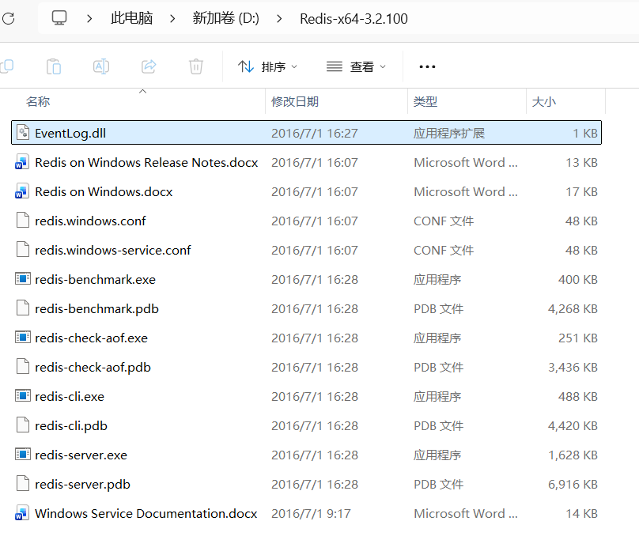
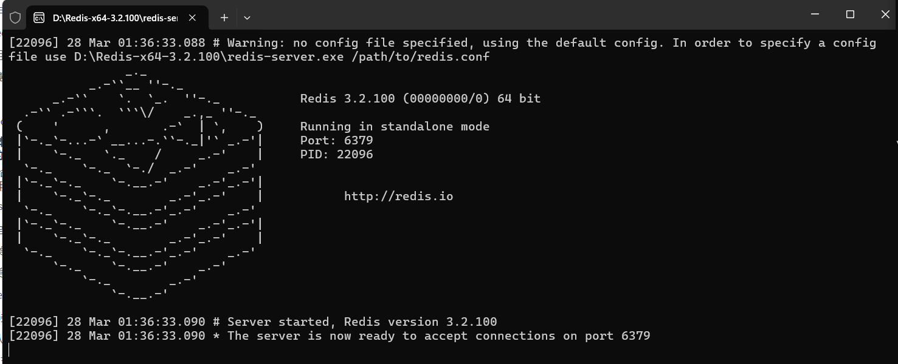
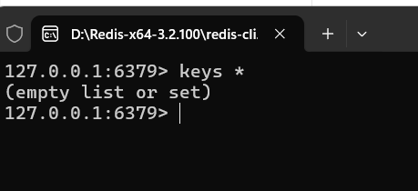
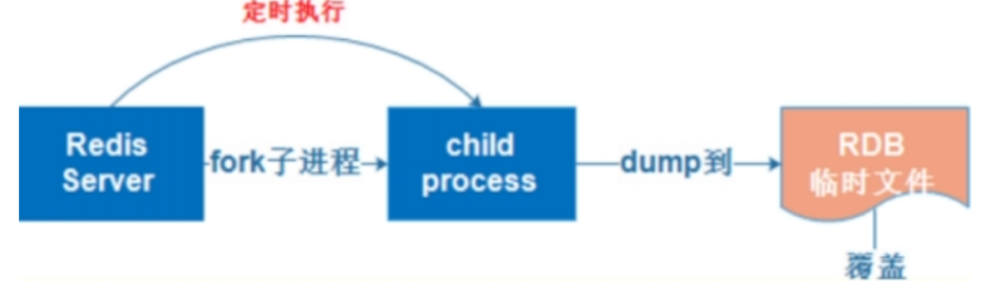

## Redis

### 1.什么是非关系型数据库（nosql）

全称not only sql和传统关系型数据库相比（mysql，oracle）它不需要创建关系模型（二维表），数据和数据之间也可以没有必然关联，是基于内存存储，键值对的方式，所以读写速度会高于传统的mysql数据库，他比较适合存储海量的碎片化数据


### 2.什么是redis

redis是一个开源的，使用C语言编写，支持网络交互，可以基于内存存储，也可以支持持久化存储，读写速度非常快，支持事务（没有回滚：开启事务，命令入行，执行事务），还可以设置过期时间，非常适合做缓冲操作


### 3.redis应用场景 --- 面试题

- 缓存：第一次查询mysql，并且会存储在redis中，再次查询相同的数据时，可以走redis不走mysql，适合存储高频数据，那么如果数据修改了，清空redis中缓存（mysql和redis如何保证数据一致）
- 计数：点赞量，下载量，访问量..... redis有一个可以实现自增自减的命令，专门实现计数，而且她不会出现并发问题，因为他们自增自减具有原子性（后期把计算好的点赞量，定期更新数据到mysql）
- 排行榜：推荐帖子，推荐消息，直播榜一大哥.... redis有一个专门的数据类型，可以进行排序，可以把存储的数据，绑定到一个分数，可以根据分数排序
- 好友关系：共同爱好，共同粉丝，共同好友.... redis有一个类型，专门用于实现交集，并集，差集，很容易就实现了数据之间的关系 
- session共享：以后做了集群，不止一台服务器，每台服务器都会有一个session实现相互共享
- 简单的队列：只能完成一个简单模式的队列，复杂队列可以后期交给rabbitMQ来处理


### 4.redis环境搭建

#### 4.1 linux

- 下载redis的压缩包，

  - redis-xxx.tar.gz 属于linux版本，功能更完整
  - redis-xxx.zip 属于windows版本，简单点，看下方笔记

- 解压：不用安装 tar -xvf xxx.tar.gz -C 目录

- 配置redis的配置文件--- 重点，==适用于linux==

  ```properties
  #绑定的端口号 指定之后，则客户端可以通过该IP地址来连接服务器
  bind 192.168.3.11
  #指定是否为开启保护模式，如果开启保护模式，则需要设定访问密码
  protected-mode no
  port 6379
  #设置为守护进程，则进程启动后会在后台运行
  daemonize yes
  #pid保存文件
  pidfile /var/run/redis_6379.pid
  #日志文件
  logfile "/usr/local/redis-5.0.3/log/redis_6379.log"
  #持久化文件名
  dbfilename redis_6379.rdb
  #持久化文件路径
  dir /usr/local/redis-5.0.3/data/
  ```
  
- redis本身是基于C/S架构的，通过服务端命令开启服务端

  ```bash
  redis-server 指定的目录下的配置文件
  ```

- 通过redis客户端命令，去连接服务端，去操作redis

  ```bash
  redis-cli -h redis服务端的ip地址 -p 端口号
  ```


#### 4.2 window

- 下载redis的压缩包，

  - redis-xxx.zip 属于windows版本

- 解压：不用安装 tar -xvf xxx.tar.gz -C 目录

  

  

- 如果想启动redis服务的话，只需要双击redis-server-exe，前台运行，关闭了cmd窗口就会关闭redis服务

  

- redis-cli.exe，是redis客户端，可以操作redis

  


### 5.Redis基本命令  --- 重要 （命令就是后期java中的方法）

#### 5.1 通用命令：无论什么数据类型都可以使用的命令

```properties
keys 正则:查看符合要求的key
select 数字:切换数据库，redis默认创建了16个数据库，通过0-15进行切换
type key:查看key是什么类型的
dbsize:查看数据库中key的数量
exists key:查看key是否存在，返回1/0
del key:根据key来删除数据

rename oldKey newKey:给key重命名，如果newkey已经存在了，会替换掉原来的值，数据就会出现丢失
renamenx oldKey newKey:给key重命名，只有newKey不存在时，才会重命名
expire key 秒:设置key多少秒失效
pexpire key 毫秒:设置key多少毫秒失效
ttl key:查看key剩余时间，-1永久存在 -2不存在
persist key:取消过期时间
flushdb:清空redis 慎用
```


#### 5.2 Redis数据类型 ---面试题

- String：是一个二进制类型，可以存储字符串，图片，视频，音频，也可以存储一些项目中的静态资源css，js..

  - 缓存：
  - 计数：String有一个自增自减命令，具有原子性

- List：底层是双向链表结构，所以类似于java中的LinkedList是一个有序的可以重复的集合

  - 简单的队列：lpush+rpop或者rpush+lpop命令来模拟队列

- Set：是无序，元素唯一的集合，底层是通过Hashtable实现的，查看元素和删除元素，都特别快，用于记录一些不重复的数据

  - 共同好友，共同爱好：有一个命令可以实现交集，并集，差集
  - 抽奖功能：有一个命令，可以随机获取集合中的某个元素

- Sorted Set：简称Zset，是有序集合，类似于set，只不过底层的每个元素会去绑定一个double类型的分数（积分数，礼物数，点赞数）redis就可以通过分数，进行升序降序排列，集合的元素还是唯一的，但是绑定的分数是可以重复的

  - 排行榜：把用户id或者用户姓名存储，然后是唯一的，每个用户都绑定一个分数，redis就根据分数排序

- Hash：就是Map里面又嵌套了一个Map集合，每个key都会对应一个Hashtable，适合存储对象数据

  比如：存储用户对象，

  - key:设计对应的用户id，
  - value：设计成用户属性和属性值
    - key：表示属性名，value：属性值；key2：value2:....）


#### 5.3 string类型命令

```properties
set key value:添加一组值，（key和value），如果key存在也会替换
setnx key value:添加一组值，只有redis不存在，才可以添加，后期也是用于实现redis分布式锁的前提
get key:根据key获取value
mset k1 v1 k2 v2 ....:一次性添加多组值，这种操作时具有原子性的，同时成功和同时失败
mget k1 k2 k3 ...:一次性获取多个key的value

以下这四种命令用于实现redis计数功能，而且不会出现多线程下并发问题，他们具有原子性
incr key:对key的值进行自增（值需要数值类型）
incrby key 数字:对key的值进行指定数字的自增
decr key:自减
decrby key 数字:自减指定数字

append key 数据:给指定key的值追加新的内容，如果key不存在，会帮你创建这个key
strlen key:获取长度
getrange key start end :获取key中指定范围的数据，类似于截取字符串
setrange key index value:将对应下标的值，替换成value类似于字符串
```


#### 5.4 List类型命令

```properties
lpush key v1 v2 v3 ...:向集合key中左边依次插入不同的value 
rpush key v1 v2 v3 ...:向集合key中右边依次插入不同的value
lrange key begin end:获取集合key中begin~end范围的元素，如果end是-1表示获取全部内容，-2就是获取到倒数第二个值....
llen key:获取集合key的长度
lindex key index:根据集合下标获取指定元素

lpop key:取出并移除集合中第一个（最左边）元素
rpop key:取出并且移除集合中最后一个（最右边）元素

lrem key 数字 value:删除集合中指定个数的value数据
-- 数字如果是正数，从头开始删除多少个
-- 数字是负数，从尾开始删除多少个
-- 是0，则全部删除

比如：想模拟队列:lpush+rpop 或者 rpush+lpop
比如：想模拟栈:lpush+lpop 或者 rpush+rpop
```


#### 5.5 Set类型命令

```properties
sadd key v1 v2 v3 :向集合中存储多个不重复的数据
smembers key:获取集合中所有元素
srandmember key:随机获取集合中的元素
spop key:随机获取并且移除元素
scard key:获取集合元素的个数
srem key value:删除集合中指定的元素

-- 以下命令 用于实现共同好友，爱好，粉丝...功能
sunion key1 key2 key3 ...:并集运算，将多个集合元素的元素，合并取出来，相同的只取一个
sdiff key1 key2 key3 ...:差集运算，是为了获取第一个集合和后面所有集合不同的元素
sinter key1 key2 key3 ...:交集运算，获取多个集合共同的元素
sdiffstore newkey key1 key2 key3....:获取key1 和后面集合不同的元素，并且存入到新的集合
sinterstore newkey key1 key2 key3...:获取多个集合共同的元素，存入新集合
```


#### 5.6 Sorted Set 类型命令

类似于Set，也叫Zset，元素是唯一的，区别在于每个元素底层会绑定一个double类型的分数，而分数可以根据需要存储对应数据（比如：点击量，礼物数量）redis就可以根据分数进行，升序或降序排列，同时分数是可以重复的

```properties
zadd key 分数 数据:向key集合中添加一个元素，并且绑定分数，默认按照升序排列
zrange key start end:获取指定范围的元素，默认升序排列返回 end=-1 表示最后一个，-2 倒数第二个
zrevrange key start end:功能和上面一样，按照分数倒序排列返回
zincrby key 数字 数据:将key集合的数据，对应的分数做自增
zcount key min max:获取分数在指定范围的个数
zscore key 数据:获取key集合中指定数据对应的分数
zrem key 数据:移除集合中指定的元素
```


#### 5.7 Hash类型命令

底层实现是每个key都会对应一个Hashtable，说白了就是Map集合又嵌套了Map集合，比较适合存储对象类型的数据

```properties
hset key k v				:key可以当成对象名，或者id，k可以当成属性名，v可以当成属性值
hmset key k1 v1 k2 v2 ....	:向对象中添加多组属性
hget key k					:获取对象中指定的属性值
hgetall key					:获取对象中的所有属性和值
hkeys key					:获取对象中的所有属性名
hvals key					:获取对象中的所有属性值
```


### 6.redis主从模式 master/slave

为了保证redis服务器高可用，肯定是不允许服务器宕机，导致redis功能失效，所以redis推出了一种模式，称之为主从模式（主从复制，也叫读写分离），表示有一台主服务器（主要负责写入）和多台从服务器（主要负责读取，不能写入，而且具有主服务器的备份）

- 缺点：

  - 如果宕机了从服务器，没有任何影响

  - 如果宕机了主服务器，数据虽然不会丢失，但是不能写入

    只能通过人工介入，输入命令，将从服务器升为主服务器才可以再次写入


#### 6.1 redis主从模式搭建

> 目标：搭建3台redis服务器（1个主，2个从）真实开发环境下肯定不同的redis服务器在不同的计算机中....

- 创建masterslave包，复制三分配置文件redis.conf

- 编辑里面的配置文件（IP地址，端口号，进程文件名，日志文件名，持久化文件名）

- 如果是从服务器，需要添加一个新的配置（关联主服务器）
  
  ```properties
  replicaof 主服务器ip 主服务器端口号
  ```
  
- 通过redis-server启动三台redis服务器

- 通过redis-cli 连接redis任意一个服务器


#### 6.2 主和从服务器切换

- 将从服务器直接升主服务器

  ```
  slaveof no one
  ```

- 进入其他服务器，指定好新的主服务器

  ```
  slaveof 新的主服务器ip 新的主服务器端口
  ```

  

### 7.哨兵模式 sentinel

因为主从模式确实可以提高redis数据安全性，但是如果主服务器宕机了，需要人工介入，将从升为主，这就浪费了人力成本和时间成本，所以redis推出了哨兵模式，相当于主从模式的升级版，除了主从服务器，还提供了多个放哨的（哨兵），主要用于监控主从服务器的可用性（底层他会每隔一段时间，向这些服务器发送一些心跳），如果发现主服务宕机了，那么这些哨兵投票决定（超过半数才会决定）将哪台从服务器升为主服务器，好处在于不需要人工介入

#### 7.1 哨兵模式搭建

> 目标：搭建一台主服务器，一台从服务器，需要搭建3个哨兵

- 创建sentinel目录，保存哨兵的配置（1主1从3哨兵）
- 主和从配置文件，跟之前主从模式一致
- 哨兵配置文件（ip，端口，后台运行，进程文件，日志文件）添加了一些额外的哨兵配置

```properties
###哨兵配置
###1.配置主从信息，主服务器名， 主服务器ip，端口号，节点个数
sentinel monitor mymaster 192.168.3.11 7000 2
###2.设置多少秒没有回复，哨兵认为主节点宕机
sentinel down-after-milliseconds mymaster 30000
###3.设置故障转移时，最多支持多少个从同步到服务器
sentinel parallel-syncs mymaster 1
###4.设置故障转移最大时间
sentinel failover-timeout mymaster 60000
```

- 通过redis服务端命令，启动主和从服务器

  - redis-server 目录/xxx.conf

- 通过redis哨兵命令，启动三个哨兵

  - redis-sentinel 目录/xxx.conf

- 测试，导入依赖

  ```xml
  <!--redis-->
  <dependency>
  <groupId>org.springframework.boot</groupId>
  <artifactId>spring-boot-starter-data-redis</artifactId>
  </dependency>
  <dependency>
  <groupId>redis.clients</groupId>
  <artifactId>jedis</artifactId>
  </dependency>
  ```

- 创建main方法测试

  ```java
  //测试redis哨兵可用性
  public class TestSentinel {
      public static void main(String[] args) {
          Set<String> set = new HashSet<>();
          set.add("192.168.3.11:10000");
          set.add("192.168.3.11:10001");
          set.add("192.168.3.11:10002");
          //1.定义哨兵池对象(参数1：主服务器名，参数2：哨兵地址的集合)
          JedisSentinelPool pool = new JedisSentinelPool("mymaster", set);
          int i = 1;
          Jedis jedis = null;
          while (true) {
              try {
                  jedis = pool.getResource();
                  jedis.set("key-" + i, "value-" + i);
                  System.out.println("插入数据成功:key-" + i);
                  i++;
                  Thread.sleep(2000);
              } catch (Exception e) {
                  System.out.println("可能主节点宕机了，请等待30秒");
              } finally {
                  try {
                      jedis.close();
                  } catch (Exception e) {
                      System.out.println("可能主节点宕机了，请等待30秒");
                  }
              }
          }
      }
  }
  ```


### 8.集群模式 cluster

哨兵模式，基本可以满足大部分需求，但是他也只有一个主节点，意味着最终只有服务器可以正常写入，如果并发量很高，redis容量是无法扩容的，redis并发量也不能增长，所以redis推出了集群模式，他最大可以支持1000个节点（服务器）这里面就会包含很多台主节点和多台从节点，这样redis整体性能就会随着节点越来越多，性能也会越来越高（支持更高的容量和更高的并发量）


#### 8.1 集群三要素

- master：主服务器（主节点）负责写，有多个
- slave：从服务器（从节点）负责读，还要保存对应主节点备份，有多个
- slot：数据分槽（槽），redis一共有16384个槽，每个槽点负责管理一部分数据，这样数据分槽会平均分配所有主节点去管理，这样主节点越来越多，那么每个主节点需要管理的分槽就会越少，这样整体数据量不变的话，每个主节点存储的数据就可以变少了，这样就间接性提高了整体的redis容量和并发量


#### 8.2 搭建集群

==注==：集群最低要求，至少要搭建==6个节点以上==

> 目标：创建6个节点（3个主节点，3个从节点）

- 创建一个集群包cluster保存集群需要的所有配置文件

- 复制6个redis.conf配置文件（7000-7005）

- 编辑每个配置文件，修改端口号，哪些文件名，并且还需要添加一个额外的集群配置

  ```properties
  ###集群配置
  ###1.开启集群
  cluster-enabled yes
  ###2.指定集群配置文件
  cluster-config-file nodes-7000.conf
  ###3.如果一个主节点宕机了  没有从节点做故障转移 集群还是否可用
  cluster-require-full-coverage no
  ```

- 先启动6个节点

  - 通过redis服务端命令去启动：如果节点比较多，不推荐

  - 推荐使用linux编写脚本的方式，启动redis集群

    ```sh
    #!/bin/bash
    #打印一句话
    echo '开启集群'
    for i in {7000..7005}
    #循环开始
    do
    redis-server redis-$i.conf
    echo 'redis-'$i'启动'
    #循环结束
    done
    echo 'redis集群开启结束'
    ```

    ==注：刚刚创建的脚本默认没有权限（灰色的） chmod 744 start.sh==

- 最后一个配置：只需要做一次，让redis自动分配，集群的槽点，还可以自动创建主从节点

  ==这个命令不能换行==

  ```bash
  --cluster create 用于创建集群
  --cluster-replicas 配置主从，后面的数字表示1个主对应几个从
  
  redis-cli --cluster create 192.168.3.11:7000 192.168.3.11:7001 192.168.3.11:7002 192.168.3.11:7003 192.168.3.11:7004 192.168.3.11:7005 --cluster-replicas 1
  ```

  ==注==：运行命令时，会提示让输入yes或者no，一定一定一定要输入yes，否则集群分配槽点失效，再重新试的话，就会报错：不是空的错误

  > 解决：先全部关闭redis服务器，删除redis目录下data包的所有内容，然后重新启动redis集群，然后重新配置即可

- 测试

  ```java
  //测试redis集群
  public class TestCluster {
      public static void main(String[] args) {
          Set<HostAndPort> set=new HashSet<>();
          for(int i=7000;i<=7005;i++){
              set.add(new HostAndPort("192.168.3.11",i));
          }
          //1.创建集群对象
          JedisCluster cluster=new JedisCluster(set);
          int n=1;
          while(true){
              try{
                  cluster.set("key-"+n,"value-"+n);
                  System.out.println("集群添加数据成功：key-"+n);
                  n++;
                  Thread.sleep(2000);
              }catch(Exception e){
                  System.out.println("主节点宕机了，稍等一会");
              }
          }
      }
  }
  ```

  

### 9.redis持久化方式---面试题

> 面试题1：redis是否支持持久化？
>
> 面试题2：redis有哪些方式可以做持久化？
>
> 面试题3：redis持久化方式，有哪些区别？
>
> 面试题4：你推荐使用哪种持久化方式？

#### 9.1 RDB模式 ---默认



RDB模式也叫半持久化，实际过程通过redis服务端，每隔一段时间生成一个子进程，通过这个子进程将数据写入到临时文件，等待写入成功后，再去替换之前保留的RDB文件

- 优点：
  - RDB模式是通过子进程来做数据持久化，不会影响redis服务端的读写速度，执行效率比较高
  - 如果采用了RDB模式，redis最后只需要保存一个RDB文件即可，对于以后数据备份和还原，比较完美的，如果出现宕机了，也可以轻松恢复数据
- 缺点：
  - 容易出现数据丢失，底层是通过子进程，每隔一段时间进行数据持久化，万一在这个时间间隔之内，redis宕机了，那么这段时间之内所写入到数据就丢失了
  - 只有一个RDB文件，损坏了的话就无法还原了


#### 9.2 AOF模式


AOF模式也叫全持久化模式，底层是通过日志形式记录redis服务端执行的命令（只需要记录增删改的命令），如果redis宕机了，需要恢复，只需要重新执行一遍这些命令即可

- 优点：
  - 如果采用了AOF模式，具有更高的数据安全性，因为redis会有很多同步策略（每秒同步，每修改同步.....），如果设置成了每修改同步，就表示执行完增删改的命令都会记录下来，这样就不会丢失数据
  - 由于AOF模式，是通过日志记录，底层是通过追加模式，每次写入新的数据，就会追加日志，就不会损坏之前保存的日志信息
- 缺点：
  - AOF由于每次写入数据时，都需要记录执行的命令，肯定会影响redis的性能，所以效率偏低
  - AOF模式，是通过日志形式进行保存，肯定会存在很多个数据文件，每个文件都需要进行恢复，如果数据量特别大，恢复数据是非常麻烦的

> 总结：redis有两种持久化模式，具体使用哪种模式，要看你的项目或者需求，要取舍什么，
>
> - 如果你想要高的执行效率，但是数据安全性稍微低一点，可以采用RDB模式
> - 如果你想要高的数据安全性，但是执行效率低一些，可以采用AOF模式
>
> 个人推荐，使用redis目的就是为了提高效率，如果想要高的数据安全性，可以存储到mysql，所以个人推荐还是RDB好一些


### 10.springboot整合redis

- 导入依赖（1.springboot整合redis依赖，2.redis客户端依赖）

  ```xml
  <!--redis-->
  <dependency>
  <groupId>org.springframework.boot</groupId>
  <artifactId>spring-boot-starter-data-redis</artifactId>
  </dependency>
  <dependency>
  <groupId>redis.clients</groupId>
  <artifactId>jedis</artifactId>
  </dependency>
  ```

- springboot配置文件，配置redis连接工厂，配置redis集群地址

  ```properties
  ##redis配置
  ###1.配置redis集群节点，ip:端口号，ip:端口...
  ###如果节点比价多，不方便配置，可以通过配置类，写循环，来实现
  spring.redis.cluster.nodes=192.168.3.11:7000,192.168.3.11:7001,192.168.3.11:7002,192.168.3.11:7003,192.168.3.11:7004,192.168.3.11:7005
  ###2.redis辅助配置 都可以不配置，都有默认值
  ###连接池最大连接数，负数表示不限制
  spring.redis.jedis.pool.max-active=-1
  ###连接池最大等待时间，附属表示不限制
  spring.redis.jedis.pool.max-wait=-1ms
  ###连接池最大空闲连接 默认8
  spring.redis.jedis.pool.max-idle=8
  ###连接池最小空闲连接 默认0
  spring.redis.jedis.pool.min-idle=0
  
  ### yml
  spring:
    #redis配置
    ##1.配置redis集群节点，ip:端口号，ip:端口...
    ##如果节点比较多，不便于配置，可以通过配置类，写循环，来实现
    redis:
      cluster.nodes: localhost:6379
      ###2.redis辅助配置 都可以不配置，都有默认值
      ###连接池最大连接数，负数表示不限制
      pool:
        max-active: -1
        ###连接池最大等待时间，附属表示不限制
        max-wait: -1ms
        ###连接池最大空闲连接 默认8
        max-idle: 8
        ###连接池最小空闲连接 默认0
        min-idle: 0
  ```

- springboot定义==redis配置类== --- 用于定义操作redis核心对象RedisTemplate

  ```java
  //定义redis配置类
  @Configuration
  @CacheConfig //缓存配置
  @EnableCaching //开启缓存注解
  public class RedisConfig {
     
      @Autowired
      RedisConnectionFactory factory; //注入redis连接工厂对象
  
      @Bean
      RedisTemplate<String, Object> redisTemplate() {
          RedisTemplate<String, Object> rt = new RedisTemplate<>();
          //1.指定key存储方式（按照字符串方式序列化存储）
          rt.setKeySerializer(new StringRedisSerializer());
          rt.setHashKeySerializer(new StringRedisSerializer());
          //2.指定value存储方式（按照json方式序列化存储）
          rt.setValueSerializer(new GenericJackson2JsonRedisSerializer());
          rt.setHashValueSerializer(new GenericJackson2JsonRedisSerializer());
          //3.连接工厂
          rt.setConnectionFactory(factory);
          return rt;
      }
      
      
      //如果节点比较多，可以尝试，使用配置类，编写ip和端口
      //自定义redis连接工厂
      //注:如果使用了配置类就要注销掉配置文件中的redisp，只能二选一，因为如果容器中有两个相同的bean会报错
  //    @Bean
      RedisConnectionFactory factory(){
          Set<String> set=new HashSet<>();
          for(int i=7000;i<=7005;i++){
              set.add("192.168.3.11:"+i);
          }
          RedisClusterConfiguration cluster=new RedisClusterConfiguration();
          cluster.setClusterNodes(set);
          return new JedisConnectionFactory();
      }
  }
  ```

- 使用依赖注入RedisTemplate进行操作

  ```java
  @Autowired
  RedisTemplate<String,Object> redis;
  
  public void xxx(){
  	redis.opsForValue()//表示String类型
      redis.opsForList()//表示List类型
      redis.opsForSet()
      redis.opsForZSet()
      redis.opsForHash()
  }
  ```

  - 业务层

    ```java
    @Service
    public class OAdminServiceImpl implements OAdminService {
        @Autowired
        OAdminMapper mapper;//错误是允许的，只有正常运行时侯才会创建实现类
    
        //一般是在业务层使用redis
        //也有个别情况是在控制层,jwt==>存储redis设置时间
        @Autowired
        RedisTemplate<String, Object> redis;
    
    //    public void test() {
    //        redis.opsForValue()
    //        redis.opsForList()
    //        redis.opsForSet()
    //        redis.opsForZSet()
    //        redis.opsForHash()
    //    }
    
        //分页怎么存储redis，key如何设计，oadmin（模块）-页码数-每页条数
        public PageInfo<OAdmin> show(Integer pageNum, Integer pageSize) {
            PageInfo<OAdmin> p = (PageInfo<OAdmin>) redis.opsForValue().get("oadmin-" + pageNum + "-" + pageSize);
            if (p == null) {
                PageHelper.startPage(pageNum, pageSize);
                p = new PageInfo<>(mapper.show());
                System.out.println("查询了mysql进行了分页:" + pageNum + " " + pageSize);
                redis.opsForValue().set("oadmin-" + pageNum + "-" + pageSize, p);
            }
            return p;
        }
    
        //新增，删除，更新，对分页是有影响的
        public int add(OAdmin a) {
            //先删除redis中对应的数据
            redis.delete(redis.keys("oadmin-*"));
    //        redis.delete("oadmin-*");
            return mapper.insertSelective(a);
        }
    
        public OAdmin login(OAdmin a) {
            return mapper.login(a.getAccount(), a.getPassword());
        }
    
        //查询：先查redis，如果存在直接返回，如果不存在，走mysql再存储redis
        public OAdmin selectById(Integer id) {
            OAdmin admin = (OAdmin) redis.opsForValue().get("oadmin-" + id);
            if (admin == null) {
                admin = mapper.selectByPrimaryKey(id);
                System.out.println("查询了mysql:" + admin + "并且存储了redis");
                if (admin != null) redis.opsForValue().set("oadmin-" + id, admin);
            }
            return admin;
        }
        
        //更新和删除操作，如果数据修改了，为了防止数据脏读，
        //保证mysql和redis数据一致性，需要清空redis的数据
        //极端情况:删除redis，和更新mysql，都有可能失败，就会造成数据不一致
        //解决方案:
        //      1.可以通过逻辑判断控制，只有等你redis删除成功了才会执行mysql，需要使用if逻辑判断，结合try-catch
        //      2.延迟双删策略
        //      3.借助于异步处理，借助于MQ消息队列来处理
        //      4.使用redis的分布式锁来控制
        public int update(OAdmin a) {
            //先删除redis的对应数据
            redis.delete("oadmin-" + a.getId());
            System.out.println("删除了redis中的id:" + a.getId() + "数据");
            return mapper.updateByPrimaryKeySelective(a);
        }
    
        public int del(Integer id) {
            //先删除redis的对应数据
            redis.delete("oadmin-" + id);
            System.out.println("删除了redis中的id:" + id + "数据");
            return mapper.deleteByPrimaryKey(id);
        }
    }
    ```

  

- 还可以通过redis注解来操作 ---不推荐新手使用

  ==前提==：redis配置类，必须添加@EnableCaching开启缓存注解

  - @Cacheable：一般针对于查询操作，底层原理，第一次查询mysql，并且把方法的返回值存储到redis，而且key是它定义的，第二次再次访问，可以走redis（不执行业务层方法），不走mysql
  
    ```java
    //缓存注解生成的key有一个默认规则
        //默认key= cacheNames::keys 存储在redis
        //#id表示使用方法的参数，如果是对象参数,假设为a对象，#a.id
        //默认的value= 方法的返回值
        @Cacheable(cacheNames ="oadmin" ,key="#id")
        public OAdmin selectById(Integer id) {
            System.out.println("执行了mysql的查询:"+id);
            return mapper.selectByPrimaryKey(id);
        }
    ```
  
  - @CacheEvict：清空缓存的注解，一般用于增删（改）
  
    ```java
    @CacheEvict(cacheNames = "oadmin",key="#id")
        public int del(Integer id) {
            return mapper.deleteByPrimaryKey(id);
        }
    ```
  
  - @CaCheput：更新缓存的注解，一般用于修改，redis会把业务层方法的返回值，更新到redis中
  
    ```java
    //    @CacheEvict(cacheNames="oadmin",key="#a.id")
        @CachePut(cacheNames="oadmin",key="#a.id")
        //修改方法的返回值，把返回值更新到redis中
        public OAdmin update(OAdmin a) {
            mapper.updateByPrimaryKeySelective(a);
            return mapper.selectByPrimaryKey(a.getId());
        }
    ```


### 11.保证mysql和redis数据一致性方法 --- 面试题

- 延迟双删：先删除redis缓存，再更新mysql数据库，在设置时间等待一段时间后（比如：几百毫秒），mysql更新成功后，再删除redis缓存，最后还可以设计redis缓存的过期时间，保证最终一致性
- 使用MQ异步更新：先更新mysql，更新成功后才发送消息给MQ，通过消费者去监听MQ的消息，监听到了消息，才会去更新redis缓存
- 乐观锁：数据库表中添加一个version字段，更新时候，携带旧的版本号，进行原子操作，写入redis时，同时也要写入数据和版本号，后期如果再需要读取或者更新缓存，就要对比版本号，如果请求中版本号，低于缓存中的版本号，就不能写入，防止数据被二次更新
- 分布式锁：在mysql更新和redis删除缓存时，先获取该数据id对应的分布式锁（可以基于redisson实现或者setnx）其他用户进行读取或者写入时，发现锁的存在时，就可以让其等待或者降级，直接查mysql数据库
- 兜底方案：设置一个定时任务（比如：每天凌晨）扫描mysql中的热点数据，和redis中的数据，进行对比，如果发现不一致，以mysql为主更新redis


### 12.redis缓存雪崩，穿透，击穿 --- 面试题

如果使用redis做缓存，由于不同的原因（redis宕机了，key失效了，网络延迟）就会导致无法正常访问redis，这样就会出现不同的缓存问题：

- 缓存穿透：在访问redis中不存在的数据，最后就只能访问关系型数据库，比如：mysql，如果正常用户量特别大，这样mysql数据库的压力就会很大，造成穿透
  - 解决方案：可以在redis缓存中，存储一些空对象，并且给这些空对象设置有效期，或者布隆过滤器
- 缓存击穿：在同一个时间点，访问同一个数据时，这个时候redis的数据突然就没了（可能删除，可能key失效了），如果并发量很高的话，就会同时访问mysql数据库，造成击穿
  - 解决方案：使用锁，确保只有一个请求去数据库查询并且更新缓存，或者设计key永不过期
- 缓存雪崩：在redis运行过程中，由于redis宕机了，或者redis中所有key集体过期了
  - 解决方案：针对于宕机的情况，可以搭建主从，哨兵或者集群模式，针对于key集体过期的问题，设置不同（随机的）的过期时间


### 13.redis总结

> - redis的应用场景？你的项目中用了redis干了什么？
> - redis五种基本类型？
> - redis是否支持持久化？RDB和AOF区别？优缺点?
> - redis主从模式？哨兵模式？集群模式？
> - redis是否保证原子性？
>   - 答：不能保证原子性，但是可以保证单个命令是原子性
> - redis是否支持事务？
>   - 答：redis有事务，但是redis事务可以包含多次命令执行，事务不能保证多次的命令是原子性，因为事务没有回滚，如果有命令执行失败了，其他命令依旧可以执行
> - 如果保证redis和mysql数据的一致性？
> - redis缓存穿透，缓存击穿，缓存雪崩？解决方案？