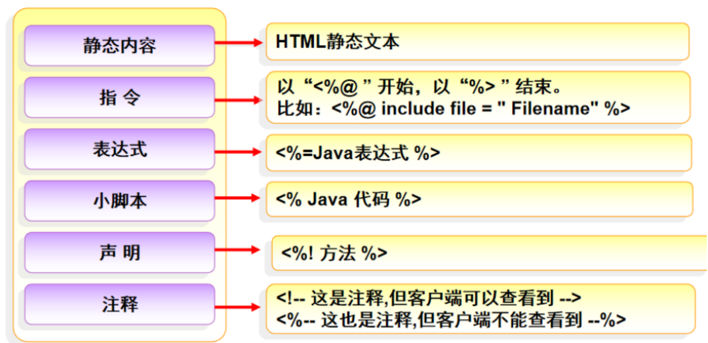
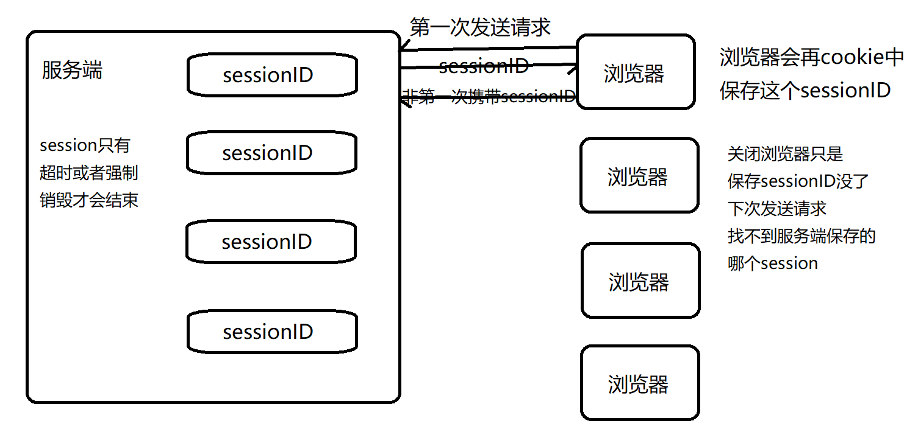
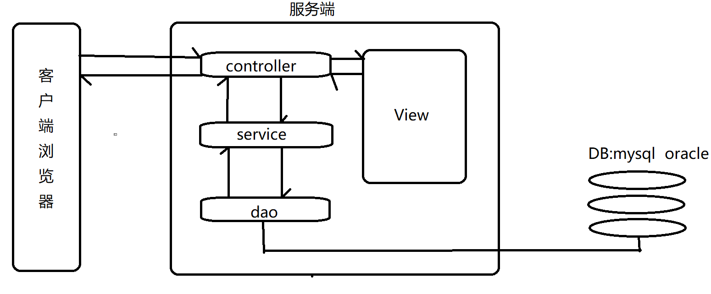
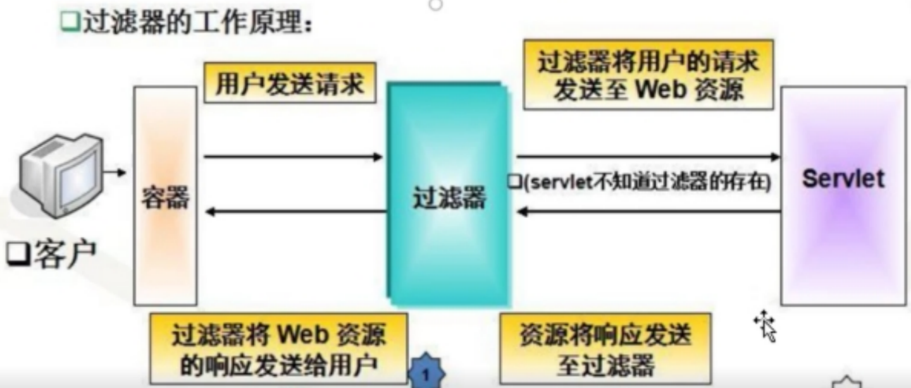

## Servlet

### 1.软件架构B/S和C/S

+ C/S（client/server）：是基于客户端和服务端的软件结构，所以他们必须安装对应的客户端，才可以访问对应的系统的；比如：QQ、LOL、WOW
  + 优点：交互性更强，数据安全性更好
  + 缺点：需要下载客户端（几十个G），客户端需要针对性开发，维护成本很高，版本变更不灵活
+ B/S（browser/server）：是基于浏览器和服务端的软件架构，只需要浏览器就可以访问对应的服务器，所有程序都部署在服务器中
  + 优点：使用方便，不需要客户端，每台电脑也会自带浏览器，维护成本非常低，分布式强
  + 缺点：交互性不强，数据安全性不高，对服务器要求很高，不能随便宕机


### 2.JSP ---不是重点

jsp是基于B/S架构的，就是java server pages(Java服务器页面)，就是在传统的html页面基础上，可以嵌入java代码来实现动态页面的功能

==jsp其实就是servlet==


#### 2.1 jsp执行原理

jsp页面--->翻译成xxx.java（servlet）--->编译成xxx.class--->执行--->返回给浏览器


#### 2.2 jsp组成部分：



+ 指令：是jsp用于设置页面相关属性，比如：编码方式，文档类型，设计的脚本语言，导入相关的包，还可以导入外部标签库

  + page指令：一般编写在jsp第一行，用于设置页面属性，一般是必加项

    ```jsp
    <%@page ...   %>
    ```

  + include指令：在jsp中引入一些其他jsp公共资源

    ```jsp
    <%@include ...  %>
    ```

  + taglib指令：用于引入外部标签库（核心标签库，格式化标签库，函数标签库）

    ```jsp
    <%@taglib uri="地址" prefix="前缀"  %>
    ```
    
    ==项目笔记==在：D:\cod\sc251001\servlet\src\main\webapp\day1223\jstl.jsp

+ 脚本：可以用于在jsp中嵌入java代码

  ```jsp
  <%
  	//可以任意写Java代码
  	String name="天龙";
  %>
  ```

+ 表达式：可以用于将表达式的结果，输出浏览器中

  ```jsp
  <%=name.equals("天龙")%>
  ```

+ 注释：

  ```
  //  /**/:用于在jsp中，脚本代码中用到注释
  <!--  -->:只能注释html内容
  <%--  --%>:可以注释jsp中任意内容
  ```

  

#### 2.3jsp页面实现

```jsp
<%--  在传统的html基础上，嵌入一些java代码--%>

<%--page指令--%>
<%--<%@page pageEncoding="utf-8" contentType="text/html"  %>--%>
<%@page contentType="text/html;charset=UTF-8"
        language="java" import="java.util.List" %>
<%@page import="java.util.ArrayList" %>
<%@ page import="java.util.Date" %>
<%@ page import="java.util.SimpleTimeZone" %>
<%@ page import="java.text.SimpleDateFormat" %>

//脚本代码位置任意
<%

%>

<html>
<head>
    <title>第一个jsp</title>
    <%--嵌入一些css--%>

</head>
<body>
<%--include:可以包含其他公共的jsp页面资源--%>
<%@include file="head.jsp" %>

<%
    int a = 10;
    String b = "abc";
    Date c = new Date();
    SimpleDateFormat sdf = new SimpleDateFormat("yyyy-mm-dd");
    String d = sdf.format(c);
    List<String> list = new ArrayList<>();
    list.add("java");
    list.add("mysql");
    list.add("servlet");
    System.out.println(a);//打印控制台
    out.print(a);//打印在浏览器上
%>
<%--表达式语言：输出，打印在浏览器上--%>
<h3>整形：<%=a%>
</h3>
<h3>字符串：<%=b%>
</h3>
<h3>日期：<%=d%>
</h3>
<h3>集合：<%=list%>
</h3>
<h3>集合遍历：
    <%
        for (int i = 0; i < list.size(); i++) {
            out.print("<div>" + list.get(i) + "</div>");
        }
    %>
</h3>

<h3>
    集合遍历2：
    <%for (int i = 0; i < list.size(); i++) {%>
    <div><%=list.get(i)%>%></div>
    <%}%>
</h3>

<h3>
    集合遍历3：需要jstl的标签库去做遍历
</h3>
<%@include file="foot.jsp" %>
</body>

</html>
```

### 3.Http协议

http协议是超文本传输协议，是一种从服务器传输超文本内容（文本，文件，视频）到本地浏览器的一种协议，是基于请求==request==和响应==response==


#### 3.1 HTTP协议特点  ---了解

+ 无连接：每次只会处理一个请求，服务器处理完毕，自己结束
+ 无状态：每次请求之间都是独立的，不能单独保存请求传递的数据，如果还需要前面的数据必须要重新传递或者使用范围更大的作用域存储，或者使用缓存（Cookie）
+ 灵活：可以传输任何数据，可以通过ContentType来控制文档类型


#### 3.2 HTTP请求方式 ---面试题

+ post请求：用于向服务器提交数据（insert）

  一般情况，通过form表单method="post"，和一些测试软件（postman，jmeter）

+ get请求：用于获取服务器数据（select）

  一般情况下，地址栏发送请求，超链接，使用css，js，图片...都是get请求

+ put请求：用于修改服务器数据（update）

+ delete请求：用于删除服务器数据（delete）


#### 3.3 get请求和post请求区别 ---面试题

+ 应用场景不同：post方式一般向服务器提交数据，get方式一般是获取服务器数据

+ 数据传输方式不同：post方式是属于隐式提交，get方式是会在地址栏通过?拼接传递的数据

+ 长度限制不同：post方式理论上没有长度限制，get方式是根据浏览器不同的限制是不同的（1~2Kb左右）

+ 安全性不同：post方式相比get方式安全一些

+ 如果是文件上传功能，只能使用post方式

  > 自己的话总结：
  >
  > get方式一般是获取服务器数据，post一般是向服务器提交数据
  >
  > get属于显式提交，在地址栏通过?拼接传递的参数，不安全，get方式不同浏览器有不同的长度限制
  > post是隐式提交，不会在地址栏拼接参数，相比于get方式安全一些，理论上post方式是没有长度限制的
  >
  > 如果是文件上传功能，只能使用post方式


#### 3.4 Http请求状态码 ---面试题

http协议是通过状态码，来标识请求处于什么状态

+ 200：请求成功
+ 301：永久请求重定向
+ 302：临时请求重定向 response.sendRedirect();
+ 400：客户端参数接收异常、
+ 403：请求被拒绝（没有权限）
+ 404：地址不对，同时如果启动服务器报错，导致项目没有成功编译，也会导致404
+ 405：请求方式不支持
+ 500：服务器在运行过程中发生异常


### 4.Servlet

servlet是javaEE很重要的组件，用于处理前端发送的请求，并且做出响应，主要用于控制层（转码，获取数据，调用其他层，判断跳转）的功能，并且以后springmvc框架底层核心就是Servlet


#### 4.1 实现Servlet方式

- 实现Servlet接口，重写一堆方法 --- 了解servlet生命周期
- 继承HttpServlet类，重写doGet()，doPost() --- 推荐使用方式，非常适合处理HTTP请求


#### 4.2 继承HttpServlet实现步骤

+ 继承HttpServlet

+ 重写doGet()，doPost()

+ 配置Servlet

  + 通过web.xml来配置 ---推荐

    ```xml
    <!DOCTYPE web-app PUBLIC
            "-//Sun Microsystems, Inc.//DTD Web Application 2.3//EN"
            "http://java.sun.com/dtd/web-app_2_3.dtd" >
    
    <web-app>
        <display-name>Archetype Created Web Application</display-name>
        <!--开始配置Servlet：创建servlet对象，给前端提供一个访问的网址-->
        <!--servlet标签和mapping-->
        <servlet>
            <!--名称可以任意写，但是保证两组name标签一致-->
            <servlet-name>first</servlet-name>
            <!--提供servlet全类名:是基于反射，通过全类名，来实例化对象的-->
            <servlet-class>controller.FirstServlet</servlet-class>
        </servlet>
        <!--第二个servlet-->
        <servlet>
            <servlet-name>admin</servlet-name>
            <servlet-class>controller.adminServlet</servlet-class>
        </servlet>
        <!--mapping标签-->
        <servlet-mapping>
            <servlet-name>first</servlet-name>
            <!--配置请求地址，一定要写/开头-->
            <url-pattern>/one</url-pattern>
        </servlet-mapping>
        <servlet-mapping>
            <servlet-name>first</servlet-name>
            <!--配置请求地址，一定要写/开头-->
            <url-pattern>/two</url-pattern>
        </servlet-mapping>
        <servlet-mapping>
            <servlet-name>first</servlet-name>
            <!--配置请求地址，一定要写/开头-->
            <url-pattern>/three</url-pattern>
        </servlet-mapping>
        <servlet-mapping>
            <servlet-name>admin</servlet-name>
            <url-pattern>/admin</url-pattern>
        </servlet-mapping>
    </web-app>
    ```
  
    
  
  + 通过@WebServlet注解 ---了解
  
    ```java
    //注解配置servlet
    //简化版
    //@WebServlet("/four")
    //完整版
    @WebServlet(
            displayName = "four",//等价于Servlet name
            urlPatterns = {"/four1", "/four2", "/four3"},//请求地址,支持多个
            loadOnStartup = 1,//表示让服务器启动，先实例化，在初始化
            initParams = {//配置初始化参数
                    @WebInitParam(name = "aaa", value = "123"),
                    @WebInitParam(name = "bbb", value = "456")
            }
    )
    ```
  


#### 4.3 通过实现servlet接口来实现Servlet ---了解

+ 实现Servlet接口

+ 实现 `init()  destory()   service()`  

   getServletInfo()  getServletConfig()

+ 配置Servlet
  + web.xml配置
  + 注解配置


#### 4.4 Servlet生命周期  ---面试题

+ 初始化：==默认情况==下，第一次发送请求，**先实例化创建对象**，在==调用init()做初始化一次==（单例模式），
  但是可以通过配置文件配置==load-on-startup==来让其服务器启动初始化
+ 请求处理：每次发送请求都会进入`service()`来执行，执行==多次==
+ 销毁：==服务器关闭==了执行`destroy()`进行销毁，执行==一次==


### 5.转发(forward)和重定向(redirect)区别 ---面试题

```java
//重定向
response.sendRedirect("绝对路径或相对路径");
//转发
request.getRequestDispatcher("相对路径").forward(request,response);
//return “forward:/login"
```

+ 请求次数不同：
  + 转发只会发送一次请求
  + 重定向会发送两次请求（第一次是302表示临时重定向，第二次是浏览器重新发送一个get请求表示最终访问的地址）

+ 地址栏是否会发生变化：
  + 转发地址栏不会发生变化
  + 重定向地址栏会发生变化
+ 是否共享request：
  + 转发由于是一次请求，是可以共享request数据的
  + 重定向由于是两次请求，请求发生了变化，不可以共享request
+ 应用场景不同：
  + 转发只能访问内部资源，无法访问外部资源，但是可以访问WEB-INF资源
  + 重定向，既可以访问内部资源也可以访问外部资源，但是无法访问WEB-INF资源


### 6.getParameter()和getAttribute()区别 ---面试题

+ getParameter("")：用于获取请求传递的数据（比如：通过表单提交的或者地址栏？传递的参数）
  + 只能存储String类型
  + getParamterValues("")，可以获取相同name的表单元素的value集合(String[])
+ getAttribute("")：用于获取作用域的数据
  + 需要先setAttribute()才可以获取
  + 可以存储任意类型数据（Object），要转型


### 7.四大作用域 ---面试题

- page：在同一个页面有效，类似于java中this对象，表示当前页面，一般是通过PageContext来设置的

- request：类型是==HttpServletRequest==，表示一次请求内有效

- session：类型是==HttpSession==，表示一次会话内有效（表示浏览器和服务器一次通话，会包含很多次请求和响应，一般是关闭浏览器就会产生新的会话，默认时间是30分钟）

- application：类型是==ServletContext==，表示一个应用服务器有效

  

- 共同点：

  + setAttribute()：向不同作用域存储数据

  + getAttribute()：向不同作用域获取数据

  + removeAttribute()：删除不同作用域的数据

- 应用场景：

  - page：本页面有效，实现html和js之间做数据传递，在js也可以使用EL表达式直接获取数据

  - request：一次请求有效，经常把使用频率特别高的，并且经常修改的数据存储在request中，只要修改了就会发生请求修改，请求只要跨域了，之间请求存储的数据就自动销毁了 ---最常用的

  - session：一次会话有效，很多页面都需要共享的，而且修改频率不高的数据，比如：用户的登录信息，也可以帮我们实现用户登录认证

  - application：一个应用有效，存储用户和用户之间共享的数据，比如：存储聊天记录，统计网址访问次数，项目前缀


### 8.session技术的实现原理

session技术是将数据存储在服务端的用于管理会话的技术，服务端会为每个客户端创建一个会话，用于存储客户端的数据，而且每个session都会有一个唯一的sessionID，浏览器第一次发送请求时服务端会创建session保存，同时会将sessionID返回给浏览器，而浏览器会将sessionID存储在cookie中（浏览器缓存），后面浏览器每次发送的请求都会携带这个sessionID，用于向服务器去查找对应的是哪个session对象

+ 浏览器如果关闭了，只是相当于sessionID没了，session对象还是再服务端保存着，它==只有超时（30分钟）了或者强制销毁==了，session才会销毁



### 9.Cookie(浏览器缓存) ---面试题

Cookie是服务端创建，==存储在客户端==的==一小段====文本信息==，主要用于实现浏览器缓存和会话跟踪技术

+ Cookie三部曲

  + 第一步：创建Cookie(在服务端创建)

    ```java
    Cookie c=new Cookie("name","value");//value只能放字符串
    //辅助功能，可以给cookie设置有效期，单位:秒
    //不设置有效期，默认是会话级别(30分钟)
    c.setMaxAge(秒);
    ```

  - 第二步：通过响应response把cookie发送给浏览器(保存在浏览器)

    ```java
    response.addCookie(c);
    ```

  - 第三步：通过请求request，获取所有的Cookie对象进行使用

    ```java
    request.getCookies();
    for(Cookie c:cs){
    	if(c.getName().equals("???")){
    		c.getValue();
    	}
    }
    //也可以使用EL表达式，name是根据当时存储时决定的，value是固定的
    ${cookie.name.value}
    ```

    

### 10.Session 和Cookie区别 ---面试题

+ 存储位置：session存储在服务端，cookie存储在客户端
+ 长度限制：cookie是根据浏览器的不同有长度的限制，session理论上没有限制
+ 数据类型：cookie只能存储文本内容，session可以存储任意内容（Object）
+ 安全性：session相比cookie更安全


### 11mvc三层架构 ---面试题

MVC是一种软件设计风格，将一个系统分成M模型层，V视图层，C控制层，这种三层架构，可以实现一个系统在各个层级之间解耦合，更加利于程序拓展



+ M：mode模型层，主要用于处理业务逻辑（service）和数据访问（dao）

  - service：业务逻辑层，相当于前端要实现的一个功能，是为了以后更好的做事务

    假设：前端发送转账请求

    - controller：转账信息，对方信息
    - service：处理转账业务(修改-钱，修改+钱，新增记录......)
    - dao：实现4个dao方法给service调用

    - 这么设计的话service就会更加方便做事务，可以保证这4个dao方法都成功，或者都失败

  

  - dao：数据访问层，主要用于和数据库交互（jdbc，mybatis，mybatis-plus）

    并且dao和service的接口和实现类的关系，目的也是为了解耦合，比如：service层实现购物功能，就可以在提供业务层接口，提供一个购买方法，实现类，提供多种：1种是正常购买的情况，另一种是活动购买的情况，这样后期可以更加方便切换不同的实现类（spring框架 DI依赖注入）

+ V：view视图层，主要用于提供可视化操作界面（html，jsp，vue）

+ C：controller控制层，主要用于连接模型层和视图层，可以接受请求，处理请求，控制哪些数据对应哪些页面（springmvc）


### 12.初始化参数和全局参数

为了将servlet经常修改的内容，通过配置文件(==web.xml==)的方法进行编写，以后切换了新的环境，只需要修改配置文件，无需修改java代码

+ 初始化参数：是在web.xml中servlet标签内部配置的

  注：初始化参数==只针对于当前的servlet有效==，所以初始化参数，只适用于当前servlet独有的数据

  ```xml
  <servlet>
          <servlet-name>admin</servlet-name>
          <servlet-class>controller.adminServlet</servlet-class>
          <!--初始化参数-->
          <init-param>
              <param-name>reqCharset</param-name>
              <param-value>utf-8</param-value>
          </init-param>
          <init-param>
              <param-name>respCharset</param-name>
              <param-value>text/html;charset=utf-8</param-value>
          </init-param>
          <load-on-startup>1</load-on-startup>
  </servlet>
  ```

  ```java
  //servlet类中获取初始化变量
  
  //getInitParameter() 是 ServletConfig 接口 的方法
  //GenericServlet 抽象类实现了 ServletConfig 接口
  //你的 Servlet 继承自 HttpServlet，而 HttpServlet 又继承自 GenericServlet
  
  //第一种方式:在继承HttpServlet的servlet类中，直接调用getInitParameter(""),这个方法是抽象父类的普通方法，不需要对象实例
  public class FourServlet extends HttpServlet {
      protected void doGet(HttpServletRequest req, HttpServletResponse resp) throws ServletException, IOException {
          System.out.println("进入doGet方法");
          String a = getInitParameter("aaa");//获取初始化参数
          String b = getInitParameter("bbb");
          System.out.println("初始化参数：" + a + " ," + b);
          ServletContext app = getServletContext();
          String globalReq=app.getInitParameter("globalReq");
          System.out.println("全局参数："+globalReq);
      }
  }
  
  ------------------------------------
  //第二种方式:在实现Servlet接口的servlet类中，通过servletConfig
  public void init(ServletConfig servletConfig) throws ServletException {
          //如果有super.init()
          System.out.println("init:Servlet开始初始化，执行1次,默认第1次发送请求执行");
          System.out.println("init:初始化完毕");
          reqCharset = servletConfig.getInitParameter("reqCharset");//获取初始化参数
          respCharset = servletConfig.getInitParameter("respCharset");
  }
  ```

  

+ 全局参数：使用方式和配置方式几乎和初始化参数一样，只不过它是可以==针对于所有Servlet==或过滤器(Filter)或监听器(Listener)都是有效的，是在==web.xml==最外面配置的，适合存储一些整个项目的通用属性

  ```xml
  	<!--全局参数-->
      <context-param>
          <param-name>globalReq</param-name>
          <param-value>utf-8</param-value>
      </context-param>
      <context-param>
          <param-name>globalResp</param-name>
          <param-value>text/html;charset=utf-8</param-value>
      </context-param>
  ```

  ```java
  //servlet类中获取全局参数通过:application 类型 (ServletContext)
  //ServletContext通过两种方式获得，
  
  //第一种:在继承HttpServlet的servlet类中通过req.getServletContext()
  protected void doGet(HttpServletRequest req, HttpServletResponse resp) throws ServletException, IOException {
     		//获取ServletContext对象
          ServletContext applicaton = req.getServletContext();
      	//获取全局参数
          String globalReq = applicaton.getInitParameter("globalReq");
          String globalResp = applicaton.getInitParameter("globalResp");
          System.out.println("globalReq:" + globalReq);
          System.out.println("globalResp:" + globalResp);
  }
  
  -------------------------------
  //第二种:在实现Servlet接口的servlet类中，通过servletConfig.getServletContext();
  public void init(ServletConfig servletConfig) throws ServletException {
          System.out.println("init:Servlet开始初始化，执行1次,默认第1次发送请求执行");
          System.out.println("init:初始化完毕");
       	//获取ServletContext对象
          ServletContext application = servletConfig.getServletContext();
     		//获取全局参数
          String globalReq = application.getInitParameter("globalReq");
          String globalResp = application.getInitParameter("globalResp");
          System.out.println("globalReq:" + globalReq);
          System.out.println("globalResp:" + globalResp);
  }
  ```
  
  

### 13.过滤器(Filter)

过滤器能够对所有的web资源进行拦截过滤，再拦截请求前后对一些web资源做处理，为了让符合要求的数据可以正常使用，类似于安检的过程

比如：

通过过滤器统一处理编码方式，

通过过滤器可以统一处理登录拦截，

通过过滤器实现敏感词过滤

实现权限控制...


#### 13.1 过滤器工作原理 ---面试题




工作原理：==服务器启动==默认加载web.xml，通过==反射==实例化过滤器，再调用==init()做初始化==，过滤器也可以配置多个，就会形成一个过滤器栈遵循==先进后出==的原则
而过滤器的先后顺序可以通过web.xml中==filter-mapping==标签的先后顺序来控制，最后每个过滤器之间，必须通过放行==chain.doFilter(req，resp)==连接放行，只有经过所有的过滤器，最后才能到达访问的资源


#### 13.2 如何实现过滤器

+ 实现Filter接口

+ 实现init()，doFilter()，destroy()，

  + 其他方法需要使用变量的在init()中赋值，因为==init()只执行一次==

    ```java
    //编码过滤器
    public class EncodingFilter implements Filter {
        String reqCharset;
        String respCharset;
    
        @Override
        public void init(FilterConfig filterConfig) throws ServletException {
            reqCharset = filterConfig.getInitParameter("reqCharset");
            respCharset = filterConfig.getInitParameter("respCharset");
        }
    
        @Override
        public void doFilter(ServletRequest servletRequest, ServletResponse servletResponse, FilterChain filterChain) throws IOException, ServletException {
            servletRequest.setCharacterEncoding(reqCharset);
            servletResponse.setContentType(respCharset);
            filterChain.doFilter(servletRequest, servletResponse);
        }
    
        @Override
        public void destroy() {
    
        }
    }
    ```

  + 每次请求都需要过滤的，在doFilter()执行，因为==doFilter()每次请求都会执行==

    ```java
    //登录拦截过滤器
    public class EmailLoginFilter implements Filter {
        @Override
        public void init(FilterConfig filterConfig) throws ServletException {
    
        }
    
        @Override
        public void doFilter(ServletRequest servletRequest, ServletResponse servletResponse, FilterChain filterChain) throws IOException, ServletException {
            HttpServletRequest req = (HttpServletRequest) servletRequest;
            HttpServletResponse resp = (HttpServletResponse) servletResponse;
            Object euser = req.getSession().getAttribute("Euser");
            if (euser != null) {
               filterChain.doFilter(req, resp);
            }else{
                resp.sendRedirect("/index.jsp");
            }
        }
    
        @Override
        public void destroy() {
    
        }
    }
    ```

  + 敏感词过滤，自定义请求

    ```java
    //敏感词过滤器
    public class WordFilter implements Filter {
        WordDao wordDao = new WordDaoImpl();
        List<Word> list;
    
        @Override
        public void init(FilterConfig filterConfig) throws ServletException {
            list = wordDao.getWords();
        }
    
        @Override
        public void doFilter(ServletRequest servletRequest, ServletResponse servletResponse, FilterChain filterChain) throws IOException, ServletException {
            MyRequest req = new MyRequest((HttpServletRequest) servletRequest, list);
            //放行的是自定义的请求
            filterChain.doFilter(req, servletResponse);
        }
    
        @Override
        public void destroy() {
    
        }
    }
    
    //自定义请求继承HttpServletRequestWrapper类
    //然后让自定义的请求替换掉原来的请求
    class MyRequest extends HttpServletRequestWrapper {
        List<Word> words;
    
        public MyRequest(HttpServletRequest request, List<Word> words) {
            super(request);//不能删
            this.words = words;
    
        }
    
        @Override
        public String getParameter(String name) {
            String value = super.getParameter(name);//获取输入的内容
            if (value != null) {
                for (Word w : words) {
                    if (value.contains(w.getContent())) {//包含敏感字段
                        StringBuilder sb = new StringBuilder();
                        for (int i = 0; i < w.getContent().length(); i++) {
                            sb.append("*");
                        }
                        //String类型，修改了要重新指向
                        value = value.replaceAll(w.getContent(), sb.toString());
                    }
                }
            }
            return value;
        }
    }
    ```

    

+ 配置过滤器

  + web.xml配置

    ```xml
        <!--编码过滤器-->
        <filter>
            <filter-name>encodingFilter</filter-name>
            <filter-class>filter.EncodingFilter</filter-class>
            <init-param>
                <param-name>req</param-name>
                <param-value>UTF-8</param-value>
            </init-param>
            <init-param>
                <param-name>resp</param-name>
                <param-value>text/html;charset=UTF-8</param-value>
            </init-param>
        </filter>
        
        <!--登录拦截器-->
        <filter>
            <filter-name>checkLoginFilter</filter-name>
            <filter-class>filter.CheckLoginFilter</filter-class>
        </filter>
    
        <!--敏感词过滤器-->
        <filter>
            <filter-name>wordFilter</filter-name>
            <filter-class>filter.WordFilter</filter-class>
        </filter>
    
        <filter-mapping>
            <filter-name>wordFilter</filter-name>
            <url-pattern>/*</url-pattern>
        </filter-mapping>
    
        <filter-mapping>
            <filter-name>checkLoginFilter</filter-name>
            <!--除了登录和注册页面都需要拦截，不能直接写
            bug:过滤器无法单独设置某一些请求，不拦截的
            只能间接处理：比如把需要拦截的页面放在同一个包
            后期:springmvc拦截器，可以设置拦截规则（哪些拦截）
            -->
            <url-pattern>/day1224/*</url-pattern>
        </filter-mapping>
    
        <filter-mapping>
            <filter-name>encodingFilter</filter-name>
            <!--表示所有请求都可以进入过滤器-->
            <url-pattern>/*</url-pattern>
        </filter-mapping>
    ```

    

  + 注解配置（@WebFilter)

    

### 14.监听器(Listener) ---了解

监听器类似于监控，不能控制程序的执行，不像过滤器满足要求的才到达访问的资源，不满足可以不执行，而监听器主要用于监听域对象(ServletRequest，HttpSession，ServletContext)创建和销毁，以及还可以监听三种域对象，属性修改(新增，删除，替换)的一些事件


#### 14.1 监听器分类：想实现什么功能，只要实现对应的接口就行

+ 域对象监听器

  + ServletRequestListener：监控request创建和销毁

  + HttpSessionListener：监控session创建和销毁

  + ServletContextListener：监控application创建和销毁

    

+ 域对象属性监听器

  + ServletRequestAttributeListener：监听request属性修改
  + HttpSessionAttributeListener：监听session属性修改
  + ServletContextAttributeListener：监听application属性修改


#### 14.2 如何实现监听器

+ 根据需求实现对应的接口
+ 实现对应的方法（创建和销毁的方法或者新增，删除，替换方法）

+ 配置监听器web.xml

  ```xml
  <listener>
      <listener-class>全类名</listener-class>
  </listener>
  ```

  

### 15.Servlet面试题汇总

+ http请求方式

+ get和post请求区别

+ http请求状态码

+ 转发和重定向区别

+ 四大作用域

+ session和cookie区别

+ 什么是cookie

+ mvc三层架构

+ servlet生命周期

+ getAttribute()和getParameter()的区别

+ 过滤器工作原理

  ......
