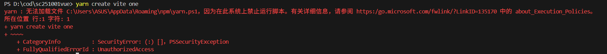
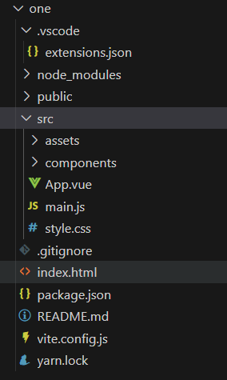
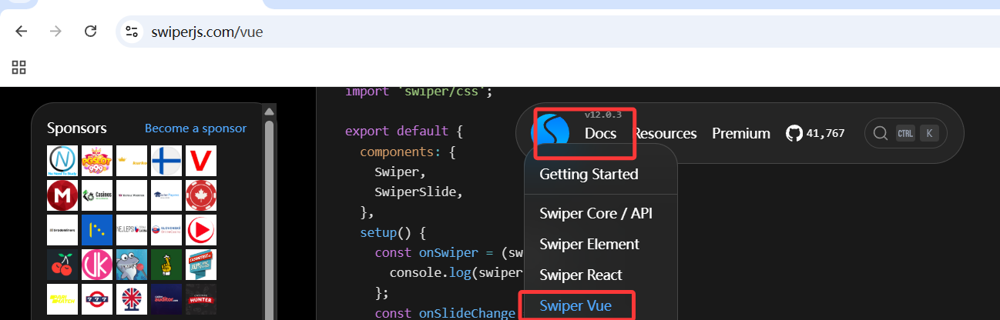
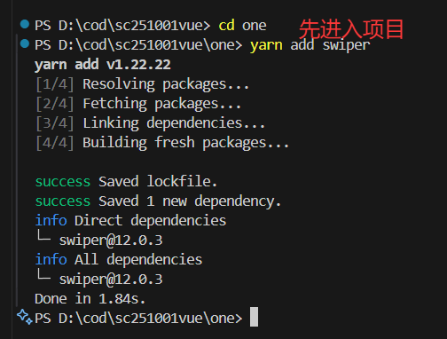
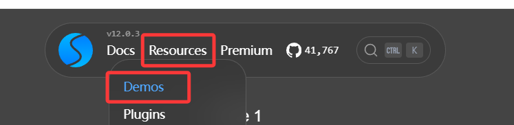
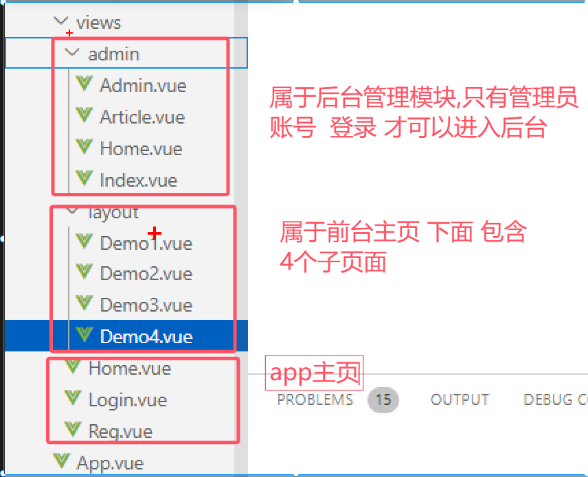
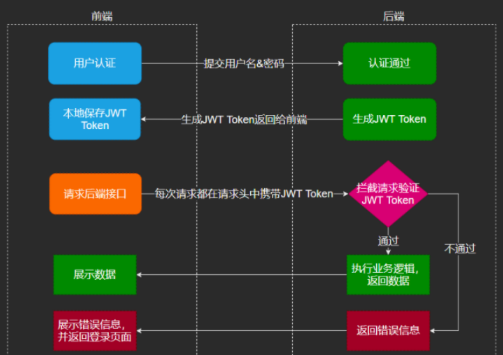

## Vue3

### 1. 安装前端环境

+ 安装node.js，推荐版本20+，它是前端开发环境，类似于后端jdk

  + cmd测试：

    ```bash
    node -v
    ```

    ```bash
    npm -v
    ```

    

+ （可选）安装cnpm属于国内的包管理器，访问速度比较快

+ 安装yarn：快速构建vue的

  + ```bash
    npm install -g yarn
    ```

  + 测试：

    ```bash
    yarn -v
    ```

> 安装过程中出现错误：尝试卸载老的版本
>
> + 通过控制面板找到node.js卸载
>
> + 打开环境变量删除之前跟node相关的所有配置，同时把本地文件也删除
>
> + 同时还删除C盘用户目录下
>
>   + .npmrc：registry=https://registry.npmmirror.com
>   + .vuerc：
>
> + 打开管理员cmd输入命令清空一下npm缓存，然后重新安装即可
>
>   ```bash
>   npm cache clean --force
>   ```


+ 安装vscode，版本无所谓，类似于idea属于前端的开发工具


### 2. 创建vue项目

+ 打开终端（类似于cmd）`ctrl+·`

+ 输入命令：

  ```bash
  yarn create vite 项目名（全部小写）
  ```

  + 如果出现错误：

    

    + 关闭vscode，右键兼容性管理员方式启动

    + 打开vscode打开终端输入一段指令，表示本地脚本可以自由运行

      ```bash
      set-ExecutionPolicy RemoteSigned
      ```

+ 选择vue模版

+ 选择javascript或者typescript

+ Use rolldown-vite：推荐使用no更稳定，使用yes表示是否使用rolldown打包工具

+ Install with yarn and start now?：推荐使用yes，表示使用yarn替代之前的npm

+ 等待项目创建成功：

  + 启动项目：

    + `cd 项目名`：进入到项目的根目录

    + 通过命令启动：

      ```bash
      yarn dev
      ```

  + 关闭项目：

    + `ctrl+c` 关闭


### 3. 什么是vue

vue是一个用于构建用户界面的js框架，免除原生js中的dom操作（比如：通过getElementById获取对象，再通过value或innerHtml给内容赋值，内容如果发生了变化，也要赋最新的值），是通过数据驱动视图的方式，当数据发生变化了，界面的内容也会自动更新，这样使开发者只关注数据逻辑，底层是基于MVVM思想，是用于实现数据双向绑定的

+ MVC思想：会把一个系统分成模型成（M），视图层（V），控制层（C）

+ MVVM思想：可以实现数据双向绑定，就是模型的数据发生变化后，页面展示的视图也会随之改变，反之视图的内容发生了变化，绑定模型数据也会发生变化，所以MVVM也是分页Model（模型层（数据）），View（视图层（界面）），ViewModel专门用于做这两者的双向绑定

  ```html
  <html>
     <body>
         <div id="app">
                <input  v-model="username"/>
                <div>
                      username: {{ username }}
                </div>
         </div>
     </body>
  </html>
  <script src="https://cdn.jsdelivr.net/npm/vue/dist/vue.js"></script>
  <script>
       new Vue({
            el: "#app",
            data(){
                 return{  //用于定义变量的位置
                        username:"admin"
                 }
            }
       });
  </script>
  ```

  结果：当文本框输入内容的时候，后面展示的数据会自动发生变化，反之下面的数据修改了，上面文本框展示的数据也会修改


### 4. vue项目结构



+ node_modules：类似于java项目中项目依赖，是前端vue项目运行环境，

  如果出现误删的问题，可以通过命令：`npm install`，会自动通过package.json文件编写的依赖进行安装

+ src：就是前端项目的根目录

  + assets：静态资源存放的目录，比如：img，css......
  + components：存放vue组件（vue页面）的目录，
  + App.vue：Vue核心组件，所有组件都需要通过它来访问，最多算默认首页
  + main.js：类似于java中的main()，是vue程序的入口
  + sytle.css：用于给App组件添加默认样式

+ package.json：类似于java中的pom.xml

+ vite.config.js：是vue项目的唯一配置文件，后期引入第三方组件库，或者跨域都需要它来完成，修改了必须要重启才会生效


### 5. Vue基础语法

+ 基于Vue3.2以上的版本

  ```vue
  <!--编写html内容的-->
  <template>
  
  </template>
  
  <!--编写vue部分,
  setup是vue3.2开始支持的格式:语法糖，
  1.可以简化老版本Vue定义函数，定义变量繁琐的操作
  2.可以帮我们自动导出组件，无需编写export default
  
  -->
  <script setup>
  
  </script>
  
  <!--编写css代码，scoped是为了防止样式穿透，表示样式只对当前组件有效
  -->
  <script scoped>
  
  </script>
  ```

  

#### 5.1 js声明变量的方式： var和let和const的区别 ---面试题

+ var：用于定义全局变量，也可以作用在局部区域，允许重复声明

+ let：用于替代var，只能作用在局部区域，不允许重复声明

+ const：用于定义常量，不能修改，只能作用于局部区域，也不能重复声明

  vue中经常会使用const定义变量，如果想修改，可以把声明成引用类型，这样地址不能修改，但是里面的属性值是可以修改的

  ```vue
  const user=ref({ ... })   user.value表示对象
  ```

  

#### 5.2 vue中组件引用步骤  ---面试题

+ 导入组件：

  ```vue
   import 组件名（可以任意写）from '组件地址'
  ```

+ 挂载组件：但是通过setup语法糖 是可以省略的

  ```vue
  components:{
       abc(组件名
  }
  ```

+ 显示组件：组件名，就是标签名来显示

  ```vue
  <abc/>
  ```

  

  

### 6.vue常用指令 ---面试题

指令：就是html标签上，带有v-开头的特殊属性，比如：v-model，v-if......不同的属性具有不同的含义

| 指令      | 作用                                                         |
| --------- | ------------------------------------------------------------ |
| v-bind    | 为html标签标定属性值的，比如：href，css样式，可以直接用==：== |
| v-model   | 一般用于表单元素，实现创建双向数据绑定                       |
| v-on      | 为html标签绑定事件，可以替换成@                              |
| v-if      | 条件渲染标签，判断为true时，进行渲染，否则不渲染（不存在）   |
| v-else-if | ...                                                          |
| v-else    | ...                                                          |
| v-show    | 功能类似于v-if但是底层不同                                   |
| v-for     | 列表渲染，遍历容器中的数据或者集合.....                      |


#### 6.1 v-bind指令和v-model指令

```vue
<template>
    <!-- 测试v-model -->
    <p>账号：<input v-model="user.username" /></p>
    <p>密码<input v-model="user.password" /></p>
    <p>年龄<input v-model="user.age" /></p>
    <p>性别:
        <input type="radio" value="1" v-model="user.sex" />男
        <input type="radio" value="0" v-model="user.sex" />女

    </p>
    <button @click="show">显示结果</button>

    <!-- 测试v-bind：为了绑定属性值，是为了让它变成动态，就可以根据下面定义的变量动态修改
 -->
    <a v-bind:href="url">链接1</a>
    <!--并且：v-bind是可以省略的 -->
    <a :href="url">链接2</a>
    <!-- 结合v-model写个案例：地址是可变的，连接名也是可变的 -->
    <p>输入地址：<input v-model="url" /></p>
    <p>输入链接名：<input v-model="urlName" /></p>
    <a :href="url">{{ urlName }}</a>
</template>
<script setup>
import { ref } from 'vue';
const user = ref({})
const url = ref("https://www.baidu.com");
const urlName = ref("链接3");
    
const show = () => {
    console.log(user.value)
    //后期就可以直接发送异步请求，访问后端，
    //传递json
}

</script>
```


#### 6.2 条件判断指令

```vue
<template>
    <input v-model="user.roleid" />
    <div v-if="user.roleid == 1">超级管理员</div>
    <div v-else-if="user.roleid == 2">用户管理员</div>
    <div v-else-if="user.roleid == 3">会员用户</div>
    <div v-else="user.roleid == 4">游客</div>
    <!-- 通过display样式来隐藏的 -->
    <div v-show="user.roleid == 1">超级管理员2</div>
</template>

<script setup>
import { ref } from "vue"
const user = ref({
    roleid: 1
})

</script>

<style scoped></style>
```

> 面试题：v-if和v-show区别
>
> 答案：
>
> + v-if：是根据条件判断是否成立，来进行渲染的，如果不成立这个标签就不会在浏览器呈现出来
> + v-show：功能和if类似，也可以做条件判断，但是底层是通过修改display样式，设置成none来隐藏元素的，它是无论条件是否成立都会渲染


#### 6.3 v-for指令

```vue
语法规则1:这里用什么标签都可以
<标签 v-for="临时变量 in 集合或者数组">
    {{ 临时变量 }}
</标签>

语法规则2:这里用什么标签都可以
<标签 v-for="(临时变量,索引变量) in 集合或者数组">
    <!--索引变量就是下标，从0开始-->
   {{ 索引变量+1 }} {{ 临时变量 }}
</标签>
```

```vue
<template>
    <table>
        <tr>
           <th>序号</th>
           <th>姓名</th>
           <th>数学</th>
           <th>语文</th>
           <th>英语</th>
        </tr>
        <tr v-for="(s,i) in scores">
            <td>{{ i+1 }}</td>
            <td>{{ s.name }}</td>
            <td>{{ s.math }}</td>
            <td>{{ s.chinese }}</td>
            <td>{{ s.english }}</td>
        </tr>
    </table>
</template>

<script setup>
import { ref } from "vue"
//这个集合数据，以后肯定不是写死的
//而是通过后端给你返回的数据
const scores = ref([
    { name: 'Bob', math: 97, chinese: 89, english: 67 },
    { name: 'Tom', math: 67, chinese: 52, english: 98 },
    { name: 'Jerry', math: 72, chinese: 87, english: 89 },
    { name: 'Ben', math: 92, chinese: 87, english: 59 },
    { name: 'Chan', math: 47, chinese: 85, english: 92 },
])
//通过挂载函数出发这个加载数据
// axios.post(url).then(res=>{
//     scores.value=res.data.data;
// })

</script>

<style scoped></style>
```


#### 6.4 v-on指令

```vue
<template>
    <!-- v-on指令：用于绑定事件（类似于js事件）
 onclick onchange onblur onmouseover -->
    <!-- v-on：可以替换成@ -->
    <!-- <button v-on:事件名="函数(参数)">按钮</button>
    <button @事件名="函数(参数)">按钮</button> -->
    <button v-on:click="test1">按钮1</button>
    <input @change="test2" />
    <div style="border: 1px solid black;" v-on:mouseover="test3" v-on:mouseout="test4" >
        我是div标签
    </div>

</template>

<script setup>
import { ref } from "vue"
const test1 = () => {
    console.log("我点击了")
}
const test2 = () => {
    console.log("我改变了")
}
const test3 = () => {
    console.log("我移入了")
}
const test4 = () => {
    console.log("我移出了")
}
</script>

<style scoped></style>
```


### 7.vscode快速生成vue代码模板

file（文件） --->Preferences(首选项) --->Configure Snippets（配置代码片段）--->输入vue（选择vue.json）

```json
{
	"Print to console": {
		"prefix": "vue3.2", //vue文件输入代码前缀
		"body": [ //主体自动生成的代码格式
			"<template>\n",
			"</template>\n",
			"<script setup>",
			"import { ref } from \"vue\"",
			"</script>\n",
			"<style scoped>\n</style>",
			"$2"
		],
		"description": "Log output to console"
	}
}
```


### 8.组件基础

Vue是基于组件开发，每个组件都是*.vue的文件，它是一种特殊的文件，因为它允许Vue组件嵌入html代码，和业务逻辑和样式，封装在一起


#### 8.1 引入组件步骤

+ 引入组件
+ 挂载组件（setup语法糖可以省略）
+ 显示组件


#### 8.2 组件交互


##### 8.2.1 组件之间如何传递数据 ---面试题

+ 父组件传递数据给子组件：首先父组件，在显示组件的标签中通过==：==做自定义属性的绑定，而属性值就是传递给子组件的数据，然后子组件通过defineProps函数，指定好当时传递的自定义属性名和对应的类型
+ 子组件传递数据给父组件：首先子组件，通过$emit或defineEmits函数，用于绑定自定义事件，事件的参数就是传递的数据，然后父组件，在显示组件的标签中，通过@自定义事件名，来触发函数，来接受子组件传递的数据，函数的参数就是子组件传递过来的数据


##### 8.2.2 父传子案例：

+ App：

  ```vue
  <template>
    <!--显示组件：通过组件名 ，作为标签名来显示组件  -->
    <!-- App是父组件，One是子组件 -->
    <!-- 通过自定义属性（属性名可以任意写） 子组件就需要通过属性名获取 -->
    <One :name="name" :age="18" />
  </template>
  
  <script setup>
  import One from './components/day1/One.vue'
      
  const name = "admin"
  </script>
  
  ```

  

+ One：

  ```vue
  <template>
      <h3>我是App的child组件One</h3>
      <h4>姓名：{{ name }}</h4>
      <h4>年龄：{{ age }}</h4>
      <!-- One是父组件，Two是子组件 -->
      <Two :user="user" :users="users"/>
  </template>
  
  <script setup>
  import { ref, defineProps } from "vue"
  import Two from './Two.vue'
  //用于接受父组件传递的数据
  //key就是自定义属性名
  //value就是传递的数据类型
  defineProps({
      name: { type: String },
      age: { type: Number }
  })
  
  const user = ref({
      name: "张三",
      age: 18
  })
  
  const users = ref([
      { name: "李四", age: 20 },
      { name: "王五", age: 22 },
      { name: "赵六", age: 24 },
      { name: "小七", age: 26 }
  ])
  </script>
  
  ```

  

+ Two：

  ```vue
  <template>
      <h3>我是One的child组件Two</h3>
     <h3>用户：{{ user.name }}，{{ user.age }}岁</h3>
     <h3>用户列表：</h3>
     <ul>
         <li v-for="u in users">
             姓名：{{ u.name }}，年龄：{{ u.age }}岁
         </li>
     </ul>
  </template>
  
  <script setup>
  import { ref, defineProps } from "vue"
  defineProps({
      user: { type: Object },
      users: { type: Array }
  })
  </script>
  
  ```

  

##### 8.2.3 子传父案例

+ Child：

  ```vue
  <template>
      <h3>我是子组件</h3>
      <!-- 第一种方式：可以在页面中通过$emit直接编写触发自定义事件 
      $emit(自定义事件名,数据) 
      -->
      <button @click="$emit('send', '你好')">发送</button>
      <!-- 第二种方式：通过引入defineEmits来发送自定义事件 -->
      <button @click="test">发送2</button>
  </template>
  
  <script setup>
  import { ref, defineEmits } from "vue"
  // defineEmits(['自定义事件名', '事件2', ...]) 
  //通过触发不同的自定义事件，来返回一个触发器，用于发送事件
  const emit = defineEmits(['send2','send3','send4'])
  const test = () => {
      //参数：触发的事件名，参数2：数据
      emit('send2', '你好啊')
  }
  
  </script>
  
  <style scoped></style>
  ```

  

+ Parent:

  ```vue
  <template>
      <h3>我是父组件</h3>
      <!-- 通过@自定义事件名，来接收子组件发送的数据 -->
      <Child @send="getData" @send2="getData2" />
  </template>
  
  <script setup>
  import { ref } from "vue"
  import Child from "./Child.vue"
  //函数的参数就是子组件传递过来的数据
  const getData = (d) => {
      console.log("接收到子组件第一种方式传递的数据：", d)
  }
  
  const getData2 = (d) => {
      console.log("接收到子组件第二种方式传递的数据：", d)
  }
  </script>
  
  <style scoped></style>
  ```

  

  


#### 8.3 组件的生命周期 ---面试题

vue组件在被创建过程中经历不同的阶段，比如：数据监听，数据更新......而且每经历一个阶段，都会自动运行一些生命周期函数（钩子函数），这样开发者就可以利用这些钩子函数的特性，去编写自己的业务逻辑，vue组件一共存在8个阶段，所以就会对应8个钩子函数

| 状态（钩子函数） | 阶段周期 |
| ---------------- | -------- |
| beforeCreate     | 创建前   |
| created          | 创建后   |
| beforeMount      | 挂载前   |
| mounted          | 挂载后   |
| beforeUpdate     | 更新前   |
| updated          | 更新后   |
| beforeDestroy    | 销毁前   |
| destroyed        | 销毁后   |

```vue
<template>
    <h3>信息：{{ msg }}</h3>
    <button @click="msg = '新的信息'">修改</button>
    <p>当前页数:{{ pageInfo.pageNum }} 每页条数：{{ pageInfo.pageSize }}</p>
    <div>
        <p v-for="a in pageInfo.list">
            {{ a.id }}---{{ a.account }}---{{ a.password }}
        </p>
    </div>
    <input v-model="pageNum" />
    <button @click="init(pageNum)">跳转</button>
</template>

<!-- vue3.2以前，是如何使用钩子函数 -->
<!-- <script>
import { ref } from "vue"
export default {
    data() {
        return {
            //定义变量
            msg:"呵呵"
        }
    },
    methods: {
        //定义函数
    },
    //页面刚刚加载完成后，根据加载顺序，执行下面的四种函数
    beforeCreate() {
        console.log("创建前")
    },
    created() {
        console.log("创建后")
    },
    beforeMount() {
        console.log("挂载前")
    },
    mounted() {
        console.log("挂载后，页面的数据就可以正常显示")
        //目前最常用的钩子函数
        //这里需要调用后端，加载页面的初始化数据
    },
    //当组件修改后，会自动执行下面两个函数
    beforeUpdate() {
        console.log("更新前")
    },
    updated() {
        console.log("更新后")
    },//当组件销毁前后，执行下面两个函数
    beforeDestroy() {
        console.log("销毁前")
    },
    destroyed() {
        console.log("销毁后")
    }
}


</script> -->
<!-- vue3.2以上setup语法糖是如何使用钩子函数
    1.beforeCreate和created这两个函数已经别调用了
    2.钩子函数名，在原来的基础上，添加on作为前缀
    3。同一个钩子函数，可以写多个
-->
<script setup>
import { ref, onMounted, onUpdated } from "vue"
import axios from "axios"

const msg = ref("默认信息")
const pageInfo = ref({})
onMounted(() => {
    console.log("我挂载了")
})
onMounted(() => {
    console.log("我又挂载了")
    //就可以直接通过axios发送请求加载后端数据
    init(pageNum.value);
})
const pageNum = ref(1)//手动输入页码数
const init = (pageNum) => {
    axios.get("http://localhost:9999/show?pageNum=" + pageNum).then(res => {
        let result = res.data
        pageInfo.value = result.data;
    })
}
onUpdated(() => {
    console.log("我更新了")
})

</script>

<style scoped></style>

```


### 9.Vue引入第三方

第三方不属于vue，是其他语言写好的，可以基于vue运行的组件，不需要我们单独编写了，而我们需要学习如何引入比较成熟第三方，比如：swiper，axios，Elementplus，Vant......其他的第三方可以查看Vue2.0，Vue3.0官网找他们合作伙伴


#### 9.1 vue引入swiper

swiper是一个开源的，触屏滑动组件，底层是通过纯js实现的，用于实现轮播图的功能，可以面向不同的pc端，手机端，平板端......

> 官方网站：https://swiperjs.com



+ 安装命令

  ```bash
  npm i swiper
  或
  yarn add swiper
  ```



+ 在组件中，按照引入组建的方式，使用swiper，查看API文档，把相关的代码复制过来

```vue
<template>
    <swiper :effect="'cube'" :grabCursor="true" :cubeEffect="{
        shadow: true,
        slideShadows: true,
        shadowOffset: 20,
        shadowScale: 0.94,
    }" :autoplay="{
        delay: 2500,
        disableOnInteraction: false,
    }" :pagination="true" :navigation="true" :modules="modules" class="mySwiper">
        <swiper-slide></swiper-slide><swiper-slide></swiper-slide><swiper-slide></swiper-slide><swiper-slide></swiper-slide>
    </swiper>
</template>

<script setup>
import { ref } from "vue"
// Import Swiper Vue.js components
import { Swiper, SwiperSlide } from 'swiper/vue';
// Import Swiper styles
import 'swiper/css';
import 'swiper/css/effect-cube';
import 'swiper/css/pagination';
// import required modules
import { EffectCube, Pagination, Navigation,Autoplay } from 'swiper/modules';

const modules = ref([EffectCube, Pagination, Navigation,Autoplay])
</script>

<style scoped>
#app {
    height: 100%;
}

html,
body {
    position: relative;
    height: 100%;
}

body {
    background: #444;
    font-family:
        Helvetica Neue,
        Helvetica,
        Arial,
        sans-serif;
    font-size: 14px;
    color: #fff;
    margin: 0;
    padding: 0;
}

.swiper {
    width: 300px;
    height: 300px;
    position: absolute;
    left: 50%;
    top: 50%;
    margin-left: -150px;
    margin-top: -150px;
}

.swiper-slide {
    background-position: center;
    background-size: cover;
}

.swiper-slide img {
    display: block;
    width: 100%;
}
</style>

```

+ 同时也可以使用swiper写好的案例修改




### 10.Vue引入Axios

+ vue项目安装axios

  ```bash
  npm i axios
  yarn add axios
  ```

+ 引入axios组件

  ```js
  //想在什么组件使用axios，就需要导入axios
  import axios from axios
  ```

+ 使用axios组件

  ```js
  axios.post(url,json),then(res=>{
  	console.log(res.data);
  })
  ```

+ 通过axios和springboot做交互

  ```vue
  <template>
      <!-- 新增区域 -->
      <div>
          <h3>新增区域</h3>
          <p>账号：<input type="text" v-model="addAdmin.account" /></p>
          <p>密码：<input type="text" v-model="addAdmin.password" /></p>
          <p>姓名：<input type="text" v-model="addAdmin.name" /></p>
          <p>手机：<input type="text" v-model="addAdmin.phone" /></p>
          <button @click="add">新增</button>
      </div>
  
      <!-- 修改区域 -->
      <div>
          <h3>修改区域</h3>
          <input type="hidden" v-model="updateAdmin.id" />
          <p>账号：<input type="text" v-model="updateAdmin.account" /></p>
          <p>密码：<input type="text" v-model="updateAdmin.password" /></p>
          <p>姓名：<input type="text" v-model="updateAdmin.name" /></p>
          <p>手机：<input type="text" v-model="updateAdmin.phone" /></p>
          <button @click="update">修改</button>
      </div>
      <!-- 展示区域 -->
      <div>
          <h3>展示区域</h3>
          <table>
              <tr>
                  <th>编号</th>
                  <th>账号</th>
                  <th>密码</th>
                  <th>姓名</th>
                  <th>手机</th>
                  <th>操作</th>
              </tr>
              <tr v-for="a in info.list">
                  <td>{{ a.id }}</td>
                  <td>{{ a.account }}</td>
                  <td>{{ a.password }}</td>
                  <td>{{ a.name }}</td>
                  <td>{{ a.phone }}</td>
                  <td>
                      <a href="#" @click="updateShow(a)">修改</a>
                      <a href="#" @click="updateAdmin = a">修改</a>
                      <a href="#" @click="del(a.id)">删除</a>
                  </td>
              </tr>
          </table>
          <a href="#" @click="prev">上一页</a>
          <a href="#" @click="next">下一页</a>
      </div>
  </template>
  
  <script setup>
  import { onMounted, ref } from "vue"
  import axios from "axios"
  const info = ref({})
  const addAdmin = ref({})
  const updateAdmin = ref({})
  
  onMounted(() => {
      select(1)
  })
  const select = (pageNum) => {
      axios.get("http://localhost:9999/show?pageNum=" + pageNum).then(res => {
          info.value = res.data.data
      })
  }
  const prev = () => {
      select(info.value.prePage)
  }
  const next = () => {
      //阻止默认行为
      select(info.value.nextPage)
  }
  
  const add = () => {
      axios.post("http://localhost:9999/add", addAdmin.value).then(res => {
          console.log(res.data);
          let result = res.data
          if (result.code == 1) {
              alert(result.msg)
              select(1)
              //跳转到成功的界面
  
          } else {
              alert(result.msg)
              //跳转到失败的界面
          }
      })
  }
  
  const del = (id) => {
      axios.delete("http://localhost:9999/del?id=" + id).then(res => {
          console.log(res.data);
          select(1)
      })
  }
  
  const updateShow = (a) => {
      updateAdmin.value = a
  }
  
  const update = () => {
      axios.put("http://localhost:9999/update", updateAdmin.value).then(res => {
          console.log(res.data);
      })
  }
  
  </script>
  
  <style scoped></style>
  ```

  

### 11. 通过Axios进行请求封装 ---难点

项目开发过程中，请求会随着业务增多而越来越多，这样就会出现很多相同的部分，而且这样发送请求也不安全，所以实际开发过程中，必须要对请求做二次封装


#### 11.1 请求封装的好处

+ 统一管理和配置：封装axios请求，可以在一个地方统一配置Axios实例，便于集中管理，比如：设置请求的基础URL，请求头，超时时间......
+ 统一错误处理：可以处理请求的错误，减少每个组件，重复编写错误代码的处理
+ 代码复用：每个组件都可以单独去设计Axios请求逻辑，因为很多逻辑会重复，通过封装可以将这些请求逻辑，抽象出来，提高代码复用
+ 请求和响应的拦截器：封装axios请求时，可以使用请求和响应拦截器，对请求和响应做统一处理，比如：请求把传递给后端的数据做统一处理，对于响应可以把后端返回的数据，做统一校验


#### 11.2 如何实现请求封装  ---难点

+ 创建一个util包，创建一个文件request.js或者http.js用于实现axios请求封装

  ```js
  //1.导入axios
  import axios from 'axios'
  
  //2.创建axios实例
  const instance = axios.create({
      //控制请求超时时间
      timeout: 5000
  })
  
  //3.实现请求拦截器
  //参数1：请求发送成功的函数（）=>
  //参数2：请求发送失败的函数
  instance.interceptors.request.use(
      config => {
          if (config.method === "post") {
              //处理所有的post请求
          } else if (config.method === "get") {
              //处理所有的get请求
          }
          return config;
      },
      error => {
          //返回错误信息，reject()表示错误信息
          return Promise.reject(error);
      }
  )
  
  
  //4.实现响应拦截器
  //参数1：响应成功的函数
  //参数2：响应失败的函数
  instance.interceptors.response.use(
      response => {
          //如果响应成功?返回成功信息：返回错误信息
         return response.status == 200 ? Promise.resolve(response) : Promise.reject(response);
      },
      error => {
          //通过error定义一个响应常量
          const { response } = error;
          errorHandle(response.status, response.info);
      }
  )
  
  //5.根据响应状态码，封装错误映射（就是后端出现什么错误，控制台就会打印什么信息）
  const errorHandle = (status, info) => {
      switch (status) {
          case 400:
              console.log("客户端参数有误");
              break;
          case 403:
              console.log("没有权限");
              break;
          case 404:
              console.log("请求的资源不存在");
              break;
          case 405:
              console.log("请求方式不对");
          //也可以自行添加
          //...
          //表示其他的所有状态码，都统一打印info
          default:
              console.log(info);
      }
  }
  //6.导出axios案例
  export default instance
  ```

  

+ 创建一个api包：用于保存不同模块对于axios封装请求逻辑（可以写一个，也可以写多个）index.js和base.js(用于配置通用的地址前缀)

  + base.js

    ```js
    //创建公共地址
    const base={
        baseUrl:"http://localhost:9999"//端口号改变了，一定要修改，后期地址在配置文件中
    }
    
    //导出base
    export default base;
    ```

  + index.js

    ```js
    //import Admin from '../components/day2/Admin.vue'
    import axios from '../util/request.js'
    //再导入base的公共地址
    import base from "./base.js"
    //创建公共api接口，经常修改的，根据业务逻辑决定
    const api = {
        //如果想写一个针对于用户模块的api请求
        // adminRequest(url, data) {
        //     return axios.post(base.baseUrl + url, data)
        // }
    
        //如果想针对于所有请求统一编写api请求
        postRequest(url, data) {
            return axios.post(base.baseUrl + url, data)
        },
        getRequest(url, data) {
            return axios.get(base.baseUrl + url, data)
    
        }
    }
    
    //导出
    export default api
    ```

    

+ 使用封装后的请求和后端进行交互：导入index.js文件

  ```vue
  <template>
      <!-- 新增区域 -->
      <div>
          <h3>新增区域</h3>
          <p>账号：<input type="text" v-model="addAdmin.account" /></p>
          <p>密码：<input type="text" v-model="addAdmin.password" /></p>
          <p>姓名：<input type="text" v-model="addAdmin.name" /></p>
          <p>手机：<input type="text" v-model="addAdmin.phone" /></p>
          <button @click="add">新增</button>
      </div>
  
      <!-- 修改区域 -->
      <div>
          <h3>修改区域</h3>
          <input type="hidden" v-model="updateAdmin.id" />
          <p>账号：<input type="text" v-model="updateAdmin.account" /></p>
          <p>密码：<input type="text" v-model="updateAdmin.password" /></p>
          <p>姓名：<input type="text" v-model="updateAdmin.name" /></p>
          <p>手机：<input type="text" v-model="updateAdmin.phone" /></p>
          <button @click="update">修改</button>
      </div>
      <!-- 展示区域 -->
      <div>
          <h3>展示区域</h3>
          <table>
              <tr>
                  <th>编号</th>
                  <th>账号</th>
                  <th>密码</th>
                  <th>姓名</th>
                  <th>手机</th>
                  <th>操作</th>
              </tr>
              <tr v-for="a in info.list">
                  <td>{{ a.id }}</td>
                  <td>{{ a.account }}</td>
                  <td>{{ a.password }}</td>
                  <td>{{ a.name }}</td>
                  <td>{{ a.phone }}</td>
                  <td>
                      <a href="#" @click="updateShow(a)">修改</a>
                      <a href="#" @click="updateAdmin = a">修改</a>
                      <a href="#" @click="del(a.id)">删除</a>
                  </td>
              </tr>
          </table>
          <a href="#" @click="prev">上一页</a>
          <a href="#" @click="next">下一页</a>
      </div>
  </template>
  
  <script setup>
  import { onMounted, ref } from "vue"
  //不使用原始的axios
  // import axios from "axios"
  import api from '../../api/index.js'
  const info = ref({})
  const addAdmin = ref({})
  const updateAdmin = ref({})
  
  onMounted(() => {
      select(1)
  })
  const select = (pageNum) => {
      api.getRequest("/show?pageNum=" + pageNum, null).then(res => {
          info.value = res.data.data
      })
      //不使用原始axios
      // axios.get("http://localhost:9999/show?pageNum=" + pageNum).then(res => {
      //     info.value = res.data.data
      // })
  }
  const prev = () => {
      select(info.value.prePage)
  }
  const next = () => {
      //阻止默认行为
      select(info.value.nextPage)
  }
  
  const add = () => {
      api.postRequest("/add", addAdmin.value).then(res => {
          let result = res.data
          if (result.code == 1) {
              alert(result.msg)
              select(1)
              //跳转到成功的界面
  
          } else {
              alert(result.msg)
              //跳转到失败的界面
          }
      })
  
      // axios.post("http://localhost:9999/add", addAdmin.value).then(res => {
      //     console.log(res.data);
      //     let result = res.data
      //     if (result.code == 1) {
      //         alert(result.msg)
      //         select(1)
      //         //跳转到成功的界面
  
      //     } else {
      //         alert(result.msg)
      //         //跳转到失败的界面
      //     }
      // })
  }
  
  const del = (id) => {
      api.getRequest("/del?id=" + id, null).then(res => {
          console.log(res.data);
          select(1)
      })
  
      // axios.get("http://localhost:9999/del?id=" + id).then(res => {
      //     console.log(res.data);
      //     select(1)
      // })
  }
  
  const updateShow = (a) => {
      updateAdmin.value = a
  }
  
  const update = () => {
      api.postRequest("/update", updateAdmin.value).then(res => {
          console.log(res.data)
      })
  
      // axios.get("http://localhost:9999/update", updateAdmin.value).then(res => {
      //     console.log(res.data);
      // })
  }
  
  </script>
  
  <style scoped></style>
  ```

  

### 12.跨域

+ 主流解决跨域方案：

  + 后端：

    + 跨域注解@CrossOrigin
    + 跨域配置类
    + 配置跨域过滤器

  + 前端：

    + 通过配置文件(vite.config.js)写一个代理组件，配置好转发到后端地址，修改完配置必须要重启

      ```js
      import { defineConfig } from 'vite'
      import vue from '@vitejs/plugin-vue'
      
      // https://vite.dev/config/
      export default defineConfig({
        plugins: [vue()],
        resolve: {
          alias: {//设置@符号映射目录
            '@': '/src'
          }
        },
        server: {
          port: 5173,//自定义前端端口号
          proxy: {//配置跨域
            '/api': {//配置名api的代理
              target: 'http://localhost:9999',//请求后端的接口地址，就是代理最终转发目标地址，以后/api/xxx等价于http://localhost:9999/api/xxx
              changeOrigin: true,//开启跨域
              // pathRewrite: { '^/api': '' }//路径重写,http://localhost:9999/xxx,
              rewrite:(path)=>path.replace(/^\/api/,'')//目的：查找api
            }
          }
        }
      })
      
      ```


### 13. Vue路由 ---重点，面试题

路由主要用于管理Vue组件的关系，而不是简单的跳转，这可以让Vue.js构建单页应用，更加容易，更加轻松，同时还可以配置多级路由，甚至还可以结合mysql数据库实现动态路由


#### 13.1 安装和配置路由的步骤

+ 安装路由组件

  ```bash
  yarn add vue-router
  ```

+ 创建一个router包，包里创建一个index.js表示路由配置文件

  ```js
  //路由配置文件
  import { createRouter, createWebHashHistory } from 'vue-router'
  import Home from '../views/Home.vue'
  import About from '../views/About.vue'
  
  //路由规则数组：
  const routes = [
      //一个组件的规则，是一个对象
      {
          path: "/",
          component: Home
      }
      , {
          path: "/about",
          component: About
      }
  ]
  
  
  //创建路由实例
  const router = createRouter({
      //createWebHashHistory:路由的地址栏显示/#,比如（/#/，/#/student/）,会在地址栏前面添加/#前缀
      //createWebHistory:地址栏不会添加任何内容,这种方式需要后端配置做重定向，否则404
      history: createWebHashHistory(),
      //路由规则（告诉vue哪个组件对应哪个地址,通常不止一个，所以会配置成数组）
      routes
  })
  
  //导出路由实例
  export default router;
  
  ```

  

+ 创建views包，用于保存需要被路由管理的vue组件、

  + 创建不同vue组件，实现功能......

  

+ 最后vue项目入口（main.js）引入路由，让其生效

  ```js
  import router from './router/index.js'
  createApp(App).use(router).mount('#app')
  ```

  

+ 在页面中如何使用App.vue

  ```vue
  <template>
    <!-- 用于实现路由跳转的标签，类似于a标签 -->
    <router-link to="/">首页</router-link>
    <router-link to="about">关于</router-link>
    <!-- 用于显示路由的入口 -->
    <div>
      <router-view />
    </div>
  </template>
  
  <script setup>
  import { ref } from "vue"
  </script>
  
  <style scoped></style>
  ```

  

#### 13.2 路由参数传递  ---面试题

+ 如果传递简单的参数，比如：字符串

  + 修改路由配置文件：path地址，添加==/:参数名==

    ```js
    //:表示要传递参数，key表示参数名
    //传递多个参数 /url/：key1/：key2
    path: "/newsContent/:name",
    ```

  + 直接通过`router-link`标签`to`属性，编写链接地址时候，添加传递的数据

    ```vue
    <li><router-link to="/newsContent/百度">百度新闻</router-link></li>
    ```

+ 如果传递复杂参数，比如：对象

  + 路由配置文件：

    + path地址，添加==/:参数名==，
    + 同时要添加==name==表示组件名

    ```js
    //如果传递特殊参数，比如对象
    path: "/userInfo/:user",
    name:"userInfo",//组件名
    ```

  + 通过`router-link`标签`:to`属性，编写组件名和params表示传递的数据，

    但是传递对象，只能通过字符串形式传递，所以需要类型转换（`参数名:JSON.stringify(对象)`）

    ```vue
    <!-- 方式1：通过to编写链接，传递对象 -->
    <!-- JSON.stringify(对象)，用于将对象转换成字符串 -->
    
    <router-link :to="{ name: 'userInfo', params: { user: JSON.stringify(user) } }">用户信息</router-link>
    ```

  + 也可以通过`router对象.push()`，也可以传递参数

    ```vue
    <button @click="send">发送</button>
    
    <script setup>
    import { ref } from "vue"
    //导入
    import { useRouter } from "vue-router"
    //类似于发送方的路由对象
    const router = useRouter()
    const user = ref({
        id: 1,
        name: "ikun",
        age: 18
    })
    const send = () => {
        //方式2：通过router对象.push()，将数据传递给其他组件，push也可以实现跳转
        router.push({
            name: 'userInfo',
            params: { user: JSON.stringify(user.value) }
        })
    }
    </script>
    ```

+ **接受数据**

  + 可以界面中可以直接使用`$route.params.参数名`，通常用于获取简单参数，比如字符串

    ```vue
    <!-- .name是因为路由配置文件，参数名是name -->
    <p>{{ $route.params.name }}</p>
    ```

    

  + 也可以导入useRoute对象，通过`route.params.参数名`，也可以获取，如果传递的是对象类型，还需要将原来的字符串解析成对象（`JSON.parse(route.param.参数名)`）

    ```vue
    <template>
        <h3>用户信息界面</h3>
        <p>编号：{{ user.id }}</p>
        <p>姓名：{{ user.name }}</p>
        <p>年龄：{{ user.age }}</p>
    </template>
    
    <script setup>
    import { ref } from "vue"
    //导入
    import { useRoute } from 'vue-router'
    //类似于接收方的路由对象
    const route = useRoute()
    //JSON.parse(字符串)，将字符串解析成json对象
    const user = JSON.parse(route.params.user)
    
    </script>
    ```


#### 13.3 二级路由

如果项目中的复杂需求，有父级导航，还有子级导航，每个导航都会有很多子级的页面，那么就需要配置多级路由的方式

+ 只需要在路由配置文件中，哪里需要添加二级路由，就哪里添加children属性即可

  ```js
  {
          path: "/about",
          //异步导入，什么时候访问，什么时候导入
          //只有主页适合同步导入，其他页面适合一部导入
          component: () => import("../views/About.vue"),
          //二级路由
          children: [
              {
                  path: "user",//二级路由开始不要加斜杠
                  component: () => import("../views/AboutUser.vue")
              },
              {
                  path: "info",//二级路由开始不要加斜杠
                  component: () => import("../views/AboutInfo.vue")
              },
          ]
      },
  ```

+ 使用二级路由时，访问链接，需要添加一级地址和二级地址

  ```vue
  <template>
      <h3>关于页面</h3>
      <div>
          <!-- 如果是二级路由，地址:/一级地址/二级地址 -->
          <router-link to="/about/user">关于我们</router-link> |
          <router-link to="/about/info">关于信息</router-link>
      </div>
      <!-- 显示二级路由的窗口 -->
      <router-view />
  </template>
  ```

==注==：如果是三级路由继续套娃，理论上是可以无限嵌套的，但是实际开发过程中二级路由足够了


### 14. Vue3引入Elementplus组件库

Elementplus是开源的饿了么组件库，也是可以基于vue开发的，提供很多完成的很好的组件，开发者只需要找到对应的组件直接拉取使用，Elementplus应用场景非常广泛，主要用于实现pc端的后台管理界面，早期是ElementUI，对应的版本是Vue2.0，而Elementplus适用于Vue3.0

> 官网：https://element-plus.org/zh-CN/component/button.html
>
> 国内镜像站点：https://cn.element-plus.org/zh-CN/


#### 14.1 安装和配置Elementplus

1. 安装Elementplus

   ```
   yarn add element-plus
   ```

2. 引入Elementplus

   + 完整引入：如果项目大小不在乎，使用它比较方便，只需要在main.js添加代码，使用Elementplus

     ```js
     import { createApp } from 'vue'
     import './style.css'
     import App from './App.vue'
     import router from './router/index.js'
     //导入elementplus组件
     import ElementPlus from 'element-plus'
     //导入elementplus的样式
     import 'element-plus/dist/index.css'
     
     // 使用elementplus
     // createApp(App).use(ElementPlus).use(router).mount('#app')
     const app = createApp(App)
     
     app.use(ElementPlus)
     app.use(router)
     app.mount('#app')
     ```

     

   + 按需引入：根据需要引入必要组件，比较节省空间，开发的首选

     + 安装两个插件components和auto-import

       ```
       yarn add -D unplugin-vue-components unplugin-auto-import
       ```

     + vite.config.js配置文件中，添加这两个插件

       ```js
       import { defineConfig } from 'vite'
       import vue from '@vitejs/plugin-vue'
       //导入
       import AutoImport from 'unplugin-auto-import/vite'
       import Components from 'unplugin-vue-components/vite'
       import { ElementPlusResolver } from 'unplugin-vue-components/resolvers'
       
       // https://vite.dev/config/
       export default defineConfig({
         plugins: [
           vue(),
           //添加
           AutoImport({
             resolvers: [ElementPlusResolver()],
           }),
           Components({
             resolvers: [ElementPlusResolver()],
           }),
         ],
       })
       
       ```
     
     + main.js之前全局导入删除，但是导入的==样式最好保留==
     
       

3. 使用Elementplus：找到你需要的组件，复制粘贴......

   

### 15. Vue3.5+axios(请求封装)+router+ts+Elementplus实战

+ 创建一个新Vue项目：

  ```
  yarn create vite 项目木
  ```

+ 安装依赖

  + axios：

    ```
    yarn add axios
    ```

  + router：

    ```
    yarn add vue-router
    ```

  + elementplus：

    ```
    yarn add element-plus
    ```

+ 配置环境

  + axios请求需要封装

    + util包中request.ts
    + api包中base.ts和index.ts

  + vue-router也需要配置

    + router包index.ts
    + views包存放由路由控制的组件
    + main.ts引入router

  + 前端也要实现跨域（vite.config.ts）

  + element-plus还要实现按需导入

    ```
    yarn add -D unplugin-vue-components unplugin-auto-import
    ```

+ 页面布局：

  + App.vue

  ```vue
  <template>
    <div class="common-layout">
      <el-container>
        <el-header>
          <!-- 头部导航 -->
          <el-menu :default-active="activeIndex" class="el-menu-demo" mode="horizontal" :ellipsis="false"
            @select="handleSelect">
            <el-menu-item index="0">
              
            </el-menu-item>
            <el-menu-item index="1"> IKUN之家 </el-menu-item>
            <el-sub-menu index="2">
              <template #title>登陆用户名</template>
              <el-menu-item index="2-1">个人信息</el-menu-item>
              <el-menu-item index="2-2">修改密码</el-menu-item>
              <el-menu-item index="2-3">退出登录</el-menu-item>
  
            </el-sub-menu>
          </el-menu>
        </el-header>
        <el-container>
          <el-aside width="250px">
            <!-- 左侧边栏 -->
            <!-- router表示开启路由，下面的index属性表示路由跳转地址 -->
            <el-menu router default-active="1" class="el-menu-vertical-demo" @open="handleOpen" @close="handleClose">
              <el-menu-item index="/">
                <!-- <el-icon>
                    <icon-menu />
                  </el-icon> -->
                <el-icon>
                  <HomeFilled />
                </el-icon>
                <span>首页</span>
              </el-menu-item>
              <el-menu-item index="2">
                <el-icon>
                  <icon-menu />
                </el-icon>
                <span>栏目管理</span>
              </el-menu-item>
              <el-menu-item index="/article">
                <template #title>
                  <el-icon>
                    <icon-menu />
                  </el-icon>
                  <span>文章管理</span>
                </template>
              </el-menu-item>
              <el-menu-item index="4">
                <template #title>
                  <el-icon>
                    <icon-menu />
                  </el-icon>
                  <span>客户反馈</span>
                </template>
              </el-menu-item>
              <el-sub-menu index="5">
                <template #title>
                  <el-icon>
                    <location />
                  </el-icon>
                  <span>系统管理</span>
                </template>
                <el-menu-item index="/admin">用户管理</el-menu-item>
                <el-menu-item index="1-2">角色管理</el-menu-item>
                <el-menu-item index="1-3">操作日志</el-menu-item>
                <el-menu-item index="1-4">权限管理</el-menu-item>
              </el-sub-menu>
            </el-menu>
  
          </el-aside>
          <!--路由显示路口 -->
          <el-main><router-view /></el-main>
        </el-container>
      </el-container>
    </div>
  </template>
  
  <script lang="ts" setup>
  import { ref } from "vue"
  import {
    Document,
    Menu as IconMenu,
    Location,
    Setting,
  } from '@element-plus/icons-vue'
  
  const handleOpen = (key: string, keyPath: string[]) => {
    console.log(key, keyPath)
  }
  const handleClose = (key: string, keyPath: string[]) => {
    console.log(key, keyPath)
  }
  const activeIndex = ref('1')
  const handleSelect = (key: string, keyPath: string[]) => {
    console.log(key, keyPath)
  }
  </script>
  
  <style scoped>
  .el-menu--horizontal>.el-menu-item:nth-child(1) {
    margin-right: auto;
  }
  </style>
  ```

  + admin.vue

  ```vue
  <template>
      <h3>用户管理</h3>
      <!-- 显示新增弹出层 -->
      <el-button type="primary" round @click="dialogAdd = true">新增用户</el-button>
      <el-button type="danger" round @click="batchDel">批量删除</el-button>
      <el-table :data="tableData" style="width: 100%">
          <!-- label表示表格标题，prop属于每条数据的属性 -->
          <!-- 复选框 -->
          <el-table-column type="selection" />
          <el-table-column label="编号" prop="id" />
          <el-table-column label="用户名" prop="account" />
          <el-table-column label="姓名" prop="name" />
          <el-table-column label="头像" prop="headPic" />
          <el-table-column label="手机" prop="phone" />
          <el-table-column label="邮箱" prop="email" />
          <el-table-column label="性别">
              <template #default="scope">
                  {{ scope.row.sex == 1 ? '男' : '女' }}
              </template>
          </el-table-column>
          <el-table-column label="角色" prop="role.rolename" />
          <el-table-column label="状态" width="120">
              <template #default="scope">
                  <el-tag :type="scope.row.status == 1 ? 'success' : (scope.row.status == 2 ? 'danger' : 'warning')"
                      size="small">
                      {{ scope.row.status == 1 ? "启用" : (scope.row.status == 2 ? "禁用" : "未验证") }}
                  </el-tag>
              </template>
          </el-table-column>
          <el-table-column label="操作">
              <template #default="scope">
                  <el-button size="small" @click="handleEdit(scope.$index, scope.row)">
                      Edit
                  </el-button>
                  <el-button size="small" type="danger" @click="handleDelete(scope.$index, scope.row)">
                      删除
                  </el-button>
              </template>
          </el-table-column>
      </el-table>
      <!-- 分页组件
          layout="total，sizes，prev，pager，next，jumper"
          分页布局的组件
          开启总条数，每页条数，上一页，页码数，下一页，跳转指定页码数 
      -->
      <el-pagination v-model:current-page="pageInfo.pageNum" v-model:page-size="pageInfo.pageSize"
          :page-sizes="[3, 6, 9, 12]" :size="size" :disabled="disabled" :background="background"
          layout="total, sizes, prev, pager, next, jumper" :total="pageInfo.total" @size-change="handleSizeChange"
          @current-change="handleCurrentChange" />
      <!-- 新增弹出层：默认隐藏 -->
      <el-dialog v-model="dialogAdd" title="新增用户" width="500" draggable="true">
          <!-- 表单 -->
          <el-form ref="ruleFormRef" style="max-width: 600px" :model="formAdd" :rules="rules" label-width="auto">
              <el-form-item label="账号" prop="account">
                  <el-input v-model="formAdd.account" />
              </el-form-item>
              <el-form-item label="密码" prop="password">
                  <el-input v-model="formAdd.password" />
              </el-form-item>
              <el-form-item label="确认密码" prop="confirmPwd">
                  <el-input v-model="formAdd.confirmPwd" />
              </el-form-item>
              <el-form-item label="姓名" prop="name">
                  <el-input v-model="formAdd.name" />
              </el-form-item>
              <el-form-item label="手机" prop="phone">
                  <el-input v-model="formAdd.phone" />
              </el-form-item>
              <el-form-item label="邮件" prop="email">
                  <el-input v-model="formAdd.email" />
              </el-form-item>
              <el-form-item label="性别" prop="sex">
                  <el-radio-group v-model="formAdd.sex">
                      <el-radio value="1" checked>男</el-radio>
                      <el-radio value="0">女</el-radio>
                  </el-radio-group>
              </el-form-item>
  
              <el-form-item label="状态" prop="status">
                  <el-segmented v-model="formAdd.status" :options="[
                      { label: '启用', value: 1 },
                      { label: '禁用', value: 2 },
                      { label: '未验证', value: 0 }
                  ]" />
              </el-form-item>
          </el-form>
          <template #footer>
              <div class="dialog-footer">
                  <el-button @click="dialogAdd = false">退出</el-button>
                  <el-button type="primary" @click="add">
                      新增
                  </el-button>
              </div>
          </template>
      </el-dialog>
  </template>
  
  <script lang="ts" setup>
  import { onMounted, ref, reactive } from 'vue'
  import api from '../api/index.ts'
  import { ElMessage, type ComponentSize } from 'element-plus'
  import { useRouter } from "vue-router"
  
  
  const size = ref<ComponentSize>('default')
  const background = ref(false)
  const disabled = ref(false)
  const tableData = ref([])
  const pageSize = ref(3)
  const router = useRouter()
  const pageInfo = ref({
      pageNum: 1,
      pageSize: 3,
      total: 1
  })
  const dialogAdd = ref(false)
  const formAdd = ref({})
  const rules = reactive<FormRules<RuleForm>>({
      account: [
          {
              required: true,//是否允许为空
              message: '姓名为空',
              trigger: 'blur'//失去焦点触发
          },
      ],
  })
  
  // interface User {
  //     id: Number
  //     account: string
  //     password: string
  //     name: String
  //     phone: String
  //     email: String
  //     status: String
  //     sex: String
  //     headPic: String
  // }
  
  // index: 当前行在表格数据中的索引（从0开始）
  // row: 当前行的完整数据对象
  const handleEdit = (index: number, row: any) => {
      console.log(index, row)
  }
  const handleDelete = (index: number, row: any) => {
      console.log(index, row)
      api.getRequest("/del?id=" + row.id).then((res: any) => {
          let result = res.data
          alert(result.msg)
          select(1, pageSize.value)
      })
  }
  
  onMounted(
      () => {
          select(1, pageSize.value)
      }
  )
  const select = (pageNum: Number, pageSize: Number) => {
      api.getRequest("/show?pageNum=" + pageNum + "&pageSize=" + pageSize).then((res: any) => {
          let result = res.data
          pageInfo.value = result.data
          tableData.value = result.data.list;
      })
  }
  const handleSizeChange = (val: number) => {
      console.log("每页条数改变了", val)
      pageSize.value = val
      select(1, val)
  }
  const handleCurrentChange = (val: number) => {
      console.log("当前页数发生了改变", val)
      select(val, pageSize.value)
  }
  
  // 跳转到Add.vue
  // const add = () => {
  //     console.log('addAdmin')
  //     router.push({
  //         name: "add"
  //     })
  // }
  const add = () => {
      console.log(formAdd.value)
      api.postRequest("/add", formAdd.value).then((res: any) => {
          let result = res.data
          if (result.code) {
              ElMessage.success(result.msg)
              //重新加载数据
              select(1, pageSize.value)
              //关闭弹出岑
              dialogAdd.value = false
              //控制表单数据
              formAdd.value = {}
          }
      })
  }
  const batchDel = () => {
  
  }
  
  
  </script>
  
  <style scoped></style>
  
  ```

  


### 16. Vue3引入Vant4组件

Vant是一个轻量级的，可定制化的移动端组件库，使用方式类似于Elementplus，应用场景：移动端，微信小程序，通常用于编写前台可视化界面

> 官网：https://vant-ui.github.io/vant/#/zh-CN


#### 16.1 Vant的使用步骤

+ 安装Vant：

  ```
  yarn add vant
  ```

+ 按需引入Vant

  + 先安装插件

    ```
    yarn add @vant/auto-import-resolver unplugin-vue-components unplugin-auto-import -D
    ```

  + vite.config.js配置文件添加插件

    ```ts
    import { defineConfig } from 'vite'
    import vue from '@vitejs/plugin-vue'
    //添加
    import AutoImport from 'unplugin-auto-import/vite'
    import Components from 'unplugin-vue-components/vite'
    import { ElementPlusResolver } from 'unplugin-vue-components/resolvers'
    import { VantResolver } from '@vant/auto-import-resolver';
    
    // https://vite.dev/config/
    export default defineConfig({
      plugins: [
        vue(),
          //添加
        AutoImport({
          resolvers: [ElementPlusResolver(), VantResolver()],
        }),
        Components({
          resolvers: [ElementPlusResolver(), VantResolver()],
        }),
      ],
      resolve: {
        alias: {//设置@符号映射目录
          '@': '/src'
        }
      },
      server: {
        port: 5173,//自定义前端端口号
        proxy: {//配置跨域
          '/api': {//配置名api的代理
            target: 'http://localhost:9999',//请求后端的接口地址，就是代理最终转发目标地址，以后/api/xxx等价于http://localhost:9999/api/xxx
            changeOrigin: true,//开启跨域
            // pathRewrite: { '^/api': '' }//路径重写,http://localhost:9999/xxx,
            rewrite: (path) => path.replace(/^\/api/, '')//目的：查找api
          }
        }
      }
    })
    
    ```
    
    

+ 使用Vant：直接找到Vant官网，复制需要的组件即可

  

### 17. springboot+vue3+vant4+Elementplus...实现综合案例

+ 创建项目安装环境

  + 创建项目：yarn create vite 项目名

  + 安装环境：

    + 安装axios：yarn add axios
    + 安装路由：yarn add vue-router
    + 安装elementplus：yarn add element-plus
    + 安装vant：yarn add vant

  + 配置环境

    + axios要做请求封装（api文件和util包，具体使用看 11.2）

      - api中base.ts文件（api/base.ts）

        ```ts
        //创建公共地址
        const base={
            baseUrl:"/api"
        }
        
        //导出base
        export default base;
        ```
        
      - api中index.ts文件（api/index.ts）
      
        ```ts
        import axios from '../util/request'
        //再导入base的公共地址
        import base from "./base"
        //创建公共api接口，经常修改的，根据业务逻辑决定
        const api = {
            //如果想写一个针对于用户模块的api请求
            // adminRequest(url, data) {
            //     return axios.post(base.baseUrl + url, data)
            // }
        
            //如果想针对于所有请求统一编写api请求
            //ts语言：添加形参要加类型，并且data参数不一定要传递，形参后添加?表示可选参数
            postRequest(url: String, data?: Object, obj?: Object) {
                return axios.post(base.baseUrl + url, data, obj)
            },
            getRequest(url: String, data?: Object) {
                return axios.get(base.baseUrl + url, data)
            }
        }
        
        //导出
        export default api
        ```
        
      - util包request.ts（util/request.ts）
      
        ```ts
        //1.导入axios
        import axios from 'axios'
        
        //2.创建axios实例
        const instance = axios.create({
            //控制请求超时时间
            timeout: 100000
        })
        
        //3.实现请求拦截器
        //参数1：请求发送成功的函数（）=>
        //参数2：请求发送失败的函数
        //两个函数都具有返回值
        instance.interceptors.request.use(
            //req就是个形参
            req => {
                const token = localStorage.getItem("myToken")
                if (token) {//等价于验证是否为null
                    // req.headers.名称=token;
                    req.headers.myToken = token;
                }
                //get请求没有请求头，一般是通过post传递头信息
                if (req.method === "post") {
                    //处理所有的post请求
                } else if (req.method === "get") {
                    //处理所有的get请求
                }
                return req;
            },
            error => {
                //返回错误信息，reject()表示错误信息
                return Promise.reject(error);
            }
        )
        
        
        //4.实现响应拦截器
        //参数1：响应成功的函数
        //参数2：响应失败的函数
        instance.interceptors.response.use(
            response => {
                //如果响应成功?返回成功信息：返回错误信息
                return response.status == 200 ? Promise.resolve(response) : Promise.reject(response);
            },
            error => {
                //通过error定义一个响应常量
                const { response } = error;
                errorHandle(response.status, response.info);
            }
        )
        
        //5.根据响应状态码，封装错误映射（就是后端出现什么错误，控制台就会打印什么信息）
        //ts:定义函数的时候，要跟java一样，方法的形参要添加类型(形参名：类型)
        const errorHandle = (status: Number, info: String) => {
            switch (status) {
                case 400:
                    console.log("客户端参数有误");
                    break;
                case 403:
                    console.log("没有权限");
                    break;
                case 404:
                    console.log("请求的资源不存在");
                    break;
                case 405:
                    console.log("请求方式不对");
                //也可以自行添加
                //...
                //表示其他的所有状态码，都统一打印info
                default:
                    console.log(info);
            }
        }
        //6.导出axios案例
        export default instance
        ```
    
    
    
    + 路由还需要编写配置文件，并创建一个views包用于保存被路由管理的vue组件
    
      ==注==：一定要在vue项目入口（main.js）引入路由，让其生效
    
      ```ts
      import { createApp } from 'vue'
      import './style.css'
      import App from './App.vue'
      //如果使用了element-plus要导入样式
      import 'element-plus/dist/index.css'
      import router from './router/index.ts'
      
      
      
      // createApp(App).mount('#app')
      const app = createApp(App)
      app.use(router)
      app.mount('#app')
      ```
    
      + 路由配置文件（router/index.ts）
    
      ```ts
      //路由配置文件
      import { createRouter, createWebHashHistory, type RouteRecordRaw } from 'vue-router'
      import Home from "../views/Home.vue"
      // import About from '../views/About.vue'
      
      //路由规则数组：
      //ts语言：定义特殊类型的变量一般是需要添加泛型的
      const routes: Array<RouteRecordRaw> = [
          //一个组件的规则，是一个对象
          {
              path: "/",
              component: Home,
              redirect: "/demo1",//表示进入首页默认展示的子路由
              children: [
                  {
                      path: "demo1",
                      component: () => import("../views/layout/Demo1.vue")
                  },
                  {
                      path: "demo2",
                      component: () => import("../views/layout/Demo2.vue")
                  },
                  {
                      path: "demo3",
                      component: () => import("../views/layout/Demo3.vue")
                  },
                  {
                      path: "demo4",
                      component: () => import("../views/layout/Demo4.vue")
                  }
              ]
          },
          {
              path: "/login",
              component: () => import("../views/Login.vue")
          },
          {
              path: "/reg",
              component: () => import("../views/Reg.vue")
          },
          {
              path: "/index",
              component: () => import("../views/admin/Index.vue"),
              children: [
                  {
                      path: "admin",
                      component: () => import("../views/admin/Admin.vue")
                  },
                  {
                      path: "article",
                      component: () => import("../views/admin/Article.vue")
                  },
                  {
                      path: "home",
                      component: () => import("../views/admin/Home.vue")
                  }
              ]
          }
      
      ]
      
      
      //创建路由实例
      const router = createRouter({
          //createWebHashHistory:路由的地址栏显示/#,比如（/#/，/#/student/）,会在地址栏前面添加/#前缀
          //createWebHistory:地址栏不会添加任何内容,这种方式需要后端配置做重定向，否则404
          history: createWebHashHistory(),
          //路由规则（告诉vue哪个组件对应哪个地址,通常不止一个，所以会配置成数组）
          routes
      })
      
      //导出路由实例
      export default router;
      
      ```
    
    + elementplus和vant都需要按需导入
    
      ```
      yarn add @vant/auto-import-resolver unplugin-vue-components unplugin-auto-import -D
      ```
    
    + vite.config.js配置文件添加插件
    
    + 前端跨域
    
      ```ts
      import { defineConfig } from 'vite'
      import vue from '@vitejs/plugin-vue'
      //导入依赖
      import AutoImport from 'unplugin-auto-import/vite'
      import Components from 'unplugin-vue-components/vite'
      import { ElementPlusResolver } from 'unplugin-vue-components/resolvers'
      import { VantResolver } from '@vant/auto-import-resolver';
      
      // https://vite.dev/config/
      export default defineConfig({
        plugins: [
          vue(),
            //添加插件
          AutoImport({
            resolvers: [ElementPlusResolver(), VantResolver()],
          }),
          Components({
            resolvers: [ElementPlusResolver(), VantResolver()],
          }),
        ],
        resolve: {
          alias: {//设置@符号映射目录
            '@': '/src'
          }
        },
        server: {
          port: 5173,//自定义前端端口号
          proxy: {//配置跨域
            '/api': {//配置名api的代理
              target: 'http://localhost:9999',//请求后端的接口地址，就是代理最终转发目标地址，以后/api/xxx等价于http://localhost:9999/api/xxx
              changeOrigin: true,//开启跨域
              // pathRewrite: { '^/api': '' }//路径重写,http://localhost:9999/xxx,
              rewrite: (path) => path.replace(/^\/api/, '')//目的：查找api
            }
          }
        }
      })
      
      ```


+ 页面布局




#### 17.1 开始局部

+ App.vue：属于项目的默认访问首页，现在就当成路由的入口

  ```vue
  <template>
      <!-- 指定路由路口，默认访问/请求，路由到Home.vue -->
      <router-view />
  </template>
  
  <script setup>
  import { ref } from "vue"
  </script>
  <style scoped></style>
  ```

+ Home.vue：属于前台主页

  ```vue
  <template>
      <router-view />
      <!-- 查看vant官网，找到tabber标签栏，实现底部导航 -->
      <van-tabbar v-model="active" route >
          <van-tabbar-item icon="wap-home" to="/demo1">首页</van-tabbar-item>
          <van-tabbar-item icon="chat-o" to="/demo2">消息</van-tabbar-item>
          <van-tabbar-item icon="phone-circle" to="/demo3">咨询</van-tabbar-item>
          <van-tabbar-item icon="user-o" to="/demo4">我的</van-tabbar-item>
      </van-tabbar>
  </template>
  
  <script setup>
  import { ref } from "vue"
  const active = ref(0);
  </script>
  
  <style scoped></style>
  
  ```

+ Demo4.vue，我的页面

  ```vue
  <template>
      <!-- 个人主页头部布局 -->
      <div>
          <!-- 未登录 -->
          <div v-if="loginStatus == 0">
              <van-row align="center" justify="space-around">
                  <van-col span="4" offset="1">
                      <van-image round width="4rem" height="4rem"
                          src="https://fastly.jsdelivr.net/npm/@vant/assets/cat.jpeg" />
                  </van-col>
                  <van-col span="12">
                      <p class="userTitle">点击
                          <router-link to="/login" class="link">登录</router-link>
                          /
                          <router-link to="/reg" class="link">注册</router-link>
                      </p>
                      <p class="userContent">
                          登录之后享受更多信息
                      </p>
                  </van-col>
                  <van-col span="4">
                      <van-icon name="qr" size="20" />
                      <van-icon name="arrow" size="20" color="#D8D8D8" />
                  </van-col>
              </van-row>
          </div>
          <!-- 登录后 -->
          <div v-if="loginStatus == 1">
              <van-row align="center" justify="space-around">
                  <van-col span="4" offset="1">
                      <van-image round width="4rem" height="4rem"
                          src="https://fastly.jsdelivr.net/npm/@vant/assets/cat.jpeg" />
                  </van-col>
                  <van-col span="12">
                      <p class="userTitle">
                          欢迎你：{{ xxxxxxx }}
                      </p>
                      <p class="userContent">
                          <router-link class="link">查看并编辑个人资料</router-link>
                          &nbsp;
                          <router-link class="link" v-if="admin.roleid == 1" to="/index">后台管理</router-link>
                      </p>
                  </van-col>
                  <van-col span="4">
                      <van-icon name="qr" size="20" />
                      <van-icon name="arrow" size="20" color="#D8D8D8" />
                  </van-col>
              </van-row>
          </div>
      </div>
  
      <!-- 个人主页导航布局：搜索vant找到Grid宫格 -->
      <van-grid :border="false">
          <van-grid-item icon="shop-o" text="看房管理" />
          <van-grid-item icon="star-o" text="我的收藏" />
          <van-grid-item icon="description-o" text="我的订阅" />
          <van-grid-item icon="question-o" text="我的问答" />
          <van-grid-item icon="underway-o" text="我的足迹" />
          <van-grid-item icon="balance-o" text="卖房管理" />
          <van-grid-item icon="records-o" text="租房管理" />
          <van-grid-item icon="cart-o" text="我的订单" />
          <!-- to属性等价于vue-router的属性 -->
          <van-grid-item icon="notes-o" text="我的优惠券" to="/coupon" />
          <van-grid-item icon="video-o" text="我的随手拍" />
      </van-grid>
      <h3 style="margin-left: 20px;">我的资产</h3>
      <van-cell-group inset>
          
          <van-cell title="单元格" value="内容" />
          <van-cell title="单元格" value="内容" label="描述信息" />
      </van-cell-group>
  
  </template>
  
  <script setup>
  import { ref } from "vue"
  // 表示登陆状态，默认未登录
  const loginStatus = ref(1)
  const admin = ref({
      roleid: 1
  })
  </script>
  
  <style scoped>
  .userTitle {
      font-size: 20px;
      margin-bottom: 0px;
  }
  
  .userContent {
      margin-top: 5px;
      color: #A4A4A4;
      font-size: 15px;
  }
  
  .link {
      color: black;
  }
  </style>
  
  ```

+ Login.vue

  ```vue
  <template>
      <van-nav-bar title="登录" left-text="返回" left-arrow @click-left="onClickLeft" />
  
      <van-form @submit="onSubmit">
          <van-cell-group inset>
              <van-field v-model="account" name="account" label="用户名" placeholder="用户名"
                  :rules="[{ required: true, message: '请填写用户名' }]" />
              <van-field v-model="password" type="password" name="password" label="密码" placeholder="密码"
                  :rules="[{ required: true, message: '请填写密码' }]" />
          </van-cell-group>
          <div style="margin: 16px;">
              <van-button round block type="primary" native-type="submit">
                  提交
              </van-button>
          </div>
      </van-form>
      <div style="text-align: center;">
          没有账号？去
          <router-link class="link">
              注册
          </router-link>
      </div>
  
  </template>
  
  <script lang="ts" setup>
  import { ref } from "vue"
  import api from "../api/index"
  import { showSuccessToast, showFailToast } from 'vant';
  import { useRouter } from "vue-router"
  const account = ref("")
  const password = ref("")
  const router = useRouter();
  const onSubmit = (values: any) => {
      console.log('submit', values);
      api.postRequest("/login", values).then((res: any) => {
          let result = res.data
          if (result.code==1) {
              //提示登陆成功
              showSuccessToast(result.msg)
              //本地保存jwttoken,可以使用vuex（状态管理对象），也可以使用浏览器本地存储（localStorage，sessionStorage）
              //localStorage.setItem(String key,String value)
              //localStorage.getItem(String key)===>value
              localStorage.setItem("admin",JSON.stringify(result.data))
              localStorage.setItem("myToken",result.data.token)
              //进入成功的界面
              router.push("demo4")
          } else {
              showFailToast(result.msg)
          }
  
      })
  
  };
  const onClickLeft = () => history.back();
  </script>
  
  <style scoped>
  .link {
      color: black;
  }
  </style>
  ```

+ Reg.vue

  ```vue
  <template>
      <van-nav-bar title="注册" left-text="返回" left-arrow @click-left="onClickLeft" />
  
      <van-form @submit="onSubmit">
          <van-cell-group inset>
              <van-field v-model="admin.account" name="account" label="用户名" placeholder="用户名"
                  :rules="[{ required: true, message: '请填写用户名' }]" />
              <van-field v-model="admin.name" name="name" label="昵称" placeholder="昵称"
                  :rules="[{ required: true, message: '请填写昵称' }]" />
              <van-field v-model="admin.password" type="password" name="password" label="密码" placeholder="密码"
                  :rules="[{ required: true, message: '请填写密码' }]" />
              <van-field v-model="admin.phone" name="phone" label="手机号" placeholder="手机号"
                  :rules="[{ required: true, message: '请填写手机号' }]" />
              <van-field v-model="admin.email" name="email" label="邮件" placeholder="邮件"
                  :rules="[{ required: true, message: '请填写邮件' }]" />
              <van-field name="status" label="状态">
                  <template #input>
                      <van-radio-group v-model="admin.status" direction="horizontal">
                          <van-radio name="1">启用</van-radio>
                          <van-radio name="2">禁用</van-radio>
                          <van-radio name="0">未验证</van-radio>
                      </van-radio-group>
                  </template>
              </van-field>
              <van-field name="sex" label="性别">
                  <template #input>
                      <van-radio-group v-model="admin.sex" direction="horizontal">
                          <van-radio name="1">男</van-radio>
                          <van-radio name="2">女</van-radio>
                      </van-radio-group>
                  </template>
              </van-field>
              <van-field label="头像上传">
                  <template #input>
                      <!-- after-read属性表示，上传文件后，执行的函数 -->
                      <van-uploader :after-read="afterRead" v-model="pic" />
                  </template>
              </van-field>
          </van-cell-group>
          <div style="margin: 16px;">
              <van-button round block type="primary" native-type="submit">
                  提交
              </van-button>
          </div>
      </van-form>
      <div style="text-align: center;">
          已有账号？去
          <router-link class="link" to="/login">
              登录
          </router-link>
      </div>
  
  </template>
  
  
  <script setup>
  import { ref } from "vue"
  import api from "../api/index"
  import { useRouter } from "vue-router"
  import { showSuccessToast, showFailToast } from 'vant';
  
  
  const router = useRouter()
  const pic = ref([])
  const admin = ref({
      status: "1",
      sex: "1"
  })
  //封装表单数据，上传文件才需要这个
  const formData = new FormData();
  const afterRead = (file) => {
      console.log(file)
      //封装上传文件对象，给formData对象
      //key的值一定要跟后端MultipartFile形参名一致
      //但是一定不能写对象的属性名，否则400
      // formData.append("myHead", o.file)
  }
  const onSubmit = (values) => {
      // console.log(values)
      //values是form封装好的json数据
      //但是如果想做文件上传，就不能以json提交
      //需要按照附件提交（文件时附件提交，其他数据都是字符串提交）
      //所以需要表单数据，手动组装FormData对象
      //先获取values中所有key数组,在进行遍历，每循环一次给formdata添加一组数据
      Object.keys(values).forEach(key => {
          formData.append(key, values[key])
      })
      //提交数据时，不能按照json提交，的按照附件提交
      api.postRequest("/reg", formData, {
          headers: {
              "content-Type": 'multipart/form-data'
          }
      }).then(res => {
          let result = res.data
          if (result.code == 1) {
              //提示登陆成功
              showSuccessToast(result.msg)
              router.push("/login")
          } else {
              showFailToast(result.msg)
          }
      })
  
  };
  const onClickLeft = () => history.back();
  const value = ref([])
  </script>
  
  <style scoped></style>
  ```


#### 17.2 springboot+vue+jwt整合


##### 17.2.1 什么是JWT

JWT：（JSON，WEB，Token），它是跨域身份认证的解决方案之一，通过json对象在前端和后端进行数据传递，用于实现登录授权的，一旦用户登录，后端会返回一个token（令牌）给前端，相当于后端给前端的一个授权码，之后前端向后端发动的每一次请求都要包含这个token，后端再通过拦截器，在执行方法之前，来验证token的有效性，如果验证通过了，才可以继续执行后续的逻辑，前端也可以将token保存，以后前端访问每个路由组件都会验证这个token是否有效，如果验证同样通过，才可以正常访问vue的组件


##### 17.2.2 JWT的认证流程  ---面试题



> 答案：
>
> + 首先前端实现登录请求，传递登录信息给后端
> + 后端接收到了登录信息，通过业务层mapper层访问数据库，验证登录信息是否有效
> + 如果登录信息有效（登陆成功），后端会生成一个token令牌，并且返给前端
> + 这样前端以后发送到每一次请求，都要（请求头）携带这个token令牌
> + 后端会通过拦截器，拦截每一次请求，验证token的有效性
>   + 失效的：给前端返回错误信息，前端就可以呈现错误页面
>   + 有效的：继续执行后续的逻辑，
> + 前端还可以添加路由守卫（白名单，黑名单）同样可以验证token是否存在，如果存在就可以继续执行，如果不存在，则强制登录


##### 17.2.3 JWT组成

一个JWT实际上，就是一个字符串，它主要包含三个部分：header（头信息），Payload（载荷），signature（签名），中间通过（.）隔开，比如：头信息.载荷.签名

+ 头信息：用来实现声明，令牌的类型和加密的算法

  ```java
  {	
  	alg:"HS256",//alg:表示签名的算法
  	typ:"JWT",//typ：表示令牌的类型
  }
  ```

+ 载荷：主要用于存储默认字段和需要传递的数据，最后通过Base64算法加密转换字符串

  ```java
  //默认字段:......
  //iss:签发人
  //sub：主题
  //aud：用户
  //exp:过期时间
  //nbf：生效时间
  //自定义字段：name:....，age:......
  {
      //默认字段
      sub:"admin",
      //自定义字段
      name:"管理员",
      age:18
  }
  ```

+ 签名：首先需要先指定一个密码，该密码会保存在服务器中保证不能让其他用户知道，最后需要通过头信息和载荷进行base64算法加密后，再通过（.）来连接，还需要通过头信息的加密算法，进行加盐加密组合，最后才会执行一个签名


##### 17.2.4 通过JWT登录认证实现

+ 导入依赖

  ```xml
  <!--jwt依赖-->
  <dependency>
  	<groupId>io.jsonwebtoken</groupId>
  	<artifactId>jjwt</artifactId>
  	<version>0.9.0</version>
  </dependency>
  <!--jdk17以上需要导入-->
  <dependency>
              <groupId>javax.xml.bind</groupId>
              <artifactId>jaxb-api</artifactId>
              <version>2.3.1</version>
          </dependency>
  <!---------看情况导入---------------------------------->
          <dependency>
              <groupId>com.sun.xml.bind</groupId>
              <artifactId>jaxb-impl</artifactId>
              <version>2.3.3</version>
          </dependency>
          <dependency>
              <groupId>com.sun.xml.bind</groupId>
              <artifactId>jaxb-core</artifactId>
              <version>2.3.0.1</version>
          </dependency>
  ```

+ 生成JWT的工具类（JwtUtils.java）

  ```java
  package com.sc.springboot.util;
  
  import io.jsonwebtoken.*;
  
  import java.util.Date;
  import java.util.UUID;
  
  public class JwtUtils {
      private static long time = 1000 * 60 * 60 * 24;//表示有效期为24h
      private static String signature;//定义签名
  
      public static String createToken(String username) {//创建token的方法
          signature = username;
  //JwtBuilder用来构建jwt
          JwtBuilder jwtBuilder = Jwts.builder();
          String jwtToken = jwtBuilder
  //header
                  .setHeaderParam("typ", "JWT")
                  .setHeaderParam("alg", "HS256")
  //payload
                  .claim("username", username)
                  //.claim("role","user")
                  //.setSubject("admin-test")
                  .setExpiration(new Date(System.currentTimeMillis() + time))//设置过期时间
                  .setId(UUID.randomUUID().toString())//signature
                  //签名不能低于4位
                  .signWith(SignatureAlgorithm.HS256, signature)
                  .compact();//把三部分拼接起来
          return jwtToken;
      }
  
      //校验token的方法,其实就是解析token，如果解析成功就是可以放行
      public static boolean checkToken(String token) {
          if (token == null) {
              return false;
          }
          try {
              Jws<Claims> claimsJws =
                      //验证签名和 过期时间
                      Jwts.parser().setSigningKey(signature).parseClaimsJws(token);
          } catch (Exception e) {
              //表示token过期 或者签名无效
              return false;
          }
          return true;
      }
  }
  ```
  
+ 登录请求（给Admin类添加一个String token属性）

  ```java
  @PostMapping("/login")
      public Result login(@RequestBody OAdmin a) {
          OAdmin admin = as.login(a);
          if (admin != null) {
              //用户信息认证通过，生成token
              admin.setToken(JwtUtils.createToken(a.getAccount()));
              //redis可以存储这个token，可以很方便的实现24小时失效
              return new Result(1, "登陆成功", admin);
          } else {
              return new Result(0, "登陆失败");
          }
      }
  ```

+ 前端Login.vue

  ```vue
  <script lang="ts" setup>
  
  const onSubmit = (values: any) => {
      console.log('submit', values);
      api.postRequest("/login", values).then((res: any) => {
          let result = res.data
          if (result.code==1) {
              //提示登陆成功
              showSuccessToast(result.msg)
              //本地保存jwttoken,可以使用vuex（状态管理对象），也可以使用浏览器本地存储（localStorage，sessionStorage）
              //localStorage.setItem(String key,String value)
              //localStorage.getItem(String key)===>value
              localStorage.setItem("admin",JSON.stringify(result.data))
              localStorage.setItem("token",result.data.token)
              //进入成功的界面
              router.push("demo4")
          } else {
              showFailToast(result.msg)
          }
  
      })
  
  };
  </script>
  ```

+ Demo4.vue

  ```vue
  <script setup>
  import { onMounted, ref } from "vue"
  // 表示登陆状态，默认未登录
  const loginStatus = ref(0)
  const admin = ref({
      roleid: 1
  })
  onMounted(() => {
      //获取登录信息和token
      const loginAdmin = localStorage.getItem("admin")
      const token = localStorage.getItem("token")
      console.log("token:" + token)
      if (token != null) {
          loginStatus.value = 1;//标识已登录
          admin.value = JSON.parse(loginAdmin);//存储登录信息
          console.log(admin.value)
      }
  })
  const esc = () => {
      localStorage.removeItem("admin")
      localStorage.removeItem("token")
      loginStatus.value = 0;
      admin.value = {}
  }
  </script>
  ```

+ 后端拦截器

  ```java
  @Component
  public class TokenInterceptor implements HandlerInterceptor {
      @Override
      public boolean preHandle(HttpServletRequest request, HttpServletResponse response, Object handler) throws Exception {
          request.setCharacterEncoding("UTF-8");
          response.setCharacterEncoding("UTF-8");
          String token = request.getHeader("token");
          System.out.println(token);
          if (JwtUtils.checkToken(token)) {//验证token有效性
              return true;
          }
          PrintWriter out = response.getWriter();
          //用于将java的对象转换成json对象输出
  //        out.write(new ObjectMapper().writeValueAsString(对象));
          out.write(new ObjectMapper().writeValueAsString(new Result(0,"认证失败")));
          return false;
      }
  }
  ```

  拦截器的配置类：

  ```java
  //拦截器的配置类：配置拦截规则(哪些放行，哪些不放行)
  @Configuration
  public class InterceptorConfig implements WebMvcConfigurer {
      @Autowired
      TokenInterceptor tokenInterceptor;
  
      @Override
      public void addInterceptors(InterceptorRegistry registry) {
          //设置拦截规则
          registry.addInterceptor(tokenInterceptor)//拦截器实现类
                	  .addPathPatterns("/**")//配置哪些请求被拦截
                  .excludePathPatterns("/login","/topic/show","/news/show");//设置哪些请求不拦截
          WebMvcConfigurer.super.addInterceptors(registry);
      }
  }
  ```

  

+ 前端：添加路由守卫（路由配置文件添加）

  ```ts
  //路由配置文件
  import { createRouter, createWebHashHistory, type RouteRecordRaw } from 'vue-router'
  import Home from "../views/Home.vue"
  
  //路由规则数组：
  //ts语言：定义特殊类型的变量一般是需要添加泛型的
  const routes: Array<RouteRecordRaw> = [
      //一个组件的规则，是一个对象
  	....
  ]
  
  //创建路由实例
  const router = createRouter({
      //createWebHashHistory:路由的地址栏显示/#,比如（/#/，/#/student/）,会在地址栏前面添加/#前缀
      //createWebHistory:地址栏不会添加任何内容,这种方式需要后端配置做重定向，否则404
      history: createWebHashHistory(),
      //路由规则（告诉vue哪个组件对应哪个地址,通常不止一个，所以会配置成数组）
      routes
  })
  
  //添加路由守卫：用于指定路由设置白名单，（可以免登录访问）
  //to：表示要访问的地址，
  //from:表示从哪个地址过来的
  //next：表示放行，next('/login')强制登录
  router.beforeEach((to, from, next) => {
      //设置白名单地址
      const exclude = ["/login", "/reg", "/demo1", "/demo4"]
      if (exclude.includes(to.path)) next()
      else {//不属于白名单，都需要验证的请求
          const token = localStorage.getItem("token");
          if (!token) {//没有登陆过的，强制登陆
              return next('/login')
          }
          //如果登陆过，正常放行
          next()
      }
  })
  
  //导出路由实例
  export default router;
  ```

- util/request.ts：请求拦截器中给每个请求的头信息都携带token令牌

  ```ts
  //q
  instance.interceptors.request.use(
      config => {
          if (config.method === "post") {
              //处理所有的post请求
          } else if (config.method === "get") {
              //处理所有的get请求
          }
          const token = localStorage.getItem("token");
          if (token) {
              //如果token存在，就在请求头中添加token
              config.headers["token"] = token;
          }
          return config; 
      },
      error => {
          //返回错误信息，reject()表示错误信息
          return Promise.reject(error);
      }
  )
  ```

  

#### 17.3 springboot+vant或elementplus实现注册（上传文件）

+ 后端工具类：针对于springboot支持的上传组件（后期企业中真实项目，给第三方平台云服务器上传文件（OOS））

  ```java
  package com.sc.springboot.util;
  
  import org.springframework.util.ResourceUtils;
  import org.springframework.web.multipart.MultipartFile;
  
  import javax.servlet.http.HttpServletRequest;
  import java.io.File;
  import java.io.FileNotFoundException;
  import java.io.IOException;
  import java.util.UUID;
  
  //上传文件的工具类
  //适用于springboot
  //SSM环境：服务器自己部署的tomcat，所以地址是确定的
  //springboot环境：服务器是内置的tomcat，所以它的地址是虚拟的
  //所以就是服务器路径有差异而已
  public class Uploads {
      //上传文件通用方法
      public static String upload(HttpServletRequest req, MultipartFile pic) {
          //上传的位置(本地服务器文件，云服务器)
          //1.获取服务器真实地址+upload包
  //        String path = req.getServletContext().getRealPath("/upload/");
          //如果是springboot项目要获取服务器内置虚拟地址  /static/upload
          String path= null;
          try {
              path = ResourceUtils.getFile("classpath:").getPath();
          } catch (FileNotFoundException e) {
              throw new RuntimeException(e);
          }
          path=path+"/static/upload/";
          //判断文件是否存在
          File file = new File(path);
          if (!file.exists()) {//文件不存在就创建
              file.mkdirs();
          }
          System.out.println("文件上传路径：" + path);
          //D:\cod\sc251001\springmvc\target\springmvc\+(upload\)
          //2.上传的文件名，不能当成保存的文件名(否则同包下重名会替换)
          //xx.png --->随机.png
          //2.1 先获取提交的文件名
          String filename = pic.getOriginalFilename();
          //如果不传头像，filename就是空字符串，
          //此时调用lastIndexOf()就会返回-1，再调用substring就会报字符串下标越界异常
          if (filename.equals("")) {
              return null;
          }
          //2.2 获取后缀名
          String suffix = filename.substring(filename.lastIndexOf("."));
          //2.3 文件名，如何随即处理(随机数，时间毫秒数 ，UUID(生成32位永不重复的字符串))
          String name = UUID.randomUUID().toString();
          String newName = name + suffix;//UUID+后缀名
          //3.生成好上传新的文件对象
          File f = new File(path + newName);
          //4.上传文件
          try {
              pic.transferTo(f);
          } catch (IOException e) {
              throw new RuntimeException(e);
          }
          return newName;
      }
  }
  
  ```

+ 后端springboot配置文件：添加上传组件大小限制（默认1M）

  ```properties
  # springboot控制上传文件的大小
  #肯定要修改，默认值才1MB
  spring.servlet.multipart.max-file-size=10MB
  spring.servlet.multipart.max-request-size=10MB
  
  #yml
  spring:
    servlet:
      multipart:
        max-file-size: 10MB
        max-request-size: 10MB
  ```

  

+ 后端方法形参上添加MultipartFile来接收前端提交文件对象，如果是多文件上传，就是MultipartFile[]

  ```java
  @PostMapping("/reg")
      //附件提交，不要加@RequestBody
      public Result reg(OAdmin a, MultipartFile myHead, HttpServletRequest req) {
          String filename = Uploads.upload(req, myHead);
          System.out.println("servername:"+req.getServerName());
          System.out.println("Port:"+req.getLocalPort());//给对象存储头像的完整地址，给前端才可以正常访问
          if (filename != null) {
              //后期使用OOS,这个url就是云服务器的网址
              String ip=req.getServerName();
              int port=req.getServerPort();
              String url = "http://"+ip+":"+port+"/upload/" + filename;
              a.setHeadPic(url);
          }
          int i = as.add(a);
          if (i > 0) {
              return new Result(1, "注册成功");
          } else {
              return new Result(0, "注册失败");
          }
      }
  ```

  

+ 前端：

  + Reg.vue（注册功能）（基于Vant）

    ```vue
    <template>
        <van-nav-bar title="注册" left-text="返回" left-arrow @click-left="onClickLeft" />
    
        <van-form @submit="onSubmit">
            <van-cell-group inset>
                <van-field v-model="admin.account" name="account" label="用户名" placeholder="用户名"
                    :rules="[{ required: true, message: '请填写用户名' }]" />
                <van-field v-model="admin.name" name="name" label="昵称" placeholder="昵称"
                    :rules="[{ required: true, message: '请填写昵称' }]" />
                <van-field v-model="admin.password" type="password" name="password" label="密码" placeholder="密码"
                    :rules="[{ required: true, message: '请填写密码' }]" />
                <van-field v-model="admin.phone" name="phone" label="手机号" placeholder="手机号"
                    :rules="[{ required: true, message: '请填写手机号' }]" />
                <van-field v-model="admin.email" name="email" label="邮件" placeholder="邮件"
                    :rules="[{ required: true, message: '请填写邮件' }]" />
                <van-field name="status" label="状态">
                    <template #input>
                        <van-radio-group v-model="admin.status" direction="horizontal">
                            <van-radio name="1">启用</van-radio>
                            <van-radio name="2">禁用</van-radio>
                            <van-radio name="0">未验证</van-radio>
                        </van-radio-group>
                    </template>
                </van-field>
                <van-field name="sex" label="性别">
                    <template #input>
                        <van-radio-group v-model="admin.sex" direction="horizontal">
                            <van-radio name="1">男</van-radio>
                            <van-radio name="2">女</van-radio>
                        </van-radio-group>
                    </template>
                </van-field>
                <van-field label="头像上传">
                    <template #input>
                        <!-- after-read属性表示，上传文件后，执行的函数 -->
                        <van-uploader :after-read="afterRead" v-model="pic" />
                    </template>
                </van-field>
            </van-cell-group>
            <div style="margin: 16px;">
                <van-button round block type="primary" native-type="submit">
                    提交
                </van-button>
            </div>
        </van-form>
        <div style="text-align: center;">
            已有账号？去
            <router-link class="link" to="/login">
                登录
            </router-link>
        </div>
    
    </template>
    
    
    <script setup>
    import { ref } from "vue"
    import api from "../api/index"
    import { useRouter } from "vue-router"
    import { showSuccessToast, showFailToast } from 'vant';
    
    const router = useRouter()
    const pic = ref([])
    const admin = ref({
        status: "1",
        sex: "1"
    })
    //封装表单数据，上传文件才需要这个
    const formData = new FormData();
    const afterRead = (file) => {
        console.log(file)
        //封装上传文件对象，给formData对象
        //key的值一定要跟后端MultipartFile形参名一致
        //但是一定不能写对象的属性名，否则400
        // formData.append("myHead", o.file)
    }
    const onSubmit = (values) => {
        // console.log(values)
        //values是form封装好的json数据
        //但是如果想做文件上传，就不能以json提交
        //需要按照附件提交（文件时附件提交，其他数据都是字符串提交）
        //所以需要表单数据，手动组装FormData对象
        //先获取values中所有key数组,在进行遍历，每循环一次给formdata添加一组数据
        Object.keys(values).forEach(key => {
            formData.append(key, values[key])
        })
        //提交数据时，不能按照json提交，的按照附件提交
        api.postRequest("/reg", formData, {
            headers: {
                "content-Type": 'multipart/form-data'
            }
        }).then(res => {
            let result = res.data
            if (result.code == 1) {
                //提示登陆成功
                showSuccessToast(result.msg)
                router.push("/login")
            } else {
                showFailToast(result.msg)
            }
        })
    
    };
    const onClickLeft = () => history.back();
    const value = ref([])
    </script>
    
    <style scoped></style>
    ```
    
  + Admin.vue（新增用户）（基于Elementplus组件）
  
    ```vue
    <template>
        <h3>用户管理</h3>
        <!-- 显示新增弹出层 -->
        <el-button type="primary" round @click="dialogAdd = true">新增用户</el-button>
        <el-button type="danger" round @click="batchDel">批量删除</el-button>
        <el-table :data="tableData" style="width: 100%">
            <!-- label表示表格标题，prop属于每条数据的属性 -->
            <!-- 复选框 -->
            <el-table-column type="selection" />
            <el-table-column label="编号" prop="id" />
            <el-table-column label="用户名" prop="account" />
            <el-table-column label="姓名" prop="name" />
            <el-table-column label="头像" prop="headPic" />
            <el-table-column label="手机" prop="phone" />
            <el-table-column label="邮箱" prop="email" />
            <el-table-column label="性别">
                <template #default="scope">
                    {{ scope.row.sex == 1 ? '男' : '女' }}
                </template>
            </el-table-column>
            <el-table-column label="角色" prop="role.rolename" />
            <el-table-column label="状态" width="120">
                <template #default="scope">
                    <el-tag :type="scope.row.status == 1 ? 'success' : (scope.row.status == 2 ? 'danger' : 'warning')"
                        size="small">
                        {{ scope.row.status == 1 ? "启用" : (scope.row.status == 2 ? "禁用" : "未验证") }}
                    </el-tag>
                </template>
            </el-table-column>
            <el-table-column label="操作">
                <template #default="scope">
                    <el-button size="small" @click="handleEdit(scope.$index, scope.row)">
                        Edit
                    </el-button>
                    <el-button size="small" type="danger" @click="handleDelete(scope.$index, scope.row)">
                        删除
                    </el-button>
                </template>
            </el-table-column>
        </el-table>
        <!-- 分页组件
            layout="total，sizes，prev，pager，next，jumper"
            分页布局的组件
            开启总条数，每页条数，上一页，页码数，下一页，跳转指定页码数 
        -->
        <el-pagination v-model:current-page="pageInfo.pageNum" v-model:page-size="pageInfo.pageSize"
            :page-sizes="[3, 6, 9, 12]" :size="size" :disabled="disabled" :background="background"
            layout="total, sizes, prev, pager, next, jumper" :total="pageInfo.total" @size-change="handleSizeChange"
            @current-change="handleCurrentChange" />
        <!-- 新增弹出层：默认隐藏 -->
        <el-dialog v-model="dialogAdd" title="新增用户" width="500" draggable="true">
            <!-- 表单 -->
            <el-form ref="ruleFormRef" style="max-width: 600px" :model="formAdd" :rules="rules" label-width="auto">
                <el-form-item label="账号" prop="account">
                    <el-input v-model="formAdd.account" />
                </el-form-item>
                <el-form-item label="密码" prop="password">
                    <el-input v-model="formAdd.password" />
                </el-form-item>
                <el-form-item label="确认密码" prop="confirmPwd">
                    <el-input v-model="formAdd.confirmPwd" />
                </el-form-item>
                <el-form-item label="姓名" prop="name">
                    <el-input v-model="formAdd.name" />
                </el-form-item>
                <el-form-item label="手机" prop="phone">
                    <el-input v-model="formAdd.phone" />
                </el-form-item>
                <el-form-item label="邮件" prop="email">
                    <el-input v-model="formAdd.email" />
                </el-form-item>
                <el-form-item label="性别" prop="sex">
                    <el-radio-group v-model="formAdd.sex">
                        <el-radio value="1" checked>男</el-radio>
                        <el-radio value="0">女</el-radio>
                    </el-radio-group>
                </el-form-item>
    
                <el-form-item label="状态" prop="status">
                    <el-segmented v-model="formAdd.status" :options="[
                        { label: '启用', value: 1 },
                        { label: '禁用', value: 2 },
                        { label: '未验证', value: 0 }
                    ]" />
                </el-form-item>
                <!-- 多文件上传 -->
                <el-form-item label="头像上传">
                    <el-upload action="#" list-type="picture-card" :auto-upload="false" v-model:file-list="fileArray">
                        <el-icon>
                            <Plus />
                        </el-icon>
    
                        <template #file="{ file }">
                            <div>
                                
                                <span class="el-upload-list__item-actions">
                                    <span class="el-upload-list__item-preview" @click="handlePictureCardPreview(file)">
                                        <el-icon><zoom-in /></el-icon>
                                    </span>
                                    <span v-if="!disabledUpload" class="el-upload-list__item-delete"
                                        @click="handleDownload(file)">
                                        <el-icon>
                                            <Download />
                                        </el-icon>
                                    </span>
                                    <span v-if="!disabledUpload" class="el-upload-list__item-delete"
                                        @click="handleRemove(file)">
                                        <el-icon>
                                            <Delete />
                                        </el-icon>
                                    </span>
                                </span>
                            </div>
                        </template>
                    </el-upload>
    
                    <el-dialog v-model="dialogVisible">
                        
                    </el-dialog>
                </el-form-item>
            </el-form>
            <template #footer>
                <div class="dialog-footer">
                    <el-button @click="dialogAdd = false; formAdd = {}">退出</el-button>
                    <el-button type="primary" @click="add">
                        新增
                    </el-button>
                </div>
            </template>
        </el-dialog>
    </template>
    
    <script lang="ts" setup>
    import { onMounted, ref, reactive } from 'vue'
    import api from '../../api/index.ts'
    import { ElMessage, type ComponentSize, type UploadFile, type UploadFiles } from 'element-plus'
    import { useRouter } from "vue-router"
    import { Delete, Download, Plus, ZoomIn } from '@element-plus/icons-vue'
    
    const size = ref<ComponentSize>('default')
    const background = ref(false)
    const disabled = ref(false)
    const tableData = ref([])
    const pageSize = ref(3)
    const router = useRouter()
    const pageInfo = ref({
        pageNum: 1,
        pageSize: 3,
        total: 1
    })
    const dialogAdd = ref(false)
    const formAdd = ref({
    })
    
    const rules = reactive<FormRules<RuleForm>>({
        account: [
            {
                required: true,//是否允许为空
                message: '姓名为空',
                trigger: 'blur'//失去焦点触发
            },
        ],
    })
    
    // interface User {
    //     id: Number
    //     account: string
    //     password: string
    //     name: String
    //     phone: String
    //     email: String
    //     status: String
    //     sex: String
    //     headPic: String
    // }
    
    // index: 当前行在表格数据中的索引（从0开始）
    // row: 当前行的完整数据对象
    const handleEdit = (index: number, row: any) => {
        console.log(index, row)
    }
    const handleDelete = (index: number, row: any) => {
        console.log(index, row)
        api.getRequest("/del?id=" + row.id).then((res: any) => {
            let result = res.data
            alert(result.msg)
            select(1, pageSize.value)
        })
    }
    
    onMounted(
        () => {
            select(1, pageSize.value)
        }
    )
    const select = (pageNum: Number, pageSize: Number) => {
        api.getRequest("/show?pageNum=" + pageNum + "&pageSize=" + pageSize).then((res: any) => {
            let result = res.data
            pageInfo.value = result.data
            tableData.value = result.data.list;
        })
    }
    const handleSizeChange = (val: number) => {
        console.log("每页条数改变了", val)
        pageSize.value = val
        select(1, val)
    }
    const handleCurrentChange = (val: number) => {
        console.log("当前页数发生了改变", val)
        select(val, pageSize.value)
    }
    
    // 跳转到Add.vue
    // const add = () => {
    //     console.log('addAdmin')
    //     router.push({
    //         name: "add"
    //     })
    // }
    const formData = new FormData();
    const fileArray = ref([])
    const add = () => {
        // console.log(formAdd.value)
        Object.keys(formAdd.value).forEach(key => {
            formData.append(key, formAdd.value[key])
        })
        //把单个文件或者多个文件，也封装到formData中
        fileArray.value.forEach(o => {
            formData.append("myHeads", o.raw);
        });
        //elementplus如果传递formdata，不用设置头信息，自带功能
        api.postRequest("/add", formData).then((res: any) => {
            let result = res.data
            if (result.code == 1) {
                ElMessage.success(result.msg)
                //重新加载数据
                select(1, pageSize.value)
                //关闭弹出岑
                dialogAdd.value = false
                //控制表单数据
                formAdd.value = {}
            } else {
                ElMessage.error(result.msg)
            }
        })
    }
    const batchDel = () => {
    
    }
    // 文件上传
    const dialogImageUrl = ref('')
    const dialogVisible = ref(false)
    const disabledUpload = ref(false)
    
    const handleRemove = (file: UploadFile) => {
        console.log(file)
    }
    const handlePictureCardPreview = (file: UploadFile) => {
        dialogImageUrl.value = file.url!
        dialogVisible.value = true
    }
    const handleDownload = (file: UploadFile) => {
        console.log(file)
    }
    </script>
    
    <style scoped></style>
    ```
    
    
