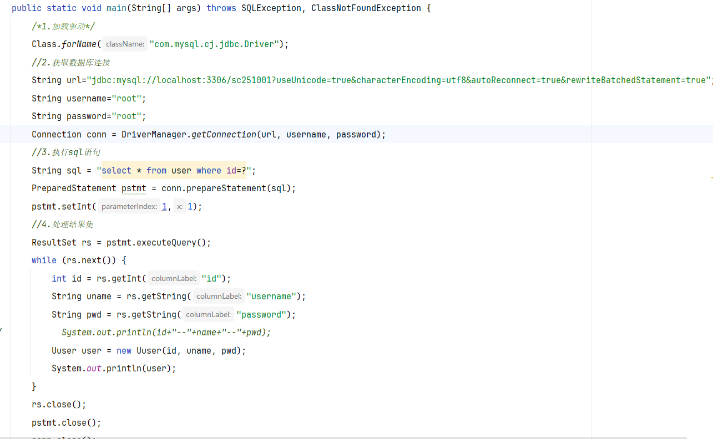
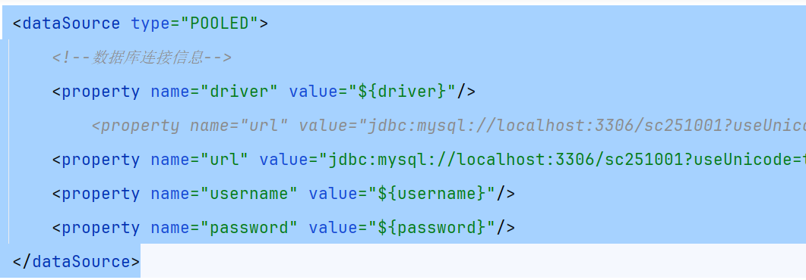
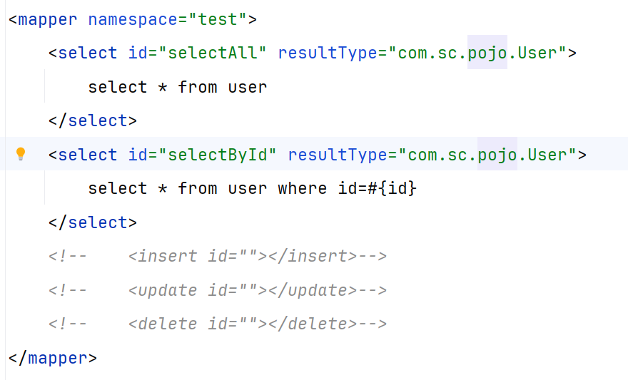

## Mybatis

### 1.什么是Mybatis?

mybatis是一款优秀的持久层框架，是用来简化JDBC开发的

前身是apache的开源项目ibatis，2010年这个项目由apache迁移到了（叛变）google，改名mybatis，2013年11月迁移到了github

> 官网：https://mybatis.org/mybatis-3/zh_CN/index.html


#### 1.1 ORM

ORM（Object Relation Mapper）：对象关系映射，实现java对象和数据库中数据进行一一对应的，从而实现新增一条数据库数据，就相当于新增一个java对象，就是把对数据库数据的操作转换成针对于java对象的操作


#### 1.2 持久层

- 负责将数据保存到数据库中的那层代码

核心在于将数据保存到数据库，将来我们可能有很多代码，我们为了保证代码职责单一，我们将同数据库的那一些代码称为持久层

- javaEE三层架构：表现层（页面展示的），业务层（逻辑处理），持久层（对数据做持久化的，也就是对数据库的增删改查操作，所以持久化操作也就是增删改查操作）


> 持久状态的数据；存放在本地文件（序列化）或者存储在数据库中的数据
>
> 临时状态的数据，就是在内存中定义的对象，时间超时，系统gc，服务器关闭而销毁，不会超时间保留
>


#### 1.3 框架

框架是一个很重要的概念，就是一个半成品软件，是一套可重用的，通用的软件基础代码模型

> 别人写好了一半，你在接着写，合起来就是一个完整的软件产品

在框架的基础上编写就更加高效，规范，通用，可扩展

> 生活中例子：公园中的石膏上色，小朋友会涂鸦上色，上不同的颜色形成不同的产品，石膏的模板就相当于半成品，已经有一个大概的架子了，我们只需要给他涂点颜色就可以了，所以使用框架就只需要做少量的操作就可以做出来一个复杂的软件产品，并且通过同一个框架完成的工作都是同一项，所以我们使用mybatis只能完成持久层的开发，就像我们给一个小女孩石膏上色，不可能上色之后就变成小男生了，也就是说我们使用一个框架不管我们怎么改他怎么用它都是完成同一类的工作


mybatis就是我们第一个学习的大型框架


### 2.JDBC的工作流程和缺点



缺点：

- 硬编码：

  加载驱动和获取连接的地方，很多字符串，我们称为硬编码，可能会变动，改动代码意味着工作量，重新编译，重新打包，重新运行，代码维护性就差

- sql语句，也是硬编码，也可能改动

> 解决方法就是字符串写到一个配置文件中

- 操作繁琐：

  - 手动封装参数：还有下面给？设置参数，只有一个还好，如果以后好几个参数，就要写好几个？，还要设置好几个参数

  - 手动封装结果集

解决方案：自动完成


#### mybatis如何简化JDBC






### 3.Mybatis快速入门

需求：查询user表中所有的数据

创建一个maven项目，导入依赖

```xml
<dependency>
          <groupId>org.mybatis</groupId>
          <artifactId>mybatis</artifactId>
          <version>3.4.5</version>
      </dependency>
      <dependency>
          <groupId>mysql</groupId>
          <artifactId>mysql-connector-java</artifactId>
          <version>8.0.28</version>
      </dependency>
```

创建user表

```sql
drop table user;
create table user(
    id int,
    username varchar(255),
    password varchar(255)
);
insert into user values(1,'admin','admin'),(2,'user','user'),(3,'张三','123');
```

创建user实体类

编写mybatis核心配置文件 ----替换数据库连接信息

编写映射文件 ---- 统一管理sql语句

使用mybatis

```
加载mybatis核心配置文件，获取SqlSessionFactory对象
获取SqlSession对象，执行sql语句
释放资源
```


### mybatis工作流程

```java
public static void main(String[] args) throws IOException {
        //1，加载mybatis配置文件，创建SqlSessionFactory
        String resource = "mybatis-config.xml";
        InputStream inputStream = Resources.getResourceAsStream(resource);
        SqlSessionFactory sqlSessionFactory = new SqlSessionFactoryBuilder().build(inputStream);
        //2.获取sqlsession对象，用来执行sql语句
        SqlSession session = sqlSessionFactory.openSession();
        //3.执行sql语句
        List<User> users = session.selectList("test.selectAll");
        System.out.println(users);
        User u = session.selectOne("test.selectById", 1);
        System.out.println(u);
        //4.关闭资源
        session.close();
    }
```


==报错：不支持发行版本5==

是因为 Maven 编译器的 Java 版本默认设置为 1.5，而你的代码可能使用了更高版本的 Java 特性。需要在 pom.xml 中明确指定 Java 版本

```xml
  <properties>
    <maven.compiler.source>1.8</maven.compiler.source>
    <maven.compiler.target>1.8</maven.compiler.target>
  </properties>
```


### 映射文件

> 面试题：
>
> 不同的映射文件中，标签id是否可以重复？
>
> resultType和resultMap的区别？
>
> #{}和${}的区别？
>
> 新增是获取自增主键？

### mapper接口传递参数

> 面试题：mapper接口如何传递多个参数

### 动态sql语句

### 缓存

### mapper接口工作原理

### 乐观锁和悲观锁
