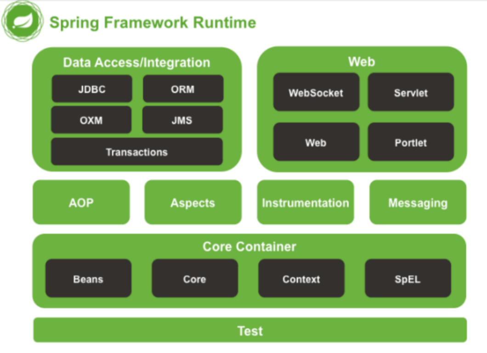

## spring

[TOC]

### 1. 什么是spring	

spring是一个轻量级的==控制反转（IOC）==和==面向切面编程（AOP）==的容器框架，主要用于管理对象的生命周期，这样就可以更加方便控制对象的资源消耗，其集合了JavaEE的全功能解决方案

+ spring架构体系



+ spring框架是一个分层架构，主要包含五大模块，是相互解耦的，但是必须有一个核心模块
  + Core Container：核心容器，主要用于通过BeanFactory管理对象生命周期，控制哪些对象是单例模式，哪些是多例模式
  + springAOP：面向切面编程，底层实现是jdk动态代理
  + Data Access：数据访问模块，spring支持持久层框架的整合（spring可以整合mybatis，hibernate，jdbc）
  + Web：web层模块（控制层）spring支持web层框架的整合（spring可以整合springmvc，struts2，servlet）
  + Test：测试模块，spring支持测试框架的整合（spring可以整合junit）


### 2. IOC ---重点，面试题

IOC就是控制反转，就是将创建对象的控制权，由原来的自己现在交给spring来管理，这样spring就可以集中管理对象，控制哪些对象只需要创建一个（单例模式）哪些对象需要创建多个，这样可以节省资源消耗，那么这种方式，对象的控制权由原来的自己，交给了spring容器，对象的控制权由主动变成了被动，叫做控制反转，IOC控制反转还需要通过DI依赖注入来实现

```java
User u=new User(); ---- 对象控制权是我自己
User u2= 让spring帮你创建： ---- 对象的控制权是spring
```


#### 2.1 DI ---重点，面试题

DI就是依赖注入，类和类依赖关系（依赖），不用自己赋值，交给spring容器它帮你自动赋值（注入），并且spring注入时推荐使用接口类型来做依赖属性，因为接口可以提供多种实现类，spring就可以灵活的切换实现类，因为他们的类型都是同一个接口类型，这样就降低了依赖关系，实现了解耦合......


#### 2.2 依赖注入方式 ---面试题

+ set注入：在类中给依赖属性添加==set方法==，并且在spring配置文件中，bean标签里添加==property标签==，给属性赋值，底层就是调用set()来完成属性的依赖关系的，是在对象创建好了之后再通过set()进行注入的，并且注入的参数顺序和个数是可选的，所以set注入更加适合做复杂依赖关系，因为更加灵活直观                                                                                                                                                                                                                                                                                                                                                                                                                     

+ 构造方法注入：在类中添加有参构造，并且在spring配置文件中，bean标签里添加construtor-arg标签，配置有参构造的参数，底层就是调用有参构造，是在对象创建时，完成属性的注入，并且注入属性个数必须是固定的，不太适合做复杂依赖关系的建立

  ```xml
  <!--每一个bean就是spring需要管理的对象:默认都是单例模式
          默认走的是无参构造方法-->
      <!--set注入
          SimpleDateFormat sdf=new SimpleDateFormat("YYYY-MM-dd")
          Date time=sdf.parse(String)
      -->
      <bean id="u" class="com.sc.pojo.User"><!--bean默认走无参构造-->
          <property name="id" value="10"/>
          <property name="name" value="张三"/>
          <property name="money" value="9000"/>
          <property name="time">
              <bean factory-bean="sdf" factory-method="parse">
                  <constructor-arg value="2020-10-20"/>
              </bean>
          </property>
          <property name="info" ref="info"/>
      </bean>
      <bean id="u2" class="com.sc.pojo.User">
          <constructor-arg name="id" value="1"/>
          <constructor-arg name="name" value="李四"/>
          <constructor-arg name="money" value="10000"/>
          <constructor-arg name="time">
              <bean factory-bean="sdf" factory-method="parse">
                  <constructor-arg value="2012-09-12"/>
              </bean>
          </constructor-arg>
          <constructor-arg name="info" ref="info">
          </constructor-arg>
      </bean>
      <bean id="sdf" class="java.text.SimpleDateFormat">
          <constructor-arg value="yyyy-MM-dd"/>
      </bean>
      <bean id="info" class="com.sc.pojo.Info">
      </bean>
  ```

  

+ 注解注入：借助于IOC注解和DI依赖注入注解来完成依赖关系的建立 ---推荐方式
  + IOC注解：@Controller，@Service，@Repository，@Component
  + DI注解：@Autowired，@Resource


#### 2.3 IOC的优点

+ 减少资源消耗：不需要自己创建对象，由spring集中管理对象生命周期，控制哪些需要创建一个，哪些需要创建多个
+ 解耦合：对象之间不再通过 `new` 关键字硬链接，而是通过接口和容器注入。


### 3. spring常用注解  ---高频面试题

+ IOC扫描注解：一般是写在类上面编写的，并且spring配置文件必须配置扫描包，spring只要扫描到类中具有这类的注解，它会自动创建该类的对象，类似于底层，帮你编写好了bean标签，下面四种注解底层实现一模一样，只是标注的身份不同，默认id：类名首字母小写，如果想自定义id@IOC注解（"id"）

  + @Controller：标注控制层的注解，只有控制层可以接受请求
  + @Service：标注业务层的注解，只有业务层可以正常完成事务
  + @Repository：标注dao层的注解，后期可以不写的，通过spring动态创建Mapper接口实现类，不是靠扫描的
  + @Component：标注其他层的注解，比如：拦截器，监听器，过滤器.....

+ DI依赖注入注解：一般写在类中成员变量上，前提是springIOC容器必须存在对应的bean对象，才可以自动注入

  + @Autowired

    > 自己的理解：在类成员变量上添加之后，就会根据成员变量的类型去spring容器中匹配对应的bean对象，如果存在多个同一类型的bean对象，就会报错，那么就要添加根据id匹配，可以把属性名改成bean对象的id（默认是类名，首字母小写），还可以添加@Qualifier（"bean对象的id"）来解决

  + Resource：

+ AOP注解：

  + @Aspect：标注切面
  + @PointCut：配置切入点
  + @Before：配置前置通知
  + @AfterReturning：配置后置通知
  + @After：配置最后通知
  + @AfterThrowing：配置异常通知
  + @Around：配置环绕通知

+ MVC注解：就是springmvc使用的注解

  + @RequestMapping，@GetMapping，@PostMapping，@PutMapping，@DeleteMapping
  + @RequestBody，@ResponseBody
  + @RequestParam
  + @DatetimeFormat，@JsonFormat
  + @ControllerAdvice：全局异常处理
  + @CrossOrigin跨域注解

+ 其他注解：


#### 3.1 @Autowired和@Resource区别 ---面试题

+ @Autowired：

  + 是spring提供的注解

  + 自动先根据spring容器中bean的==类型==去匹配如果只有一个实例的话，直接返回注入，如果有多个相同类型的实例，再根据==依赖属性名==和容器中的bean的id来匹配（需要结合==@Qualifier注解==指定名称），如果匹配上了，则自动注入

    + 如果匹配不上，会出现异常（bean不存在）

    + 如果根据依赖属性名匹配时，容器中有多个相同类型的值，也会出现异常（不是唯一的bean，有多个存在）
  
    + 解决方式：
  
      + 可以把依赖属性名修改成bean的id，bean的id默认是类名，并且首字母要小写
  
      + 添加一个注解
  
        ```java
        @Qualifier("bean的id")
        ```
  


  > 自己的理解：@Autowired注解的作用是，在依赖属性上添加的话，就会先根据依赖属性的类型去spring容器中匹配相同类型的bean，再通过依赖属性名去匹配对应类型的bean的id，如果找到了唯一的bean就会自动注入，如果找不到就会报错（bean不存在），如果有多个相同类型的bean并且还没有设置id的话，那么就会报错（bean不唯一）
  >
  > 解决方案：
  >
  > + 1.将依赖属性名改成和bean的id一样，bean的id默认是类名，并且首字母小写
  >
  > + 2.添加@Qualifier("bean的id"）

+ @Resource：

  + 是java自带的

  + 先根据依赖属性名和bean的id进行匹配，如果找到了就直接返回注入，如果没找到的话，再根据类型进行匹配，如果出现多个类型一样的bean也会报错

    + 解决方案：
  
      + 可以把依赖属性名修改成bean的id

      + ```java
        @Resource（name="bean的id"）
        ```
  
  
  ​    
  

### 4. spring管理bean生命周期 ---面试题

spring默认管理的bean对象是单例模式，但是除了默认的还提供了很多生命周期

+ 单例：默认值，读取spring配置文件后，就会加载所有的bean来创建对象，服务器关闭的时候销毁
+ 多例：一个类spring使用一次创建一个新的，所以每次使用时创建对象，使用完自动回收
+ 请求Request：一个spring每次请求，创建一个新的对象，请求响应结束了，就会销毁对象
+ 会话HttpSession：一个类spring每次会话开始创建一个对象，会话超时的时候或者强制销毁，对象才会销毁
+ 全局Session：类似于application，属于应用级别的，启动服务器会创建，关闭服务器会销毁


### 5. spring加载配置文件步骤

+ 添加依赖mvc依赖

  ==bug==：spring依赖版本必须和springmvc依赖版本一致，不一致就会出现error

  ```xml
  <!--springmvc核心依赖 -->
  <dependency>
  <groupId>org.springframework</groupId>
  <artifactId>spring-webmvc</artifactId>
  <version>5.0.3.RELEASE</version>
  </dependency>
  ```

+ 添加全局配置：配置spring配置文件的地址

+ 配置spring提供的监听器：负责加载spring配置文件

  ```xml
  <!--web.xml文件中-->   
  <!--全局配置-->
      <context-param>
          <param-name>contextConfigLocation</param-name>
          <param-value>classpath*:spring2.xml</param-value>
      </context-param>
  <!--spring监听器-->
  <listener>
      <listener-class>org.springframework.web.context.ContextLoaderListener</listener-class>
  </listener>
  ```


### 6. 循环依赖 ---面试题

循环依赖就是两个类比如A类依赖于B类，同时B类也依赖于A类，这样如果采用了构造注入，会在实例化的时候，完成对象之间的依赖关系，但是A需要B先创建，B需要A先创建，就会形成循环依赖的问题

+ 解决方案：
  + 可以重新设计，不设计成循环依赖的情况
  + 如果不能重新设计，我们可以采用set注入，或者注解注入的方式，因为他们不会在创建bean时候，注入依赖
  + 也可以添加@Lazy延迟加载注解，这样添加之后，他的依赖属性不会立马注入，只会注入一个代理对象，只有当首次使用时，才会完成对象实例化过程，进行真正注入


### 7. 代理模式 ---重点模式，面试题

代理模式属于java23种设计模式之一，是用于给对象提供一个代理对象，由代理对象完成，原对象的创建和使用，这样代理对象就可以在对象调用之前，或者调用之后，增加一些额外的功能，这样既保留了原有的功能，也同时提供了新功能，最终目的：在不改变源代码的基础上做增强处理（AOP的好处）


#### 7.1 代理模式的分类

+ 静态代理：通过一个代理类创建原对象，这个类在编译期间是固定的，如果换成其他类，需要重新提供一个新的代理类来完成新对象和使用，主要包含：抽象接口，原对象，代理对象。代理对象负责实现这个抽象接口，来完成原对象的创建和使用

  ```java
  package day2;
  
  //实现静态代理
  public class StaticProxy {
      public static void main(String[] args) {
          //如果不走代理
          People p = new Person();
          p.buy();
          //如果走代理
          People p2 = new Proxy((Person)p);
          p2.buy();
      }
  }
  
  //抽象接口
  interface People {
      void buy();
  }
  
  //具体实现(原对象)
  class Person implements People {
  
      @Override
      public void buy() {
          System.out.println("普通对象去购买房源");
      }
  }
  
  //代理类
  class Proxy implements People {
      private Person p;//固定的
  
     /* public Proxy() {
      }*/
  
      public Proxy(Person p) {
          this.p = p;
      }
  
      @Override
      public void buy() {
          System.out.println("买房之前:代理可以帮你查询一些优质房源");
          p.buy();//原对象使用
          System.out.println("买房之后:代理可以帮你办理一些后续手续");
      }
  }
  ```

  

+ 动态代理：类似于上面的静态代理，只不过负责代理原对象可以任意修改的

  + jdk动态代理：本身jdk自带的，会在运行期间通过jvm生成对应的代理对象，同时会生成他的字节码文件，类加载器载入到jvm，通过字节码文件生成新的原对象，同时它也可以称之为接口代理，参数的对象必须是接口类型
  + cglib动态代理：是一个cglib开源项目提供的，需要导入cglib依赖，也就子类代理，在内存中自动构建一个子类对象，由它完成原对象的创建和方法的调用，底层实现是小型的字节码框架(ASM)用于将字节码生成新的原对象 


#### 7.2 jdk动态代理实现 ---可选的

+ 创建代理类，实现InvocationHandler接口

+ 提供有参构造，可以传入原对象（可以任意修改的）

+ 通过代理类的方法invoke对象原来做增强处理（基于反射）

+ 通过代理类方法newProxyInstance()创建新的原对象

  ```java
  package day2;
  
  import com.sc.dao.UserDao;
  import com.sc.dao.impl.UserDaoImpl;
  import com.sc.pojo.User;
  import com.sc.service.UserService;
  import com.sc.service.impl.UserServiceImpl;
  
  import java.lang.reflect.InvocationHandler;
  import java.lang.reflect.InvocationTargetException;
  import java.lang.reflect.Method;
  import java.lang.reflect.Proxy;
  
  //jdk动态代理
  public class JdkProxy implements InvocationHandler {
      private Object obj;//表示原对象
  
      public JdkProxy(Object obj) {
          this.obj = obj;
      }
  
      @Override
      public Object invoke(Object proxy, Method method, Object[] args) throws Throwable {
          System.out.println("调用方法之前，做处理");
          //开启事务
          Object result = method.invoke(obj, args);//原对象调用方法的过程
          //捕获异常 如果没有异常，提交事务，有异常回滚事务
          System.out.println("调用方法之后做处理");
          return result;
      }
  
      //通过newProxyInstance()创建代理后的对象
      public Object getProxy() {
          //参数1:原对象的类加载器(基于jvm)
          ClassLoader loader = obj.getClass().getClassLoader();
          //参数2:原对象实现的接口(jdk代理也叫接口代理,传递参数必须传递接口类型，否者不支持)
          Class[] interfaces = obj.getClass().getInterfaces();
          //参数3：代理的实现类，就是this
          Object o = Proxy.newProxyInstance(loader, interfaces, this);
          return o;
      }
  }
  
  class TestJdkProxy {
      public static void main(String[] args) {
          //不走代理
          UserDao ud = new UserDaoImpl();
          UserService us = new UserServiceImpl();
          ud.show();
  //        us.show();
          
          //如果走代理
          JdkProxy jdk = new JdkProxy(ud);//参数只能传递接口类型
          UserDao newUd = (UserDao) jdk.getProxy();
          newUd.show();
  
          JdkProxy jdk2 = new JdkProxy(new UserDaoImpl());//会报错因为不是接口类型
          UserDaoImpl newUser = (UserDaoImpl) jdk2.getProxy();
          newUser.show();
      }
  }
  
  //反射
  class test {
      public static void main(String[] args) throws NoSuchMethodException, InvocationTargetException, IllegalAccessException {
          Class<User> c = User.class;
          Method m = c.getDeclaredMethod("setId", Integer.class);
          User user = new User();
          m.invoke(user, 100);
          System.out.println(user.getId());
      }
  }
  ```

  

#### 7.3 cglib动态代理实现 ---可选的

```java
//cglib动态代理
public class CglibProxy implements MethodInterceptor {
    private Object obj;

    public CglibProxy(Object obj) {
        this.obj = obj;
    }

    @Override
    //类似于jdk动态代理invoke
    public Object intercept(Object o, Method method, Object[] objects, MethodProxy methodProxy) throws Throwable {
        System.out.println("调用之前做处理");
        //cglib也叫子类代理
        Object result = methodProxy.invokeSuper(obj, objects);
        System.out.println("调用之后做处理");
        return result;
    }

    //创建新的原对象
    public Object getProxy() {
        //创建cglib动态代理对象
        Enhancer en = new Enhancer();
        //设置需要创建的子类的对象
        en.setSuperclass(obj.getClass());
        //设置代理的实现类 MethodInterceptor类型
        en.setCallback(this);
        //通过字节码动态的创建子类实例
        return en.create();
    }
}

class testCglibProxy {
    public static void main(String[] args) {
        //走代理
        User u = new User();
        UserDao ud = new UserDaoImpl();
        CglibProxy p1 = new CglibProxy(u);
        CglibProxy p2 = new CglibProxy(ud);
        User newUser = (User) p1.getProxy();
        UserDao newUd = (UserDao) p2.getProxy();
        newUser.setId(1000);
        System.out.println(newUser.getId());
        newUd.show();
    }
}
```


#### 7.4 jdk动态代理和cglib动态代理的区别  ---面试题

+ jdk动态代理：本身jdk自带的，底层会在运行期间通过jvm生成对应的代理对象，同时会生成他的字节码文件，再通过类加载器载入到jvm，通过字节码文件生成新的原对象，同时它也可以称之为接口代理，参数的对象必须是接口类型
+ cglib动态代理：是一个cglib开源项目提供的，需要导入cglib依赖，也就子类代理，在内存中自动构建一个子类对象，由它完成原对象的创建和方法的调用，底层实现是小型的字节码框架(ASM)用于将字节码生成新的原对象 


### 8. AOP ---重点，难点，面试题

AOP是面向切面编程，主要用于将项目中的通用功能（比如：日志，事务，资源回收，异常处理，权限控制......）和主要的业务功能进行分离，spring就可以将这些通用功能统一处理，形成一些切面，业务功能只要经过这些切面，就会自动完成这些功能，对于开发者，只需要关注业务功能即可，可以在不改变源程序的基础上，做增强处理

底层实现是动态代理：

优点：

- 解耦合：通用功能和业务功能分离
- 拓展性好：在不改变源程序的基础上，做增强处理


#### 8.1 AOP中几个重要的概念

+ Aspect：切面，表示AOP实现通用功能的类

+ JointPoint：连接点，表示业务功能作用在业务切面的位置

+ PointCut：切入点，就是连接点的集合，目的是为了表示哪些方法需要被切入，spring一般是通过表达式和通配符方法来描述多种方法的，比如：想表示service方式，都需要经过切面

  ```java
  execution(* com.sc.service.impl.*.*(..) )
  *:任意返回值 
  com.sc.service.impl.*.*(..) :表示包.所有类.所有方法(任意参数)
  ```

+ advice：通知，表示切面作用在业务功能中的时机和位置，比如：想在service方法执行之前做增强功能，称之为前置通知


#### 8.2 AOP通知类型 ---面试题

+ 前置通知：是在目标方法执行之前调用，标签（aop:before），注解@Before

+ 后置通知：是在目标方法执行之后并且正常返回才调用，标签（aop:after-returning），注解@AfterReturning

+ 最后通知：是在目标方法执行之后调用，标签（aop:after），注解@After

+ 异常通知：是在目标方法执行之后，出现了异常才调用，标签（aop:after-throwing），注解@AfterThrowing

+ 环绕通知：是在目标方法执行前后都会执行，包含了四种通知的集合，标签（aop:around），注解@Around

  ```java
  try{
  	//前置
  	//业务层方法的执行
  	//后置
  }catch(){
  	//异常
  }finally{
  	//最后
  }
  ```

  

#### 8.3 通过配置文件实现AOP日志功能

AOP实现日志功能

```java
package com.sc.aop;

import org.aspectj.lang.ProceedingJoinPoint;

//通过AOP实现日志功能:通过配置文件实现
//日志切面
public class MyLog {
    //前置通知
    public void before() {
        System.out.println("前置通知，方法执行之前调用");
    }

    //后置通知(参数表示方法的返回值)
    public void afterReturn(Object result) {
        System.out.println("后置通知:" + result);
    }

    //最后通知
    public void after() {
        System.out.println("最后通知");
    }

    //异常通知(参数表示方法出现的异常)
    public void afterThrow(Exception e) {
        System.out.println("异常通知:" + e.getMessage());
    }

    //环绕通知
    public Object around(ProceedingJoinPoint pjp) {
        Object result = null;
        try {
            System.out.println("前置");
            //表示目标方法的执行，返回值就是目标方法的结果
            result = pjp.proceed();
            System.out.println("后置");
        } catch (Throwable e) {
            e.printStackTrace();
            System.out.println("异常");
        } finally {
            System.out.println("最后");
        }
        return result;
    }
}
```

配置文件：

```xml
<?xml version="1.0" encoding="UTF-8"?>
<beans xmlns="http://www.springframework.org/schema/beans"
       xmlns:xsi="http://www.w3.org/2001/XMLSchema-instance"
       xmlns:content="http://www.springframework.org/schema/context"
       xmlns:aop="http://www.springframework.org/schema/aop"
       xsi:schemaLocation="http://www.springframework.org/schema/beans http://www.springframework.org/schema/beans/spring-beans.xsd http://www.springframework.org/schema/context https://www.springframework.org/schema/context/spring-context.xsd http://www.springframework.org/schema/aop https://www.springframework.org/schema/aop/spring-aop.xsd">
    <content:component-scan base-package="com.sc"/>
    <!--AOP配置-->
    <aop:config>
        <!--配置切入点:告诉spring哪些方法需要经过切面；比如service-->
        <aop:pointcut id="pc" expression="execution(* com.sc.service.impl.*.*(..))"/>
        <!--配置切面:告诉spring哪个bean对象是切面-->
        <aop:aspect id="as" ref="log">
            <!--配置通知类型：前置，后置,最后，异常-->
           <!-- <aop:before method="before" pointcut-ref="pc"/>
            <aop:after-returning method="afterReturn" returning="result" pointcut-ref="pc"/>
            <aop:after method="after" pointcut-ref="pc"/>
            <aop:after-throwing method="afterThrow" throwing="e" pointcut-ref="pc"/>-->
            <aop:around method="around" pointcut-ref="pc"/>
        </aop:aspect>
    </aop:config>
    <bean id="log" class="com.sc.aop.MyLog"></bean>
</beans>
```


#### 8.4 通过AOP注解完成

```java
package com.sc.aop;

import org.aspectj.lang.ProceedingJoinPoint;
import org.aspectj.lang.annotation.*;
import org.springframework.stereotype.Component;

import java.text.SimpleDateFormat;
import java.util.Arrays;
import java.util.Date;

//通过注解实现AOP
@Component //通过IOC扫描，等价于编写了bean标签
@Aspect//标注我是切面
public class MyLog2 {
    //配置切入点：等价于之前的aop:pointcut标签
    @Pointcut("execution(* com.sc.service.impl.*.*(..))")
    public void pc() {
    }

    /*@Before("pc()")
    public void before() {
        System.out.println("前置");
    }

    //后置通知(参数表示方法的返回值)
    @AfterReturning(value = "pc()", returning = "result")
    public void afterReturn(Object result) {
        System.out.println("后置通知:" + result);
    }

    //最后通知
    @After("pc()")
    public void after() {
        System.out.println("最后通知");
    }

    //异常通知(参数表示方法出现的异常)
    @AfterThrowing(value = "pc()", throwing = "e")
    public void afterThrow(Exception e) {
        System.out.println("异常通知:" + e.getMessage());
    }*/

    //环绕通知
    @Around("pc()")
    public Object around(ProceedingJoinPoint pjp) {
        SimpleDateFormat sdf = new SimpleDateFormat("yyyy-MM-dd HH:mm:ss");
        Object result = null;
        //获取目标方法的名称
        String methodName = pjp.getSignature().getName();
        try {
            Object[] args = pjp.getArgs();
            System.out.println("\033[33m" + sdf.format(new Date()) +
                    "【前置】:" + methodName + "方法开始调用，传递了" +
                    Arrays.toString(args) + "参数\033[0m");
            //表示目标方法的执行，返回值就是目标方法的结果
            result = pjp.proceed();
            System.out.println("\033[32m" + sdf.format(new Date()) +
                    "【后置】:" + methodName + "方法运行结束了，返回值" +
                    result + "\033[0m");
        } catch (Throwable e) {
            System.out.println("\033[31m" + sdf.format(new Date()) +
                    "【异常】:" + methodName + "方法运行时发生异常，异常信息:" +
                    e.getMessage() + "\033[0m");
        } finally {
            System.out.println("\033[34m" + sdf.format(new Date()) +
                    "【最后】:" + methodName + "方法运行结束\033[0m");
        }
        return result;
    }
}
```

配置文件：

```xml
 <content:component-scan base-package="com.sc"/>
    <!--开启aop注解:让@Aspect @Before ..生效的 -->
    <aop:aspectj-autoproxy/>
```


红色：\033[31m
绿色：\033[32m
黄色：\033[33m
蓝色：\033[34m
紫色：\033[35m
青色：\033[36m
白色：\033[37m
需要恢复默认颜色可以使用：\033[0m 黑色


### 9. spring管理事务 ---高频面试题


#### 9.1 spring有哪些方式可以做事务 ---面试题

+ 声明式事务：通过配置文件，编写事务策略和事务传播特性，来统一控制哪些方法需要做什么事务......
+ 注解式事务：通过事务注解@Transactional，可以在方法上添加表示该方法要做事务，也可以在类上添加，表示该类下面的所有方法都会做事务......


##### 9.1.1 spring实现事务的步骤   ---了解（整合SSM需要）

+ 声明式事务：
  + 加载jdbc配置文件
  + 创建数据源连接池
  + 创建事务管理类（类似于spirng帮你写好了环绕通知）
  + 配置事务管理策略（根据事务的传播特性，控制哪些方法需要做事务或者只读事务......）
  + 配置aop===>切入点，关联前面事务策略
+ 注解式事务
  + 加载jdbc配置文件
  + 创建数据源连接池
  + 创建事务管理类（类似于spirng帮你写好了环绕通知）
  + 开启事务注解

```xml
<?xml version="1.0" encoding="UTF-8"?>
<beans xmlns="http://www.springframework.org/schema/beans"
       xmlns:xsi="http://www.w3.org/2001/XMLSchema-instance"
       xmlns:content="http://www.springframework.org/schema/context"
       xmlns:aop="http://www.springframework.org/schema/aop" xmlns:tx="http://www.springframework.org/schema/tx"
       xsi:schemaLocation="http://www.springframework.org/schema/beans http://www.springframework.org/schema/beans/spring-beans.xsd http://www.springframework.org/schema/context https://www.springframework.org/schema/context/spring-context.xsd http://www.springframework.org/schema/aop https://www.springframework.org/schema/aop/spring-aop.xsd http://www.springframework.org/schema/tx http://www.springframework.org/schema/tx/spring-tx.xsd">
    <content:component-scan base-package="com.sc"/>
    <!--开启aop注解:让@Aspect @Before ..生效的 -->
    <aop:aspectj-autoproxy/>

    <!--spring完成事务:-->
    <!--1.加载jdbc配置文件-->
    <content:property-placeholder location="classpath*:jdbc.properties"/>
    <!--2.创建数据源连接池===>SSM推荐使用德鲁伊连接池-->
    <bean id="ds" class="com.alibaba.druid.pool.DruidDataSource"
          init-method="init" destroy-method="close">
        <!--必选配置-->
        <property name="url" value="${jdbc.url}"/>
        <property name="driverClassName" value="${jdbc.driver}"/>
        <property name="username" value="${jdbc.username}"/>
        <property name="password" value="${jdbc.password}"/>
        <!--可选配置-->
        <!--初始连接大小-->
        <property name="initialSize" value="5"/>
        <!--最小连接池-->
        <property name="minIdle" value="5"/>
        <!--最大连接数-->
        <property name="maxActive" value="20"/>
        <!--最大等待时间：单位是毫秒-->
        <property name="maxWait" value="60000"/>
    </bean>
    <!--3.配置事务管理类:专门负责实现事务的类（类似于环绕通知）-->
    <bean id="tm" class="org.springframework.jdbc.datasource.DataSourceTransactionManager">
        <property name="dataSource" ref="ds"/>
    </bean>

    <!--&lt;!&ndash;第一种方式：声明式事务(编写事务策略和配置AOP)&ndash;&gt;
    <tx:advice id="ad" transaction-manager="tm">
        <tx:attributes>
            &lt;!&ndash;配置事务策略：配置不同方法，配置哪种事务
                name:表示哪个种类的方法,可以写通配符
                read-only:是否为只读事务
                propagetion:表示事务的传播特性（默认Required）
            &ndash;&gt;
            <tx:method name="add*" read-only="false" propagation="REQUIRED"/>
            <tx:method name="insert*" read-only="false" propagation="REQUIRED"/>
            <tx:method name="save*" read-only="false" propagation="REQUIRED"/>
            <tx:method name="del*" read-only="false" propagation="REQUIRED"/>
            <tx:method name="delete*" read-only="false" propagation="REQUIRED"/>
            <tx:method name="update*" read-only="false" propagation="REQUIRED"/>
            <tx:method name="edit*" read-only="false" propagation="REQUIRED"/>
            &lt;!&ndash;如果是查询操作，一般是只读事务&ndash;&gt;
            <tx:method name="select*" read-only="true" propagation="REQUIRED"/>
            <tx:method name="show*" read-only="true" propagation="REQUIRED"/>
            <tx:method name="query*" read-only="true" propagation="REQUIRED"/>
        </tx:attributes>
    </tx:advice>
    <aop:config>
        <aop:pointcut id="pc" expression="execution(* com.sc.service.impl.*.*(..))"/>
        <aop:advisor advice-ref="ad" pointcut-ref="pc"/>
    </aop:config>-->

    <!--第二种：注解式事务-->
    <tx:annotation-driven transaction-manager="tm"/>

</beans>
```


#### 9.2 spring事务传播特性有哪些 ---面试题，笔试题

spring一共提供了七种传播特性，通过他们来控制哪些方法支持事务，哪些不支持事务，哪些支持嵌套事务

+ Required：默认值，必须有一个事务，如果不存在事务，则会开启一个新事务
+ Required_new：新的事务，必须运行在自己创建的新事务中
+ supports：支持事务，不要求有事务，但是有事务也支持
+ not_supports：不支持事务，有事务也不会运行
+ mandatory：必须要有事务，没有事务抛出异常
+ never：永不支持事务，有事务抛出异常
+ nested：嵌套事务，可以支持多个事务之间嵌套在一起，里层事务不会影响外层事务


#### 9.3 spring事务注解什么时候会失效 ---高频面试题

- 业务层可能没有被spring管理，比如：忘了写@Service
- 业务层方法使用了fanal或者static修饰了，无法被重写或者被继承，会导致动态代理无法正常生成代理类，导致事务失效
- spring AOP只会对public方法生成代理，所以如果使用了其他访问修饰符，事务不会生效
- 比如：mysql如果设置了MyISAM引擎，由于它不支持事务，也会导致事务失效
- spring事务传播特性设置不当，比如：设置了不支持事务not_supports或者never...也会导致事务失效......

> 面试题2问：两个业务层方法a和方法b，a方法添加了事务注解，b方法没有添加，如果a调用了b方法，问：会不会有事务
>
> 答案：
>
> + A方法和B方法在同一个类中：spring事务管理，是通过代理模式实现的，如果A调用了B在本类中，底层是通过this.B()，不会走代理，导致B方法没有被事务拦截，所以没有产生新的事物，那么B方法使用的是A的事务
>
> + A方法和B方法不在同一个类中：那么A方法调用B方法，spring就会通过代理对象去调用B方法，虽然B方法没有添加事务注解，但是A调用了B方法，那么A的事务就会传播给B方法，所以B方法使用的还是A的事务
>
>   


### 10. 整合SSM(spring+springmvc+mybatis)

+ 创建maven项目

+ 导入ssm相关的依赖

+ 创建对应配置文件spring，springmvc，mybatis，jdbc，映射文件，反向生成工具......

+ 开始配置web.xml

  + 全局配置：配置spring配置文件地址

  + 编码过滤器：前端提交后端识别中文

  + 监听器：负责读取spring文件

  + 核心控制器：springmvc入口，负责读取springmvc配置文件

    ```xml
    <web-app>
        <display-name>Archetype Created Web Application</display-name>
        
        <!--1.全局配置:配置spring配置文件地址-->
        <context-param>
            <param-name>contextConfigLocation</param-name>
            <param-value>classpath*:spring.xml</param-value>
        </context-param>
        <!--2.编码过滤器-->
        <filter>
            <filter-name>characterEncodingFilter</filter-name>
            <filter-class>org.springframework.web.filter.CharacterEncodingFilter</filter-class>
            <init-param>
                <param-name>encoding</param-name>
                <param-value>utf-8</param-value>
            </init-param>
        </filter>
        <filter-mapping>
            <filter-name>characterEncodingFilter</filter-name>
            <url-pattern>/*</url-pattern>
        </filter-mapping>
        <!--3.配置spring监听器:负责读取spring配置文件-->
        <listener>
            <listener-class>org.springframework.web.context.ContextLoaderListener</listener-class>
        </listener>
        <!--4.核心控制器：springmvc入口，负责读取springmvc配置文件-->
        <servlet>
            <servlet-name>springmvc</servlet-name>
            <servlet-class>org.springframework.web.servlet.DispatcherServlet</servlet-class>
            <init-param>
                <param-name>contextConfigLocation</param-name>
                <param-value>classpath*:springmvc.xml</param-value>
            </init-param>
            <load-on-startup>1</load-on-startup>
        </servlet>
        <servlet-mapping>
            <servlet-name>springmvc</servlet-name>
            <url-pattern>/</url-pattern>
        </servlet-mapping>
    </web-app>
    ```

    

- 配置mybatis配置文件

  - 开启mybatis日志：查询sql语句执行过程

  ```XML
  <?xml version="1.0" encoding="UTF-8" ?>
  <!DOCTYPE configuration
          PUBLIC "-//mybatis.org//DTD Config 3.0//EN"
          "http://mybatis.org/dtd/mybatis-3-config.dtd">
  <!--根节点-->
  <configuration>
      <!--1.基础设置:可选的-->
      <settings>
          <!--开启mybatis日志:显示一个sql语句的执行过程（jdbc做事务，连接池的创建，执行sql，参数，查询结果...）
             但是开发过程中，是必加项-->
          <setting name="logImpl" value="STDOUT_LOGGING"/>
      </settings>
  </configuration>
  ```

- 配置springmvc配置文件

  + 因为它会和spring无缝衔接，配置文件不用做任何修改，之前怎么做，现在还是一样

    ```xml
    <?xml version="1.0" encoding="UTF-8"?>
    <beans xmlns="http://www.springframework.org/schema/beans"
           xmlns:xsi="http://www.w3.org/2001/XMLSchema-instance"
           xmlns:content="http://www.springframework.org/schema/context"
           xmlns:mvc="http://www.springframework.org/schema/mvc"
           xsi:schemaLocation="http://www.springframework.org/schema/beans http://www.springframework.org/schema/beans/spring-beans.xsd http://www.springframework.org/schema/context https://www.springframework.org/schema/context/spring-context.xsd http://www.springframework.org/schema/mvc https://www.springframework.org/schema/mvc/spring-mvc.xsd">
        <!--1.扫描ioc 控制层-->
        <content:component-scan base-package="com.sc.controller"/>
        <!--2.开启注解驱动-->
        <mvc:annotation-driven/>
        <!--3.放行静态资源-->
        <mvc:default-servlet-handler/>
        <!--4.上传组件-->
        <bean id="multipartResolver" class="org.springframework.web.multipart.commons.CommonsMultipartResolver">
            <property name="defaultEncoding" value="utf-8"/>
            <property name="maxUploadSize" value="20971520"/>
        </bean>
        <!--5.视图解析器-->
        <bean id="viewResolver" class="org.springframework.web.servlet.view.InternalResourceViewResolver">
            <property name="prefix" value="/WEB-INF/admin"/>
            <property name="suffix" value=".jsp"/>
        </bean>
        <!--6.拦截器-->
        
        <!--7.静态资源路径映射
            如果静态资源放入了WEB-INF，所有内容默认是访问不了的
            mapping:表示映射的地址
            location:静态资源的真实地址
            以后就可以通过mapping配置的地址访问真实地址的静态资源
            源地址：<link href="/WEB-INF/amdin/css/animate.css"/>
            映射地址：<link href="/css/animate.css"/>
        -->
        <mvc:resources mapping="/css/**" location="/WEB-INF/admin/css/"/>
        <mvc:resources mapping="/fonts/**" location="/WEB-INF/admin/fonts/"/>
        <mvc:resources mapping="/images/**" location="/WEB-INF/admin/images/"/>
        <mvc:resources mapping="/js/**" location="/WEB-INF/admin/js/"/>
    
    </beans>
    ```
    
    

- 配置spring配置文件

  1. ioc扫描，只负责扫描service

  2. 加载jdbc配置文件

  3. 创建数据源

  4. 创建事务管理类

  5. 开启事务注解

  6. 整合mybatis：关联数据源，关联核心配置文件，关联映射文件，配置分页插件

  7. 整合mybatis中的Mapper接口：会在容器中动态创建好Mapper接口实现类，以后使用可以直接通过@Autowired注入Mapper对象

     ```xml
     <!--1.扫描ioc，只负责扫描service-->
     <content:component-scan base-package="com.sc.service"/>
     <!--2.加载jdbc配置文件-->
     <content:property-placeholder location="classpath*:jdbc.properties"/>
     <!--3.创建数据源连接池===>SSM推荐使用德鲁伊连接池-->
     <bean id="ds" class="com.alibaba.druid.pool.DruidDataSource"
           init-method="init" destroy-method="close">
         <!--必选配置-->
         <property name="url" value="${jdbc.url}"/>
         <property name="driverClassName" value="${jdbc.driver}"/>
         <property name="username" value="${jdbc.username}"/>
         <property name="password" value="${jdbc.password}"/>
         <!--可选配置-->
         <!--初始连接大小-->
         <property name="initialSize" value="5"/>
         <!--最小连接池-->
         <property name="minIdle" value="5"/>
         <!--最大连接数-->
         <property name="maxActive" value="20"/>
         <!--最大等待时间：单位是毫秒-->
         <property name="maxWait" value="60000"/>
     </bean>
     <!--4.配置事务管理类:专门负责实现事务的类（类似于环绕通知）-->
     <bean id="tm" class="org.springframework.jdbc.datasource.DataSourceTransactionManager">
         <property name="dataSource" ref="ds"/>
     </bean>
     <!--5.开启事务注解-->
     <tx:annotation-driven transaction-manager="tm"/>
     <!--6.spring整合mybatis：数据源，关联核心配置文件，映射文件，插件-->
     <bean id="sf" class="org.mybatis.spring.SqlSessionFactoryBean">
         <property name="dataSource" ref="ds"/>
         <!--注意是classpath，不加*-->
         <property name="configLocation" value="classpath:mybatis.xml"/>
         <property name="mapperLocations" value="classpath:mapper/*.xml"/>
         <property name="plugins">
             <array>
                 <!--一个插件就是一个bean-->
                 <bean class="com.github.pagehelper.PageHelper">
                     <!--体现出数据库的差异：方言-->
                     <property name="properties">
                         <props>
                             <prop key="helperDialect">mysql</prop>
                             <!--                            <prop key="helperDialect">mysql</prop>-->
                             <!--                            <prop key="helperDialect">mysql</prop>-->
                         </props>
                     </property>
                 </bean>
             </array>
         </property>
     </bean>
     <!--7.spring整合Mybatis的Mapper接口：动态创建Mapper接口实现类，后期就能可以直接注入了-->
     <bean class="org.mybatis.spring.mapper.MapperScannerConfigurer">
         <property name="sqlSessionFactoryBeanName" value="sf"/>
         <property name="basePackage" value="com.sc.mapper"/>
     </bean>
     ```
