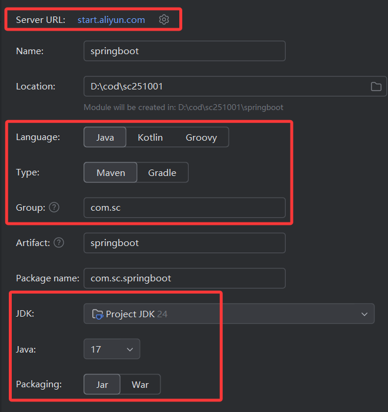
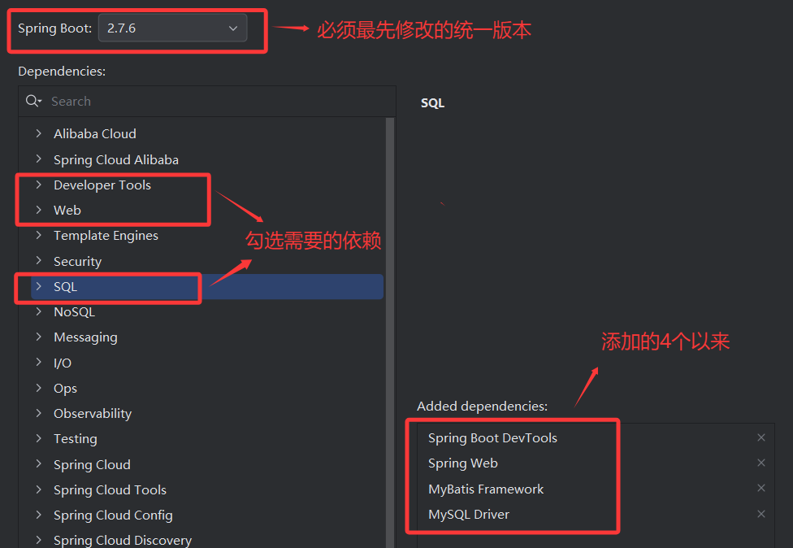
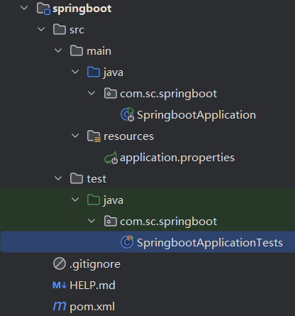

##                                                                                                                                                                                                                                                                                                                                                                                                                                                                                                                                                                                                                          springboot

### 1.什么是springboot

springboot是快速开发的框架，其采用了完全注解的方式，简化了xml配置（因为它只需要一个配置文件application.properties或者application.yml），并且内置了web服务器（tomcat），就可以快速整合其他框架，降低了框架整合的复杂度


#### 1.1 springboot优点 --- 面试题

+ 内置tomcat服务器，无需部署war包，生成的是jar包
+ 简化了xml配置，只需要一个配置文件即可
+ 简化了maven配置，内部封装了大部分主流依赖，根据需要自行勾选
+ 自动装配spring和springmvc
+ 快速整合其他框架：只需要通过一些简单的注解和简单配置
+ 天然集成spring cloud微服务框架


#### 1.2 springmvc和spring和springboot关系 --- 面试题

+ springmvc：用于实现web层框架，可以接受请求处理请求，替代之前的servlet
+ spring：核心是ioc和aop只用管理对象生命周期的，springmvc是属于spring的一个子项目
+ springboot：是一个快速开发的框架，自动装配了spring和springmvc

> springboot相当于包含了spring，而spring也包含了springmvc


### 2. 创建springboot项目

+ 先把项目网址修改成阿里云网址

  > 默认值：https://start.spring.io创建spring最新版项目
  >
  > 阿里云：https://start.aliyun.com，阿里云稳定版







+ springboot项目结构




- 项目Application：是springboot启动类，属于项目的入口，只要运行里面的main方法自动使用springboot内置的tomcat启动
- application.properties(yml)：springboot项目唯一配置文件，整合其他框架都在这里面编写，文件名不能随便改，否者内置tomcat就不会读取了
  - 项目ApplicationTest：springboot整合了junit的测试类，可以测试项目中的模块是否成立，也可以直接注入容器中的对象


#### 2.1 springboot整合mybatis（SM）

0. 前提是导入了mybatis依赖，看上面笔记

1. springboot基础设置（给项目添加项目前缀，端口号......）

2. 配置springboot数据源（使用德鲁伊连接池，需要导入依赖，如果不想导入依赖，可以使用springboot自带连接池）

3. 配置springboot关联mybatis映射文件

   + 可选：想要做分页，配置分页插件（导入PageHelper）

     ```xml
     <!-- 分页插件 -->
             <dependency>
                 <groupId>com.github.pagehelper</groupId>
                 <artifactId>pagehelper-spring-boot-starter</artifactId>
                 <version>1.2.12</version>
             </dependency>
     ```

   + 可选：如果使用的是springboot2.6以上，默认关闭循环引用，需要开启

4. 启动类，添加一个注解@MapperScan()，提供Mapper接口的包，他就会帮你创建Mapper接口实现类

   配置文件（application.properties）：

   ```properties
   #端口号，默认8080
   server.port=9999
   #配置项目前缀，默认/表示没有前缀
   server.servlet.context-path=/
   
   #整合mybatis
   #1.配置数据源（使用springboot自带连接池）
   spring.datasource.url=jdbc:mysql://localhost:3306/sc251001?useUnicode=true&characterEncoding=utf8&autoReconnect=true&rewriteBatchedStatement=true
   #mysql 5x: com.mysql.jdbc.Driver
   #mysql 8x: com.mysql.cj.jdbc.Driver 默认值，所以如果是muysql8+，可以省略
   spring.datasource.driver-class-name=com.mysql.cj.jdbc.Driver
   spring.datasource.username=root
   spring.datasource.password=root
   #2.关联映射文件
   mybatis.mapper-locations=classpath:mapper/*.xml
   #3.可选分页插件（导入依赖）
   ### 配置数据库方言: 用于区别不同数据库分页差异
   pagehelper.helper-dialect=mysql
   #### 默认是false 分页合理化参数
   #### 开启就会当pageNum<=0 查询第一页 pageNum>总页数 查询最后一页...
   #pagehelper.reasonable=true
   #### 默认是false 如果pageSize=0 是否查询全部数据
   #pagehelper.page-size-zero=true
   #### 默认是false表示是否支持通过Mapper接口参数传递 分页参数
   #### 设置true表示开启全局设置 会实现自动分页
   #pagehelper.support-methods-arguments=true
   #pagehelper.params=pageNum=pageHelperStart;pageSize=pageHelperRows
   #4.可选 如果是springboot2.6必须开启循环引用，默认是关闭的
   spring.main.allow-circular-references=true
   ```
   
   启动类（项目名application）：

   ```java
   //启动类的注解，非常重要
   @SpringBootApplication
   //整合mapper接口的（提供mapper接口的包）
   @MapperScan("com.sc.springboot.mapper")
   public class SpringbootApplication {
   
       public static void main(String[] args) {
           SpringApplication.run(SpringbootApplication.class, args);
       }
   }
   ```


#### 2.2 娱乐模式

springboot启动后，默认图标是可以自定义的，如果想去修改默认图标，在项目中resources目录下放入banner.txt，这样springboot项目启动后，就会自动读取这个文本文件，当成默认图标(如果失效，记得删除target再重启)

> https://www.bootschool.net/ascii


### 3. spring日志系统

springboot默认使用LogBack日志系统，无需多余配置，就可以使用，默认会把日志打印在控制台中，开发阶段需要配置本地保存，默认日志级别info，同时springboot也可以单独设置某个模块的日志级别


#### 3.1 日志级别 debug<info<warn<error

+ debug：用于记录程序在调试模式下的所有信息，比如：请求处理的事件，请求参数，这些主要用于辅助我们开发，但是正式环境下不适合开启，因为设置了debug级别，显示所有更高级的日志信息（debug，info，warn，error）
+ info：用于记录程序正常运行时一些状态信息，比如：系统启动完成，请求处理完成......设置了info级别日志，会显示更高级的日志（info，warn，error）
+ warn：用于记录程序中的警告和一些不重要异常，这些问题不会影响程序执行，用于引起开发者注意，比如：网络连接有波动（warn，error）
+ error：用于记录已经发生的错误情况，这些错误会导致项目无法运行，需要开发者及时处理（error）


#### 3.2 配置方式

```properties
#日志配置
#指定日志生成的本地地址，生成一个默认的文件名.log
#logging.file.path=D:\\log
#指定日志文件名，保存在当前项目工作空间的位置，
#并且file.path和file.name不能同时生效
logging.file.name=springboot.log

#配置全局日志级别 debug<info<warn<error
logging.level.root=info

#配置局部日志级别
logging.level.com.sc.springboot.mapper=debug
```


#### 3.3 手动编写日志

```java
//1.定义日志对象(提供当前类的类对象)
    private static final Logger LOG = LoggerFactory.getLogger(OAdminController.class);

    @GetMapping("/testLog")
    public Result testLog(Integer a, Integer b) {
        //2.什么地方要写日志，通过LOG.方法()，添加日志
        LOG.debug("开始记录testLog方法日志执行请求");
        LOG.info("开始请求处理");
        LOG.warn("接收到了前端提交的参数，可能会出现隐患：" + a + "," + b);
        try {
            int c = a / b;
            LOG.info("计算结果，结果是：" + a + "/" + b + "=" + c);
            return new Result(1, "成功", c);
        } catch (Exception e) {
            LOG.error("计算出错，因为分母不能为0");
            return new Result(0, "计算失败");
        }
    }
```


#### 3.4 springboot整合junit做单元测试

如果项目中想进行测试，同时还想用到spring容器中的对象，就必须通过springboot整合junit才可以实现

+ 测试类上添加@SpringBootTest，表示可以通过Spring容器中的对象进行测试
+ 测试方法上添加@Test表示可以运行
+ 需要什么对象，直接进行依赖注入（@Autowired）

```java
@SpringBootTest
public class MyTest {
    @Autowired
    OAdminMapper mapper;

    @Autowired
    OAdminService as;

    //先去测试mapper层
    @Test
    public void testMapper() {
        OAdmin a = mapper.selectByPrimaryKey(1);
        System.out.println(a);
    }

    //先去测试service层
    @Test
    public void testService() {
        PageInfo<OAdmin> p = as.show(2, 3);
        System.out.println(p);
    }

    //先去测试controller层
    //通过前端发送请求，直接进入控制层..,一般不用测试
    @Autowired
    OAdminController ac;
    @Test
    public void testController() {
        Result r = ac.show(1, 3);
        System.out.println(r);
    }
}
```


### 4. springboot跨域 ---面试题

跨域简称cors(Cross-Origin-Resource-Sharing)跨域资源共享，在项目过程中，会发生很多请求，如果请求地址中（协议，ip地址（域名），端口号）这三者只要有一个不同，就会产生跨域问题，这样项目之间就无法正常交互了，特别是前后端分离的项目，一定会产生跨域问题，必须要解决


#### 4.1 跨域主流解决方案 ---面试题

+ 后端解决方案：

  + 可以直接使用跨域注解@CrossOrigin，但是使用不是很灵活，只能控制所有请求，或者单一请求可以跨域，开发不推荐使用，测试无所谓

  + 通过springboot实现配置类的方式手动编写跨域规则，目前比较主流的方式，因为可以更加灵活的控制

  + 通过配置类实现跨域过滤器，目前比较主流的方案，也可以灵活控制跨域规则，
    ==注：具体使用哪种，看自己项目环境==

    > ==我比较推荐使用过滤器实现==
    >
    > 原因：如果项目中添加了拦截器，而且前端请求传递了很多头部信息，这个时候请求经过的先后顺序就会有问题，当请求发送过来时，会先进入拦截器，就不会进入mapping映射了，返回的头部信息并没有配置跨域信息，浏览器就会出现跨域失败
    >
    > 解决：所以使用跨域过滤器来实现，过滤器的执行顺序是先于拦截器执行的，所以无论传递什么数据，跨域都会生效

+ 前端解决方案：

  + 通过Vue在配置文件中编写一个proxy代理组件，让其转发给后端


#### 4.2 springboot配置类是什么

springboot把原来那些不经常修改的配置，通过一个类来编写，这个类就是配置类，把经常修改的配置才放到配置文件中

+ 实现配置类的步骤：
  + 类上添加一个注解@Configuration，用于标注我是配置类
  + 方法上添加@Bean注解，用于表示我要创建对象，而方法的返回值就是这个Bean对象，会保存在spring容器中，等价于之前spring框架编写的bean标签

```java
//配置类：就是用于编写不经常修改的配置
//经常修改的内容才会在application.properties去编写
//1.在类上添加注解，标注我是配置类
@Configuration
public class MyConfig {
    @Value("${student.id}")
    Integer id;

    @Value("${student.name}")
    String name;

    @Value("${student.money}")
    double money;

    @Value("${student.time}")
    String time;

    //2.在方法上添加@Bean注解 ，表示要创建bean对象，
    //而方法的返回值就是最终保存在容器中的对象
    @Bean
    Student getStudent() throws ParseException {//<bean>
        SimpleDateFormat sdf = new SimpleDateFormat("yyyy-MM-dd");
        Student s = new Student();
        s.setId(id);//<property/>
        s.setName(name);
        s.setMoney(money);
        s.setTime(sdf.parse(time));
        return s;
    }
}
```

```properties
#自定义key=value
student.id=10
student.name=天龙
student.money=10000
student.time=2019-10-20
```


#### 4.3 springboot中类如何获取配置文件中的信息

- 如果想获取单个属性时

  - 只需要在类中添加对应类型的成员变量

  - 在成员变量上添加一个注解@Value("${key}")

  - 那么配置文件的value就会给下面成员变量赋值

+ 如果想获取复杂多级属性

  + 在spring容器中的类中添加@Data和@ConfigurationProperties注解（可以配置一个统一的前缀）

  + 下面成员变量，就可以省略@Value注解

    但是有前提：成员变量的属性名和key后缀一致
  
  ```java
  package com.sc.springboot.config;
  
  import com.sc.springboot.pojo.Student;
  import com.sc.springboot.pojo.StudentInfo;
  import lombok.Data;
  import org.springframework.boot.context.properties.ConfigurationProperties;
  import org.springframework.context.annotation.Bean;
  import org.springframework.context.annotation.Configuration;
  
  import java.text.ParseException;
  import java.text.SimpleDateFormat;
  
  @Configuration
  @Data//否者需要手动编写get(),set()
  @ConfigurationProperties(prefix = "student")
  public class MyConfig2 {
      //保证属性名和key后缀一致
      //比如:student.id 前缀上面已经搞定，后缀是id
      Integer id;
  
      String name;
  
      double money;
  
      String time;
  
      //String sex;
  	//int age;
      //info是属于student里面的属性
      //自动注入student.info.后缀，来给info的属性赋值
      StudentInfo info;
  
      //2.在方法上添加@Bean注解 ，表示要创建bean对象，
      //而方法的返回值就是最终保存在容器中的对象
      @Bean
      Student getStudent() throws ParseException {//<bean>
          SimpleDateFormat sdf = new SimpleDateFormat("yyyy-MM-dd");
          Student s = new Student();
          s.setId(id);//<property/>
          s.setName(name);
          s.setMoney(money);
          s.setTime(sdf.parse(time));
          s.setInfo(getInfo());
          return s;
      }
  
      @Bean
      StudentInfo getInfo() {
          StudentInfo info = new StudentInfo();
          info.setId(info.getId());
          info.setSex(info.getSex());
          info.setAge(info.getAge());
          return info;
      }
  }
  ```
  
  ```properties
  #自定义key=value
  student.id=10
  student.name=天龙
  student.money=10000
  student.time=2019-10-20
  student.info.id=1
  student.info.sex=男
  student.info.age=18
  ```
  
  

#### 4.4 springboot通过配置类完成跨域

```java
//配置跨域类
@Configuration
public class CorsConfig implements WebMvcConfigurer {
    //不是添加@Bean注解，因为不是创建对象
    //而是为了添加跨域规则

    @Override
    public void addCorsMappings(CorsRegistry registry) {
        registry
                //设置允许跨域的路径
                .addMapping("/**")
                //设置允许跨域的域名：
                .allowedOriginPatterns("*")
                //是否允许cookie
                .allowCredentials(true)
                //设置允许的请求方式
                .allowedMethods("*")
                //设置允许的头部信息
                .allowedHeaders("*")
                //每次跨域允许时间，单位是秒
                .maxAge(3600);
    }
}
```


#### 4.5 springboot通过过滤器实现跨域

```java
package com.sc.springboot.config;

import org.springframework.context.annotation.Bean;
import org.springframework.context.annotation.Configuration;
import org.springframework.web.cors.CorsConfiguration;
import org.springframework.web.cors.UrlBasedCorsConfigurationSource;
import org.springframework.web.filter.CorsFilter;

//通过过滤器实现跨域
@Configuration
public class CorsFilterConfig {
    @Bean
    CorsFilter getCorsFilter() {
        UrlBasedCorsConfigurationSource source = new UrlBasedCorsConfigurationSource();
        //参数1：允许跨域地址，参数2：跨域配置信息对象
        source.registerCorsConfiguration("/**", getCorsConfig());
        CorsFilter filter = new CorsFilter(source);
        return filter;
    }

    //不需要加注解，因为不需要给其他人用
    CorsConfiguration getCorsConfig() {
        CorsConfiguration config = new CorsConfiguration();
        //设置允许的跨域域名
        config.addAllowedOriginPattern("*");
        //是否允许cookie
        config.setAllowCredentials(true);
        //设置允许的请求方式
        config.addAllowedMethod("*");
        //设置允许的头部信息
        config.addAllowedHeader("*");
        //设置每次跨域的允许时间，默认long类型，单位是秒
        config.setMaxAge(3600L);
        return config;
    }
}
```


### 5. 前端和后端是如何实现数据交互的  ---面试题

> 比如：要实现一个前后端分离的注册功能......

+ 前端：首先先访问注册界面，用户可以输入注册信息，通过axios发送异步请求到后端，并且把注册信息通过json传递过去
+ 后端：类的上面添加@RestController，方法的参数上添加@RequestBody用于接收前端提交Json数据转换成java中的对象，再进入service做业务，再进入mapper层，做新增的数据库操作，最后就可以根据新增后的结果，统一的返回result格式，把它转换成json返回给前端
+ 前端：前端有一个回调函数，表示请求处理后执行的函数，通过这个函数res.data就可以接受后端返回Result对象


### 6. springboot自动配置 ---面试题

springboot自动配置基本都是通过启动类的注解==@SpringbootApplication==注解实现的，并且它里面会包含很多子注解

+ @ComponentScan：IOC扫描包注解，自动扫描启动类所在的包，以及它子包下的所有类，同时也可以手动配置（那么自动扫描的包就会失效）
+ @EnableAutoConfiguration：自动配置注解，根据导入相关依赖和环境，自动给依赖属性赋值，自动配置的底层是通过@Import注解引入AutoConfigurationImportSelector类，该类主要负责加载所有的自动配置类，到spring容器中
+ @SpringbootConfiguration：配置类注解，是为了让配置类生效的


### 7. springboot常用注解 --- 必考题

+ @SpringbootApplication：启动类注解
+ @ComponentScans：IOC扫描包注解
+ @EnableAutoConfiguration：自动装配注解
+ @SpringbootConfiguration：让配置类生效的注解
+ @MapperScan：整合mapper包的注解
+ @Configuration：配置类注解
+ @Bean：创建Bean对象
+ @Value：根据配置文件的key读取value
+ @ConfigurationProperties：用于读取负责的配置文件，绑定到类中成员变量
+ spring相关：
+ springmvc相关： 


### 8. springboot总结

+ 谈谈你对springboot理解？
+ springboot有什么优点?
+ spring和springmvc和springboot三者关系？
+ springboot如何整合Mybatis？
+ 什么是跨域？
+ 跨域有哪些解决方案？
+ 通过springboot类如何读取配置文件的内容？
+ springboot自动装配？
+ springboot常用注解？
+ ......