## Springboot Cloud alibaba

### 1.为什么需要微服务

早期互联网公司，为了节约成本，都是单体架构，所有的模块都在一个项目保存，或者一些大型的公司，可以会使用前后端分离的架构，但是随着后期业务发展，业务量和功能都会逐渐增长，就会产生诸多问题

- 比如：订单访问量比较多的，所以需要单独针对于订单模块开发提供更高的访问量，其他模块访问不高的，可以提供少一些的访问控制

- 比如：积分模块，如果他计算出错，都会导致整个应用出错，因为系统都在一起，所以一个出错，系统就会出错

  > 所以后续就需要使用微服务架构，用于将这些大的模块继续拆分成，每一个微小的服务，每一个服务都是单独的应用（springboot项目），他们之间，还可以独立部署，独立开发互不影响，服务之间可以通过远程调用来访问


### 2.系统演变过程

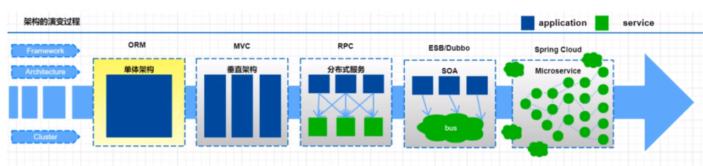


#### 2.1 单体架构

互联网早期，一个网站，需求量很少的，只需要一个应用，将所有代码部署到同一个服务器中，优点可以减少开发和维护成本，但是缺点也很明显，不能针对于指定模块进行优化和扩展，而且单点服务器容错率很低

- 比如：一个购物平台，里面会包含用户模块，商品模块，订单模块等很多模块，我们会把它打包成一个web项目，然后部署到一台tomcat服务器中


#### 2.2 垂直架构

随着项目访问量越来越大，但是并不是项目每个模块并发量都很高，比如：一个购物平台，会随着用户量变多，他的用户模块和订单模块，会出现很高并发量，那么咨询，消息模块并发量是比较小的，所以想针对于几个模块一起来增加并发量，其他几个模块不增加，单体架构就很难实现，所以他才推出了垂直架构模式

> 垂直架构就是将原来的一个应用，拆成几个相互独立的应用，用于提高效率，比如：我们可以将一套系统拆分成
>
> - 电商系统：用户模块，商品模块，订单模块
> - 后台系统：用户管理，商品管理，订单管理
> - CMS系统：广告模块，营销模块，咨询模块

这样拆分完毕，一旦用户量过多，只需要针对于电商系统去优化，其它系统无需优化，优点在于可以分流，解决了并发量的问题，针对于不同模块开发，缺点是系统之间，没有相互的联系，无法进行相互调用，而且还有很多重复的开发任务


#### 2.3 分布式架构

当垂直架构应用越来越多，重复开发的任务也会越来越多，所以就需要考虑将这些重复的代码提取出来，做成一套统一的系统，然后由前端控制层调用不同的业务服务，这样就形成了分布式系统架构，他会把整个项目，在垂直系统架构的基础上，拆分成了服务层（包含主要业务逻辑）和表现层（处理和页面交互的），他们之间可以通过远程调用去访问，公共的服务层，来实现业务逻辑，优点：提高代码的复用性，减少开发成本，缺点：调用关系会错综复杂，难以维护


#### 2.4 SOA架构

在分布式系统架构上，当服务层越来越多，服务之间调用关系错综复杂，所以SOA架构就是在原来基础上，添加一个调度中心（注册中心）用于对这些调用的服务，集中的实时管理，所有服务都必须在这里注册，才能远程调用其他服务，优点：使用了注册中心，解决了服务之间调用的复杂关系，并且服务下线后，可以实现自动熔断，缺点：所有服务都需要在注册中心进行注册，需要调用其他服务时，也需要从注册中心来获取，如果注册中心出现问题，其他模块也会出现问题


#### 2.5 微服务架构

微服务架构就是面向服务的SOA架构体系，他会把服务拆分更加彻底，并且SOA中提高的问题，他都可以很好的解决，相比SOA架构，更加精细，每个服务之间互不影响，每个服务必须独立部署，并且还强调每个服务都是独立的数据库配置，而且注册中心，也可以配置多节点，集群模式，所以微服务架构更加适合大型互联网公司


### 3.微服务架构常用问题

这么多微小的服务（springboot项目）

- 如何去管理？：注册中心（zookeeper，eureka，nacos）
  - 他们之间如何相互通信？：（restFul风格，rpc框架，dubbo，httpclient，rest Template，feign，OpenFeign）
- 用户的客户端怎么访问它？：网关（zuul，gateway）
- 一旦服务出现问题了？如何处理？：熔断器（hystrix，sentinel）
- 一旦服务出现问题了？如何排错？：链路追踪


### 4.微服务主流解决方案

- 阿里系：zookeeper+dubbo+springmvc/springboot，同时方式通过dubbo做远程调用，注册中心使用zookeeper，但是dubbo是阿里开发的，但是后面不维护了，捐给了apache
- spring系：spring全家桶+嵌入式第三方组件库（NetFlix）通信方式，http restFul，注册中心是eureka，配置中心是config，熔断器是hystrix，网关早期是zuul，后期gateway，但是NetFlix也不再更新了
- springcloud alibaba系：目前最主流的方案，并且它是基于spring官方提供的微服务架构，做了一些优化，他的组件和官方提供的基本都类似（Nacos，sentinel，OpenFeign，gateway）

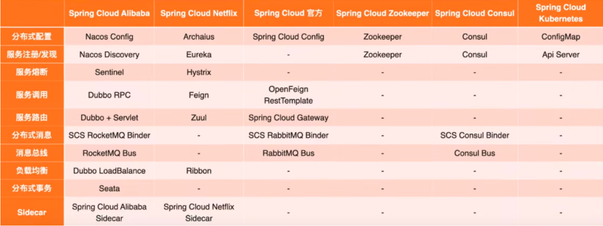


### 5.spring cloud alibaba

spring cloud alibaba是阿里开发的产品，立志于提供微服务开发的一站式解决方案，它包含了开发微服务架构的核心组件（nacos，openFeign，loadbalance，sentinel，gateway，seata.....）使开发者通过这些组件，轻松的开发微服务架构，只需要添加一些注解，和一些少量的配置即可，我们主要学习这些核心组件是如何搭建配置的


#### 5.1 spring cloud alibaba环境依赖

参考网站：

> https://github.com/alibaba/spring-cloud-alibaba/wiki/

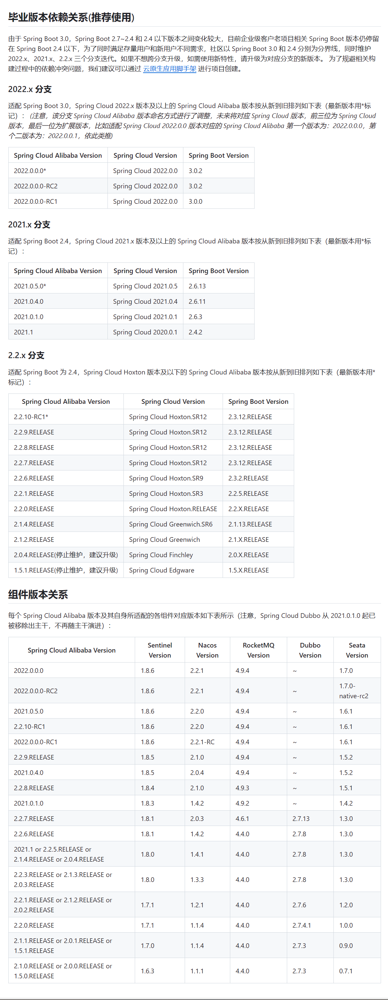


#### 5.2 微服务框架系统结构图

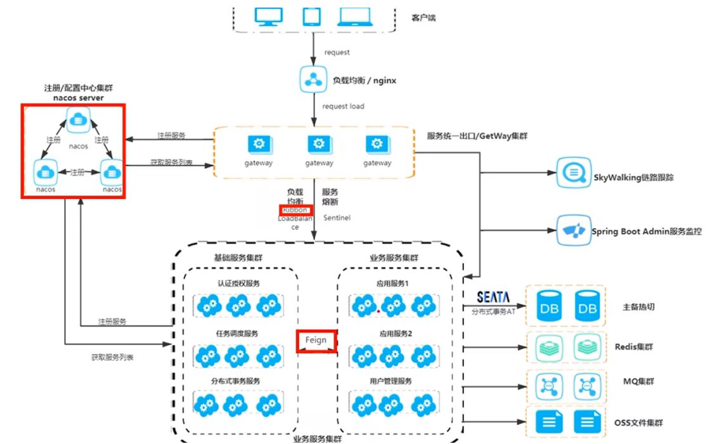


### 6.Nacos组件

nacos是spring cloud alibaba最核心的组件，是基于C/S架构的，主要用于实现服务发现和服务配置，还结合了动态配置中心的功能，这样管理好后就可以通过服务名，进行远程调用其他服务，同时nacos也提供了可视化的界面，来动态管理所有的服务


#### 6.1 Nacos服务端搭建

- nacos官网下载服务端

  > Nacos官网地址：https://nacos.io/zh-cn/index.html
  > Nacos帮助文档：https://nacos.io/zh-cn/docs/concepts.html
  > GitHub下载页面：https://github.com/alibaba/nacos/releases
  >
  > windows版本：https://github.com/alibaba/nacos/releases/download/2.2.0/nacos-server-2.2.0.zip
  > linux版本：https://github.com/alibaba/nacos/releases/download/2.2.0/nacos-server-
  > 2.2.0.tar.gz
  > 下载github的资源地址：https://tool.mintimate.cn/gh/

- windows版Nacos为例，进行搭建

  - 下载好zip文件后，进行解压即可

  - 解压好后，进入bin目录，编辑startup.cmd默认是开启集群模式，所以修改成单点服务器启动

  - 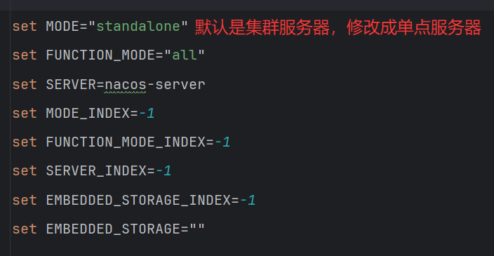

    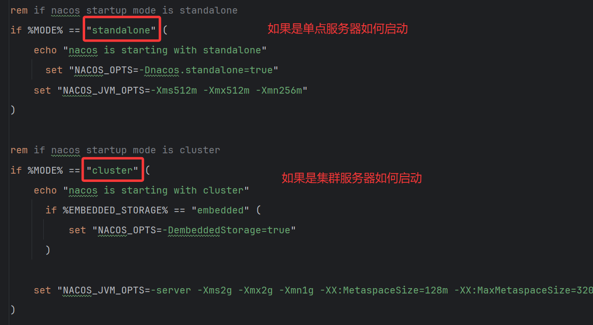

- 打开conf包，application.properties是nacos核心配置文件

  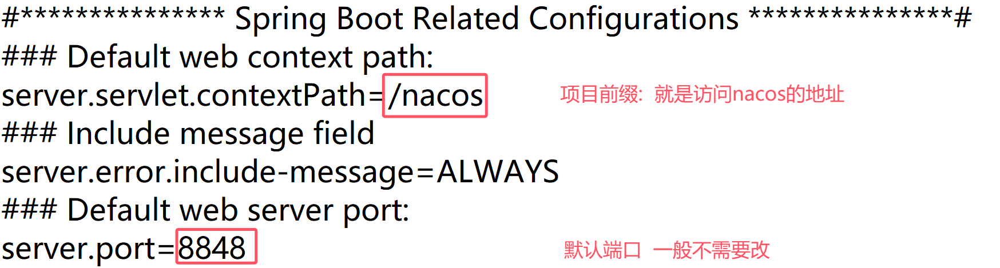

  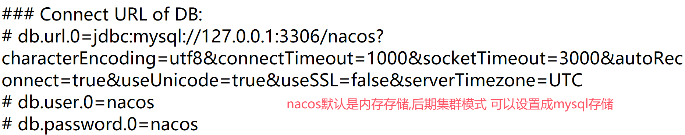

- 如果设置都没有问题，双击startup.cmd文件，启动nacos，等待成功

  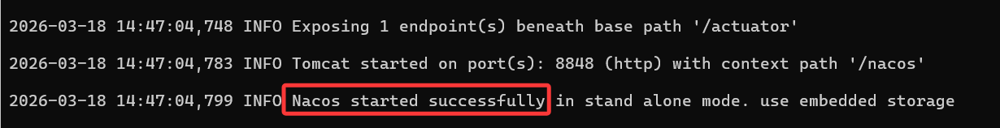

- 测试：ip地址:8848/nacos/index.html，可以访问内置的web网站，用于管理所有服务（默认账号密码：nacos）


#### 6.2 Nacos客户端搭建（除了服务端其他springboot项目都是客户端）搭建

- 先创建一个父项目，不用选择任何依赖

- 在这个父项目中，再u创建一个订单服务

  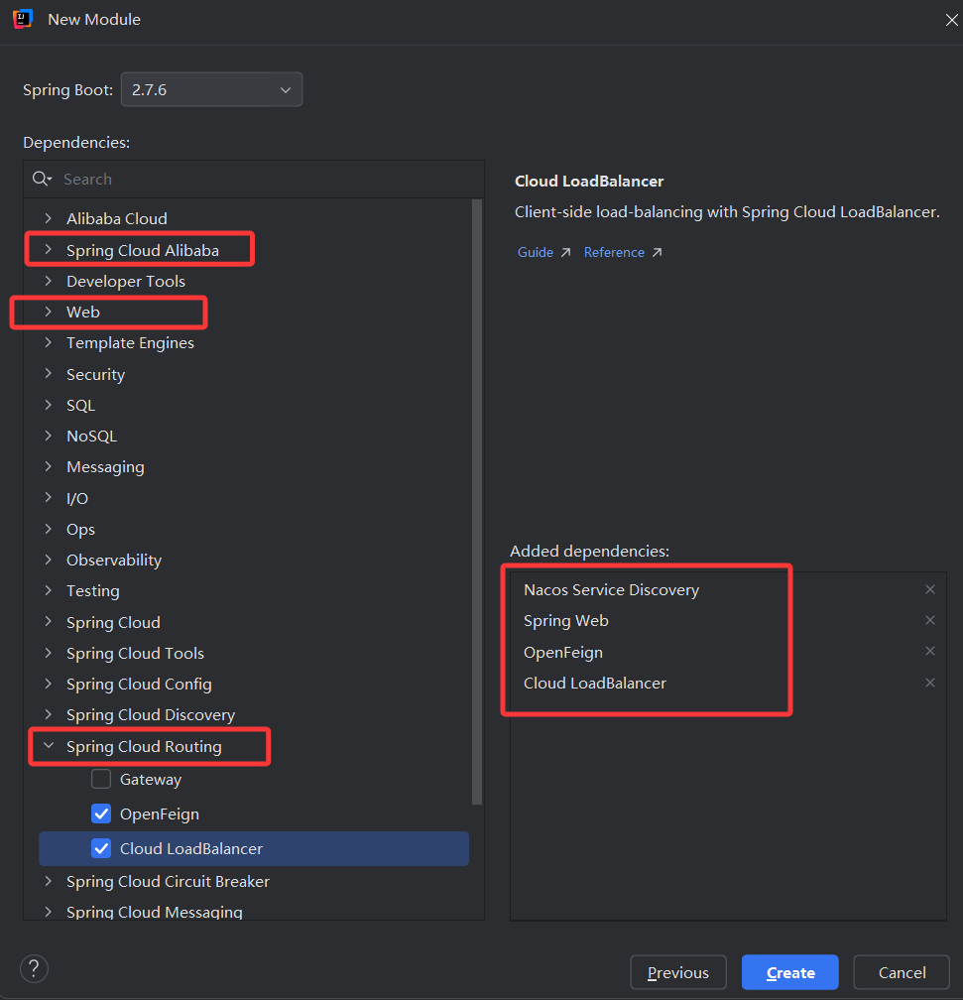

- 订单服务配置文件

  ```yml
  #端口号
  server:
    port: 8000
  
  spring:
    application:
      ###服务名(在nacos注册中心上的名字，后期是通过它远程调用的)
      ###服务名不要写下划线
      name: order-service
    cloud:
      nacos:
        #配置nacos注册中心的地址
        server-addr: localhost:8848
        discovery:
          #配置nacos账号密码
          username: nacos
          password: nacos
          #配置nacos的命名空间（比如：生产环境，开发环境，测试环境）
          namespace: public
  ```

- 再创建一个子服务（库存服务）

  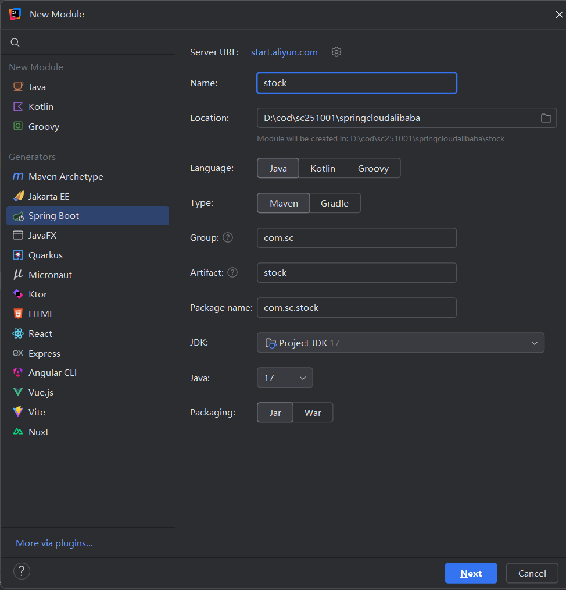

  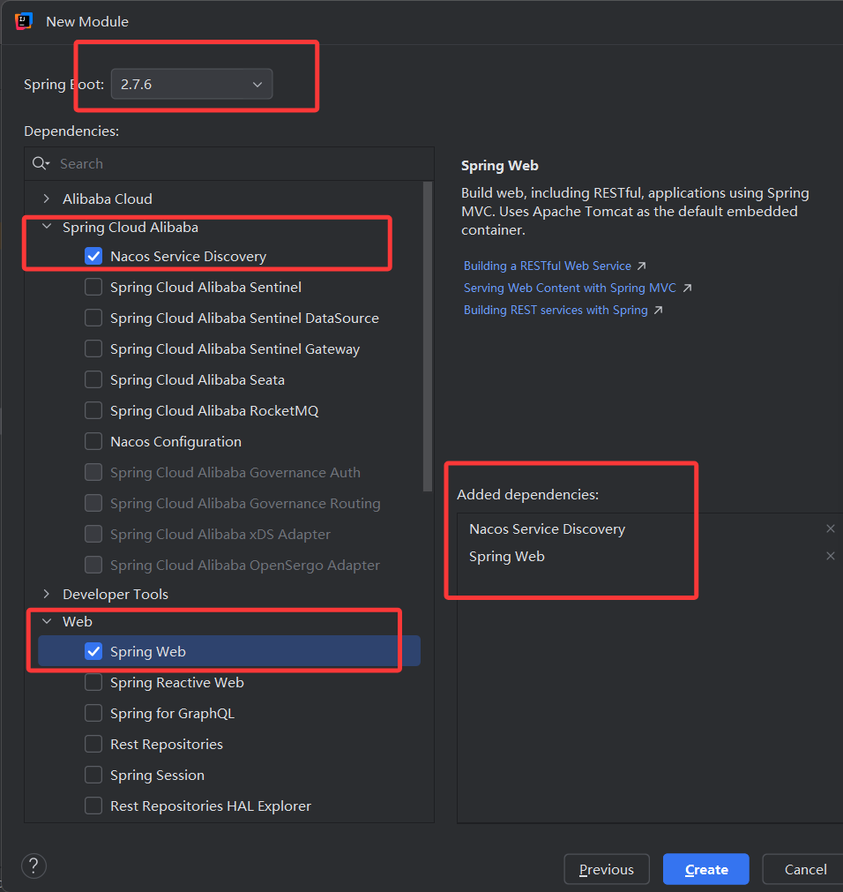

- 库存服务配置文件

  ```yml
  #端口号
  server:
    port: 9000
  
  spring:
    application:
      ###服务名(在nacos注册中心上的名字，后期是通过它远程调用的)
      name: stock-service
    cloud:
      nacos:
        #配置nacos注册中心的地址
        server-addr: localhost:8848
        discovery:
          #配置nacos账号密码
          username: nacos
          password: nacos
          #配置nacos的命名空间（比如：生产环境，开发环境，测试环境）
          namespace: public
  ```

  

- 对订单服务和库存服务分别提供一个后端接口地址（下单和扣减库存功能）

  ```java
  //订单
  @RestController
  public class OrderController {
      @Autowired
      RestTemplate rest;
  
      @RequestMapping("/add")
      public String add() {
          System.out.println("下单成功");
          //调用库存服务，扣减库存
          //正常使用：http://localhost:8000/cut
          //使用nacos注册的服务名来访问 http://服务名/请求
          String msg = rest.getForObject("http://stock-service/cut", String.class);
          return "下单成功,另一个库存服务结果：" + msg;
      }
  }
  
  //库存
  @RestController
  public class StockController {
      @Value("${server.port}")
      String port;
  
      @RequestMapping("/cut")
      public String cut() {
          System.out.println("减少库存");
          return "减少库存" + port;
      }
  }
  ```

  

- 订单服务通过RestTemplate进行远程调用，编写配置类，去配置RestTemplate对象

  ```java
  @Configuration
  public class RestConfig {
      @Bean
      //开启负载均衡的功能
      //这样的话，才可以通过nacos服务名去调用其他服务
      @LoadBalanced  //必须添加loadBalance依赖
      RestTemplate restTemplate(RestTemplateBuilder builder) {
          return builder.build();
      }
  }
  ```

- 订单服务控制层，进行远程调用

  ```java
  @RestController
  public class OrderController {
      @Autowired
      RestTemplate rest;
  
      @RequestMapping("/add")
      public String add() {
          System.out.println("下单成功");
          //调用库存服务，扣减库存
          //正常使用：http://localhost:8000/cut
          //使用nacos注册的服务名来访问 http://服务名/请求
          String msg = rest.getForObject("http://stock-service/cut", String.class);
          return "下单成功,另一个库存服务结果：" + msg;
      }
  }
  ```

  

##### 6.2.1 负载均衡

负载均衡是一种计算机网络和系统架构中，使用非常广泛的技术，主要用于将网络请求，均衡分配（轮询机制）到多个资源，这样就可以使系统处理更高的并发请求，如果其中一个资源出现故障，负载均衡也可以帮你自动将请求转发到其他可用资源

> 用户访问订单服务发送6次请求，---->3个库存服务

- 添加库存服务，形成3个实例，修改虚拟机参数，切换不同的端口

  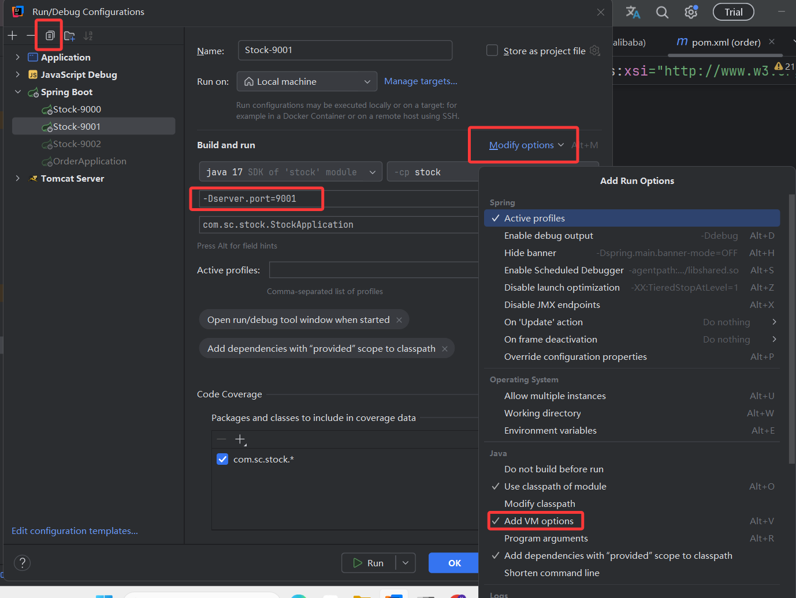

- 修改库存代码，体现出端口号

  ```java
  @RestController
  public class StockController {
      @Value("${server.port}")
      int port;
  
      @RequestMapping("/cut")
      public String cut() {
          System.out.println("减少库存");
          return "减少库存" + port;
      }
  }
  ```

- 发送6次下单请求，查看每个库存服务是否扣减两次


#### 6.3 Nacos集群模式（linux部署，内存至少2G否则卡死）--- 了解

- 下载传输nacos-server-2.2.0.xxx.gz到linux

- 创建三个节点nacos（8848，8858，8868）

  ==注：每个节点nacos端口号，不能随便设置，因为nacos除了主端口号(8848)，底层还会存在gRPC端口（服务端gRPC:9849，客户端gRPC:9848），避免系统中程序，占用这些端口，如果需要配置防火墙，还需要把这个端口开放才可以==

- 修改bin/startup.sh，修改启动模式改成cluster（默认值），同时减少内存消息，初始堆内存256m，最大堆内存256m，最小堆内存128m，

- 修改conf/application.properties（修改端口号，开启mysql配置）

  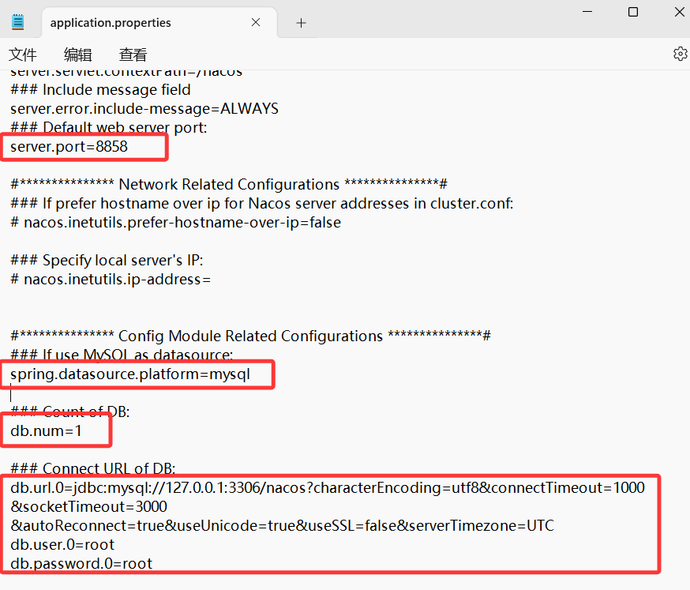

- 修改conf/cluster.conf.example，改成cluster.conf，让它启用

- 编辑cluster.conf

  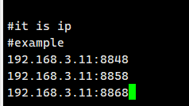

- 创建Linux本机安装的mysql对应的数据库

  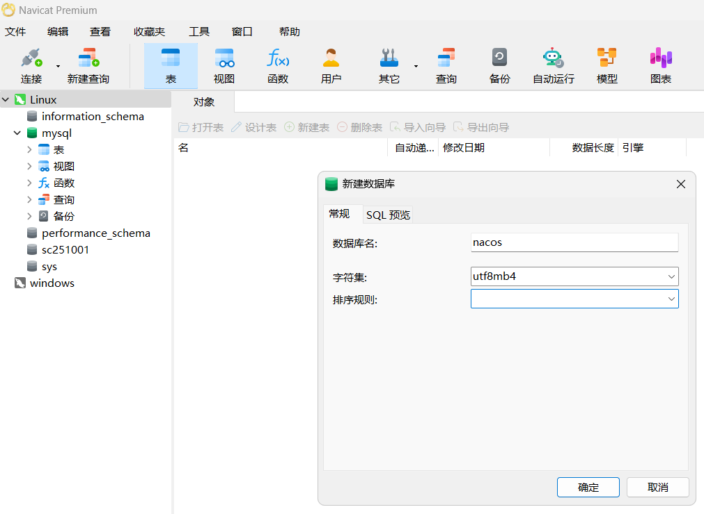

- 在navicat中直接运行mysql-schema.sql，创建nacos集群需要的表结构

- 参考第一个节点nacos8848，复制修改其他节点8858，8868

  ```
  cp -r nacos8848 nacos8858
  cp -r nacos8848 nacos8868
  ```

- 启动每一个节点的startup.sh文件

- 测试linuxip:8858/nacos/index.html

  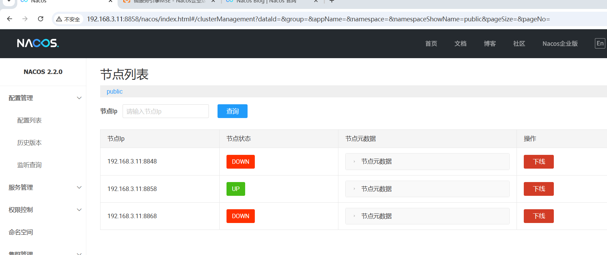


##### 6.3.1 安装和配置Nginx进行反向代理

前面已经搭建好了三个节点的nacos集群，最终目的还是需要通过nacos客户端，还是需要去服务端注册的，所以编写注册中心的地址无法确定编写哪个地址，除非直接写三个ip:端口，ip2：端口2，也可以通过Nginx做反向代理，用于代理nacos的三个节点，对外提供一个可访问的网址或端口，这样nacos客户端只需要访问nginx，他就会帮你访问nacos的三个节点的某一个

- 安装并且配置Nginx，进行反向代理

  > vi /usr/local/nginx/conf/nginx.conf

  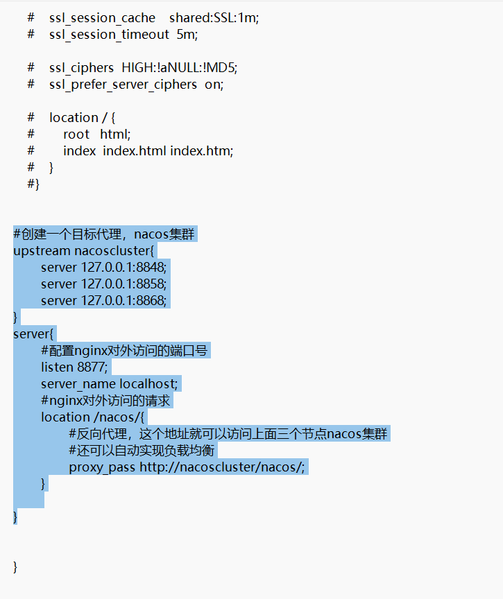

- 启动nginx服务器

  ```
  cd /usr/local/nginx/sbin
  ./nginx
  ```

- 测试：ip地址:8877/nacos/ 就可以访问不同节点的集群

- 最后nacos客户端每一个服务，只需要通过nginx代理的端口就可以直接在nacos集群中进行注册了

  ```yml
  server-add: 192.168.3.11:8877
  ```

  注：由于向nacos集群去注册，会出现异常，原因nacos2版本相比nacos1版本，新增gRPC通信技术，除了对外开放8848端口号，还需要额外开放一些9948，9849，

  ```properties
  grpc.server.port=9848 //也可以降低版本，去除grpc通信功能
  ```

  ```xml
  <!--降低版本-->
  <dependency>
              <groupId>com.alibaba.nacos</groupId>
              <artifactId>nacos-client</artifactId>
              <version>1.4.1</version>
          </dependency>
  ```

  

### 7.OpenFeign

OpenFeign是spring cloud alibaba 在Feign基础上做了升级处理，并且让其支持springmvc注解，比如：@RequestMapping，

OpenFeign的注解@FeignClient用于解析springmvc注解下的接口，并通过动态代理模式生产实现类，实现类中做负载均衡，调用其他服务，不再需要编写繁琐RestTemplate代码


#### 7.1 OpenFeign基本使用

- 导入OpenFeign依赖（构建项目时可以直接添加） --- 什么服务需要远程调用其他他服务，要添加该依赖

  ```xml
  <dependency>
              <groupId>org.springframework.cloud</groupId>
              <artifactId>spring-cloud-starter-openfeign</artifactId>
          </dependency>
  ```

- 创建一个新的商品服务，提供一个查询商品后端接口

  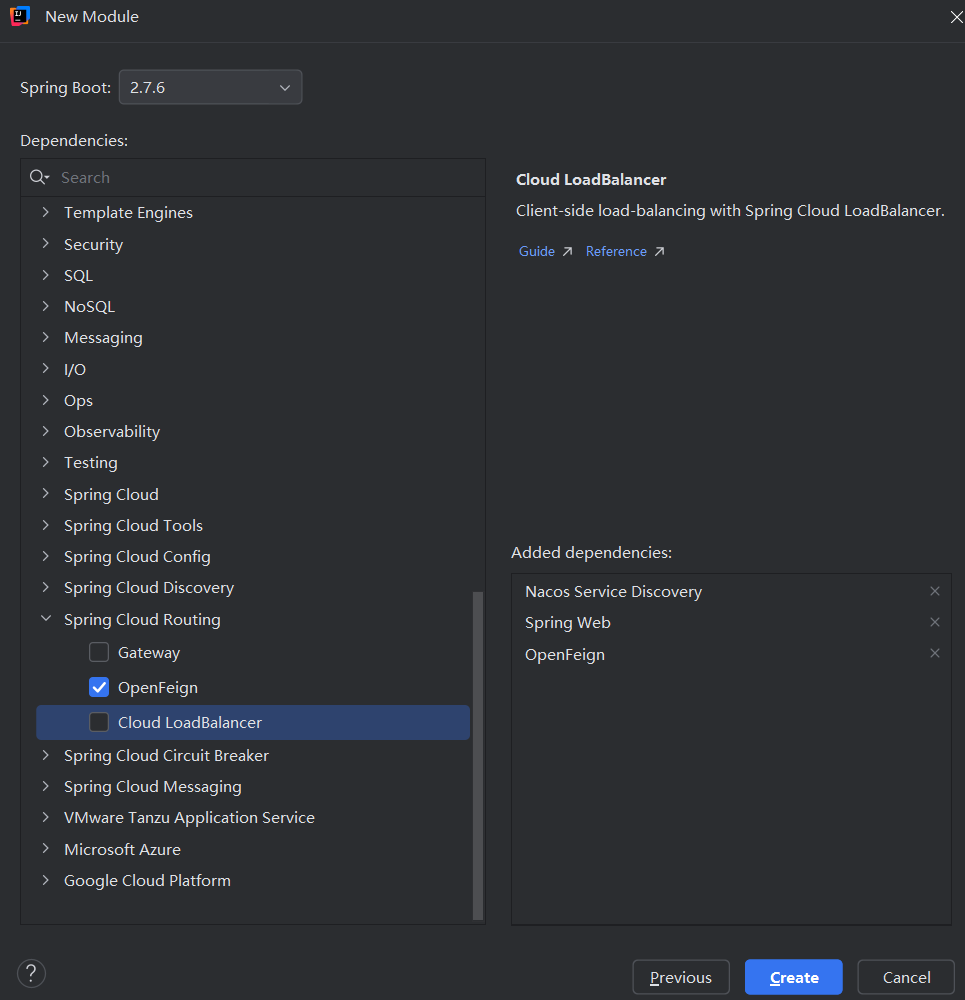

  ```java
  @RestController
  public class GoodsController {
      @Value("${server.port}")
      int port;
  
      @GetMapping("/goods/{id}")
      public String getGoods(@PathVariable("id") Integer id) {
          System.out.println("查询商品:" + id);
          return "查询商品:" + id+",端口是:"+port;
      }
      
  }
  ```

- 订单进行远程访问其他商品服务和库存服务

  - 添加一个OpenFeign依赖

- 订单服务中提供这两个服务的OpenFeign服务接口

  ```java
  //name表示调用服务名
  //该注解就可以通过调用服务，通过代理生产该接口的实现类
  @FeignClient(name = "goods-service")
  public interface GoodsFeignService {
      //编写和对应服务控制层一样的代码
      @GetMapping("/goods/{id}")
       String get(@PathVariable("id") Integer id);
  }
  ```

  ```java
  @FeignClient(name = "stock-service")
  public interface StockFeignService {
      @RequestMapping("/cut")
      String cut();
  }
  ```

- 订单服务控制层，就可以跟调用普通service方式，进行调用其他服务

  ```java
  @RestController
  public class OrderController {
      @Autowired
      GoodsFeignService goods;
  
      @Autowired
      StockFeignService stock;
  
      @RequestMapping("/add/{id}")
      public String add(@PathVariable("id") Integer id) {
          System.out.println("下单成功");
          String goosResult = goods.get(id);
          String stockResult = stock.cut();
          return "下单成功,库存结果:" + goosResult + ",商品服务结果" + stockResult;
      }
  }
  ```

- springboot启动类，添加注解，开启远程调用

  ```java
  @EnableFeignClients
  ```


#### 7.2 OpenFeign日志配置

微服务正常进行远程调用，难免出现网络波动，或者服务下线，导致远程调用失败，或者想看看调用接口的性能如何，都可以通过配置OpenFeign日志，把远程调用的信息输出出来


##### 7.2.1 全局配置（远程调用任何服务都有效）

- 定义配置类：指定日志级别

  ```java
  //OpenFeign提供日志级别主要分四种：
  // NONE：默认值，不记录日志
  // BASIC：仅记录请求方法,url,响应状态码和执行时间
  // HEADERS:记录basic日志基础上，还记录请求和相应的头信息
  // FULL：记录全部信息
  @Configuration
  public class FeignConfig {
      @Bean
      Logger.Level level() {
          return Logger.Level.FULL;
      }
  }
  ```

- 修改springboot配置文件

  ```yml
  #springboot默认日志级别时info，所以不会打印info以下级别的日志
  #OpenFeign日志属于debug级别，所以指定OpenFeign模块设置debug
  logging:
    level:
      com.sc.order.feign: debug
  #全局日志是FULL级别，可以指定调用某一个服务是BASIC
  feign:
    client:
      config:
        ##服务名
        stock-service:
          loggerLevel: BASIC
  ```

  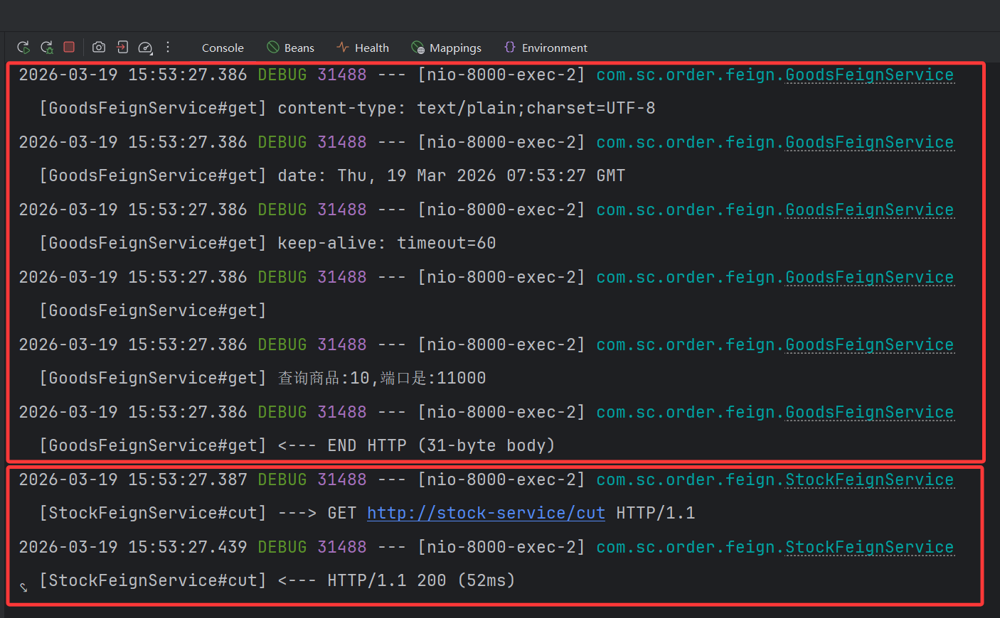


##### 7.2.2 超时时间配置

- 修改配置类

  ```java
  //OpenFeign提供日志级别主要分四种：
  // NONE：默认值，不记录日志
  // BASIC：仅记录请求方法,url,响应状态码和执行时间
  // HEADERS:记录basic日志基础上，还记录请求和相应的头信息
  // FULL：记录全部信息
  @Configuration
  public class FeignConfig {
      @Bean
      Logger.Level level() {
          return Logger.Level.FULL;
      }
      @Bean
      Request.Options options() {
          //参数1：连接超时时间，默认2秒， 参数2：请求处理超时时间，默认5秒，单位是毫秒
          return new Request.Options(2000, 5000);
      }
  }
  ```

- 修改配置文件

  ```yml
  #全局日志是FULL级别，可以指定调用某一个服务是BASIC
  feign:
    client:
      config:
        ##服务名
        stock-service:
          loggerLevel: BASIC
          connectTimeout: 5000
          readTimeout: 10000
  ```

- 测试：

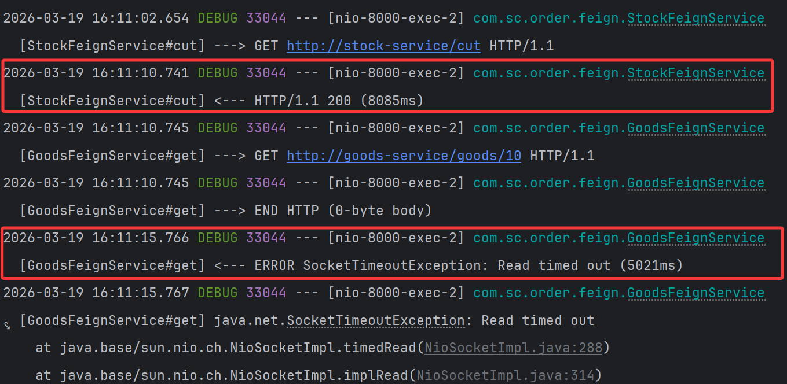


> 最后OpenFeign如果超时了，显示异常，对微服务肯定不友好的，后期可以通过OpenFeign结合Sentinel，进行服务的熔断降级，服务如果宕机了或者超时，可以返回自定义的信息


### 8.Nacos config配置中心

Nacos提供了用于存储和管理服务器配置文件的存储方式，为分布式系统或者微服务系统，提供外部化配置，提供了服务端和客户端的支持，这样可以让Nacos可以集中化的管理服务中的所有配置文件

好处：

- 维护性：原来每次修改配置文件，都需要找到对应的服务的配置文件，现在只需要关注一个Nacos配置中心即可
- 时效性：原来每次修改配置文件需要重启，现在无需重启立即生效
- 安全性：ip地址，端口号，账户密码，一般是不能暴露出来的，现在都是封装起来，而且还可以设置权限


#### 8.1 Nacos Config配置中心

1. 首先打开nacos客户端，配置管理，添加新的配置

   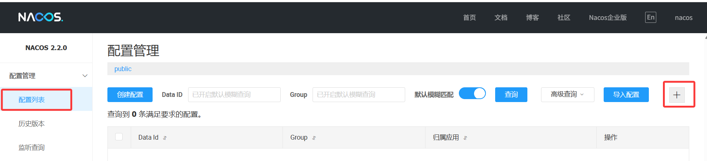

2. 新建配置界面

   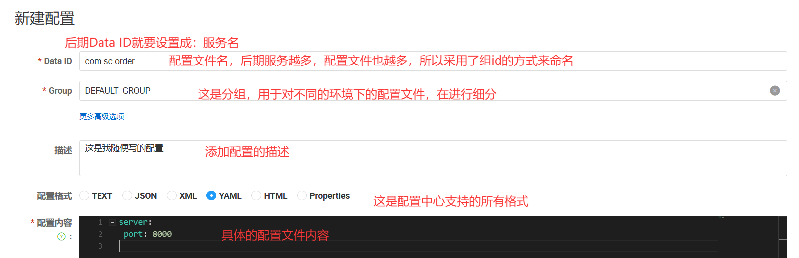


3. 新建配置成功的界面

   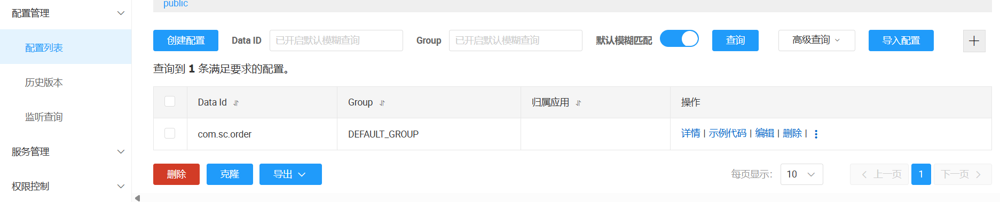

4. 创建几个新的命名空间（比如：开发环境dev，生产环境）

   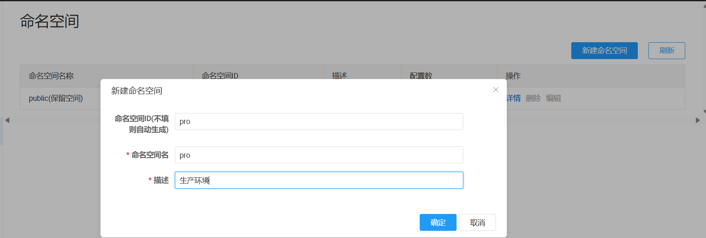

   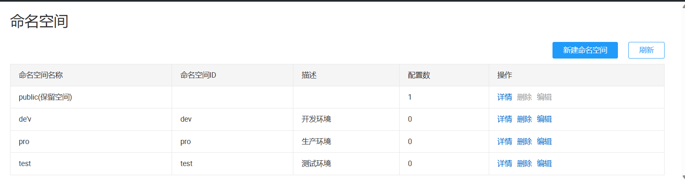

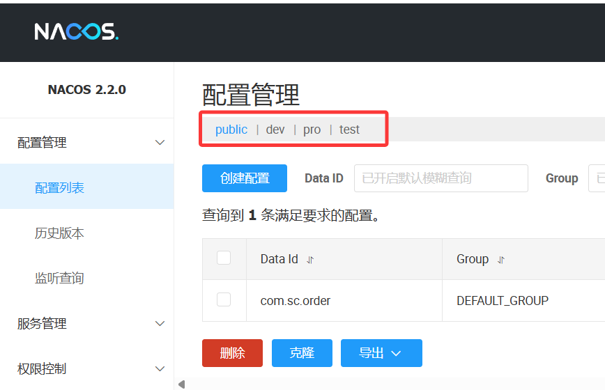

5. 还可以通过克隆把不同环境的配置进行复制，不需要重复编写

   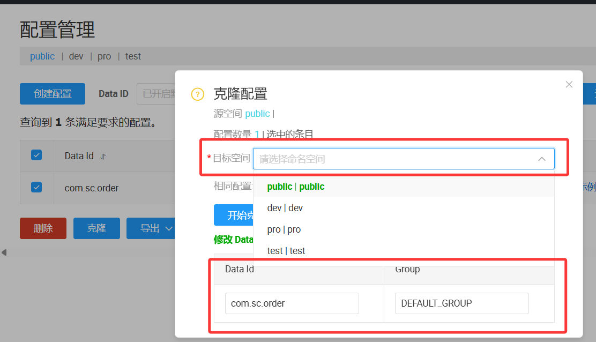


6. 还可以创建新的账号，设置权限，来动态的管理配置

   - ==前提==：==nacos服务端配置文件==需要开启授权功能，然后重启nacos

     

   - 创建用户

     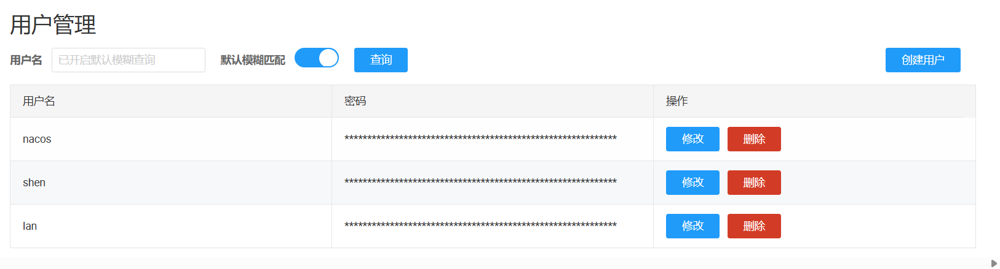

   - 绑定角色

     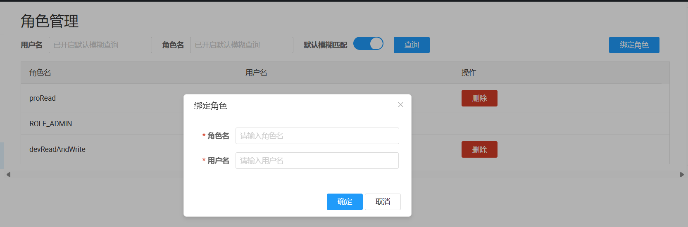

   - 添加权限

     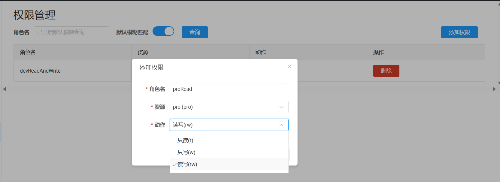


#### 8.2 Nacos config快速搭建

1. 新建一个服务，表示要通过配置中心管理配置

   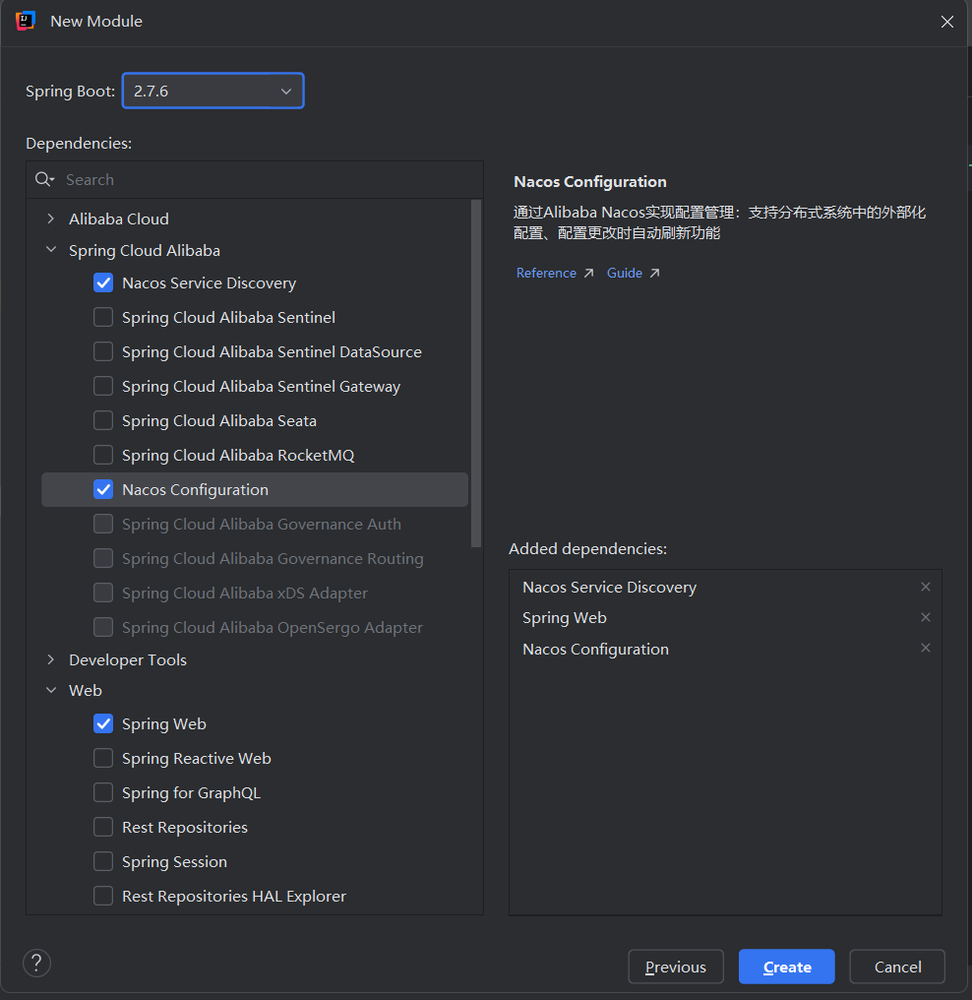

2. 导入bootstrap依赖：用于让nacosconfig可以读取到项目中的配置文件，但是只能读取bootstrap.yml，不能读取到application.yml

   ```xml
   <!-- bootstrap -->
   <dependency>
   <groupId>org.springframework.cloud</groupId>
   <artifactId>spring-cloud-starter-bootstrap</artifactId>
   <version>3.1.5</version>
   </dependency>
   ```

   ==注：以下两个配置文件都可以被springboot默认加载==

3. 编写application.yml

   ```yml
   server:
     port: 20000
   ```
   
   
   
4. 创建编写bootstrap.yml

   ```yml
   spring:
     application:
       #如果使用了配置中心，服务名就不能乱写，需要对应配置中心的DataID
       name: com.sc.order
     cloud:
       nacos:
         server-addr: localhost:8848
         username: nacos
         password: nacos
         config:
           namespace: public
           #设置配置中心，配置文件后缀名，默认properties
           file-extension: yaml
   ```
   
5. 切换不同的命名空间

   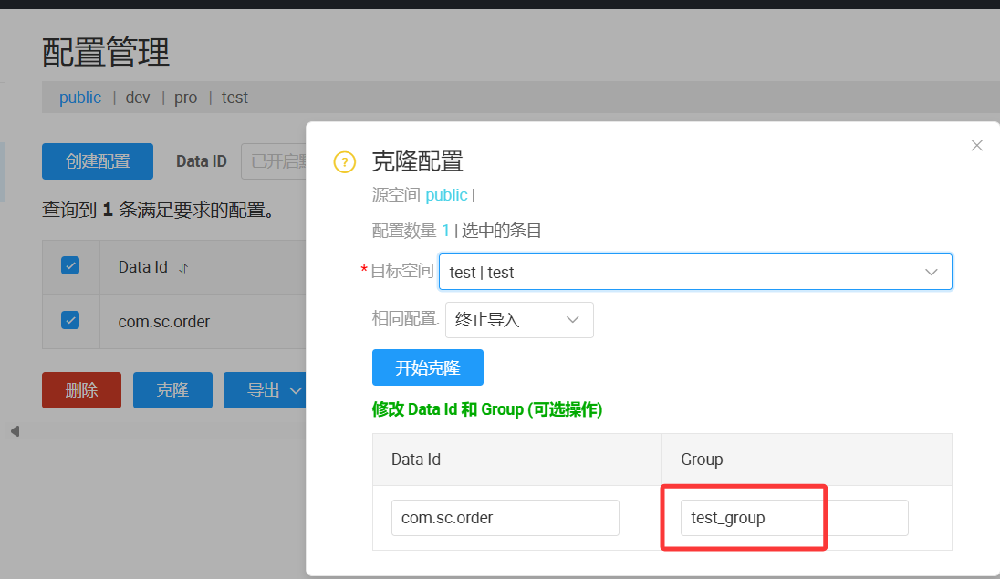

6. 修改bootstrap.yml

   ```yml
   spring:
     application:
       #如果使用了配置中心，服务名就不能乱写，需要对应配置中心的DataID
       name: com.sc.order
     cloud:
       nacos:
         server-addr: localhost:8848
         username: nacos
         password: nacos
         config:
           #设置命名空间
           namespace: test
           #设置配置中心，配置文件后缀名，默认properties
           file-extension: yaml
           #设置组，不同组的配置文件，是可以重名的
           group: test_group
   ```

   

7. 启动类测试

   ```java
   @SpringBootApplication
   public class ConfigApplication {
   
       public static void main(String[] args) throws InterruptedException {
           ConfigurableApplicationContext ioc = SpringApplication.run(ConfigApplication.class, args);
   //        while (true) {
               //如果nacos配置中心，修改了配置，他无需重启，立即生效
               //获取配置文件中的配置，根据key获取value
               String port = ioc.getEnvironment().getProperty("server.port");
               String myusername = ioc.getEnvironment().getProperty("myusername");
               String mypassword = ioc.getEnvironment().getProperty("mypassword");
               System.out.println("port:" + port
                       + ",myusername:" + myusername
                       + ",mypassword:" + mypassword);
   //            Thread.sleep(2000);
   //        }
       }
   }
   ```

   

##### 8.2.1 Nacos config的@RefreshScope注解

正常在项目中想获取配置文件中的配置，通过@Value就可以获取，但是他无法动态感知配置中心修改后的值，只需要在类上添加该注解，就可以实时感知配置中心修改后的值，也可以起到无需重启的作用

```java
@RefreshScope
@RestController
public class ConfigController {
    @Value("${server.port}")
    int port;
    @Value("${myusername}")
    String un;
    @Value("${mypassword}")
    String pw;

    @RequestMapping("/test")
    public String test() {
        System.out.println("测试请求");
        return "测试请求,端口:"+port+",账号:"+un+",密码:"+pw;
    }
}
```


### 9.Sentinel组件

#### 9.1 为什么需要sentinel

- 流量激增导致请求出现阻塞，
- 第三方服务阻塞
- 异常没有处理
- 硬件故障（关机，重启，死机，蓝屏......）


#### 9.2 什么是sentinel

sentinel是阿里巴巴开源的，面向分布式服务架构，高可用防护组件是分布式系统的流量哨兵，主要是以流量为切入点，从限流到流量整型，熔断降级，系统负载保护，热点防护，从多个维度，来维护系统保证他的稳定性

- sentinel特点：
  - 丰富应用场景：承接了阿里巴巴近十年的双十一，大流量的核心场景，比如：秒杀，熔断不可用服务
  - 完备的实时监控：有一个控制台，可以实时监控，每一台计算机介入时间和传输的秒级数据
  - 广泛的开原生态：开箱即用，和其他框架整合，非常方便，只需要引入一些简单的配置即可


#### 9.3 Sentinel DashBoard

sentinel dashboard是sentinel可视化流量控制台组件，类似于nacos的管理界面，可以清晰地看到流量的使用情况，这样也更加方便进行流量控制，和熔断降级

- 下载

  > https://github.com/alibaba/Sentinel/releases/download/1.8.6/sentinel-dashboard-1.8.6.jar

- 通过命令启动dashboard，底层就是一个springboot项目，但是端口号默认是8080，肯定要改

  > java -Dserver.port=30000 -jar xxx.jar

- 直接通过网址测试：账号和密码都是：sentinel

  ```
  localhost:端口号/
  ```

  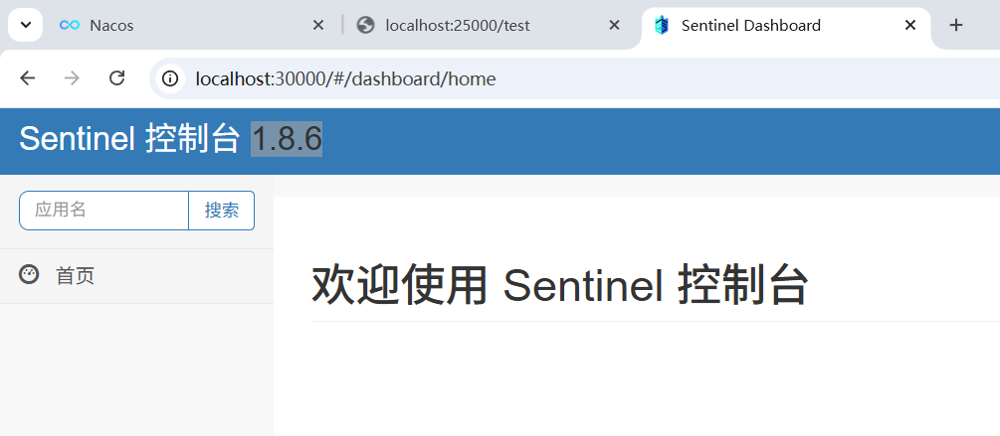


#### 9.4 spring cloud alibaba整合sentinel

1. 创建一个新服务sentinel服务（可以换成任意的订单，商品，库存）

   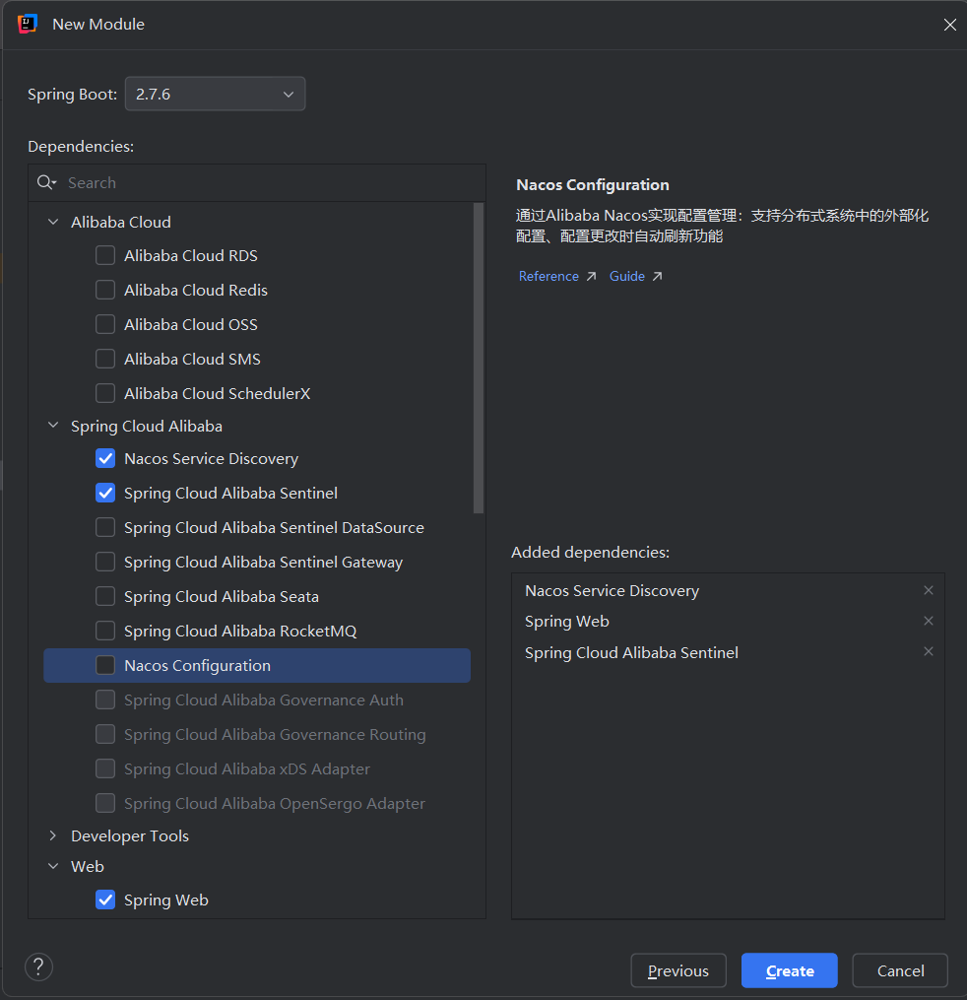


2. application.yml

   ```yaml
   server:
     port: 31000
   spring:
     application:
       name: sentinel
     cloud:
       sentinel:
         transport:
           #配置连接sentinel控制台的网址
           dashboard: localhost:30000
   ```


3. 控制层

   ```java
   @RestController
   public class SentinelController {
       @RequestMapping("/test")
       public String test() {
           return "测试成功";
       }
   }
   ```


4. 启动服务器，发送一下该请求，就可以查看sentinel控制台，就会有新的请求的数据

   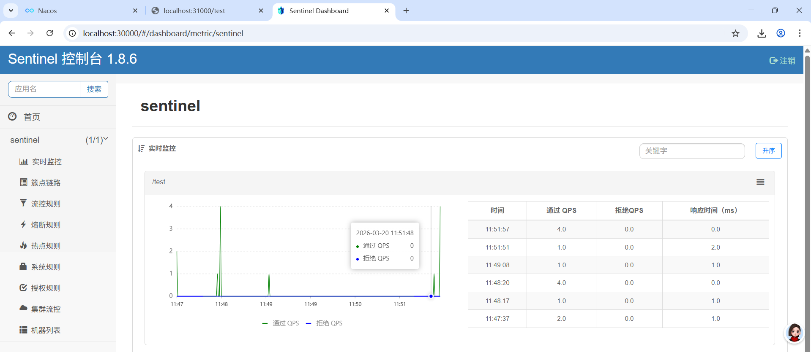

5. sentinle控制台介绍
   - 实时监控：显示每个接口地址的QPS（每秒请求数）
   - 簇点链路：用于设置每个接口地址（资源）进行流量监控和熔断降级......
   - xxx规则：就是簇点链路设置好了就会显示对应的规则
   - .......


#### 9.5 流量控制使用

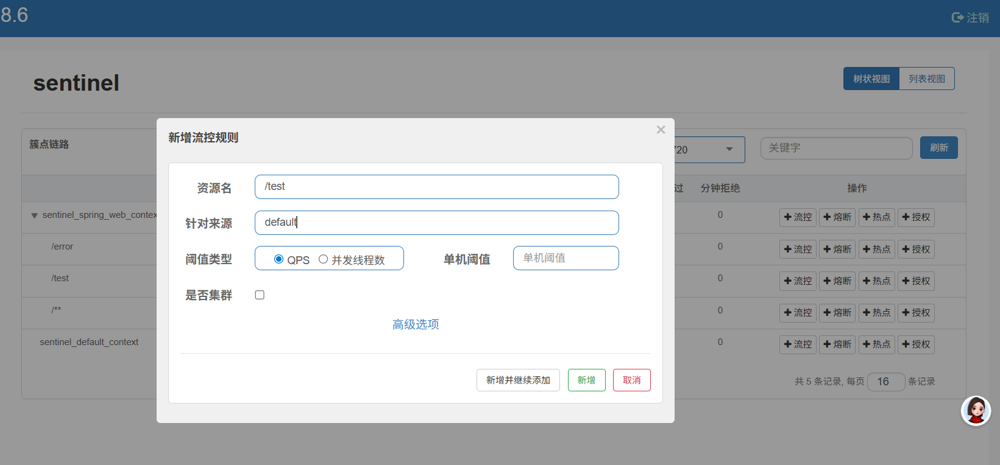

原理就是监控应用流量QPS（每秒请求数）或者并发线程数等指标，达到了设置的指定阈值，就可以对流量进行控制，避免了瞬间流量高峰的问题，保障系统的高可用性，通常在服务的生产者配置

> 比如：订单服务（消费者）要调用库存服务（生产者）


##### 9.5.1 通过QPS进行流控

1. 打开sentinel控制台，选择好指定的资源进行流控

   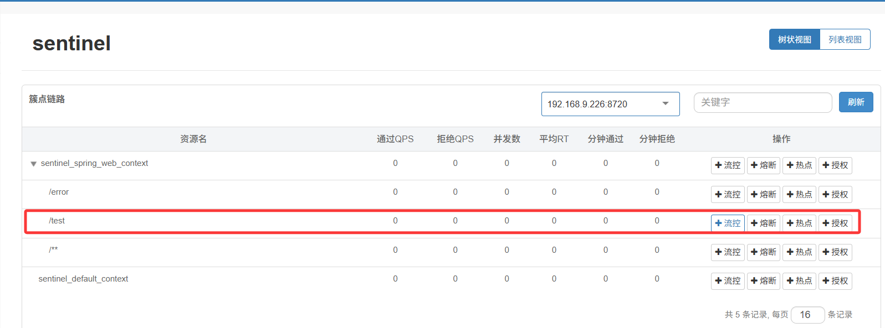

2. 新增流控规则，设置QPS=2，表示每秒最多只能访问2次

   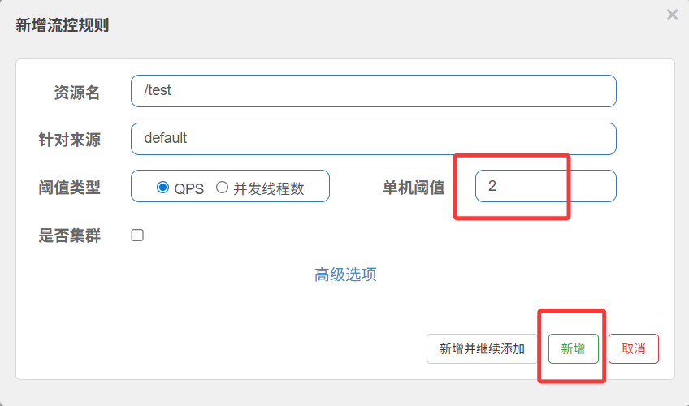

3. 测试：发送/test请求，2次以内是否正常，2次以上是否流控

   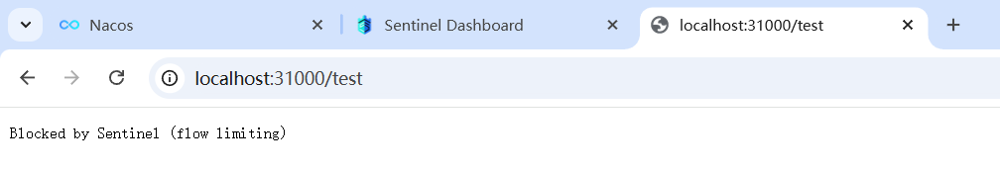

4. 如果想手动设置流控的结果，使用@SentinelResource注解

   ```java
   @RestController
   public class SentinelController {
       @RequestMapping("/test")
       //value:定义资源（就是请求）dashboard控制台就会出现新的值，
       // sentinel控制台需要这个最新的值，进行流控才会有效果
       //blockHandler:设置流量控制后，处理的方法（默认该方法需要声明在同一个类中）
       //fallback:当请求出现流控了，就可以交给fallback方法处理
       @SentinelResource(value = "test", blockHandler = "testHandler")
       public String test() {
           return "测试成功";
       }
   
        // 正确的 blockHandler 方法
       //1.一定要public
       // 2.返回值需要和原方法一致
       // 3.参数也需要和原方法一样，可以在参数中添加一个BlockException参数，可以区分什么规则的处理方法
       public String testHandler(BlockException ex) {
           ex.printStackTrace();
           return "你被流控了，请稍后再试！";
       }
   }
   ```

5. 重启服务后，sentinel控制台，由于没有持久化，之前的规则都清空了，所以需要重新添加规则

   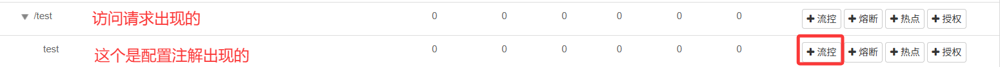

6. 在测试就可以出现自定义的流控信息

   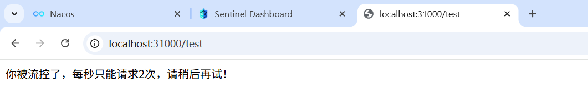

##### 9.5.2 通过并发线程数进行流控

假设并发线程数为1，只有等待这次请求响应了，才可以再次发送新的请求，否者其他线程或者请求就被流控了

1. 控制层添加一个新的接口方法，来处理

2. 添加@SentinelResource注解手动添加流控信息

   ```java
       @RequestMapping("/threadTest")
       @SentinelResource(value = "threadTest", blockHandler = "threadTestHandler")
       public String threadTest(long num) throws InterruptedException {
           Thread.sleep(num);
           return "访问成功！";
       }
       
           // 正确的 blockHandler 方法
       //1.一定要public
       // 2.返回值需要和原方法一致
       // 3.参数也需要和原方法一样，可以在参数中添加一个BlockException参数，可以区分什么规则的处理方法
       public String threadTestHandler(long num,BlockException ex) {
           ex.printStackTrace();
           return "你被流控了，请稍后再试！";
       }
   ```

3. 在指定的资源中添加流控规则，并发线程数=1

4. 测试，通过两个浏览器，模拟两个线程，如果浏览器1没有返回的话，浏览器2是否可以返回

   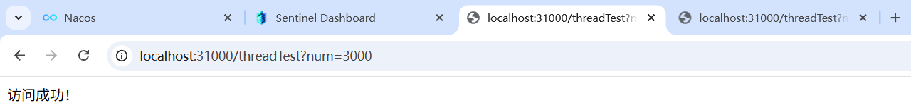

   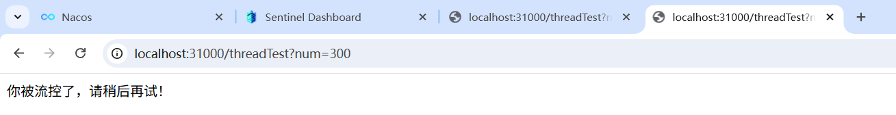


##### 9.5.3 流控高级设置介绍 --- 了解

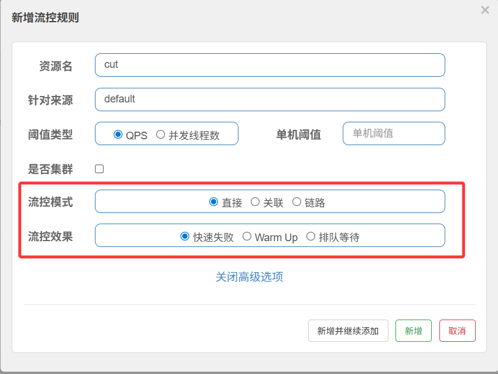

- 流控模式
  - 直接：默认值，访问的资源和控制的资源是同一个
  - 关联：访问的资源，关联一个其他资源，那么这个资源达到阈值，也会触发流控
  - 链路：类似于链表有一个链路头，他对整个链路头的地址进行流控
- 流控效果：
  - 快速失败：默认值，只要达到阈值，直接失败（显示流控的信息）
  - warm up：预热的意思，可以设置一个预热时间，让流量缓慢进来，不会流量突然激增，导致服务器不可用的问题
  - 排队等待：可以设置一个时间，只要达到阈值，让其等待一段时间再处理


#### 9.6 熔断降级使用

除了流量控制以外，对于服务调用中不稳定的资源进行熔断降级，也是保障程序高可用的措施，sentinel就可以将这些不稳定的服务，进行熔断降级，来切断调用关系，从而避免整个系统的崩溃，通尝是在服务消费者配置

> 比如：order服务（消费者）---stock服务


##### 9.6.1 慢调用比例 --- 难点

需要设置允许慢调用的最大RT（最大响应时间），请求的响应时间大于该值表示慢调用，当统计时长请求数量小于设置最小请求数，并且慢调用比例大于设置比例阈值，则接下来，该服务触发熔断（相当于暂停服务多少秒（由熔断时长控制）），而且熔断时期结束后，会进入半开状态，如果下一次请求依然是慢调用，直接再次熔断

1. 控制层添加两个方法

   ```java
   @RequestMapping("/slowTest")
       @SentinelResource(value = "slowTest", blockHandler = "slowHandler")
       public String slowTest(long num) throws InterruptedException {
           Thread.sleep(num);//一会我会设置最大RT为2s
           return "访问成功！";
       }
   
       public String slowHandler(long num, BlockException ex) {
           ex.printStackTrace();
           return "你被熔断了";
       }
   ```

2. sentinel控制台，找到对应的资源，添加熔断规则

3. 设置熔断规则

   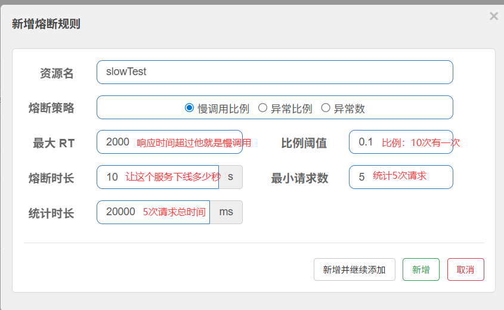

4. 测试：发送了5次请求（1次慢调用，4次正常）第六次触发熔断

   - 如果熔断结束，第七次还是慢调用，第八次再次触发熔断

   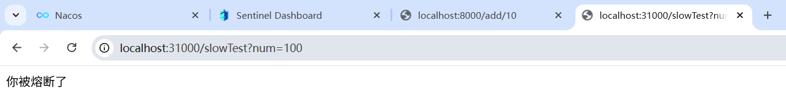


+ 异常比例和异常数的熔断策略，都是类似的，自行尝试


##### 9.6.2 OpenFeign如何结合sentinel去使用

OpenFeign可以进行远程调用，但是如果调用的服务出现问题，会导致程序出错，但是如果添加了sentinel，就可以在OpenFeign调用的基础上，来控制哪些出现按异常的服务进行熔断，可以返回用户可控的回调信息

1. order服务（消费者）添加sentinel依赖

   ```xml
   <dependency>
               <groupId>com.alibaba.cloud</groupId>
               <artifactId>spring-cloud-starter-alibaba-sentinel</artifactId>
           </dependency>
   ```

2. order服务添加一个取消订单的接口，stock服务，添加一个容易出错的后端接口

   ```java
   //order
   @RequestMapping("/cancel/{n}")
       public String cancel(@PathVariable("n") Integer n) {
           System.out.println("取消订单");
           String result = stock.add(n);
           return "我要取消订单，库存服务" + result;
       }
       
   //stock服务
   @RequestMapping("/addStock/{n}")
       public String add(@PathVariable("n") Integer n) {
           System.out.println("添加库存");
           //故意让其出错
           int i = 10 / n;
           return "添加库存" + port;
       }
   ```
   
3. order服务，对于Feign接口也新增了一个接口方法，同时添加了fallback实现，服务出现问题，可以返回自定义的实现类

   ```java
   //接口
   //fallback表示远程调用服务出现问题了，直接通过这个类帮你回调返回
   @FeignClient(name = "stock-service",fallback = StockFeignSeviceImpl.class)
   public interface StockFeignService {
       @RequestMapping("/cut")
       String cut();
   
       @RequestMapping("/addStock/{n}")
       public String add(@PathVariable("n") Integer n);
   
   }
   
   //实现类
   @Component
   public class StockFeignSeviceImpl implements StockFeignService {
       @Override
       public String cut() {
           return "减少库存出现问题了";
       }
   
       @Override
       public String add(Integer n) {
           return "添加库存出现问题了";
       }
   }
   ```

4. order服务，修改配置文件，开启熔断

   ```yml
   feign:
     sentinel:
       #开启sentinel熔断，fallback才会生效
       enabled: true
   ```

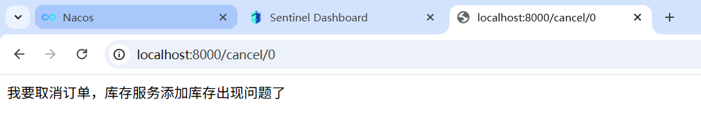


### 10.Gateway组件 --- 重点

#### 10.1为什么需要网关

随着搭建的微服务组件越来越多，每个服务都是独立部署的，都会分配一个独立的域名（ip+端口）这样前端客户端带啊就很难维护，服务越多，域名也就越多，而且前后端分离的项目，还需要涉及到跨域问题，每个域名都需要跨域，所以网关的出现是为了给整个微服务架构提供了统一的入口，由网关来负责去调配其他服务，这样前端也只需要网关来跨域即可


#### 10.2 什么是Gateway

spring cloud gateway是spring官网推出的第二代网关组件，初代是Zuul，相比早期的Zuul提供了更优秀的功能，它提供了一套简单高效的API路由管理方式，并且是基于Filter的方式提供网关的基本功能，比如：动态路由，路劲重写，安全，监控，限流

- Filter(过滤器)：可以实现拦截请求，和修改请求，进行二次处理
- Route(路由)：网关配置的基本组件，一个route主要包含id，URI，一组断言和一组过滤器，如果断言是真，过滤器如果也通过，则路由匹配，目标URI就可以正常访问
- Predicate(断言)：这是java8的predicate，可以用于匹配http请求的任意内容，比如：path：请求时间，host，header，cookie


#### 10.3 Gateway服务搭建

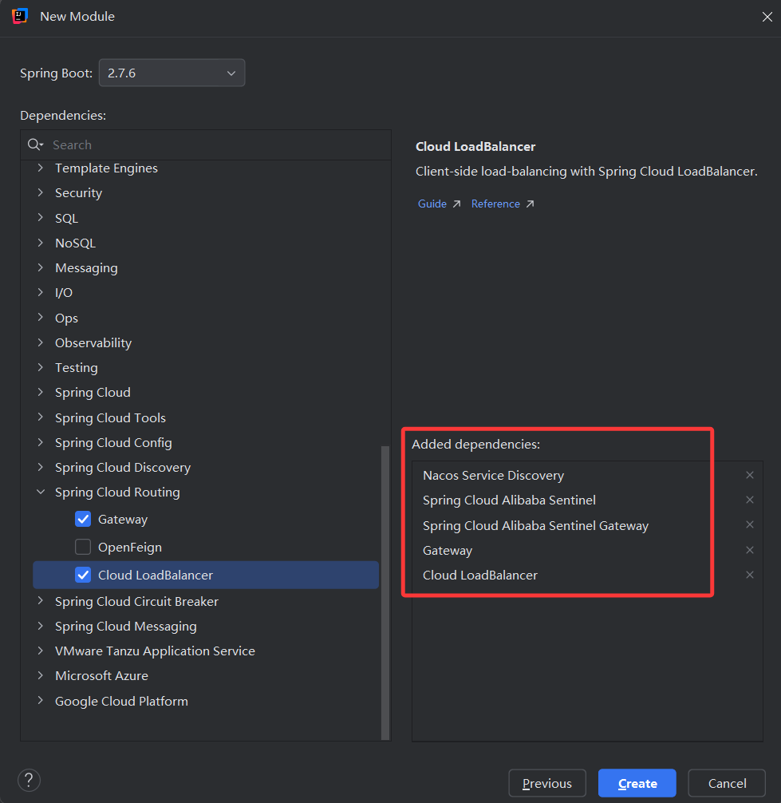

- 配置文件，后面又更好的方式

```yml
server:
  port: 40000

spring:
  application:
    name: gateway
  cloud:
    nacos:
      discovery:
        server-addr: localhost:8848
        username: nacos
        password: nacos
    gateway: ##gateway配置
      routes: ##路由规则，
        - id: test_route #路由唯一标识，
          uri: http://localhost:8000 #需要转发的地址
          predicates: #断言规则（一组断言）
            #表示如果发送请求包含了/abcd，就会转发到上面的URI地址
            #访问的请求，http://localhost:40000/abcd/add
            #路由到的请求，http://localhost:8000/abcd/add
            - Path=/abcd/**
          filters:
            #去掉前缀后：http://localhost:8000/add
            - StripPrefix= 1 #如果断言匹配了，去掉一级前缀
```

测试：http://localhost:40000/abcd/add/10可以访问订单服务

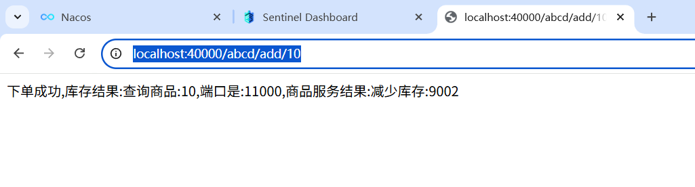

#### 10.4 gateway路由配置方式

- 编写网址来定义路由

  ```yml
  spring:
    application:
      name: gateway
    cloud:
      nacos:
        discovery:
          server-addr: localhost:8848
          username: nacos
          password: nacos
  #################################################
      gateway: ##gateway配置
        routes: ##路由规则，
          - id: test_route #路由唯一标识，
            uri: http://localhost:8000 #需要转发的地址
            predicates: #断言规则（一组断言）
              #表示如果发送请求包含了/abcd，就会转发到上面的URI地址
              #访问的请求，http://localhost:40000/abcd/add
              #路由到的请求，http://localhost:8000/abcd/add
              - Path=/abcd/**
            filters:
              #去掉前缀后：http://localhost:8000/add
              - StripPrefix= 1 #如果断言匹配了，去掉一级前缀
  ```

  

- 通过loadbalance加上服务名，进行调用

  ```yml
  spring:
    application:
      name: gateway
    cloud:
      nacos:
        discovery:
          server-addr: localhost:8848
          username: nacos
          password: nacos
  ###################################################
      gateway: ##gateway配置
        routes: ##路由规则，
          - id: order_route
            #通过loadbalance负载均衡方式转发到服务中，需要导入loalbalance依赖
            uri: lb://order-service
            predicates:
              - Path=/order/**
            filters:
              - StripPrefix= 1
  ```

  

- 通过gateway自动配置来实现路由

  ```yml
  spring:
    application:
      name: gateway
    cloud:
      nacos:
        discovery:
          server-addr: localhost:8848
          username: nacos
          password: nacos
  ########################################################       
      gateway: ##gateway配置
        discovery:
            locator:
              #是否自动识别nacos服务名，下面的routes就无需配置了
              #自动通过服务名发送请求自动调用对应服务，而且还会自动去除以及前缀
              #localhost:40000/order-service/add/10
              #localhost:40000/goods-service/goods/10
              #localhost:40000/stock-service/cut
              enabled: true
  ```

  

#### 10.5 断言Predicate

断言对象就是类似于if判断，当请求匹配Gateway的时候，会使用断言对请求中的内容进行匹配，如果匹配上则路由转发，否则404，断言对象主要分两种

- 内置的断言工厂：Path，Cookie，Header，Host，Method .... 每种都差不多，只不过规则不同

  ```yml
  # 时间前中后
  - After=2017-01-20T17:42:47.789-07:00[America/Denver]
  - Before=2017-01-20T17:42:47.789-07:00[America/Denver]
  - Between=2017-01-20T17:42:47.789-07:00[America/Denver], 2017-01-
  21T17:42:47.789-07:00[America/Denver]
  # Cookie(key,value(支持正则))
  - Cookie=chocolate, ch.p
  #请求头 (key,value(支持正则))
  - Header=X-Request-Id, \d+
  #主机名 (通配符.地址,可以写多个地址)
  - Host=**.somehost.org,**.anotherhost.org
  #请求方式 (编写多个请求参数)
  - Method=GET,POST
  #请求地址 比如:/red/1 /blue/green
  - Path=/red/{segment},/blue/{segment}
  #远程调用的地址
  - RemoteAddr=192.168.1.1
  #请求参数查询
  #如果请求参数包含green才会匹配
  - Query=green
  #如果请求参数包含red参数 值等于gree.才会匹配
  - Query=red, gree.
  ```

- 自定义断言：内置断言工厂，可以满足80%-90%需求，如果满足不了，可以自定义配置 --- 了解


##### 10.5.1 自定义断言的实现  ---- 了解

- 必须是spring容器中的bean
- 自定义类名后缀添加RoutePredicateFactory（类名前缀就是断言名称）
- 继承抽象类AbstractRoutePredicateFactory
- 编写一个静态内部类（用于属性，来接受配置文件中的信息）
- 再去结合shortcutFieldOrder进行属性绑定
- 最后通过apply()进行逻辑判断，返回true匹配成功，返回false匹配失败

```java
//application.yml -CheckName
@Component
public class CheckNameRoutePredicateFactory
        extends AbstractRoutePredicateFactory<CheckNameRoutePredicateFactory.Config> {
    public CheckNameRoutePredicateFactory() {
        super(CheckNameRoutePredicateFactory.Config.class);
    }

    @Override
    public List<String> shortcutFieldOrder() {
        return Arrays.asList("??");
    }

    public Predicate<ServerWebExchange> apply(CheckNameRoutePredicateFactory.Config config) {
        return s -> {
            return true;
        };
    }
    
    @Validated
    public static class Config {
    }
}
```

配置文件：

```yml
server:
  port: 40000

spring:
  application:
    name: gateway
  cloud:
    nacos:
      discovery:
        server-addr: localhost:8848
        username: nacos
        password: nacos
    gateway: ##gateway配置
      discovery:
          locator:
            #是否自动识别nacos服务名，下面的routes就无需配置了
            #自动通过服务名发送请求自动调用对应服务，而且还会自动去除以及前缀
            #localhost:40000/order-service/add/10
            #localhost:40000/goods-service/goods/10
            #localhost:40000/stock-service/cut
            enabled: false #关闭自动识别

      routes: ##路由规则，
        - id: order_route2
          #通过loadbalance负载均衡方式转发到服务中，需要导入loalbalance依赖
          uri: lb://order-service
          predicates:
            - Path=/order2/** #路径断言
            - CheckName=name #自定义断言，内部判断请求是否传递了name参数
          filters:
            - StripPrefix= 1
```

测试：http://localhost:40000/order2/add/10?name=zhangsan


#### 10.6 Gateway实现跨域

跨域问题在微服务架构肯定也是要实现的，之前我们通过注解和配置类，等方法来实现，但是随着服务越来越多，每个服务都需要这么处理才能跨域，所以Gateway针对于，提供一条统一的方案，无论多少个服务，开发者只需要针对于Gateway跨域即可

- 第一种实现：通过application.yml

  ```yml
  
  spring:
    cloud:
      gateway: ##gateway配置
        globalcors:
          cors-configurations:
            '[/**]': #允许跨域的访问的资源地址
              allowedOrigins: '*' #允许跨域来源
              allowedHeaders: '*'
              allowedMethods: #允许请求方式
                - GET
                - POST
                - PUT
                - DELETE
  ```

- 第二种方式：通过配置类（参考之前跨域过滤器）

  ```java
  import org.springframework.context.annotation.Bean;
  import org.springframework.context.annotation.Configuration;
  import org.springframework.web.cors.CorsConfiguration;
  import org.springframework.web.cors.reactive.CorsWebFilter;
  import org.springframework.web.cors.reactive.UrlBasedCorsConfigurationSource;
  
  //通过过滤器实现跨域
  @Configuration
  public class CrosFilterConfig {
      @Bean
      CorsWebFilter getCorsFilter() {
          UrlBasedCorsConfigurationSource source = new UrlBasedCorsConfigurationSource();
          //参数1：允许跨域地址，参数2：跨域配置信息对象
          source.registerCorsConfiguration("/**", getCorsConfig());
          CorsWebFilter filter = new CorsWebFilter(source);
          return filter;
      }
  
      //不需要加注解，因为不需要给其他人用
      CorsConfiguration getCorsConfig() {
          CorsConfiguration config = new CorsConfiguration();
          //设置允许的跨域域名
          config.addAllowedOriginPattern("*");
          //是否允许cookie
          config.setAllowCredentials(true);
          //设置允许的请求方式
          config.addAllowedMethod("*");
          //设置允许的头部信息
          config.addAllowedHeader("*");
          //设置每次跨域的允许时间，默认long类型，单位是秒
          config.setMaxAge(3600L);
          return config;
      }
  }
  
  ```

  

#### 10.7 Gateway整合sentinel流控或熔断

- 添加依赖

  ```xml
  <!--sentinel依赖-->
  <dependency>
  <groupId>com.alibaba.cloud</groupId>
  <artifactId>spring-cloud-starter-alibaba-sentinel</artifactId>
  </dependency>
  <!--sentinel整合gateway依赖-->
  <dependency>
  <groupId>com.alibaba.cloud</groupId>
  <artifactId>spring-cloud-alibaba-sentinel-gateway</artifactId>
  </dependency>
  ```

- 添加配置

  ```yml
  spring:
    cloud:
      sentinel:
        transport:
          dashboard: localhost:30000
  ```

- 打开sentinel控制台，界面会有些差异

  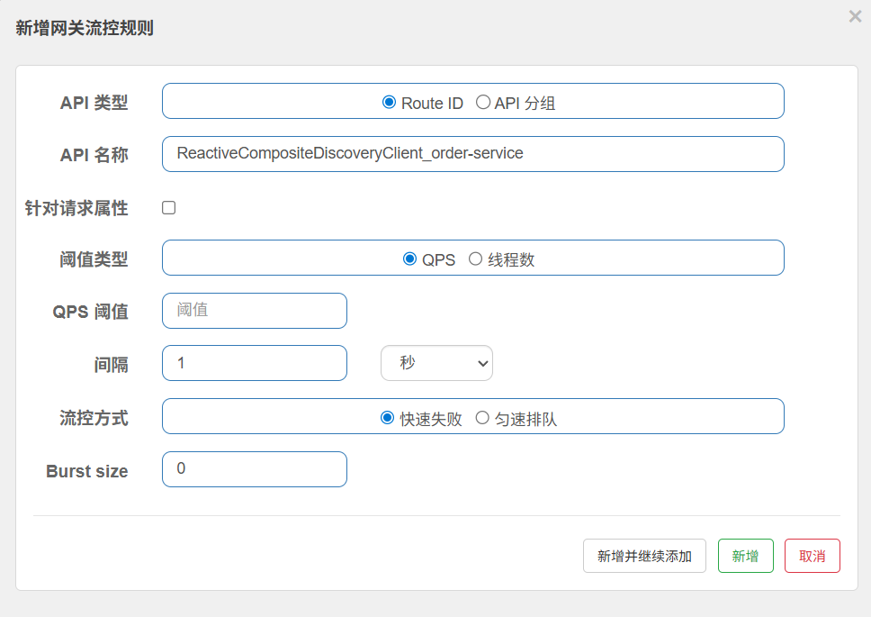

  - Route ID：配置文件中，配置路由到唯一标识
  - API分组：是API管理里面的数据（根据发送的请求，来匹配精确的值和前缀的值）比如：匹配/order/*，表示发送/order前缀的请求才可以匹配

- 添加流控规则

  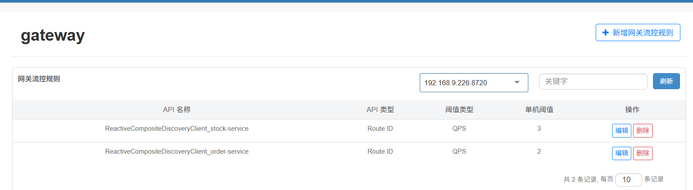

- 出现了流控

  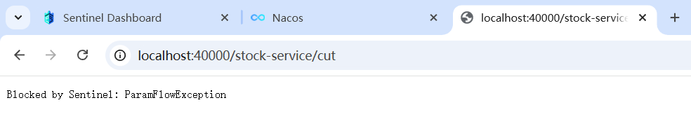

  - 如果想自定义返回流控信息，修改配置文件

    ```yml
    spring:
      cloud:
        sentinel:
          scg:
            fallback:
              mode: 'response'
              response-body: '{"code":500,"msg":"服务异常"}'
              response-status: 200
    ```

    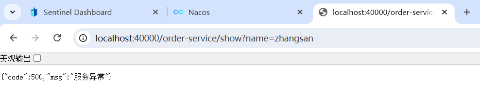
