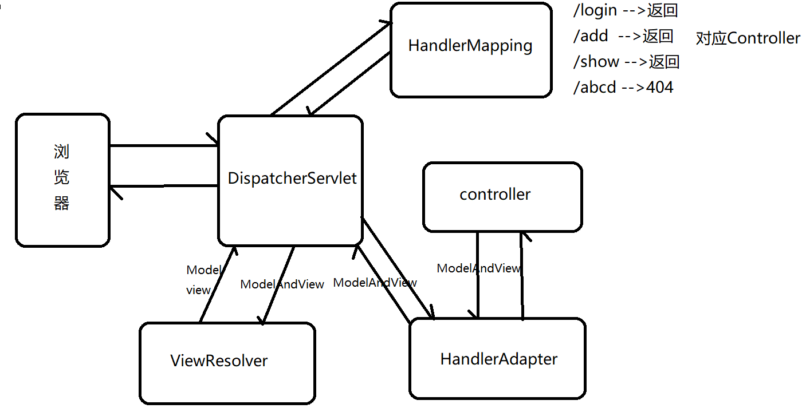
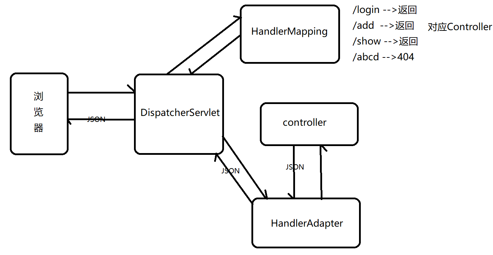

## springmvc

[TOC]

### 1.为什么需要使用框架

框架类似于java代码的模板，它帮我们完成了一部分（项目中通用规范，接口，通用功能），开发者只需要根据需求来完成另外一部分，就可以很快速完成一个符合开发标准的项目，提高了开发效率


### 2.什么是springmvc ---面试题

注：想精通框架，初学者可以根据我们课程快速入门，以后在项目中去深造几年，再回来研究官网

springmvc是spring框架的一个子项目，底层实现是DispatcherServlet实现的，主要是用于实现项目中的controller层功能（替换之前的servlet）相比servlet效率和性能会更好，并且springmvc和spring是可以无缝链接的 ---加上自己的理解


在Spring MVC 中,可以配置多个DispatcherServlet


### 3.springmvc搭建步骤 ---通用

+ 创建maven项目

+ 导入相关的依赖（jar）==pom.xml==

  ```xml
  <project xmlns="http://maven.apache.org/POM/4.0.0" xmlns:xsi="http://www.w3.org/2001/XMLSchema-instance"
    xsi:schemaLocation="http://maven.apache.org/POM/4.0.0 http://maven.apache.org/maven-v4_0_0.xsd">
    <modelVersion>4.0.0</modelVersion>
    <groupId>com.sc</groupId>
    <artifactId>springmvc</artifactId>
    <packaging>war</packaging>
    <version>1.0-SNAPSHOT</version>
    <name>springmvc Maven Webapp</name>
    <url>http://maven.apache.org</url>
      <!--通用的属性-->
      <properties>
          <project.build.sourceEncoding>UTF-8</project.build.sourceEncoding>
          <maven.compiler.source>1.8</maven.compiler.source>
          <maven.compiler.target>1.8</maven.compiler.target>
          <spring.version>5.0.3.RELEASE</spring.version>
          <jstl.version>1.2</jstl.version>
          <servlet-api.version>4.0.0</servlet-api.version>
          <jsp-api.version>2.3.1</jsp-api.version>
          <jackson.version>2.9.0</jackson.version>
          <commons-fileupload.version>1.3.3</commons-fileupload.version>
      </properties>
      <dependencies>
          <dependency>
              <groupId>junit</groupId>
              <artifactId>junit</artifactId>
              <version>4.11</version>
              <scope>test</scope>
          </dependency>
          <!--springmvc -->
          <dependency>
              <groupId>org.springframework</groupId>
              <artifactId>spring-webmvc</artifactId>
              <version>${spring.version}</version>
          </dependency>
          <!-- JSP相关 -->
          <dependency>
              <groupId>javax.servlet</groupId>
              <artifactId>jstl</artifactId>
              <version>${jstl.version}</version>
          </dependency>
          <dependency>
              <groupId>javax.servlet</groupId>
              <artifactId>javax.servlet-api</artifactId>
              <version>${servlet-api.version}</version>
              <scope>provided</scope>
          </dependency>
          <dependency>
              <groupId>javax.servlet.jsp</groupId>
              <artifactId>javax.servlet.jsp-api</artifactId>
              <version>${jsp-api.version}</version>
              <scope>provided</scope>
          </dependency>
          <!--json处理-->
          <!--实际上为三个包，但是导入databind会自动导入其他两个包-->
          <dependency>
              <groupId>com.fasterxml.jackson.core</groupId>
              <artifactId>jackson-databind</artifactId>
              <version>${jackson.version}</version>
          </dependency>
          <!--文件上传组件-->
          <dependency>
              <groupId>commons-fileupload</groupId>
              <artifactId>commons-fileupload</artifactId>
              <version>${commons-fileupload.version}</version>
          </dependency>
          <!--自己添加自己版本的mysql驱动包-->
          <dependency>
              <groupId>mysql</groupId>
              <artifactId>mysql-connector-java</artifactId>
              <version>8.0.28</version>
          </dependency>
      </dependencies>
    <build>
      <finalName>springmvc</finalName>
    </build>
  </project>
  ```

  

+ 配置springmvc配置文件（在resources包中创建，每个框架都会有一个或者多个配置文件）

  ```xml
  <?xml version="1.0" encoding="UTF-8"?>
  <beans xmlns="http://www.springframework.org/schema/beans"
         xmlns:xsi="http://www.w3.org/2001/XMLSchema-instance"
         xmlns:content="http://www.springframework.org/schema/context"
         xmlns:mvc="http://www.springframework.org/schema/mvc"
         xsi:schemaLocation="http://www.springframework.org/schema/beans http://www.springframework.org/schema/beans/spring-beans.xsd http://www.springframework.org/schema/context http://www.springframework.org/schema/context/spring-context.xsd http://www.springframework.org/schema/mvc http://www.springframework.org/schema/mvc/spring-mvc.xsd">
      <!--1.配置IOC扫描包:springmvc会扫描这个包，
      为了找到这个包里面是否有类加了@Controller注解，如果发现有了就会创建这个类的对象
      -->
      <content:component-scan base-package="com.sc.controller"/>
      <!--2.开启注解驱动:目的是让@RequestMapping生效-->
      <mvc:annotation-driven/>
      <!--3.放行静态资源：springmvc默认拦截静态资源(img,css,js文件)-->
      <mvc:default-servlet-handler/>
      
      <!--4.配置上传组件对象,bean标签就是配置文件用于定义对象-->
      <!--<bean id="u" class="com.sc.pojo.MyUser"></bean-->
      <bean id="multipartResolver" class="org.springframework.web.multipart.commons.CommonsMultipartResolver">
          <!--设置文件编码格式-->
          <property name="defaultEncoding" value="utf-8"/>
          <!--设置最大上传大小，单位是字节 10M=1024*1024*10-->
          <property name="maxUploadSize" value="10240000"/>
      </bean>
      <!--5.视图解析器对象 id是可选的，默认是类名首字母小写-->
      <bean id="viewResolver" class="org.springframework.web.servlet.view.InternalResourceViewResolver">
          <!--添加前缀-->
          <property name="prefix" value="/WEB-INF/jsp"/>
          <!--添加后缀-->
          <property name="suffix" value=".jsp"/>
      </bean>
  </beans>
  ```

  

+ 配置==web.xml==（配置核心Servlet）
  
  + 编码过滤器（springmvc提供的，但是需要配置）
  
  + 配置核心servlet
  
    ```xml
    <!DOCTYPE web-app PUBLIC
            "-//Sun Microsystems, Inc.//DTD Web Application 2.3//EN"
            "http://java.sun.com/dtd/web-app_2_3.dtd" >
    
    <web-app>
        <display-name>Archetype Created Web Application</display-name>
        <!--springmvc提供的编码过滤器-->
        <filter>
            <filter-name>encodingFilter</filter-name>
            <filter-class>org.springframework.web.filter.CharacterEncodingFilter</filter-class>
            <!--初始化参数编写修改的编码方式-->
            <init-param>
                <param-name>encoding</param-name>
                <param-value>utf-8</param-value>
            </init-param>
        </filter>
        <filter-mapping>
            <filter-name>encodingFilter</filter-name>
            <url-pattern>/*</url-pattern>
        </filter-mapping>
        <!--配置核心servlet：springmvc最重要的组件
            1.是sprngmvc入口，表示前端所有请求都需要经过这个servlet才能达到springmvc
            2.负责读取springmvc配置文件，而且默认会读取WEB-INF下的名称(servlet名称-servlet.xml)
                但是我们可以修改配置(初始化参数)让它读取自定义配置文件
            3.配置服务器启动，去加载，实例化，初始化
        -->
        <servlet>
            <servlet-name>springmvc</servlet-name>
            <servlet-class>org.springframework.web.servlet.DispatcherServlet</servlet-class>
            <init-param>
                <param-name>contextConfigLocation</param-name>
                <param-value>classpath*:springmvc.xml</param-value>
            </init-param>
            <load-on-startup>1</load-on-startup>
        </servlet>
    
        <servlet-mapping>
            <servlet-name>springmvc</servlet-name>
            <!--/*表示所有请求(*.png, *.js, *.css, *.jsp, /login,/reg)-->
            <!--/表示所有没有后缀的请求，是为了排除前端jsp,css,png资源进入-->
            <url-pattern>/</url-pattern>
        </servlet-mapping>
    </web-app>
    ```
  
+ 随便写个类，随便写个方法，通过几个简单的注解，就可以接受请求，处理请求，


### 4.springmvc输入和输出

+ 前后端不分离：前端和后端代码，在同一个项目（没有产生跨域问题）

  + 输入：前端提交数据给后端

    + 如果提交的是一个简单的类型（String ，int，...）,用形参接收

      springmvc方法上的形参和类型和提交的name值一致

    ```java
    //1.如果提交是一个简单的类型(String,int,...)
    //springmvc方法上的形参和类型和提交name值一致
    
    //2，如果提交的多个数据，比如:复选框
    //springmvc方法名的形参添加对应类型数组，形参名和提交name值一致
    
    //3.如果提交的是多种数据，比如:注册,新增
    //springmvc方法上的形参，添加对象参数 保证属性名和提交name值是一致
    
    //4.如果提交的数据是日期类型
    //直接在pojo实体类日期类型的上面，添加@DatetimeFormat(pattern="yyyy-mm-dd")制定好日期格式，否者出现400错误
    ```

  + 输出：后端怎么将数据返回给前端

    ```java
    //1.存储request作用域 ---最常用
    //a.形参定义HttpServletRequest
    //b.通过ModelAndView里面存储
    //c.形参定义Model类型
    //d.形参定义Map类型  ---比较推荐
    //e.形参定义ModelMap类型
    
    //2.存储session作用域 ---比较常用
    //形参定义HttpSession类型，springmvc帮你自动赋值
    
    //3.如果想使用response，application...
    //形参定义HttpServletResponse,
    //HttpServletRequest通过请求获取ServletContext,springmvc会帮你自动赋值
    
    ```

    

+ 前后端分离：前端和后端代码，分别在不同的项目实现（由于项目不同（可能会，协议或者ip或者端口号不同，所以会产生跨域问题））


### 5.springmvc文件上传

> 文件上传流程：前端通过文件组件（type="file"）提交文件到后端，后端负责接收文件，进行存储到服务器本地或者第三方服务器（云服务器），无论是什么方式都会有一个文件地址，这样数据库只需要存储文件地址即可，以后前端想用这个文件，只需要通过数据库查询出来地址，就可以直接访问

+ 实现文件上传的前提：

  + 前端前提：

    + 请求方式：只能是post

    + 数据提交方式设置成附件提交

      ```java
      //默认值:按照字符串提交
      	<form action="/add" method="post" onsubmit="return check()" enctype="application/x-www-form-urlencoded">
          </form>
      
          //按照附件提交
          <form action="/add" method="post" onsubmit="return check()" enctype="multipart/form-data">/
          </form>
      ```

      

  + 后端前提：

    + springmvc配置文件，需要配置上传组件对象（允许接受文件）

      ```xml
      <!--4.配置上传组件对象,bean标签就是配置文件用于定义对象-->
          <bean id="multipartResolver" class="org.springframework.web.multipart.commons.CommonsMultipartResolver">
              <!--设置文件编码格式-->
              <property name="defaultEncoding" value="utf-8"/>
              <!--设置最大上传大小，单位是字节 10M=1024*1024*10-->
              <property name="maxUploadSize" value="10240000"/>
          </bean>
      ```

      

    + 方法的形参添加MultipartFile类型接收文件，并且形参名必须要和提交的name值一致
    
      bug：前端上传组件name值，叫什么都行，唯独不能设置成对象的属性名，否者400错误


#### 5.1 上传文件工具类

```java
package com.sc.util;

//上传文件的工具类
//只适用于SSM项目，不适用于springboot项目（原因在于他是内置tomcat服务器）
public class Uploads {
    //上传文件通用方法
    public static String upload(HttpServletRequest req, MultipartFile pic) {
        //上传的位置(本地服务器文件，云服务器)
        //1.获取服务器真实地址+upload包
        String path = req.getServletContext().getRealPath("/upload/");
        //判断文件是否存在
        File file = new File(path);
        if (!file.exists()) {//文件不存在就创建
            file.mkdirs();
        }
        System.out.println("文件上传路径：" + path);
        //D:\cod\sc251001\springmvc\target\springmvc\+(upload\)
        //2.上传的文件名，不能当成保存的文件名(否则同包下重名会替换)
        //xx.png --->随机.png
        //2.1 先获取提交的文件名
        String filename = pic.getOriginalFilename();
        //如果不传头像，filename就是空字符串，
        //此时调用lastIndexOf()就会返回-1，再调用substring就会报字符串下标越界异常
        if ("".equals(filename)) {
            return null;
        }
        //2.2 获取后缀名
        String suffix = filename.substring(filename.lastIndexOf("."));
        //2.3 文件名，如何随即处理(随机数，时间毫秒数 ，UUID(生成32位永不重复的字符串))
        String name = UUID.randomUUID().toString();
        String newName = name + suffix;//UUID+后缀名
        //3.生成好上传新的文件对象
        File f = new File(path + newName);
        //4.上传文件
        try {
            pic.transferTo(f);
        } catch (IOException e) {
            throw new RuntimeException(e);
        }
        return newName;
    }
}
```


### 6.springmvc视图解析器(viewREsolver)

如果把页面放入WEB-INF里面，这样通过服务器转发时，就会有很多相同的地址，这就属于冗余代码，视图解析器就可以帮我们把这些相同的地址，设置成统一的前缀和后缀，这样我们编写返回视图时就无需编写了

```java
@RequestMapping("/toLogin")
public String toLogin(){
    return "/WEB-INF/jsp/login/login.jsp";
    //共同前缀:/WEB-INF/jsp
    //共同后缀:.jsp
    //如果配置了视图解析器，可以写成
    //return "/login/login"
}
```

+ 配置文件：springmvc配置文件，添加一个配置，添加视图解析器对象(bean标签)

  ```xml
  <!--5.视图解析器对象 id是可选的，默认是类名首字母小写-->
      <bean id="viewResolver" class="org.springframework.web.servlet.view.InternalResourceViewResolver">
          <!--添加前缀-->
          <property name="prefix" value="/WEB-INF/jsp"/>
          <!--添加后缀-->
          <property name="suffix" value=".jsp"/>
      </bean>
  ```

> 注：这样的话视图解析器就会把==返回的所有地址==动态的添加前缀和后缀
>
> 解决方案：在返回的时候，`return "forward:/地址"`或者`return "redirect:/地址"`，只要添加了这两个单词就不会走视图解析器，也就不会添加前缀后缀


### 7.springmvc拦截器（Intercptor） ---面试题

springmvc拦截器，==依赖于springmvc框架==（没有导入框架的依赖无法使用），功能类似于Servlet中的过滤器，底层实现是通过反射实例化，再通过==动态代理==模式，来实现功能的扩展，属于面向切面编程(AOP)重要的应用，拦截器主要用于==拦截进入控制层的请求==，并且每次请求处理过程中会==拦截多次==，同时还可以灵活==控制拦截规则==（什么能拦，什么不能拦）


#### 7.1 使用方式

+ 实现HandlerInterceptor接口

+ 实现三个方法

  ```java
  package com.sc.interceptor;
  
  public class MyInterceptor implements HandlerInterceptor {
      @Override
      //会在控制层方法执行前调用
      //return true 表示允许访问控制层方法
      //return false 表示不可以访问方法
      public boolean preHandle(HttpServletRequest request, HttpServletResponse response, Object handler) throws Exception {
          MyUser u = (MyUser) request.getSession().getAttribute("myUser");
          if (u == null) {
              response.sendRedirect("/user/toLogin");
              return false;
          }
          return true;
      }
  
      @Override
      //在控制层方法执行途中,视图解析器之前调用
      //一般用于通过他可以请求作用域的数据，做二次修改
      public void postHandle(HttpServletRequest request, HttpServletResponse response, Object handler, ModelAndView modelAndView) throws Exception {
      }
  
      @Override
      //在控制层方法执行并且返回之后，视图解析器也结束了才调用，一般是通过它做一些清理工作
      public void afterCompletion(HttpServletRequest request, HttpServletResponse response, Object handler, Exception ex) throws Exception {
      }
  }
  ```

  

+ 配置springmvc配置文件中，添加拦截器组件

  ```xml
  <!--6.拦截器-->
      <mvc:interceptors>
          <!--配置一个拦截器-->
          <mvc:interceptor>
              <!--配置拦截规则(那些拦截，那些不拦截)-->
              <!--配置拦截规则:/**表示所有进入控制层的请求都会拦截-->
              <mvc:mapping path="/**"/>
              <!--配置不拦截规则 -->
              <mvc:exclude-mapping path="/user/login"/>
              <mvc:exclude-mapping path="/user/toLogin"/>
              <!--/to** 表示所有/to前缀的请求，都放行/toFrame,/toTop,/toLeft-->
              <!--<mvc:exclude-mapping path="/user/to**"/>-->
              <!--通过反射创建拦截器实现类对象-->
              <bean class="com.sc.interceptor.MyInterceptor"></bean>
          </mvc:interceptor>
      </mvc:interceptors>
  ```

> 自己的理解：
>
> 发送请求，现根据拦截规则判断，是否要进入拦截器
>
> + 如果不需要拦截的，直接进入controller层执行方法
> + 如果需要拦截的，要进入到拦截器中判断，执行prehandle()，根据返回值判断是否能进入controller层
>   + 如果返回true，能进入controller层
>   + 如果返回false，跳转到登陆页面（或者其他页面）


#### 7.2 拦截器（Interceptor）和过滤器（Filter）的区别 ---面试题

- Filter：过滤器依赖于Servlet，过滤器几乎可以拦截所有资源（包括：访问控制层的请求，前端页面，图片，css，js...）

  过滤器在一次请求之内，只能拦截一次，过滤器也不能设置拦截规则

- Interceptor：拦截器依赖于web层框架（springmvc框架），拦截器只能拦截进入控制层的请求，

  拦截器在一次请求之内拦截多次（请求处理之前，请求处理途中，请求处理完成），

  还可以设置拦截规则（哪些放行，哪些拦截）


### 8.分页原理（了解mybatis分页插件的原理）

分页是一种将所有数据分段展示给用户的技术，用户每次看到的不是全部数据，而是其中的一部分数据，用户就可以通过页码数，来切换可见内容，类似于阅读书籍


#### 8.1 实现分页的步骤（原生）

+ 会编写分页的sql语句

  ```sql
  -- 按照每页5条数据，查看第一页数据
  select * from 表名 limit 0,5
  select * from 表名 limit 10,5
  select * from 表名 limit 15,5
  
  -- 每页条数(pageSize=5),当前页数(pageNum=1)
  select * from 表 limit (pageNum-1)*pageSize,pageSize;
  ```

+ 封装分页信息（前端分页需要的所有信息）/分页插件PageHelper

  ```
  总条数
  每页条数
  当前页数
  总页数
  每页数据集合
  ...
  扩展:添加导航页码数
  扩展:导航页码数起始
  扩展:导航页码数结束
  ```

  ```java
  package com.sc.util;
  
  import java.util.List;
  
  //封装分页信息对象
  //<S>自定义泛型:声明对象时，可以在泛型中指定类型
  //指定好类型，那么S就是什么类型，PageInfo<String>
  //<S> ==> <String>
  public class PageInfo<S> {
      private int pageNum;//当前页数
      private int pageSize;//每页条数
      private int total;//总条数
      private int pages;//总页数
      private List<S> list;//每页数据集合
  
      public PageInfo() {
      }
  
      public PageInfo(int pageNum, int pageSize) {
          this.pageNum = pageNum;
          this.pageSize = pageSize;
      }
  
      public int getPageNum() {
          return pageNum;
      }
  
      public void setPageNum(int pageNum) {
          this.pageNum = pageNum;
      }
  
      public int getPageSize() {
          return pageSize;
      }
  
      public void setPageSize(int pageSize) {
          this.pageSize = pageSize;
  
      }
  
      public int getTotal() {
          return total;
      }
  
      public void setTotal(int total) {
          this.total = total;
          //计算总页数
          pages = (int) Math.ceil(total * 1.0 / pageSize);
      }
  
      public int getPages() {
          return pages;
      }
  
      public void setPages(int pages) {
          this.pages = pages;
      }
  
      public List<S> getList() {
          return list;
      }
  
      public void setList(List<S> list) {
          this.list = list;
      }
  }
  ```

  

+ 控制层只需要将分页信息存储起来，给前端使用

  ```java
  @RequestMapping("/show")
      public String show(Map m, Integer pageNum, Integer pageSize, HttpSession session) {
          if (pageNum == null) pageNum = 1;
          //如果传递了pageSize,需要session保存
          //如果没有传递，从session获取，如果session也没有才设置默认值
          if (pageSize != null) {
              session.setAttribute("pageSize", pageSize);
          } else {
              pageSize = (Integer) session.getAttribute("pageSize");
              if (pageSize == null) pageSize = 3;
          }
          PageInfo<MyUser> p = ms.show(pageNum, pageSize);
          m.put("p", p);
          //转发跳转到users.jsp
          return "/user/list";
      }
  ```

+ service业务层

  ```java
  public PageInfo<MyUser> show(Integer pageNum, Integer pageSize) {
          //分页业务逻辑
          PageInfo<MyUser> p = new PageInfo<>(pageNum, pageSize);
          p.setTotal(myUserDao.selectTotal());//调用dao层
          //在设置总条数的时候就能求出总页数，所以可以在工具类中直接设置
          p.setList(myUserDao.show(pageNum, pageSize));//调用dao层
          return p;
      }
  ```

+ dao层

  ```java
  @Override
      public List<MyUser> show(Integer pageNum, Integer pageSize) {
          String sql = "select * from myuser limit ?,?";
          ResultSet rs = Jdbcs.select(sql, (pageNum - 1) * pageSize, pageSize);
          List<MyUser> list = new ArrayList<>();
          try {
              while (rs.next()) {
                  list.add(check(rs));
              }
          } catch (SQLException e) {
              throw new RuntimeException(e.getMessage());
          } finally {
              Jdbcs.close(rs, Jdbcs.pstmt, Jdbcs.conn);
          }
          return list;
      }
  
      @Override
      public int selectTotal() {
          String sql = "select count(1) from myuser";
          ResultSet rs = Jdbcs.select(sql);
          int count = 0;
          try {
              while (rs.next()) {
                  count = rs.getInt(1);
              }
          } catch (SQLException e) {
              throw new RuntimeException(e.getMessage());
          } finally {
              Jdbcs.close(rs, Jdbcs.pstmt, Jdbcs.conn);
          }
          return count;
      }
  ```

+ 前端

  ```java
  <%@ page contentType="text/html;charset=UTF-8" language="java" isELIgnored="false" %>
  <%@ taglib prefix="c" uri="http://java.sun.com/jsp/jstl/core" %>
  <html>
  <head>
      <title>Title</title>
      <link rel="stylesheet" type="text/css" href="${pageContext.request.contextPath}/css/common.css">
      <style>
          /*表示定义虚拟类样式，表示类名:"head"*/
          .head {
              width: 60px;
              height: 60px;
              border-radius: 50%;
          }
  
          .pageNum {
              display: inline-block;
              width: 30px;
              height: 30px;
              border-radius: 10%;
              text-align: center;
              line-height: 30px;
              color: black;
              text-decoration: none;
              background-color: #F5F6FA;
              font-size: 12px;
          }
  
          .bg {
              background-color: #4E6EF2;
              color: white;
          }
      </style>
  </head>
  <body>
  <h2>欢迎:${myUser.username}</h2>
  <%--用户管理的展示页面--%>
  <button onclick="add()">新增</button>
  <form action="/user/deleteAll" method="post" onsubmit="return check()">
      <button>批量删除</button>
      <table style="" border="1" cellspacing="0" cellpadding="10">
          <tr>
              <th>全选<input id="all" type="checkbox" onclick="selectAll()"/></th>
              <th>编号</th>
              <th>账号</th>
              <th>密码</th>
              <th>性别</th>
              <th>状态</th>
              <th>生日</th>
              <th>头像</th>
              <th>操作</th>
          </tr>
          <c:forEach var="u" items="${p.list}">
              <tr>
                  <td><input type="checkbox" name="cb" value="${u.id}"/></td>
                  <td>${u.id}</td>
                  <td>${u.username}</td>
                  <td>${u.password}</td>
                  <td>${u.sex=="1"?"男":"女"}</td>
                      <%--<td>${u.status=="1"?"启用":u.status=="2"?"禁用":"冻结"}</td> 只适合简单的判断--%>
                  <td>
                      <c:if test="${u.status=='1'}"><span style="color: green">启用</span></c:if>
                      <c:if test="${u.status=='2'}"><span style="color: red">禁用</span></c:if>
                      <c:if test="${u.status=='3'}"><span style="color: yellow">冻结</span></c:if>
                  </td>
                  <td>${u.birthday}</td>
                      <%--针对于头像文件和上传的文件在同一目录下，才可以--%>
                      <%--            --%>
                      <%--针对于默认头像和上传文件不在同一个目录--%>
                  <c:if test="${empty u.headPic}">
                      <td></td>
                  </c:if>
                  <c:if test="${not empty u.headPic}">
                      <td></td>
                  </c:if>
                  <td>
                      <a href="/user/selectById?id=${u.id}">修改</a>
                      <a href="/user/delete?id=${u.id}" onclick="return confirm('确认删除？')">删除</a>
                  </td>
              </tr>
          </c:forEach>
      </table>
  </form>
  [当前页数:${p.pageNum}/总页数:${p.pages}/总条数:${p.total}]
  <c:if test="${p.pageNum>1}">
      <a href="/user/show?pageNum=1">首页</a>
      <a href="/user/show?pageNum=${p.pageNum-1}">上一页</a>
  </c:if>
  <c:if test="${p.pageNum==1}">
      首页 上一页
  </c:if>
  <c:forEach var="i" begin="1" end="${p.pages}" step="1">
      <%--<c:if test="${i!=p.pageNum}">
          <a class="pageNum" href="/user/show?pageNum=${i}" onclick="change(this)">${i}</a>
      </c:if>
      <c:if test="${i==p.pageNum}">
          <a class="pageNum bg" href="/user/show?pageNum=${i}">${i}</a>
      </c:if>--%>
      <a class="${i==p.pageNum?'pageNum bg':'pageNum'}" href="/user/show?pageNum=${i}" onclick="change(this)">${i}</a>
  </c:forEach>
  <c:if test="${p.pageNum<p.pages}">
      <a href="/user/show?pageNum=${p.pageNum+1}">下一页</a>
      <a href="/user/show?pageNum=${p.pages}">尾页</a>
  </c:if>
  <c:if test="${p.pageNum==p.pages}">
      下一页 尾页
  </c:if>
  <select onchange="pagesize(this)">
      <c:forEach var="i" begin="3" end="21" step="3">
          <option ${i==p.pageSize?'selected':''}>${i}</option>
      </c:forEach>
  </select>
  <input type="text" id="page" size="1">页
  <button onclick="cli()">跳转</button>
  </body>
  </html>
  <script>
      //前往新增页面
      function add() {
          location.href = ("/user/toAdd");
      }
  
      //实现全选逻辑，1.获取全选复选框对象和其他复选框对象
      //2.只要保证其他复选框对象选中状态(checked)和全选复选框选种状态一致即可
      function selectAll() {
          var all = document.getElementById("all");
          var cbs = document.getElementsByName("cb");
          for (var i = 0; i < cbs.length; i++) {
              cbs[i].checked = all.checked;
          }
      }
  	//确实删除
      function check() {
          var cbs = document.getElementsByName("cb");
          for (var i = 0; i < cbs.length; i++) {
              if (cbs[i].checked) {//有一次进入if,有人选中
                  return confirm("确定删除吗？");
              }
          }
          return false;//其他情况不能提交
      }
  	//页面跳转
      function cli() {
          var page = document.getElementById("page").value;
          if (isNaN(page) || page < 1) {//is not a number 判断是否是非数字（字母）
              page = 1;
          } else if (page >${p.pages}) {
              page =${p.pages};
          }
          location.href = "/user/show?pageNum=" + page;
      }
  	//
      function pagesize(s) {
          var pagesize = s.value;
          location.href = "/user/show?pageSize=" + pagesize;
      }
  </script>
  ```

  

### 9.springmvc工作流程 ---面试题

+ 前后端不分离

  


+ 前后端分离

  


#### 9.1 工作流程中的几个重要组件

+ DispatchServlet：核心控制器，最核心的组件，所有请求必须经过它才能到达springmvc（springmvc入口），也负责读取配置文件
+ HandlerMapping：请求映射器，保存了一些曾经写的`@RequestMapping("/地址")`，在这个注解上配置过的请求地址，用于和用户发送的请求进行配置，匹配不到直接404，匹配到了就可以正常执行
+ HandlerAdapter：代理对象，用于动态调用哪个Controller中的哪个Method方法
+ Controller：控制层，进入方法之后，开始处理请求，返回ModelAndView(正常返回的String，最终会自动封装到ModelAndView对象中)
+ ViewResolver：视图解析器，用于解析ModelAndView，为了解析成哪个Model（数据）对应哪个View（页面）


#### 9.2 工作流程 ---面试题

+ 前后端不分离

  > 1.请求先到核心控制器DispatchServlet
  >
  > 2.核心控制器会去查询请求映射器HandlerMapping是否存在对应的请求，如果不存在返回404，如果存在就返回对应的Controller
  >
  > 3.核心控制器通过代理对象HandlerAdapter动态调用Controller中对应的Method方法
  >
  > 4.控制层Controller开始处理请求，返回ModelAndView
  >
  > 5.核心控制器调用视图解析器ViewResovler对其进行解析，解析成Model对象和View对象
  >
  > 6.View负责将Model实现到对应的客户端

+ 前后端分离

  > 1.请求先到核心控制器DispatchServlet
  >
  > 2.核心控制器会去查询请求映射器HandlerMapping是否存在对应的请求，如果不存在返回404，如果存在就返回对应的Controller
  >
  > 3.核心控制器通过代理对象HandlerAdapter动态调用Controller中对应的Method方法
  >
  > 4.控制层Controller开始处理请求，返回JSON
  >
  > 5.核心控制器直接将JSON返回给浏览器


### 10. springmvc常用注解 ---高频面试题

+ @Controller：标注控制层的注解，表示这个类作为springmvc控制器

+ @RestController：相当于@Controller+@ResponseBody组合注解，

+ RequestMapping：配置请求地址

+ GetMapping、@PostMappig、@PutMapping、@DeleteMapping：用于配置不同请求地址的请求

+ RequestBody：将前端提交的json对象，转换成java中的对象

+ ResponseBody：将返回对象转换成json返回给前端

+ DateTimeFormat()：前端提交了日期，需要指定日期格式

+ JsonFormat：返回json数据时，如果有日期，也要指定格式

+ @RequestParam()：可以将提交的数据绑定到方法的形参上，

  ```java
  public Result checkUsername(@RequestParam("username") String a){}
  ```

+ param：用于mapper接口的方法参数有多个或者参数名和表的字段名不同时，取别名

+ @ControllerAdvice：用于实现springmvc全局异常处理，可以自定义异常处理机制，让出现的错误进入到指定的页面展示


### 11.Ajax

Ajax：async（异步的）javascript and XML，是一种不需要加载整个浏览器的情况下，就可以和服务器进行数据交互的一种技术（就是局部刷新技术），它可以使用网页异步的加载数据，不会影响用户的操作体验，可以提高浏览器的性能

==注：Ajax必须依赖于js才可以发送异步请求==


#### 11.1 Ajax异步请求优势

+ 提高页面性能：Ajax可以让页面并行加载数据或者样式，提高页面加载速度
+ 减少带宽消耗：由于只更新了局部内容，不是更新整个浏览器，Ajax就可以减少数据传输量，从而降低了带宽消耗
+ 提高用户体验：使用Ajax请求实现不用刷新浏览器，不影响用户正在操作的功能
+ 实现实时更新：Ajax可以更加方便的使用js和服务器进行数据交互，就可以实现动态的内容加载，比如：实时搜索，视频评论，验证用户名是否存在...
+ 应用场景：Ajax请求目前经常用于前后端分离的模式


#### 11.2 Ajax异步请求实现方式

+ 原生js实现Ajax：步骤特别繁琐，不推荐使用

  ```java
  function ajax1(input) {
          var username = input.value;
          var div = document.getElementById("error");
          //1.创建Ajax对象
          var ajax = new XMLHttpRequest();
          //2.绑定监听(定义成功和失败的回调函数)
          //匿名函数:function(){}后期优化成箭头函数 ()=>{}
          ajax.onreadystatechange = () => {
              //readyState表示监听连接状态，status是请求状态吗
              //连接状态:0未连接 1打开连接 2发送请求 3交互 4完成交互,可以接受响应
              if (ajax.readyState == 4 && ajax.status == 200) {
                  //表示请求处理完毕后没有出现错误，才会执行的(回调函数)
                  //5.接受响应的数据
                  var value = ajax.responseText;//后端返回的数据
                  div.innerHTML = value;
                  alert(1);
              }
          }
          //3.绑定请求地址
          //参数1:表示请求方式，参数2:表示请求地址，参数3:是否是异步请求 true:异步，false:同步
          ajax.open("get", "/checkUsername?username=" + username, true);
          //4.发送请求
          ajax.send();
          alert(2);
      }
  ```

  

+ 使用jQuery封装好的方法实现Ajax：jQuery就是通过js做了一个封装，使用它发送请求可以简化很多繁琐的步骤，但是数据传输的格式，默认不是json格式，不适合前后端分离的项目

  ```java
  //前提先导入
  <script src="https://code.jquery.com/jquery-3.0.0.min.js"></script>
  
  //通过jQuery实现ajax,比如:$等价于jQuery
      //$.ajax()
      //$.post() $.get() ===>jQuery.get()
      function ajax2(input) {
          var username = input.value;
          //如果传递了两个参数(参数1:表示地址 参数2:回调函数)
          //如果传递了三个参数(参数1:表示地址 参数2:传递的数据 参数3:回调函数)
          $.post("/checkUsername?username=" + username, (res) => {
              //回调函数参数res:就是后端返回的数据
              $("#error").html(res);
          });
      }
  ```

  

+ 使用axios来实现Ajax：axios相当于对jQuery做了封装，默认数据交互格式就是json，非常适合做前后端分离的项目 ---目前主流的方式

  ```java
  //前提先导入
  <script src="https://cdn.jsdelivr.net/npm/axios/dist/axios.min.js"></script>
  
  //通过axios实现ajax:默认数据交互格式就是json
      function ajax3(input) {
          //重点学习
          //url:表示请求地址,data表示传递的json数据(可选)
          // then(回调函数) res:data:是后端返回的结果
          // axios.post(url,data).then(res=>{});
          alert("ajax3")
          axios.post("/checkUsername?username=" + input.value).then(res => {
              var result = res.data;//后端返回的json对象
              console.log(result.msg)
              console.log(result.code)
              $("#error").html(result.msg);
              checkUsername = result.code;
          })
      }
  ```


#### 11.3 Ajax的优缺点

Ajax：属于局部刷新技术，可以不用刷新整个浏览器就可以和服务器进行交互，提高用户体验

优点：

- 减少带宽，提高访问速度，可以不刷新浏览器和服务器交互，比较适合实现视频点赞，评论，检测用户可用......场景
- 缺点：
  - 依赖于js，对于前进和后退，不太适合，
  - 对客户端依赖比较大，因为需要编写大量的js代码


### 12.JSON --- 重点

JSON是一种轻量级的数据交互格式,其本质就是一个字符串,是通过字符串按照某种格式去组装数据，形成一种新格式，具有良好得扩展性，体积小，传输效率高，易于解析，所以目前被各大系统广泛使用，特别是前后端分离的项目  通过JSON做数据传递是首选


#### 12.1 JSON语法

JSON就是基于map集合，==键值对==得方式来组装数据

- key和value之间，通过 ==:== 隔开,多组key和value通过==,==隔开

- key: 一般编写字符串，可以使用双引号，也可以不使用双引号

- value: 一般可以写任意类型（数字 字符串 对象 集合 数组 null 都可以）

  - value存储整型:    key:10 （10可以加引号也可以不加）
  - value存储字符串: key: "张三"（必须加引号）
  - value存储布尔: key: true（不用加引号）
  - value存储对象: key: { k1:v1,k2:v2 }
  - value存储集合或数组: key: [ {一个对象},{ .. },{ .. } ]
  - value存储空值:  key: null（不用加引号）

- 案例

  ```js
  <script>
      //通过json表示用户对象(id,name,sex)
      var user={
          id: 10,
          name: "张三",
          sex: "1"
      }
      //使用 通过对象名(user).属性名(key) 获取属性值(value)
      console.log(user.id,user.name,user.sex)
  
      //通过json表示班级对象(id,classname,用户集合)
      var classes={
          id: 1,
          classname: "sc251001",
          users: [
              {id:10,name:"金山",sex:"1"},
              {id:20,name:"陈勇",sex:"1"},
              {id:30,name:"天龙",sex:"1"},
              {id:40,name:"吴昊",sex:"1"}
          ]
      }
      console.log("班级id:"+classes.id);
      console.log("班级姓名:"+classes.classname);
      console.log("学生集合:")
      for(var i=0;i<classes.users.length;i++){
          var u=classes.users[i];
          console.log(u.id,u.name,u.sex);
      }
  </script>
  ```


#### 12.2 Json的优缺点

json：是轻量级的数据交互格式，底层是一个简单的字符串按照指定的格式，进行数据的封装，可以方便做数据传输

- 优点：扩展性好，传输效率比较高，轻量级，易于解析
- 缺点：
  - json虽然可以传递任意类型，但是一些特殊类型，还是有局限的，比如传递对象，日期都需要转换成字符串传递
  - 同时json不能编写注释


### 13.前后端分离流程  --- 后期重点

- 前端:  
  - 所有功能都是通过axios发送异步请求
  - 数据传递自动封装成json数据传递给后端
  - .... 走后端
  - 前端axios有一个回调函数，里面==res.data==就是后端返回得结果
- 后端:
  - 控制层方法，参数如果要接收json数据需要添加@RequestBody
  - 通过它调用业务层-->调用dao层-->结果
  - 处理之后，结果通过一个统一得结果类型(Result)，返回json给前端，所以一般添加@ResponseBody
    - 优化: 由于所有请求都需要添加@ResponseBody所以 把@Controller替换@RestController注解(等价于@Controller+@ResponseBody组合)
- 跨域: @CorssOrigin  ....
