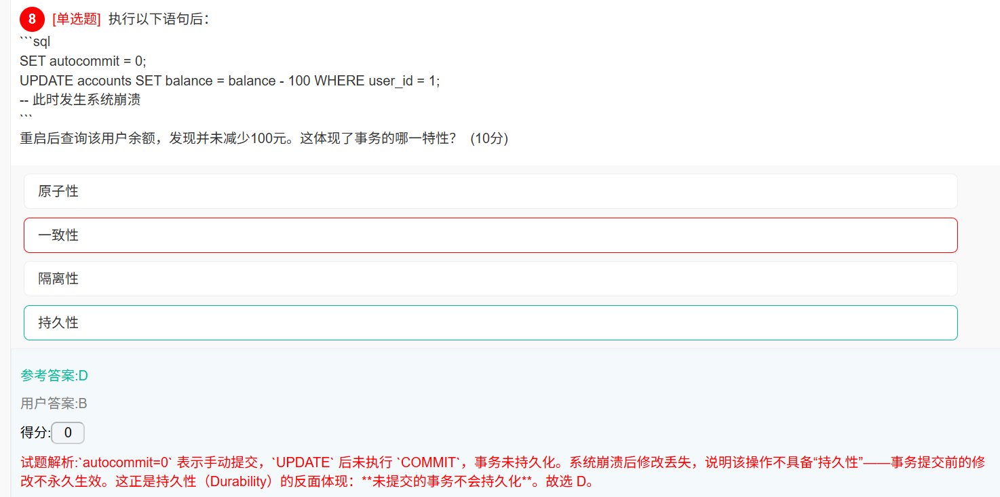
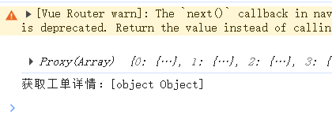

## 单词

【腾讯文档】sc202510java单词
https://docs.qq.com/doc/DUUpqSHVDbXpnT3RX


## ==查缺补漏==

### linux上部署项目需要做什么

### websocket通信

### mvvm思想

### java8和java17新特性？区别？

### 算法？

### 数据结构

### 接口的幂等性

### linux命令

### spring管理bean生命周期

### GC算法

- 标记算法
- 回收算法

### 创建对象有几种方式 

- new 对象
- 克隆
- 反序列化

- 反射，怎么创建对象

### hashcode和equals的区别

### TCP和UDP的区别

### list和set和map集合的区别?

- ArrayList和Vector和LinkedList的区别
- Hashset和HashMap底层原理
- HashMap和Hashtable底层原理


### mysql

- mysql的好处
- SQL语言分类
  - DDL语言
    - create ， alter ，drop ，truncate
  - DML语言
    - insert，delete，update，select
  - DCL语言
  - TCL语言
- 三范式
  - 一范式：设计成数据库表的字段具有原子性，也就是不能在分割（类似于对象，集合，数组的就不行）
  - 二范式：前提是满足第一范式，又要求数据必须依赖于主键，强调必须添加主键（唯一非空），防止数据冗余
  - 三范式：前提是满足第二范式，要求不能其他表的非主键列，也就是不能有重复列，强调必须添加主外键关联，
- 约束
  - 非空约束，默认约束，唯一约束，检查行约束，主键约束，外键约束
- 视图是什么，优缺点，
- 内连接，左外连接
- 事务，事务的四大特性
- 索引
- mysql行专列，列转行
- mysql怎么定义一个唯一索引? 怎么查看是否走了唯一索引?

### http请求的流程？在地址栏输入网址敲回车键, 发生了什么？

### 同步请求和异步请求区别

### 死锁

- 死锁的四个必要条件
- 解决死锁的方法

## ==第一部分：Java基础==

### 1.	Java 程序运行完整流程总结

总：编译 → 类加载(加载→验证→准备→解析→初始化) → 对象实例化 → 对象使用 → 垃圾回收

**第一阶段：编译期**

- `.java` 源文件 → **编译** → `.class` 字节码文件

**第二阶段：运行期 - 类加载过程（按需加载）**

​			**加载 → 验证 → 准备 → 解析 → 初始化**

> 1. 加载：找到.class文件，读入字节码，创建Class对象
> 2. 验证：检查字节码安全性、格式正确性（防恶意代码）
> 3. 准备：为==静态变量==分配内存并设置==默认值==（0, false, null）
> 4. 解析：将符号引用转换为直接引用
> 5. 初始化：执行==静态变量赋值==和==静态代码块==
>

**第三阶段：程序执行**

> 1. **主类初始化**：包含main方法的类首先完成类加载和初始化
>
> 2. **执行main方法**：程序入口点开始执行
>
> 3. **按需加载其他类**：
>
>    其他类在**第一次被主动使用时**才初始化,只需要关心初始化开始的时机
>
>    如果是两个毫不相关的类，那么他们的生命周期是独立的
>
>    如果两个类有继承关系、静态依赖关系或者编译期常量等问题
>
>    继承关系，使用子类之前，父类要先初始化，
>    
>    静态依赖的话就是，A类初始化触发了B类的初始化
> 


### 2.	基本数据类型：==小写==

Java 中 Unicode 转义序列的语法是 ==\uXXXX==，其中 ==XXXX== 必须是 **4 位十六进制数**（范围从 ==0000== 到 ==FFFF==），比如'\u1234'正确,如果是'\u12345'就是错误的


### 3.	引用类型

#### 对象

可以new的


#### String 

不是基本类型，**底层是通过final修饰的char[]**，不适合大量修改

常用方法：

length()：字符长度

charAt(int index)：返回指定索引处的字符

equals：比较内容

contains(charSequence s)：检查是否包含指定字符序列

indexOf(String str)：返回指定子字符串第一次出现的索引

subString(int beginindex，int endindex)：返回从beginindex到endindex-1的子字符串

split(String regex)：根据分割字符串；

replace(char oldchar，char newchar)：替换字符

trim()；去除字符串两端的空白字符

toLowerCase()和toUpperCase()：小写和大写


#### 数组

- 声明数组

  ```java
  //一维数组
  int[] nums;
  int nums[];
  //二维数组
  int[][] nums;
  int[] nums[];
  ```

- 给数组分配空间

- 给数组赋值

  ```java
  int[] nums={1,3,5};
  nums=new int[5];
  
  nums[0]=?;
  int[] nums=new int[]{1,3,5};
  int[][] nums=new int[3][];
  
  //错误的情况
  int[][] nums=new int[][3];
  ```

  

#### 集合 

类似于动态数组


### 4.	循环

 注意不要把 new放进循环里


#### 4.1	增强for循环

- 实际操作的是`数据副本`，不会改变原数组，所以要`操作原数组`是要选用普通for循环

- 增强 for 循环的遍历变量是数组元素的`临时副本`，而非数组本身的引用，所以要在数组中`完成添加功能`时，应该`用普通for循环`

  > 拓展：
  >
  > + for循环的参数类型可以是基本类型（int）


#### 4.2	排序

1. 冒泡排序：每轮将最大数放到后面

   时间复杂度：O(n²)

```java
//冒泡:把最大的数移动到最后
/*
* 外层循环是控制比的轮数
* 内层是两两比较，每次将最大的放到最后*/
//外层控制比较轮数
for(int i=0;i<数组.length-1;i++){
	//内层控制每轮比较次数
	for(int j=0;j<数组.length-1-i;j++){
		if(nums[j]>nums[j+1]){
			//两值互换
			nums[j]=nums[j]^nums[j+1];
			nums[j+1]=nums[j]^nums[j+1];
			nums[j]=nums[j]^nums[j+1];
		}
	}
}
```

2. #### 选择排序：每轮把最小数放到前面

   时间复杂度：O(n²)

```java
//选择排序
/*
* 原理:将数组分为已排序和未排序，每次在未排序里面找到最小的，放入已排序的
* 其实，简单点就是，每次把最小的放到前面

* 外层循环：从第一个元素遍历到倒数第二个元素（i = 0 到 arr.length-2）,最后一个不用排
* 内层循环：在i+1到最后一个元素中寻找最小元素的索引
* 交换：将找到的最小元素与第i个元素交换
* */
public static void selSort(int[] arr) {
    // 遍历所有元素（最后一个元素无需比较）
        for (int i = 0; i < arr.length - 1; i++) {
            // 假设当前i位置是最小值
            int minIndex = i;
            
            // 在未排序部分查找更小的元素
            for (int j = i + 1; j < arr.length; j++) {
                if (arr[j] < arr[minIndex]) {
                    minIndex = j;  // 更新最小元素索引
                }
            }
            
            // 将最小元素交换到当前位置
            if (minIndex != i) {
                int temp = arr[i];
                arr[i] = arr[minIndex];
                arr[minIndex] = temp;
            }
        }
}
```

3. #### ==插入排序==：

   时间复杂度：平均O(nlogn)，最坏O(n²)

   原理：将数组分为已排序和未排序，默认第一个为已排序，从第二个元素开始，插入到已排序的部分，

   外层循环：控制要插入的元素，第二个到最后一个
   
   内层循环：把要插入的元素，与前面已排序的比较，如果比前面数大就不用变，如果比前面的数小，就把前面的数往后移一位

```java
//插入排序，
public static void inSort(int[] arr) {
    for (int i = 1; i < arr.length; i++) {//从第二个开始
        int temp = arr[i];//先将要插入的提出来，存在一个临时空间
        for (int j = i - 1; j >= 0; j--) {
            if (arr[j] > temp) {
                arr[j + 1] = arr[j];//将比temp大时，往后移一位
                arr[j] = temp;
            }
        }
    }
}
```

4. #### ==快速排序==：找基准数，递归

   原理：

   + 简单版本：用于先给基准数找到它正确的下标，再通过递归把基准数前面的元素，和后面的元素，分别继续排序

   + 完成版本：假设拿第一个元素作为基准数，同时设置两个变量(一个保存最小下标begin，一个保存最大下标end)

     先从end下标的元素和基准数比较

     如果比基准数大那么end下标-1，继续往前面比较

     如果比基准数小，那么就需要将end下标的元素赋值给begin下标的元素

     再从begin下标的元素和基准数比较，如果比基准数小，那么begin下标+1,继续往后面比较，如果比基准数大，那么需要将begin下标的值，赋值给end下标的值

     最后经过很多次比较，发现begin和end下标相等了，那么这个下标就是基准数的下标，把基准数赋值给改下标

     然后针对于基准数前面的元素和后面的元素，在分别做递归，继续按照上面的方式来排序，就有顺序了

```java
//快速排序
//把策略走通
//整个数组，最左边的下标，最右的下标
public static void quSort(int[] arr, int begin, int end) {
    if (begin > end) {//判断是否参数是否正常
        return;
    }
    //先找基准数 ，第一个
    int temp = arr[begin];
    //等下要用下标循环遍历，会导致begin和end改变，先保证完整begin end给ij
    int i = begin;
    int j = end;
    while (i < j) {//保证i在j左边
        while (i < j && arr[j] >= tem) {//先找到一个比基准数小的数的下标
            j--;//如果右边的数大于基准数，不需要换位，只需j--
        }
        while (i < j && arr[i] <= tem) {//再找到一个比基准数大的数，的下标
            i++;//如果左边的书小于基准数，不需要换位，只需i++
        }
        if (i < j) {//两个数互换
            int temp = arr[i];
            arr[i] = arr[j];
            arr[j] = temp;
        }
    }
    //循环之后i==j时，换掉基准数
    arr[begin] = arr[i];
    arr[i] = temp;
    //开始递归，数组分半
    quSort(arr, begin, i - 1);
    quSort(arr, i + 1, end);
}
```


### 5.JVM、JRE、JDK

- JVM（**Java Virtual Machine**）：java虚拟机，作用：将字节码，然后解释/编译成当前操作系统能读懂的机器码并执行
  - 特点：“一次编写，到处运行” 的关键。不同操作系统（Windows, Linux, macOS）有各自对应的JVM实现，它们都能执行相同的字节码文件，从而实现了跨平台

- JRE（**Java Runtime Environment**） ： Java 程序的运行环境，包含JVM和java核心类库
- jdk（**Java Development Kit**）：	java开发工具包，包含jre和开发工具（编译器javac，等）

jdk包含jre，jre包含jvm


### 队列、栈

队列：先进先出

栈：先进后出


### 长度获取方式

| 类型          | 长度获取方式      | 说明                         |
| :------------ | :---------------- | :--------------------------- |
| **数组**      | `length` **属性** | 唯一广泛使用的 `length` 属性 |
| String        | `length()` 方法   | 实现 CharSequence 接口       |
| StringBuilder | `length()` 方法   | 实现 CharSequence 接口       |
| 集合类        | `size()` 方法     | List、Set、Map 等            |
| 文件          | `length()` 方法   | File 类                      |

数组在 Java 中是一种**特殊类型**，既不是基本类型也不是普通类


### 二分查找

前提：数组需要先排好序

```java
public int binarySearch(int[] arr, int target) { 
    if (arr == null || arr.length == 0) {
            return -1;
    }
    
    int left = 0;
    int right = arr.length - 1;
    
    while (left <= right) {
        int mid = left + (right - left) / 2;
        
        if (arr[mid] == target) {
            return mid;
        } else if (arr[mid] < target) {
            left = mid + 1;
        } else {
            right = mid - 1;
        }
    }
    
    return -1; // 未找到
}

递归
public class BinarySearch {
    
    public static int binarySearchRecursive(int[] arr, int target) {
        if (arr == null || arr.length == 0) {
            return -1;
        }
        return binarySearchRecursive(arr, target, 0, arr.length - 1);
    }
    
    private static int binarySearchRecursive(int[] arr, int target, int left, int right) {
        if (left > right) {
            return -1;
        }
        
        int mid = left + (right - left) / 2;
        
        if (arr[mid] == target) {
            return mid;
        } else if (arr[mid] < target) {
            return binarySearchRecursive(arr, target, mid + 1, right);
        } else {
            return binarySearchRecursive(arr, target, left, mid - 1);
        }
    }
}
```


### file类

#### 1. 创建file对象

```java
File f1 = new File("D:/test.txt");           // 文件
File f2 = new File("D:/myfolder");            // 目录
File f3 = new File("D:/", "test.txt");        // 父路径+子路径
```

#### 2.  常用方法

+ 获取信息

  ```java
  f.getName();      // 文件名
  f.getPath();      // 路径
  f.getAbsolutePath(); // 绝对路径
  f.length();       // 文件大小
  f.lastModified(); // 最后修改时间
  ```

+ 判断

  ```java
  f.exists();      // 是否存在
  f.isFile();      // 是否是文件
  f.isDirectory(); // 是否是目录
  f.isHidden();    // 是否隐藏
  ```

+ **获取目录内容（重点）**

  ```java
  String[] names = dir.list();           // 返回文件名数组
  File[] files = dir.listFiles();         // 返回File对象数组 ⭐最常用
  File[] roots = File.listRoots();        // 获取所有盘符
  ```

+ 创建/删除

  ```java
  f.createNewFile();    // 创建文件
  f.mkdir();            // 创建单级目录
  f.mkdirs();           // 创建多级目录
  f.delete();           // 删除文件/空目录
  ```

  

#### 遍历D盘所有目录

```java
public static void serchFiles(File file) {
	for (File d : file.listFiles()) {
		if (d.isDirectory()) {
			System.out.println("文件夹：" + d.getName());
            serchFiles(d);
		} else {
			System.out.println(d.getName());
		}
	}
 }
```


## ==第二部分：面向对象==

### 1.	类

类是对象的抽象，对象是类的实例化

一个文件中只能有一个public class

类由成员变量（属性）和成员方法（行为）组成

- **成员变量**

  - **实例变量**：`没有static`修饰，属于对象，每个对象有独立的副本，必须通过对象访问
  - **静态变量**：`有static `属于类本身，所有对象共有（共享同一副本），通过类名或变量名访问（`推荐用类名`）
  
- **成员方法**

  - 静态方法：不需要实例化就能使用的方法
  - 实例方法：
  
  

### 2.	继承

` 动态调用`：当一个`子类向上转型`为父类时：能调用哪些方法由`父类决定`（编译时检查），（如果父类方法被重写）`具体调用`哪个类的实现由实际对象类型决定（运行时绑定）


### 3.	抽象abstract

> 只是一个`一般类`
>
> 抽象类是`可能有抽象方法`
>
> 抽象类中`可以没有抽象方法`
>
> *“abstract方法必须在abstract类中” —— 这个说法是`错的`。
>
> **原因：**` 接口`（interface）中也可以有抽象方法，但接口本身不是抽象类。


### 4. 	接口

接口中的方法默认是public abstract的

 接口中的变量默认是public static final的，也就是常量，必须在生命是初始化

> - 在接口（interface）中，所有字段（成员变量）都`默认且隐式`地具有以下修饰符
>
> - 1. `public` - 接口的所有成员都是公开的
>
>   2. `static` - 接口中的字段属于接口本身，而不是实例对象
>
>   3. `final` - 接口中的字段是常量，一旦赋值就不能修改
>

接口可以有默认方法（default method）可以有方法体	比如：

```java
default void method(){
		System.out.println("	");
}
```

 接口可以有静态方法 	


### 5. 	重写

（换句话说，子类应该扩展父类的功能，而不是收缩父类的功能。）

#### 5.1 	子类重写父类的方法

1. `访问权限`，不能比父类的低 

2. `返回类型`，可以是父类返回类型的子类

3. `抛出异常类型`，不能比父类的宽泛


### 6. final关键字

- 修饰变量；变量一旦赋值后就不能被修改，类似常量
- 基础变量：值不能改变
- 引用变量：final修饰的引用类型变量不能改变引用（也就是不能改变变量指向的对象地址，但是对象中的属性可以修改）
- final修饰的成员变量不会自动赋值，必须手动初始化


### 7.单例模式

确保每个类只能有一个对象（懒汉式，饿汉式）


1. 初始化时机：

- **饿汉模式**：在类加载时就初始化

- **懒汉模式**：第一次使用时才初始化实例

- | 特性       | 饿汉模式               | 懒汉模式                  |
  | :--------- | :--------------------- | :------------------------ |
  | 初始化时机 | 类加载时               | 第一次调用getInstance()时 |
  | 线程安全   | 天生线程安全           | 需要额外同步处理          |
  | 资源使用   | 可能浪费内存           | 按需分配，节约资源        |
  | 性能       | 调用时直接返回，性能好 | 需要判断，性能稍差        |


- 饿汉式：对象无论是否使用 都先创建出来

  ```java
  public class Singleton{
      public static Singleton singleton=new Singleton();//一来就new
  	public static Singleton getInstance(){
  	    return singleton;
  	}
  }
  
  ```

- 懒汉式：可以让其有一个延迟加载的功能，对象不使用 不会创建,而是第一次使用对象 才去创建对象

  ```java
  public class Singletion{
      public static ConnectionDB con=null;//比较懒，没有赋值
  
  	public static synchronized ConnectionDB getCon(){//synchronized 保证多线程情况下，也成立
      	if(con==null) {//如果是null,创建一次
           	con = new ConnectionDB();
      	}
      	//代码能到这里，说明不是null
      	return con;
  	}	
  }
  
  ```

- 双重检查锁定（推荐）

  - 在双重检查锁定模式中，`singlon` 变量必须声明为 `volatile`，否则可能会发生指令重排序，导致其他线程获取到一个未完全初始化的实例（例如，对象已分配内存但构造函数尚未执行完毕）。Java 1.5 之后，`volatile` 可以保证可见性和禁止重排序。
  
  ```java
  public class Singleton {
      // 使用 volatile 防止指令重排序,必须使用volatile
      private static volatile Singleton singleton;
      
      // 使用静态对象作为锁
      private static final Object LOCK = new Object();
      
      private Singleton() {
          // 私有构造函数
      }
      
      public static Singleton getInstance() {
          // 第一次检查：避免不必要的同步
          if (singleton == null) {
              // 同步代码块
              synchronized (LOCK) {
                  // 第二次检查：防止重复创建
                  if (singleton == null) {
                      singleton = new Singleton();  // 注意：这里要赋值
                  }
              }
          }
          return singleton;  // 返回单例实例
      }
  }
  ```

+ 静态内部类版本（更推荐）

  ```java
  public class Singleton {
      private Singleton() {
      }
      
      //
      private static class SingletonHolder {
          private static final Singleton INSTANCE = new Singleton();
      }
      
      public static Singleton getInstance() {
          return SingletonHolder.INSTANCE;
      }
  }
  ```
  
  

### 8.Object类常用方法

属于java.lang包下的类   无需导入包即可使用 ，是 java中所有类的父类  ,本身还提供了很多公开的方法   所以任何类都有这些方法

- equals: 等价于 == 比较地址是否一致 ,如果重写了equals 根据重写的规则来  比如: String   Integer都重写了...
- toString: 默认打印对象的引用地址 可以将对象转换成字符串输出   如果重写了   打印对象就会返回你重写了toString的内容
- hashcode: 用户计算哈希码的 , 用于来表示对象基本特征 一般是由32位二进制数构成  所以结果是int类型
- getClass():  获取类对象   反射会用的非常多
- notify():   随机唤醒一个处于等待的线程
- notifyAll():   唤醒全部处于等待的线程
- wait():   让线程处于等待的   目的是为了让其他人来唤醒  否则自己无法执行
- finalize():  属于java 中gc垃圾回收机制的方法，java会自动调用 防止内存溢出 
- clone():  用于克隆对象


## ==第三部分：java高级编程==

### 1.	 集合：Collection和Map接口

#### 1.1 	Collection：单列数据 

子接口：List，Set，Queue

##### 	1.1.1	**List（有序，可重复）**继承Collection接口

常用实现类：

- **ArrayList**：适合随机访问

  Array List的底层数组是`Object[]` 只能存储对象引用，不能存储基本数据类型

  扩容机制：默认初始容量是10，扩容为1.5倍

- Vector(线程安全)：

  性能慢

  扩容机制：默认初始容量为10，扩容2倍

  

- LinkedList（双向链表）适合频繁增删

  但也是==单列==数据，

  无需扩容

##### 	1.1.2	**set（无序，不可重复）**继承Collection接口

常用实现类：

- HashSet （无序）基于hash表，底层是HashMap
  - `HashSet`允许存储一个`null`元素 
  - `去重并保持插入顺序（使用LinkedHashSet）`
- TreeSet（自动排序）
- LinkedHashSet（保持插入顺序的HashSet）


#### 1.2	Map（键值对）

键不能重复，值可以重复

1.2.1 常见实现类：

1. HashMap 最常用

   -  HashMap的底层实现，面试题3.28加强记忆
   -  LinkedHashMap 不再按插入顺序排序，而是按**访问顺序**排序
   -  允许有一个null键和null值
   - `Map<String, String> map = new HashMap<>(16, 0.75f);` 这是合法的 HashMap 构造方式
     - 初始容量：16
     - 负载因子：0.75
2. TreeMap（按键排序）
3. HashTable（线程安全）
   - hashTable 线程安全，不能有null键和null值，初始容量是11，负载因子是0.75，扩容2倍+1
4. ConcurrentHashMap线程安全
4. LinkedHashMap（保持插入顺序）


在Java中，**`Map`接口只有`containsKey(Object key)`和`containsValue(Object value)`方法，没有`contains(Object o)`方法**。


#### 如何遍历Map

+ map.entrySet()

```JAVA
// forEach + Lambda（Java 8+）
map.forEach((key, value) -> 
    System.out.println(key + ": " + value));

// for-each 循环
for (Map.Entry<K, V> entry : map.entrySet()) {
    K key = entry.getKey();
    V value = entry.getValue();
}
```

+ m.keySet()

```JAVA
// forEach
map.keySet().forEach(System.out::println);

// for-each
for (K key : map.keySet()) {
    V value = map.get(key);
}
```

+ m.values()

+ 迭代器

```JAVA
Iterator<Map.Entry<K, V>> it = map.entrySet().iterator();
while (it.hasNext()) {
    Map.Entry<K, V> entry = it.next();
}
```


### 2. 	异常

#### 2.1  检查异常或非检查性异常的别名

|                                                  | 其他常见别名                                       |
| ------------------------------------------------ | -------------------------------------------------- |
| 检查性异常（`java.lang.Exception` (直接)）       | 编译时异常<br />受检异常<br />checkedException     |
| 非检查性异常（继承自java.lang.RuntimeException） | 运行时异常<br />非受检异常<br />uncheckedException |

#### 2. 2	throw与throws的区别

1. **`throw` 用于主动抛出异常对象**

> - 特点
>   - 只能抛出一个异常对象（`throw` 后接单个异常实例）。
>   - `必须写在方法内部`（通常配合 `if` 判断，在满足异常条件时抛出）。

2. **`throws` 用于声明方法可能抛出的异常类型**

> - **作用**：在`方法声明处标注`该方法可能会抛出的异常类型，告诉调用者 “此方法有风险，需要处理这些异常”。
>
> - **语法**：`修饰符 返回值类型 方法名(参数) throws 异常类型1, 异常类型2, ... { ... }`
>
> - 特点
>
>   ：
>
>   - 声明的是 “异常类型”（可以多个，用逗号分隔），而非具体对象。
>   - 只能写在方法签名的末尾。
>   - 仅对**受检异常**（Checked Exception）是强制的（非受检异常可声明也可不声明）。
>


### 3.	线程（创建线程）

#### 3.1	继承Thread类(基础)

​		特点：简单直接，但是单继承限制了灵活性，线程复用性差

```java
// 通过继承 Thread 类并重写 run() 方法创建线程
class MyThread extends Thread {
    @Override
    public void run() {
        System.out.println("线程运行中: " + Thread.currentThread().getName());
    }

    public static void main(String[] args) {
        MyThread thread = new MyThread();
        thread.start(); // 启动线程
    }
}
```


#### 3.2	实现Runnable接口：重写run方法

- 避免继承单一线程类

- 可以共享同一任务对象（适合多个线程处理同一资源）

- 更适合线程池使用

  ```java
  // 通过实现 Runnable 接口创建任务，并传递给 Thread 对象
  class MyRunnable implements Runnable {
      @Override
      public void run() {
          System.out.println("线程运行中: " + Thread.currentThread().getName());
      }
  
      public static void main(String[] args) {
          Thread thread = new Thread(new MyRunnable());
          thread.start();
      }
  }
  ```

  

#### 3.3	实现Callable接口（需要返回值时）

​	必须配合FutureTask<>使用，重写call方法

- 支持返回值（通过Future或CompletableFuture）
- 可抛出异常（比Runnable更灵活）

```java
public class CallDemo {
    public static void main(String[] args) throws ExecutionException, InterruptedException {
        Callable<String> a = new Ca();//
        Callable<String> b = new Cb();//
        //须要传入Callable，必须要用FutureTask
        FutureTask<String> f1 = new FutureTask<String>(a);//
        FutureTask<String> f2 = new FutureTask<String>(b);//
        //f1.f2 类似于Runnable
        Thread t1 = new Thread(f1);
        Thread t2 = new Thread(f2);
        t1.start();
        t2.start();
        String s1 = f1.get();
        System.out.println(s1);
        String s2 = f2.get();
        System.out.println(s2);
    }
}

//有返回值
class Ca implements Callable<String> {
    @Override
    public String call() throws Exception {
        for (int i = 0; i < 1000000; i++) {
            System.out.println("查询模块A" + i);
        }
        return "AOK";
    }
}

class Cb implements Callable<String> {
    @Override
    public String call() throws Exception {
        for (int i = 0; i < 1000000; i++) {
            System.out.println("查询模块B" + i);
        }
        return "BOK";
    }
}
```


#### 3.4 java自带线程池

单一线程池：`Executors.newSingleThreadExecutor()`，池中只会保存一个线程执行任务，适用于单线程执行任务的场景，比如：排队打饭，打饭窗口只有一个

定长线程池：`Executors.newFixedThreadPool()`创建一个长度固定的线程池，支持最高并发数量，如果并发量大于设置的数量，则需要等待

可缓存线程池：`Executors.newSingleThreadExecutor()`

周期可定长线程池：`Executors.newScheduledThreadPool()`,也支持最高并发数量，超过了最大值也需要的等待，同时还支持延迟操作（首次延迟的时间）和周期操作（每隔一段时间都会执行）


##### 自定义线程池的7个参数

1. - **corePoolSize**：核心线程数
     - 线程池刚刚创建时默认的线程个数，也是线程池中保持活动状态的最小线程数
     - 即使线程空闲也不会被回收（除非设置allowCoreThreadTimeOut）
     - 当新任务提交时，会优先创建核心线程处理
2. - **maximumPoolSize**： 最大线程数
     - 线程池允许创建的最大线程数
     - 当工作队列已满且核心线程都在忙时，会创建新线程直到达到此限制
     - 必须 ≥ corePoolSize
3. - **keepAliveTime**： 线程存活时间
     - 非核心线程空闲时的存活时间
     - 超过此时间，多余的非核心线程会被终止
     - 可配合TimeUnit使用：如 `10, TimeUnit.SECONDS`
4. - **unit**：  时间单位
     - keepAliveTime的时间单位
     - 常用值：`TimeUnit.SECONDS`、`TimeUnit.MILLISECONDS`等
5. - **workQueue**： 工作队列
     - 用于保存等待执行的任务的阻塞队列
       （也叫任务队列 用于存放 提交了 但是没有执行的任务 （执行一次会删除一个））
     - 常见实现：
       - **ArrayBlockingQueue**：有界队列，FIFO
       - **LinkedBlockingQueue**：可选有界/无界，FIFO
       - **SynchronousQueue**：不存储元素，直接传递
       - **PriorityBlockingQueue**：优先级队列
6. - **threadFactory**： 线程工厂
     - 用于创建新线程的工厂
     - 可以自定义线程名称、优先级、守护状态等
     - 默认使用`Executors.defaultThreadFactory()`
7. - **handler**： 拒绝策略
     - 当线程池、队列都满了   新任务会触发拒绝策略
     - 4种内置策略：
       - **AbortPolicy**：默认策略，直接抛出RejectedExecutionException异常，阻止系统正常运行
       - **CallerRunsPolicy**：由调用者线程（提交任务的线程）直接执行该任务，这种策略会降低新任务的提交速度，起到一定的流量控制作用
       - **DiscardPolicy**：直接丢弃被拒绝的任务，不做任何处理也不抛异常，如果允许任务丢失，这是最好的策略
       - **DiscardOldestPolicy**：丢弃队列中最老的一个未执行任务（即队列头部的任务），然后重试尝试提交当前任务


##### 线程池创建线程流程

- 提交任务，当核心线程数未满时，会创建新线程执行
- 提交任务，核心线程已满，任务会进入工作队列
- 提交任务，工作队列已满，会创建新线程执行
- 提交任务，核心线程已满，工作队列已满，如果达到最大线程数，就会触发拒绝策略


#### 3.5	线程常用方法

1. Thread.currentThread(）当前用户线程
2. setName()设置线程名字
3. getName（）获取线程名字，没有名字的话就是Thread-下标
4. start（）启动线程
5. run不是线程方法
6. join()  用于实现线程插队
7. setPriority()设置优先级
8. setDaemon(boolean) 是否设置守护线程
9. Thread.yield 主动放弃cpu的执行权
10. Thread.sleep 线程休眠，到时自动唤醒，不释放锁
11. wait 让线程进入等待状态
12. notify 唤醒随机一个处于等待的线程
13. notifyAll 唤醒所有等待中的线程


#### 3.6	线程生命周期

1. 新建状态：当new Thread()创建了新的线程，处于新建状态

2. 就绪状态：调用了start（）的方法就会进入就绪状态，表示可以和其他线程抢占cpu

3. 运行状态：抢到了cpu，就会进入运行状态，运行run（）

4. 阻塞状态：线程在运行过程中，可能由于一些原因导致线程暂时停止运行

   + sleep：不能睡醒不能执行

   + join：需要等待上一个线程执行完

   - wait：需要等待他人唤醒，没有唤醒无法执行

   - 线程同步锁：需要等待其他线程释放这把锁

   - scanner：等待用户输入，阻塞主线程

   - socket.accept();等待客服端连接

5. 死亡状态：线程运行过程中可能由于外部原因中断线程

   - 正常死亡：run()正常结束

   - 异常死亡：run()运行出现了异常没有捕获，突然电脑死机.....


#### 线程按序执行

+ join()

  ```java
  //第一种写法
  public class JoinExample {
      public static void main(String[] args) throws InterruptedException {
          Thread t1 = new Thread(() -> {
              System.out.println("Thread 1 执行");
          });
          
          Thread t2 = new Thread(() -> {
              System.out.println("Thread 2 执行");
          });
          
          Thread t3 = new Thread(() -> {
              System.out.println("Thread 3 执行");
          });
          
          t1.start();
          t1.join();  // 等待 t1 执行完成
          
          t2.start();
          t2.join();  // 等待 t2 执行完成
          
          t3.start();
          t3.join();
      }
  }
  //第二种写法
  public class JoinExample {
      public static void main(String[] args) throws InterruptedException {
          Thread t1 = new Thread(() -> {
              System.out.println("Thread 1 执行");
          });
          
          Thread t2 = new Thread(() -> {
        		t1.join();//等待t1先执行
              System.out.println("Thread 2 执行");
          });
          
          Thread t3 = new Thread(() -> {
              t2.join();//等待t2先执行
              System.out.println("Thread 3 执行");
          });
          t1.start();
          t2.start();
          t3.start();
          t3.join();//等待t3先执行
      }
  }
  ```

+ lock锁，精准唤醒

+ synchronized锁，用一个共享变量


### 4. 多线程

main方法也是一个线程

synchronized锁确保了数据的一致性，只有拿到锁的线程才能看到最新的数据

#### 多线程做题思路（2025.11.20~2025.11.21）

1. `明确需求`
   有几个线程？每个线程需要做什么事？线程之间需要按什么顺序执行吗？需要线程安全吗

2. 选择同步机制

3. 创建一个共享数据模型（==设计一个共享控制类==，把这个类当成其他线程类的成员属性）

   ```java
   // 设计一个共享控制类，把这个类当成其他线程类的属性
   	class SharedControl{
   			int currentThread;//当前该谁执行，如果有3个及以上的时候使用
   			boolean flag;//当只有2个线程时，就只需要标记一下就行了
   			//构造器
   			public SharedThread(参数)
   			//锁的对象，其实可以直接把这个类的对象，当成锁的对象
   			Object obj =new Object();
   
   	}
   ```

4. 编写线程逻辑
   先判断不满足执行任务的条件的线程休眠wait（一般是用while循环安全），
   写线程要执行的任务，
   然后写线程的执行逻辑条件
   然后唤醒其他等待的线程

   ```java
   class MyThread implements Runnable {
       SharedControl control;
       int myId;
       //构造器
       public Mythread(SharedControl control){
       	this.control = control;
       }
   
       public void run() {
           while (条件) {//一般是，true，一直执行
               synchronized (control.obj) {//抢到锁了
                   while (不该我执行) {  // 用while防止虚假唤醒，放在需要执行代码前面
                       control.lock.wait();
                   }
                   // 执行我的任务
                   执行具体工作();
                   // 通知下一个
                   control.currentThread = 下一个ID;//执行顺序条件
                   control.lock.notifyAll();通知其他wait的线程
               }//当执行完，synchronized(对象){}时，此时，相当于锁被回收了，此线程也需要在去抢锁
           }
       }
   }
   ```


### IO流，字节流和字符流

#### 1. 字节流：适用于二进制文件

+ InputStream / OutputStream (抽象基类)**不能直接实例化**，作为多态引用

  实现类：FileInputStream/FileOutputStream

  ```JAVA
  // 通常使用其子类
  InputStream is = new FileInputStream("file.txt");
  OutputStream os = new FileOutputStream("file.txt");
  ```

  使用方式：

  ```java
  // 读取文件
  FileInputStream fis = new FileInputStream("input.jpg");
  int data;
  while ((data = fis.read()) != -1) {
      // 处理字节数据
  }
  fis.close();
  
  // 写入文件
  FileOutputStream fos = new FileOutputStream("output.jpg");
  String text = "Hello";
  fos.write(text.getBytes());
  fos.close();
  ```

+ **BufferedInputStream / BufferedOutputStream** (缓冲字节流)

  **用途**：提高读写效率，减少磁盘I/O次数

  ```java
  // 带缓冲的读取
  BufferedInputStream bis = new BufferedInputStream(
      new FileInputStream("input.jpg"));
  byte[] buffer = new byte[1024];//定义缓冲区大小
  int len;
  while ((len = bis.read(buffer)) != -1) {
      // 处理缓冲区数据
  }
  bis.close();
  
  // 带缓冲的写入
  BufferedOutputStream bos = new BufferedOutputStream(
      new FileOutputStream("output.jpg"));
  bos.write("Hello".getBytes());
  bos.flush(); // 刷新缓冲区
  bos.close();
  ```

  

#### 2. 字符流：适用于纯文本文件

- **Reader / Writer** (抽象基类)

  实现类：**FileReader / FileWriter** (文件字符流)

  使用方式：

  ```java
  // 读取文本文件
  FileReader fr = new FileReader("input.txt");
  int ch;
  while ((ch = fr.read()) != -1) {
      System.out.print((char) ch);
  }
  fr.close();
  
  // 写入文本文件
  FileWriter fw = new FileWriter("output.txt");
  fw.write("你好，世界！");
  fw.close();
  ```

- **BufferedReader / BufferedWriter** (缓冲字符流)：内部自带缓冲区

  **用途**：高效读写文本，支持==按行读取==

  使用方式：

  ```java
  // 高效读取文本
  BufferedReader br = new BufferedReader(
      new FileReader("input.txt"));
  String line;
  while ((line = br.readLine()) != null) {
      System.out.println(line);
  }
  br.close();
  
  // 高效写入文本
  BufferedWriter bw = new BufferedWriter(
      new FileWriter("output.txt"));
  bw.write("第一行");
  bw.newLine(); // 写入换行符
  bw.write("第二行");
  bw.flush();
  bw.close();
  ```

#### 3. 桥梁流（转换流）：适用于指定编码格式

- **InputStreamReader / OutputStreamWriter** (转换流)

  **用途**：字节流到字符流的桥梁，==可指定编码==

  ```java
  // 读取指定编码的文本
  InputStreamReader isr = new InputStreamReader(
      new FileInputStream("input.txt"), "UTF-8");
  BufferedReader br = new BufferedReader(isr);
  String line = br.readLine();
  
  // 写入指定编码的文本
  OutputStreamWriter osw = new OutputStreamWriter(
      new FileOutputStream("output.txt"), "GBK");
  BufferedWriter bw = new BufferedWriter(osw);
  bw.write("指定编码写入");
  bw.close();
  ```


#### 4. 对象流（序列化和反序列化）

- **ObjectInputStream / ObjectOutputStream** (对象流)

  **用途**：序列化/反序列化Java对象

  ```java
  // 序列化对象
  ObjectOutputStream oos = new ObjectOutputStream(
      new FileOutputStream("object.dat"));
  Person p = new Person("张三", 20);
  oos.writeObject(p);
  oos.close();
  
  // 反序列化对象
  ObjectInputStream ois = new ObjectInputStream(
      new FileInputStream("object.dat"));
  Person p = (Person) ois.readObject();
  ois.close();
  ```

#### 5. 使用建议

1. **文本文件处理字符流**：优先使用 `BufferedReader`/`BufferedWriter`
2. **二进制文件处理字节流**：优先使用 `BufferedInputStream`/`BufferedOutputStream`
3. **需要指定编码使用桥梁流**：使用 `InputStreamReader`/`OutputStreamWriter`
4. **对象持久化使用对象流**：使用 `ObjectInputStream`/`ObjectOutputStream`
5. **始终要关闭流**（最好用 try-with-resources）
6. **写入后注意 flush()**，确保数据真正写入


### ==数据结构==

+ 线性结构：
  - 数组
  - 链表
  - 队列
  - 栈


+ 非线性结构：

哈希表

堆

二叉树


### 反射

#### 通过反射创建对象

+ 通过有参和午无参构造器

  ```java
  public class Person {
      private String name;
  
  	public Person() {
          this.name = "默认姓名";
      }
      
      public Person(String name) {
          this.name = name;
      }
  
      public void sayHello() {
          System.out.println("你好，我是 " + name);
      }
  }
  
  // 反射创建
  public class ReflectionDemo {
      public static void main(String[] args) throws Exception {
          // 1. 获取 Class 对象
          Class<?> clazz = Class.forName("com.example.Person");
          
          // 2. 获取无参构造器
          Constructor<?> constructor = clazz.getConstructor();
          // 3. 创建实例
          Person person = (Person) constructor.newInstance();
          person.sayHello();
          
          // 2.获取带 String 参数的构造器
          Constructor<?> constructor = clazz.getConstructor(String.class);
          // 3.传入参数创建实例
          Person person = (Person) constructor.newInstance("张三");
          
      }
  }
  ```
  
+ 如果是访问私有构造器（单例模式等）

  ```java
  public class Singleton {
      private static final Singleton INSTANCE = new Singleton();
  
      private Singleton() {}
  
      public static Singleton getInstance() {
          return INSTANCE;
      }
  }
  
  // 强行通过私有构造器创建新实例（破坏单例）
  public class ReflectionDemo {
      public static void main(String[] args) throws Exception {
          Class<?> clazz = Singleton.class;
          // 获取私有构造器
          Constructor<?> constructor = clazz.getDeclaredConstructor();
          // 设置可访问
          constructor.setAccessible(true);
          // 创建实例
          Singleton another = (Singleton) constructor.newInstance();
          System.out.println(another == Singleton.getInstance()); // false
      }
  }
  ```

  

## 其他

### CRUD

**CRUD** 是计算机编程领域中四个基本操作的缩写，代表 **C**reate（创建）、**R**ead（读取）、**U**pdate（更新）、**D**elete（删除）。


### 框架

框架别人已经写了一半的代码，你只需要稍微


## ==面试==

### 面试个人介绍

面试官你好，我叫沈明锋，是2026届软件工程专业的应届毕业生。

大学经历，学习的技术栈servlet，tomcat，mybatis，springmvc，spring，springboot，ssm，sm框架，redis，mysql数据库，熟练掌握

大三到大四的暑假，我找到了一个在南昌的实习，

后面就是要过年了，我也要是要完成毕业设计还有论文就辞职了，现在我的毕业设计和论文已经写完了，希望找到一份稳定的工作，以转正为目标，与公司长期共同发展。”


### 职场自我介绍

大家好，我是[沈明锋]，很高兴能加入咱们团队。

我是[学校名称]软件工程专业毕业的，虽然刚走出校园，但在大学期间花了不少时间在代码实践上，做过一些课程项目，比如[简单提一下项目，如：一个小型的图书管理系统]，主要是后端开发，也对数据库和前端有一些了解。

生活中我是个比较安静的人，平时喜欢看看技术视频、健健身。刚入职肯定有很多需要学习的地方，业务流程、代码规范这些我都还不太熟，后面工作中如果有什么做得不到位的地方，或者问的问题比较基础，还请各位前辈多多包涵、多多指教。

以后大家不管是技术上的讨论，还是需要打打下手、跑跑腿的事情，都可以随时叫我。希望能尽快跟上大家的节奏，为团队出一份力。谢谢大家！


### 自己的优缺点

**优点一：适应环境的能力强**

从小跟着爷爷奶奶在老家生活，后来又去广东和父母团聚，六年级时又独自回来读初中——在这样辗转的经历中，我学会了快速融入新环境。无论是村里的简陋小学，还是广东的学校，再到后来的军事化私立高中，我都能很快调整自己，找到节奏。这种适应力让我在面对变化时不会慌乱，而是知道怎么让自己站稳脚跟。

**优点二：懂得感恩，体谅家人**

因为亲眼看着父母为我两次辞工、咬牙送我上昂贵的私立高中，也在疫情期间感受到他们在外面赚钱的不容易，我从小就懂得每一分付出都值得珍惜。我很少向家里提过分的要求，也总想用自己的努力去回报他们。这种感恩之心，让我在处理人际关系时更能体谅别人，也更懂得珍惜身边的人。

**缺点：敏感，不够自信**

可能是因为从小辗转于不同的环境，我习惯了观察周围、察言观色，这种敏感让我能很快察觉别人的情绪，但也让我容易想太多，过度在意别人的看法。加上父母为我付出了很多，我总有一种“怕辜负他们”的心理负担，做决定时容易犹豫，总担心自己不够好、做不到。高三备考时，这种心态偶尔也会冒出来，影响状态。我正在学着调整自己，用行动积累信心，把敏感变成共情力，而不是让它成为负担。


### 介绍自己的家庭

#### 完善后的家庭介绍

我家是一个普通的农村家庭。早年父母带着姐姐去广东务工，我则跟着爷爷奶奶在村里的小学上了一年学。后来父母把我接到身边，我们一家总算团聚了几年。六年级时，因为户籍和升学政策，我又被送回家乡读初中。住校半个学期后，母亲毅然辞掉工作，回到老家全职照顾我，从此在家务农。周末放假，我常跟着她一起下地干活，那段日子虽然辛苦，却是我记忆里最踏实的时光。

中考结束后，姐姐那年也结婚了。恰逢县城新开了一所打着衡水名号的私立高中，号称军事化管理，学费是公办学校的两三倍。父母几乎没有犹豫，就把我送了进去。随后，他们再次踏上南下广东的打工之路。那一年疫情爆发，钱格外难赚，但他们从没在我面前提过一个“难”字。我就这样在那所高中度过了三年。

高三下学期，母亲又一次辞工回来，每天接送我上下学，陪着我熬过了那段最煎熬的时光。最后我顺利过了二本线。父母对我的要求从来不高，看到这个结果，他们开心得不得了。

回想这一路，我们家聚少离多，但父母从没缺席过我最关键的几个时刻。母亲两次放弃工作回来陪我，父亲一个人扛起了远方的生计。他们文化程度不高，说不出什么大道理，却用行动教会了我两件事：一是对教育的敬畏——他们愿意倾其所有托举我往前走；二是对家庭的责任——无论多远多累，家永远是最重要的。

我很感恩我的父母。他们用长满老茧的双手和无数次的往返奔波，为我铺出了一条路。我之所以能走到今天，不是因为自己有多优秀，而是因为背后有他们。

------

#### 更简洁的版本（适合时间有限的场合）

> 我家在农村，父母常年在外务工，我小时候跟着爷爷奶奶，后来又被接到父母身边，六年级时独自回老家读书。为了我，母亲两次辞工回来陪我——一次是初中，一次是高三。中考后，父母咬牙把我送进了一所学费昂贵的私立高中，随后再次南下打工。疫情那几年钱很难赚，但他们从没让我为钱操过心。最后我过了二本线，他们比我还高兴。父母文化不高，却用行动教会了我什么是责任和坚持。我很感恩，他们是我最坚实的后盾。


### 大学经历/技术栈

我叫沈明锋，是2026届软件工程专业的应届毕业生

大学期间，我把大部分时间投入到自己热爱的技术学习中。我习惯通过视频资源自学技术栈，以项目驱动学习，在实践中理解和消化知识。

我大一的时候参加了一个电子计算机协会，然后老师带我们系统学习Java基础，还有Servlet和MyBatis框架。期间老师给了一个任务，让我们做一个邮件管理系统，实现邮件的收发和回复功能。当时我并在不了解分页插件的情况下，手写SQL完成了分页，也因此受到了老师表扬。那是我第一次深刻体会到“解决问题”带来的成就感。此后，我逐步将Servlet升级为Spring MVC，掌握SSM框架与RESTful设计风格，又进一步学习Spring Boot，不断提升开发效率。随着对AI方向的兴趣加深，我学习了LangChain4j，并接入千问大模型，实现了具备会话记忆与RAG知识库检索能力的AI聊天功能。

在应用层之外，我也注重底层与架构能力的积累。我学习Linux，在服务器上部署Tomcat，将邮件系统成功上线；随后掌握Redis，实现缓存、计数与排行榜功能；引入RabbitMQ处理异步请求与订单延迟场景；最后系统学习Spring Cloud Alibaba微服务架构，掌握远程调用、负载均衡与熔断降级等关键能力。

我的毕业设计是一个高校后勤服务管理系统，采用前后端分离架构，后端使用Spring Boot + MyBatis-Plus，前端使用Vue，数据库使用MySQL。该项目将我所学的技术串联起来，也让我对完整项目的开发流程有了更深入的理解。


### java为什么能够跨平台运行？

java跨平台靠的是jvm也就是java虚拟机，Java程序的代码文件需要先编译成字节码文件，字节码文件再通过不同硬件平台上安装的对应版本的JVM虚拟机，翻译成当前平台的机器码，交给当前平台执行, 因此，不同的系统平台只需要安装对应系统版本的JVM虚拟机，就可以运行相同的Java程序，就实现了跨平台运行


### Java和C语言的区别

| 项目     | C语言            | Java                  |
| -------- | ---------------- | --------------------- |
| 编程范式 | 面向过程         | 面向对象              |
| 运行方式 | 编译后直接运行   | 通过JVM运行（跨平台） |
| 内存管理 | 手动（容易出错） | 自动垃圾回收          |
| 难度     | 较难（指针等）   | 相对简单              |
| 性能     | 更高             | 略低                  |
| 安全性   | 较低             | 较高                  |


### Java面向对象的理解

java可以通过类和对象形式进行编程，需要什么就可以new一些对象，通过对象的方法，表示行为，通过属性表示它的特性，更加符合人的思维，同时面向对象还具有三个特征：封装，继承，多态


### 面向对象的特征

- 封装：

- 继承：

- 多态：


### 双亲委派

- 如果一个类加载器在接到加载类的请求时，它首先不会自己尝试去加载这个类，而是把这个请求任务委托给父类加载器去完成，依次递归，如果父类加载器可以完成类加载任务，就成功返回。只有父类加载器无法完成此加载任务时，才自己去加载

  - 本质：规定了类加载的顺序。引导类加载器先加载，若加载不到，由扩展类加载器加载，若还加载不到，才会由系统类加载器或自定义的类加载器进行加载，==好处：可以防止类重复加载==


### 类加载器分类

- **`BootstrapClassLoader`(启动类加载器)**：最顶层的加载类，由 C++实现，通常表示为 null，并且没有父级，主要用来加载 JDK 内部的核心类库（ `%JAVA_HOME%/lib`目录下的 `rt.jar`、`resources.jar`、`charsets.jar`等 jar 包和类）以及被 `-Xbootclasspath`参数指定的路径下的所有类
- **`ExtensionClassLoader`(扩展类加载器)**：主要负责加载 `%JRE_HOME%/lib/ext` 目录下的 jar 包和类以及被 `java.ext.dirs` 系统变量所指定的路径下的所有类
- **`AppClassLoader`(应用程序类加载器)**:  面向我们用户的加载器，负责加载当前应用 classpath 下的所有 jar 包和类


### static关键字


### 创建一个子类对象，请写出：父类静态代码块，父类构造方法，父类构造代码块，子类构造代码块，子类构造方法，子类静态代码块。这六个对象的执行顺序

1. 父类静态代码块
2. 子类静态代码块
3. 父类构造代码块
4. 父类构造方法
5. 子类构造代码块
6. 子类构造方法


### 接口和抽象类的区别

- 抽象类可以有普通属性 接口都是常量
- 抽象类可以有非抽象的方法 接口全是抽象方法
- 抽象类可以有构造  接口没有构造方法
- 接口和接口是多继承 类和类是单继承 但是类可以多实现接口
- jdk1.8以后支持默认方法和静态方法

接口和抽象类 应用场景

- 抽象类: 
  - 类之间如果是包含的关系  (比如 狗  属于 动物 类) 并且需要共享代码，用**抽象类**
  - 若仅需单一继承体系，用**抽象类**
  - 若需要实例变量、构造方法初始化状态，用**抽象类**
- 接口: 
  - 若仅需统一行为(比如: 都可以吃饭   睡觉) 使用接口
  - 一个类需要具备多种不相关的能力（如 “游泳 + 飞行”），用**接口**（多实现）
  - 若仅需定义行为规范，用**接口**


### 什么是多态？多态的前提有几个？

**多态**是指同一个行为（方法）具有多个不同表现形式的能力

**多态的前提**：

- 继承关系（类和类之间）或者接口实现（类和接口之间）
- 重写方法
- 向上转型（父类引用指向子类对象）


### (heap)和栈(stack)的区别

- 堆: 一般用于存放new关键字创建的对象实例，对象实例不会随方法的结束消失，而是由垃圾回收机制处理
- 栈: 当程序进入一个方法时，会为这个方法单独分配一块私属存储空间，叫做栈帧，用于存储这个方法内部的局部变量等，当这个方法结束时，对应栈帧释放，栈帧中变量随之释放


### 栈帧里面有什么

局部变量表

操作数栈

动态链接：


### Java中有多少种数据结构，分别是什么？

Java中的数据结构主要分为Collection和Map两大体系。

1. **List**（有序可重复）：

   - 比如ArrayList适合随机访问，LinkedList适合频繁增删
   - 场景：用ArrayList存用户订单列表，用get(index)快速查询

2. **Set**（无序不可重复）：

   - HashSet基于哈希表，TreeSet能自动排序
   - 场景：用HashSet存用户ID去重，TreeSet存排行榜自动排序

3. **Map**（键值对）：

   - HashMap最常用，TreeMap按键排序，ConcurrentHashMap线程安全
   - 代码示例：`Map<String, User> userMap = new HashMap<>();`

4. **Queue**（队列）：

   - LinkedList实现队列，PriorityQueue优先队列
   - 场景：用Queue做任务调度，poll()取任务

5. **Stack**（栈）：

   - 继承Vector，但推荐用Deque替代
   - 场景：括号匹配用push/pop操作

6. **数组**：

   - 基本类型数组和对象数组
   - 场景：存储固定大小的缓存数据

   

Java选择数据结构时要根据场景权衡：比如频繁查找用ArrayList，频繁插入删除用LinkedList；需要线程安全用CopyOnWriteArrayList；需要有序性用TreeMap。实际开发中还会结合算法选择不同结构


### list和set和map集合区别

- **list集合**:   元素是有顺序的    元素是可以重复的
- **set集合**:   元素是无序的      元素是唯一的
- **map集合**:  是一个特殊集合   基于key和value 键值对形式存储   key是唯一的  value是可以重复的


### 成员变量与局部变量的区别

1. 定义位置不同

   - 成员变量（也叫类变量）：直接在类里定义的变量，包含实例变量与静态变量

   - 局部变量：在方法或代码块里定义的，出了这个范围就用不了。
2. 生命周期不同
   - 成员变量：对象存在就一直活着
   - 局部变量：方法执行完就消失
3.	默认值不同
   - 成员变量：JVM会给默认值（int是0，boolean是false，String（对象）都是null）
   - 局部变量：必须手动初始化，否则编译报错
4.  访问修饰符不同

    - 成员变量：可以用public/private等控制访问

    - 局部变量：没有修饰符，只能在当前作用域用
5.	内存位置不同
   - 成员变量：在堆内存，在对象里，
   - 局部变量：在栈内存(比如 int类型)
6. 优先级不同：如果局部变量和成员变量都存在，并且重名，会优先使用局部变量（就近原则），只不过可以通过this.属性来使用成员变量...

总结
成员变量在类中，局部变量在方法中；成员变量有默认值，局部变量要初始化；成员变量能通过修饰符修饰，局部变量不用。在实际开发中：

1.	在作为类中的属性的，用成员变量
2.	临时要用一次的变量，用局部变量
3.	其中静态变量属于类，所有对象共享


### 静态变量（类变量）和实例变量（成员变量）的区别

| 区别       | 静态变量               | 实例变量         |
| ---------- | ---------------------- | ---------------- |
| 归属       | 归类所有，所有对象共享 | 每个对象独有的   |
| 初始化时机 | 类加载时初始化         | 创建对象时初始化 |
| 使用方式   | 对象名和类名调用       | 对象名调用       |
| 内存位置   | 方法区                 | 堆内存中         |


###  静态方法为什么不可以使用this或者super? 

1. **this**：指向当前对象实例，但静态方法在类加载时就已经存在，可以通过类名直接调用，**不依赖任何对象实例**。没有对象实例，this就没有指向。
2. **super**：用于访问父类的成员，同样需要对象实例。静态方法属于类级别，与对象继承层次无关，因此无法使用super。

**核心**：静态方法属于类，而非实例。this和super都是基于对象实例的概念，二者作用域不同，所以不能混用。


### HashCode的作用是什么

在设计电商管理平台时，将订单类作为HashMap的key，虽然重写了equals方法，但是存进去的信息查不出来，这是因为我没有重写hashcode方法

hashcode有三个核心作用

1，给对象发编号，像快递编号一样快速定位柜子，

1，作为equals方法的前置筛选，能显著提高效率

3，作为维持哈希集合的契约，保证相同对象必须返回相同的hashcode


### hashcode的好处，有三个

第一个，高效存取：hashcode就像快递柜用编号快速点位柜子，hashcode把对象转成整数作为数组下标，直接定位对象地址

第二个，空间占用率高，相比于树结构，哈希表用数组＋链表/红黑树的组合，既能动态扩容，又能紧凑存储

第三个，让数据均匀分布，好的hash函数能让数据均匀分布

什么是碰撞？

当两个不同对象的算出相同的哈希值，就像是把两个快递分配到同一个柜子

解决碰撞的办法，

链表

红黑树优化

扰动函数


### ==和equals的区别

- **==**：基本类型比较值，引用类型比较地址。

- equals不能用于基本类型，引用类型默认是比较地址，可以考虑重写equals()，就可以按照自己的重写的规则来，比如String类重写了equals，先通过 == 判断参数类型再去判断是否是String，在判断长度，最后循环遍历，字符串每个字符是否一致，

  拓展：

  - 重写了equals必须重写hashcode(),不重写`hashCode()`会破坏哈希集合的逻辑，导致“相同对象”重复存储和查找失败。


### hashcode和equals的区别是什么？

**总结**

**“equals判断内容，hashCode辅助存储，一起重写才能用好集合。”**  

- **用途**：
  - **`equals`**：看两个对象的**“内容是否相等”**（业务逻辑上的相等）。
  - **`hashCode`**：看对象的**“存储位置”**（在哈希表中的索引），它生成一个**哈希码**（整数），用于给对象做索引或编号。
- **返回值**：
  - **`hashCode`**：返回类型是 **`int`**（整数）。
  - **`equals`**：返回类型是 **`boolean`**（`true` / `false`）。
- **规则（核心协定）**：
  - **必须一起重写**：重写 `equals` 必须重写 `hashCode`，以保证对象在集合中的行为一致。
  - **双向逻辑关系**：
    1. **正向**：`equals` 返回 `true`，则 `hashCode` 返回值**一定相等**。
    2. **反向**：`equals` 返回 `false`，则 `hashCode` **可能相等也可能不等**（哈希冲突，即不同对象算出了相同的哈希码）。
    3. **推论**：
       - 如果 `hashCode` **不相等**，则 `equals` **一定为 `false`**（因为如果相等，哈希码必须一致）。
       - 如果 `hashCode` **相等**，则 `equals` **不一定为 `true`**（需要进一步用 `equals` 判断是否为同一对象）。
- **性能**：
  - **`hashCode` 性能更高**：通常是基于内存地址或关键字段快速计算出一个数值（轻量计算），用于快速定位。
  - **`equals` 性能相对较低**：当哈希码相同时，需要调用 `equals` 逐个比较对象的多个字段（深层比较），以确定最终的相等性。
- **场景**：
  - **集合类（如 `HashMap`、`HashSet`）依赖两者协同工作**：
    - 先通过 `hashCode` 快速找到桶（定位）。
    - 再通过 `equals` 在桶内精确查找（确认）。
  - **不同步会导致逻辑混乱**：如果只重写一个，会导致对象在哈希集合中出现“存不进去”、“查不出来”或“重复存储”的 Bug。


hashCode和equals的区别主要体现在用途和规则上，我用通俗的例子说明

**1. 用途区别**

- **`equals()`**：判断两个对象**内容是否相等**（逻辑上是否是“同一个东西”）。  
- **`hashCode()`**：返回对象的**哈希值**（整数），用于快速定位存储位置（比如HashMap的桶索引）。

**2. 默认行为区别**

- **`equals()`**：默认比较对象地址（`==`）。  
- **`hashCode()`**：默认根据对象信息生成哈希值（但JVM可能优化，不绝对唯一）。  

**例子**：  

```java
Object o1 = new Object();
Object o2 = new Object();
o1.equals(o2); // false → 地址不同  
o1.hashCode() == o2.hashCode(); // 可能false，也可能true（哈希冲突）
```

**3. 必须一起重写的规则**

- 在使用到hash的集合，**如果重写 `equals()`，必须重写 `hashCode()`**。  
  否则会导致“逻辑矛盾”：  
  - 两个对象 `equals()` 为 `true`，但 `hashCode()` 不同 → 哈希集合（如HashMap）会出错。  

**反例**：  

```java
class User {
    String name;
    @Override
    public boolean equals(Object o) { ... } // 只重写equals
}

User u1 = new User("A");
User u2 = new User("A");
Map<User, Integer> map = new HashMap<>();
map.put(u1, 1);
map.get(u2); // 返回null！因为u1.hashCode() != u2.hashCode()
```

**正确写法**：  

```java
@Override
public int hashCode() {
    return Objects.hash(name); // 与equals()用的字段一致
}
```

**4. 使用场景区别**

- **List**：只用 `equals()` 判断重复元素。  
- **HashSet、hashMap**：先用 `hashCode()` 找桶，再用 `equals()` 确认元素。  

**5. 性能优化点（加分项）**

- **hashCode()要高效**：避免复杂计算（如递归或大对象遍历）。  
  例如：String的hashCode缓存策略。  
- **减少哈希冲突**：equals()相等的对象必须hashCode相同，但不同对象的hashCode尽量分散。  

**代码示例**：  

```java
a'class Student {
    int id;
    String name;
    // 重写equals()和hashCode()时，只用id和name字段
}
```


### String和Stringbuffer的区别

- String长度不可变，底层是final修饰的char[]，就像身份证号，如果修改就会创建新的，不适合频繁修改
- StringBuffer和StringBuilder长度可变，没有final修饰就像便签字，直接在原数据上操作，适合频繁修改
- String重写了equals()和hashcode()，StringBuffer没有重写equals()和hashcode()

线程安全：

- String 天然线程安全（因为不可变）
- Stringbuffer线程安全,底层方法都添加了synchronized同步锁
- StringBuilder线程不安全


### Stringbuffer和Stringbuilder的区别

|          | StringBuffer                 | StringBuilder  |
| -------- | ---------------------------- | -------------- |
| 线程安全 | 安全（自带锁：synchronized） | 不安全         |
| 性能     | 慢                           | 快             |
| 使用场景 | 多线程并发操作，比如修改     | 单线程高效操作 |


### 运算符优先级

从高到低一般顺序为：

1. **括号 `()`**（最高）
2. **单目运算符**，如 `!`（逻辑非）、`++`、`--`
3. **算术运算符**：`*`、`/`、`%` → `+`、`-`
4. **关系运算符**：`<`、`<=`、`>`、`>=`、`instanceof` → `==`、`!=`
5. **逻辑运算符**：`&&` → `||`
6. **赋值运算符**：`=`、`+=` 等（最低）


### 检查性异常和运行时异常的区别

- 运行时：继承RuntimeException类，编译时不报错，是运行时可能报错，是由于编程不合理造成的，是可以避免的，java异常处理机制是可以不处理的，不强制要求
- 检查性：继承Exception类，编译报错，Java异常处理机制必须处理，如果不处理程序无法执行，通过try-catch或者throw来处理异常


### error和Exception的区别

- **错误（Error）**：程序基本没救了 
  系统内部的严重问题（如内存溢出、栈溢出），程序无法处理，通常只能终止。

- **异常（Exception）**：程序还能用代码处理
  程序运行中可预料的意外情况（如空指针、文件未找到），可以被捕获并处理，使程序继续运行或优雅退出。


### overload（重载）和override（重写）的区别

+ overload：一般是在同一类中，方法名必须相同，参数列表（类型，个数，顺序）不同，与返回值无关

- override：具有父子关系的子类中，从5个方面说
  - 方法名和参数列表必须相同
  - 访问修饰符可以相同或者不能严于父类，
  - 返回类型可以相同或者是其子类
  - 抛出的异常类型范围不能比父类大


### 字节流与字符流的区别

- 字节流：一个字节一个字节的读出或写入

- 字符流：一个字符一个字符的读出或写入

- 字节流用来处理视频音频，等二进制文件，不适合处理纯文本文件，因为会中文乱码，原因：

  - 编码与解码的不匹配（utf-8一个中文占3个字节，GBK一个中文占2个字节），

  - 还有就是如果用缓冲流可能会截断字节序列

    + "中"字在UTF-8中：`E4 B8 AD`（3个字节）

    - 如果缓冲读取时刚好读到 `E4 B8` 就停止了，那么：
      - 剩余的 `AD` 字节在下一次读取中
      - 单独解码 `E4 B8` 会得到无效字符或乱码

- 字符流用来处理纯文本文件，不适合用来处理其他文件，原因：如果用字符流的话，遇到0x80这种字节会被错误转换成字符，导致视频损坏。


### 包装类和原生类的区别

+ 原生类：
  + 基本类型
  + 默认值（数值型为 `0`，`char`为 `\u0000`，`boolean`为 `false`）
  + 内存位置：栈中
+ 包装类：
  + 对象，基本类型对应的类，可用于泛型、集合
  + 默认值为null（默认值陷阱：Byte, Short, Integer, Long 的 -128 到 127，Character 的 0 到 127）
  + 内存位置：堆中


### Integer常量池的理解

Integer 类的常量池机制主要是针对从 -128 到 127 范围内的整数。在这个范围内，Integer 对象是共享的。当你创建一个在这个范围内的 Integer 对象时，Java 会从缓存池中返回已有对象，而不是重新创建一个新的对象。超出这个范围时，Integer 会创建新的对象


### Intege/int 和String如何相互转换

+ **Integer/int --->String**

  - String.valueOf()：推荐，可以处理null值

  - Integer.toString()：推荐，如果Integer是null，会抛空指针异常

  + 字符串拼接不推荐，避免在循环中使用，会创建多个对象

+ String --->Integer

  - Integer.parseInt()：推荐

  - Integer.valueOf()


### 事务的四大特征（ACID）

原子性：一个事务中绑定在一起的这些sql语句是不能分割的，一起成功，一起失败

一致性： 在事务开始前和成功提交后，数据库都必须处于一致性状态。

隔离性：事务之间是互不干扰的

持久性：事务一旦提交对数据的修改是永久的


### HashMap的底层实现

- HashMap底层是一个Node[],每个位置为一个元素，称为一个桶，每个桶中有链表或者jdk8红黑树红黑树

- 当调用put()方法添加元素时，再通过key调用hashcode()计算出哈希值，再通过哈希值作位运算，计算出数组下标，再通过 == 判断地址是否相同，不相同再通过equals判断内容是否相同，如果发生冲突就用链表串起来
  - put()方法原理：
    - 就通过hashcode()计算出hash值，通过hash值作位运算计算出数组下标，
    - 通过数组下标找到桶，遍历桶，（先通过==比较地址是否相同，再通过equals判断内容是否相同），如果找到相同的key，就覆盖之前的，如果key值不相同，就属于hash冲突，在链表**尾部插入**新节点（Java 8 尾插法，java7之前是头插法）
    - 插入元素后，判断：当链表长度大于等于8并且数组长度大于等于64时，链表转成红黑树，查询效率从O(n)变成O(logn)
    - 每个桶是相互独立的，只有同时满足上面两个条件才会树化，扩容之后判断树的节点数是否小于6，满足条件的树会退化
  
- 第一次调用put方法存储数据时，才会初始化，初始容量为16，负载因子为0.75，当元素个数大于初始容量*负载因子时，扩容为原来的2倍

  了解：

  - 当数组长度<=64时，优先扩容
  - 扩容会重新计算所有元素位置


### HashSet的底层实现

**HashSet**

- 它其实是封装了 HashMap，调 add 方法添加元素的时候，实际上是往它内部的 HashMap put方法对应的 key 里面放东西，value 是一个固定的 Object 对象，只是为了占位。
- 所以 HashSet 的去重机制其实就是 HashMap 的 key 去重。
- 它的底层结构、扩容机制、链表转红黑树的规则，全都和 HashMap 一模一样。
- 初始容量也是 16，扩容时机也是一样。


### ConcurrentHashMap底层原理

属于线程安全的HashMap   

底层jdk1.7采用分段锁来实现   会将数据分成很多个数据段   如果针对当前数据段加锁   对于其他数据段的使用没有影响  
底层jdk1.8采用node节点来加锁 锁的颗粒度会比分段锁更加细致  如果针对于当前节点加锁  对于其他节点进行操作没有影响


### delete和truncate和drop的区别

+ delete：属于DML语言，可以做事务回滚，可以删除表中数据，可以添加条件限定删除的数据，不会删除表的定义(索引，约束)，不会释放空间
+ truncate：属于DDL语言，不可以做事务回滚，可以清空表中数据，不能添加条件，不会删除表的定义，会释放空间
+ drop：属于DDL语言，不可以做事务回滚，删除整个表，不能添加条件，会删除表的定义，会释放空间


### session和cookie

存储位置：session是存储在服务器中的，cookie是存储在浏览器中的

长度限制：session理论上没有长度限制，cookie根据浏览器的不同有不同的长度限制

存储数据类型：session可以存储任意数据（object），cookie只能存储字符串

安全性：session相比cookie安全点


### 请求方式

get：用于获取服务器数据

post：用于向服务器提交数据

put：用于修改服务器数据

delete：用于删除服务器数据


### 转发和重定向的区别

```java
//重定向
response.sendRedirect("绝对路径或相对路径");
//转发
request.getRequestDispatcher("相对路径").forward(request,response);
//return “forward:/login"
```

+ 请求次数不同：
  + 转发只会发送一次请求
  + 重定向会发送两次请求（第一次是302表示临时重定向，第二次是浏览器重新发送一个get请求表示最终访问的地址）

+ 地址栏是否会发生变化：
  + 转发地址栏不会发生变化
  + 重定向地址栏会发生变化
+ 是否共享request：
  + 转发由于是一次请求，是可以共享request数据的
  + 重定向由于是两次请求，请求发生了变化，不可以共享request
+ 应用场景不同：
  + 转发只能访问内部资源，无法访问外部资源，但是可以访问WEB-INF资源
  + 重定向，既可以访问内部资源也可以访问外部资源，但是无法访问WEB-INF资源


### post和get的区别

应用场景：post方式一般是向服务器提交数据，get方式一般是获取服务器数据，

get是显示提交，在地址栏通过?拼接要传递的参数

post是隐式提交，不会再地址栏拼接参数

get根据浏览器的不同有不同的长度限制，post理论上是没有长度限制的

post相比于get安全点

文件上传只能用post方式


### http和https协议的区别

- 安全性不同: http不加密的数据,数据传输时明文,https可以将数据进行加密传输   确保数据传输过程中是安全的   即使被拦截 也无法轻易解密
- 端口号:  http默认是80端口 ，https默认是443端口
- 性能不同:  http不需要加密 或接密 所以传输时速度时比较快, https要进行加密和接密  肯定会影响整个性能
- 适用场景不同:  http适合对安全要求不高的网站和信息 比如: 新闻, 分页页码数,搜索的内容,  https适合对用户隐私或者数据安全性很高的网站  比如:银行卡   支付密码  个人信息 身份证号


### http的常见状态码

http协议是通过状态码，来标识请求处于什么状态

+ 200：请求成功
+ 301：永久请求重定向
+ 302：临时请求重定向 response.sendRedirect();
+ 400：客户端参数接收异常
+ 403：请求被拒绝（没有权限）
+ 404：地址不对，同时如果启动服务器报错，导致项目没有成功编译，也会导致404
+ 405：请求方式不支持
+ 500：服务器在运行过程中发生异常


### http请求的流程？在地址栏输入网址敲回车键, 发生了什么？

**【技术难度： 出现频率：必考 】**

1. **URL解析**：浏览器解析网址结构，提取协议、域名、路径等关键信息
2. **域名转换**：将域名转换为服务器IP地址
3. **TCP连接**：建立客户端与服务器间的可靠传输通道，会经过三次握手
   1. ‌**第一次握手**‌
      客户端发送SYN报文段到服务器，指定初始序列号（ISN），此时客户端进入`SYN_SENT`状态。 ‌
   2. ‌**第二次握手**‌
      服务器收到SYN报文后，回复SYN-ACK报文段，确认接收并指定自己的ISN，此时服务器进入`SYN_RECV`状态。 ‌
   3. ‌**第三次握手**‌
      客户端收到SYN-ACK后，发送ACK报文段确认连接，双方均进入`ESTABLISHED`状态，连接建立成功
4. **HTTP请求**：构造请求行、请求头、请求体发送至服务器
5. **服务器处理**：请求到对应的控制器，执行业务逻辑
6. **响应返回**：服务器返回状态码、响应头、响应体数据
7. **浏览器渲染**：解析HTML/CSS/JS，渲染页面

 

### 同步请求和异步请求区别

- 同步请求: 发送请求后需要等待服务器响应，这个期间会被阻塞,只有等待服务器响应后 上面的代码全部执行完了 才可以执行后续的内容 (类似于单线程执行)
  - 应用场景: 适用于需要立即响应结果的场景，并且 后续的操作 需要依赖于这个结果  比如: 登录后才知道访问哪个页面,  前后不分离 存储作用域  如果不存储完 不可以展示数据 
- 异步请求: 发送请求后 不需要等待服务器响应  就可以执行后续代码  最后什么时候响应 再通过回调函数 去更新对应的数据（类似于多线程）
  - 应用场景: 适用于不需要立即响应的场景   比如:订单支付 (不支付 也不影响去浏览其他商品  支付成功了才会发货)   视频播放 点赞 评论    前后端分离项目全是异步请求   RabbitMQ异步请求


### 线程和进程的区别  ---- 高频

- 进程:  代表一个程序的执行过程,包含了程序所持有资源和线程的集合   一个情况下一个程序只有一个进程  每个进程也会有自己独立空间   所以先运行期间 可以互不影响
- 线程:  线程属于进程的一部分   它是用于程序执行某项特定的任务   所以一个进程 会包含无数个线程
- 多线程并发:  表示多个线程交替抢占CPU资源  并不是同时执行    由于切换CPU时间非常短   正常无法发现 他们交替执行  所以用户看起来以为是同时进行     为了提高用户体验


### 什么是死锁

就是多个线程 相互持有对方的锁资源  都需要等待对方来释放锁 才可以获取  由于释放不了    这样就会导致了线程一直处于等待获取锁的阶段   时间长了 就属于死锁了


### 死锁四个必要条件

- 互斥条件: 一个资源一旦分配给了某个线程 ,其他线程就不能访问  直到该线程释放锁为止(我再用别人不能用 用完了别人才可以用)

- 请求与保持条件:  一个线程对自己持有的资源保持不放   自己不满足 还想获取其他资源 ( ..... )

- 不可剥夺条件: 对已经分配的资源 其他线程不可以强制剥夺  只能本线程自己主动释放

- 循环等待条件: 有多个线程 相互持有对方的资源   就会构成一个循环链 

  

### 如何避免死锁

- 破坏互斥:   可以对于一些特定资源  可以允许多个线程同时访问 
- 破坏请求与保持:  线程再申请资源的时候  可以一次性申请所有资源  如果无法满足  可以先主动释放自己占有的资源   再申请新资源
- 破坏不可剥夺:  当一个线程 占有资源   如果想申请新的资源被拒绝   可以借助于外力强制性剥夺他  以满足其他线程的需求
- 破坏循环等待:  可以对申请的资源进行编号  线程再申请资源时可以按照 升序 进行申请   从而避免了循环


### synchronized关键字的用法? 

实现线程同步

修饰实例方法：同步方法，锁的是当前对象this，

修饰静态方法：同步静态方法是锁这个类的Class类对象，

同步代码块，锁可以是任意对象，通常用来共享资源或专用锁对象


### sleep()和wait()的区别

- ==sleep()==是Thread类的静态方法，==wait()==是Object类的实例方法
- 释放锁：==sleep()==不会释放锁，==wait()==会立即释放锁
- 唤醒方式：==sleep()==时间到自动恢复，==wait()==需要其他线程调用notify()/notifyAll() 
- 适用范围：==sleep()==在线程中使用，==wait()==必须在synchronized代码块/方法中使用
- 异常处理：==sleep()==必须捕获InterrputedException，==wait()==不强制捕获异常


### synchronized和lock区别

- synchronized是Java自带的关键字，==Lock锁是jdk1.5支持的接口==
- synchronized使用比较简单 可以自动加锁和释放锁，Lock锁必须手动加锁(lock()) 和 手动释放锁(unlock())
- synchronized是属于非公平锁，Lock锁提供了轮询机制可以实现公平锁
- synchronized尝试获取锁时，如果获取不到它会一直等待，Lock锁有一个方法tryLock() 可以控制等待时间 超时则不等待了
- synchronized唤醒线程时，只能随机唤醒一个或者全部，Lock锁是可以精确唤醒，也可以分组唤醒
- 性能方面: 要考虑到竞争是否激烈 ，如果竞争很激烈，那么Lock锁的性能会高于Synchronized(原因synchronized会根据竞争激烈程度将锁进行升级从偏向锁-->轻量级锁--->重量级锁，而重量级锁的它的性能会低于Lock锁) 如果竞争不激烈 ，synchronized就不需要锁升级，那么偏向锁的性能会高于Lock锁


### 锁升级

简化版基本流程:

- **初始无锁**：对象创建后处于无锁状态。
- **首次获取**：线程 A 首次获取锁，升级为偏向锁（对象头记录线程 A ID）。
- **再次获取**：线程 A 再次获取，直接通过线程 ID 校验，无需额外操作。
- **其他线程竞争**：
  - 线程 B 尝试获取锁，触发偏向锁撤销。
  - 若线程 A 已释放，升级为轻量级锁，线程 B 通过 CAS 竞争。
  - 若线程 A 未释放，线程 B 自旋重试。
- **竞争加剧**：自旋失败，轻量级锁升级为重量级锁，线程 B 进入阻塞队列


### volatile关键字

- 可见性：每个线程都有自己的工作内存，只要被volatile修饰的变量，会让其他线程的工作内存的值失效，强制性刷新主内存，类似于static

- 有序性：程序为了提高性能，在多线程情况下可能会出现代码执行乱码的情况，但是volatile可以保证程序无论是单线程还是多线程，都可以按照指令的编写顺序执行

- 原子性：volatile只能修饰变量，如果这个变量做单个操作，可以保证原子性
  但是无法保证变量做复合操作是原子性（比如：i++ ,分3个操作，读取，修改，写入）

  volatile不能保证这种复合操作同时执行所以不能保证原子性，也不能保证线程安全


### 什么是ThreadLocal

ThreadLocal是java中的一个特殊的类,用于再多线程的环境下 维护线程的局部变量 ,一般情况下 如果多个线程共享同一个变量 可能引发线程安全的问题,而ThreadLocal可以为每个线程提供一个独立的变量副本,每个线程都可以独立修改这个副本 不会影响到其他线程对象的副本   适合再多线程下共享资源时使用： 比如: 存储数据库连接，Session会话管理....    常用方法如下:

- set(): 设置当前线程的变量副本
- get():  获取当前线程的变量副本
- remove(): 清除当前线程的变量副本


### 内外比较器的区别

内比较器：自己定规则跟别人比，外比较器：找第三个人帮我们比

1. 实现的接口：内比较器实现的是Comparable接口；外比较器实现的Comparator接口
2. 实现的位置：内比较器是在类内部实现；外比较器是外部定义（无需修改类定义第三方类）
3. 数量限制：内比较器只能实现一次；外比较器可以定义多个不同的比较器
4. 适用场景：内比较器适合默认排序（如ID，唯一标识）；外比较器适合临时排序（多条件动态排序）
5. 代码风格：内比较器简洁（适合简单排序）；外比较器灵活（适合复杂多种排序逻辑）
6. 实现的方法：内比较器实现 `compareTo(对象1)` 方法（一个参数，另一个对象隐式为this）；外比较器实现 `compare(对象1, 对象2)` 方法（两个参数，独立比较）


### final和finally和finalize区别

- final就是修饰符   
  - 修饰类 不能被继承  
  - 修饰属性类似于于常量，不能修改 ，如果是引用类型的话，是指向的引用地址不能改变
  - 修饰方法不能重写
  
- finally: 属于异常处理的部分，表示无论异常是否发生 都会执行

- finalize: 属于java中gc垃圾回收机制的方法，java会自动调用 防止内存溢出 

- 答:

  final 用于声明属性，方法和类，分别表示属性不可变，方法不可覆盖，类不可继承。

  内部类要访问局部变量，局部变量必须定义成final类型。

  finally是异常处理语句结构的一部分，表示总是执行。

  finalize是Object类的一个方法，在垃圾收集器执行的时候会调用被回收对象的此方法，可以覆盖此方法提供垃圾收集时的其他资源回收，例如关闭文件等。JVM不保证此方法总被调用


### TCP和UDP区别

- UDP协议是没有链接的,TCP是面向连接的
- UDP是不可靠的(只管发送 不管接受 类似于广播)
  TCP是可靠的(传输数据和接受数据不会丢失 都需要负责)
- UDP是面向报文传输(交给UDP无论是多长的报文,无需等待就可以数据包的形式进行发送)  
  TCP是面向字节流传输(才可以传输超文本内容,传输数据等待缓存区存储满了 一口气 以流的形式进行发送)


### TCP三次握手

- 第一次握手: 浏览器向服务器发送一个建立连接的请求(SYN请求连接数据包)
- 第二次握手: 服务器告诉浏览器 我同意你的连接请求 同时服务器也向浏览器建立连接的请求(ACK确认数据包+SYN请求连接数据包)
- 第三次握手: 浏览器也要告诉服务器 我同意你的连接(ACK确认数据包)


### TCP四次挥手

- 第一次挥手: 浏览器打算断开连接,向服务器发送一个FIN数据包
- 第二次挥手: 服务器接收到了对方发送的FIN数据包 就向浏览器发送ACK确认数据包 
- 第三次挥手: 服务器也打算断开连接, 向浏览器发送一个FIN数据包
- 第四次挥手: 浏览器接收了对方发送FIN数据包  向服务器发送ACK确认包


### 为什么握手需要三次 但是挥手需要四次

数据的发送和接收是独立进行的,服务器在收到客户端的 FIN 报文后，可能还有数据需要发送，因此先回复 ACK，等数据发送完毕后再发送 FIN 报文, 主要是为了确保数据完整传输


### GC垃圾回收

GC就是java垃圾回收的缩写，目的就是在jvm中管理和回收堆内存的对象，一般用于回收 java中没有任何人引用的对象，GC在回收对象时会通过一定的策略和方法   

主要包含两种 （`1.GC标记算法` ,`2.GC回收算法`）


### GC标记算法有哪些?

- `引用计数法`: 它是一种最简单标记算法，目的是用于追踪这个对象是否可用，每个堆内存存储的对象，都有一个引用计数器，当一个变量指向了它，计数器+1，如果少了一个变量指向它，计数器-1，当计数器为0，那么GC就可以把它标记成可以回收的对象

  - 缺点: 无法处理循环引用的问题  如果多个对象相互引用  计数器永远不会为0   除非有外力介入  否则不会回收的  很容易出现内存溢出 

- `可达性分析法`: 首先它是jvm用的比较广泛的标记算法  用于判断对象是否是可达的   原理是:  首先从根(GC root)开始 作为整个对象访问链的入口 , 从根开始向下搜索(深度优先搜索)  就会形成上面那种 引用链   这样再引用链的对象是可以存活的    反之不在引用链上的对象 就是不可达对象(可以被回收)

- `三色标记法`:  jvm是最常用的标记算法   会给堆内存的对象设置三种不同的颜色  通过不同的颜色 来区分是否可达

  - 白色:  表示垃圾回收器 没有被访问过的对象  这些对象可能是垃圾

  - 灰色:  表示垃圾回收器  已经访问过 它是可达的  但是和它关联的对象还没有扫描完毕 

  - 黑色:  表示垃圾回收器 已经访问过 它是可达的  同时和它关联的对象也全部访问过  从灰色变成黑色

  - 执行原理

    - 首先,所有对象默认都是白色

    - 从GC root根开始  扫描下一级  如果扫描到了 立马变成灰色

    - 然后继续采用 深搜和广搜   优先扫描  灰色相关联的对象   如果扫描完毕 

      从灰色变成黑色

    - 最终扫描完毕   剩余白色对象  就是不可达对象 就可以被垃圾回收

    

### GC回收算法有哪些?

- `标记清除法`:  是gc中回收算法中最基础的  主要分两个阶段

  - 标记阶段: 垃圾回收器 从根开始 进行搜索 找出哪些对象是可达的(可达性分析法 )  找到之后 给这些对象打上一个标记
  - 回收阶段: 除了打上标记的对象，其他的进行统一回收
    - 缺点: 一旦采用这种回收算法  会导致内存碎片特别多  这样会导致 后期需要分配一些大连续空间内存(数组)  很可能出现内存不足

- `复制算法(拷贝算法)`:  一般适用于新生代对象, 会将内存划分两个区域  一个是可用内存和保留内存 ，首先对象的创建再可用内存保存   也需要经过标记阶段 找出哪些对象可达     然后将可达对象移动到保留内存中紧密排在一起   最后针对可用内存整体回收 然后变成新的保留内存   而之前的保留内存变成可用内存

  - 缺点:  内存一分二  内存利用率减半, 如果针对于生命周期比较长的对象，频繁复制 会浪费性能

- `标记整理法(标记压缩法)`: 能够完美解决 标记清除法出现内存碎片  和 复制算法出现的内存减半的问题  主要分两个阶段

  - 标记阶段：类似于标记清除法的标记阶段  从gc root根开始找到哪些是存活的  对存活的对象进行标记
  - 压缩阶段(整理阶段):  将标记存活的对象 进行压缩 移动内存的一端 使对象紧密排在一起   压缩完毕后  其他内存区域整体回收
    - 缺点: 由于每次都需要进行压缩 来不断移动存活对象 ，如果存活对象很多 移动性能也会消耗很多 比较浪费性能

- `分代算法`: GC会将创建的对象 根据回收次数 或者对象大小 来划分成不同的区域 主要有两个 1.新生代   2.老年代

  - 新生代: 新创建的对象一般存储新生代的   如果 创建对象比较大 可能会直接晋升老年代   新生代由于刚刚创建 存活周期不是很长   会需要频繁回收就适合采用复制算法  新生代主要三个区域（Eden区 8 From区  1 To区 1）

    - Eden区:   用于存活刚刚新建的对象,如果创建的对象比较大 这里不存储了 直接保存到老年代  如果Eden区 内存不足 触发GC进行新生代垃圾回收
    - From区: 一般作为上一次GC存活者  下一次GC的扫描者
    - To区: 一般是表示保留内存 包含一些已经被清理的对象

  - 老年代: 在新生代将进行一定次数(15)的GC依然存活的对象   或者对象比较大 都会存储到老年代    所以老年代的对象都是相对比较稳定   存活周期都比较长 比较适合采用 标记清除法 和 标记压缩法

    

  - from区和to区如何相互转换：

    - 首先垃圾回收器 标记出 Eden区 和from 区 存活对象 然后把它存活的对象复制到To区

    - GC回收后, 原来的from区 变成空了  因为存活的对象已经 To区保留好了

    - 原来To区 保存了Eden区 和from区存活的对象   就会把To区转换From区

      之前From区变成新的To区

    - 下一次GC 所有新的对象也会创建在Eden区  然后GC时继续标记 Eden和新的From区存活对象   标记好了 复制给新的To区

    

  - 新生代和老年代转换

    - 对象保存在新生代 经历了一定次数的GC   每经历过一次GC年龄就+1  当年龄达到15岁 依然存活 直接晋升老年代
    - 如果创建的对象比较大  直接跳过新生代 进入老年代
    - 新生代中有from区和to区  对象总量超过一半时   因为他们的年龄有一个阈值   也会直接晋升老年代    避免 from和to区 内存不足  出现频繁复制的问题


### java中创建对象有几种方式？哪些走构造方法？

- new直接创建对象，走构造方法
- 反射，也走构造方法
- 反序列化，通过对象输入流从字节流中恢复对象，不会调用构造方法
- 克隆，从堆内存中直接复制原对象，不走构造方法


### 深克隆和浅克隆


### java泛型

泛型用于强制规定集合统一数据类型的方式，如果不加泛型  无论是添加add() 还是获取元素get() 都是Object 需要强转才可以正常使用   添加泛型后  可以统一添加元素和获取元素的数据格式  这样无需强转


#### spring有哪些方式可以做事务

+ 声明式事务：通过配置文件，编写事务策略和事务传播特性，来统一控制哪些方法需要做什么事务......
+ 注解式事务：通过事务注解@Transactional，可以在方法上添加表示该方法要做事务，也可以在类上添加，表示该类下面的所有方法都会做事务......


### 软件的生命周期

- 计划：确定软件开发总的目标；给出软件的功能，性能，可靠性以及借口等方面的设想；研究完成该项目的可行性探讨问题的解决方法；对可供使用的资源成本可取得的效益和开发的进度进行估计
- 需求分析：对开发的软件进行详细的定义，由用户和用户共同探讨决定，那些需求可以满足，并给予确切的描述，写出软件需求说明书。软件研发的类型不同，需求的来源也不不同；
- 设计：是整个软件工程的核心，需要完成软件设计说明书，分为概要设计（HLD）:在设计阶段把各项需求转换为相应的体系结构，每一步是功能明确的模块。详细设计（LLD）：对每一个模块要完成的任务进行具体的描述。
- 编码和实现：将设计转换成可运行的程序
- 测试：验证是否满足用户需求
- 运行和维护：将软件交付给用户投入正式使用，以后进入维护阶段，可能有多种原因需要对它将进行修改，如软件错误，系统软件升级，增强软件功能，提高性能等


### 什么是软件测试

答:

软件测试定义是：为了发现程序中的错du误而执行程序的过程

它是帮助识别开发完zhi成（中间或最终的版dao本）的计算机软件（整体或部分）的正确度(correctness) 、完全度(completeness)和质量(quality)的软件过程；是SQA(software quality assurance)的重要子域。

软件测试的目标：

(1)测试是为了发现程序中的错误而执行程序的过程；

(2)好的测试方案是极可能发现迄今为止尚未发现的错误的测试方案；

(3)成功的测试是发现了至今为止尚未发现的错误的测试。

软件测试的内容：

软件测试主要工作内容是验证(verification)和确认( validation )，下面分别给出其概念：

验证(verification)是保证软件正确地实现了一些特定功能的一系列活动，即保证软件做了你所期望的事情。(Do the right thing)

1.确定软件生存周期中的一个给定阶段的产品是否达到前阶段确立的需求的过程；

2.程序正确性的形式证明，即采用形式理论证明程序符号设一计规约规定的过程；

3.评市、审查、测试、检查、审计等各类活动，或对某些项处理、服务或文件等是否和规定的需求相一致进行判断和提出报告。

确认(validation)是一系列的活动和过程，目的是想证实在一个给定的外部环境中软件的逻辑正确性。即保证软件以正确的方式来做了这个事件(Do it right)

1.静态确认，不在计算机上实际执行程序，通过人工或程序分析来证明软件的正确性；

2.动态确认，通过执行程序做分析，测试程序的动态行为，以证实软件是否存在问题。

软件测试的对象不仅仅是程序测试，软件测试应该包括整个软件开发期问各个阶段所产生的文档，如需求规格说明、概要设计文档、详细设计文档，当然软件测试的主要对象还是源程序。

从不同的角度出发，软件测试可以划分为不同的分类：

从是否关心软件内部结构和具体实现的角度划分

A.白盒测试

B.黑盒测试

C.灰盒测试

从是否执行程序的角度

A.静态测试

B.动态测试。

从软件开发的过程按阶段划分有

A.单元测试

B.集成测试

C.确认测试

D.验收测试

E.系统测试


## ==错题==

### 编译错误还是运行错误

```java
以下程序输出结果是什么？ 正确答案: D  你的答案: C (错误)
String str = null; 
if(str!=null & str.length()>0){
    System.out.println("str is NOT empty");
}else {
    System.out.println("str is empty");
}

 A.str is NOT empty
 B. str is empty
 C. 编译错误
 D. 运行期错误
```


### 继承Thread类没有重写run方法，编译报错，但无输出

```java
当编译并运行下面程序时会发生什么结果（）？
public class Bground extends Thread{
    public static void main(String argv[]){
        Bground b = new Bground();
        b.run();
    }
    public void start(){
        for(inti=0;i<10;i++){
            System.out.println("Value of i = "+i);
        }
    }
}

编译错误，指明run方法没有定义
运行错误，指明run方法没有定义
编译通过并输出0到9
编译通过，但无输出
你的答案：A，正确答案：D
```


### join

```java
下面程序运行结果是
public static void main(String[] args) throws InterruptedException {
    Thread t = new Thread(new Runnable() {
        public void run() {
            try {
                Thread.sleep(2000);
            }catch (InterruptedException e){
                throw new RuntimeException(e);
            }
            System.out.println("2");
        }
    });
    t.start();
    t.join();//分析：主线程等待t线程执行完，如果没有join的话，12或者21都有可能
    System.out.println("1");
}

A. 21
B. 12
C. 可能为12，也可能为21
D. 以上答案都不对
```


### Arrays.asList()

```java
下面程序运行结果是  正确答案：A  你的答案：D

public static void main(String[] args) {
        int[] ints = {1,2,3,4,5};
        List list = Arrays.asList(ints);//返回的集合石不可变集合，只能查看不能增删改
        //针对list的操作
    }

A. System.out.println("list'size:"+list.size());结果为：“list'size:5”
B. list.add(6);System.out.println("list'size:"+list.size());结果为：“list'size:6”
C. System.out.println("list.get(0)的类型:"+list.get(0).getClass());结果为：“list.get(0)的类型:java.lang.Integer”
D. 异常
```


### 事务




### 局部变量

```java
 public class Test {
        public Test() {
        }

        static void print(ArrayList al) {
            al.add(2);
            al = new ArrayList();//这个al是局部变量，不影响main方法中的a1
            al.add(3);
            al.add(4);
        }

        public static void main(String[] args) {
            Test test = new Test();
            ArrayList al = new ArrayList();
            al.add(1);
            print(al);
            System.out.println(al.get(1)); /// 输出2
        }
    }
```


### 索引

哪些字段适合建立索引?( )   正确答案：BCD   你的答案：BC

A. 在select子句中的字段

B. 外键字段

C. 主键字段

D. 在where子句中的字段  （当作查询条件的字段）


### 统计次数用map

```java
Scanner sc =new Scanner(System.in);
String str=sc.next();
Map<Charactor,Integer> map=new HashMap<>();
for(int i=0;i<str.length();i++){
	char ch =str.charAt(i);
    if(map.containkey(ch)){
        map.put(ch,map.get(ch)+1);
    }else{
        map.put(ch,1);
    }
}  

t
```


### 数组初始化

```
正确答案D，你的答案：C
A．int[] a;
B．a = {1,2,3,4,5};
C．int[] a = new int[5]{1,2,3,4,5};
D．int[] a = new int[5];
```


### 循环条件 

```
正确答案A，你的答案：C
A.     i++
B.     i>5
C.     bEqual = str.equals(“q”)
D.     count == i
```


###  this

```java
下列说法错误的有（） 正确答案：ACD，你的答案：BC
A.     在类方法中可用this来调用本类的类方法
B.     在类方法中调用本类的类方法时可直接调用
C.     在类方法中只能调用本类中的类方法
D.     在类方法中绝对不能调用实例方法
```


### 局部变量在使用前必须初始化

```java
下面关于变量及其范围的陈述错误的是（  ） 正确答案BC，你的答案：BD 
A.     实例变量是类的成员变量
B.     实例变量用关键字static声明
C.     在方法中定义的局部变量在该方法被执行时创建//jvm编译程序，编译时会为方法，设置不同的栈帧，局部变量是在栈帧中的局部变量表保存的

D.     局部变量在使用前必须被初始化
```


### Spring各模块之间的关系

需要解耦，所以可以独立存在

```java
//正确答案：BC，你的答案：AC
a.spring各模块之间紧密连系，相互依赖
b.spring各模块之间可以单独存在
c.spring核心模块是必须的，其他模块是基于核心模块
dspring的核心模块不是必须的，可以不要
```


### Jsp与servlet的区别

```java
//正确答案:ABC,你的答案:BC
a.jsp经编译后就变成了Servlet,JSP的本质就是Servlet
b.jsp更擅长表现于页面显示,servlet更擅长于逻辑控制
c.JSP由HTML代码和JSP标签构成，可以方便地编写动态网页
d.servlet不可以输出html样式
```


### spring框架

```
下面对Spring框架的持久化支持说法错误的是（）
 (10分)
Spring没有自己的持久化方案，它集合了现有的流行持久化框架
Spring采用JDBC模板封装了JDBC的数据库操作
Spring对各种持久化技术提供了统一的编程方式
Spring将数据库访问的checked异常转换为运行时异常
参考答案:C
用户答案:B
```


### mybatis中resultMap

```
[多选题] 在MyBatis中，关于ResultMap的描述，哪些是正确的？ (3分)
可以用于解决数据库字段名与实体类属性名不一致的问题。
可以用于处理一对多或多对一的复杂关联关系。
可以代替ResultType，但性能会降低。
可以用于自定义类型转换，例如将数据库的int类型转换为Java的String类型。
参考答案:A,B
用户答案:A,B,C,D
```


### Servlet

```
2.下面有关**Servlet**的描述错误的是（ ）。
答案：C，你的答案：A
A. 一个Servlet就是Java中的一个类
B. Servlet是位于Web 服务器内部的服务器端的Java应用程序
C. Servlet可以由客户端的浏览器解释执行
D. 加载Servlet的Web服务器必须包含支持Servlet的Java虚拟机
```

 

###  ResultSet

2.下列选项有关ResultSet说法错误的是（）

答案：AD,你的答案：AC

A.ResultSet是查询结果集对象，如果JDBC执行查询语句没有查询到数据，那 么ResultSet将会是null值

==如果是null的话，调用next()会报错==

B.判断ResultSet是否存在查询结果集，可以调用它的next()方法

C.如果Connection对象关闭，那么ResultSet也无法使用

D.ResultSet有一个记录指针，指针所指的数据行叫做当前数据行，初始状态下记录指针指向第一条记录。

==（默认指向第一次之前，运行第一次rs.next（）才会指向第一行）==


### char和varchar

2.Char和Varchar 的说法错误的是（）

答案：AD，你的答案：AC

A. CHAR长度可变，范围 1~255。

B. VARCHAR 长度可变，范围 1~65535。

C. VARCHAR存取速度稍慢，但节约空间。

D. CHAR存取速度慢，也浪费空间。


### 字符流

3 下列java代码，运行的结果是() A 正确答案：D

```
import java.io.FileWriter;
import java.io.IOException;

public class TestIO {
	public static void main(String[] args) {
		String str="hello world";
		FileWriter fw= null;
		try {
			fw = new FileWriter("c:/hello.txt");
			fw.write(str);
		} catch (IOException e) {
			e.printStackTrace();
		}
	}
}
```

A 编译报错

B 文件无法创建，应改为c:\hello.txt

C C盘创建hello.txt文件，内容为"hello world"

D C盘创建hello.txt文件,内容为空

解析：

- A ❌ 代码语法正确，不会编译报错
- B ❌ 使用"/"或"\"都可以，文件能创建成功
- C ❌ 文件创建了，但内容为空
- D ✅ C盘创建hello.txt文件,内容为空 - 正确，因为没有flush/close

要让数据真正写入文件，需要：

- 调用 `fw.flush()` 强制刷新缓冲区
- 或者调用 `fw.close()` 关闭流（close()会自动调用flush()）

但代码中既没有flush()也没有close()，所以数据一直停留在缓冲区。


### 多态

7 下面关于多态的说法中不正确的是:D 正确答案：B

A 子类不能覆盖超类中的final或static方法

B 子类覆盖超类中同名方法时，子类方法声明必须与超类被覆盖方法的声明一样

C 方法重载中参数必须不同，即可以参数个数不同，也可以类型不同

D 子类必须覆盖超类中的abstract方法

解析：在 Java 中，**方法声明**指的是定义方法的那行代码，它包含了访问修饰符、返回值类型、方法名和参数列表


### 两个普通页面之间传递参数的方式 

- 方式一：表单方式传递；

  表单传递参数是一种最简单，也是最基本的参数传递方式。注意：表单元素隐藏按钮的使用

- 方式二：带参数的url方式传递

  带参数的url写法： url?参数名1=值1&参数名2=值2。

- 方式三：请求request对象

  可以将数据绑定到request对象上，通过request对象getAttribute和setAttribute方法读写

- 方式四：用户会话session对象

  可以将数据绑定到session对象上，通过session对象getAttribute和setAttribute方法读写

- 方式五：application对象

  可以将数据绑定到application对象上，通过application对象getAttibute方法和setAttribute方法读写

- 方式六：cookie对象

  可以将数据写到到客户端浏览器cookie文件中。


### 配置tomcat虚拟目录需要打开哪个文件

3.在配置 tomcat虚拟目录时,需要打开哪个文件?( B )------（1分）正确答案：C

A. index. jsp B.web. xml C server.xml D以上都不是


### java程序种类

5.Java程序的种类不包含中( B  )------（1分）正确答案：A

A.类(Class)  B. Applet  C. Application  D. Servlet

拓展：

Java 程序的种类一般分为三种：

1. **Application**（独立运行的应用程序）
2. **Applet**（嵌入在网页中运行的小程序，已过时）
3. **Servlet**（运行在服务器端的 Java 程序）

而 **类(Class)** 是 Java 语言的基本组成单位，Java 程序由一个或多个类组成，但它本身不是一种“程序种类”。


### java类成员

```
12.下列说法正确的是( C  )------（1分）正确答案：D

A.Java面向对象语言容许单独的过程与函数存在
B.Java面向对象语言容许单独的方法存在
C.Java语言中的方法属于类中的成员( member),类成员是静态的,成员方法属于实例
D.Java语言中的方法必定隶属于某一类(对象),调用方法与过程或函数相同
```


### spring中Bean指的是什么

```
Spring以Bean的方式管理所有的组件，此处的Bean指的是（ ）B，你的答案A

A. 必须符合javaBean规范的实体类
B. 任何java对象及java组件
C. 含有Getter方法和setter方法的任何java对象及java组件
D. 含有getter方法和setter方法的实体类
```


### Spring DAO 中最常用的类

```
Spring DAO 中最常用的类是（ ）A

A. JdbcTemplate ，SimpleJdbcTemplate
B. SimpleJdbcInsert，SimpleJdbcProcedure
C. SimpleJdbcInsert ，SimpleJdbcStoredProc
D. SimpleJdbcQuery ，SimpleJdbcExec
```


### mybatis是一个半ORM框架，Mybatis还可以使用注解来配置和映射原生信息

多选\1. 对mybatis描述有误的是？（ ） CD

A.   MyBatis 是一个可以自定义 SQL、存储过程和高级映射的持久层框架

B.   MyBatis 的缓存分为一级缓存和二级缓存,一级缓存放在 session 里面

C.   Mybatis是一个全ORM（对象关系映射）框架，它内部封装了JDBC

D.   MyBatis 只可以使用 XML来配置和映射原生信息


### spring的通知类型

```
\2. 以下有关Spring中的通知类型及说法正确的是( )ABD 你的答案：CD

A.   MethodInterceptor：在目标方法执行前后实施增强，可以应用于日志、事务管理等功能
B.   MethodBeforeAdvice: 在目标方法执行前实施增强，可以应用于权限管理等功能
C.   AfterReturningAdvice: 在目标方法执行后实施增强，可以应用于关闭流、上传文件、删除临时文件等功能
注：不适合做关闭流
D.   ThrowsAdvice: 在方法抛出异常后实施增强，可以应用于处理异常记录日志等功能
```


### springboot核心控制器

```
关于Spring MVC的核心控制器DispatcherServlet的作用，以下说法错误的是
1. 负责接收HTTP请求
2. 实现业务操作
3. 初始化上下应用对象ApplicationContext
4. 加载配置文件

你的答案：A，正确答案：B
解析：ApplicationContext是ioc容器对象
```


### spring AOP没有提供日志系统

```
[单选题]  下面关于Spring的说法中错误的是（） (10分)

Spring是一系列轻量级Java EE框架的集合
Spring中包含一个“依赖注入”模式的实现
使用Spring可以实现声明式事务
Spring提供了AOP方式的日志系统
```


### 最左匹配原则，联合索引

```
 [多选题]  `sales` 表有联合索引 `(product_id, sale_date, quantity)`，哪些查询可利用该索引？  (3分)

`SELECT SUM(quantity) FROM sales WHERE product_id = 101 AND sale_date BETWEEN '2023-01-01' AND '2023-12-31';`
`SELECT * FROM sales WHERE sale_date = '2023-06-01' AND quantity > 10;`
`SELECT DISTINCT product_id FROM sales WHERE product_id IN (101, 102, 103);`  
`SELECT * FROM sales WHERE product_id = 101 ORDER BY sale_date DESC;`

用户答案:A,D
参考答案:A,C,D
解析：in不会导致索引失效
```


### 线程抢先机制

```
[多选题]  有关线程的哪些叙述是对的（ ） (3分)

一旦一个线程被创建，它就立即开始运行。
使用start()方法可以使一个线程成为可运行的，但是它不一定立即开始运行。
当一个线程因为抢先机制而停止运行，它被放在可运行队列的前面。
一个线程可能因为不同的原因停止并进入就绪状态。

用户答案:B,D
参考答案:B,C,D
```


### 联合索引，可取代其前缀列的单列索引

```
  [多选题]  关于联合索引，哪些说法正确？  (3分)

可包含多个列
列顺序影响查询性能
`(a,b)` 与 `(b,a)` 等价
可替代其前缀列的单列索引
```


### MyBatis内置类型别名

```
以下属于MyBatis内置类型别名的有() 选2项
1. String
2. Integer
3. int
4. string

参考答案:C,D
用户答案:A,B
```


### Mybatis中的<if>元素是单条件分支判断

```
Mybatis中关于<if>元素的使用及说法正确的是（）

a.在MyBatis中，元素是最常用的判断语句，它类似于Java中的if语句，主要用于实现某些简单的多条件分支判断
b.使用元素的test属性可以对传入参数进行条件判断，如果传入的条件成立就进行动态SQL组装
c.元素可以出现多个
d.以上说法都正确

参考答案:B,C
用户答案:A,B,C,D
```


### servlet中的service()

```
servlet开发人员在扩展HttpServlet时如何处理HttpServlet的service()方法（ ）(选2项)

a.大多数情况下都应该覆盖service()方法
b.应当从doGet()或doPost()调用service()方法
c.应当从init()调用service()方法
d.应当至少覆盖一个doXXX( )方法(如doPost())

参考答案:A,D
用户答案:B,D
```


### mysql比较运算符

```
下列是MYSQL比较运算符的是（）

a.!=
b.<>
c.==  /// mysql中判断相等是=
d.>=

参考答案:A,B,D
用户答案:C,D
```


### 可变长参数

可变长参数（varargs）在Java中定义时必须遵循以下规则：

- 可变长参数必须是方法签名的最后一个参数。
- 一个方法只能有一个可变长参数。

```java
18、对于以下关于可变长参数的定义,正确的是（AC）
A.public void show( String[] aa, String... a ){}
B.public void show( String... a ,String[] aa){}
C.public void show( String... a){}
D.public void show( String a, double b , String... a){}

选项分析：
A：public void show( String[] aa, String... a ){}
可变长参数 String... a 位于最后，符合规则，因此正确。
B：public void show( String... a ,String[] aa){}
可变长参数 String... a 之后还有普通参数 String[] aa，违反“必须放在最后”的规则，因此错误。
C：public void show( String... a){}
只有一个可变长参数，符合规则，因此正确。
D：public void show( String a, double b , String... a){}
可变长参数 String... a 与前面的参数 String a 重名，违反命名唯一性规则，因此错误。
综上，正确选项为A和C。
```


# 开发遇到的问题

### 不支持发行版本5

是因为 Maven 编译器的 Java 版本默认设置为 1.5，而你的代码可能使用了更高版本的 Java 特性。需要在 pom.xml 中明确指定 Java 版本

```xml
  <properties>
    <maven.compiler.source>1.8</maven.compiler.source>
    <maven.compiler.target>1.8</maven.compiler.target>
  </properties>
```


### 配置文件

yml文件读取系统环境变量：${变量名}


### 后端集合--->前端数组

后端传递的集合或者数组，通过json解析到前端都会变成数组，可以通过.length获取长度


`default` 关键字**只能用于接口中修饰默认方法**（Java 8 引入）

**合法的访问修饰符**（可用于变量、方法、类）：

- `public`
- `protected`
- `private`
- 不加任何修饰符（包级私有）

**关键字 `default` 的合法用途**：

- 在 `switch` 语句中作为默认分支（如 `default: break;`）
- 在接口中修饰**默认方法**（Java 8+，如 `default void method() {}`）
  **不能**用于修饰变量、普通类或普通方法。

```java
6、以下声明合法的是（B） 
A.default String s；                    
B.public final static native int w( ) 
C.abstract double d；                    
D.abstract final double hyperbolicCosine( )
```


## ==项目中遇到的问题==

### duoduo5G系统

**bug：更新完套餐之后，查询的套餐还是原来的套餐信息**

**原因**：数据库更新了，但是Java中的mobileCard对象中的package_id没更新，导致获取到是旧的数据

**解决**：同步更新java对象

```java
//套餐变更
    public void updateSerpackage(MobileCard mobileCard) {//----->这个moblieCard是登录的用户
        System.out.println("请输入你要更改成的套餐编号：");
        while (true) {
            int package_id = sc.nextInt();
            if (mobileCard.getPackage_id() == package_id) {
                System.out.println("你已经是该套餐，无需更改");
                return;
            }
            Serpackage selectserpackage = new Serpackage();
            selectserpackage.setId(package_id);
            Serpackage s2 = serpackageimpl.select(selectserpackage);//输入的套餐号是否存在
            if (s2 != null) {
                int i = mobileCardimpl.update(mobileCard, package_id);//更新数据库信息
                mobileCard.setPackage_id(package_id);//-------->关键代码，更新mobileCard对象
                if (i > 0) {
                    System.out.println("更改成功");
                    break;
                }
            } else {
                System.out.println("请输入已有的套餐！");
            }
        }
    }

//查询用户
    public void selectMobileCard(MobileCard mobileCard) {
        MobileCard m = mobileCardimpl.select(mobileCard);
        System.out.print(m);
//        System.out.println(m.getPackage_id());
        Serpackage s = serpackageimpl.select(new Serpackage(mobileCard.getPackage_id(), null, 0));//--------->y是通过对象中的id来获取数据库中的最新数据的，所以一定要更新mobileCard对象
        System.out.println(s);
    }
```


### 驾校考试预约系统

#### html文件跳转问题

驾校考试预约系统：HTML文件必须使用 `sendRedirect`，不能使用 `forward`。动态数据需要通过其他方式（AJAX、Session等）传递。


#### 跳转导致css失效

**原因：CSS失效**通常是因为转发后页面路径变化导致的资源路径引用问题，需要在jsp页面中修改引用css的地址

原来的代码

```jsp
<link href="../css/commons.css"  rel="stylesheet" >  <!--原来的代码，css失效-->
```

**解决**：换成

```jsp
<link rel="stylesheet" href="${pageContext.request.contextPath}/sys/css/commons.css">
```

${pageContext.request.contextPath}用于获取当前Web应用的**上下文路径**（Context Path）

在这个系统中，commons.css的物理位置是src/main/webapp/sys/css/commons.css


### 邮件管理系统

**js函数方法报错，导致函数方法执行中断**：

编写js验证功能时，由于头像输入框是`<input type="file" name="headPic"/>`，而函数方法中获取到name是headImg，**headImg 元素不存在导致报错**：当执行到 `document.getElementsByName("headImg")[0]` 时，因为找不到元素返回 `undefined`，再访问 `.value` 就会报错，导致整个 `check()` 函数执行中断，后续验证不会执行

**解决方案**：修改name、可以先判断元素是否存在、异常处理


**ResponseBody 和 produces 冲突：**

`@ResponseBody` 默认返回 JSON，而 `produces="text/html;charset=utf-8"` 指定返回 HTML，两者冲突导致 406 错误。

解决方案：删除produces


**a超链接点击事件，必须阻止其默认行为**

案例：搜索展示页面和未搜索展示页面

```jsp
<a href="#" onclick="goPrevPage(event)">上一页</a>
```

```java
function goPrevPage(event) {
    event.preventDefault(); // 阻止可能的默认行为
    var name = document.getElementsByName("name")[0].value;
    if ("" === name) {
        location.href = "/user/tolistUI?pageNum=${p.pageNum-1}";
    } else {
        location.href = "/user/searchUser?pageNum=${p.pageNum-1}&name=" + name;
    }
    //return false;//如果没有写event.preventDefault(); 必须返回false，阻止默认x
    	
    }
```

或者：

```html
<a href="#" onclick="goPrevPage();return false;">上一页</a>
```


### 光年后台系统

**html转jsp页面乱码**
在页面顶部添加

```jsp
<%@ page contentType="text/html;charset=UTF-8" language="java" pageEncoding="UTF-8" isELIgnored="false" %>
```


**css失效**

将资源放入web-inf之后css失效，因为外部无法访问web-inf里的资源

问题原因：前端图片路径是相对路径，由于是转发跳转导致路径变化，从而找不到图片

```html
<link href="css/bootstrap.min.css" rel="stylesheet"> <!--相对路径-->
<link href="css/materialdesignicons.min.css" rel="stylesheet">
<link href="css/style.min.css" rel="stylesheet">
```

**解决：**

+ 配置==静态资源路径映射==
+ 前端路径用==绝对路径==，就不会有转发路径变化的问题了

```xml
<!--7.静态资源路径映射
        如果静态资源放入了WEB-INF，所有内容默认是访问不了的
        mapping:表示映射的地址
        location:静态资源的真实地址
        以后就可以通过mapping配置的地址访问真实地址的静态资源
        源地址：<link href="/WEB-INF/amdin/css/animate.css"/>
        映射地址：<link href="/css/animate.css"/>
    -->
    <mvc:resources mapping="/css/**" location="/WEB-INF/admin/css/"/>
    <mvc:resources mapping="/fonts/**" location="/WEB-INF/admin/fonts/"/>
    <mvc:resources mapping="/images/**" location="/WEB-INF/admin/images/"/>
    <mvc:resources mapping="/js/**" location="/WEB-INF/admin/js/"/>
```

```html
<link href="/css/bootstrap.min.css" rel="stylesheet"> <!--j对路径-->
<link href="/css/materialdesignicons.min.css" rel="stylesheet">
<link href="/css/style.min.css" rel="stylesheet">
```


### 百姓网（二阶段项目）

删除失败，原因添加了主外键关联，需要把其他关联表中的数据也删除，解决方法：添加表示删除字段，把delete改成update（delete）实现逻辑删除

发送请求的时候连接超时，因为是因为封装请求时设置的请求时长是5秒，由于网络波动导致请求超时，解决方法是延长了请求时间


### 义乌小商品城（三阶段项目）

#### console.log()，打印对象时不能凭借字符串

前端想打印result结果的话，不能拼接字符串，下面是错误的案例：

```javascript
api.getRequest(`/workorders/select?id=${workorder.id}`).then(res => {
        let result = res.data;
        console.log("获取工单详情：" + result); //正确应该console.log(result);
        // 处理工单详情数据
        if (result.code === 1) {
            workorder = result.data
        } else {
            ElMessage.error(result.message || '获取工单详情失败')
        }
    })
```

打印结果如下：




#### ai聊天记录存储redis失败

原因： 直接使用 RedisTemplate 存储 List<ChatMessage> 对象时，Jackson 无法序列化 LangChain4j 的 ChatMessage 类及其子类（如 SystemMessage 、 UserMessage 、 AiMessage ）。

解决方案： 使用 LangChain4j 提供的专用工具类进行序列化/反序列化：

- ChatMessageSerializer.messagesToJson() - 将消息列表转为 JSON 字符串
- ChatMessageDeserializer.messagesFromJson() - 将 JSON 字符串转回消息列表
- 将 RedisTemplate<String, Object> 改为 StringRedisTemplate 存储字符串


#### mybatis中开启了驼峰命名法就不能在让别名跟属性名一样了
