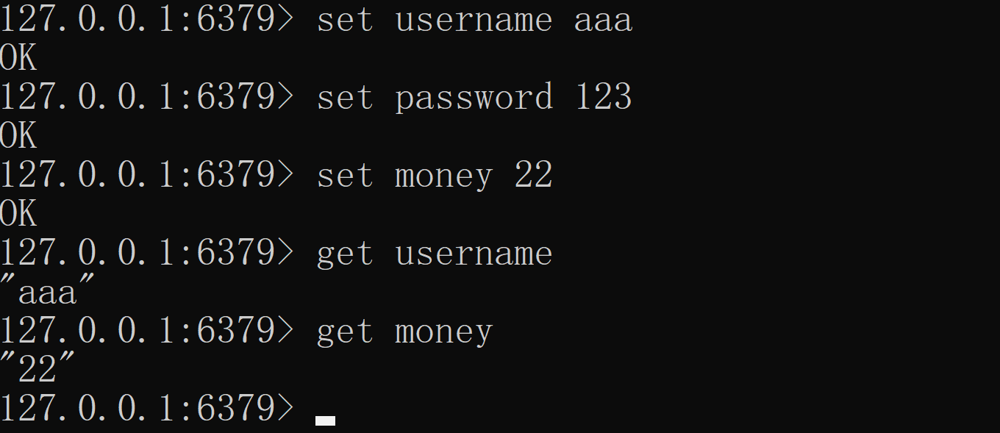
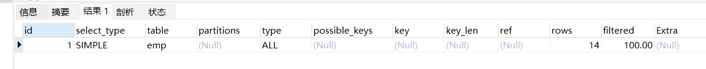
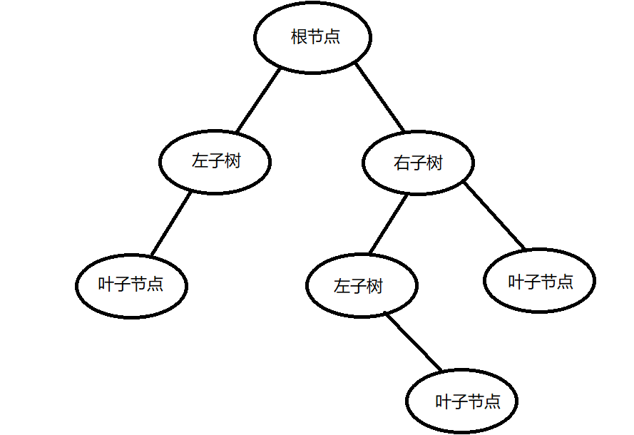
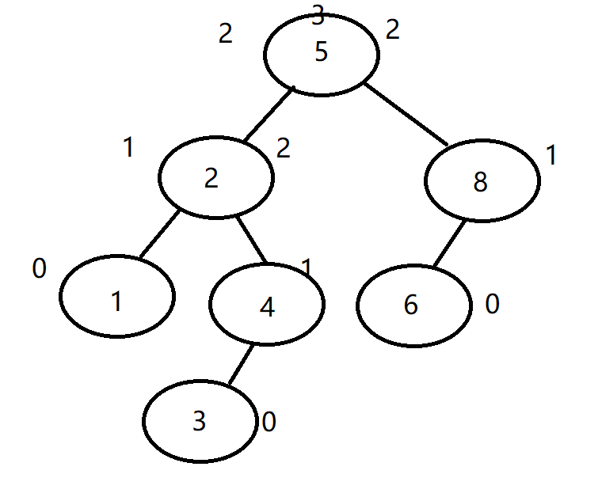
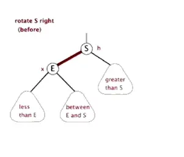
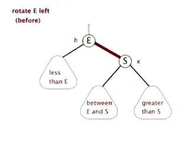
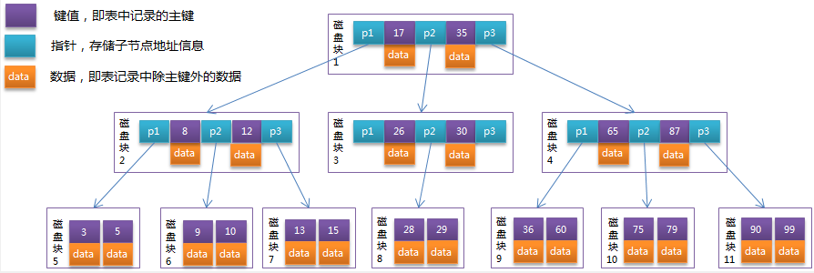
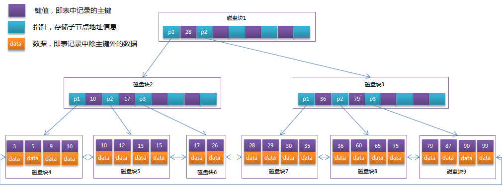
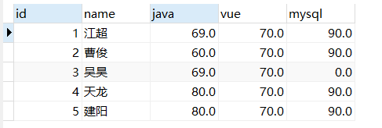
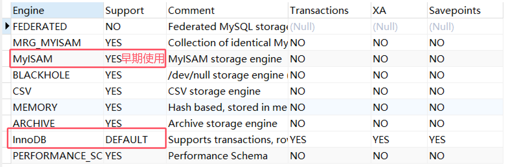

## 数据库

### 1. 数据库

数据库（Database），DB是按照数据结构来组织或者存储和管理数据的仓库，每个数据库具有多个API用于管理和创建保存的数据，之前使用序列化做数据存储，不适合做大量数据的存储，而且读写效率特别低，所以保存数据最好的方式就是存储数据库，主要是分两种

+ 关系型数据库
+ 非关系型数据库（nosql数据库）


#### 1.1 关系型数据库

关系型数据库：建立在关系模型基础上进行数据存储的，关系模型就是二维表（excel表格）

+ 常见关系数据库有哪些：
  + mysql
  + sql server
  + oracle
  + db2
  + 达梦（国内）
  + GaussDB（国内）


#### 1.2 非关系型数据库

nosql（非关系型）：没有特定关系，`不需要创建表`，存储的数据之间也是没有关系的，适合存储海量的碎片化数据，读写熟读特别快，一般是基于内存存储的

常见的非关系型数据库：

+ redis
+ Hbase
+ mongoDB



### 2.Mysql优点

mysql是一种关系型数据库，是由瑞典Mysql AB公司研发的，目前属于Oracle公司，优势在于：

+ mysql开源的，免费的
+ mysql支持大量的数据存储，可以处理千万级数据
+ mysql使用标准sql语言格式（其他数据库如果也支持，语法基础是一致的）
+ mysql可以在多个系统中，并且还支持各种语言的兼容C C++ java python
+ mysql还支持定制化，可以修改源码开发属于自己公司的mysql系统


### 3.SQL语言分类---面试

- DDL：数据定义语言，

  用于创建和删除数据库对象的命令（创建数据库，创建表，创建视图，创建索引，创建触发器）

  共同特性：不能做事务回滚

  比如：create(创建) drop(删除) alter(修改) truncate(截断表)

  

- DML：数据操作语言，

  用于操作（增 删 改）数据库表中的数据

  比如：insert（新增）delete（删除）update（修改）

  > DDL中的drop是删除表，delete是删除表中的数据 

  | 操作   | 作用对象      | 表结构 | 是否可恢复           | 性能   |
  | :----- | :------------ | :----- | :------------------- | :----- |
  | DROP   | 整个表/数据库 | 删除   | 不可恢复（除非备份） | 快     |
  | DELETE | 表中的数据行  | 保留   | 可回滚（事务中）     | 相对慢 |

- DQL：数据查询语言

  用于查询数据库表中数据

  比如：select（查询）--- 最难的 最常用的

  

- DCL：数据控制语言

  用于控制数据库组件许可或者权限

  比如：grant（授权） revoke（撤销权限）

  

- TCL：事务控制语言==（面试官必问）==

  用于提交事务或者回滚事务的

  比如：commit（提交）rollback（回滚）


### 4.DDL语言 

#### 4.1 create创建命令

```sql
-- create 可以创建表 用户 数据库 索引 ...
create table/user/index/view... 名

-- 创建表的基本语法(数据库不区分大小写)
--[] 表示可有可无
create table 表名(
字段1 数据类型 [约束] [索引]  [注释],
字段2 数据类型 [约束] [索引]  [注释],
...
字段n 数据类型 [约束] [索引]  [注释],
)[表类型][表字符集][注释]
```


#### 4.2 alter修改命令：修改表结构

```sql
-- 修改表名
alter table 表名 rename 新表名;
-- 添加字段
alter table 表名 add 字段名 数据类型;
-- 修改字段
alter table 表名 change 原字段名 新字段名 类型;
-- 删除字段
alter table 表名 drop 字段名;
```


#### 4.3 drop删除命令

```sql
drop table 表名
```


### 5. DML

#### 5.1 insert 新增数据

```sql
-- 新增语法1：指定字段插入
-- 注：前面声明的字段和后面保存的值，必须一一对应
insert into 表名 (字段1 ,字段5,字段3)values (值1，值5,值3);

-- 新增语法2：全字段插入
-- 注：新增后的值 必须和表声明的字段一一对应
insert into 表名 values(值1, ... ,值n);

-- 新增语法3：批量插入
insert into 表名 (字段1,字段5) values (值1,值5),(值1,值5),(值1,值5),(值1,值5);
insert into 表名 values (值1,...,值n),(值1,...,值n),(值1,...,值n),(值1,...,值n);

-- 新增语法4：借助于select特别实现批量插入
insert into 表名 select 值1,...,值n union
				select 值1,...,值n union
				select 值1,...,值n ;
				
```


#### 5.2 update更新数据

```sql
update 表名 set 修改的字段1 = 修改后的值1,字段2 = 值2
where 条件(目的找到 要修改的哪些行的数据)
-- 比如：学号是130的 where stuid= 130
-- 比如：学费在10000到15000之间的
where money<=15000 and money>=10000
where money between 10000 and 15000
```


#### 5.3 delete删除数据

``` sql
delete from 表名 where 条件;
```


> 注：删除和更新语句必须==添加限定条件==，否则会全表更新或删除
>


### 6.mysql数据类型 --面试题

+ 数值类型：整数和浮点数

  | 类型     | 大小   | 描述       |
  | -------- | ------ | ---------- |
  | smallint | 2字节  | 小整型     |
  | int      | 4字节  | 整形       |
  | bigint   | 8字节  | 大整形     |
  | float    | 4字节  | 单精度     |
  | double   | 8字节  | 双精度     |
  | decimal  | 31字节 | 精确浮点型 |

  -  double：是一种双精度浮点型，最大可以存储大约15位有效数字，占8字节，比如适合精度比较高 也允许一些小误差场景 ，比如：工程学允许一些误差

  - decimal：是一种精确浮点型，用于存储精度非常高的数据，最大可以存储65位有效数字，占31个字节，比如：金融行业 银行行业

    注：float double decimal 三者写法一模一样 比如：double(10,2)表示 8个整数，2个小数 decimal(10,2)是一样的

+ 字符串类型：

  | 类型    |                             大小                             |     描述     |
  | :------ | :----------------------------------------------------------: | :----------: |
  | char    |                          255个字符                           |  定长字符串  |
  | varchar | 65535字节，根据不同的编码方式存储中文个数也不同（utf-8每个汉字3个字节） |  变长字符串  |
  | text    |                          65535字符                           | 长文本字符串 |
  | bolb    | 2^16-1字节，可以存储任意数据（文件 、视频、音频））将文件转换成二进制保存，但是不推荐这么设计，以后文件推荐存储在文件服务器或者云服务器上，数据库只存储地址即可 |              |
  |         |                                                              |              |


#### 6.1 char 类型和varchar类型区别 ---面试题

+ char:属于定长字符串，无论存储多少数据，占用空间是固定的，比如：char（100），只存储1，也会占100个字符

  缺点：比较浪费空间 比较适合存储一些长度固定的数据，比如：身份证号，手机号，性别 状态......

+ varchar：属于变长字符串，所占的空间是根据存储的数据决定，比如：varchar（10000）但是只存储1，只占1个字节，比较节省空间

+ 日期类型：

  | 类型      |       格式        | 描述       |
  | --------- | :---------------: | ---------- |
  | date      |     %Y-%m-%d      | 日期值     |
  | time      |     %H:%i:%s      | 时间值     |
  | year      |        %Y         | 年份       |
  | timestamp | %Y-%m-%d %H:%i:%s | 时间戳     |
  | datetime  | %Y-%m-%d %H:%i:%s | 日期时间值 |


#### 6.2 **timestamp和datetime的区别 --面试题**

+ 容量不同：timestamp占4个字节，datetime在5.6之后占5个字节
+ 存储方式不同：timestamp会将存储的值转换成UTC格式进行存入，所以有可能存入的数据和保存的数据不一致，但是datetime不会转换，存入什么保存什么数据
+ 存储null不同：timestamp在mysql8之前存储null会自动转换成now()；datetime不会，给什么数据存储什么数据


### 7. DQL语言 --重点、难点

#### 7.1基础语法

```sql
-- []可有可无	前后不能颠倒
select 查询的字段1，字段2....from 表名或者视图名
[where 分组前条件] -- 年龄>20
[group by 分组的字段]
[having 分组后条件] -- 平均分>60
[order by 排序的字段 ASC(升序默认) 或DESC（降序）]
[limit [起始下标，]行数]  -- 每页5条  查询第3页 limit 10,5  --注意与limit ？ offset ?的区别

```


#### 7.2where子句

用于给查询语句添加限定条件的，限定要查询的哪些行的数据，一般写在`group by`的前面，表示分组钱的条件

```sql
-- 1.范围查询：  > >= < <= 还要结合逻辑运算：and or not
select 查询的字段 from 表 where 成绩 >60 and 成绩 <80
-- between and 也可以完成范围查询，只不过它属于闭区间
where 成绩 between 60 and 80

-- 2.null值查询
where 字段 is null
where 字段 is not null

-- 3.不等于查询
where 字段!='110'
where 字段<>'110'

-- 4.多个值的查询
-- 查询学号10 20 30
where 学号=10 or 学号=20 or 学号 =30 --不合适编写多个
-- 简化版 in() 函数 等价于或者  缺点：子查询的数据集太大会影响效率 后期会把in 替换成exist
where 学号 in(10,20,30)

-- 5.模糊查询：如果在查询时 这个条件不具体 只知道一部分 这种情况 可以借助于模糊查询 like子句来实现
-- 语法：需要先掌握两个占位符
-- 	 1.%:表示 0·n字符 不确定位数时，适合使用
-- 	 2._:只能表示1个字符 确定位数时使用
-- 比如：查询 字段是以a结尾的
where 字段 like '%a'
-- 比如：查询 字段以a开头
where 字段 like ‘a%’
-- 比如:查询 字段以a开头 长度是3位
where 字段 like ‘a__’
-- 比如:查询 字段倒数第二个是a
where 字段 like '%a_'
-- 比如:查询 字段包含a,b
where 字段 like '%a%' and '%b%'

-- 6.复杂逻辑判断case函数：可以用于实现 复杂逻辑判断 类似于Java中的if和switch
-- 语法1:类似于if
case
	when 条件1 then 结果1
	when 条件2 then 结果2
	...
	else 其他结果
end

-- 语法2：类似于switch
case 字段
	when 值1 then 结果1
	when 值2 then 结果2
	...
	else 其他结果
end
```

例：

```sql
-- 9.查询score表中的最高分的学生学号和课程号 
select * from t_score;
select sno,cno,degree from t_score where degree =(select max(degree) from t_score);
```


#### 7.3 union子句

mysql中union用于连接多个查询语句的结果，最终合并成一个结果集返回 前提是==多个查询语句的查询字段个数必须相同==和==类型、字段名没有关系==，并且如果合并后的结果具有重复的数据，还可以实现自动去重，还可以实现数据库列转行的功能

```sql
-- 语法1：将两个查询语句合并去重
select 字段1,字段3 from 表 where 条件
union
select 字段5，字段7 from 表 where 条件

-- 语法2：如果不需要去重 使用union all
select 字段1,字段3 from 表 where 条件
union all
select 字段5,字段7 from 表 where 条件
```


#### 7.4 order by 子句

数据库数据本身是没有顺序的（类似于java的set集合 表示无序唯一的） 因为它不知道表应该按照什么字段排序，所以如果想排序，通过关键字`order by` 并且 sql语句前后是有顺序的，一般是编写在除了`limit`的末尾的

> ASC升序（默认，可不写），DESC降序

```sql
-- 语法：
order by 排序字段 排序规则（ASC（默认值）和DESC）
order by 字段1 规则1，字段2 规则2

-- 比如：查询公司工资由低到高并且如果工资相同，按照员工号作升序排列
select * from 表名 order by 工资 ASC,员工号 ASC
select * from 表名 order by 工资,员工号 -- 默认升序，可以省略
```


#### 7.5 limit子句

limit是mysql中通过下标来限定查询行数的一种方式，后期主要用于实现分页，并且limit一般写sql语句的末尾

```sql
-- 语法：起始下标 默认是0开始 也可以省略
limit [起始下标，] 查询条数

-- 比如：查询一个表，每页 3条数据 查询第3页
select * from 表 limit 6,3;
-- 比如：求比科目3-105成绩3-5名
select * from 表 where 科目 ='3-105'
order by 成绩 DESC
limit by 2,3;
```

**分页：**

```sql
3.完成分页查询sql语句 每页显示5条数据  查询teacher表第3页数据
SELECT * FROM teacher 
LIMIT 5 OFFSET 10;

-- pageNum是页码，pageSize是每页
limit  (pageNum-1)*pageSize,pageSize
```

计算公式：`OFFSET = (页码 - 1) * 每页条数 = (3 - 1) * 5 = 10`


### 8. mysql约束 ---面试题

约束：是用于限定表中数据的，凡是不符合的数据是无法插入到表中的，是为了增加数据的准确性，一般是添加约束，可以创建表时添加，也可以在表已经存在的时候，单独设置，约束主要分为以下几种：

+ 非空约束： not null 保证字段不能为空
+ 默认约束：default 为了保证字段一定有值，如果没有插入数据，自动设置为默认值
+ 唯一约束：unique 为了保证数据唯一，但是数据`可以为null（允许多个数据为null）`，并且唯一约束会自动添加唯一索引
+ 检查型约束：check用于给字段添加校验（比如：性别是男是女）但是mysql语法会通过，但是会失效
+ 主键约束：primary key（pk）用来控制数据唯一的方式，相比唯一约束会自带`唯一`和`非空`两个特性,并且主键约束每张表有且只有一个（联合主键也是一个主键），而且主键约束还会添加主键索引
+ 外键约束：foreign key（fk）定义在具有父子关系的子表中，子表中的外键必须对应父表中的主键或者唯一键,目的是为了确保数据的完整性，并且外键是允许为null的，是可以重复的

```sql
student(id name classid) -- 子表
		1	aaa		10
		2	bbb		10
		3   ccc     20
		4   ddd     100  -- 违反了数据的完整性
		5   eee     null
		
class(id classname) -- 父表
	  10	sc1
	  20	sc2
	  30	sc2
	  
```


- 创建表时添加约束

```sql
-- 语法1：创建表时添加约束
create table people(
 -- 主键（唯一非空） 自增
id int primary key auto_increment,
name varchar(100) not null,
age int default 18, -- 默认 
sex char(1) check(sex in('男','女')), -- 检查型（验证是否1/0）
phone char(11) unique, -- 唯一
city_id int,
-- 添加外键
foreign key(city_id) references city(id) -- foreign key(外键)
);

create table city(
id int primary key,
name varchar(100)
);

insert into people values(
20,'林泽',null,'女','170',null
);

insert into people (id,name)
values (5,'天龙');

select * from people;

insert INTO city VALUES
(10,'南昌'),(20,'北京'),(30,'上海')
;

select * from city;

insert into  people values(100,'吴昊',24,'男','160',10);

-- 主键约束优化 可以设置主键自增
-- 主键最大值+1
insert into people values(
null,'老王',34,'男','140',30
);

-- 联合主键
create table t_score(
sno int, -- 学号
cno int, -- 科目号
degree double(4,1),
primary key(sno,cno)
);
```


+ 如果表已经存在了，添加约束

  ``` sql
  alter table people add primary key(id);
  alter table people add unique (phone);
  alter table people add check(sex in (1,0));
  alter table people add foreign key(city_id) references city(id);
  ```


### 9.mysql三范式 --- 面试题

设计数据库表，遵循一些规则和要求，才能设计出合理的表结构，这些要求和规则就是范式。范式是一种分层架构，主要包含6层层数越高，数据安全性越高，但是效率也越低（因为每一层必须先满足上一层范式要求），但是数据库不仅仅考虑安全性也要考虑效率，所以开发过程中只需要满足前三范式即可

+ 第一范式（1NF）：要求设计数据库表，字段具有原子性（表示字段不能再拆分），所以就不能将类似于java中的对象、集合、数组这类数据当成字段
+ 第二范式（2NF）：前提是先满足1NF，又要求数据必须依赖于主键，
  说白了就是让你每张表强制性的添加一个主键，因为主键是唯一非空的，可以防止数据冗余
+ 第三范式（3NF）：前提是先满足2NF，又要求不能有其他表的非主键列，
  就是表示不能有重复列的意思，强调你添加主外键关联

```sql
emp id name sql dept_id(符合) dept_name（不符合）
dept id deptname
```

> ==但是==：在实际开发过程中第三范式是可以违反的，因为很多需求做查询，可能会设计到两张表，如果经常查询，每次都要查询两张表，肯定会影响性能
>
> 所以说违反第三范式，虽然添加一个冗余字段，但是查询时就可以只查一张表，虽然浪费了一些空间，但是
> 可以提高查询效率，这个也是后期优化数据库的一种方式


### 10.MySQL函数 ---重点

mysql具有很多内置的函数，类似于java中的方法，区别于mysql可以传递参数，同时一定具有返回值，主要分为两大类：

+ 内置函数
  + 聚合函数：对多条数据操作，最终只会返回一个结果
    比如：求班级总分
  + 单行函数：对多条数据操作，最终每行数据都会返回一个结果
    比如：统计班级每人的年龄
+ 自定义函数


#### 10.1聚合函数

+ avg（字段）：返回某个字段的平均值
+ count（字段）：返回某个字段的行数，如果没有合适的字段推荐写count（*）或者count（1）
+ max（字段）：返回某个字段的最大值
+ min（字段）：返回某个字段的最小值
+ sum（字段）：返回某个字段的总和

> 注：聚合函数只能用于select后面和having的后面

> 聚合字段也就是调用聚合方法得到的字段

> SELECT 中的非聚合字段必须出现在 GROUP BY 中?
>
> 解释：如果要用到分组查询非聚合字段的话，必须将非聚合字段写入group by中，要是我不需要查询这个字段，那我也就不需要写入group by了


#### 10.2单行函数

+ 数字函数：类似于Java中的Math类中的方法

  + ceil()：返回指定数据向上取整的结果，比如：select ceil（1.1）--2

  + floor()：返回指定数据向下取整的结果

  + rand()：返回0~1随机数

  + round(数据,小数位)：保留多少位小数进行四舍五入

  + abs()：获取绝对值

    ......

    

+ 字符串函数：类似于Java中的String的方法

  + char_length()：返回字符长度
    比如：select char_length('hello你好')；--7

  + length()：返回字节长度
    比如：select char_length('hello你好')；--11

  + concat(s1,s2,s3,...)：将字符串s1 s2 s3...拼接在一起

  + substring(数据，起始下标，截取长度)：截取字符串内容

  + upper()：转大写

  + lower()：转小写

  + left(数据，位数)：获取指定内容的前几位

  + rigth(数据，位数)：获取指定内容的后几位

  + replace(数据，原内容，替换后的内容)：替换字符串

  + instr(数据，'内容')：返回指定内容出现的下标

  + reverse(数据)：可以进行数据反转

    ......

    ```sql
    -- 创建一个文件表
    -- 查询出 文件名称和文件后缀
    create table files(
    id int primary key auto_increment,
    type varchar(100),  -- 文件类型
    url varchar(1000)  -- 文件地址
    );
    
    insert into files values 
    (null,'图片','my.jpg'),
    (null,'图片','hehe.jpg'),
    (null,'java','doudou5G.java'),
    (null,'文档','面试宝典.md'),
    (null,'表格','text.xls')
    ;
    
    insert into files VALUES(null,"表格",'t.e.s.t.xls');
    
    select reverse(url) from files;-- 反转
    select instr(reverse(url),'.') from files;-- 反转之后得到.的下标
    select char_length(url) from files; -- 得到字符长度
    select right(url,instr(reverse(url),'.')) 文件后缀 from files ;
    select left(url,char_length(url)-instr(reverse(url),'.')) 文件名称 from files ; 
    ```

    > ==下标问题：==
    >
    > 在SQL中，`INSTR()` 函数返回的的字符串下标是**从1开始**的，不是从0开始。
    >
    > `subString()`函数中的起始下标也是**从1开始**的

+ 日期函数：处理日期数据（年 月 日 日期运算）

  + now()：返回当前系统时间
  + year(日期)：返回日期中的年份 month() honr() minute()
  + adddate(日期，天数)：给指定日期添加多少天 ，比如保质期
  + last_day(日期)：返回当月的最后一天
  + datediff(日期1，日期2)：求出两个日期的天数差
  + from_days(天数)：可以天数转换成日期格式（xx-xx-xx），bug支持365以上

  > 查询学生表 每个学生的出生日期，变成下个月5号
  >
  > 查询学生表 每个学生的姓名和年龄
  >
  > ```sql
  > select * from student;
  > select sbirthday from student; -- 生日
  > select last_day(sbirthday) from student; -- 最后一天日期
  > select sbirthday,adddate(last_day(sbirthday),5) from student;
  > -- 姓名，年龄
  > select datediff(now(),sbirthday) from student;
  > select year(from_days(datediff(now(),sbirthday))) from student;
  > ```


+ 条件判断函数

  + if(条件，值1，值2)：当条件成立返回值1，否者值2

  + ifnull(字段，结果)：判断字段是否为null，如果是null返回该结果

  + case函数：实现类似于Java多重if和switch的动能

    ```sql
    -- 6.复杂逻辑判断case函数：可以用于实现 复杂逻辑判断 类似于Java中的if和switch
    -- 语法1:类似于if
    case
    	when 条件1 then 结果1
    	when 条件2 then 结果2
    	...
    	else 其他结果
    end
    
    -- 语法2：类似于switch
    case 字段
    	when 值1 then 结果1
    	when 值2 then 结果2
    	...
    	else 其他结果
    end
    ```

    

+ 其他函数

  + version()：返回数据库版本号

  + database()：返回当前使用的数据库

  + md5(内容)：将指定内容安装md5算法加密后返回，是不可逆的

  + str_todate(字符串，日期格式)：将字符串转换日期格式

  + date_format(日期，格式)：将日期转换成字符串

    ```sql
    -- mysql日期格式和java不同
    %Y 四位年 %y两位年
    %m 月份 
    %d 天数
    %H 24进制小时  %h 12小时进制
    %i 分钟
    %s 秒
    ```

    ```sql
    -- 日期转字符串
    select date_format(sbirthday,'%Y年%m月%d日') from student;
    
    -- 字符串转日期
    -- 20120812
    select str_to_date('20120812','%Y%m%d');
    ```


### 11.分组查询 --难点

group by：将查询的结果按照指定的字段（性别 部门 科目）进行分组，这样就会把原来只有一个数据集合，变成很多组的数据集合，如果在进行聚合函数，每组的数据都会返回一个数据集合

```sql
select 查询的字段[,聚合函数] from 表 
where 分组前条件
group by 分组字段
having 分组后条件
```

> 注：如果查询语句添加了分组，那么查询的字段只能是分组的字段或者聚合函数，否者oracle会报错，mysql会把第一条数据显示出来


### 12.连接查询 ---面试题 难点

如果在查询过程中，查询的数据分散在不同的表中，这样如果只会查询一张表无法满足用户的需求，就需要学习多张表之间的关联查询，连接查询主要分两大类：

+ 内连接：只会查询出匹配条件的数据，不匹配的数据无法查询出来
+ 外连接
  + 左外连接：会将左边的表作为主表（无论是否满足匹配条件都会查询出来），把右边的表作为副表（只会显示满足的数据，不匹配的数据显示成null）
  + 右外连接：会将右边的表作为主表（无论是否满足匹配条件都会查询出来），把左边的表作为副表（只会显示满足的数据，不匹配的数据显示成null）
  + 全外连接：mysql不支持，oracle是支持的，表示左右两边的表都是主表，两边的表都会全部展示


#### 12.1 内连接

```sql
-- 正常语法
select * from 表1 inner join 表2 on 匹配条件/（关联条件）
				  inner join 表3 on 匹配条件
-- 匹配条件：就是两个表 可以共同描述同一个内容的字段，字段名可以不同，但是含义要一样
-- 比如：学生（sno） 成绩（sno）

-- 实现学生表和成绩表的内连接
select * from student s inner join t_score sc on s.sno =sc.sno; 

-- 简化版语法：重点
select * from student s ,t_score sc 
where s.sno =sc.sno;

-- -- 通过内连接查询学生姓名 student
-- 考试科目t_course
-- 成绩，t_score
-- 科目授课老师姓名t_teacher 
select s.sname,sc.degree,c.cname,t.tname 
from student s ,t_score sc,t_course c,t_teacher t
WHERE s.sno =sc.sno and
sc.cno=c.cno and
c.tno =t.tno;  

```


#### 12.2 外连接

```sql
-- 左外语法：  （主表）		 （副表）
select * from 表1 left join 表2 on 关联条件
				  left join 表3 on 关联条件

-- 右外语法：  （附表）		 （主表）
select * from 表1 right join 表2 on 关联条件
				  right join 表3 on 关联条件

-- 全外语法：  （主表）		 （主表）
select * from 表1 full join 表2 on 关联条件
				  full join 表3 on 关联条件				 
```


#### 12.3 自连接

自连接比较特殊，不是一个新的连接类型，而是一种连接查询使用方式，原理就是把一张表当成多张表来处理（可以使用内连接也可以外连接）一般适用于查询同一张表，但是比较抽象，就可以考虑使用自连接

```sql
-- 比如：查询员工姓名：和上级员工姓名，而且还要包含哪些没有上级的员工
select e1.ename,e2.ename from emp e1,emp e2
where e1.mgr = e2.empno;

select e1.ename,e2.ename from emp e1 left join emp e2
on e1.mgr = e2.empno;

-- 比如：查询同一个学生3-105比6-166成绩高的学生信息
select s.*,sc1.cno,sc1.degree,sc2.cno,sc2.degree 
from student s,t_score sc1,t_score sc2
where sc1.cno='3-105' and sc2.cno ='6-166' 
and  sc1.sno =sc2.sno 
and sc1.sno =s.sno
and sc1.degree>sc2.degree;

-- 查询成绩比该课程平均成绩低的成绩信息
select * from t_score s1,
(select cno,avg(degree) avgdegree from t_score
group by cno ) s2
where s1.cno=s2.cno
and s1.degree<s2.avgdegree;
```


### 13.子查询

子查询：也叫内部查询，就是一个SQL语句里面嵌套了其他的sql语句，而且insert，update，delete也可以嵌套子查询，子查询主要分三类：

+ `where`型子查询：把内层查询的查询结果当成外层查询条件使用

+ ```sql
  -- 查询员工最大的员工信息
  select * from emp where empno =(
      select max(empno) from emp);
  ```

  

+ `from`型子查询：把内层查询结果当成一张临时表来处理

  ```SQL
  -- 查询每个科目最高分的学生信息
  select s.*,sc1.cno from student s, t_score sc1,(
  select cno,max(degree) max from t_score
  group by cno) sc2 
  where s.sno=sc1.sno
  and sc1.cno =sc2.cno
  AND sc1.degree=sc2.max;
  ```

+ `exists`型子查询：把内层查询结果，拿到外层查询去测试，如果内层查询的结果成立（可以查到数据），则执行外层查询
  如果结果不成立，则不执行外层查询（查询全是null）底层类似于in（），但是执行原理不同

  ```sql
  -- 语法1：判断子查询结果是否存在
  -- 执行原理：先执行子查询，
  -- 如果子查询结果存在（成立），就会执行外层查询
  -- 如果不存在，外层查询不存在
  select* from 表 where exists (子查询);
  select* from 表 where not exists (子查询);
  
  -- 子查询有数据，外层查询执行
  select * from student
  where exists (select 1);
  
  -- 子查询没有数据，外层查询不执行
  select * from student
  where exists (
  	select * from emp where ename='aaaaa'
  );
  
  -- 查询 考过3-245 的学生信息
  select * from student s
  where exists(
  		select * from t_score sc where cno ='3-245' and sc.sno =s.sno
  )
  
  -- 查询平均工资 低于2000的部门的员工信息
  -- 通过exists完成
  select * from emp e1
  where exists (
  	select deptno,avg(sal) avg from emp e2
  	where e1.deptno =e2.deptno
  	group by deptno
  	having avg<2000
  )  ;
  
  -- ------------例:----------------------------
   -- 9、查询所有课程成绩小于60分的同学的学号、姓名； 
  --  方法一：
   select  stuid,StuName from tblstudent s
   where exists(
   select StuId from tblscore sc
   where  s.StuId=sc.stuid
   GROUP BY StuId
   having max(Score)<60
   )
   
   --  10、查询没有学全所有课的同学的学号、姓名；  
  select stuid,StuName from tblstudent s
  where exists(
  select stuid,count(distinct CourseId) count from tblscore Sc
  where  s.StuId=sc.StuId
  group by StuId
  having count !=(
  select count(1) from tblcourse
  ))
  ```

  

> in() 适用于子查询结果集不多比较好，
> exists() 适用于子查询结果集很多，可以优化性能


### 14.mysql查询语句关键字执行顺序 ---面试题

```sql
-- select from where 
-- group by
-- having
-- order by 
-- limit
答案： from（先查表）> where (分组前条件)
> group by (根据表中筛选完数据进行分组)
> having（分组后条件）> select（查询字段）
>order by (根据查询字段排序) > limit (排序后限定行)
```


### 15. 索引 ---重点 难点 面试题

> + 什么是索引？
> + 索引有哪些分类？
> + 索引什么时候失效？
> + 索引是不是越多越好？为什么？
> + 哪些字段适合添加索引？
> + 怎么查询一条查询语句是否走了索引？（执行性能）？
> + 联合索引 最左匹配原则是什么？
> + 索引底层数据结构是什么？


#### 15.1 什么是索引 --- 面试题

索引是用来加快查询速度的一种方式，可以不断缩小查询数据的范围，从未减少了查询时间，类似于阅读书籍，通过目录查询数据是一样的，只需要找到数据在哪个范围之内，就不需要全表扫描，底层实现是通过B+树实现的


#### 15.2索引的分类 ---面试题

+ 普通索引：index
+ 唯一索引：unique 添加了唯一约束，自动添加
+ 主键索引：primary key 添加了主键，自动添加
+ 全文索引：fulltext 用于搜索长篇文章比较适合
+ 联合索引：
  + 联合普通索引：index（name,age）
  + 联合主键索引：primary key（sid,cid）
  + 联合唯一索引：unique（name,phone）

```sql
-- 一张表
编号 int -- 适合主键索引（唯一非空）
姓名 varchar -- 适合普通索引（可以重复）
身份证号 char -- 适合唯一索引
手机号 char -- 适合唯一索引
备注 text -- 适合全文索引（因为内容很多）
```

> 注：索引是否越多越好？答案：不是
>
> 原因：如果给每个字段添加了索引，确实可以提高查询效率，但是会降低增删改的效率，因为每次增删改都需要去维护最新的索引


#### 15.3 索引创建和删除 ---面试题

1. 创建索引

```sql
-- 创建索引的语法1：使用create命令
create index 索引的名称 on 表名(字段) -- 普通索引
create unique index 索引的名称 on 表名(字段) -- 唯一索引
create fulltext index 索引的名称 on 表名(字段) -- 全文索引

-语法2：通过alter命令
alter table 表名 add index 索引名(字段)
alter table 表名 add unique index 索引名(字段)
alter table 表名 add fulltext index 索引名(字段)
```

2. 删除索引

```sql
-- 删除索引：使用drop命令
drop index 索引名 on 表；
```

3. 如果使用索引

```sql
-- 如何使用索引：通过索引的字段，作为查询条件
-- 就会走索引 快速定位数据范围，提高查询速度
select * from person where id =？？   -- 会走索引
select * from person where card =？？ -- 不会走索引
```


#### 15.4 如何查看是否走了索引 ---面试题

> 通过`explain + 查询语句`：就可以查看这个查询语句的执行计划，这里包含了这个语句的整体性能和是否走了索引



+ select_type：表示sql语句是否涉及到子查询或者表连接或者union和union all

+ table：对应的sql涉及的表是什么

+ type：可以用于查询sql整体性能，不同的性能也能体现出来走了索引

  ```sql
  -- system > const > eq_ref > ref > fulltext > range > index >all
  system:表示只有一行数据或者空表，如果存储引擎是I
  const:表示使用了主键索引或者唯一索引
  ref:一般表示使用了普通索引
  fulltext:全文索引，但是如果全文和普通索引都存在，优先使用全文索引
  range:表示索引范围查询，常用 > < between and like;
  index:索引全表扫描，把索引从头扫描一遍
  all:全表扫描
  ```

+ possible_keys和key：两者是类似的，如果不走索引，值一般是null，但是如果里面有值，表示一定走了索引

+ rows：执行查询语句，预估的行数

> 注：如何判断是否走了索引？
>
> 观察type字段是否是const,ref,fulltext,range级别，
> 还可以观察possible_keys和key是否有值，如果有值走了索引

```sql
-- SQL语句的性能级别
-- system 级别
-- 借助于InnoDB存储的，虽然是空表也是all
explain select * from files;
explain select * from (select 1) s;

-- const 级别：表示使用了主键和唯一索引作为条件
select * from person;

insert into person values(null,'a','120','110','我是a用户'),
(null,'b','120150','120','我是b用户'),
(null,'c','120150','130','我是c用户');

explain select * from person where id =3;
-- 索引失效:如果是字符串，没有添加引号，mysql会自动转换类型
explain select * from person where phone ='130';

-- ref级别：一般情况下使用了普通索引
explain select * from person where name ='a';

-- fulltext:全文索引
explain select * from person where match(msg) against("我是c用户");

-- range：索引范围搜索
explain select * from person where id between 1 and 3;
-- 索引失效：模糊c只有后%才会生效
explain select * from person where name like '%a%';

-- all级别：随便写
```


#### 15.5最左匹配原则 -- 面试题

最左匹配原则，主要是使用联合索引，如果查询条件涉及到了索引多个字段，只有满足了索引最左边的字段，才能充分的利用索引

```sql
-- 一个联合索引(A、B、C)
-- sql语句
select * from 表 where A='值' -- 走了索引
select * from 表 where B='值' and C='值'-- 不走索引
select * from 表 where A='值' and C='值' and B='值' -- A会走索引，C和B不走索引
-- 总结：联合索引（A、B、C）
-- 匹配（A） 匹配（A、B） 匹配（A、B、C）都会走索引
```


#### 15.6 什么字段适合做索引？或设计索引需要注意哪些问题？-- 面试题

+ 一般把经常查询的字段作为索引（当作查询条件的字段）
+ 主外键关联字段
+ 修改频率不高的字段适合加索引
+ 经常排序的字段也适合加索引
+ 不是所有字段都适合添加索引，因为索引不是越多越好
+ 联合索引，要注意最左匹配原则......
+ 避免一些索引失效的场景......


#### 15.7 索引失效 --- 面试题

+ 如果条件是字符串内容，如果没有添加引号，mysql会自动类型转换，不会走索引

+ 使用like做模糊查询，使用前%不走索引，后%走索引
  原因在于前%包含了0-n个字符，不知道从谁开始匹配

+ 索引的字段参与了运算

  ```sql
  where id = 10；-- 走索引
  where id+10 =20； -- 不走索引
  ```

+ 索引的字段调用了函数也不会走索引

  ```sql
  where phone=’110...1234‘ -- 会走索引
  where substring(phone,7,4)='1234'  -- 不走索引
  ```

+ 使用or也可能不走索引，原因：不一定所有条件都创建了索引

+ 使用is null 或者 is not null 不走索引

+ 使用不等于（`!=`或`<>`）也不走索引，原因：不知道从谁开始匹配

+ 最左匹配原则，只有满足最左边的字段才会走索引


#### 15.8 索引数据结构B+树 ---面试题

> 面试题1：为什么mysql会采用B+树做索引？
>
> 其他数据结构：数据，链表，哈希表，二叉树，平衡二叉树，红黑树，他们为什么不做索引?

> 面试题2： B+树和B-树的区别？

> 面试题3： B+树是一种什么数据结构？

+ 数组：查询比较快，原因在于内存是连续的，
  增删比较慢，原因在于增删元素要进行元素前移和后移，
  而数据库不仅要考虑查询也要考虑增删效率，所以它不适合做索引

+ 链表：增删快，原因在于只需要修改next指向的节点，其他元素不需要修改，
  查询慢，原因在于必须从上一个节点才能定位下一个节点，所以也不适合做索引

+ 哈希表：底层兼容了数组的优点和链表的优点，在不考虑哈希冲突的时候时间复杂度都是O(1)，但是缺点是数据库如果是要做范围查询时，比如：> <  between，由于哈希表是无序的，就无法正常做范围查询 

  ```sql
  where id>1 and id <10000
  ```

+ 二叉树：虽然它有顺序，但是如果插入元素的时候一直出现递增的数据或者递减数据，就有可能一直往其中一个子树去插入元素，这样二叉树就形成了链表，查询效率就低了

  - 根节点：属于树的最顶端，只有一个

  - 子节点：除了根节点，下面链接的节点，也会分左右（左右子树）

  - 叶子节点：下面没有连接任何节点，属于树的最低端

    

    二叉树查询元素规则：首先先和根节点去做比较

    ```sql
    -- 1.首先先和根节点去做比较
    -- -- 1.如果相等 说明找到了，结束
    -- -- 2. 如果比根节点大了，继续和他的右子树比较
    -- -- ...
    -- -- 3. 如果比根节点小了，继续和他的左子树比较
    -- -- ...
    ```

    二叉树插入元素原则：

    ```sql
    -- 1.首先先判断根节点是否为null 如果是直接插入
    -- 2.如果不是null，那插入的元素和根节点比较
    -- 3.如果比根节点大，继续查找它的右子树是否为null
    -- 4.如果是null直接插入，如果不是，继续和右子树比较大小
    -- ...
    -- 5.如果比根节点小，继续查找它的左子树是否为null
    -- 6.如果是null直接插入，如果不是，继续比较...
    ```

  

+ 平衡二叉树：任何两个节点高度差不超过1，就是平衡的，并且两边的左右子树，也是一个平衡二叉树

  > 平衡二叉树：虽然不会出现二叉树这种极端插入情况，但是也不适合做mysql的索引，因为他无法降低树的高度，如果数据量特别大，查询效率就很低了

  



+ 红黑树（RB-tree）：红黑树就是一种可以实现自我平衡的二叉树，但是不能通过高度差不超过1定义平衡，而是通过把节点设置成黑色和红色，达到颜色的自我平衡的

  + 每个节点只能是红色或者黑色

  + 根节点必须是黑色的

  + 插入元素的时候节点默认是红色的

  + 每个存储null的叶子节点也只能是黑色的

  + 如果有一个节点是红色，那么它的子节点必须是黑色，就是他不允许出现两个连续的红色（如果出现了，就会进行左旋和右旋，改变节点颜色，达到平衡）

    

    

  + 最终他要保证从根节点开始，到达任何一个叶子节点，黑色的数量一定是一样的

  > 红黑树类似于平衡二叉树，随着数据量增多，无法降低树的高度，查询效率是很低的，所以也不适合做索引

+ B-树：是属于一种平衡多路查找树，每个节点可能会存在两个以上的子节点，每个节点主要存储了：主键、指向了下个节点的地址（指针）和对应的数据（除了主键的其他数据），
  优点：由于是多路树，就可以降低树的高度，
  缺点：由于每个节点都存储了数据，做查询时，就会每个磁盘都可能查询，无法减少IO读取磁盘次数

  

+ B+树：也是一个平衡多路查找树，区别在于每个节点存储了（主键和指向下个结点的地址）而所有数据都存储在叶子节点，这样就可以在降低树高度的同时，也减少了IO读取磁盘的次数，并且它的叶子节点是可以连接在一起的，有序的链表就非常适合做范围查询，所以mysql采用了B+树做索引

  


### 16.视图 -- 面试题

视图（view）是一种虚拟表（本身不存在的），只会封装一条查询语句的结果，每次执行视图的时候，相当于把视图里面的语句重新执行一遍


#### 16.1 视图的基本使用

+ 创建视图

  ```sql
  create view 视图名 as 查询语句
  -- 注：只能放查询语句，其他语句都放不了
  ```

+ 使用视图：把视图名当成表名

  ```sql
  select * from 视图名
  ```

+ 删除视图

  ```sql
  drop view 视图名
  ```


#### 16.2 视图的优缺点  --- 面试题

+ 优点：
  + 复用：视图创建好了，可以重复调用，无需再次编写封装的查询语句
  + 安全：使用视图的用户，只能访问被允许查询的数据，而且具体表中的逻辑是无法查看到的
  + 简单：用户操作比较简单，无需考虑里面封装了什么复杂的sql语句，只需要把视图当成表来用即可
+ 缺点：视图不能提高查询性能，因为每次执行视图，都是重新执行一遍里面的查询的语句，而表中的数据还是存储在原来的位置中


### 17. 事务

#### 17.1 什么是事务？ ---面试题

事务是一个绑定在一起的逻辑工作单元（功能），这个工作单元会包含多次sql语句的操作，为了保证这么多次的sql语句同时成功，同时失败

> 比如：想实现一个员工系统，做一个删除员工的功能，可能随着后期项目越来越大，可能删除员工不仅仅删除一个员工表，删除员工：员工对应的发布的文章，发布的邮件，发布的工资，都要删除...
>
> + delete 文章
> + delete 邮件
> + update 工资
> + delete 员工
>
> 事务保证上面的四个sql语句同时成功，如果有一个失败了则同时失败，这才是一个合理的删除


#### 17.2 事务的四大特性（ACID）--- 面试题

+ 原子性：绑定在一起的sql语句不能分割，要么都成功，要么都失败

+ 一致性：数据在运行前后，数据总量要保持一致

  > 比如：转帐功能 A（1000）--->B(500) 500
  >
  > + 转帐之前，总和：1500
  > + 转账之后：总和：1500 哪怕转账失败了，可以同时失败，总数也不会变
  >   + 先更新A-500，在更新B+500
  >   + 新增A支出的消费记录，新增B收入的消费记录

+ 隔离性：一个事务和其他事务之间，是不能相互干扰的

  > 如果学生A的数据正在被一个事务操作，其他事务就无法对学生A的数据做操作，只有等待第一个事务结束了（提交事务）其他事务才可以操作

+ 持久性：事务一旦提交了，对数据的修改是永久的

  > 如果没有提交事务，我进行回滚事务（会撤销之前的所有操作），如果提交了事务，就无法回滚事务了


#### 17.3 事务的并发问题 --- 面试题

+ 脏读：比如事务A读取了事务B更新**==未提交==**的数据，突然事务B进行了**回滚事务**，那么事务A读取的数据就是脏数据
+ 不可重复读：比如事务A**多次读取**同一个数据，事务B在事务A多次读取过程中，突然对这个数据做了==更新==并提交事务导致事务A多次读取相同数据不一致
+ 幻读：比如事务A**多次读取**同一个数据，事务B在事务A多次读取过程中，突然对这个数据做了==新增或删除==并提交事务导致事务A多次读取行数不一致


#### 17.4 事务的隔离级别 ---面试题

既然存在三种并发问题，同样数据库同样会提供不同的机制来解决，这种机制就是事务的隔离级别

| 隔离级别 |   脏读   | 不可重复读 | 幻读 |
| :------: | :------: | :--------: | :--: |
| 读未提交 | 无法解决 |     ×      |  ×   |
| 读已提交 |    √     |     ×      |  ×   |
| 可重复读 |    √     |     √      |  ×   |
|  串行化  |    √     |     √      |  √   |

> 注：mysql默认隔离级别：可重复读，oracle默认隔离级别：读已提交，因为隔离级别越高，数据安全性越好，但是效率越低，而数据库性能和安全性都要考虑，所以他们采用隔离级别都是折中方案


#### 17.5 mysql事务的处理

oracle数据默认是手动提交事务，mysql默认是自动提交事务，就是每次执行完成增删改，都会自动运行commit命令（提交事务）

+ 设置自动或者手动事务

  ```sql
  set autocommit=1; -- 默认开启自动提交
  set autocommit=0; -- 关闭手动提交
  ```

+ 手动做事务的方式

  ```sql
  begin; -- 开启一个新事物
  -- 可以包含很多次的sql语句
  -- 2次insert 3次更新 4次删除
  
  
  commit; -- 提交事务（把上面的所有sql语句同时执行）
  rollback; -- 回滚事务（把上面的所有语句全部撤销）
  
  -- 比如：java如何作为事务，保证这么多sql都成功和失败
  try{
  	begin;
  	执行insert;
  	执行update;
  	执行delete;
  	commit; -- 提交事务
  }catch(){
  	rollback; -- 回滚事务
  }finally{
  	资源回收
  }
  ```

  

### 18. 行转列和列转行 --- 笔试题

+ 行转列：将数据库很多行的数据，变成一列列的数据，需要先通过==分组==，在通过==聚合函数==，调用==if==函数或者==case==函数

  

  ```sql
  select name ,
  max(if(course='java' ,degree,0)) java,
  -- max(if(course='vue',degree,0)) vue,
  max(case when course ='vue' then degree else 0 end ) vue,
  max(if(course='mysql',degree,0)) mysql
  from rowtocol 
  group by name;
  ```

  

+ 列转行：将数据库很多列的数据，变成一行行的数据，需要通过==union==或==union all==来合并不同的查询结果

  

  ```sql
  select name,'java' course ,java degree from coltorow union
  select name,'vue' course ,vue  from coltorow union
  select name,'java' course ,mysql  from coltorow
  order by name;
  ```

  


### 19. sql语句优化 ---面试题

+ 添加索引，可以加快查询效率
+ 同时肯定也要避免使用 `or、is null、!=、前%` 他们会导致索引失效
+ 不要使用`*`来查询，需要编写要查询具体字段
+ 可以适当的**违反第三范式**，冗余一些经常查询的字段
+ 如果**子查询结果集比较大**，可以考虑使用exists()替换in()
+ 尽量不要使用子查询，可以适当使用连接查询
+ 如果查询的数据集比较小的话，可以合理使用limit来限定行数
+ 批量新增的时候,可以使用insert into 表 values(),()  尽量不要逐行插入
+ 创建表的时候，选择合适的数据类型，比如：手机号和身份证号就适合char()定长
+ 选择适合存储引擎:  
  - 如果频繁进行写入操作使用InnoDB(支持事务)
  - 如果只读场景下使用MyISAM引擎                                                                                                                                                                                                                                                                                                             
+ 最后如果还不行，可以考虑是否需要分表分库
  + 分库：把一个数据库分成很多的子数据库，查询时可以针对一个子数据库查询
  + 分表：把一个大表拆分成很多小表，根据需求查询对应子表
  + 分表和分库的方式
    + 垂直拆分：相当于把表不同的字段，分别放在不同的子表中，比如：前10个字段存储表1，后10个存储表2
    + 水平拆分：相当于把表每行数据分别存放在不同的子表中，比如：前100条数据存储表1，后100存储表2


### 20.mysql存储引擎 ---面试题

存储引擎是数据库底层的软件架构，目的是用于如何管理，创建数据，查询数据，删除数据，不同引擎，支持的特性的不同，比如：存储机制不同，索引机制不同，约束机制不同

+ 查看mysql所有存储引擎

  ```sql
  show engines;
  ```

  


#### 20.1 MyISAM引擎和InnoDB引擎区别 ---面试题

+ MyISAM：mysql5.5之前默认存储引擎，不支持事务，适用于读取操作远远大于写入操作的场景，比如：数据仓库，不支持外键约束，需要用户手动控制完整性的问题
+ InnoDB：mysql5.5之后默认存储引擎，**==支持事务==**满足事务的四大特性，适用于需要频繁更新、插入数据的场景，比如：金融、证券、银行，同时**==支持外键约束==**，它可以保证==数据完整性==


### 21.delete和drop和truncate区别 ---面试题

- delete：属于DML语言，是可以做事务回滚的，可以删除表中的数据，可以添加条件来限定删除的数据，同时不会删除表中的定义（索引，约束...），不会释放空间

- truncate：属于DDL语言，不可以做事务回滚，用于清空表中的数据，不能添加条件，同时不会删除表中的定义，但是会释放空间

- drop：属于DDL语言，不可做事务回滚，用于删除整个表，不能添加条件，同时会删除表中的定义，也会释放空间

  > 速度：drop>truncate>delete

  
