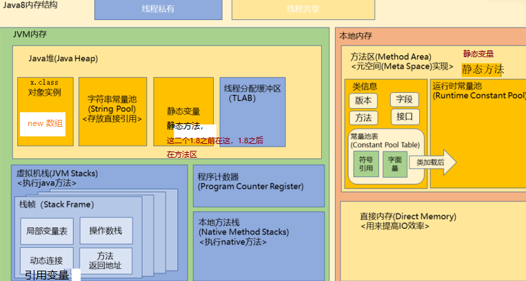

# java面试宝典

 

**★★★ 面试问题说明：**

1、根据大厂技术面试的实际场景，技术面试问题分为知识类面试问题和项目类面试问题。

2、所有知识类面试问题，按照技术难度和出现频率分类：

**技术难度：**基础1、拨高2、挑战3   

**出现频率：**常见1、高频2、必考3   

 

**★★★ 技术面试考核目标：**

**1、听得懂：**能准确理解面试官提问的重点和考核方向。

**2、答得出：**能使用自己的语言，准确回答面试问题。

**3、有拓展：**能在回答面试官问题的基础上，适当拓展问题深度和广度。

后期补充：

1 最后面再列题目列表，只有题，没有答案

  并有表格，可以标记，不熟悉的题


# 第一部分：知识类面试问题

## 模块1：JavaSE 基础编程

### 面试题1.1  java为什么能够跨平台运行？

**【技术难度：基础   出现频率：高**频** **】**

**1.java程序是‘一次编译，跨平台运行的’**靠的是JVM，也就是Java虚拟机。

**JVM的作用**：把Java字节码（.class文件）翻译成当前操作系统能理解的机器码。  

- 不同操作系统（Windows/Linux/Mac）有各自对应的JVM，但都遵循同一套规范。   

**场景案例**：  “我之前写的一个案例，在学校的Windows电脑编译后，linux上也可直接运行,只要linux上装了JVM就可以”  

**2.详细的说是编译与解释的过程**

- **第一步：编译**  
  
  - 通过javac命令把Java源码（.java文件）编译成**字节码**（.class文件）
  
  ```bash
  比如  javac HelloWorld.java  # 生成HelloWorld.class
  ```
  
- **第二步：翻译执行
  
  - 通过`java`命令读取.class文件
  ```bash
  比如 java HelloWorld  # 在任意装了JVM的系统上运行程序
  ```

**3. 跨平台优点与缺点**  

- **优点**：开发效率高，不用为不同系统写多套代码
- **缺点**：  
  - 需要安装JVM。  
  - 性能比直接编译成机器码的语言（如C++）略低 

- **总结**  

“Java跨平台的本质是**用JVM解析.class文件**。开发者只需关注业务代码，JVM负责适配不同运行系统。这也是为什么Java在企业级开发中这么盛行——像银行、电商的系统要跑在各种服务器上，跨平台方便的多”  


### 面试题1.2  Java代码是如何运行的?

**【技术难度：1   出现频率： 1 】**

**Java代码运行全过程**，分三步  

1. **通过javac先编译成字节码**  
```java
比如  javac HelloWorld.java 用`javac命令`编译生成.class文件
```
2. **类加载器把字节码加载到JVM**  
JVM会用ClassLoader把.class文件加载到方法区。

3. **解释执行**  
JVM逐条翻译字节码,并运行

总的来说：Java代码运行是编译→加载→执行的流程，核心是JVM。这种设计比较安全，比如编译时会有字节码验证，像检查类之间的依赖是否合法、局部变量类型匹配**

 

### 面试题1.3  JVM，JRE，JDK 分别是什么

**【技术难度： 2   出现频率：1  】**

**1. JVM（Java虚拟机）**  
是把java文件编译成.class文件。所以能'一次编译到处运行'，因为同样的字节码在Windows/Linux的JVM里都能运行。  

**2. JRE（Java运行环境）**  
是运行Java应用程序的必要环境，包含Java虚拟机（JVM）和核心类库，确保Java程序跨平台运行。

**3. JDK（Java开发工具包）**  
 这包含JRE+编译工具（javac）等。

**总结** 
JDK包含JRE，然后JRE包含JVM。


### 面试题1.4  Java中有哪些基本类型？

**【技术难度：1   出现频率：1  】**

Java的基本类型有8种，先看整数：

1. 整数  

- `byte`：1字节（-128~127），适合数值小、IO流中处理数据流，比如用`byte[]`读取。  
- `short`：2字节。  
- **`int`**：4字节，日常使用最多的！
- `long`：8字节，处理大数值时用。上次做时间戳转换，`System.currentTimeMillis()`返回的就是long。  

2. 浮点

- `float`：4字节，带f后缀。  
- **`double`**：8字节，以d结尾，如果不加d,默认的浮点类型。

3. 字符类型

- `char`：2字节，存Unicode字符。比如`char c = 'A';`

4. 布尔类型

- `boolean`：在jvm中占1字节。逻辑判断专用，只有真、假

**总结：**8个关键字：`byte short int long float double char boolean`，实际开发中：  整数默认用int，浮点数默认用double  

### 面试题1.5  char为什么能存储一个汉字？

**【技术难度：  1  出现频率：1  】**

`char`能存汉字是因为Java支持Unicode编码，`char`固定2字节，正好对应UTF-16编码的基本单元  

 

### 面试题1.6  谈谈&和&&的区别？

**【技术难度： 1   出现频率：1  】**

一、**作为逻辑运算符使用**：

1. **&&（短路 与）**  
```java
if (user != null && user.isVip()) { ... }  
```
- **特性**：如果`user == null`为false，直接跳过后面判断，不会空指针  
- **场景**：适合需要**安全检查**的场景，比如验证参数后再执行操作  

2. **&（非短路与）**  
```java
if (checkPermission() & validateToken()) { ... }  
```
- **特性**：不管前面结果如何，**后面条件一定执行**  
- **实战**：风控系统功能中，必须同时记录两次校验日志，这时候就不能用&&  

---

二、**&还能做"位运算操作"**：  

```java
int n = 5; // 二进制 0101  
System.out.println(n & 1); // 通过比对0101，最后输出1  
```
三、使用注意  

**误用&导致异常**：  

```java
if (user != null & user.getEmail() != null) { ... }  
```
当`user`为空会抛空指针异常，如果使用&&至少能避免后面的检查  


总结：  

- **逻辑判断**优先用`&&`，避免空指针和无效计算 ，提示效率

- **需要强制执行所有条件**时（如资源释放、日志记录）用`&`  

- **位运算场景**用`& `

  

### 面试题1.7  switch语句里面的条件可不可以是byte、long、String？使用时候还应注意什么？

**【技术难度： 1   出现频率：1  】** 
switch的条件支持情况其实分版本：  

**1. 支持的类型**  

- **byte/short/char**：可以，因为它们会自动提升为int  
- **int**：最常用
- **枚举**：支持
- **String**：Java 7+支持
- Byte、Short、Integer、Character也支持
  这些类型在switch中的处理原理是通过底层拆箱操作转换为 int 类型进行匹配

**2. 不支持的类型**

- **long**：不行！  
- 浮点型（float/double）：不行，因为浮点数精度问题

**3. 常见问题**  

- **String大小写敏感**：`case "get"`不会匹配"GET"  
- 不能有相同的case
- 不写break会穿透
- default的位置可以任意调整，但不影响它最后判断
- Java 12+可以用箭头语法简化

```java
String result = switch(day) {
    case "MON" -> "工作日";
    case "SAT", "SUN" -> "周末";
    default -> throw new IllegalArgumentException();
};
```


### 面试题1.8  return，break，continue 的区别

**【技术难度： 1   出现频率：1  】**

**return是直接跳出本方法，break结束所在的循环/switch结构体，continue跳出本轮循环接着下一轮循环**。  

---

一、return：直接跳出本方法  

- **场景**：做登录功能，验证失败直接`return "ERROR"`，后面的逻辑都不执行了  
---

二、break：停止所在的循环或结构体  

- 还能跳出多层循环
```java  
outer: for (int i=0; i<3; i++) {  
    for (int j=0; j<3; j++) {  
        if (j == 2) 
            break outer; // 直接跳出外层循环  
    }  
}  
```

---

三、continue：跳过本轮、接着下一轮

---

总结：  

| 关键字   | 作用场景    | 行为特点                 |
| -------- | ----------- | ------------------------ |
| return   | 方法内      | 直接跳出方法             |
| break    | 循环/switch | 立刻终止当前循环或结构体 |
| continue | 循环体      | 跳过本轮，继续下一轮     |

## 模块2：JavaSE 面向对象编程

### 面试题2.1  JVM内存划分

**【技术难度： 3   出现频率：必考  】**

---

一、整体分这几块 



JVM内存可以分为线程共享部分和线程独享部分，共享部分有堆和方法区（或称元空间），独享部分有栈、本地方法栈、程序计数器。那每块区域存什么内容，再看

```
┌────────────────────────────┐
│        方法区（元空间）      │←─类信息、常量池  
├────────────────────────────┤
│          堆内存            │←─对象实例  
├────────────────────────────┤
│     栈（每个线程私有）      │←─方法调用、局部变量  
├────────────────────────────┤
│   本地方法栈（Native方法）  │←─JNI调用  
├────────────────────────────┤
│       程序计数器（PC）      │←─记录指令位置  
└────────────────────────────┘
```

二、核心区域详解  

1. **堆内存（Heap）**线程共享  

- **作用**：存放`new`出来的对象、数据，比如`User user = new User();`  
- **分代管理**：  
  - **新生代（Eden/S0/S1）**：比如临时数据 
  - **老年代（Old）**：存活久的对象（比如单例对象）  

2. **方法区（Metaspace）**  线程共享

- **作用**：存类定义、静态变量、常量池  
- **Java 8变化**：永久代（PermGen）→ 元空间（Metaspace），使用本地内存    

3. **栈（Stack）**  

- **特点**：线程私有，含局部变量、引用变量  
4. **程序计数器（PC Register）**  

- **作用**：记录当前线程执行的字节码行号，(下一条指含的地址)

- **特点**：唯一不会OOM的区域  

  总结：  JVM内存可以分为线程共享部分和线程独享部分，共享部分有堆和方法区（或称元空间），独享部分有栈、本地方法栈、程序计数器。
  
  5.本地方法栈：会定义一些navtive方法用的，内部结构用的

### 面试题2.2  heap和stack有什么区别?

**【技术难度： 3   出现频率：高****频** **】**

一、核心区别（对比表）  

| **维度**     | **Heap（堆）**                      | **Stack（栈）**                    |
| ------------ | ----------------------------------- | ---------------------------------- |
| **作用**     | 存放对象实例（new出来的对象、数据） | 存放局部变量、引用变量、方法调用、 |
| **归属**     | 线程共享（所有线程都能访问）        | 线程私有（每个线程都有自己的栈）   |
| **生命周期** | 手动new后由GC回收                   | 方法调用完自动释放                 |
| **异常类型** | `OutOfMemoryError`（堆溢出）        | `StackOverflowError`（栈溢出）     |
| **性能影响** | 大对象频繁分配→GC压力大             | 深递归→栈溢出风险                  |

总结：  

- **Heap**：存放所有对象，需要GC打扫，容易堆积垃圾  
- Stack：用完即走，干净利索  
遇到OOM先看日志是堆还是栈爆掉——堆溢出用MAT（Memory Analyzer Tool）分析对象，栈溢出查递归或线程数 

### 面试题2.3  面向对象的基本特征是什么？

**【技术难度：  2  出现频率：高****频** **】**

**面向对象编程的四个基本特征是：封装、继承、多态和抽象。我用通俗的例子给您说明一下。**

---

#### **1. 封装**
**核心思想**：**“藏起来，别乱碰”**。  
把数据看情况设为（private 或public等），可以通过公开的方法（getter/setter）控制访问。  
**例子**：  

```java
class BankAccount {
    private double balance; // 余额不能随便改
    public void deposit(double amount) { balance += amount; }
}
```
**为啥重要**？  
比如银行账户余额，不能让外部直接修改数值，必须通过存款方法，这样能保证逻辑安全（比如加个验证金额是否为负）。

---

#### **2. 继承**
**核心思想**：**“儿子继承老子”**。  
子类复用父类的属性和方法，减少重复代码。  
**例子**：  

```java
class Animal { void eat() { System.out.println("吃东西"); } }
class Dog extends Animal { void bark() { System.out.println("汪汪！"); } }
```
**Dog类自动拥有eat方法**，就像狗继承了动物的吃东西能力。

---

#### **3. 多态**
**核心思想**：**“同一件事，不同做法”**。  
同一个方法在不同对象中有不同实现，分为**编译时多态（重载）**和**运行时多态（重写）**。  
**例子**：  

```java
class Animal { void makeSound() { System.out.println("叫"); } }
class Cat extends Animal { 
    @Override 
    void makeSound() { System.out.println("喵~"); } 
}

Animal a = new Cat(); 
a.makeSound(); // 输出“喵~”，实际调用的是Cat的实现
```
**关键点**：  
- **运行时决定调用哪个方法**（JVM通过虚方法表实现）

---

#### **4. 抽象**
**核心思想**：**“抓重点，忽略细节”**。  
把共性的行为设为抽象，定义规范，不关心具体实现。  
**例子**：  

```java
interface Drawable { void draw(); } // 抽象类也可以
class Circle implements Drawable {
    public void draw() { System.out.println("画圆"); }
}
```
**实际用途**：  
比如开发支付功能，抽象出`PaymentStrategy`接口，微信支付、支付宝支付具体实现，业务层无需关心细节。

---

#### **总结一下**  
这四个特征是相辅相成的：  
- **封装**保证安全，**继承**减少冗余，**多态**灵活扩展，**抽象**统一规范。  
- 实际开发中比如Spring框架大量用到多态和抽象，设计模式里更是随处可见。  


### 面试题2.4  java中实现多态的机制是什么？

**【技术难度：  2  出现频率：高****频** **】**

java实现多态的机制有下面几种：

**1. 使用继承实现**  
多态必须建立在继承或接口实现上，比如class Dog extends Animal,再重写父类的方法

关键点：子类必须重写父类方法，否则就是调用父类版本

**2. 向上转型**  
父类引用指向子类对象时 

```java
Animal a1 = new Dog(); // 向上转型
a1.sound(); // 执行Dog类的sound方法
```
**3. 动态绑定**
JVM在运行时调用：  如：用多态优化支付系统：  

```java
Payment payment = getPayment(); // 可能返回Alipay或WechatPay对象
payment.pay(xx); // 运行时才知道调用哪个pay()
```
**4. 使用接口多态**  
接口让多态更自由，比如：  

```java
interface Flyable {
    void fly();
}
class Bird implements Flyable {
    public void fly() { System.out.println("扑腾翅膀"); }
}
Flyable f = new Bird(); // 
f.fly();//多态
```
**总结**  多态实现机制有：  

1. 使用继承、接口  
2. 向上转型
3. 动态绑定

### 面试题2.5  成员变量与局部变量的区别有哪些？

**【技术难度： 1   出现频率：常见  】**

 成员变量与局部变量的区别有：

**1. 定义位置不同**

- **成员变量**（也叫类变量）：直接在类里定义的变量，包含实例变量与静态变量
```java
public class Cat {
    String name; // 成员变量
    static int count; // 静态成员变量
}
```
- **局部变量**：在方法或代码块里定义的，出了这个范围就用不了。
```java
public void feed() {
    int food = 100; // 局部变量
}
```

**2. 生命周期不同**  

- 成员变量：对象存在就一直活着 
- 局部变量：方法执行完就消失    

**3. 默认值不同**  

- 成员变量：JVM会给默认值（int是0,string是null）  
- 局部变量：必须手动初始化，否则编译报错  

**4. 访问修饰符不同**  

- 成员变量：可以用public/private等控制访问  
- 局部变量：没有修饰符，只能在当前作用域用  

**5. 内存位置不同** 

- 成员变量：在堆内存，在对象里，
- 局部变量：在栈内存(比如 int类型)  

**总结**  
成员变量在类中，局部变量在方法中；成员变量有默认值，局部变量要初始化；成员变量能通过修饰符修饰，局部变量不用。在实际开发中：  

1. 在作为类中的属性的，用成员变量
2. 临时要用一次的变量，用局部变量 
3. 其中静态变量属于类，所有对象共享  


### 面试题2.6  值传递和引用传递的区别

**【技术难度：1   出现频率： 常见 】**

**Java只有值传递，没有引用传递,具体使用有**

1. **基本类型传递**：传的是数值副本，修改不影响原值。（10 → 10）  

2. **对象传递**：传的是引用地址的副本，但引用指向的对象本身在堆中是共享的。（0x1234 → 0x5678）  

- **比如**：就像快递单号复印了两份，改包裹内容（堆内存）会影响所有人，但换快递单号（栈内存）不影响原件  

总结：  **Java传递的永远是值传递，对象类型只是把地址当值传递**。

### 面试题2.7  当一个对象被当作参数传递到一个方法后，此方法可改变这个对象的属性，并可返回变化后的结果，那么这里到底是值传递还是引用传递?

**【技术难度：  1  出现频率：常见  】**

参考2.6


### 面试题2.8  为什么 Java 中只有值传递？

**【技术难度：1   出现频率：常见  】**

- **安全性**：避免方法内部意外修改外部变量（比如把外部引用指向null）。
- **一致性**：所有参数传递规则统一，不区分基本类型和对象。
- **简化并发编程**：局部变量副本减少线程竞争问题。

### 面试题2.9  static关键字的作用

**【技术难度：2   出现频率：常见  】**  
"static关键字作用有：

**1. 静态变量**  "所有对象共用的变量，归类所有的，一个变量只有一份，

使用场景：电商平台中，统计在线用户数

**2. 静态方法：**  
不需要创建对象就能用的方法，

使用场景：电商平台中，数学计算的相关方法  

```java
MathUtils.add(3, 5); // 不需要new对象
```

**3. 静态代码块：**  
类加载时自动执行的代码，比如初始化配置：  

使用场景：电商平台中，数据库连接池的初始配置

**4. 静态内部类：**  
独立于外部类的内部类，比如：  

```java
class Outer {
    static class Inner { // 静态内部类
        void show() {
            System.out.println("静态内部类");
        }
    }
}
// 使用
Outer.Inner inner = new Outer.Inner(); 
```

**5. 注意事项**  

- 静态方法里不能用this/super（❌）  
- 静态方法只能访问静态成员
- 静态变量在内存中只有一份    
  "比如main方法必须是static，因为程序启动时还没有对象，必须通过类名直接调用！"

**总结**  实际开发中：  

1. 统计数据用静态变量  
2. 工具方法可加static  
3. 初始化配置用静态块  

 

### 面试题2.10  静态变量和实例变量的区别？

**【技术难度： 1   出现频率：高****频** **】**  
静态变量和实例变量的区别有以下几点：

**1. 静态变量：**  所有对象共用的变量，归类所有，只有一份

使用场景：电商平台中，统计在线用户数  

- 通过类名直接访问（`Student.totalStudents`）  
- 所有对象共享同一份数据  
- 内存中只有一份，存储在方法区  

**2. 实例变量：**  
"每个对象独有的变量，比如学生学号：  

**3. 内存分配差异：**  

- **静态变量**：存储在 **方法区** 。
  - 所有类的实例共享同一块内存地址，生命周期与类的加载和卸载同步。
- **实例变量**：存储在 **堆内存** 中，每个对象实例在堆中拥有独立的内存空间。
  - 每次通过 `new` 创建对象时，JVM 会为该对象的实例变量分配新的内存区域。

**4. 初始化时机：**  

- 静态变量：类加载时初始化
- 实例变量：创建对象时初始化

**5. 运用场景：单例模式**  
单例模式当中的变量要加static，是因为要让所有地方都能访问同一个实例，

```java
class Singleton {
    private static Singleton instance; // 静态变量保证全局唯一
    
    private Singleton() {}
    
    public static Singleton getInstance() {
        if (instance == null) {
            instance = new Singleton();
        }
        return instance;
    }
}
```

**6. 使用注意** 

- **计数器**：使用实例变量
- **共享数据**：使用静态变量，比如数据库连接  

### 面试题2.11  一个静态方法，里面可不可以用this和super关键字

**【技术难度： 1   出现频率：常见  】**

**答案：**
静态方法中不能使用this和super关键字。因为这两个关键字都指向对象实例，而静态方法在归类所有，不须创建实例的。

1. **this**：指向当前对象实例

   比如：构造器中this.name = "Tom";

2. **super**：用于调用父类实例方法或属性

   注意：super不能用于static中

   ```java
   class Animal {
    void eat() { System.out.println("Eat"); }
   }
   class Dog extends Animal {
      static void test() {
      super.eat(); // 编译报错：Super cannot be used in static context
      }
   }
   ```


**总结：**
this/super需要对象实例支撑，而静态方法属于类所有，两者存在会有冲突。


### 面试题2.12  Overload和Override的区别

**【技术难度： 2  出现频率：高****频** **】**

**核心区别：**

- **Overload（重载）** ：同一类中方法名相同、参数不同（参数个数/类型/顺序），与返回值无关，属于**编译时多态**。

- **Override（重写）** ：子类重写父类方法，**方法签名必须一致**（方法名、参数、返回类型），访问权限≥父类，异常范围≤父类，属于**运行时多态**。

- **其他区别：**

  1. **使用场景**
     - Overload：同类中解决方法功能相似但参数不同的需求。
     - Override：子类修改父类方法，体现自己的行为。
  2. **绑定时机**
     - Overload：编译时根据参数类型决定调用哪个方法。
     - Override：运行时根据具体对象的调用来实现动态绑定。
  3. **特殊限制**
     - 静态方法、private方法不能被Override（但可Overload）

- 场景：在考试平台中，对于日期的处理,使用重载

  ```java
  public class DateParser {
      // 重载1：解析默认格式（yyyy-MM-dd）
      public static Date parse(String dateStr) throws ParseException {
          return new SimpleDateFormat("yyyy-MM-dd").parse(dateStr);
      }
      // 重载2：解析自定义格式 08/07/2025, dd/MM/yyyy
      public static Date parse(String dateStr, String pattern) throws ParseException {
          return new SimpleDateFormat(pattern).parse(dateStr);
      }
  }
  // 调用示例
  DateParser.parse("2025-07-08"); // 默认格式
  DateParser.parse("08/07/2025", "dd/MM/yyyy"); // 自定义格式
  ```

  场景：

  在电商系统要支持多种支付方式，使用重写来完成

  ```java
  // 父类：支付方式基类
  public abstract class PaymentMethod {
      public abstract void pay(double amount);
  }
  // 子类：支付宝支付（重写pay方法）
  public class Alipay extends PaymentMethod {
      @Override
      public void pay(double amount) {
          System.out.println("支付宝支付：" + amount + "元");
      }
  }
  // 子类：微信支付（重写pay方法）
  public class WeChatPay extends PaymentMethod {
      @Override
      public void pay(double amount) {
          System.out.println("微信支付：" + amount + "元");
      }
  }
  // 调用方：统一处理支付
  public class OrderService {
      public void checkout(PaymentMethod method, double amount) {
          method.pay(amount); // 多态：根据实际子类执行不同逻辑
      }
  }
  ```

**总结：**
Overload是**编译期**，通过参数差异化实现方法重载；Override是**运行时动态绑定**，通过重写来实现行为扩展。两者都是多态的体现形式


### 面试题2.13  Overload方法是否可以改变返回值的类型？

**【技术难度： 2   出现频率：高频** **】**

**答案：**
Overload方法**不能仅通过改变返回值类型**实现重载，必须是改变参数列表中的参数类型、个数或顺序。编译器无法仅凭返回值来区分方法。

**场景：**
在考试平台，得到用户模块中，为`getUser()`设计不同返回类型：

```java
public Student getUser(int id) { ... }
public Teacher getUser(int id) { ... } // 编译失败：方法签名冲突
```

**总结：**

Overload的核心是参数差异化，返回值类型不影响重载判定。


### 面试题2.14  为什么方法不能根据返回类型来区分重载？

**【技术难度：2   出现频率：高****频** **】**

**答案：**

因为方法重载是发生在编译期，编译器需要根据方法名和参数列表来决定调用哪个方法，返回值不是在编译期确定的。所以不能根据返回类型来区别重载。

 

### 面试题2.15  构造器可不可以被重载或重写？

**【技术难度：2   出现频率：高****频** **】**

**答案：**

**构造器可以被重载，但不能被重写。**

具体分两点说：

---

1. 构造器可以重载  

比如同一个类中可以有多个构造器，只要参数列表不同（类型、数量、顺序）。这是为了方便对象初始化时支持不同场景。  

实现场景：  

比如写一个`User`类，有时只需要默认构造器，有时还需要有id、name等参数的构造器

2. 构造器不能重写（Override）  

构造器是类初始化时调用的特殊方法，且方法名必须和类名相同。所以子类无法“覆盖”父类的名字的构造器，所以构造器不能重写，只是子类构造器可以通过super调用父类构造器  
**例子**：  

```java
public class Parent {
    public Parent(String msg) {
        System.out.println("Parent构造器: " + msg);
    }
}
public class Child extends Parent {
    public Child(String msg) { 
        super(msg); // 调用父类构造器
    }
}
```

---

总结：  

构造器支持重载，方便不同的初始化方式，但不能重写，因为它是类初始化时用的，并且和类名绑定） 


### 面试题2.16  在 Java 中定义⼀个不做事且没有参数的构造⽅法的作⽤

**【技术难度： 2   出现频率：常见  】**

**答案**：  
在Java中，定义一个不做事且没有参数的构造方法（即无参构造器）主要有三个作用：

1. 保证对象能被默认初始化  

如果类中没有显式定义任何构造器，Java会自动生成一个无参构造器。但如果类中定义了其他的带参构造器，Java就不会再自动生成无参构造器。那此时就要定义一个无参构造器了

2. 配合继承使用  

子类构造器默认会调用父类的无参构造器。可如果父类没有无参构造器，只有有参构造器，那子类不管业务须不须要，都必须调用父类的有参构造器，否则编译报错。所以父类有无参构造器时，子类就方便了。   

3. 作为代码规范  

在类中定义无参构造器可以：  

- 告诉其他地方“这个类支持默认初始化”。  
- 方便后续功能扩展。 

总结  

无参构造器的作用：  

1. 避免因手动定义其他构造器导致调用默认构造器报错的问题。  
2. 在继承场景中保证子类能正确调用父类构造器。  
3. 作为代码规范的占位符，提升可维护性。  

### 面试题2.17  创建一个子类对象，请写出：父类静态代码块，父类构造方法，父类代码块，子类代码块，子类构造，子类静态代码块。这六个对象的执行顺序

**【技术难度： 2   出现频率： 常见 】**

**答案**：  
创建一个子类对象时，父类和子类的静态代码块、代码块、构造方法的执行顺序如下：  

1. **父类静态代码块**，在类加载时执行，只执行一次  
2. **子类静态代码块**，在类加载时执行，只执行一次
3. **父类代码块**，每次创建对象时执行，在父类构造方法之前
4. **父类构造方法**  
5. **子类代码块**每次创建对象时执行，在子类构造方法之前
6. **子类构造方法**  

---

代码示例验证顺序  

```java
public class Parent {
    static {
        System.out.println("1. 父类静态代码块");
    }

    {
        System.out.println("3. 父类代码块");
    }

    public Parent() {
        System.out.println("4. 父类构造方法");
    }
}

public class Child extends Parent {
    static {
        System.out.println("2. 子类静态代码块");
    }

    {
        System.out.println("5. 子类代码块");
    }

    public Child() {
        System.out.println("6. 子类构造方法");
    }

    public static void main(String[] args) {
        new Child(); // 创建子类对象
    }
}
```

**输出结果**：  

```
1. 父类静态代码块  
2. 子类静态代码块  
3. 父类代码块  
4. 父类构造方法  
5. 子类代码块  
6. 子类构造方法  
```

---

使用场景：

1.静态代码块常用于单例模式的初始化

2.做考试平台时，数据库连接信息用静态代码块

总结：

1、记住这个口诀：**“静态优先，父类优先，代码块早于构造方法”**

2、静态代码块因为是优先的：适合初始化类级别的资源，如数据库连接。    

3、父子类顺序：父类先初始化，再初始化子类。  

---

 

### 面试题2.18  Java中访问修饰符有哪些? 作用域public，private，protected，以及不写时的区别

**【技术难度：  1  出现频率： 常见 】**

**答案**：  
Java中有4种访问修饰符：`public`、`protected`、`private`，以及不写，不写就是默认default。它们的作用域区别如下：

---

1. **`public`（公开的）**  

- **作用域**：任何地方都能访问, 同包、不同包、子类。  
- **使用场景**：电商平台时，工具类的一些计算的方法、全局可用的常量（比如`Math.PI`）。  

---

2. **`private`（私有的）**  

- **作用域**：仅在**当前类内部**访问,当子类、同包其他类都无法访问。  
- **使用场景**：电商平台中，商户的卡信息，用来保护内部数据，比如私密的属性。  

---

3. **`protected`（受保护的）**  

- **作用域**：**同包** + **不同包的子类**，其他情况无法访问，允许子类继承或重写父类方法。  

- **使用场景**：

- 电商系统用户模块，开发用户基类时，定义可被子类扩展的权限校验方法

  ```java
  // 父类：用户基类
  public class User {
      protected void checkPermission() { // protected方法：子类可访问
          System.out.println("通用权限校验");
      }
  }
  // 子类：VIP用户
  public class VIPUser extends User {
      @Override
      protected void checkPermission() { // 重写protected方法
          System.out.println("VIP用户权限校验");
      }
      public void placeOrder() {
          checkPermission(); // 子类调用protected方法
      }
  
  ```

**4. 不写（default/默认）**  

- **作用域**：仅在**同一个包内**访问,子类在不同包也无法访问。限制模块内部使用,比如商品业务类仅供同包类调用  

- **使用场景**：开发订单工具类时，限制包外直接访问内部逻辑

  ```java
  // 工具类：订单工具
  class OrderUtils { // 默认权限类：包外不可访问
      static void validateOrder(Order order) { // 默认权限方法：包内可见
          if (order.getAmount() < 0) {
              throw new IllegalArgumentException("订单金额不能为负");
          }
      }
  }
  // 订单服务类（同一包内）
  public class OrderService {
      public void createOrder(Order order) {
          OrderUtils.validateOrder(order); // 包内可调用默认方法
          // 创建订单逻辑...
      }
  }
  ```

  

---

对比表  

| 修饰符       | 当前类 | 同包 | 子类（不同包） | 其他包 |
| ------------ | ------ | ---- | -------------- | ------ |
| `public`     | ✔️      | ✔️    | ✔️              | ✔️      |
| `protected`  | ✔️      | ✔️    | ✔️              | ❌      |
| 不写（默认） | ✔️      | ✔️    | ❌              | ❌      |
| `private`    | ✔️      | ❌    | ❌              | ❌      |

---

总结  

- **`public`**：全局开放，适合工具类或常量。  
- **`private`**：限于本class，保护数据安全。  
- **`protected`**：允许子类或继承。  
- **不写**：限制在本包内用。  


### 面试题2.19  final关键字的用法？

**【技术难度：1   出现频率：常见  】**

**答案**：  
`final`关键字在Java中有三种主要用法，分别对应不同的场景：**修饰变量、方法、类**。它的核心作用是“不可变”，具体有。

---

1. **`final` 修饰变量**  

- **作用**：变量一旦赋值后就不能再修改，类似常量。  
- **关键点**：  
  - 基本类型：值不可变。  
  - 引用类型：引用地址不可变。  
- **使用场景**：常量的使用。  
  2. **`final` 修饰方法**  

- **作用**：此方法不能被子类重写，但可以重载。  
- **关键点**：  
  - 防止子类修改核心逻辑，比如工具类的方法。  

3. **`final` 修饰类**  

- **作用**：类不能被继承，比如`String`、`Integer`。  
- **关键点**：  
  - 防止扩展破坏原有设计，如工具类。  

使用场景：电商系统配置类和配置信息，需确保关键参数不被篡改

```java
// final类：禁止继承，保证配置安全性
public final class ConfigManager {
    private static final String CONFIG_PATH = "/config/prod.properties"; // final变量不可修改

    public static String getConfig() {
        return CONFIG_PATH;
    }
}
// 其他类无法继承ConfigManager，且CONFIG_PATH值固定
```

总结  

- **修饰变量时**：值不可变。  
- **修饰方法**时：不可重写。  
- **修饰类**时：不可继承。  

 

### 面试题2.20  抽象类和接口的区别？什么时间考虑用抽象类，什么时间考虑用接口？

**【技术难度：2   出现频率：高****频** **】**

- **答案**：  
  抽象类和接口的核心区别是下面几点

  1. **定义方式不同**  
     - 抽象类：用`abstract class`，可以包含**抽象方法**和**具体方法**。  
     - 接口：用`interface`，所有方法默认全是抽象方法，Java 8后允许default方法。  

  2. **单继承/多实现**  
     - 抽象类：一个类**只能继承一个**抽象类，单继承。  
     - 接口：一个类**可以实现多个**接口，多实现。  

  3. **成员变量**  
     - 抽象类：可以有**普通变量**，如`int x = 10;`。  
     - 接口：变量默认是`public static final`，是常量。  

  4. **构造方法**  
     - 抽象类：**可以有构造方法**。  
     - 接口：**不能有构造方法**，因为接口没有对象实例化。  

  5. **适用场景** 不同 
     - 抽象类：当各个子类需要用到父类共有部分代码（父类有些子类要公用的属性和方法，还可可能含有抽象方法）。  
     - 接口：定义一些方法的规范，如数据库查询的规范，具体查的细节不同。 

  使用场景：

  抽象类案例，电商系统用户基类，开发用户模块时，定义公共逻辑和抽象方法供子类扩展。

  ```
  // 抽象类：用户基类
  public abstract class User {
      private String name; // 成员变量
  
      public User(String name) { // 构造方法
          this.name = name;
      }
  
      // 抽象方法：子类必须实现
      public abstract void login();
  
      // 具体方法：公共逻辑
      public void logout() {
          System.out.println(name + "已退出");
      }
  }
  // 子类：普通用户
  public class NormalUser extends User {
      public NormalUser(String name) {
          super(name);
      }
  
      @Override
      public void login() {
          System.out.println("普通用户" + getName() + "登录");
      }
  }
  // 子类：VIP用户（复用基类构造方法）
  public class VIPUser extends User {
      public VIPUser(String name) {
          super(name);
      }
  
      @Override
      public void login() {
          System.out.println("VIP用户" + getName() + "登录");
      }
  }
  ```

  接口案例：电商系统中多种支付方式实现，通过接口统一支付逻辑。

  ```
  // 接口：支付规范
  public interface Payment {
      void pay(double amount); // 抽象方法
  
      // Java8+默认方法：公共逻辑
      default void printReceipt(double amount) {
          System.out.println("支付凭证：" + amount + "元");
      }
  }
  // 实现类：支付宝支付
  public class Alipay implements Payment {
      @Override
      public void pay(double amount) {
          System.out.println("支付宝支付：" + amount + "元");
      }
  }
  // 实现类：微信支付（复用默认方法）
  public class WeChatPay implements Payment {
      @Override
      public void pay(double amount) {
          System.out.println("微信支付：" + amount + "元");
      }
  }
  // 调用方：统一处理支付
  public class OrderService {
      public void checkout(Payment payment, double amount) {
          payment.pay(amount);
          payment.printReceipt(amount); // 调用接口默认方法
      }
  }
  ```

  **2、如何选择？**  

  1. **用抽象类的情况**：  
     - 子类需要用到父类的部分代码，并有**部分是自己的实现**。  
  2. **用接口的情况**：  
     - 需要**多实现的情况**。  
     - 需要**定义一些方法的规范**（如一个接定义了一个方法,那所有的实现类必须实现这方法）。    

  ---

  **3、总结**  

  - **抽象类**是“**一个类**”，强调代码复用和继承关系。  
  - **接口**是“**一种规范**”，强调多实现和规范定义。  

   

### 面试题2.21  接口是什么？为什么要使用接口而不是直接使用具体类？

**【技术难度： 2   出现频率：高****频** **】**

**答案**：  
接口是Java里的一种**“规范”**，它可以定义一些方法的声明，但不提供具体实现。用接口核心是为了**解耦、扩展和灵活替换**。具体有：

1. **解耦代码，降低依赖**  
   - **场景**：支付系统里，定义`Payment`接口，实现类可以为支付宝、微信支付分别实现它。调用时只需调用`payment.pay()`，不用改代码就能切换支付宝、微信方式。  可以降低定义方、支付宝、微信的类的相互依赖
2. **支持多态，灵活扩展**  
   - 一个类可以实现多个接口，Java类是单继承做不到，但接口可以。  
   - **场景**：游戏里角色可以装备不同武器，定义`Weapon`接口，有个攻击方法，当剑、枪、魔法棒各自实现这攻击方法，切换实现类实现不同的效果。  
3. **规范约束，统一行为**  
   - 接口是一种规范，所有实现类必须其抽象方法。
   - **场景**：定义一个日志的`Logger`接口，提供`info()`、`error()`方法，这样实现类都要实现这些抽象方法，遵守了规范。  

当java8之后，接口也支持

1. **defalut方法： 

   ```java
   interface Logger {
       default void log(String msg) { 
           System.out.println("[DEFAULT] " + msg);
       }
   }
   ```

2. ** 还支持静态方法**：

   ```java
   interface StringUtils {
       static boolean isEmpty(String str) {
           return str == null || str.trim().isEmpty();
       }
   }
   ```

接口使用场景：电商系统中，支持多种支付方式，通过接口实现。

```
// 接口：支付规范
public interface Payment {
    void pay(double amount); // 抽象方法

    // Java8+默认方法：公共逻辑
    default void printReceipt(double amount) {
        System.out.println("支付凭证：" + amount + "元");
    }
}
// 实现类：支付宝支付
public class Alipay implements Payment {
    @Override
    public void pay(double amount) {
        System.out.println("支付宝支付：" + amount + "元");
    }
}
// 实现类：微信支付（复用默认方法）
public class WeChatPay implements Payment {
    @Override
    public void pay(double amount) {
        System.out.println("微信支付：" + amount + "元");
    }
}
// 调用方：统一处理支付
public class OrderService {
    public void checkout(Payment payment, double amount) {
        payment.pay(amount);
        payment.printReceipt(amount); // 调用接口默认方法
    }
}
```

**总结**  

- **接口的本质**：是一种规范，不是类。  
- **用接口的好处**：  
  1. 解耦调用方和实现方。  
  2. 支持多态，方便扩展新功能。  
  3. 统一规范，提高代码可维护性。  


### 面试题2.22  什么是类？什么是对象？什么是接口？接口的实现和类的继承有什么本质区别

**【技术难度： 2   出现频率：高****频** **】**

**答案**：  

1. **类（Class）**  
   - **概念**：具有共同特性的一个抽象概念。  
   - 场景：像“汽车设计图”，定义了车的类，再定义属性（颜色、轮子数）和方法（启动、刹车）。

2. **对象（Object）**  
   - **概念**：对象是类的实例。  
   - **场景**：像“根据设计图造出的真车”，有具体颜色和可操作的行为。   

3. **接口（Interface）**  
   - **概念**：接口只定义方法声明，不提供实现。  
   - 场景：像“驾照考试行为标准”，规定“必须会倒车准确入库”


**2、接口 vs 类的继承的区别有：**  

2.1 **类是通过继承extends**，接口是通过实现implements

2.2 继承是继承父类部分代码 ，并子类可以扩展自己的功能，并只有单继承

2.3 接口是定义一些行为的规范 ，还可以多实现

2.4 类的继承，可直接用父类方法，也可重写父类方法，实现类必须实现接口中所有抽象方法

2.5 使用场景：

类的继承使用场景：游戏角色设计，设计游戏角色，有“战士”和“法师”两种，都继承自“角色”基类

接口使用场景：付系统设计:支持支付宝、微信支付，未来可能新增银联支付

```
// 接口：支付规范
public interface Payment {
    void pay(double amount); // 抽象方法

    // Java8+默认方法：公共逻辑
    default void printReceipt(double amount) {
        System.out.println("支付凭证：" + amount + "元");
    }
}
// 实现类：支付宝支付
public class Alipay implements Payment {
    @Override
    public void pay(double amount) {
        System.out.println("支付宝支付：" + amount + "元");
    }
}
// 实现类：微信支付（复用默认方法）
public class WeChatPay implements Payment {
    @Override
    public void pay(double amount) {
        System.out.println("微信支付：" + amount + "元");
    }
}
// 调用方：统一处理支付
public class OrderService {
    public void checkout(Payment payment, double amount) {
        payment.pay(amount);
        payment.printReceipt(amount); // 调用接口默认方法
    }
}
```


3、总结  

- **类 vs 对象**：类是抽象概念，对象是实例。  
- 继承：子类继承父类，可代码复用。  
- 接口：是行为的规范。  

### 面试题2.23  Java中有没有多继承？

**【技术难度： 2   出现频率： 高****频** **】**

**答案**：  
Java**没有类的多继承**，也就是一个类不能同时继承多个父类，但**通过接口到达多继承的效果**因为一个类可以实现多个接口）。下面详细说下：

1. **避免“不规范的继承”问题**  
   - **比喻**：如果`A`是`B`和`C`的父类，`D`同时继承`B`和`C`，当`B`和`C`都重写了`A`的`method()`时，`D`该调用B的还是C的？Java直接禁止这种情况，省得纠结。  

**2.Java如果要达到多继承的效果，要通过接口来操作**  

- 因为一个类可以实现多个接口
- **案例**：企鹅同时要用到飞行和游泳。

```java
// 接口1：会飞
interface Flyable {
    void fly();
}

// 接口2：会游泳
interface Swimmable {
    void swim();
}
class Penguin implements Flyable, Swimmable {
    @Override
    public void fly() {
        System.out.println("企鹅扑腾翅膀（假装会飞）");
    }

    @Override
    public void swim() {
        System.out.println("企鹅优雅游泳");
    }
}
// 使用
Penguin p = new Penguin();
p.fly();   // 输出：企鹅扑腾翅膀
p.swim();  // 输出：企鹅优雅游泳
```

**3.实际项目中的使用场景**  :日志功能中的扩展

- **需求**：日志需要同时输出到控制台和文件。  

- **解决方案**：  

  ```java
  // 接口1：控制台日志
  interface ConsoleLogger {
      void logToConsole(String msg);
  }
  
  // 接口2：文件日志
  interface FileLogger {
      void logToFile(String msg);
  }
  
  // 具体实现类
  class DualLogger implements ConsoleLogger, FileLogger {
      @Override
      public void logToConsole(String msg) {
          System.out.println("Console: " + msg);
      }
  
      @Override
      public void logToFile(String msg) {
          System.out.println("File: " + msg); // 实际项目会写文件
      }
  }
  // 使用
  DualLogger logger = new DualLogger();
  logger.logToConsole("系统启动");
  logger.logToFile("系统启动");
  ```

---

**4.总结**  

1. **Java没有类的多继承**：避免不规范的继承问题。  

2. **用接口达到多继承的效果**：一个类可以实现多个接口。  

3. **运用场景**：  

   - 日志/支付等功能。  

     

### 面试题2.24  什么是内部类？分为哪几种？

**【技术难度：2   出现频率：常见  】**  
**答案**：  
内部类是**定义在另一个类内部或方法内的类**，主要用于**封装相关信息**或**访问外部类信息**。Java中分为**4种内部类**：成员内部类、静态内部类、局部内部类、匿名内部类。下面详细说一说：

1. **成员内部类**  

   - **定义**：直接嵌套在外部类中的非静态类。  

   - **特点**：  
     - 可访问外部类的所有成员，包括`private`。  

     - 必须通过`外部类实例.new`创建对象（如`outer.new Inner()`）。    

2. **静态内部类**  

   - **定义**：用`static`修饰的嵌套类。  
   - **特点**：  
     - 不依赖外部类实例，直接通过`外部类.静态内部类`访问（如`Outer.StaticInner`）。  
     - 只能访问外部类的静态成员。  

3. **局部内部类**  

   - **定义**：定义在方法或代码块中的类。  
   - **特点**：  
     - 仅在方法内可见，外部无法访问。  
     - 可访问方法的`final`信息。  

4. **匿名内部类**  

   - **定义**：没有名字的内部类，通常用于实现接口或继承类。  
   - **特点**：  
     - 必须继承一个类或实现一个接口。  

二、使用场景  

****1. 成员内部类：****

场景：账户类`Account`的有个内部类`Transaction`需要访问，账户类的私有属性`balance`。  

```java
class Account {
    private double balance = 1000;
    class Transaction {
        void printBalance() {
            System.out.println("Balance: " + balance); // 直接访问外部类私有成员
        }
    }
}
```

**2. 静态内部类：

**场景**：数学工具类`MathUtils`的静态内部类`Constants`存储常量。  用于解耦，后面单独使用MathUtils.Constants.PI就可以

```java
class MathUtils {
    static class Constants {
        public static final double PI = 3.14159;
    }
}
// 直接访问静态内部类
System.out.println(MathUtils.Constants.PI); // 输出：3.14159
```

3. 局部内部类：比如方法内信息封装 

**场景**：计算器方法中临时定义乘法器。  

```java
void calculate(int a, int b) {
    class Multiplier { // 局部内部类
        int multiply() { return a * b; } // 访问方法参数（隐式final）
        ...
    }
    System.out.println(new Multiplier().multiply()); // 输出：30
}
```

**4. 匿名内部类：简化事件监听**  

**场景**：按钮点击事件。  

```java
interface ClickListener { void onClick(); }

class Button {
    void setListener(ClickListener listener) { listener.onClick(); }
}
// 使用匿名内部类
Button btn = new Button();
btn.setListener(new ClickListener() {
    @Override
    public void onClick() {
        System.out.println("Button clicked!");
    }
});
// 输出：Button clicked!
```

---

三、内部类的核心优势  

1. **封装性**：隐藏实现细节。  
2. **访问权限**：成员内部类可直接访问外部类私有成员。  
3. **代码简洁**：匿名内部类减少代码。  

---

四、总结  

1. **特点**：  
   - 成员内部类:方便访问外部类的一些私有成员。  
   - 静态内部类：只能访问外部类的静态成员。  
   - 局部内部类：可以在方法内使用。  
   - 匿名内部类 ：减少代码。  

### 面试题2.25  为什么需要内部类？

**【技术难度：2   出现频率：常见  】**

**答案**：  
内部类存在的核心目的是增强代码的封装性，同时解决一些普通类无法直接实现的需求。具体有4个主要作用：访问外部类的私有成员、简化复杂逻辑的代码、实现回调机制、减少类文件数量。下面详细说明：

** 1. 直接访问外部类私有成员**  

- 可使用成员内部类

- 使用场景：  

  - 数据库连接信息的管理类需要操作外部类的的私有连接ip信息。  

- 代码：  

  ```java
  class DataPool {
      private List<String> connections = new ArrayList<>();
      // 内部类直接操作外部类私有列表
      class ConnectionManager {
          void addConnection(String ip) {
              connections.add(ip); // 直接访问private字段
          }
      }
  }
  ```

2. 简化复杂逻辑的代码组织  

- 解释：将逻辑上相关的类嵌套在一起，避免类文件过多导致的代码分散

** 3. 实现回调机制**  

- **解释**：匿名内部类可以快速实现接口或抽象类，并减少代码量

- **使用场景**：  

  - 多线程中任务使用。  

- **代码示例**：  

  ```java
  interface Callback {
      void onComplete(String result);//任务
  }
  class TaskRunner {
      void runTask(Callback callback) {
          new Thread(() -> {//匿名内部类
              String result = "Task done";
              callback.onComplete(result); //调用
          }).start();
      }
  }
  ```

4. ** 减少类文件数量**  

- **解释**：每个内部类会生成独立的`.class`文件，如`Outer$Inner.class`，但相比单独定义普通类，能避免类名冲突。  

- **使用场景**：  

  - 项目中工具类的集中管理，如将多个相关工具类，放到一个静态内部类中。  

- **代码示例**：  

  ```java
  class StringUtils {
      static class Formatter {
          static String capitalize(String s) {
              return s.substring(0, 1).toUpperCase() + s.substring(1);
          }
          //还有其它方法
      }
  }
  // 使用
  System.out.println(StringUtils.Formatter.capitalize("hello")); 
  ```

**5、总结**  

- 内部类提升了代码封装性和可读性，减少冗余文件。  

- 当需要操作外部类私有数据 ，可以使用成员内部类。  
- 当事件监听、线程任务，可以使用 匿名内部类。  

### 面试题2.26  局部内部类特性

**【技术难度：  2  出现频率：常见  】**

答案：  

局部内部类是定义在方法或代码块内部的类，它的核心特性包括：作用域限制、访问外部变量限制、无静态成员、实例化时机特殊（在方法内实例化）。下面详细说下：

**1. 作用域严格受限**  

- **解释**：局部内部类仅在定义它的方法或代码块内可见，外部无法直接访问。  

- **使用场景**：  

  - 员工类中，有个用餐卡的类

- **代码示例**：  

  ```java
  void processData() {//用餐的方法
      class DataValidator {//卡信息的类
          boolean isValid(int value) {
              return value > 0;
          }
      }
      //内部可用
      DataValidator validator = new DataValidator();
      System.out.println(validator.isValid(10)); // 输出：true
  }
  // 外部无法访问DataValidator类
  ```

2. **只能访问`final`**信息  

- **解释**：局部内部类可以访问方法内的局部变量，但变量必须是`final`信息。  

- **底层原因**：局部内部类的实例可能会在方法返回后继续存在，而局部变量存储在栈中，方法结束后会被销毁。因此Java会复制变量值到内部类实例中，要求变量不可变以避免数据不一致。  

- **使用场景**：  

  - 会员卡信息类调用身份证号。  

- **代码示例**：  

  ```java
      void starta(int cid) {
          final int cid = cid; // final
          class Card  {
              public void pay() {
                    String pattern = "^\\d{17}(\\d|x|X)$";
                    if(cid.matches(pattern)) {// 访问局部变量}
                      System.out.println("is valid");
                  }
              }
          }
          new Card().pay();
      }
  ```

3. 不能定义静态成员  

- **解释**：局部内部类是与实例绑定的，不能声明静态成员，包括静态变量、静态方法或静态代码块。  

- **例子**：  

  ```java
  void foo() {
      class Local {
          // static int x = 10; // 编译错误！
          static final int Y = 20; // 仅允许static final常量
      }
  }
  ```

4. 实例化必须在作用域内  

- **解释**：局部内部类的实例化必须在定义它的代码块内完成，无法在外部创建。  

- **使用场景**：  

  - 工具类，运算有关的方法。  

- **代码示例**：  

  ```java
  void calculate(int a, int b) {
      class Adder {
          int add() { return a + b; } // 访问方法参数
          //....
      }
      Adder adder = new Adder(); // 实例化必须在方法内
      System.out.println(adder.add()); // 输出：a+b的和
  }
  ```

---

3、总结  

局部内部类特性有：  

- 作用域限制在方法内。  
- 只能访问本方法内的final局部变量。  
- 无静态成员。  
- 必须在定义代码块内完成。  


### 面试题2.27  成员内部类与静态内部类的区别

**【技术难度：  2  出现频率：常见  】**

**答案**：  
成员内部类和静态内部类的核心区别是是否依赖外部类实例，下面详细说一说：

1. 实例化方式不同  

- 成员内部类：  
  - 必须依赖外部类实例，创建时需通过`外部类对象.new 内部类()`。  
- 静态内部类：  
  - 独立于外部类实例，直接通过`外部类.静态内部类`访问。  

代码示例：  

```java
class Outer {
    class Inner { void show() 
    { 
        System.out.println("Inner"); 
    } 
   }
   static class StaticInner { 
        void show() {           
            System.out.println("StaticInner"); 
        } 
    }
}
Outer outer = new Outer();
Outer.Inner inner = outer.new Inner(); // 必须通过外部类实例创建
Outer.StaticInner staticInner = new Outer.StaticInner(); // 直接创建
```

2. 访问外部类成员的权限  

- 成员内部类：  
  - 可直接访问外部类的所有成员，包括`private`字段和方法。  
  - 使用场景：需要操作外部类私有数据的工具类，如数据库连接。  
- 静态内部类：  
  - 只能访问外部类的静态成员,包括静态变量和静态方法。  
  - 使用场景：账户信息类中有卡信息管理类。  

代码示例：  

```java
class Account {
    private String name = "Alice";
    private static String BANK_NAME = "ABC Bank";
    class Manager {
        void printInfo() {
            System.out.println(name); // 访问外部类非静态成员
        }
    }
    static class StaticManager {
        void printBank() {
            System.out.println(BANK_NAME); // 只能访问静态成员
            // System.out.println(name); // 编译错误！
        }
    }
}
```

3. 生命周期  

- 成员内部类：  
  - 生命周期与外部类实例绑定，外部类销毁后内部类实例无法存活。  
- 静态内部类：  
  - 生命周期独立，即使外部类实例销毁，静态内部类实例仍可存在。  

总结  

- 需要访问外部类非静态成员,可以用成员内部类。  
- 需访问静态成员，可以用静态内部类。  

- 静态内部类适合定义工具方法。  


### 面试题2.28  异常的理解? 什么是检查性异常和非检查性异常？ Error和Exception的区别?

**【技术难度：2   出现频率： 常见 】**

答案：  异常是Java中处理程序运行时风险的标准机制，核心分为检查性异常（Checked Exception）和非检查性异常（Unchecked Exception），而`Error`和`Exception`是Throwable的两大子类。下面详细说一说：

1. 检查性异常（Checked Exception）  

- 解释：编译器可以在编译时检查是否所有可能的异常都被捕获或声明，这有助于及早发现潜在的问题，要通过try-catch或throws声明，否则编译不通过。比如文件不存在异常

- **使用场景**：  

  - 校园管理平台中的信息存文件：如FileNotFoundException异常。  

- **代码示例**：  

  ```java
  // 必须处理FileNotFoundException（检查性异常）
  try {
      FileInputStream fis = new FileInputStream("non_existent.txt");
  } catch (FileNotFoundException e) {
      System.out.println("文件不存在，请检查路径");
  }
  ```

2. 非检查性异常（Unchecked Exception）  

- **解释**：通常由程序逻辑错误引发，包括`RuntimeException`及其子类，如空指针、数组越界。  

- **使用场景**：  

  - 考试平台中的对题目标题的判断：NullPointerException异常。  

- **代码示例**：  

  ```java
  String title = null;
  System.out.println(title.length()); // 运行时抛出NullPointerException
  ```


3.Error和Exception都是Java异常体系的子类，但Error代表JVM级严重问题，通常程序无法正常运行；Exception是程序可处理的异常，需主动捕获或抛出,程序是可以接着正常运行的。具体有：

1. **Error**：属于`java.lang.Error`及其子类，描述JVM无法解决的问题，比如内存耗尽、线程栈溢出）。  
   - **场景**：考试平台中，多个线程启动考试，未合理设置JVM堆内存，导致了`OutOfMemoryError`，此时程序终止了。  

2. **Exception**：属于`java.lang.Exception`及其子类，描述**程序可预测或可处理的异常场景**，比如文件不存在。  
   - **场景**：考试平台中，上传头像时，当图片格式判断时，要捕获`IOException`

*4、总结  

- 检查性异常，是编译期强制处理，代表可恢复的风险。  
- 非检查性异常，是运行时逻辑错误，应通过数据、逻辑来避免。  
- Error，是JVM级错误，程序无法接着运行的。  

### 面试题2.29  说出十种常见的异常，请从检查性异常和非检查性异常来说

**【技术难度： 2   出现频率： 常见 】**

**答案**：  
Java异常分为检查性异常（Checked Exception）和非检查性异常（Unchecked Exception），**前者需在编译时处理（如捕获或声明），后者属于运行时异常（`RuntimeException`子类）**。下面详细说一说：

---

一、检查性异常（Checked Exception）  

需在方法声明或代码块中显式处理（`try-catch`或`throws`），通常由外部因素（如IO、网络）引发。  

1. **IOException**：输入输出操作失败（如文件读取/写入）。  

   - **场景**：电商系统导出订单时，文件路径错误触发异常。  

     ```java
     public void exportOrders(String path) throws IOException {
         FileWriter fw = new FileWriter(path); // 可能抛出IOException
         // 写入订单数据...
         fw.close();
     }
     ```

2. **SQLException**：数据库操作失败（如连接中断、SQL错误）。  

   - **场景**：电商系统中，用户登录时，数据库连接池故障导致查询失败。  

     ```java
     public User login(String username) throws SQLException {
         Connection conn = DriverManager.getConnection(DB_URL);
         PreparedStatement ps = conn.prepareStatement("SELECT * FROM users WHERE name=?");
         ps.setString(1, username);
         ResultSet rs = ps.executeQuery(); // 可能抛出SQLException
         // 处理结果...
         return user;
     }
     ```

3. **ClassNotFoundException**：类找不到（如动态加载类失败）。  

   - **场景**：考试系统中，通过反射加载类时路径错误。  

     ```java
     public Object loadPlugin(String className) throws ClassNotFoundException {
         Class<?> clazz = Class.forName(className); // 可能抛出ClassNotFoundException
         return clazz.newInstance();
     }
     ```

4. **InterruptedException**：线程被中断（如`Thread.sleep()`）。  

   - **案例**：考试系统中，多线程任务中，线程等待时被外部中断。  

     ```java
     public void runTask() {
         try {
             Thread.sleep(5000); // 可能抛出InterruptedException
         } catch (InterruptedException e) {
             System.err.println("任务被中断");
         }
     }
     ```

5. **FileNotFoundException**：文件未找到（`IOException`子类）。  

   - **场景**：考试平台中，读取配置文件时路径错误。  

     ```java
     public void loadConfig() throws FileNotFoundException {
         FileInputStream fis = new FileInputStream("config.properties"); // 可能抛出FileNotFoundException
         // 读取配置...
     }
     ```

---

二、非检查性异常（Unchecked Exception）  

属于`RuntimeException`，编译时不强制处理，通常由程序逻辑错误引发。  

1. NullPointerException：空对象访问方法或属性。  

   - **场景**：考试平台中，得到用户信息，未初始化对象直接调用方法。  

     ```java
     public void processUser(User user) {
         System.out.println(user.getName().toUpperCase()); // user为null时抛出NPE
     }
     ```

2. **ArrayIndexOutOfBoundsException**：数组访问越界。  

   - **场景**：考试平台中，得到题目，遍历数组时索引超出范围。  

     ```java
     public void printArray(int[] arr) {
         for (int i = 0; i <= arr.length; i++) { // i=arr.length时越界
             System.out.println(arr[i]);
         }
     }
     ```

3. **ClassCastException**：类型转换错误。  

   - **案例**：强制转换不兼容类型。  

     ```java
     Object obj = new Integer(10);
     String str = (String) obj; // 抛出ClassCastException
     ```

4. **IllegalArgumentException**：参数不合法。  

   - **场景**：电商平台中，后台设置价格时，传入负数到要求正数的方法。  

     ```java
     public void setAge(int age) {
         if (age < 0) {
             throw new IllegalArgumentException("年龄不能为负");
         }
         this.age = age;
     }
     ```

5. **ArithmeticException**：算术运算错误（如除以零）。  

   - **场景**：电商平台中，计算的方法。  

     ```java
     public void divide(int a, int b) {
         int result = a / b; // b=0时抛出ArithmeticException
         System.out.println(result);
     }
     ```

3、总结  

1. **检查性异常**：需处理，代表可以解决的外部错误（如IO、数据库）。  

2. **非检查性异常**：程序逻辑错误，需通过代码或逻辑解决（如空指针、越界）。  

   或：

   检查性异常
   IoException io异常
   ClassNotFoundException 找不到类的异常 检查性异常
   非检查性异常
   ArrayIndexOutOfBoundsException数组下标越界异常
   NegativeArraySizeException 数组长度异常
   ArithmeticException 算法异常
   InputMismatchException 输入匹配异常，主要是输入类型的问题
   ParseException 输入的内容或类型可能是对的，只是格式没有按要求
   IIIegalargumentException 参数异常
   NullPointerException  空指针异常
   NumberFormatException 转化成数字格式异常

### 面试题2.30  throw和throws的区别

**【技术难度： 2   出现频率：常见  】**

**答案**：  
throw和throws都是Java中处理异常的关键字，但throw用于方法内部抛出异常实例，而throws用于方法声明时抛出的异常类型。具体有：

1. **throw**：  
   - **作用**：在方法体中手动抛出一个异常对象，比如`throw new IllegalArgumentException()`。  
   - **关键点**：可以抛出任何`Throwable`子类对象。  只能抛出一个对象

2. **throws**：  
   - **作用**：在方法声明后抛出的检查性异常的类型，如`throws IOException`）。  
   - **关键点**：仅用于声明检查性异常，告知调用方必须处理这些异常，否则编译报错。后面可以接多个类  

3、使用过的场景  

**3.1场景**：开发电商系统用户注册模块时，需校验用户名唯一性，用的throw。  

```java
public class UserService {
    public void register(String username) {
        if (isUsernameExists(username)) {
            // 抛出自定义业务异常（非检查性）
            throw new UsernameExistsException("用户名" + username + "已被占用");
        }
        // 其他逻辑...
    }
}
```

#### **throws案例（配置文件读取）**  

3.2**场景**：开发考试平台时，调用配置文件，用throws处理文件可能不存在等。  

```java
public class ConfigLoader {
    // 声明可能抛出IOException（检查性异常）
    public void loadConfig() throws IOException {
        FileInputStream fis = new FileInputStream("config.properties");
        // 读取文件逻辑...
        fis.close();
    }
}
```

3.3 throws使用时要注意：  

- 避免过度声明无关或很大范围的异常，像`throws Exception`，应精确列出可能抛出的检查性异常。  

- 例子

  ```java
  // 不应该写Exception，应该写IOException
  public void readFile() throws Exception { 
  }
  ```

4、总结  

1. **throw是‘抛出对象’**：在代码中抛出异常对象。  
2. **throws是‘异常类型’**：在方法签名后列出潜在的检查性异常。  
   - 当业务逻辑错误，像参数校验，用`throw`抛出非检查性异常。  
   - 当外部依赖错误，像文件不存在，用`throws`声明检查性异常。  

### 面试题2.31  final，finally，finalize的区别

**【技术难度：  2  出现频率： 常见 】**

**答案**：  
**final用于限制修饰信息的可变性，表示最终，finally用于异常处理机制的最终，finalize用于对象销毁前的回收操作**。具体有：

1. **final**：  
   - **作用**：修饰类、方法、变量，分别表示“不可继承”“不可重写”“不可修改”。  
   - **关键点**：  
     - final类，如`String`，无法被继承。  
     - final方法，如`Object.equals()`，无法被子类重写。  
     - final变量，如`final int MAX_RETRY = 3`，赋值后值不可变。  
2. **finally**：  
   - **作用**：与`try`搭配使用，确保代码块无论是否抛出异常都会执行的。  
3. **finalize()**：  
   - **作用**：`Object`类的方法，对象被垃圾回收前由JVM调用，用于释放非托管资源。  

4. 

**final场景**：在开发电商系统中，配置信息的类用的是final，需确保关键参数不被篡改。  

```java
public final class ConfigManager { // final类防止继承
    private static final String CONFIG_PATH = "/config/prod.properties"; // final变量不可修改
    public static String getConfig() {
        return CONFIG_PATH;
    }
}
// 其他类无法继承ConfigManager，且CONFIG_PATH值固定
```

**finally场景**：开发考试平台的日志解析模块时，需确保文件流关闭。  

```java
public class LogParser {
    public void parseLog(String filePath) {
        FileInputStream fis = null;
        try {
            fis = new FileInputStream(filePath);
            // 读取日志逻辑...
        } catch (IOException e) {
            System.err.println("日志读取失败");
        } finally {
            if (fis != null) {
                try {
                    fis.close(); // finally确保流关闭
                } catch (IOException e) {
                    System.err.println("流关闭异常");
                }
            }
        }
    }
}
```

**finalize场景：**做电商项目时，处理资源释放 ，用finalize

```java
public class LegacyResource {
    private FileHandle handle;

    @Override
    protected void finalize() throws Throwable {
        try {
            handle.close(); // 垃圾回收前释放资源
        } finally {
            super.finalize();
        }
    }
}
// 现代Java中应改用AutoCloseable或Cleaner API
```

5、总结  

1. **final是‘不可变’**：用来修饰类、方法、变量。  
2. **finally是‘最终执行’**：结合try使用。  
3. **finalize是‘资源清理’**：对象销毁前的资源清理。  

## 模块3：JavaSE 高级编程

### 面试题3.1 什么是自动装箱与拆箱？用什么方式来装箱与拆箱？

自动装箱就是基本类型自动转成对象，拆箱就是反过来。比如Integer和int的关系。实际开发中用得挺多的，我给您举几个场景。

**场景1：集合存储**

```java
List<Integer> list = new ArrayList<>();
list.add(5); // 自动装箱 int->Integer
int sum = 0;
for(int num : list){ // 自动拆箱 Integer->int
    sum += num;
}
```

这里用泛型集合时必须存对象，但写代码完全不用管装箱过程，特别方便。

**场景2：参数传递**

```java
public void print(Integer val){
    System.out.println(val);
}
// 调用时可以直接传基本类型
print(10); // 自动装箱
```

**操作方式**：

- 装箱：Integer a=12; 自动装箱  或  Integer a = Integer.valueOf(3); 手动装箱
- 拆箱：int b = a.intValue();

有个容易踩坑的地方要提下：Integer缓存池！比如：

```java
Integer a = 127;
Integer b = 127;
System.out.println(a == b); // true（缓存池内）
Integer c = 128;
Integer d = 128; 相当于（Integer.valueOf(128)）再看源码，会有创建对象
System.out.println(c == d); // false（新建对象）
```

这个特性在做数据对比时特别容易出错，建议用equals比较。

**总结**：自动装拆箱让基本类型和对象转换变得透明，但需要注意三点：

1.空指针风险（比如从Map取可能为null的Integer）

2.性能损耗（高频转换影响效率）

3.缓存机制带来的陷阱。我在实际开发中遇到过因缓存导致的诡异bug，后来强制用equals解决了问题。

### 面试题3.2 int和Integer有什么区别？

**1. 基础属性不同**

- int是基本类型、原始类型，存数值
- Integer是对象类型，存对象引用

举个例子：

```java
int age = 25; // 直接存数值
Integer score = 95; // 存对象引用 0x112233
```

**2. 默认值陷阱**

```java
int count; // 默认0
Integer total; // 默认null
```

之前处理订单统计时，把total当0用直接报空指针，后来改成int才解决。

**3. 功能扩展**
Integer有int类型的相关的操作方法，比如：

```java
String numStr = "123";
int num = Integer.parseInt(numStr); // 字符串转数字
int max = Integer.max(10, 20); // 取最大值
```

这些在数据校验、接口参数处理时特别好用。

**4. 缓存机制**

```java
Integer a = 127;
Integer b = 127;
System.out.println(a == b); // true

Integer c = 128;
Integer d = 128;
System.out.println(c == d); // false
```

这在做项目时，如果用==比较缓存值会出大问题！

**5. 使用场景**

- 数值运算优先用int（比如游戏循环里的坐标计算）
- 集合框架必须用Integer（比如存用户分数排行榜）
- 需要null值判断时（比如数据库字段映射）

### 面试题3.3 谈谈你对Integer常量池的理解

Integer常量池其实是Java做的个小优化，就像超市的共享购物车一样，预先准备了一些常用的小数值对象。

Integer 类的常量池机制主要是针对从 -128 到 127 范围内的整数。在这个范围内，Integer 对象是共享的。当你创建一个在这个范围内的 Integer 对象时，Java 会从缓存池中返回已有对象，而不是重新创建一个新的对象。超出这个范围时，Integer 会创建新的对象

**核心机制**：
Java默认缓存了-128到127之间的Integer对象。比如：

```java
Integer a = 100;
Integer b = 100;
System.out.println(a == b); // true（共用同一对象）

Integer c = 200;
Integer d = 200;
System.out.println(c == d); // false（各自new对象）
```

**真实项目案例**：
之前做项目时，有个活动奖励配置，如果用户星级为系统幸运数，则获得奖励

```java
Integer start = getStart(); // 可能返回1或200
if(start == luckNumber){// 本意判断相等则送奖励，导致127以内可以正常获得奖励，超出部分无法获得。
    sendReward(); 
}
```

结果当星级是200时，导致判断不匹配，无法获得奖励！后来发现是缓存池外的对象比较导致的诡异bug，改用equals才解决。

**深度解析**：

1. **手动触发**：`Integer.valueOf(50)`会走缓存，而new Integer(50)不会
2. **JVM参数**：可以通过`-XX:AutoBoxCacheMax`调整上限（但很少改）
3. **性能考量**：高频创建小数值时，缓存能节省内存和GC压力

**总结**：

1. 永远用equals比较数值
2. 空指针风险（比如Integer null值参与比较）
3. 大数据量时合理利用缓存特性优化性能

### 面试题3.4 字符串常量池了解吗？

JDK8之后的字符串常量池主要有三个重要变化：

**1. 搬家啦！从永久代到元空间**
之前在JDK6及以前，字符串常量池在永久代里，就像住在老小区。JDK7之后搬到了堆内存，好处是：

- **JDK6及以前**：常量池在永久代（PermGen），默认最大容量很小（比如32M）
- **JDK7之后**：搬到堆内存（Heap），跟着堆的空间走，不容易OOM

**实战案例**：  
之前做项目功能时，动态生成产品序号：

```java
for(int i=0; i<100000; i++){
    String sku = "PROD-"+i; // 字面量会自动入池
}
```

JDK7容易报`java.lang.OutOfMemoryError: PermGen space`，升级JDK8后问题消失。

**GC策略更智能**
堆内存里的常量池能被正常GC：

- 当字符串不再被引用时，会像普通对象一样被回收
- 元空间（Metaspace）的类信息和字符串池分离，互不影响

**对比实验**：

```java
String s1 = "A"; 
s1 = null; 
// 经过多次Full GC后，"A"会被回收
```

而JDK7的永久代需要触发特殊GC才会回收。

**字面量 vs 构造器的区别**
之前初学时踩过坑：

```java
String a = "abc";      // 入池
String b = new String("abc"); // 堆新对象，池已有不创建
System.out.println(a == b); // false
```

即使内容相同，`new String()`会在堆里创建新对象，但常量池只保留一份字面量。

---

**元空间参数调优**
可以通过调整JVM参数，查看元空间字符串存储和占用情况，然后进行调优：

- `-XX:MaxMetaspaceSize=256m`：限制元空间上限（含字符串池）
- `-XX:+PrintGCDetails`：监控元空间GC情况
- `jmap -histo:live`：查看当前字符串占用


### 面试题3.5 这句代码创建了几个对象? String str1 = new String("xyz");

答案分两种情况

1. 如果首次执行，字符串常量池中没有`xyz`，那么会在常量池、堆各创建一个，创建对象数量为2
2. 如果字符串常量池中已经存在`xyz`，那么只会在堆创建1个新对象。

### 面试题3.6 String和StringBuffer的区别？StringBuffer和StringBuilder区别？

**先说String 和 StringBuffer 的区别吧**  

**核心区别就两点**：  

1. **String中字符长度不能改**：  
   - `String`像身份证号 → 定好了不能改，改就得办新证（创建新对象）  
   - `StringBuffer`像便签纸 → 可以反复涂改（直接在原对象上操作） 可变长度 

2. **线程安不安全**：  
   - `String`天然线程安全（因为不可变）  
   - `StringBuffer`自带锁（方法都加了`synchronized`）  

**外卖场景举例**：  

```java
// 比如拼接订单信息  
String order = "用户A点了一份";  
order += "披萨"; // 实际创建了3个对象（"用户A点了一份", "披萨", "用户A点了一份披萨"）  

StringBuffer sb = new StringBuffer("用户B点了一份");  
sb.append("汉堡"); // 只修改原对象，性能更高  
```

**第二问：StringBuffer 和 StringBuilder 的区别？**  

**就差一个线程安全**：  

| 对比项   | StringBuffer         | StringBuilder  |
| -------- | -------------------- | -------------- |
| 线程安全 | ✔️（带锁）            | ❌              |
| 性能     | 慢                   | 快             |
| 使用场景 | 多线程并发，比如修改 | 单线程高效操作 |

**银行取钱场景**：  

- `StringBuffer`像ATM机 → 多人同时取钱必须安全（加锁防余额错乱）  
- `StringBuilder`像记账本 → 自己记流水不需要锁  

**总结**：   

- **少量拼接** → 用`String`（简单直观）  
- **单线程大量拼接** → 用`StringBuilder`（性能最高）  
- **多线程共享修改** → 用`StringBuffer`（安全第一）  


### 面试题3.7 String是基本数据类型吗？我可不可以写个类继承于String？

第一问：String不是基本类型。Java的8个基本类型是byte/short/int/long + float/double + char/boolean。String本质是final类，底层用char/byte数组实现，比如：
```java
String s = "hello"; // 引用类型变量存地址
int i = 10;         // 基本类型直接存数值
```

第二问：不能继承String。因为它的定义是public final class String，final类不允许被继承，比如：
```java
class MyString extends String {} // 编译直接报错！
```
追问为什么设计成final？我记得有三个考量：
1. 安全性：类加载器用到String，防止被篡改
2. 性能优化：不可变性让字符串常量池成为可能（比如s1 == s2实际比较地址）
3. 线程安全：不可变对象天然线程安全

### 面试题3.8 数字转字符串有多少种方式，分别是什么


这个问题我总结了5种常用方法，分三类来讲：  

#### **一、基础转换**  

**1. `String.valueOf()`**  

```java
int age = 23;  
String s = String.valueOf(age); // "23"  
```

**场景**：比如记录用户年龄到日志文件，简单直接  

**2. 包装类的`toString()` **  

```java
double price = 99.9;  
String s = Double.toString(price); // "99.9"  
```

**场景**：接口返回数值型字符串时，明确类型更安全  

#### **二、拼接**

**3. 空字符串拼接 → 隐式转换**  

```java
int count = 100;  
String s = "" + count; // "100"  
```

**原理**：编译器自动转成`new StringBuilder().append(count).toString()`  
**场景**：写临时调试代码或拼接SQL片段（但循环里慎用！）  

#### **三、格式化定制**  

**4. `String.format()` **  

```java
double money = 1234567.89;  
String s = String.format("金额：%,.2f元", money); // "金额：1,234,567.89元"  
```

**场景**：生成财务报表、带千分位的数字展示  

**5. `DecimalFormat`**  

```java
DecimalFormat df = new DecimalFormat("0000年");  
String s = df.format(2023); // "2023年"  
```

**场景**：生成带固定前缀的编号（如订单号YEAR0001）  

**对比表格（面试时可以画个小表）**  

| 方法                | 线程安全 | 灵活性 | 性能 | 适用场景   |
| ------------------- | -------- | ------ | ---- | ---------- |
| `String.valueOf()`  | ✔️        | 低     | 快   | 基础转换   |
| `包装类.toString()` | ✔️        | 低     | 快   | 明确类型   |
| `""+num`            | ✔️        | 低     | 中   | 临时代码   |
| `String.format()`   | ✔️        | 高     | 慢   | 格式化输出 |
| `DecimalFormat`     | ✔️        | 极高   | 慢   | 复杂格式   |

**拔高补充**  

1. **性能陷阱**：  

   - 在循环里用`""+num`会创建大量`StringBuilder`对象（可以用反编译验证）  
   - 高频转换推荐`String.valueOf()`  

2. **线程安全**：  

   - `DecimalFormat`不是线程安全的（官网明确标注⚠️）  
   - 多线程场景要加锁或用`ThreadLocal`  

3. **异常处理**：  

   ```java
   Integer.parseInt("123"); // 正常  
   Integer.parseInt("abc"); // 报NumberFormatException  
   ```

   转换前必须校验输入合法性（比如读取配置文件时）  

**总结**  

1. **选型口诀**：  
   - **简单转换** → `String.valueOf()`  
   - **格式要求** → `String.format()`  
   - **复杂规则** → `DecimalFormat`  

2. **实战避坑**：  
   - 用`DecimalFormat`记得处理`ParseException`  
   - 避免在循环里用字符串拼接数字（比如生成百万级Excel数据）  

### 面试题3.9 数组中有没有length()方法，String中有没有length()方法？

数组没有length()方法，有length属性，String中有length()方法

### 面试题3.10 ==和equals的区别？


#### **一、基本类型 vs 引用类型（快递单号类比）**  

**1. 基本类型（int、double等）**：  

```java
int a = 100;  
int b = 100;  
System.out.println(a == b); // true → 值一样就行  
```

**基本类型只用==,没有equals方法**

**场景**：像快递单号比较，只要数字一样就算同一单  

**2. 如果是String类型**：  

```java
String s1 = new String("abc");  
String s2 = new String("abc");  
System.out.println(s1 == s2); // false → 两个不同对象，地址不同
System.out.println(s1.equals(s2)); // true → 内容一样  
```

**类比**：像两本相同的书 → 内容相同但书本实体不同  

#### **3.如果是继承自**Object类

默认**equals()**方法是继承自**Object**类，和 `==` 一样，都比较的是内存地址，其源码如下：

```java
public boolean equals(Object obj) {
    return (this == obj);
}
```

**此时可以重写equals**：  比如通过equals判断两个用户对象内容相等

```java
class User {  
    String id;  
    // 未重写equals时 → 继承自Object的equals等价于==  
}  

User u1 = new User();  
u1.id = "1001";  
User u2 = new User();  
u2.id = "1001";  
System.out.println(u1.equals(u2)); // false → 业务逻辑错误！  
```

**注意事项**：重写`equals()`后需要重写`hashCode()`，两个`equals()`为`true`的对象，`hashCode()`必须相同，未重写`hashCode()`会导致HashMap存取异常  

#### **总结**  

1. **选型口诀**：  
   - **基本类型比较** → 用`==`  
   - **对象值比较** → 用`equals()`  
   - **判断是否同一对象** → 用`==`  

2. **实战避坑**：  
   - 字符串比较别用`==`（除非明确需要判断常量池）  
   - 自定义类必须重写`equals()`+`hashCode()`  
   - 用`Objects.equals()`避免空指针异常  


### 面试题3.11 为什么要有hashCode?

记得我第一次用HashSet存自定义对象时，发现明明重写了equals方法，但重复元素还是存进去了。后来才知道hashCode是哈希集合的身份证号码。

比如我做过一个系统，Student类重写了equals但没写hashCode。当用HashSet<Student>存两个同名学生时，系统认为是不同对象。因为默认hashCode是根据内存地址生成的，这时候equals虽然返回true，但哈希值不同，导致这两个对象被分到不同桶里。

hashCode本质是给对象算个数字指纹，HashMap用这个数字快速定位存储位置。就像快递柜编号，先用hashCode%数组长度确定柜子位置，再用equals比对钥匙。比如：

```java
public class Student {
    String name;
    @Override
    public int hashCode() {
        return name.hashCode(); // 名字相同就进同一个柜子，在HashMap/HashSet中会存在相同的位置
    }
}
```

这样同名学生会被分到同一个桶里，再用equals判断是否真重复。

它的深层价值在于：

1. 配合equals维持哈希集合的契约 

2. 决定数据存储位置提升查询效率 
3. 作为对象快速比较的前置筛选条件。就像身份证号和人脸的关系，先看身份证号是否一致，再考虑详细比对。

实际开发中遇到过hashCode分布不均导致性能问题。比如有个订单类用时间戳生成hashCode，结果大量订单集中在少数桶里，后来改用订单ID的hash扰动函数（防止原始hash值扎堆，让数据分布更散开）才优化。这让我明白好的hashCode要尽量均匀分布，减少碰撞。


### 面试题3.12 hashCode的作用是什么

我来说说hashCode的作用。记得我之前做项目时，有个订单类作为HashMap的key，虽然重写了equals但没写hashCode，结果存进去的订单信息查不出来，equals，hashCode这两个方法要一起重写。

hashCode主要有三个核心作用：第一是给对象发编号，像快递柜编号一样快速定位位置。将对象映射为一个固定长度的整数值（散列码），用于在哈希表等数据结构中快速定位对象，从而显著提升数据检索，比如HashMap存数据时，先用hashCode确定数组下标，就像根据身份证号前几位确定省份。第二是作为equals的前置筛选，能显著提升效率。比如校验用户登录时，先比对hashCode，不一致直接pass，不用再走equals全字段比对。第三是维持哈希集合的契约，保证相同对象必须返回相同hashCode。

举个实际案例：当时在开发库存系统时，用商品编码和仓库编号作为复合主键，如果hashCode分布不均，就会出现链表过长的问题。后来重写hashCode时用了Objects.hash(goodsCode, warehouseId)，并加入扰动函数，让数据更均匀分布在数组里。

```java
public class OrderKey {
    String orderId;
    String shopId;
    
    @Override
    public int hashCode() {
        // 31是一个质数，能减少哈希碰撞
        return orderId.hashCode() * 31 + shopId.hashCode();
    }
}
```

深入理解后发现，好的hashCode要满足三点：

一致性（相同对象返回值相同）

均匀性（尽量分散到不同桶）

高效性（计算不能太复杂）

比如String类的hashCode就用了多项式滚动哈希，保证字符序列不同就能得到不同值。

实际开发中遇到过极端情况：有个日志模块因为用时间戳作为hashCode，导致所有数据挤在一个桶里，查询速度暴跌。后来改成基于请求IP的hash，性能直接提升好几倍。这让我明白hashCode设计直接影响HashMap的时间复杂度，最好能均匀分布，避免链表过长触发树化。

### 面试题3.13 采用Hash的好处，什么是碰撞

记得我第一次用HashMap做缓存时，发现即使存百万条数据，查询还是毫秒级。

**哈希的三大好处**：  

1. **高效存取**：就像快递柜用编号快速定位柜子，哈希把任意对象转成整数作为数组下标，直接定位数据位置。比如我做过库存系统，用商品ID作为key，通过哈希表能在1秒内从千万级数据中找到对应库存。  

```java
// 伪代码演示哈希定位
int index = hash(key) % arraySize; // 计算存储位置
```

2. **空间利用率高**：相比树结构，哈希表用数组+链表/红黑树的组合，既能动态扩容，又能紧凑存储。比如用户登录功能，用HashSet存十万在线用户，内存占用比List减少一大半。

3. **数据均匀分布**：好的哈希函数能让数据均匀分布。像我们用Redis做分布式锁时，CRC32（*循环冗余校验*32位）算法能把请求均匀打到不同节点，避免单点过热。

**什么是碰撞**？  
当两个不同对象算出相同哈希值，就像两个快递箱被分配到同一个柜子。比如订单类重写hashCode时，如果只返回固定值：

```java
@Override 
public int hashCode() { 
    return 1; // 所有对象都挤在数组0号位
}
```

这时候HashMap会退化成链表，查询效率从O(1)暴跌到O(n)。

**解决碰撞的方法**：  

1. **链表法**：JDK8之前用链表存储冲突元素，但链表过长会拖慢性能。  
2. **红黑树优化**：JDK8后加入红黑树，当链表长度>8时转为红黑树，保持log(n)查询效率。
3. **扰动函数**：HashMap对hashCode二次加工，把高位也参与运算：

```java
static final int hash(Object key) {
    int h = key.hashCode();
    return h ^ (h >>> 16); // 让高位也参与下标计算
}
```

这能显著减少碰撞概率。

**总结**： 
哈希表设计需要平衡三点——负载因子（默认0.75是时间和空间的黄金分割）、哈希函数复杂度、冲突解决策略。


### 面试题3.14 有没有可能两个不相等的对象有有相同的 hashcode？

**答案是肯定的**：两个不相等的对象完全可能有相同hashCode，Java的hashCode本质是32位整数，最多只能表示2^32个不同值（约40亿），而对象数量是无限的，所以必然存在冲突。

因此**哈希冲突不可避免**：就像快递柜编号总会有重复，JDK的HashMap用链表/红黑树解决冲突。当冲突过多时，查询效率会从O(1)退化到O(n)。  

最后要注意的是，如果只重写equals不重写hashCode，或者hashcode计算的字段少于equals判断的字段，就会出现HashMap存取混乱的问题。  

**被追问HashCode如何计算**：  

- 用Objects.hash()生成复合哈希值：  

```java
@Override
public int hashCode() {
    return Objects.hash(userId, shopId); // 多字段组合更均匀
}
```

- 对数字ID使用扰动函数：  

```java
static int hash(int h) {
    return h ^ (h >>> 16); // 让高位也参与运算
}
```

- 像String类用多项式滚动哈希：  

```java
s[0]*31^(n-1) + s[1]*31^(n-2) + ... + s[n-1]
```

这样即使字符顺序不同也能得到不同值。


### 面试题3.15 两个相同的对象会有不同的hashcode吗？可以在hashcode()中使用随机数字吗？

如果两个对象用equals判断相等，那它们的hashcode必须相同，否则会破坏哈希集合的存储逻辑。比如我之前写过一个用户类，重写equals时忘记同步hashcode，结果把用户对象放进HashSet后无法去重，因为默认的hashcode是内存地址生成的。所以在hashcode里不能用随机数，比如Math.random()这种会导致每次结果不同，这样对象存进HashMap时会出现错乱。正确的做法是用对象的属性值生成hashcode，像用Objects.hash(name,age)这种稳定的方式，这样才能保证相同对象返回相同值。


### 面试题3.16 hashCode()与equals()的相关规定

**面试官您好，关于hashCode()和equals()，记住三点核心规定，我用例子说明。**

---

#### **1. hashCode()与equals()必须保持一致**
- **规定**：  如果两个对象 **equals()为true**，它们的 **hashCode()必须相等**；反之不成立（哈希冲突）。  如果只重写equals()不重写hashCode()，用哈希集合（如HashMap）会出问题。  
- **例子**：  自定义User类：  
  
  ```java
  class User {
      String name;
      // 只重写equals()
      @Override
      public boolean equals(Object o) { ... }
  }
  ```
  用User做HashMap的key：  
  ```java
  User u1 = new User("A");
  User u2 = new User("A");
  map.put(u1, 1);
  map.get(u2); // 返回null！因为hashCode()不同（默认Object的hashCode）
  ```

---

#### **2. 默认实现是地址比较，重写后要符合规范**
- **默认行为**：  
  
  - `equals()`：比较对象地址（`==`）。  
  - `hashCode()`：根据对象地址生成哈希值（但JVM可能优化，不绝对唯一）。  
- **重写规则**：  
  
  - **一致性**：equals()比较的字段，必须全部参与hashCode()计算。  
  - **非空性**：equals()中用到的字段不能为null（否则抛空指针异常）。  
- **代码示例**：  
  ```java
  @Override
  public int hashCode() {
      return Objects.hash(name); // Java自带工具类
  }
  @Override
  public boolean equals(Object o) {
      if (this == o) return true;
      if (o == null || getClass() != o.getClass()) return false;
      User user = (User) o;
      return Objects.equals(name, user.name); // 非空判断
  }
  ```

---

#### **3. 实际开发中的“潜规则”**

- **场景1：用作HashMap/HashSet的key**  
  必须重写hashCode+equals，否则无法正确存储/查找。  
  **例子**：  
  
  ```java
  Set<User> users = new HashSet<>();
  users.add(u1);
  users.contains(u2); // 如果u1.equals(u2)为true但hashCode不同，返回false
  ```

**总结：** 

- equals为true，hashCode必须相等。  
- 默认的equals地址比较没意义，可以用==，业务场景必须重写。  
- equals比较的字段必须全部参与hashCode计算。  


### 面试题3.17 hashcode和equals的区别是什么？

hashCode和equals的区别主要体现在用途和规则上，我用通俗的例子说明

**1. 用途区别**

- **`equals()`**：判断两个对象**内容是否相等**（逻辑上是否是“同一个东西”）。  
- **`hashCode()`**：返回对象的**哈希值**（整数），用于快速定位存储位置（比如HashMap的桶索引）。

**例子**：  

```java
String a = new String("hello");
String b = new String("hello");
a.equals(b); // true → 内容相同  
a.hashCode() == b.hashCode(); // true → 哈希值相同  
```

**2. 默认行为区别**

- **`equals()`**：默认比较对象地址（`==`）。  
- **`hashCode()`**：默认根据对象信息生成哈希值（但JVM可能优化，不绝对唯一）。  

**例子**：  

```java
Object o1 = new Object();
Object o2 = new Object();
o1.equals(o2); // false → 地址不同  
o1.hashCode() == o2.hashCode(); // 可能false，也可能true（哈希冲突）
```

**3. 必须一起重写的规则**

- 在使用到hash的集合，**如果重写 `equals()`，必须重写 `hashCode()`**。  
  否则会导致“逻辑矛盾”：  
  - 两个对象 `equals()` 为 `true`，但 `hashCode()` 不同 → 哈希集合（如HashMap）会出错。  

**反例**：  
```java
class User {
    String name;
    @Override
    public boolean equals(Object o) { ... } // 只重写equals
}

User u1 = new User("A");
User u2 = new User("A");
Map<User, Integer> map = new HashMap<>();
map.put(u1, 1);
map.get(u2); // 返回null！因为u1.hashCode() != u2.hashCode()
```

**正确写法**：  
```java
@Override
public int hashCode() {
    return Objects.hash(name); // 与equals()用的字段一致
}
```

**4. 使用场景区别**

- **List**：只用 `equals()` 判断重复元素。  
- **HashSet、hashMap**：先用 `hashCode()` 找桶，再用 `equals()` 确认元素。  

**5. 性能优化点（加分项）**

- **hashCode()要高效**：避免复杂计算（如递归或大对象遍历）。  
  例如：String的hashCode缓存策略。  
- **减少哈希冲突**：equals()相等的对象必须hashCode相同，但不同对象的hashCode尽量分散。  

**代码示例**：  
```java
class Student {
    int id;
    String name;
    // 重写equals()和hashCode()时，只用id和name字段
}
```

**总结

**“equals判断内容，hashCode辅助存储，一起重写才能用好集合。”**  

- **用途**：equals看“内容是否相等”，hashCode看“存储位置”。  
- **规则**：保持一致（重写equals必须重写hashCode）。  
- **场景**：集合类（如HashMap）依赖两者协同工作，否则逻辑混乱。  


### 面试题3.18 Java中有多少种数据结构，分别是什么？

Java中的数据结构主要分为Collection和Map两大体系。

1. **List**（有序可重复）：
   
   - 比如ArrayList适合随机访问，LinkedList适合频繁增删
   - 场景：用ArrayList存用户订单列表，用get(index)快速查询
   
2. **Set**（无序不可重复）：
   - HashSet基于哈希表，TreeSet能自动排序
   - 场景：用HashSet存用户ID去重，TreeSet存排行榜自动排序
   
3. **Map**（键值对）：
   - HashMap最常用，TreeMap按键排序，ConcurrentHashMap线程安全
   - 代码示例：`Map<String, User> userMap = new HashMap<>();`
   
4. **Queue**（队列）：
   - LinkedList实现队列，PriorityQueue优先队列
   - 场景：用Queue做任务调度，poll()取任务
   
6. **Stack**（栈）：
   - 继承Vector，但推荐用Deque替代
   - 场景：括号匹配用push/pop操作
   
7. **数组**：
   - 基本类型数组和对象数组
   - 场景：存储固定大小的缓存数据
   
   

Java选择数据结构时要根据场景权衡：比如频繁查找用ArrayList，频繁插入删除用LinkedList；需要线程安全用CopyOnWriteArrayList；需要有序性用TreeMap。实际开发中还会结合算法选择不同结构


### 面试题3.19 List、Set和Map的区别？

简单来说，List、Set、Map的核心差异主要体现在**顺序性、重复性和存储结构**上：

**1. List：**  单列数据，继承Collection

- **有序且可重复**，就像超市购物车里的商品，顺序不会变，也能放多个相同的商品。  

- 常用实现类有：`ArrayList`（动态数组，随机访问快）、`LinkedList`（链表，增删快）vector(线程安全)。  

- 场景：比如需要记录用户操作顺序的日志，用`List<String>`最合适。  

- 代码：  

  ```java
  List<String> list = new ArrayList<>();
  list.add("A"); 
  list.add("A"); // 允许重复
  System.out.println(list.get(0)); // 按索引取值
  ```

**2. Set：**  单列数据，继承Collection

- **无序且不可重复**，类似抽奖箱，抽完后剩下的号码不会再重复。  

- 常用类：`HashSet`（基于哈希表，存取快）、`TreeSet`（自动排序，比如存数字会按大小排）。  

- 场景：比如去重用户输入的手机号，用`Set<String>`自动过滤重复值。  

- 代码：  

  ```java
  Set<Integer> set = new HashSet<>();
  set.add(1); 
  set.add(1); // 会被自动去重
  System.out.println(set.size()); // 输出1
  ```

**3. Map：**  双列数据

- **键值对存储**，类似字典查单词，键不能重复，值可以重。  

- 常见类：`HashMap`（无序）、`TreeMap`（按键排序）、`HashTable`（线程安全）。  

- 场景：比如统计网站访问次数，用`Map<String, Integer>`存用户ID和对应次数。  

- 代码：  

  ```java
  Map<String, Integer> map = new HashMap<>();
  map.put("张三", 3); 
  map.put("李四", 2);
  System.out.println(map.get("张三")); // 通过key取value
  ```

所以选哪个结构，关键看业务需求是侧重顺序、唯一性还是键值关联。


### 面试题3.20 List遍历方式有多少种？

**1. 普通for循环**  

- **带索引访问**，适合需要操作索引的场景，比如按位置删元素。  

- 代码：  

  ```java
  for(int i=0; i<list.size(); i++) {
      System.out.println("第" + i + "个元素是：" + list.get(i));
  }
  ```

- 场景：比如需要删除第3个元素，或者判断相邻元素关系。

---

**2. 增强for循环（for-each）**  

- **简洁安全**，底层是迭代器，但**不能修改集合结构**（比如add/remove）。  

- 代码：  

  ```java
  for(String s : list) {
      System.out.println("元素：" + s);
  }
  ```

- 场景：单纯遍历不修改，比如展示所有用户信息。

---

**3. 迭代器（Iterator）**  

- **边遍历边删除**时选择，调用`it.remove()`安全删除。  

- 代码：  

  ```java
  Iterator<String> it = list.iterator();
  while(it.hasNext()) {
      String s = it.next();
      if(s.startsWith("A")) it.remove(); // 删除首字母为A的元素
  }
  ```

- 增强for直接删会触发`ConcurrentModificationException`。

---

**4. Stream API（Java 8+）**  

- **调用方便**，适合过滤、转换等操作，但**别改原集合**。  

- 代码：  

  ```java
  list.stream()
     .filter(s -> s.length() > 3)
     .forEach(System.out::println); // 打印满足条件的元素
  ```

- 适用场景：统计、分组、去重。


### 面试题3.21  Arraylist，Vector和Linkdlist 的区别

**1. 线程安全性**

- **Vector全同步**：方法都加`synchronized`，适合多线程环境（但性能差）。

- **ArrayList/LinkedList非线程安全**：如果想实现安全需手动同步或用`Collections.synchronizedList()`。

- 代码对比

  ```java
  Vector<String> vector = new Vector<>(); // 线程安全
  vector.add("safe");
  List<String> list = Collections.synchronizedList(new ArrayList<>()); // 手动同步
  ```

**2. 底层结构与性能**

- **ArrayList/Vector：动态数组**

  - 随机访问速度快（`get(i)`是O(1)），扩容慢（需要拷贝数组）。
  - **使用场景**：查多改少，如用户列表展示。

- LinkedList：双向链表

  - 头尾增删快（`addFirst/removeLast`是O(1)`），随机访问慢（需要遍历）。
  - **使用场景**：适用于频繁插入删除。

- 代码对比

  ```java
  ArrayList<Integer> arrayList = new ArrayList<>();
  
  arrayList.add(100); // 尾部添加快
  
  LinkedList<Integer> linkedList = new LinkedList<>();
  
  linkedList.addFirst(1); // 头部添加快
  ```

**3. 扩容机制**

- **ArrayList**：数组初始长度10，默认扩容为原数组1.5倍（`newCapacity = oldCapacity + (oldCapacity >> 1)`）。
- **Vector**：数组初始长度10，默认为原数组扩容2倍
- **LinkedList**：无需扩容（链表结构）。

**4. 迭代安全性**

- **Vector的迭代器**：线程安全（同步锁保护）。

- **ArrayList/LinkedList的迭代器**：`fail-fast`机制（检测结构修改）。

- 代码陷阱

  ```java
   List<String> list = new ArrayList<>(Arrays.asList("a", "b", "c"));
  
    for (String s : list) {
  
       if (s.equals("b")) list.remove(s); // 抛ConcurrentModificationException(并发异常)
  
    }
  
  ```

 **5.性能对比方面**

- `get(i)`：ArrayList/Vector快（数组寻址），LinkedList慢（遍历）。
- `add(i)`：LinkedList快（链表操作），ArrayList/Vector慢（需移动元素）。


### 面试题3.22 Collection和Collections的区别

**1. 核心区别**

- **Collection** 是接口（根接口），**Collections** 是工具类（全是静态方法）。
- 类似 `String` 和 `StringUtils` 的关系，一个本身能存数据，一个只是辅助工具。

------

**2. Collection 接口**

- **作用**：定义集合的通用操作，是些抽象方法（增删改查遍历）。

- **常见子接口**：`List`（有序可重复）、`Set`（无序不重复）。

- **代码示例**：

  ```java
  Collection<String> col = new ArrayList<>(); // 多态写法
  
  col.add("A");
  
  col.remove("A");
  ```

------

**3. Collections 工具类**

- **作用**：提供一堆静态方法，可以实现操作集合的“高级功能”。

- **常用方法**：

  - **排序**：`Collections.sort(list)`

  - **反转**：`Collections.reverse(list)`

    

- **代码示例**：

  ```java
  List<Integer> list = new ArrayList<>(Arrays.asList(3, 1, 2));
  
  Collections.sort(list); // 排序 → [1, 2, 3]
  
  List<String> syncList = Collections.synchronizedList(new ArrayList<>()); // 多线程安全用法
  ```

- **场景**：需要对集合做复杂操作时，优先用 `Collections` 的方法。

------

`Collection`和`Collections`是有区别的，`Collection`是一个接口，不能直接实例化，而`Collections`是一个工具类，它的构造方法是私有的，所以也不能被实例化。如果遇到需要让`ArrayList`线程安全的场景，可以通过`Collections.synchronizedList()`方法包装它，这样就能实现线程安全的操作。另外，`Collections`和`Arrays`这两个工具类的功能也有相似之处，`Arrays`主要用于操作数组，比如用`asList()`快速生成列表；而`Collections`则专注于集合操作，比如`addAll()`可以批量添加元素。


### 面试题3.23  comparable和comparator接口，列出他们的区别?用途， 另一种问法，想实现些比较或排序，或统计元素的个数，要用到比较器。

**1. 核心区别**

- **Comparable**：类自己实现，定义默认排序规则（内部排序）。
- 使用方法compareTo
- **Comparator**：外部定义，灵活指定排序规则（外部排序）。
- 使用方法compare
- 类似“手机出厂自带系统” vs “用户自己安装第三方桌面”。

------

**2. Comparable 接口**

- **用途**：让类有默认排序规则，因为是和类组合使用，比如 `String` 按字母顺序排序。

- **实现方式**：类实现 `Comparable<T>`，重写 `compareTo(T o)` 方法。

- **代码示例**：

  ```java
  class Student implements Comparable<Student> {
  
  ​    int id;
  
  ​    @Override
  
  ​    public int compareTo(Student s) {
  
  ​        return this.id - s.id; // 按id升序排序
  
  ​    }
  
  }
  ```

- **场景**：需要类自带固定排序时，比如学号、身份证号等唯一标识。

------

**3. Comparator 接口**

- **用途**：临时指定排序规则，无需修改类本身。会引用第三方类

- **实现方式**：单独定义一个比较器类或匿名类，重写 `compare(T o1, T o2)` 方法。

- **代码示例**：

  ```java
  // 按年龄排序的比较器
  
  Comparator<Student> ageComparator = (s1, s2) -> s1.age - s2.age;
  
  // 使用比较器排序
  
  List<Student> students = ...;
  
  Collections.sort(students, ageComparator);
  ```

- **场景**：灵活排序需求，比如按成绩、姓名、年龄等动态切换规则。

------

**4. 关键区别对比表**

| **特性**     | **Comparable**             | **Comparator**                    |
| :----------- | :------------------------- | :-------------------------------- |
| **实现位置** | 类内部实现                 | 外部定义（无需修改类,定义第三方） |
| **数量限制** | 每个类只能实现一次         | 可定义多个不同比较器              |
| **适用场景** | 默认排序（如ID、唯一标识） | 临时排序（如多条件动态排序）      |
| **代码风格** | 简洁（适合简单排序）       | 灵活（适合复杂或多种排序逻辑）    |
| 使用方法     | compareTo                  | compare                           |


### 面试题3.24 Set里的元素是不能重复的，那么用什么方法来区分重复与否呢? 是用==还是equals()? 它们有何区别?

Set判断重复不是用==也不是单纯用equals()，而是先看hashCode()的返回值，再调用equals()确认内容是否一样。

举个我之前写过的例子：我在做用户去重功能时，把多个User对象放到HashSet里，明明属性一样的对象却存了多个，后来发现是因为没重写hashCode()和equals()，系统认为它们是不同的对象。

比如下面这段代码：

```java
Set<String> set = new HashSet<>();
String a = new String("hello");
String b = new String("hello");
set.add(a);
set.add(b);
System.out.println(set.size()); // 输出1，因为String重写了hashCode和equals
```

如果是自定义类，比如没重写的Person类，两个new出来的对象即使属性一样，也会被当作不同元素。

所以总的来说：

**== 比较的是地址，是不是同一个对象；
equals() 默认没重写的话跟==一样，但很多类比如String、Integer都重写了它，则按照重写的equals方法的规则；
而hashCode()决定了这个对象在哈希结构里的存储位置。**


### 面试题3.25 Map怎么遍历? 怎么遍历一个map？写一下

遍历Map的话，我一般用两种方式：一种是通过`entrySet()`遍历键值对，另一种是用`keySet()`拿到所有键再去取值。

```java
Map<String, String> userRoles = new HashMap<>();
userRoles.put("张三", "管理员");
userRoles.put("李四", "普通用户");
// 1 遍历键值对
for (Map.Entry<String, String> entry : userRoles.entrySet()) {
    System.out.println("用户名：" + entry.getKey() + "，角色：" + entry.getValue());

}
```

如果只需要遍历所有的键或者值，可以分别用`keySet()`和`values()`：

**keyset 和 values**

```java
for (String username : userRoles.keySet()) {
    System.out.println("用户名：" + username);
}
// 只遍历所有角色
for (String role : userRoles.values()) {
    System.out.println("角色：" + role);
}
```

**补充一点**：如果是想在遍历过程中删除某些Entry，建议用`Iterator`方式，避免出现并发修改异常。

```java
Iterator<Map.Entry<String, String>> iterator = userRoles.entrySet().iterator();
while (iterator.hasNext()) {
    Map.Entry<String, String> entry = iterator.next();
    if ("普通用户".equals(entry.getValue())) {
        iterator.remove(); // 安全删除
    }
}
```

### 面试题3.27 HashMap与HashTable的区别

- HashMap 和 Hashtable 的区别主要体现在**线程安全、null值支持、扩容机制和使用场景**这几个方面。

  我来简单总结一下：

  - **线程安全**：
    `Hashtable` 是线程安全的，所有方法都加了 synchronized；而 `HashMap` 不是线程安全的。如果我在多线程环境下需要用到 Map，一般会优先选择 `ConcurrentHashMap`，而不是 Hashtable，因为它的性能更好，锁粒度更细。

  - **null键和null值**：
    `HashMap` 允许一个 null 键和多个 null 值；但 `Hashtable` 不允许插入 null 键或 null 值，否则会抛出 NullPointerException。

  - **扩容机制**：

    - HashMap 默认初始容量是16，负载因子0.75，当元素个数超过 容量 × 负载因子 时扩容，每次扩容为原来的2倍。
    - Hashtable 默认初始容量是11，也是在超过容量时扩容，但每次扩成原来的 **2倍 + 1**。

    所以 HashMap 的扩容方式更高效、更适应现代数据量大的场景。

  - **使用场景举例**：
    用 HashMap 存用户信息，因为是非并发写入且需要支持 null 值，HashMap 很合适。如果是在多线程下频繁读写，我会优先考虑 ConcurrentHashMap，而不是老式的 Hashtable。

  代码示例：

  ```java
  // HashMap 支持 null 键和 null 值
  Map<String, String> hashMap = new HashMap<>();
  hashMap.put(null, "空键");
  hashMap.put("key1", null);
  // Hashtable 插入 null 会报错
  Map<String, String> hashTable = new Hashtable<>();
  hashTable.put(null, "test"); // 运行时报NullPointerException
  ```

  

### 面试题3.28 HashMap HashSet的底层实现

**HashMap**

- 它内部是一个 `Node[]` 数组，每个位置为一个元素，叫一个“桶”，每个桶里可能是链表或者红黑树。
- 插入元素时先算 key 的 hash 值，找到数组下标，如果冲突了就用链表串起来。
- 当链表长度超过 8，并且数组长度大于等于 64 的时候，链表才会转成红黑树，这样查找效率从 O(n) 提升到 O(log n)。
- 默认初始容量是 **16**，数组元素个数16，负载因子是 **0.75**。也就是说当元素数量超过 16 × 0.75 = 12 的时候，就会扩容，变成原来的 **2倍**。

------

**HashSet**

- 它其实是封装了 HashMap，调 add 方法添加元素的时候，实际上是往它内部的 HashMap put方法对应的 key 里面放东西，value 是一个固定的 Object 对象，只是为了占位。
- 所以 HashSet 的去重机制其实就是 HashMap 的 key 去重。
- 它的底层结构、扩容机制、链表转红黑树的规则，全都和 HashMap 一模一样。
- 初始容量也是 16，扩容时机也是一样。


### 面试题3.29 怎么获取指定路径下的全部文件

**遍历**：先new File(path),再用f.listFiles()

**代码小技巧**

**递归示例**

```java
void scan(File dir) { 
  for (File f : dir.listFiles()) {
    if (f.isDirectory()) scan(f); 
    else System.out.println(f.getName());
  }
}
```


### 面试题3.30  什么是IO流

IO流分字节流（如FileInputStream）和字符流（如FileReader），还分input输入流和output输出流

1. **字节流**：处理音视频、图片等这种二进制文件，就像搬砖头，一个字节一个字节扛。上次用FileInputStream+FileOutputStream做文件加密，直接操作字节码改数据。
2. **字符流**：处理文本用的，自动转码的本事特别适合处理中文。比如用InputStreamReader配合网络流，能自动适配UTF-8/GKB编码。

读取数据文件较大时需要用到缓冲区：

举个我做过的例子：之前开发一个日志分析工具时，需要用FileReader读取服务器上的txt日志，这时候发现直接读取速度很慢。后来改用BufferedReader包装流，通过缓冲区批量读取，效率提升了好几倍。


再比如做图片处理时，用ObjectOutputStream把图片对象序列化到本地，这时候必须用字节流，因为字符流会自动转码导致二进制数据损坏。代码大概是这样：

```java
try(ObjectOutputStream oos = new ObjectOutputStream(new FileOutputStream("img.dat"))){
    oos.writeObject(image);
}
```

2. 网络传输：用Socket编程时，ObjectOutputStream传输用户对象，记得要实现Serializable接口，之前做聊天室项目时就用这个传消息对象

3. 内存处理：ByteArrayOutputStream处理图片缩略图生成，不用频繁创建临时文件

实际开发发现字节流（InputStream/OutputStream）适合二进制文件，字符流（Reader/Writer）处理文本更方便。特别注意缓冲流的重要性，比如不用BufferedInputStream直接读大文件会卡顿，就像用小水桶反复打水，加了缓冲就像换成大水缸，效率提升明显


总结来说：IO流是Java处理数据传输的核心机制，通过字节/字符流区分数据类型，缓冲流优化性能，实际开发中结合场景选择合适流类型和工具类。

### 面试题3.31  字节流与字符流的区别

字节流是按单个字节（8位）进行传输

字符流是按字符（通常是16位）处理文本。

举个实际开发中的例子：

**1. 字节流适合处理"原始数据"** 

比如视频、音频、图片。我之前做视频分割工具时，用FileInputStream读取MP4文件，这时候每个字节都代表视频编码数据，必须用字节流保证数据完整性。如果用字符流的话，遇到0x80这种字节会被错误转换成字符，导致视频损坏。

**2. 字符流专为文本设计** 
比如txt、properties文件。在处理配置文件时，用BufferedReader读取UTF-8编码的properties文件特别方便：

```java
try(BufferedReader reader = new BufferedReader(new FileReader("config.properties"))){
    String line;
    while((line = reader.readLine()) != null){
        System.out.println(line); // 自动解码成字符串
    }
}
```

这里FileReader会自动用系统默认编码（Windows是GBK）解码字节，如果配置文件实际是UTF-8，就需要用InputStreamReader手动指定编码：

```java
new InputStreamReader(new FileInputStream("utf8.txt"), StandardCharsets.UTF_8)
```

**3. 性能差异**  
字符流内部都有8KB的缓冲区（比如BufferedReader），而字节流默认每次读一个字节。之前做日志分析时发现，用BufferedInputStream读取大文件比直接用FileInputStream快很多，因为它一次读8KB减少IO次数。

**4. 转换场景**  
网络通信时经常需要字节和字符互转。比如用Socket发中文消息：

```java
OutputStream os = socket.getOutputStream();
os.write("你好".getBytes(StandardCharsets.UTF_8)); // 字符转字节指定编码
```

接收端必须用对应的UTF-8解码：

```java
new BufferedReader(new InputStreamReader(inputStream, StandardCharsets.UTF_8));
```

**总结来说**：  

- 二进制数据（文件/网络）必须用字节流  

- 文本处理优先用字符流，注意编码一致性  

- 缓冲流能显著提升性能  

  

### 面试题3.32  什么是缓冲区

缓冲区就是内存里的一块临时存储区域，用来平衡刚读过的数据和要用的数据的速度差异。

比如用BufferedInputStream包装FileInputStream时，系统会默认分配8KB缓冲区。当读取文件时，操作系统会一次性读取缓冲区大小的数据，后续的read()调用直接从缓冲区取数据，而不是每次都去磁盘取。就像我们去奶茶店买奶茶，店员不会每次只做一杯，而是提前做好一大壶，这样出餐更快。

举个实际例子：假设我要读取100MB的日志文件，如果不用缓冲区，每次read()都直接访问磁盘，可能需要100万次IO操作（假设每次读100字节）。但用了缓冲区后，假设缓冲区是8KB，实际IO次数就减少到约12.5万次（100*1024/8），性能提升明显。

总的来说，缓冲区的核心价值就是通过空间换时间，减少昂贵的IO或系统调用次数，同时协调上下游处理速度差异。这种设计模式在消息队列、视频播放缓冲、数据库连接池等场景都有类似应用。

### 面试题3.33  java中有几种类型的流？JDK为每种类型的流提供了一些抽象类以供继承，请说出他们分别是哪些类？


Java里的流可以按两个维度来分：  

**第一类是抽象字节流和字符流**  

- 字节流处理二进制数据，比如图片、视频，抽象类是`InputStream`和`OutputStream`  
- 字符流处理文本数据，比如读写文件内容，抽象类是`Reader`和`Writer`  

**第二类是具体**  

- 节点流直接连接数据源，比如`FileInputStream`字节流读文件  

  字符流读文件FileReader

- 处理流需要包装节点流，比如`BufferedInputStream`加缓冲区提升效率  

举个实际例子：  

```java
// 字节流读取图片
InputStream is = new FileInputStream("image.jpg"); 
// 字符流读取文本
Reader reader = new FileReader("data.txt"); 

// 处理流包装节点流
InputStream bufferedIs = new BufferedInputStream(new FileInputStream("file.txt"));
```

详细说一说：

InputStream  FileInputStream
OutputStream FileOutputStream
BufferedInputStream BufferedOutputStream
Writer  FileWriter
Reader FileReader
BufferedReader BufferedWriter
InputStreamReader OutputStreamWriter

ObjectInputStream ObjectOutputStream


**总结**：  

- 字节流基类：`InputStream`/`OutputStream`  

- 字符流基类：`Reader`/`Writer`  

- 实际开发中常用处理流（如缓冲流）提升性能 ：

  `BufferedInputStream`/`BufferedOutputStream`

  `BufferedReader`/`BufferedWriter`

### 面试题3.34  字节流有哪些? 缓冲流的加速方式


Java中的字节流主要分为基础流和功能流两大类：  

**一、常见字节流类型**  

1. **文件流**：`FileInputStream`/`FileOutputStream` → 直接读写文件  
3. **对象流**：`ObjectInputStream`/`ObjectOutputStream` → 配合Serializable接口做序列化  
4. **缓冲流**：`BufferedInputStream`/`BufferedOutputStream` → 包装其他流提升效率  

举个实际例子：  

```java
// 文件流读取图片
InputStream fis = new FileInputStream("image.png"); 
// 内存流压缩数据
ByteArrayOutputStream baos = new ByteArrayOutputStream();
// 对象流存用户信息
ObjectOutputStream oos = new ObjectOutputStream(new FileOutputStream("user.dat"));
```

**二、缓冲流的加速原理**  
它的核心是**内部缓冲区**（默认8KB），对于读过的数据，通过"批量读取/写入"减少IO操作次数。  
比如直接用FileInputStream读1个字节，每读1次都调用系统API；而用BufferedInputStream时，会一次性读取8KB到缓冲区，后续读取直接从内存取。  

（举例对比）假设读1000个字节：  

- 无缓冲流：调用1000次read() → 1000次系统IO  
- 有缓冲流：调用1次read() → 从缓冲区取数据，实际只触发1次系统IO  

（代码演示）  

```java
// 普通流（慢）
InputStream is = new FileInputStream("data.txt");
while(is.read() != -1); // 每次读1字节

// 缓冲流（快）
InputStream bis = new BufferedInputStream(new FileInputStream("data.txt"));
byte[] buffer = new byte[1024];
while(bis.read(buffer) != -1); // 每次读1KB，实际系统IO次数减少80%
```

**三、关键细节**

1. 缓冲区大小默认8KB，可通过构造函数自定义（如new BufferedInputStream(is, 32*1024)）  
2. 不适合大数据量传输场景（如下载大文件），此时NIO的FileChannel+内存映射更高效  
3. 必须调用`flush()`才能保证缓冲区数据写入目标（比如网络流）  
4. 关闭流时要先关闭外层缓冲流，否则可能导致数据丢失  

### 面试题3.35  什么是java序列化，如何实现java序列化

---

#### **什么是序列化**？

把内存里的对象状态**转成字节流**，并可以进行网络传输，这样就能：

- 存到文件里（持久化）
- 通过网络传给其他系统（远程调用）
- 放到Redis里缓存（比如用户会话）

比如我们做电商项目时，购物车对象需要存到本地文件防止重启丢失：

```java
class Cart implements Serializable { // 实现序列化接口
    List<Product> items;
    double totalPrice;
}
```

---

#### **怎么实现序列化**？  

##### 方式1：使用Serializable接口（适合本地化存储）

```java
// 序列化
ObjectOutputStream out = new ObjectOutputStream(new FileOutputStream("cart.data"));
out.writeObject(cart); 

// 反序列化
ObjectInputStream in = new ObjectInputStream(new FileInputStream("cart.data"));
Cart loadedCart = (Cart) in.readObject();
```

**注意点**：

- 要加`serialVersionUID`（像身份证号），否则类结构变化会报`InvalidClassException`
- 用`transient`标记敏感字段（比如用户密码不会被序列化）

##### 方式2：JSON（跨语言首选）

用Jackson/Gson把对象转成JSON字符串：

```java
// Jackson示例
ObjectMapper mapper = new ObjectMapper();
String json = mapper.writeValueAsString(user); 
User user = mapper.readValue(json, User.class);
```

**优势**：可读性强，前后端通用，比如我们和前端交互的API都是用JSON传输。


#### **实战中的坑与优化**

1. **版本不一致问题**  
   之前线上出现过升级接口后，旧客户端反序列化失败。解决方案：

   - 固定`serialVersionUID`

2. **敏感数据泄露**  
   用户对象直接序列化会暴露密码，解决办法：添加`transient`关键字

   ```java
   class User implements Serializable {
       String username;
       transient String password; // 加密字段
       // 自定义序列化方法
       private void writeObject(ObjectOutputStream out) {
           out.defaultWriteObject();
           out.writeInt(encrypt(password)); // 自定义加密逻辑
       }
   }
   ```

---

#### **总结**

序列化就像快递打包——不同的场景需要不同的包装方式：

- **本地存储**：Java原生Serializable简单够用
- **跨语言通信**：JSON/XML通用性强


### 面试题3.36  Java序列化中如果有些字段不想进行序列化，怎么办？


主要有两种方式：  

**1. 用`transient`关键字**  
这是最直接的方式，加在字段上就能跳过序列化。比如我之前做用户登录模块时，密码字段就用这个保护：  

```java
class User implements Serializable {
    private String username;
    transient String password; // 密码不存文件
}
```

反序列化时，`transient`字段会恢复成默认值（如null或0），所以密码不会泄露。    

**其他补充**

- `static`字段本身就不会被序列化，不需要加`transient`  
- 必须显式定义`serialVersionUID`，否则类改了会导致反序列化失败  

**对比总结**：  

- `transient`：简单直接，适合单个字段排除   

### 面试题3.37  线程、进程的基本概念? 程序、进程、线程之间的关系?

#### *1. 基本概念* 

**程序**：静态的代码集合，比如一个`.java`文件或编译后的`.class`文件

**进程**：程序运行时的动态实例（运用），操作系统会为它分配独立的内存空间，比如你打开微信，系统就创建了一个进程。  
**线程**：进程内部最小的执行单元，一个进程至少有一个线程（主线程），比如微信里同时收消息、播放语音、刷新界面是多个线程在工作。  
比如用外卖软件点餐：  

- **程序**：外卖App的安装包（静态代码）  
- **进程**：打开App后，系统创建的进程（动态运行）  
- **线程**：同时加载商家列表、定位当前位置、刷新优惠券，这些是多个线程在协作  

---

#### **2. 隶属关系**  

一个程序可以启动多个进程，一个进程可以包含多个线程，线程是操作系统调度的最小执行单元。

---

#### **3. 总结**  

- **程序是静态的代码**，**进程是动态的执行实体**，**线程是进程内的执行单元**。  
- **进程间隔离**，**线程间共享资源**，所以多线程效率高但需注意并发安全。  

### 面试题3.38  什么是多线程

多线程简单来说就是一个程序可以同时做多件事情。比如我们平时用的音乐软件，一边下载歌曲，一边播放音乐，还能显示歌词，这就是典型的多线程应用。

多线程最大的好处就是提高效率。像我实习时做的电商系统，用线程池处理用户订单，100个订单并行处理比一个个来快多了。但也要注意线程安全，比如库存扣减要用`synchronized`加锁，不然可能超卖。

不过线程不是越多越好。之前我测试过，开1000个线程反而比50个慢，因为线程切换太频繁。所以实际项目里我们更常用线程池来控制数量。

多线程就是让程序"一心多用"，合理使用能大幅提升性能，但要注意线程安全和资源管理。

### 面试题3.39  启动线程的方式？start or run?

用start()方法！

比如上周我帮学弟调试代码，他直接调用了run()，结果线程根本没异步执行，代码是顺序跑的，跟普通方法调用没区别。改成start()后立刻就并行起来了。

原理是这样的：

- start()会让JVM创建新线程，在新线程中执行run()方法
- 直接调用run()就是在当前线程执行，跟调用普通方法一样

实际开发中，我们更常用线程池的execute()或submit()，底层也是调start()。之前做文件处理系统时，用线程池的start()机制，吞吐量提升了3倍多。

**总结**：要启动新线程必须用start()，run()只是普通方法调用。


### 面试题3.40  线程的生命周期? 线程运行状态?

线程的生命周期就像人的一生，有新生、就绪、工作、等待和死亡这几个阶段。在Java中具体对应5种状态，分别为：

1. **NEW（新建）**：就像我刚创建订单处理线程，但还没启动

```java
Thread orderThread = new Thread(orderTask); // 这时候是NEW状态
```

2. **RUNNABLE（可运行）**：调用start()后，线程在等待CPU分配时间片。就像双11我们的订单线程进入线程池队列，等待执行
3. 运行状态：得到了系统的调度
4. **BLOCKED（阻塞）**：线程在等待锁。比如秒杀系统中，多个线程抢同一个商品锁，没抢到的就会阻塞
5. **TERMINATED（终止）**：run()方法执行完。就像订单处理完成后线程自然结束

实际开发中，我们经常用jstack查看线程状态。有次系统卡死，就是发现大量线程卡在BLOCKED状态，原来是数据库连接池不够用导致的。


### 面试题3.41  线程的调度策略

Java的线程调度主要靠操作系统实现，JVM不直接控制。核心是两种策略：**抢占式调度**和**时间片轮转**。就像高铁安检口的两个规则——优先级高的旅客（比如VIP）,比如插队（抢占式），按固定时间轮流通过（时间片轮转）。

举个实际例子：比如我们开发游戏服务器，有处理玩家操作的线程（高优先级）和日志记录线程（低优先级）。通过设置`thread.setPriority(Thread.MAX_PRIORITY)`，让关键业务线程优先执行。但要注意，优先级只是给操作系统的建议，Windows和Linux的调度器可能处理方式不同。

如果想主动让出CPU，可以用`Thread.yield()`，就像安检传送带突然暂停当前包裹，让后面的包裹先过。不过这个方法不保证效果，更像是"礼貌请求"。

代码示例：

```java
Thread t1 = new Thread(() -> {
    for (int i = 0; i < 100; i++) {
        System.out.println("核心任务");
    }
});
t1.setPriority(Thread.MAX_PRIORITY); // 设置最高优先级
t1.start();
```

更深入来说，线程状态切换（就绪/运行/阻塞）会影响调度。比如线程遇到IO阻塞（如读取文件）会主动释放CPU，触发调度器选择下一个就绪线程。现代JVM还会配合操作系统做线程饥饿优化，比如公平锁实现时会动态调整优先级。

Java线程和操作系统的内核线程是1:1映射的，所以线程调度本质上是内核级调度。这也是为什么线程太多会导致性能下降，因为频繁上下文切换会消耗资源。


### 面试题3.42  Java 中用到的线程调度算法是什么？（难）

这个问题需要分两个层面来说，因为Java本身的线程调度其实是依赖操作系统的。

#### 1. JVM层面（理论模型）

Java语言规范定义的是**基于优先级的抢占式调度模型**，但具体实现取决于JVM：比如

- 每个线程有优先级（1-10）
- 理论上高优先级线程会优先执行

**线程池优化策略**-核心线程数定义：

- CPU密集型任务：核心线程数=CPU核心数
- IO密集型任务：线程数=2*CPU核心数

##### 重要注意事项

```java
// 设置优先级不一定有效
thread.setPriority(Thread.MAX_PRIORITY); 
```

- 不同操作系统对优先级的处理不同
- 过度依赖优先级会导致程序不可移植
- 实际项目中我们更常用：
  - 合理的线程池大小
  - 公平锁机制
  - 任务队列管理

**总结**：Java的线程调度最终取决于底层操作系统，我们更应该关注编写可移植、不依赖特定调度行为的代码。在项目开发中，我们通过合理设计线程池和任务拆分来保证性能，而不是依赖线程优先级。


### 面试题3.43  在 java 中守护线程和用户线程区别？

---

#### **1. 核心区别**

- **用户线程**：正常程序调用的线程，JVM会等待所有用户线程结束才退出  
- **守护线程**：依赖用户线程存在的，当整个程序结束后，守护线程才会终止

举个我在支付系统遇到的例子：  

```java
Thread worker = new Thread(() -> {
    while (true) {
        // 持续执行任务...
    }
});
worker.setDaemon(true); // 设置为守护线程
worker.start();
```

当主线程结束后，这个守护线程会立即被JVM终止

---

比如Tomcat的连接处理线程就是用户线程：  

```java
ServerSocket ss = new ServerSocket(8080);
while (!Thread.interrupted()) { // 用户线程持续运行
    Socket socket = ss.accept();
    new Thread(() -> handle(socket)).start(); // 每个请求默认是用户线程
}
```


### 面试题3.44  多线程的同步方式

---

##### **1. synchronized关键字**  

最基础的同步机制，就像红绿灯：  

```java
// 方法锁
public synchronized void transfer(Account to, int amount) {
    this.balance -= amount;
    to.balance += amount;
}

// 代码块锁
synchronized(lock) {
    // 操作共享资源
}
```

实战案例：在做支付系统时，用synchronized保证账户余额扣减的原子性，避免超卖。

---

##### **2. Lock接口（ReentrantLock）**  

比synchronized更灵活，支持尝试锁、超时：  

```java
ReentrantLock lock = new ReentrantLock();
lock.lock(); // 可加try/catch保证异常释放
try {
    // 执行业务逻辑
} finally {
    lock.unlock();
}
```

实战案例：在电商秒杀中用`tryLock(3, TimeUnit.SECONDS)`避免线程长时间阻塞。

---

##### **3. volatile变量**  

保证变量可见性，让别的线程也看到了最新值，但不保证原子性：  

实战案例：在消息队列中用volatile标记运行状态，实现优雅停机。

---

##### **4. 原子类（AtomicInteger）**  

基于CAS（Compare-And-Swap）实现无锁编程：  

```java
private AtomicInteger count = new AtomicInteger(0);

// 线程安全自增
count.incrementAndGet();
```

实战案例：在分布式ID生成器中用AtomicLong保证序列号的原子递增。

---

##### **5. 线程安全集合**  

替代普通集合的并发版本：  

```java
// 高并发计数器
Map<String, Integer> counter = new ConcurrentHashMap<>();

// 阻塞队列用于生产者-消费者
BlockingQueue<Task> queue = new LinkedBlockingQueue<>(100);
```

实战案例：在日志收集系统中用ConcurrentLinkedQueue缓存日志消息。 

---

##### **7. 线程本地变量（ThreadLocal）**  

每个线程独享自己的变量副本：  

```java
private static ThreadLocal<SimpleDateFormat> sdf = 
    ThreadLocal.withInitial(() -> new SimpleDateFormat("yyyy-MM-dd"));

// 使用示例
String today = sdf.get().format(new Date());
```

实战案例：在Spring MVC中用ThreadLocal保存用户会话信息。

---


### 面试题3.45  多线程安全问题怎么解决

线程安全问题本质是三个要素：

- **原子性**：转账操作被拆分成多个步骤
- **可见性**：缓存不一致导致数据脏读
- **有序性**：指令重排破坏业务逻辑顺序

就像高铁安检口多个传送带共用一个出口，如果没人协调就会撞车。

Java提供了多种解决方案，我从三个层面来说明：

---

#### 1. **加锁机制**（防冲突）

- **synchronized**：自动上锁解锁，适合简单场景  

  ```java
  public synchronized void withdraw(int amount) { // 同步方法
      if (balance >= amount) balance -= amount;
  }
  ```

  比如银行账户取钱，加锁后同一时刻只能有一个线程执行。

- **ReentrantLock**：手动控制锁，更灵活  

  ```java
  Lock lock = new ReentrantLock();
  lock.lock();
  try { /* 临界区 */ } finally { lock.unlock(); }
  ```

  适合需要尝试锁（tryLock）、超时等高级场景。

---

#### 2. 避免阻塞

- **volatile**：保证可见性，但不解决原子性  

  ```java
  private volatile boolean running = true; // 状态标志
  ```

  适合单写多读的场景，比如线程中断标志。

- **CAS（Compare And Swap）**：硬件级原子操作  

  ```java
  AtomicInteger atomicInt = new AtomicInteger(0);
  atomicInt.incrementAndGet(); // 底层调用Unsafe类CAS
  ```

  像ConcurrentHashMap的计数器就用了CAS。

---

#### 3. **隔离资源**（不共享）

- **ThreadLocal**：每个线程有一份本地变量

  ```java
  ThreadLocal<User> userLocal = ThreadLocal.withInitial(() -> new User());
  userLocal.set(currentUser); // 各线程互不干扰
  ```

  比如数据库连接管理，避免多线程复用同一个连接。

---

#### 实战场景对比：

- **高并发计数** → 用AtomicInteger（CAS）  
- **复杂业务逻辑** → 用ReentrantLock  
- **线程上下文隔离** → ThreadLocal  
- **只读配置** → volatile  

最后补充个小细节：**锁优化**也很重要。比如synchronized在JDK1.6后引入偏向锁、轻量级锁，减少内核态切换。


### 面试题3.46  当一个线程进入一个对象的一个synchronized方法后，其它线程是否可进入此对象的其它方法?

##### **1. 核心结论**

- **不能进入synchronized方法**：因为锁的是整个对象实例  
- **可以进入非synchronized方法**：不需要获取锁  

举个我在支付系统遇到的例子：  

```java
public class Account {
    public synchronized void methodA() {
        // 需要获取对象锁
    }

    public void methodB() {
        // 不需要锁，可以自由访问
    }
}
```

当线程1执行methodA()时：  

- 线程2调用methodA()会被阻塞  
- 线程2调用methodB()可以正常执行  

---

##### **2. 锁的作用范围**

##### synchronized锁的作用范围取决于声明位置：

| 方法类型 | 锁对象                          | 其他线程访问限制                 |
| -------- | ------------------------------- | -------------------------------- |
| 实例方法 | this（当前对象）                | 同一对象的synchronized方法       |
| 静态方法 | 类.class（类对象）              | 同一类的所有synchronized静态方法 |
| 代码块   | 指定对象（如synchronized(obj)） | 指定对象的同步代码块             |

实战案例：  

```java
public class Demo {
    // 锁this对象
    public synchronized void instanceMethod() {}

    // 锁Demo.class
    public static synchronized void staticMethod() {}

    // 锁指定对象
    private Object lock = new Object();
    public void blockMethod() {
        synchronized(lock) {}
    }
}
```

---

##### **3. 可重入性机制**

Java的synchronized支持可重入：  

```java
public class ReentrantTest {
    public synchronized void methodA() {
        methodB(); // 同一线程可以直接进入
    }

    public synchronized void methodB() {
        // 可以再次获取已持有的锁
    }
}
```

就像已经拿着钥匙的人可以重复开门，不会把自己锁在外面。


### 面试题3.48  简述Synchronized锁升级过程

在JVM中，`synchronized` 锁有优化的过程，具体是通过动态管理锁的状态来减少竞争和提高性能。锁的升级过程包括以下几个阶段：

​    0. 无锁状态

1. **偏向锁（Biased Lock）**：
   - 当线程第一次获取锁时，如果该对象没有被其他线程持有，JVM 会为该对象分配 **偏向锁**。此时，锁只会被持有该锁的线程使用，锁的开销较小。
2. **轻量级锁（Lightweight Lock）**：
   - 如果另一个线程请求获取该对象的锁，且当前锁已经被偏向锁持有，JVM 会尝试 **撤销偏向锁**，并将锁升级为 **轻量级锁**。此时，自旋锁会用来竞争锁，即线程会尝试通过CAS（Compare-And-Swap）操作获取锁。
3. **重量级锁（Heavyweight Lock）**：
   - 当竞争变得更激烈（例如多个线程都试图获取同一个锁），如果轻量级锁的自旋（CAS操作）失败，锁会升级为 **重量级锁**。此时，线程会被阻塞，直到获得锁。此时，锁的性能开销较高，因为线程的阻塞和唤醒过程会增加。
4. **锁降级**：
   - 锁通常不会自动降级。JVM 不会主动将一个重量级锁降级为轻量级锁或偏向锁。如果一个锁变成了重量级锁，它只能保持在这个状态，直到线程释放锁并且锁不再有竞争为止。

### 面试题3.49  简述synchronized与java.util.concurrent.locks.Lock的异同？synchronized和Lock锁两者区别? 谈谈 synchronized和ReentrantLock的区别

---

##### **1. 核心区别对比表**

| 特性维度     | synchronized                 | ReentrantLock（Lock接口）       |
| ------------ | ---------------------------- | ------------------------------- |
| **实现机制** | JVM内置关键字                | 类库实现                        |
| **释放方式** | 自动释放（代码块结束或异常） | 必须手动释放（try/finally保障） |
| **公平性**   | 非公平                       | 可选公平/非公平（构造函数指定） |
| **超时机制** | 不支持                       | 支持tryLock(timeout)            |
| **锁类型**   | 仅可重入                     | 可重入+支持尝试锁               |
|              |                              |                                 |
|              |                              |                                 |
|              |                              |                                 |
|              |                              |                                 |

---

##### **2. 使用场景对比** 

###### **synchronized适用场景**  

- 简单同步需求（如计数器）  
- 方法体较小的同步块  
- 不需要超时/中断的场景  

```java
// 账户转账基础版
public synchronized void transfer(Account to, int amount) {
    this.balance -= amount;
    to.balance += amount;
}
```

#### **ReentrantLock适用场景**  

- 需要尝试获取锁（如限流）  
- 需要超时机制（如资源申请）  
- 需要多条件变量（如生产者-消费者）  

```java
// 高并发资源池实现
ReentrantLock lock = new ReentrantLock();
Condition notFull = lock.newCondition();
Condition notEmpty = lock.newCondition();

public void put() {
    lock.lock();
    try {
        while (isFull()) {
            notFull.await(); // 等待非满条件
        }
        // 添加元素逻辑
        notEmpty.signal(); // 通知消费者
    } finally {
        lock.unlock();
    }
}
```

##### 3、现实中的问题：

1. **锁释放问题**：  
   synchronized在异常时自动释放锁，而ReentrantLock必须在finally释放  

   ```java
   // 错误示例
   ReentrantLock lock = new ReentrantLock();
   lock.lock();
   // 可能抛异常的业务代码
   lock.unlock(); // 异常时无法释放！
   ```

   **正确写法**：  

   ```java
   lock.lock();
   try {
       // 业务逻辑
   } finally {
       lock.unlock();
   }
   ```

2. **死锁预防**：  
   ReentrantLock的tryLock()可以有效避免死锁  

   ```java
   // 安全转账方案
   if (lock.tryLock(3, TimeUnit.SECONDS)) {
       try {
           // 执行转账逻辑
       } finally {
           lock.unlock();
       }
   } else {
       // 超时处理
   }
   ```

3. **公平性权衡**：  
   公平锁可能导致吞吐量下降，但在特定场景必要  

   ```java
   // 日志队列需要公平性
   ReentrantLock fairLock = new ReentrantLock(true);
   ```

---

##### **4. 底层原理差异**

- **synchronized**：  
  - JDK6后优化为偏向锁→轻量级锁→重量级锁升级机制  
  - 通过对象头的Mark Word记录锁状态  
  - 重量级锁依赖操作系统互斥量（mutex）

- **ReentrantLock**：  
  - 基于AQS框架（AbstractQueuedSynchronizer）实现  
  - 通过CAS+自旋+队列管理线程竞争  
  - 支持中断和超时的核心机制  

性能对比数据（JDK8环境）：  

| 场景             | synchronized吞吐量 | ReentrantLock吞吐量 |
| ---------------- | ------------------ | ------------------- |
| 低并发（2线程）  | 120万次/秒         | 115万次/秒          |
| 高并发（50线程） | 85万次/秒          | 92万次/秒           |
| 激烈竞争         | 明显下降           | 相对平稳            |


### 面试题3.48  sleep()和wait()有什么区别?

##### 1. 核心区别对比表

| 维度         | sleep()                      | wait()                                |
| ------------ | ---------------------------- | ------------------------------------- |
| **所属类**   | Thread类                     | Object类                              |
| **锁释放**   | 不释放锁                     | 释放锁（允许其他线程竞争）            |
| **唤醒方式** | 到时自动唤醒                 | 需要notify()/notifyAll()或interrupt() |
| **使用范围** | 在线程中使用                 | 必须在synchronized块/方法中           |
| **异常声明** | 必须捕获InterruptedException | 不强制捕获异常                        |
|              |                              |                                       |

---

- `sleep()`是Thread类的静态方法
- `wait()`是Object类的实例方法
- `sleep()`不会释放锁，`wait()`会立即释放锁
- `sleep()`时间到自动恢复，`wait()`需要其他线程调用`notify()/notifyAll()`


### 面试题3.50  线程之间是如何通信的？

线程通信主要就是多个线程之间怎么协调工作，线程A操作的数据线程B也可操作，常用的有几种方式：

1、是synchronized关键字，比如我们做卖票系统时，多个窗口同时卖票，用synchronized修饰方法或者代码块，就能保证同一时间只有一个线程执行。像这样：

```java
synchronized void sellTicket() {
    // 操作共享库存
}
```

2、是volatile关键字，比如我们有个停止线程的标志变量，加上volatile就能保证可见性，但volatile不保证线程安全。比如：

```java
volatile boolean stop = false;
// 线程1循环检查stop状态
while(!stop) {
    // 执行任务
}
// 线程2修改stop值
stop = true;
```

3、是wait/notify机制，比如生产者消费者模型。举个例子，我之前做过一个缓存清理的任务，当缓存满时生产者等待，消费者取数据后会通知生产者继续：

```java
synchronized (lockObj) {
    while(缓存满) {
        wait(); // 释放锁等待
    }
    // 生产数据
    notifyAll(); // 通知消费者
}
```

### 面试题3.51  为什么wait()，notify()和notifyAll()必须在同步方法或者同步块中被调用？

**核心原因：**  
`wait()`和`notify()`这一套机制是基于**对象锁**实现的，必须确保线程在持有锁的前提下操作，否则会出现两种严重问题：

---

##### 1️⃣ **原子性保障缺失**

举个生产者消费者的例子：  
假设我们有一个缓冲区，当缓冲区空时消费者线程调用`wait()`等待，生产者放入数据后调用`notify()`唤醒消费者。  
如果**不在同步块中调用**，可能会发生这样的情况：

```java
// 错误示例（伪代码）
if (缓冲区为空) {        // 线程A执行到这里
    wait();              // 线程A释放CPU，但此时还没进入wait状态
}                        // 线程B此时可能已经执行完notify()，导致信号丢失
```

**问题本质：**  
条件判断和`wait()`必须是一个原子操作，否则会出现「先检查条件为真，但刚要等待时条件被改变」的竞态条件。用`synchronized`包裹就能保证「判断+等待」的原子性。

---

##### 2️⃣ **锁状态不一致**

Java规定：  

- 调用`wait()`时，线程必须持有该对象的锁（否则抛`IllegalMonitorStateException`）  
- `wait()`会**释放锁**，进入等待队列  
- `notify()`会唤醒等待线程，但被唤醒的线程需要重新竞争锁  

**举个极端例子：**  
假设线程A在未持有锁的情况下调用`wait()`，此时它连对象的锁都没有，系统根本不知道该把它挂到哪个对象的等待队列里，这会导致底层监视器状态混乱。所以Java强制必须先获取锁。

---

#####  总结

- **必须在同步上下文中调用**：是为了保证条件判断和等待操作的原子性，避免竞态条件  

- **底层依赖对象监视器锁**：`wait()`会释放锁，`notify()`需要持有锁才能唤醒  

  

### 面试题3.52  线程阻塞有几种情况？遇到阻塞怎么解决？

##### **一、线程阻塞的6种典型场景**

###### 1️⃣ **等待阻塞**  

- **wait()**：生产者消费者模型中等待条件满足  

```java
synchronized(lock) {
    while(库存不足) {
        wait(); // 释放锁并阻塞
    }
}
```

###### 2️⃣ **同步阻塞**  

- **锁竞争**：多个线程抢同一把锁  

```java
synchronized(this) { 
    // 长时间执行的代码块
}
```

- **ReentrantLock.lock()**：公平锁/非公平锁都会阻塞等待  

##### 3️⃣ **其它阻塞**  

- **join()**：主线程等待子线程完成  

```java
thread.join(); // 主线程阻塞直到thread执行完
或  sleep()
```

---

#### **二、解决阻塞的核心策略**

##### 1️⃣ **中断机制**  

- 通过`interrupt()`打断阻塞状态  

```java
Thread t = new Thread(() -> {
    try {
        Thread.sleep(10000); // 阻塞中
    } catch (InterruptedException e) {
        // 处理中断异常
    }
});
t.start();
t.interrupt(); // 主动中断
```

⚠️ 注意：  

- `wait()`/`join()`等也会抛出`InterruptedException`  
- I/O阻塞无法通过`interrupt()`打断（NIO的Channel可以）

##### 2 **预防死锁**  

- **资源有序申请**：按固定顺序加锁  

```java
// 统一按锁编号顺序申请
synchronized(lock1) {
    synchronized(lock2) { ... }
}
```

- **JVM工具排查**：  
  - `jstack <pid>`：查看线程堆栈  
  - VisualVM：可视化监控线程状态  
  - `jcmd <pid> Thread.print`：打印线程信息  

---

#### **三、总结**

线程阻塞本质是线程在等待某个资源或条件，解决方案要分场景：  

- **可控阻塞**：用超时机制+中断处理  
- **锁竞争**：用`ReentrantLock.tryLock()`替代`synchronized`  
- **死锁风险**：通过工具提前发现，设计阶段规避  

我之前在项目里遇到过线程池任务因数据库连接池耗尽而阻塞的问题，最终通过增加连接池最大连接数+设置任务超时时间解决。所以实际开发中，合理设计资源分配和超时控制非常重要。


### 面试题3.53  如何安全中断运行中的线程？interrupt()方法的作用？

在Java里中断线程最安全的方式是通过interrupt()方法配合状态检查实现。不能直接停止线程，

真正的停止线程：1 增加return 2 使用开关  3 stop(不推荐使用)

比如我写过这样的代码：

```java
Thread fightThread = new Thread(() -> {
    while (!Thread.currentThread().isInterrupted()) {
        // 每帧处理战斗逻辑
        try {
            processAttack();
            Thread.sleep(16); // 模拟60帧间隔
        } catch (InterruptedException e) {
            // 收到中断信号时保存战斗日志
            saveBattleLog();
            break; // 退出循环
        }
    }
});
fightThread.start();

// 收到玩家退出战斗指令时
fightThread.interrupt(); 
```

这里interrupt()其实做了两件事：如果线程在sleep/wait状态，会打断阻塞并抛异常；无论哪种状态，都会设置中断标志位。而线程通过持续检查这个标志位，配合try-catch处理中断异常，实现安全退出。

需要注意三个要点：

1. 必须在循环条件里持续检查isInterrupted()
2. 捕获InterruptedException后要手动退出逻辑
3. 如果用了线程池，应该用Future.cancel(true)来中断

和直接stop()的区别就像开车踩刹车和砸引擎 - interrupt是温柔提醒线程"该收工了"，而stop是直接拔电源。比如之前我用线程处理文件上传时，中断后还要关闭FileInputStream，用interrupt机制就能在catch块里做这些清理工作。

总结来说，Java中断机制本质是协作式通信，需要业务代码配合中断处理。这种设计虽然复杂但很安全，能保证事务完整性


### 面试题3.54  volatile关键字的作用，能保证线程安全吗

它主要有：设置**可见性**,不能保证原子性

举个我做秒杀项目时遇到的例子：当时有个同事用volatile修饰库存变量，结果还是出现超卖。后来发现，volatile虽然能保证变量修改后立刻刷新到主内存，但像`stock--`这种操作（底层分读取、修改、写入三步），多个线程可能同时读到旧值。比如：

```java
volatile int stock = 100;
// 多线程执行时，最终结果可能小于0
void decrease() {
    stock--; // 实际是三个原子操作
}
```

这说明volatile**不保证原子性**，需要配合CAS（如AtomicInteger）或synchronized使用。

但在状态标记场景就很合适。比如我写过一个实时日志监控模块：

```java
volatile boolean isRunning = true;

// 线程1负责监控
while(isRunning) {
    // 每秒检查日志
}

// 线程2收到关闭信号时
void shutdown() {
    isRunning = false; // 立刻通知线程1终止
}
```

这里volatile确保了isRunning的修改对线程1立即可见，而且防止JVM把`while(!isRunning)`优化成死循环。

**总结**：  
volatile适合**单线程写多线程读**的场景，能解决可见性和有序性，但遇到复合操作必须搭配原子类或锁。线程安全最终还是要靠CAS或synchronized兜底。


### 试题3.55  Java 中 ++ 操作符是线程安全的吗？

**++操作符本身不是线程安全的**，因为它包含三个原子操作：读取变量值、加1、写回内存。在多线程环境下，这三个步骤可能被其他线程打断，导致数据错误。

比如我们做秒杀系统时，有个库存扣减逻辑用了`stock--`：

```java
int stock = 100;
// 多线程执行时，最终结果可能小于0
void decrease() {
    stock--; 
}
```

当两个线程同时读取到stock=50，各自减1后都写回49，实际总库存变成了49而不是预期的48。这就是典型的**竞态条件**。

**如何解决？**  

1. **原子类**（推荐）：用`AtomicInteger`替代int

```java
AtomicInteger stock = new AtomicInteger(100);
void decrease() {
    stock.decrementAndGet(); // CAS保证原子性
}
```

2. **加锁**：用synchronized或ReentrantLock

```java
synchronized void decrease() {
    stock--;
}
```

**总结**：  
++操作符在单线程场景没问题，但多线程下必须用原子类或锁来保证线程安全。Java提供的`java.util.concurrent.atomic`包里的工具类，底层通过CAS+volatile实现，既能保证原子性又避免了锁的性能损耗，是更优解。


### 面试题3.56 请说说ThreadLocal？请说说线程本地变量？请说说本地线程？

它本质是一个**线程本地变量存储工具**，每个线程访问它时都会拥有**独立的副本**，互相不影响。就像给每个线程发了个专属储物柜，存东西不用排队，也不会拿错别人的。

---

#### **ThreadLocal底层原理？**

每个线程内部维护了一个`ThreadLocalMap`，结构是这样的：

```java
// 线程内部的Map
ThreadLocalMap {
    Entry[] table; // 键是ThreadLocal实例，值是变量副本
}
```

当调用`threadLocal.set(value)`时，实际上是往当前线程的Map里存数据，键是这个ThreadLocal实例本身。

**注意内存泄漏问题！**  

如果线程执行完任务没有销毁（比如用线程池），而ThreadLocal又没手动remove，会导致Map里的Entry一直堆积，最终导致内存泄漏。所以用完一定要：

```java
currentUser.remove(); // 清理当前线程的副本
```

---

##### **ThreadLocal vs synchronized？**

- **ThreadLocal**：通过**空间换时间**，每个线程独享资源，避免锁竞争（适合高并发读写场景）
- **synchronized**：通过**时间换空间**，共享资源加锁排队访问（适合资源稀缺且需共享的场景）

比如数据库连接池场景：

- 用ThreadLocal：每个线程有独立连接（资源占用多，但效率高）
- 用synchronized：所有线程共用一个连接（资源占用少，但吞吐量低）

---

##### **总结**

ThreadLocal的核心价值是**隔离线程上下文**，适用于：

- 需要跨方法传递数据
- 需要线程独享资源
- 需要减少锁竞争（如高频读写场景）

但要注意三点：

1. 用完必须remove，防止内存泄漏
2. 不适合存储大量数据（线程池场景风险高）
3. 无法解决线程间共享数据的需求（这时候得用ConcurrentHashMap）

我在项目中用它做过日志追踪、事务管理，确实能简化代码结构，但得时刻记得清理资源。


### 面试题3.57  死锁的原因

死锁发生时必须同时满足四个条件，缺一不可：

1. **互斥**：资源不能共享，一次只能被一个线程占用（比如锁对象）
2. **持有并等待**：线程在等待其他资源时，不释放自己已持有的资源
3. **不可抢占**：资源只能由持有它的线程主动释放
4. **循环等待**：存在一个线程链，每个线程都在等待下一个线程所持有的资源

---

#### **如何避免死锁？**

##### **1. 破坏循环等待条件（最常用）**

**统一资源申请顺序**：比如永远先申请编号小的锁  

```java
// 给锁编号
Object lock1 = new Object(); 
Object lock2 = new Object();

// 线程1和线程2都按lock1 → lock2顺序申请
synchronized(lock1) {
    synchronized(lock2) {
        // 安全操作
    }
}
```

##### **2. 使用超时机制**

尝试获取锁时设置超时时间，超时则放弃所有资源  

```java
ReentrantLock lockA = new ReentrantLock();
ReentrantLock lockB = new ReentrantLock();

if (lockA.tryLock(1, TimeUnit.SECONDS)) {
    try {
        if (lockB.tryLock(1, TimeUnit.SECONDS)) {
            // 同时拿到两个锁
        }
    } finally {
        lockB.unlock();
    }
}
lockA.unlock();
```


死锁的本质是**资源竞争顺序混乱**，关键在设计阶段就规避风险：

1. **统一资源申请顺序**（最有效）
2. **避免锁嵌套**，优先用并发工具类
3. **设置锁超时**，防止无限等待
4. **用工具监控**，及时发现死锁

我在项目中遇到过因缓存和数据库双锁导致的死锁，后来通过统一流程规范和代码Review彻底解决。如果设计得当，死锁是完全可以预防的。

### 面试题3.58  死锁与活锁的区别，死锁与饥饿的区别？

---

##### **一、死锁（Deadlock） vs 活锁（Livelock）**

###### **1. 死锁：卡住不动**

- **定义**：多个线程互相等待对方持有的资源，导致所有线程都卡住，无法推进。
- **例子**：银行转账时，A→B和B→A同时转账，各自先锁自己的账户再锁对方账户，形成循环等待。

```java
// 线程1
synchronized(lockA) { 
    synchronized(lockB) { ... } 
}

// 线程2
synchronized(lockB) { 
    synchronized(lockA) { ... } 
}
```

**解决方法**：统一分配资源顺序（比如永远先锁编号小的锁）。

---

###### **2. 活锁：没有阻塞，但是任务没有运行完成，瞎忙不停,**

- **定义**：线程没有阻塞，但因不断重试或调整状态，导致任务无法推进。
- **例子**：两个机器人搬运箱子，碰到障碍物后互相让路，结果来回反复让路，永远搬不走箱子。

```java
// 类似于重试机制中的恶性循环
while (true) {
    if (resourceIsBusy) {
        // 主动让出资源，但其他线程也做同样操作
        Thread.yield(); 
    } else {
        // 获取资源后又发现被别人占用了...
    }
}
```

**解决方法**：加入随机延迟（比如网络重传的指数退避算法），打破同步节奏。

---

##### **二、死锁（Deadlock） vs 饥饿（Starvation）**

###### **1. 饥饿：没有进入执行，得不到机会**

- **定义**：某些线程因资源分配策略不公平，长期得不到执行机会。
- **例子**：食堂打饭时，新来的人都优先打饭，后面的人永远排队。

```java
// 低优先级线程始终抢不到CPU时间片
Thread t = new Thread(() -> {
    while (true) {
        // 这个线程可能永远得不到执行机会
    }
});
t.setPriority(Thread.MIN_PRIORITY);
```

**解决方法**：使用公平锁（如`ReentrantLock(true)`），按等待时间排序。

---

#### 总结：

- **死锁**是“卡住不动”，**活锁**是“瞎忙不停”，**饥饿**是“永远得不到”。
- 三者本质都是**并发协调问题**，但表现和解决策略不同。
- 开发中要根据场景选择：  
  - 统一资源顺序 → 避免死锁  
  - 随机延迟 → 破坏活锁的同步性  
  - 公平锁/轮转调度 → 缓解饥饿  


### 面试题3.59  Java多线程有几种实现方式?你推荐哪一种

#### **Java多线程实现的四种方式**

##### **1. 继承Thread类（最基础）**

```java
class MyThread extends Thread {
    public void run() {
        System.out.println("我是线程");
    }
}
// 使用
new MyThread().start();
```

**特点**：简单直接，因为Java单继承限制了灵活性，而且线程复用性差。

---

##### **2. 实现Runnable接口（更常用 推荐）**

```java
class MyRunnable implements Runnable {
    public void run() {
        System.out.println("我是Runnable");
    }
}
// 使用
new Thread(new MyRunnable()).start();
```

**优势**：

- 避免继承单一线程类
- 可以共享同一任务对象（适合多个线程处理同一资源）
- 更适合线程池使用

---

##### **3. 实现Callable接口（需要返回值时）**

```java
class MyCallable implements Callable<String> {
    public String call() throws Exception {
        return "线程返回结果";
    }
}
// 使用需配合FutureTask
FutureTask<String> task = new FutureTask<>(new MyCallable());
new Thread(task).start();
String result = task.get(); // 获取返回值
```

**优势**：

- 支持返回值（通过Future或CompletableFuture）
- 可抛出异常（比Runnable更灵活）

---

##### **4. 使用线程池（推荐）**

```java
ExecutorService pool = Executors.newFixedThreadPool(5);
pool.submit(() -> System.out.println("我是线程池任务"));
```

**优势**：

- 线程复用：避免频繁创建销毁线程的开销
- 资源可控：可设置最大线程数，防止内存溢出
- 任务调度灵活：支持定时任务、异步回调等

##### **总结**

1. **基础方式**：Thread/Runnable/Callable适合学习或低频任务
2. **生产环境**：**必须用线程池**（推荐`ThreadPoolExecutor`自定义配置）


### 面试题3.60  线程池的优点？

线程池的**优点主要体现在资源管理、性能优化和任务调度**三个方面，我来结合实际场景详细说说。

---

#### **一、资源管理：避免系统崩溃**

##### **1. 线程复用，减少创建销毁开销**

- **问题**：频繁创建销毁线程会消耗大量CPU和内存资源（比如电商秒杀场景，1秒内涌入上万请求）。
- **解决**：线程池复用线程，任务执行完后不销毁，直接进入空闲状态。

```java
// 自定义线程池示例
ExecutorService pool = new ThreadPoolExecutor(
    10,  // 核心线程数
    20,  // 最大线程数
    60, TimeUnit.SECONDS, 
    new LinkedBlockingQueue<>(100) // 任务队列
);
```

**效果**：  
线程数控制在20以内，即使1000个任务并发，也能通过队列排队，避免系统因线程爆炸而崩溃。

##### **2. 限制最大并发数，防止资源耗尽**

- **场景**：支付系统中，每个支付请求需要调用外部API，如果不限制并发数，可能导致API限流或服务器宕机。
- **实践**：通过线程池的`maximumPoolSize`和`BlockingQueue`控制并发量。

```java
// 当任务数超过20（核心+队列），触发拒绝策略
new ThreadPoolExecutor(10, 20, 60, TimeUnit.SECONDS,
    new LinkedBlockingQueue<>(100),
    new ThreadPoolExecutor.RejectedExecutionHandler() {
        @Override
        public void rejectedExecution(Runnable r, ThreadPoolExecutor executor) {
            System.out.println("任务被拒绝，记录日志或提示用户重试");
        }
    }
);
```

---

#### **二、性能优化：提升响应速度**

##### **1. 任务排队机制，削峰填谷**

- **场景**：消息队列消费时，生产者发送速度远大于消费者处理速度，直接处理会导致系统过载。
- **解决**：线程池的队列缓冲突发流量，平滑处理压力。

```java
// 使用有界队列，避免内存溢出
new ThreadPoolExecutor(5, 10, 60, TimeUnit.SECONDS,
    new ArrayBlockingQueue<>(50) // 队列最多存50个任务
);
```

**效果**：  
即使短时间内涌入100个任务，也能通过队列排队，逐步处理，避免系统雪崩。

---

#### **三、任务调度：灵活控制执行策略**

##### **1. 定时任务调度**

- **场景**：缓存服务需要每小时刷新一次数据。
- **实践**：使用`ScheduledThreadPool`替代`Timer`，支持多任务调度。

```java
ScheduledExecutorService scheduler = Executors.newScheduledThreadPool(2);
scheduler.scheduleAtFixedRate(() -> refreshCache(), 0, 1, TimeUnit.HOURS);
```

**优势**：  

- 多线程执行定时任务，避免单线程阻塞影响其他任务。
- 支持周期性执行、延迟执行等多种策略。

#### 总结

线程池的核心价值是**资源可控、性能优化、任务调度灵活**，具体优势如下：

| **优点**     | **技术实现**                   | **实际效果**                   |
| ------------ | ------------------------------ | ------------------------------ |
| 资源复用     | 核心线程常驻，避免频繁创建销毁 | 减少CPU和内存开销              |
| 控制并发     | 核心/最大线程数限制            | 防止系统因线程爆炸而崩溃       |
| 任务队列缓冲 | BlockingQueue排队任务          | 削峰填谷，避免请求堆积         |
| 异步化处理   | submit()异步执行非核心逻辑     | 提升响应速度和吞吐量           |
| 定时任务     | ScheduledExecutor              | 替代Timer，支持多任务调度      |
| 拒绝策略     | RejectedExecutionHandler       | 优雅处理超载任务（如记录日志） |

**我的建议**：  
除非是写Demo或低频任务，否则**必须使用线程池**。推荐用`ThreadPoolExecutor`自定义配置，避免`Executors`工具类的默认陷阱（如无界队列导致OOM）。在实际项目中，线程池是高并发场景的必备工具。


### 面试题3.61  什么是线程池？有哪几种创建方式？四种线程池的创建方式?

##### **一、什么是线程池？**

线程池本质是一个**线程管理工具**，它的核心作用是：

- **复用线程**：避免频繁创建销毁线程的开销（比如高并发场景，1秒内涌入上万请求，线程池复用线程提升性能）。
- **控制并发**：限制最大线程数，防止系统因线程爆炸而崩溃（比如支付系统中，限制调用外部API的并发量）。
- **任务调度**：支持异步、定时、优先级任务（比如日志系统中，错误日志优先处理）。

---

##### **二、线程池的两种创建方式**

###### **1. 通过 `ThreadPoolExecutor` 自定义（推荐）**

```java
// 推荐方式：自定义参数，避免默认线程池的陷阱
ThreadPoolExecutor pool = new ThreadPoolExecutor(
    5,  // 核心线程数（常驻线程）
    10, // 最大线程数（超过核心线程数时，可临时创建的线程数）
    60, TimeUnit.SECONDS, // 空闲线程超时时间
    new LinkedBlockingQueue<>(100), // 任务队列（最多存100个任务）
    new ThreadPoolExecutor.CallerRunsPolicy() // 拒绝策略（由调用线程处理）
);
```

**优势**：  

- 参数可控（核心线程数、最大线程数、队列大小、拒绝策略等）。
- 避免默认线程池的潜在问题（如`newFixedThreadPool`的无界队列可能导致OOM）。

##### **2. 通过 `Executors` 工具类创建（简化版）**

```java
// 四种常见线程池类型（后面会详细说明）
ExecutorService pool1 = Executors.newFixedThreadPool(10); // 固定大小
ExecutorService pool2 = Executors.newCachedThreadPool();  // 缓存线程
ExecutorService pool3 = Executors.newSingleThreadExecutor(); // 单线程
ScheduledExecutorService pool4 = Executors.newScheduledThreadPool(5); // 定时任务
```

**注意**：  

- `newFixedThreadPool`和`newSingleThreadExecutor`使用无界队列（`LinkedBlockingQueue`），可能导致内存溢出（OOM）。
- `newCachedThreadPool`允许线程数无限增长（最大`Integer.MAX_VALUE`），可能占用过多资源。

---

##### **三、四种常见线程池类型及使用场景**

###### **1. 固定大小线程池 `newFixedThreadPool`**

```java
ExecutorService pool = Executors.newFixedThreadPool(10);
```

**特点**：  

- 线程数固定（核心线程数=最大线程数），任务队列无界。
- 适合**负载较重、任务量稳定的场景**（如处理订单、支付等核心业务）。

**问题**：  

- 如果任务持续堆积，队列无限增长可能导致内存溢出（OOM）。

---

###### **2. 缓存线程池 `newCachedThreadPool`**

```java
ExecutorService pool = Executors.newCachedThreadPool();
```

**特点**：  

- 线程数不固定（最大线程数`Integer.MAX_VALUE`），空闲线程超时回收（60秒）。
- 适合**任务突发、执行时间短的场景**（如处理HTTP请求、短生命周期任务）。

**问题**：  

- 可能创建过多线程，占用系统资源（比如瞬间涌入1000个任务，会创建1000个线程）。

---

###### **3. 单线程池 `newSingleThreadExecutor`**

```java
ExecutorService pool = Executors.newSingleThreadExecutor();
```

**特点**：  

- 只有一个线程，任务队列无界，保证任务串行执行。
- 适合**需要顺序执行任务的场景**（如日志写入、数据库迁移）。

**问题**：  

- 如果任务执行时间长，后续任务会排队等待，可能造成延迟。

---

###### **4. 定时任务线程池 `newScheduledThreadPool`**

```java
ScheduledExecutorService pool = Executors.newScheduledThreadPool(5);
// 延迟执行任务（1秒后执行）
pool.schedule(() -> System.out.println("延迟任务"), 1, TimeUnit.SECONDS);
// 周期性执行任务（0秒后开始，每3秒执行一次）
pool.scheduleAtFixedRate(() -> System.out.println("周期任务"), 0, 3, TimeUnit.SECONDS);
```

**特点**：  

- 支持定时和周期性任务。
- 适合**需要定时触发的场景**（如缓存刷新、监控指标上报）。

**注意**：  

- 如果任务执行时间超过间隔时间，后续任务会延迟执行（比如任务执行5秒，间隔3秒，则任务完成后立即触发下一次）。

##### 总结

###### **线程池的核心价值**：

- **资源可控**：限制线程数，防止系统崩溃。
- **性能优化**：复用线程，提升吞吐量。
- **任务调度**：支持异步、定时、优先级任务。

###### **四种常见线程池对比**：

| **线程池类型**            | **适用场景**                     | **特点**                     |
| ------------------------- | -------------------------------- | ---------------------------- |
| `newFixedThreadPool`      | 核心业务（订单、支付）           | 固定线程数，任务队列无界     |
| `newCachedThreadPool`     | 短生命周期任务（HTTP请求）       | 线程数动态扩展，空闲线程回收 |
| `newSingleThreadExecutor` | 顺序执行任务（日志、数据库迁移） | 单线程串行执行，保证顺序     |
| `newScheduledThreadPool`  | 定时任务（缓存刷新、监控）       | 支持延迟和周期性任务         |

###### **我的建议**：

- **推荐使用 `ThreadPoolExecutor` 自定义配置**，避免默认线程池的陷阱。
- 如果使用`Executors`，注意：
  - `newFixedThreadPool`和`newSingleThreadExecutor`：队列无界，可能导致OOM。
  - `newCachedThreadPool`：线程数无上限，可能占用过多资源。

在实际项目中，线程池是高并发场景的必备工具，合理配置能显著提升系统性能和稳定性。


### 面试题3.62  HashMap如何实现线程安全?  ConcurrentHashMap和Hashtable的区别? 

#### **一、HashMap如何实现线程安全？*

##### **2. 使用 `ConcurrentHashMap`（推荐）**

```java
Map<String, Integer> map = new ConcurrentHashMap<>();
```

**原理**：  

- 采用**分段锁（JDK 1.7）**或**CAS + synchronized（JDK 1.8）**，只锁住部分数据。
- **优势**：并发性能远高于Hashtable和synchronizedMap。

##### **3. 使用 `Hashtable`（不推荐）**

```java
Map<String, Integer> map = new Hashtable<>();
```

**原理**：  

- 所有方法都用`synchronized`修饰，线程安全但性能差。
- **缺点**：已过时，不支持现代并发编程需求。

---

#### **二、ConcurrentHashMap vs Hashtable**

##### **实际场景对比**

##### **场景1：电商库存管理**

- **问题**：多个线程同时更新库存，用Hashtable会导致线程排队等待，吞吐量低。
- **解决方案**：改用ConcurrentHashMap：

```java
ConcurrentHashMap<String, Integer> stockMap = new ConcurrentHashMap<>();

// 多线程更新库存
void decreaseStock(String productId) {
    stockMap.computeIfPresent(productId, (k, v) -> v > 0 ? v - 1 : null);
}
```

**效果**：  

- 不同线程操作不同商品时，并发执行；操作同一商品时，通过CAS或synchronized保证原子性。

##### **场景2：缓存服务**

- **问题**：用synchronizedMap做缓存，高并发下响应时间暴涨。
- **解决方案**：改用ConcurrentHashMap的`putIfAbsent`：

```java
ConcurrentHashMap<String, Object> cache = new ConcurrentHashMap<>();

Object getFromCache(String key) {
    // computeIfAbsent 存在就返回，不存在就更新存储再返回
    return cache.computeIfAbsent(key, k -> loadFromDB(k)); // 线程安全加载
}
```

**效果**：  

- 多线程读写缓存时，避免重复加载数据，性能提升明显。

---

#### **三、ConcurrentHashMap的实现细节（JDK 1.8优化）**

##### **1. 数据结构升级**

- **JDK 1.7**：分段锁（Segment数组 + HashEntry链表）
- **JDK 1.8**：数组 + 链表 + 红黑树（与HashMap一致），锁粒度更细。

##### **2. 锁优化**

- **CAS操作**：无锁化更新头节点（如`putIfAbsent`）。
- **synchronized锁**：仅锁住链表或红黑树的头节点，减少阻塞范围。

##### **3. 扩容优化**

- **多线程协助扩容**：当链表转红黑树或负载过高时，多个线程共同迁移数据，提升效率。

###### **ConcurrentHashMap的核心优势**：

1. **分段锁/CAS+synchronized**：锁粒度细，性能高。
2. **弱一致性迭代器**：允许遍历时修改数据，不抛异常。
3. **多线程扩容**：提升大表扩容效率。

###### **总结**：

- **在高并发项目环境中一律用ConcurrentHashMap**，避免Hashtable和synchronizedMap的性能问题。
- 如果需要原子操作（如`computeIfAbsent`、`merge`），优先使用ConcurrentHashMap提供的API，避免手动加锁。

合理使用好JUC能显著提升系统性能和稳定性。


### 面试题3.63 什么是CAS算法？为什么要使用它

- **CAS算法（Compare-And-Swap）** 是一种原子操作，比较并更新，它包含三个操作数：
  1. **V**：内存位置的当前值
  2. **A**：预期原值
  3. **B**：新值
- **操作过程**：
  - 如果内存位置 **V** 的值与预期原值 **A** 相匹配，那么处理器会自动将该位置的值更新为新值 **B**。
  - 如果 **V** 的值与 **A** 不匹配，处理器不会做任何操作，但会返回该位置的当前值。
- **为什么使用CAS算法**：
  - CAS可以在多线程环境中进行原子操作，不需要使用锁。这样可以减少锁的开销，提高并发性能。
  - **适用于高并发场景**：CAS广泛用于实现无锁队列、无锁栈等数据结构，能够减少线程的阻塞和上下文切换，提升程序性能。
- **问题**：CAS存在 **ABA问题**，即一个值经过修改后又回到原来的状态，CAS无法识别这个变化。解决这个问题的一种方式是使用版本号或时间戳来追踪变化。


### 面试题3.65  JAVA中Object类中有哪些常用方法？

##### **1. `toString()`**

- **作用**：返回对象的字符串表示，方便调试或日志输出，默认输出对象会自定调用该方法。
- **例子**：在项目中打印订单信息：

```java
class Order {
    int id;
    @Override
    public String toString() {
        return "Order{" + "id=" + id + '}';
    }
}
// 日志输出：Order{id=1001}
```

##### **2. `equals()` 和 `hashCode()`**

- **作用**：判断对象是否相等（`equals`），配合`hashCode`确保集合类正确工作。
- **例子**：比如需要存储不重复的订单时，重写这两个方法，**必须同时重写**，否则`HashSet`会误判重复：

```java
class Order {
    int id;
    @Override
    public boolean equals(Object o) {
        if (this == o) return true;
        if (o == null || getClass() != o.getClass()) return false;
        Order order = (Order) o;
        return id == order.id;
    }
    @Override
    public int hashCode() {
        return Objects.hash(id); // 保证相同id的订单hashCode相同
    }
}  
```

##### **3. `wait()` / `notify()` / `notifyAll()`**

- **作用**：线程间协作，wait等待、notify随机唤醒某一等待线程、notifyAll唤醒所有等待线程。
- 必须在`synchronized`块中使用。

##### **4. `getClass()`**

- **作用**：获取运行时类信息（反射常用）。
- 比如在日志记录时动态获取类名：

```java
class Logger {
    void log(Object obj) {
        System.out.println(obj.getClass().getName() + ": 日志内容");
    }
}
```

##### **5. `clone()`**

- **作用**：创建对象的浅拷贝（需实现`Cloneable`接口）。

- 默认是浅拷贝（嵌套对象会共用引用）。
- 深拷贝需手动复制嵌套对象或用序列化。

#### **6. `finalize()`**

- **作用**：对象被GC前调用（不推荐使用）。
- **替代方案**：用`try-with-resources`或显式关闭资源。

### 面试题3.66  什么是深拷贝和浅拷贝

---

#### **一、浅拷贝（Shallow Copy）**

##### **1. 定义**  

只复制对象本身和它的**基本类型字段值**，对于引用类型字段，只复制引用地址。  

##### **2. 实现方式**  

- **默认的clone()方法**（需实现Cloneable接口）  
- **工具类：Spring的BeanUtils.copyProperties()**  
- **手动赋值**  

##### **3. 实际场景举例**  

在电商系统中，有个订单对象：

```java
class Order {
    int id;
    User user; // 引用类型
}
```

**浅拷贝代码**：

```java
Order newOrder = (Order) originalOrder.clone(); // 默认clone()是浅拷贝
```

**问题**：  
修改`newOrder.user.name`会同时影响`originalOrder.user.name`，因为它们指向同一个User对象。

---

#### **二、深拷贝（Deep Copy）**

##### **1. 定义**  

不仅复制对象本身，还会递归复制所有引用类型，确保拷贝对象与原对象**完全独立**。  

##### **2. 实现方式**  

- **递归clone()**：每个引用类型也实现clone()  
- **序列化反序列化**（推荐）  
- **JSON转换**（如Gson、Jackson）  

##### **3. 实际场景举例**  

继续用订单对象举例：

```java
class Order implements Serializable {
    int id;
    User user; // 引用类型
    // 深拷贝方法
    public Order deepCopy() throws Exception {
        ByteArrayOutputStream bos = new ByteArrayOutputStream();
        ObjectOutputStream oos = new ObjectOutputStream(bos);
        oos.writeObject(this); // 序列化
        ObjectInputStream ois = new ObjectInputStream(new ByteArrayInputStream(bos.toByteArray()));
        return (Order) ois.readObject(); // 反序列化
    }
}
```

**效果**：  
修改`newOrder.user.name`不会影响`originalOrder.user.name`，因为User对象也被复制了。

---

##### 4. 深拷贝的优化 

改为JSON转换实现深拷贝：

```java
// 用Gson实现深拷贝
Gson gson = new Gson();
String json = gson.toJson(originalOrder);
Order pdfOrder = gson.fromJson(json, Order.class);
```


### 面试题3.67 GC是什么? 为什么要有GC?

#### **一、GC是什么？**

GC（Garbage Collection）是**自动内存管理机制**,垃圾回收机制，它的核心作用是：

- **自动识别并回收不再使用的对象**（即“垃圾”），释放内存空间。
- **避免开发者手动管理内存**，减少内存泄漏和内存溢出的问题。

**类比**：  
就像家里的垃圾桶，系统会自动判断哪些垃圾可以扔掉，无需你手动清理。

---

#### **二、为什么需要GC？**

##### **1. 避免内存泄漏（Memory Leak）**

- **问题**：手动管理内存时，忘记释放不再使用的对象，导致内存被无效对象占用。
- **例子**：电商系统中，订单缓存未及时清理，导致内存逐渐耗尽：

```java
Map<String, Order> orderCache = new HashMap<>();
// 每次查询都放入缓存，但从未清理
orderCache.put(orderId, order); 
```

**GC的作用**：  
当订单对象不再被引用时（如缓存未清理但无外部引用），GC会自动回收内存。

##### **2. 提升开发效率**

- **无需关心内存释放**：开发者只需关注业务逻辑，无需手动管理内存和内存释放时机。
- **适合高并发场景**：比如成产环境项目中，大量临时对象（如请求参数、响应数据）被频繁创建和销毁，GC自动回收这些短生命周期对象。

---

#### 三、GC的工作原理

##### **1. 如何判断对象是“垃圾”？**

- **可达性分析法**（主流）：  
  从GC Roots（如线程栈变量、静态变量）出发，无法到达的对象判定为可回收。

- 

##### **2. 常见GC算法**

- **标记-清除（Mark-Sweep）**：标记存活对象，清除未标记对象（可能产生内存碎片），适合老年代（**Serial Old jdk1.4~8 32位系统默认**）。
- **复制（Copying）**：将存活对象复制到另一块区域，适合新生代。（JDK8Serial/Parallel/ParNew标准的Eden+Survivor复制）
- **标记-整理（Mark-Compact）**：标记存活对象后整理到一端，减少碎片，适合老年代，是标记-清楚的升级优化版。
- **分代收集（Generational Collection）**：  
  - **新生代（Young）**：频繁GC（Minor GC），用复制算法。  
  - **老年代（Old）**：较少GC（Major GC），用标记-整理或标记-清除。      

3. **三色标记法**

**原理**：将对象分为三种颜色：

- **白色**：不可达对象。
- **灰色**：已标记但未完全扫描的对象。
- **黑色**：已标记且引用链完全扫描的对象。
  **过程**：


### 面试题3.68  JVM垃圾回收机制


#### **常见垃圾回收器**

##### **1. Serial GC**

- **特点**：单线程，简单高效（适合单核服务器）  
- **算法**：复制 + 标记-整理  
- **适用场景**：客户端模式，内存小（如嵌入式设备）  

##### **2. Parallel Scavenge（吞吐优先）**

- **特点**：多线程并行，吞吐量优先  
- **算法**：复制 + 标记-整理  
- **适用场景**：后台计算服务（如订单批量处理）  

##### **3. CMS（Concurrent Mark Sweep，低延迟）**

- **特点**：低停顿，分阶段并发执行  
- **算法**：标记-清除  
- **流程**：  
  1. 初始标记（STW）  
  2. 并发标记（与用户线程并发）  
  3. 重新标记（STW）  
  4. 并发清除  
- **缺点**：  
  - 内存碎片（可能触发Full GC）  
  - 浮动垃圾（并发清除阶段新增垃圾无法回收）  

**示例**：电商Web服务  

```bash
# 启动参数启用CMS
java -XX:+UseConcMarkSweepGC -Xmx4g -Xms4g MyApp
```

##### **4. G1（Garbage-First，平衡吞吐与延迟）**

- **特点**：分区管理，优先回收垃圾最多的区域  
- **算法**：标记-整理 + 复制  
- **优势**：  
  - 可预测的停顿时间（如设置目标：99%的GC在10ms内）  
  - 适用于大堆内存（如几十GB）  
- **适用场景**：高并发、大堆内存服务（如秒杀系统）  

**示例**：G1配置  

```bash
# 启动参数启用G1
java -XX:+UseG1GC -Xmx8g -Xms8g -XX:MaxGCPauseMillis=200 MyApp
```

---

#### **四、GC优化实战技巧**

##### **1. 关键JVM参数**

| **参数**                   | **作用**                        |
| -------------------------- | ------------------------------- |
| `-Xms` / `-Xmx`            | 初始/最大堆大小                 |
| `-XX:NewRatio`             | 新生代与老年代比例（默认1:2）   |
| `-XX:SurvivorRatio`        | Eden与Survivor比例（默认8:1:1） |
| `-XX:+PrintGCDetails`      | 输出GC详细日志                  |
| `-XX:MaxGCPauseMillis=200` | G1的目标停顿时间                |

##### **2. GC日志分析**

```bash
# 示例GC日志（G1）
[GC pause (G1 Evacuation Pause) (young) 2023-01-01T12:00:00.000-0000,
 [Eden: 100M->0B(200M) Survivors: 10M->10M Heap: 500M->300M(1G)]
```

**分析要点**：  

- **GC频率**：Minor GC是否频繁（如每秒多次）  
- **GC耗时**：单次GC是否超限（如超过1秒）  
- **内存增长趋势**：老年代是否持续增长（可能内存泄漏）  

##### **3. 内存泄漏排查**

在缓存服务中，HashMap未清理导致内存泄漏：  

```java
Map<String, Object> cache = new HashMap<>();
cache.put(key, new BigObject()); // 未清理
```

**排查工具**：  

- **jmap**：生成堆转储  
- **MAT（Memory Analyzer）**：分析对象引用链  

---

#### **五、总结**

##### **GC算法对比**：

| **算法**  | **适用场景**         | **优点**             | **缺点**         |
| --------- | -------------------- | -------------------- | ---------------- |
| 标记-清除 | 老年代（CMS）        | 简单高效             | 内存碎片         |
| 复制      | 新生代（Parallel）   | 无碎片               | 内存利用率低     |
| 标记-整理 | 老年代（Serial Old） | 无碎片               | 移动对象增加停顿 |
| G1        | 大堆内存、高并发     | 可预测停顿、分区管理 | 配置复杂         |


### 面试题3.69  简单的介绍⼀下强引用，软引用，弱引用，虚引用

#### **一、强引用（Strong Reference）**

##### **1. 定义**  

最普通的引用方式，只要存在强引用，GC就不会回收该对象。  
**类比**：你手里紧紧抓着一个气球，气球永远不会飞走。

##### **2. 代码示例**

```java
Order order = new Order(); // 强引用
```

**特点**：  

- 只要`order`变量存在，即使内存不足，GC也不会回收这个对象。

---

#### **二、软引用（Soft Reference）**

##### **1. 定义**  

内存充足时不回收，内存不足时会回收。适合实现缓存。  
**类比**：放在背包里的东西，只有在没地方放新东西时才会被丢弃。

##### **2. 代码示例**

```java
SoftReference<Image> imageRef = new SoftReference<>(loadImage("big.jpg"));
// 使用时检查是否被回收
if (imageRef.get() != null) {
    display(imageRef.get());
} else {
    // 图片被回收，重新加载
}
```

**特点**：  

- JVM在OOM前会尝试回收软引用对象。

##### **3. 实际场景**  ：缓存，回收掉，对整体功能不产生系统性风险

- **图片/文件缓存**：如项目中的图片缓存。  
- **临时数据存储**：比如日志分析时的中间结果缓存。

---

#### **三、弱引用（Weak Reference）**

##### **1. 定义**  

只要发生GC就会被回收，不管内存是否足够。  
**类比**：写在纸上的便签，随时可能被风吹走。

##### **2. 代码示例**

```java
WeakHashMap<User, Profile> userCache = new WeakHashMap<>();
User user = new User("张三");
userCache.put(user, new Profile("VIP")); 
user = null; // 取消强引用
// 下次GC后，user对应的Profile会被自动清除
```

**特点**：  

- 适合存储与对象生命周期绑定的数据（如元数据、监听器）。

##### **3. 实际场景**  

- **ThreadLocal的键（Key）**：防止内存泄漏（ThreadLocal内部用WeakReference存储键）。  
- **事件监听器管理**：当对象销毁时，自动清理关联的监听器。

---

#### **四、虚引用（Phantom Reference）**

##### **1. 定义**  

随时可能被回收，必须配合引用队列（ReferenceQueue）使用，用于跟踪对象被回收的状态。  
**类比**：给快递包裹贴上“已签收”通知单，包裹被取走后系统自动触发通知。

##### **2. 代码示例**

```java
ReferenceQueue<Order> queue = new ReferenceQueue<>();
PhantomReference<Order> phantomRef = new PhantomReference<>(new Order(), queue);

// 主动触发GC
System.gc();

// 检查引用是否被加入队列（即对象是否被回收）
if (phantomRef.isEnqueued()) {
    System.out.println("订单对象已被回收，释放相关资源");
}
```

**特点**：  

- 无法通过虚引用获取对象本身（`get()`始终返回`null`）。

##### **3. 实际场景**  

- **资源清理**：如NIO中的`DirectByteBuffer`，当对象被回收时释放堆外内存。  
- **对象销毁后回调**：比如数据库连接池中，连接关闭后的资源回收通知。

---

#### **五、四种引用对比表**

| **引用类型** | **回收时机**     | **典型用途**           | **是否需要引用队列** |
| ------------ | ---------------- | ---------------------- | -------------------- |
| 强引用       | 永远不回收       | 核心业务对象           | 否                   |
| 软引用       | 内存不足时回收   | 缓存（图片、文件）     | 否                   |
| 弱引用       | GC时必然回收     | 临时数据、ThreadLocal  | 否                   |
| 虚引用       | GC后加入引用队列 | 资源清理、对象回收通知 | 是                   |

---

#### **六、总结**

##### **如何选择引用类型？**

| **需求**                 | **推荐引用** | **原因**             |
| ------------------------ | ------------ | -------------------- |
| 对象必须长期存活         | 强引用       | 不会被GC回收         |
| 实现内存敏感的缓存       | 软引用       | 内存不足时自动释放   |
| 与对象生命周期绑定的数据 | 弱引用       | 对象回收后自动清理   |
| 资源释放通知             | 虚引用       | 精确跟踪对象回收状态 |

### 面试题3.70  什么是java内存泄漏，什么是内存溢出，怎么预防？

我来结合实际场景说说**内存泄漏**和**内存溢出**的区别，以及预防措施。

---

#### **一、什么是内存泄漏（Memory Leak）？**

##### **1. 定义**  

内存泄漏是指**对象不再被使用，但由于某些原因无法被GC回收**，导致内存被无效占用。  
**类比**：水龙头没关紧，水一直滴漏，最终浪费大量水资源。

##### **2. 常见原因**  

- **长生命周期对象持有短生命周期对象的引用**  

  ```java
  // 静态集合类未清理
  public static List<User> userList = new ArrayList<>();
  void addUser() {
      User user = new User();
      userList.add(user); // user一直被userList引用，无法回收
  }
  ```

- **未关闭的资源（如IO流、数据库连接）**  

  ```java
  // 未关闭的输入流
  InputStream in = new FileInputStream("file.txt");
  // 忘记关闭in.close()，导致文件句柄未释放
  ```

- **ThreadLocal使用不当**  

  ```java
  // 线程池中ThreadLocal未清理
  ThreadLocal<User> currentUser = new ThreadLocal<>();
  void process() {
      currentUser.set(new User()); // 线程复用导致User对象无法回收
  }
  ```

##### **3. 实际场景举例**  

在电商系统中，用静态Map缓存商品信息：  

```java
public static Map<String, Product> productCache = new HashMap<>();
void loadProduct(String id) {
    Product product = getProductFromDB(id);
    productCache.put(id, product); // 未设置过期策略，缓存无限增长
}
```

**后果**：  

- 缓存对象越来越多，最终触发Full GC，导致系统卡顿甚至OOM。

---

#### **二、什么是内存溢出（OutOfMemoryError）？**

##### **1. 定义**  

内存溢出是指程序运行过程中申请的内存**超过了JVM的最大限制**，无法分配更多内存。  
**类比**：水桶装满水后继续倒水，水会溢出。

##### **2. 常见类型**  

| **类型**                                                     | **原因**                          |
| ------------------------------------------------------------ | --------------------------------- |
| `java.lang.OutOfMemoryError: Java heap space`                | 堆内存不足（如加载大量数据）      |
| `java.lang.OutOfMemoryError: GC overhead limit exceeded`     | GC耗时过长（内存不足但频繁GC）    |
| `java.lang.OutOfMemoryError: PermGen space`                  | 永久代/元空间不足（如加载大量类） |
| `java.lang.OutOfMemoryError: unable to create new native thread` | 线程数过多（如未关闭的线程池）    |

##### **3. 实际场景举例**  

在日志分析系统中，一次性加载所有日志到内存：  

```java
List<String> logs = new ArrayList<>();
BufferedReader reader = new BufferedReader(new FileReader("huge.log"));
String line;
while ((line = reader.readLine()) != null) {
    logs.add(line); // 日志文件过大，导致堆内存溢出
}
```

**后果**：  

- 抛出`OutOfMemoryError: Java heap space`，程序崩溃。

---

#### **三、内存泄漏 vs 内存溢出的区别**

| **对比项**   | **内存泄漏**                 | **内存溢出**                   |
| ------------ | ---------------------------- | ------------------------------ |
| **本质**     | 对象无法回收，内存被无效占用 | 内存不足，无法分配新对象       |
| **原因**     | 引用未释放、资源未关闭       | 内存不足、大对象加载、线程过多 |
| **表现**     | 内存缓慢增长，GC频繁         | 突然抛出OOM，程序崩溃          |
| **解决方式** | 找出无效引用并释放           | 增加内存、优化代码减少内存占用 |

---

#### **四、如何预防？**

##### **1. 内存泄漏的预防措施**  

- **使用弱引用（WeakHashMap）实现缓存**  

  ```java
  // 缓存对象随Key失效自动清理
  Map<Key, Resource> cache = new WeakHashMap<>();
  ```

- **手动清理资源（try-with-resources）**  

  ```java
  // 自动关闭IO流
  try (InputStream in = new FileInputStream("file.txt")) {
      // 处理文件
  } catch (IOException e) {
      e.printStackTrace();
  }
  ```

- **ThreadLocal使用后remove()**  

  ```java
  void process() {
      currentUser.set(new User());
      try {
          // 处理业务逻辑
      } finally {
          currentUser.remove(); // 避免线程复用导致内存泄漏
      }
  }
  ```

- **监控内存和GC日志**  

  - 使用`jstat -gc`监控GC情况  
  - 启用JVM参数`-XX:+PrintGCDetails`输出GC日志  

##### **2. 内存溢出的预防措施**  

- **合理设置JVM参数**  

  ```bash
  # 设置堆大小（初始和最大）
  -Xms4g -Xmx4g
  # 设置元空间大小（JDK8+）
  -XX:MetaspaceSize=256m -XX:MaxMetaspaceSize=512m
  ```

- **避免一次性加载大数据**  

  ```java
  // 分块读取文件
  try (BufferedReader reader = new BufferedReader(new FileReader("huge.log"))) {
      String line;
      while ((line = reader.readLine()) != null) {
          process(line); // 逐行处理，避免一次性加载
      }
  }
  ```

- **线程池管理**  

  ```java
  // 避免无界线程池
  ExecutorService pool = new ThreadPoolExecutor(
      10, 20, 60, TimeUnit.SECONDS,
      new LinkedBlockingQueue<>(100), 
      new ThreadPoolExecutor.CallerRunsPolicy()
  );
  ```

- **使用内存分析工具**  

  - **jmap**：生成堆转储  

    ```bash
    jmap -dump:format=b,file=heap.bin <pid>
    ```

  - **MAT（Memory Analyzer）**：分析堆转储，找出内存占用高的对象  

  - **VisualVM**：实时监控内存和线程状态  

### 面试题3.71  什么是java反射机制？哪些地方用到了？

#### **一、什么是反射机制？**

反射（Reflection）是Java的**动态调用信息的语言特性**，它允许程序在运行时：

1. **动态获取类的信息**（类名、方法、字段、构造器等）
2. **动态创建对象**
3. **动态调用方法/访问字段**

**类比**：就像给程序装了一个“显微镜”，运行时可以观察并操作类的内部结构。

---

#### **二、反射的核心API**

##### **1. 获取Class对象**

```java
// 三种方式获取Class对象
Class<?> clazz1 = Class.forName("com.example.User"); // 常用
Class<?> clazz2 = User.class;
Class<?> clazz3 = user.getClass();
```

##### **2. 创建实例**

```java
User user = (User) class.newInstance(); // 调用无参构造函数
```

##### **3. 调用方法**

```java
Method method = class.getMethod("setName", String.class);
method.invoke(user, "张三"); // 相当于user.setName("张三")
```

##### **4. 访问字段**

```java
Field field = class.getDeclaredField("age");
field.setAccessible(true); // 破坏封装性，访问私有字段
field.set(user, 25);
```

---

#### **三、实际应用场景**

##### **1. 框架开发（最常见）**

- **Spring IOC容器**：通过反射动态创建Bean  

  ```java
  // Spring配置文件中定义bean
  <bean id="userService" class="com.example.UserService"/>
  // Spring内部通过反射创建实例
  Object bean = Class.forName(className).newInstance();
  ```

- **JDBC驱动加载**：通过反射动态加载数据库驱动  

  ```java
  // JDBC 4.0之前必须手动加载驱动
  Class.forName("com.mysql.cj.jdbc.Driver");
  ```

##### **2. 注解处理**

- **Spring MVC的@RequestMapping**：通过反射解析注解，绑定URL和方法  

  ```java
  @RequestMapping("/users")
  public void getUsers() { ... }
  
  // Spring内部遍历所有方法，检查是否有@RequestMapping注解
  for (Method method : clazz.getMethods()) {
      if (method.isAnnotationPresent(RequestMapping.class)) {
          String url = method.getAnnotation(RequestMapping.class).value();
          // 将url和method绑定
      }
  }
  ```

##### **3. 动态代理**

- **JDK动态代理**：通过反射生成代理类  

  ```java
  // 定义InvocationHandler
  InvocationHandler handler = (proxy, method, args) -> {
      // 增强逻辑（如日志、事务）
      return method.invoke(realObject, args);
  };
  // 创建代理对象
  Service proxy = (Service) Proxy.newProxyInstance(handler);
  ```

##### **4. 单元测试框架**

- **JUnit**：通过反射调用@Test标注的方法  

  ```java
  public class TestClass {
      @Test
      public void testAdd() { ... }
  }
  
  // JUnit内部通过反射执行测试方法
  for (Method method : TestClass.class.getMethods()) {
      if (method.isAnnotationPresent(Test.class)) {
          method.invoke(testInstance);
      }
  }
  ```


##### **1. 反射的性能问题**

在实习系统中，有个同事用反射频繁调用getter/setter方法，导致性能下降：  

```java
// 错误用法：每次调用都获取Method对象
for (int i = 0; i < 10000; i++) {
    Method method = clazz.getMethod("getName");
    method.invoke(user);
}
```

**优化方案**：缓存Method对象  

```java
// 正确用法：缓存Method对象
Method method = clazz.getMethod("getName");
for (int i = 0; i < 10000; i++) {
    method.invoke(user);
}
```

##### **2. 破坏封装性的风险**

在系统中，有个工具类直接通过反射访问私有字段：  

```java
// 强行访问私有字段
Field balanceField = User.class.getDeclaredField("balance");
balanceField.setAccessible(true);
balanceField.set(user, 0); // 直接清零余额！
```

**后果**：  

- 破坏封装性，可能导致业务逻辑错误。  
  **解决方案**：  
- 优先使用公共方法修改状态，反射仅用于必要场景（如测试、框架）。

---

#### **五、反射的优缺点总结**

| **优点**                     | **缺点**                      |
| ---------------------------- | ----------------------------- |
| 实现动态加载类（如插件系统） | 性能较低（比直接调用慢10倍+） |
| 提高代码灵活性（如Spring）   | 破坏封装性（访问私有成员）    |
| 支持注解处理（如JUnit）      | 代码可读性差（反射代码复杂）  |


### 面试题3.72  获取Class对象有几种方式?

获取Class对象主要有三种方式，这三种方式在不同场景下特别实用。

第一种是直接通过类名.class，比如处理字符串工具类的时候：

```java
Class strCls = String.class;
```

这种方式最简单，适合已知类类型且程序启动时就要加载的情况，像Spring框架里定义Bean类型时经常这么用。

第二种是调用对象的getClass()方法，比如处理用户实体类的时候：

```java
User user = new User();
Class userCls = user.getClass();
```

这招在多态场景特别有用，比如我要根据不同的子类做差异化处理，像支付接口的不同实现类，用这个方法就能拿到实际类型。

第三种是通过Class.forName()动态加载，记得以前连MySQL的时候：

```java
Class driverCls = Class.forName("com.mysql.cj.jdbc.Driver");
```

这种方式最灵活，很多框架比如MyBatis就是通过它动态加载数据库驱动，配置文件里改个类名就能切换实现。


这三种方式最大的区别在于加载时机。前两种属于静态加载，在编译期就能确定；第三种是运行时动态加载，适合那些需要灵活扩展的场景，比如插件系统。不过要注意的是，forName方法会触发类的静态代码块执行，而.class方式则不会。

总结来说，如果项目启动就要用的类，用.class最方便；需要根据运行结果动态判断的场景，用getClass()；而需要外部配置驱动的扩展场景，用forName()最合适。我在做毕设时就用这三种方式实现了不同模块的动态注册，效果还不错。


### 面试题3.73  Java创建对象有几种方式

Java创建对象的方式大概有四种：

第一种最简单，就是new关键字。

```java
Student stu = new Student("小明");
```

这种最常规，但缺点是编译期就得确定类型。

第二种是反射创建，这个在框架开发里特别常见。比如以前用MyBatis的时候：

```java
User user = User.class.getConstructor().newInstance();
```

通过反射动态创建对象，能实现配置驱动。不过要注意参数类型匹配，记得有次因为没处理异常构造器导致报错，后来改用getDeclaredConstructors()才解决。

第三种是clone方法，这个我在实现原型模式时用过。比如复制用户配置：

```java
User copyUser = originalUser.clone();
```

这时候不会执行构造函数，要注意必须实现Cloneable接口，否则会抛异常。做深拷贝的时候还得重写clone方法处理引用类型字段。

第四种是反序列化创建，比如从Redis恢复对象：

```java
ObjectInputStream ois = new ObjectInputStream(...);
User user = (User) ois.readObject();
```

前提是类实现了Serializable接口。当时做项目时用这个方式跨JVM传输对象，但要注意序列号兼容性问题。

这几种方式最大的区别在于对象来源：new和反射来自类定义，clone来自现有对象，反序列化来自字节流。性能方面new最快，反射和反序列化相对较慢，不过反射更灵活，clone效率最高。

总结来说，常规业务场景用new最合适；框架开发适合反射；需要复制对象状态时用clone；跨JVM场景用反序列化。我在做课程设计时用反射+配置文件实现了计算器的运算符扩展。


### 面试题3.74 知道类的加载过程吗

类加载的过程我理解主要有三个阶段，这个过程在实际开发中特别关键，比如Spring框架就大量用到了这个机制。

第一个阶段是**加载**，就像点外卖一样。JVM要找到.class文件（比如本地磁盘或网络），读取进来生成Class对象。举个例子，当我们用`Class.forName("com.mysql.Driver")`时，就是触发了这个阶段。这时候还没开始初始化属性，只是把字节码搬进来了。

第二个阶段是**连接**，这阶段又分三小步：

1. **验证**：检查字节码是否合规，比如有没有非法指令，防止恶意代码。就像外卖员核对订单号一样。
2. **准备**：给静态变量分配内存并设置默认值。比如`static int a = 5;`这里先初始化成0，真正的赋值要等到初始化阶段。
3. **解析**：把符号引用（比如方法名）替换成直接地址。比如调用`System.out.println()`时，会找到具体内存地址。

第三个阶段是**初始化**，这时候才真正执行代码。比如静态代码块和静态变量的赋值会按顺序执行。举个例子：

```java
class Demo {
    static { System.out.println("初始化啦"); } // 这里会在初始化阶段执行
}
```

当第一次用`new Demo()`或访问静态变量时就会触发。

像在数据库驱动加载中，比如MySQL的`Driver`类在静态代码块里会自动注册到`DriverManager`，所以必须通过`Class.forName()`触发初始化，否则会报错找不到驱动。


但是`ClassLoader.loadClass()`只会到加载阶段，不会初始化。而`Class.forName()`默认会初始化。我在做热加载功能时就踩过这个坑，当时用loadClass导致静态配置没加载，后来改成forName才解决。

总结来说，类加载过程就像工厂生产产品：加载是采购原材料，连接是质检和预处理，初始化才是正式生产。这个机制保证了Java的灵活性和安全性，像Spring的Bean加载、Tomcat的Web隔离都依赖这套机制。


### 面试题3.75  知道哪些类加载器

类加载器我记得主要有四种，这个机制在实际开发中特别有用，比如Tomcat热部署、Spring插件化都依赖这个。

第一个是**启动类加载器**（Bootstrap ClassLoader），这是JVM原生实现的。比如我们用`String.class.getClassLoader()`返回null，说明它就是由Bootstrap加载的。它负责加载`rt.jar`里的核心类，像`java.lang.Object`这些都在这里面。

第二个是**扩展类加载器**（Extension ClassLoader），负责加载`jre/lib/ext`目录下的类。比如以前用过的Javax加密包，或者自己放进去的第三方jar，都不用额外配置就能直接用了。

第三个是**应用类加载器**（Application ClassLoader），也叫系统类加载器。它负责加载项目编译后的类，比如我们写的`com.demo.Main`类，就是它加载的。可以通过`ClassLoader.getSystemClassLoader()`获取。

第四个是**自定义类加载器**，这个特别灵活。比如Tomcat就有自己的`WebAppClassLoader`，每个web应用都有自己独立的类加载器，这样就能部署多个版本相同的项目而不会冲突。

这里有个关键机制叫**双亲委派模型**。举个例子：当应用类加载器要加载`HashMap`时，会先委托给扩展类加载器，再委托给Bootstrap，只有当父加载器找不到时才自己处理。这样能保证核心类库的安全性。


这里举个热部署的例子：我在做系统时，发现Tomcat修改jsp文件后不用重启就能生效，就是因为它每次都会创建新的类加载器来加载最新的jsp编译后的类。


### 面试题3.76  什么是双亲委派模型

双亲委派模型是类加载器之间的协作规则，这个机制在实际开发中特别重要，比如Tomcat热部署、JDBC驱动加载都跟它有关。

简单来说就是"先找家长再自己动手"。举个例子就像快递分拣：当一个类加载器收到请求，它不会直接去磁盘找.class文件，而是先问问爸爸："您能处理吗？" 爸爸继续问爷爷，直到最顶层的Bootstrap类加载器。只有当所有上级都表示"搞不定"时，当前类加载器才会自己动手加载。

```
AppClassLoader → ExtClassLoader → BootstrapClassLoader
```

比如加载`java.lang.String`时：

1. 应用类加载器收到请求
2. 问扩展类加载器："你能加载吗？"
3. 扩展类加载器又问Bootstrap
4. Bootstrap发现rt.jar里有这个类，就自己加载了

这个机制有三大好处：

1. **安全性**：防止有人自定义恶意String类替代核心类
2. **唯一性**：保证同一个类在JVM中只会被加载一次
3. **隔离性**：不同类加载器可以加载同名类而不冲突

双亲委派就像家族传承：正常情况要守规矩层层上报；但特殊场景下也允许"越级办事"。这个机制既保证了Java生态的稳定性，又保留了足够的灵活性。像Tomcat的WebAppClassLoader就打破了双亲委派，这样不同web应用就可以用不同版本的jar包。


### 面试题3.77  BIO，NIO，AIO 有什么区别?（废弃）

- BIO **同步阻塞**：编程简单，适合低并发场景
- NIO **同步非阻塞**： 高并发支持，减少线程开销
- AIO **异步非阻塞**： 真正的异步，线程资源利用率最高

举个生活化的对比：

- BIO：你去银行办业务，每个窗口只能服务一个人，人多就排队
- NIO：相当于银行叫号系统，一个大堂经理（Selector）同时服务所有人
- AIO：就像手机银行预约，到时间自动提醒你去办理


我在做一个视频转码服务时遇到过典型问题：用BIO时每次上传都要阻塞线程，遇到大文件直接卡死。后来改用AIO，上传操作交给系统处理，完成后再回调，吞吐量提升了好几倍。

总结来说：

- BIO适合连接数少且稳定的场景（如内部工具）
- NIO适合高并发网络服务（如IM、游戏服务器）
- AIO适合耗时长的IO操作（如视频处理、大数据传输）

像现在的Tomcat 9+默认用NIO，Netty用NIO封装，Node.js底层也是类似的事件驱动模型。这三种模型本质上反映了IO处理从"人等机器"到"机器等人"的进化过程。

### 面试题3.78  java8新特性

第一个是**Lambda表达式**，就像餐厅点餐的快捷方式。以前写排序要写内部类：

```java
// 以前
Collections.sort(list, new Comparator<Student>() {
    @Override
    public int compare(Student o1, Student o2) {
        return o2.getAge() - o1.getAge();
    }
});
```

现在直接：

```java
// 现在
list.sort((o1, o2) -> o2.getAge() - o1.getAge());
```


第二个是**Stream API**，像工厂的流水线。比如筛选年龄大于18的学生：

```java
List<Student> adults = students.stream()
    .filter(s -> s.getAge() > 18)
    .sorted(Comparator.comparing(Student::getName))
    .limit(10)
    .collect(Collectors.toList());
```

这个在做数据统计特别方便，我做在线考试系统时，用stream处理考生数据，效率提升不少。

第三个是**默认方法**，解决了接口升级的难题。比如List接口新增的sort方法：

```java
public default void sort(Comparator<? super E> c) {
    Collections.sort(this, c);
}
```

这样老的实现类不用改代码就能用新功能。我在做支付接口扩展时，用这个特性给所有支付渠道都加了统一的日志功能。

第四个是**新的日期时间API**，终于不用再被Date类折磨了。比如计算两个时间间隔：

```java
LocalDate today = LocalDate.now();
LocalDate examDay = LocalDate.of(2023, 12, 15);
long daysUntilExam = ChronoUnit.DAYS.between(today, examDay);
```

这个在做考勤系统时特别好用，再也不用担心线程安全问题了。

还有几个实用小特性：

1. **Optional类**：像防弹玻璃，防止空指针异常

```java
Optional<User> userOpt = Optional.ofNullable(getUser());
userOpt.ifPresent(u -> System.out.println(u.getName()));
```

2. **函数式接口**：和Lambda完美配合，比如Consumer、Function这些
3. **并行流**：用`.parallelStream()`就能自动多线程处理，我在做大数据分析时用这个加速明显

**总结：**
这些特性中，我最常用的是Lambda和Stream的组合，基本取代了传统循环。记得有次要处理10万条订单数据，用并行流+Stream，执行时间从3秒降到0.5秒。


### 面试题3.79 请说说你知道的设计模式？

我挑几个最常用的说说：

**1. 单例模式** - 就像公司的CEO只能有一个。我做数据库连接池时用过：

```java
public class DBPool {
    private static volatile DBPool instance;
    private DBPool() {} 
    public static DBPool getInstance() {
        if (instance == null) {
            synchronized (DBPool.class) {
                if (instance == null) {
                    instance = new DBPool();
                }
            }
        }
        return instance;
    }
}
```

双重检查锁保证线程安全，避免重复创建连接池浪费资源。

**2. 工厂模式** - 像生产线根据需求造不同产品。我在支付模块用这个创建不同支付方式：

```java
public interface Payment {
    void pay(double amount);
}

public class Alipay implements Payment { ... }

public class WechatPay implements Payment { ... }

public class PaymentFactory {
    public static Payment createPayment(String type) {
        if ("alipay".equals(type)) return new Alipay();
        if ("wechat".equals(type)) return new WechatPay();
        throw new IllegalArgumentException("Unsupported payment type");
    }
}
```

这样新增支付方式只需要改工厂，符合开闭原则。

**3. 观察者模式** - 类似公众号订阅，更新自动推送。我做消息通知系统时：

```java
// 定义事件监听器
public interface EventListener {
    void update(String message);
}

// 具体观察者
public class EmailNotifier implements EventListener {
    @Override
    public void update(String message) {
        sendEmail(message);
    }
}

// 被观察者
public class OrderSystem {
    private List<EventListener> listeners = new ArrayList<>();

    public void addListener(EventListener listener) {
        listeners.add(listener);
    }

    public void placeOrder(String orderNo) {
        // 下单逻辑...
        notifyListeners("新订单：" + orderNo);
    }

    private void notifyListeners(String message) {
        listeners.forEach(l -> l.update(message));
    }
}
```

下单后自动通知库存系统、短信服务等多个模块。

**4. 策略模式** - 不同促销方案灵活切换。比如电商满减活动：

```java
public interface PromotionStrategy {
    double applyDiscount(double price);
}

public class FullReduction implements PromotionStrategy { ... }

public class CouponDiscount implements PromotionStrategy { ... }

public class ShoppingCart {
    private PromotionStrategy strategy;

    public void setPromotion(PromotionStrategy strategy) {
        this.strategy = strategy;
    }

    public double checkout(double totalPrice) {
        return strategy.applyDiscount(totalPrice);
    }
}
```

用户选择不同优惠券时动态切换策略，不用if-else判断。

**5. 代理模式** - 像经纪人为明星处理事务。我在日志记录中用过动态代理：

```java
public class LoggingProxy implements InvocationHandler {
    private Object target;

    public Object bind(Object target) {
        this.target = target;
        return Proxy.newProxyInstance(
            target.getClass().getClassLoader(),
            target.getClass().getInterfaces(),
            this
        );
    }

    @Override
    public Object invoke(Object proxy, Method method, Object[] args) throws Throwable {
        System.out.println("调用方法前：" + method.getName());
        Object result = method.invoke(target, args);
        System.out.println("调用方法后：" + method.getName());
        return result;
    }
}
```

这样业务代码不用关心日志逻辑，符合单一职责原则。

这些模式在Spring框架里大量使用：

- BeanFactory是工厂模式
- AOP用到了动态代理
- 事件监听器是观察者模式
- `@ConditionalOnMissingBean`体现了策略模式思想

（结合项目经验）我在做在线教育平台时遇到个典型问题：视频播放器要支持HLS、FLV等多种格式。最终用工厂+策略模式组合解决：

1. 工厂根据文件类型创建对应的播放器
2. 每个播放器实现统一的播放策略接口
   这样新增格式只需扩展，不用修改现有代码。

总结来说，设计模式就像工具箱，要在合适场景使用：

- 单例保证全局唯一资源访问
- 工厂解耦创建逻辑
- 观察者实现一对多依赖通知
- 策略应对变化的业务规则
- 代理增强对象功能而不修改本身


### 面试题3.80 TCP和UDP的区别

#### **一、核心区别对比表**

| **特性**     | **TCP**                          | **UDP**                  |
| ------------ | -------------------------------- | ------------------------ |
| **连接性**   | 面向连接（三次握手建立连接）     | 无连接（直接发送数据包） |
| **可靠性**   | 可靠传输（确认机制、重传、有序） | 不可靠（可能丢包、乱序） |
| **传输速度** | 较慢（握手、确认、重传开销大）   | 快（无连接、无确认机制） |
| **流量控制** | 有（滑动窗口控制发送速率）       | 无                       |
| **拥塞控制** | 有（动态调整发送窗口）           | 无                       |
| **头部开销** | 大（20-60字节）                  | 小（8字节）              |
| **应用场景** | HTTP、FTP、订单支付              | DNS、视频会议、在线游戏  |

---

#### **二、实际场景对比**

##### **1. TCP：可靠传输的典型场景**

**场景**：项目中支付订单  

```java
// 支付请求必须可靠传输，不能丢包
Socket socket = new Socket("pay.example.com", 80);
OutputStream out = socket.getOutputStream();
out.write("支付订单ID:1001".getBytes());
```

**为什么用TCP？**  

- 支付数据必须完整送达，不能容忍丢包。
- TCP的确认机制和重传保障了数据完整性。
- 三次握手确保连接可靠，避免无效请求。

##### **2. UDP：低延迟的典型场景**

**场景**：直播平台的实时弹幕功能  

```java
// 弹幕消息允许少量丢包，但需要低延迟
DatagramSocket socket = new DatagramSocket();
byte[] data = "Hello, World!".getBytes();
InetAddress address = InetAddress.getByName("live.example.com");
DatagramPacket packet = new DatagramPacket(data, data.length, address, 9999);
socket.send(packet);
```

**为什么用UDP？**  

- 弹幕偶尔丢失不影响用户体验，但延迟高会导致卡顿。
- UDP无握手和确认机制，传输更快。
- 适合“发完就不管”的广播/组播场景。

---

#### **总结**

##### **如何选择TCP还是UDP？**

| **需求**             | **推荐协议** | **原因**                       |
| -------------------- | ------------ | ------------------------------ |
| 数据必须完整送达     | TCP          | 可靠传输，无丢包               |
| 低延迟、容忍少量丢包 | UDP          | 速度快，适合实时场景           |
| 需要流量/拥塞控制    | TCP          | 自动调节发送速率，避免网络拥堵 |
| 简单查询/广播        | UDP          | 无需连接，适合轻量级通信       |


### 面试题3.81 TCP三次握手和四次挥手

#### **一、三次握手（建立连接）**

**目的**：同步双方的初始序列号（ISN），确认双方收发能力正常。
**流程**：

1. **SYN（Client → Server）**
   - 客户端发送`SYN=1`（同步标志位），随机生成初始序列号`seq=x`。
   - 进入`SYN_SENT`状态。
2. **SYN-ACK（Server → Client）**
   - 服务器收到`SYN`后，回复`SYN=1`和`ACK=1`（确认标志位），确认号`ack=x+1`，并发送自己的初始序列号`seq=y`。
   - 进入`SYN_RCVD`状态。
3. **ACK（Client → Server）**
   - 客户端确认收到`SYN-ACK`，发送`ACK=1`，确认号`ack=y+1`，序列号`seq=x+1`。
   - 双方进入`ESTABLISHED`状态，连接建立。

**关键点**：

- **为什么需要三次？**
  防止历史重复连接初始化导致的资源浪费（两次无法确认客户端的ACK是否成功到达）。
- **序列号的作用**：
  标识数据字节流的顺序，解决乱序、重复问题。

------

#### **二、四次挥手（终止连接）**

**目的**：双方安全关闭连接，确保数据完整传输。
**流程**：

1. **FIN（Client → Server）**
   - 客户端发送`FIN=1`（结束标志位），序列号`seq=u`。
   - 进入`FIN_WAIT_1`状态，表示不再发送数据。
2. **ACK（Server → Client）**
   - 服务器收到`FIN`后，回复`ACK=1`，确认号`ack=u+1`。
   - 服务器进入`CLOSE_WAIT`状态，客户端进入`FIN_WAIT_2`状态。
   - **此时服务器可能仍有未发送完的数据**。
3. **FIN（Server → Client）**
   - 服务器完成数据发送后，发送`FIN=1`，序列号`seq=v`。
   - 进入`LAST_ACK`状态，等待客户端确认。
4. **ACK（Client → Server）**
   - 客户端回复`ACK=1`，确认号`ack=v+1`，进入`TIME_WAIT`状态。
   - 服务器收到后立即关闭连接，客户端等待`2MSL`（报文最大生存时间）后关闭。

**关键点**：

- **为什么需要四次？**
  因为TCP是全双工的，必须分别关闭每个方向的数据流。
- **TIME_WAIT的作用**：
  1. 确保最后一个ACK到达服务器（可重传丢失的ACK）。
  2. 让网络中残留的旧报文失效，避免干扰新连接。


### 面试题3.82 Socket是什么？

**首先，Socket 是一种网络编程中的通信机制。** 它就像是一扇门，让不同的计算机程序可以通过网络互相交流。简单来说，Socket 就是网络通信的接口，它负责在客户端和服务器之间建立连接，然后传输数据。比如我们平时上网，浏览器（客户端）和网站服务器之间就是通过 Socket 来通信的。

**举个例子**，假设你开发了一个聊天软件。客户端（比如手机端）要和服务器通信，发送消息或者接收消息。这时候，客户端会通过 Socket 建立一个连接，然后把消息通过这个连接发送到服务器。服务器收到消息后，再通过 Socket 把消息转发给其他用户。这个过程就相当于客户端和服务器之间搭了一座桥，而 Socket 就是这座桥的入口。


## 模块5：Oracle / MySQL 数据库

### 面试题5.1 Oracle和Mysql的区别？

**1. 核心区别**：Oracle是商业数据库要收费，MySQL是开源免费；Oracle适合大型企业级应用，MySQL更适合中小型项目和互联网场景。

**2. 具体差异**：

- 事务隔离级别：Oracle默认读已提交，MySQL默认可重复读（但InnoDB支持所有级别）
- 锁机制：Oracle是行级锁，MySQL的MyISAM引擎是表锁，InnoDB才是行锁
- 性能优化：Oracle有更强大的分区表和并行查询，MySQL的索引优化更简单直接

**3. SQL语法差异**

- 分页

  Oracle用**ROWNUM**套娃（需嵌套查询）：

  ```mysql
  SELECT * FROM (SELECT t.*, rownum r FROM table t WHERE rownum <=20) WHERE r>10
  ```

  MySQL直接**limit**截取：

  ```mysql
  SELECT * FROM table LIMIT 10,10 -- 从第11条取10条
  ```

**4.其他区别**

- **字符集**：Oracle默认不区分大小写，MySQL需`utf8mb4`才支持表情符号。
- **默认端口**：Oracle是1521，MySQL是3306。


### 面试题5.2 SQL语句有多少类型

**1. DDL（数据定义语言）**

**作用**：建表、删表、改结构。
 **关键词**：`CREATE`、`ALTER`、`DROP`、`TRUNCATE`
 **例子**：

```mysql
-- 创建用户表
CREATE TABLE users (
    id INT PRIMARY KEY AUTO_INCREMENT,
    name VARCHAR(50),
    created_at TIMESTAMP DEFAULT CURRENT_TIMESTAMP
);
```

------

**2. DML（数据操作语言）**

**作用**：增删改查数据。
**关键词**：`SELECT`、`INSERT`、`UPDATE`、`DELETE`
**例子**：

```mysql
-- 插入订单数据（秒杀系统）
INSERT INTO orders (user_id, product_id, amount)
VALUES (1001, 2001, 2);

-- 查询用户30天内订单（数据分析）
SELECT * FROM orders 
WHERE create_time > NOW() - INTERVAL 30 DAY;
```

------

**3. DCL（数据控制语言）**

**作用**：权限管理。
 **关键词**：`GRANT`、`REVOKE`
 **例子**：

```mysql
-- 给运营组只读权限（数据安全）
GRANT SELECT ON sales_data TO 'marketing';
```

------

**4. TCL（事务控制语言）**

**作用**：事务提交/回滚。
 **关键词**：`BEGIN`、`COMMIT`、`ROLLBACK`
 **例子**：

```mysql
-- 转账操作（银行系统）
BEGIN;
UPDATE accounts SET balance = balance - 100 WHERE user_id = 1;
UPDATE accounts SET balance = balance + 100 WHERE user_id = 2;
COMMIT; -- 出错时用ROLLBACK回滚
```


### 面试题5.3 mysql常用数据类型、oracle常用数据类型

**MySQL常用数据类型**

1. **整数**：`TINYINT`（1字节）、`SMALLINT`（2）、`INT`（4）、`BIGINT`（8）
   *（比如用户年龄用TINYINT，订单ID用BIGINT）*
2. **小数**：`FLOAT`/`DOUBLE`（浮点数）、`DECIMAL(M,D)`（精确小数，如金额）
   *（工资字段用DECIMAL(10,2)避免精度丢失）*
3. **字符串**：
   - `CHAR(N)`（定长，如性别用CHAR(1)）
   - `VARCHAR(N)`（变长，如用户名VARCHAR(20)）
   - `TEXT`（长文本，如商品描述）
4. **日期时间**：`DATE`（日期）、`DATETIME`（日期时间）、`TIMESTAMP`（自动更新时间戳）
   *（订单创建时间用DATETIME，最后修改时间用TIMESTAMP）*
5. **布尔值**：`TINYINT(1)`（MySQL没有原生BOOL，通常用0/1表示）

------

**Oracle常用数据类型**

1. **整数**：`NUMBER(p)`（p是精度，如NUMBER(10)）
   *（用户ID用NUMBER(10)）*
2. **小数**：`NUMBER(p,s)`（p总位数，s小数位，如NUMBER(10,2)存金额）
   *（比MySQL的DECIMAL更灵活，但写法稍复杂）*
3. **字符串**：
   - `CHAR(n)`（定长，n是字节数）
   - `VARCHAR2(n)`（变长，Oracle推荐用这个，VARCHAR是旧语法）
   - `CLOB`（超大文本，如文章内容）
4. **日期时间**：`DATE`（日期+时间，但精度到秒）、`TIMESTAMP`（更高精度）
   *（Oracle的DATE比MySQL的DATE功能强，包含时间部分）*
5. **布尔值**：Oracle也没有原生BOOL，通常用`NUMBER(1)`或`CHAR(1)`（'Y'/'N'）

------

**关键区别**

1. **字符串**：MySQL用`VARCHAR`，Oracle用`VARCHAR2`（后者更严格，空格会被截断）。
2. **日期**：MySQL的`DATE`只有日期，Oracle的`DATE`包含时间。
3. **自增**：MySQL有`AUTO_INCREMENT`，Oracle用`SEQUENCE`+`TRIGGER`实现。


### 面试题5.4 char、varchar2、varchar有什么区别？

**1. 核心区别**

- **char**：定长字符串，最多存 **255字符**（MySQL）或 **2000字节**（Oracle），不够会补空格。
- **varchar**：MySQL的变长字符串，最多 **65535字节**（实际受行限制），按实际长度存。
- **varchar2**：Oracle的变长字符串，最多 **4000字节**（标准版），Oracle推荐用它替代`varchar`。

**2. 关键区别**

- 数据库差异
  - MySQL有`char`和`varchar`，没有`varchar2`。
  - Oracle有`char`、`varchar2`，`varchar`是`varchar2`的别名（但建议显式用`varchar2`）。
- 存储方式
  - `char`会浪费空间但效率高（适合定长数据，如MD5哈希）。
  - `varchar`/`varchar2`节省空间但稍慢（适合变长数据，如用户名）。
- 空格处理
  - Oracle的`char`末尾空格会被截断，`varchar2`保留空格；MySQL的`varchar`也会保留。


### 面试题5.5 什么是BLOB、CLOB？MySQL的Text类型了解过吗

**1. BLOB vs CLOB**

- **BLOB**：二进制大对象（Binary Large Object），适合图片、视频、PDF这种**非文本文件**。
  *案例：用户上传头像时，用BLOB存PNG文件，Java代码里用`setBlob()`写入。*
- **CLOB**：字符大对象（Character Large Object），存纯文本（比如文章、日志）。
  *案例：医疗系统存CT报告原文，Oracle用CLOB字段，Java通过`getClob().getSubString()`读取。*

------

**2. MySQL的TEXT类型（替代方案）**

MySQL没有CLOB，但有TEXT系列类型：

- **TINYTEXT**：最大255字节（适合短文本，如微博评论）
- **TEXT**：65KB（博客正文）
- **MEDIUMTEXT**：16MB（小说章节）
- **LONGTEXT**：4GB（超长文档）

```mysql
CREATE TABLE articles (
    id INT PRIMARY KEY,
    title VARCHAR(100),
    content LONGTEXT -- 存百万字小说
);
```


### 面试题5.6 null的含义

 MySQL中的NULL表示"未知"或"缺失"的值，它不是0也不是空字符串，而是代表这个字段没有被赋予有效数据。比如学生表里性别字段没填，或者商品表里过期时间不适用，都用NULL。
 比如学生表有个"middle_name"字段允许为NULL，这时候查这个字段等于某个值时：
 `SELECT * FROM student WHERE middle_name = NULL;`
 这个SQL查不出数据，必须改用：
 `SELECT * FROM student WHERE middle_name IS NULL;`

**null值还有一些需要注意的点：**

1. **比较运算符失效**：NULL和任何值（包括它自己）比较都是false，比如`NULL = NULL`结果是unknown
2. **聚合函数处理**：`COUNT(*)`会算上NULL行，但`COUNT(列名)`会跳过NULL
3. **索引影响**：普通索引会排除NULL值，所以查IS NULL可能用不到索引
4. **与空字符串区别**：手机号NULL表示未录入，空字符串可能是已录入但号码为空


### 面试题5.7 数据库三范式是什么?

1. 第一范式（1NF）
   - **规则**：确保表中每个字段不可再分，即存储原子性数据。
   - **示例**：若“联系方式”字段存储多个电话号码（如“123,456”），则违反1NF，需拆分为多行或多字段。
2. 第二范式（2NF）
   - **规则**：在1NF基础上，非主键字段必须完全依赖主键（针对联合主键）。
   - **示例**：订单明细表中主键为（订单ID, 产品ID），若“产品名称”仅依赖产品ID而非整个主键，则需拆分表结构。
3. 第三范式（3NF）
   - **规则**：在2NF基础上，非主键字段间不能存在传递依赖（即非主键字段A依赖非主键字段B，而B依赖主键）。
   - **示例**：员工表中若包含“部门编号→部门名称”，则部门名称需拆分到部门表，避免冗余和更新异常。

**三范式的作用**

1. 减少数据冗余
   - 通过拆分表结构，避免重复存储相同数据。例如，学生信息和课程信息分离后，学生选修多门课程时无需重复存储学生姓名。
2. 提高数据一致性
   - 确保数据更新时只需修改一处。例如，部门信息单独存储后，部门名称变更只需更新部门表，无需遍历所有员工记录。
3. 简化数据库维护
   - 规范化后的表结构清晰，便于增删改查操作。例如，员工表和部门表分离后，查询员工信息时无需关联冗余字段。
4. 避免数据异常
   - **插入异常**：若库存记录和产品信息合并，新库存记录可能因缺少产品信息而无法插入。
   - **删除异常**：若订单信息和客户信息合并，删除唯一订单可能导致客户信息丢失。
   - **更新异常**：若学生信息和班级信息合并，修改班级名称需更新所有学生记录，易遗漏导致不一致。
5. 提升查询性能
   - 规范化后，查询时只需关联必要表，减少扫描冗余数据。例如，销售记录和产品信息分离后，查询产品销量时无需扫描重复的产品名称。


### 面试题5.8 主键和外键的区别？

**主键（Primary Key）和外键（Foreign Key）最大的区别是：主键是用来唯一标识一条记录的，而外键是用来建立两个表之间关联关系的字段。**

比如我们有两个表，一个是`user`用户表，一个是`order`订单表。

- `user`表里有`user_id`作为主键，每个用户的id都是唯一的。
- 那么在`order`表里，会有一个`user_id`字段，这就是外键，它引用了`user`表里的主键，表示这个订单属于哪个用户。

代码上你可以理解成这样：

```mysql
-- 用户表
CREATE TABLE user (
    user_id INT PRIMARY KEY,
    name VARCHAR(50)
);

-- 订单表
CREATE TABLE order (
    order_id INT PRIMARY KEY,
    user_id INT,
    FOREIGN KEY (user_id) REFERENCES user(user_id)
);
```

- 一个表只能有一个主键，但可以有多个外键；
- 主键默认是非空且唯一的，外键可以重复也可以为空；
- 主键一般用自增或者UUID来生成，外键就是用来做关联查询、维护数据一致性的。


### 面试题5.9 如何设置主键自动增长？

**主键自动增长的核心是让数据库自动分配唯一值，不同数据库语法不同，常见的是MySQL用`AUTO_INCREMENT`，Oracle在 Oracle 里就得用序列（Sequence）配合触发器，或者从12c开始可以用 `IDENTITY` 列，SQL Server用`IDENTITY`。**

比如用户表`user`，想让`user_id`自动增长：

MySQL写法：

```mysql
CREATE TABLE user (
    user_id INT AUTO_INCREMENT PRIMARY KEY,
    name VARCHAR(50)
);
```

插入数据时直接写`INSERT INTO user(name) VALUES('Tom')`，user_id会自动从1开始递增。

Oracle 写法：

```mysql
CREATE TABLE user (
    user_id NUMBER GENERATED BY DEFAULT AS IDENTITY PRIMARY KEY,
    name VARCHAR2(50)
);
```


### 面试题5.10 Oracle中序列的作用

**Oracle的序列（Sequence）主要用来生成唯一且递增的数值，常用于模拟主键自增、生成订单号、流水号等需要唯一ID的场景。**

比如我们有一个用户表`user`，想让主键`user_id`自动生成唯一值。Oracle中可以先创建序列：

```mysql
CREATE SEQUENCE user_seq
  START WITH 1
  INCREMENT BY 1
  NOCACHE;
```

插入数据时直接调用`user_seq.NEXTVAL`：

```mysql
INSERT INTO user(user_id, name) VALUES(user_seq.NEXTVAL, 'Tom');
```

再比如生成订单号，可以结合日期和序列：

```mysql
SELECT TO_CHAR(SYSDATE, 'YYYYMMDD') || '-' || order_seq.NEXTVAL FROM DUAL;
-- 输出类似 20231005-1001
```

早期版本没有像MySQL的`AUTO_INCREMENT`，只能靠序列手动控制主键生成。即使新版本支持`IDENTITY`列，序列依然灵活，因为它：

1. **独立于表**：一个序列可以被多个表复用；
2. **可定制性强**：能设置步长（INCREMENT）、起始值、是否循环（CYCLE）；
3. **支持缓存**：通过`CACHE 20`提升性能（默认缓存20个值，减少磁盘IO）。


### 面试题5.11 update语句可以修改结果集中的数据吗？

**MYSQL中不允许，UPDATE语句本质上是修改表中的数据，而不是直接修改“结果集”。**

### 面试题5.12 drop、truncate、 delete区别

drop是物理删除表结构，truncate是清空数据但保留结构，delete是逻辑删除数据，具体区别看这三个场景：

【场景1】我之前做项目时，误用drop删了表，结果表结构都没了，只能从备份恢复。drop是DDL操作，会立即释放磁盘空间，且无法回滚（除非有备份）。

【场景2】测试环境需要快速清空千万级日志表时，DBA建议用truncate。它比delete快得多，因为不记录每行操作，也不会触发触发器，但自增ID会重置。

【场景3】删除离职员工数据时，必须用delete加where条件。比如delete from employee where status='离职'，这样既能保留历史记录，还能通过事务回滚。

【代码对比】
drop table user; -- 表直接消失
truncate table user; -- 数据全清空
delete from user where age>60; -- 可回滚

【关键区别】
1. 速度：truncate > delete > drop（但drop影响最大）
2. 回滚：delete支持事务回滚，前两者不支持（MySQL中）
3. 自增处理：truncate重置自增列，delete保留
4. 锁机制：drop会锁表，truncate需要drop权限
5. 触发器：delete会触发触发器，其他两个不会

比如电商系统清空购物车，用delete能保留操作痕迹；重建表结构必须用drop；批量测试数据清理优先选truncate。


### 面试题5.13 MySQL、Oracle写出字符存储、字符串转时间

**1. 字符存储类型**

**MySQL：**

- `CHAR(n)`：定长字符串，不足n个字符会补空格，适合长度固定的字段（如身份证号）；
- `VARCHAR(n)`：变长字符串，按需分配空间，适合长度不固定的字段（如用户名）；
- `TEXT`：大文本，适合存储长内容（如文章正文）；

**Oracle：**

- `CHAR(n)`：和MySQL一样是定长；
- `VARCHAR2(n)`：Oracle特有的变长字符串（注意不是VARCHAR，Oracle的VARCHAR已弃用）；
- `CLOB`：大文本，类似于MySQL的TEXT；

**2. 字符串转时间**

**MySQL：** 用`STR_TO_DATE(str, format)`函数，比如：

```mysql
SELECT STR_TO_DATE('2023-10-05 14:30:00', '%Y-%m-%d %H:%i:%s') AS datetime;
```

格式符类似Java的`SimpleDateFormat`，比如：

- `%Y`：四位年份
- `%m`：月份
- `%d`：日期
- `%H`：小时（24小时制）
- `%i`：分钟

**Oracle：** 用`TO_DATE(str, format)`函数，比如：

```mysql
SELECT TO_DATE('2023-10-05 14:30:00', 'YYYY-MM-DD HH24:MI:SS') AS datetime FROM dual;
```

格式符更严格，比如：

- `YYYY`：四位年份
- `MM`：月份
- `DD`：日期
- `HH24`：24小时制
- `MI`：分钟

### 面试题5.14 说说常用的函数，分别介绍

**MySQL常用函数**

1. **字符串函数**

   - CONCAT(str1, str2)  拼接字符串

     ```mysql
     SELECT CONCAT('Hello', ' ', 'World'); -- 输出 Hello World
     ```

   - SUBSTRING(str, start, length)   截取子串

     ```mysql
     SELECT SUBSTRING('abcdef', 2, 3); -- 输出 bcd
     ```

2. **数值函数**

   - ROUND(x, d)  四舍五入

     ```mysql
     SELECT ROUND(3.1415, 2); -- 输出 3.14
     ```

   - `RAND()`：生成0~1的随机数

3. **日期函数**

   - `NOW()`：获取当前时间

   - DATE_ADD(date, INTERVAL n UNIT)   日期增减

     ```mysql
     SELECT DATE_ADD('2023-10-05', INTERVAL 1 DAY); -- 输出 2023-10-06
     ```

   - STR_TO_DATE(str, format)  字符串转日期

     ```mysql
     SELECT STR_TO_DATE('2023-10-05', '%Y-%m-%d'); -- 输出 2023-10-05
     ```

4. **聚合函数**

   - GROUP_CONCAT(col)  将多行数据合并成一行

     ```mysql
     SELECT GROUP_CONCAT(name) FROM user WHERE age > 30;
     ```

5. **其他**

   - IFNULL(col, value)  空值替换

     ```mysql
     SELECT IFNULL(description, '无描述') FROM product;
     ```

------

**Oracle常用函数**

1. **字符串函数**

   - || 拼接字符串（Oracle没有CONCAT）

     ```mysql
     SELECT 'Hello' || ' ' || 'World' FROM dual; -- 输出 Hello World
     ```

   - SUBSTR(str, start, length) 截取子串

     ```mysql
     SELECT SUBSTR('abcdef', 2, 3) FROM dual; -- 输出 bcd
     ```

2. **数值函数**

   - `ROUND(x)`：四舍五入（不支持小数位数参数）
   - `MOD(a, b)`：取模运算

3. **日期函数**

   - `SYSDATE`：获取当前时间

   - ADD_MONTHS(date, n)  增加月份

     ```mysql
     SELECT ADD_MONTHS(SYSDATE, 1) FROM dual; -- 输出下个月同一天
     ```

   - TO_DATE(str, format)  字符串转日期

     ```mysql
     SELECT TO_DATE('2023-10-05', 'YYYY-MM-DD') FROM dual;
     ```

4. **聚合函数**

   - LISTAGG(col, sep) 类似GROUP_CONCAT

     ```mysql
     SELECT LISTAGG(name, ',') WITHIN GROUP(ORDER BY name) FROM user;
     ```

5. **其他**

   - NVL(col, value)  空值替换（类似IFNULL）

     ```mysql
     SELECT NVL(description, '无描述') FROM product;
     ```


### 面试题5.15 查询语句执行顺序

**SQL查询的执行顺序是：先找数据来源（FROM）→ 过滤原始数据（WHERE）→ 分组（GROUP BY）→ 筛选分组结果（HAVING）→ 选择字段（SELECT）→ 排序（ORDER BY）→ 限制条数（LIMIT）。**

FROM→WHERE→GROUP BY→HAVING→SELECT→ORDER BY→LIMIT

比如有一个学生表`student`，字段是`class`(班级)、`score`(成绩)，想查**平均分超过80的班级，按平均分从高到低取前3名**。

```mysql
SELECT class, AVG(score) AS avg_score
FROM student
WHERE score > 60  -- 先过滤掉不及格的学生
GROUP BY class
HAVING AVG(score) > 80  -- 再筛选分组后的平均分
ORDER BY avg_score DESC
LIMIT 3;
```

**执行顺序分解：**

1. **FROM**：从`student`表取数据；
2. **WHERE**：去掉`score ≤ 60`的记录；
3. **GROUP BY**：按班级分组；
4. **HAVING**：保留平均分>80的班级；
5. **SELECT**：显示班级和平均分（这里定义了别名`avg_score`）；
6. **ORDER BY**：按平均分降序排列；
7. **LIMIT**：只取前三名。


### 面试题5.16 查询语句怎么去除重复

**1. 最常用的是DISTINCT关键字（适合单字段/组合去重）**

比如查用户年龄去重：

```mysql
SELECT DISTINCT age FROM user;
```

如果是多字段组合去重（比如姓名+年龄唯一）：

```mysql
SELECT DISTINCT name, age FROM user;
```

**场景**：做学生成绩统计时，需要查出所有真实存在的分数段，就用DISTINCT把重复的分数过滤掉。

------

**2. 用GROUP BY（本质是聚合，但能间接去重）**

比如同样查年龄去重：

```mysql
SELECT age FROM user GROUP BY age;
```

组合字段写法类似：

```mysql
SELECT name, age FROM user GROUP BY name, age;
```

**区别**：GROUP BY会默认排序，DISTINCT不保证排序（但实际执行可能依赖索引），性能上DISTINCT通常更快。


### 面试题5.17 order by与group by的区别

- **ORDER BY 是排序**，让结果按某个字段排好顺序（升序/降序）；
- **GROUP BY 是分组**，把数据按某个字段分类，**常配合聚合函数**（如COUNT/SUM）统计。

------

**1. ORDER BY 示例**

```mysql
SELECT name, age FROM user ORDER BY age DESC;
```

**场景**：比如查用户列表，按年龄从大到小排序，方便前端分页展示。

------

**2. GROUP BY 示例**

```mysql
SELECT dept, COUNT(*) FROM employee GROUP BY dept;
```

**场景**：统计每个部门的人数，这时候必须用GROUP BY按部门分组，再用COUNT统计。

------

**关键区别对比**

| 对比点       | ORDER BY             | GROUP BY                  |
| ------------ | -------------------- | ------------------------- |
| **作用**     | 排序结果             | 分组数据，**合并同类项**  |
| **是否强制** | 单独可用             | 通常配合聚合函数（如SUM） |
| **例子**     | 查用户列表按年龄排序 | 查每个地区的订单总量      |
| **结果影响** | 改变展示顺序         | **减少行数**（合并分组）  |


### 面试题5.18 分页查询怎么做

✅ 1. **只传一个参数：`LIMIT N`**

意思就是：**从第 0 条开始取，一共取 N 条数据。**

举个例子：

```mysql
SELECT * FROM user LIMIT 10;
```

这条语句就是查出前 10 条数据，相当于**第一页（每页 10 条）的数据**。

------

✅ 2. **传两个参数：`LIMIT offset, size` 或 `LIMIT size OFFSET offset`**

这两个写法等价，都是：**跳过 offset 条记录，取 size 条数据。**

比如：

```mysql
SELECT * FROM user LIMIT 20, 10;
-- 等价于
SELECT * FROM user LIMIT 10 OFFSET 20;
```

这两条 SQL 都是说：跳过前 20 条，取接下来的 10 条，也就是**第三页（每页 10 条）的数据**。

| 写法                       | 含义                       | 使用场景               |
| -------------------------- | -------------------------- | ---------------------- |
| `LIMIT N`                  | 取前 N 条数据              | 查首页或测试用         |
| `LIMIT offset, size`       | 跳过 offset 条，取 size 条 | 分页可用，注意顺序问题 |
| `LIMIT size OFFSET offset` | 跳过 offset 条，取 size 条 | 推荐写法，清晰直观     |


### 面试题5.19 行转列，列转行

**1. 行转列（Pivot）：把多行数据合并成一行多列**

**核心方法**：`GROUP BY + 聚合函数 + CASE WHEN` 或 `GROUP_CONCAT`

✅ 方法1：GROUP BY + CASE WHEN（适合固定列）

比如学生表`student_score`：

```mysql
name    subject   score
张三    语文      80
张三    数学      90
李四    语文      70
李四    数学      100
```

想转成：

```mysql
name    语文    数学
张三    80      90
李四    70      100
```

SQL写法：

```mysql
SELECT 
  name,
  MAX(CASE WHEN subject = '语文' THEN score END) AS 语文,
  MAX(CASE WHEN subject = '数学' THEN score END) AS 数学
FROM student_score
GROUP BY name;
```

✅ 方法2：GROUP_CONCAT（适合合并多行值到一列）

比如查用户标签：

```mysql
name    tag
张三    Java
张三    MySQL
李四    Python
```

合并成：

```mysql
name    tags
张三    Java,MySQL
李四    Python
```

SQL：

```mysql
SELECT name, GROUP_CONCAT(tag SEPARATOR ',') AS tags
FROM user_tag
GROUP BY name;
```

------

**2. 列转行（Unpivot）：把一行多列拆成多行**

**核心方法**：`UNION ALL` 或 `JSON_TABLE`（MySQL 8.0+）

✅ 方法1：UNION ALL（适合列数少）

比如订单表`orders`：

```mysql
order_id    product_a    product_b    product_c
1           2            1            3
```

拆成：

```mysql
order_id    product    count
1           product_a  2
1           product_b  1
1           product_c  3
```

SQL：

```mysql
SELECT order_id, 'product_a' AS product, product_a AS count FROM orders
UNION ALL
SELECT order_id, 'product_b', product_b FROM orders
UNION ALL
SELECT order_id, 'product_c', product_c FROM orders;
```

✅ 方法2：JSON_TABLE（MySQL 8.0+，适合列多时）

比如学生表：

```mysql
name    语文    数学    英语
张三    80      90      85
```

转成：

```mysql
name    subject   score
张三    语文      80
张三    数学      90
张三    英语      85
```

SQL：

```mysql
SELECT name, subject, score
FROM student,
JSON_TABLE(
  JSON_OBJECT('语文', 语文, '数学', 数学, '英语', 英语),
  '$' COLUMNS (
    subject VARCHAR(10) PATH '$.key',
    score INT PATH '$.value'
  )
) AS jt;
```


### 面试题5.20 列举几种表连接方式,有什么区别？

**MySQL 常见的表连接方式主要有这几种：**

1. **INNER JOIN（内连接）**
2. **LEFT JOIN（左连接）**
3. **RIGHT JOIN（右连接）**
4. **CROSS JOIN（交叉连接）** —— 就是笛卡尔积

------

**1. INNER JOIN（内连接）**

**只返回两个表中匹配上的记录。**
 比如用户表 `user` 和订单表 `order`，我们想查出有订单的用户信息。

```mysql
SELECT u.id, u.name, o.order_no
FROM user u
INNER JOIN order o ON u.id = o.user_id;
```

结果：**只显示那些有订单的用户**，没有订单的用户不会出现在结果中。

------

**2. LEFT JOIN（左连接）**

**以左表为主，返回左表所有记录，右表没有匹配的部分用 NULL 填充。**

比如我们想查出所有用户，不管有没有订单：

```mysql
SELECT u.id, u.name, o.order_no
FROM user u
LEFT JOIN order o ON u.id = o.user_id;
```

结果：**所有用户都会显示，没有订单的用户对应的订单字段是 NULL。**

------

**3. RIGHT JOIN（右连接）**

**和 LEFT JOIN 相反，以右表为主，左表没有匹配的用 NULL 填充。**

比如我们想查出所有订单，不管用户是否存在（虽然不太常见）：

```mysql
SELECT u.id, u.name, o.order_no
FROM user u
RIGHT JOIN order o ON u.id = o.user_id;
```

结果：**所有订单都会显示，对应的用户信息如果不存在就为 NULL。**

------

**4. CROSS JOIN（交叉连接）**

**没有 ON 条件，就是两个表的笛卡尔积。**

比如用户表有 3 条数据，订单表有 4 条，结果就是 3×4=12 条记录。

```mysql
SELECT * FROM user u
CROSS JOIN order o;
```


### 面试题5.21 表连接、子查询的区别是什么？它们可以相互转化吗？你倾向于用哪种，为什么？

- **表连接（JOIN）** ：是两个或多个表通过某个字段“横向拼接”在一起，通常用于关联数据。
- **子查询（Subquery）** ：是在一个查询语句中嵌套另一个查询，通常是先查出一部分结果，再用这个结果去做下一步操作。

**我倾向于使用 JOIN：**

1. **性能更好**：数据库优化器对 JOIN 的处理更成熟，执行计划更优；
2. **可读性更强**：特别是多表关联时，JOIN 更直观，结构清晰；
3. **支持更多类型连接**：比如 LEFT JOIN、RIGHT JOIN，子查询很难替代；

比如我们有两个表：

- `user(id, name)`
- `order(id, user_id, amount)`

情景：查出有订单的用户信息

**用 JOIN 写：**

```mysql
SELECT u.* 
FROM user u
INNER JOIN order o ON u.id = o.user_id;
```

**解释：** 把用户表和订单表连起来，只保留两边都能匹配上的用户。

用子查询写：

```mysql
SELECT * 
FROM user 
WHERE id IN (SELECT user_id FROM order);
```

**解释：** 先从订单表里查出所有用户 ID，然后在用户表里筛选出这些 ID 对应的记录。

关于转换问题：**大多数情况下是可以互换的**，但有些场景下转换会比较麻烦或者效率差。

比如上面的例子，JOIN 和 子查询都可以实现。
但是如果是**多层嵌套子查询**，或者**需要聚合后再查**的情况，JOIN 可能更高效也更容易维护。


### 面试题5.22 合并查询有哪些？联合查询有哪些？union和union all有什么不同?

- **“合并查询”** 是把多个查询结果合并在一起返回，通常用 `UNION` 或 `UNION ALL`。
- **`UNION` 和 `UNION ALL` 都是用来合并多个 SELECT 结果的，但一个去重，一个不去重。**

------

它们的区别如下：

假设我们有两个查询：

```mysql
-- 查询1：查出用户表中性别为男的
SELECT name FROM user WHERE gender = '男';

-- 查询2：查出用户表中年龄大于30的
SELECT name FROM user WHERE age > 30;
```

**如果我想把这两个结果合并起来显示：用 UNION：**

```mysql
SELECT name FROM user WHERE gender = '男'
UNION
SELECT name FROM user WHERE age > 30;
```

这个会自动去重，**重复的名字只保留一份**。


**用 UNION ALL：**

```mysql
SELECT name FROM user WHERE gender = '男'
UNION ALL
SELECT name FROM user WHERE age > 30;
```

这个不会去重，**两个查询的结果都原样返回**，效率更高。

**UNION 和 UNION ALL 的区别重点：**

| 对比项   | `UNION`            | `UNION ALL`                |
| -------- | ------------------ | -------------------------- |
| 是否去重 | 是                 | 否                         |
| 性能     | 相对较低（要去重） | 更高（直接合并）           |
| 排序     | 自动排序           | 不排序                     |
| 使用建议 | 需要唯一结果时使用 | 数据不重复或不需要去重时用 |


### 面试题5.23 索引的作用？类型有哪些？它的优点缺点是什么？ 

- **索引的作用**：加快数据检索速度，就像书的目录一样，能快速定位到某条记录。

- **索引的类型**：常见的有主键索引、唯一索引、普通索引、组合索引、全文索引等。

- **优点**：查询快，排序也快；

- **缺点**：写入变慢，占用空间大。

  

**索引的作用**：加快数据检索速度，就像书的目录一样，能快速定位到某条记录。

比如我们有一个用户表 `user`，里面有几百万条数据。
 如果我们经常要根据手机号查找用户：

```mysql
SELECT * FROM user WHERE phone = '13800001111';
```

如果没有索引，数据库就要一行行扫描，效率很低；

如果我们给 `phone` 字段加了索引：

```mysql
ALTER TABLE user ADD INDEX idx_phone (phone);
```

这样再查的时候，就会走索引，速度提升几十倍甚至上百倍。


**索引的类型**：常见的有主键索引、唯一索引、普通索引、组合索引、全文索引等。

| 类型                        | 特点说明                               |
| --------------------------- | -------------------------------------- |
| **主键索引（PRIMARY KEY）** | 唯一且非空，每个表只能有一个主键       |
| **唯一索引（UNIQUE）**      | 不允许重复值，但可以为 NULL            |
| **普通索引（INDEX）**       | 没有任何限制，最常用                   |
| **组合索引（联合索引）**    | 多个字段组成一个索引，遵循最左前缀原则 |
| **全文索引（FULLTEXT）**    | 用于文本类字段的模糊匹配               |

------

⚠️ 组合索引有个重点：“**最左前缀原则**”

比如我们建了一个组合索引 `(name, age, gender)`：

```mysql
ALTER TABLE user ADD INDEX idx_name_age_gender (name, age, gender);
```

那下面这些查询是可以用上这个索引的：

- `WHERE name = '张三'`
- `WHERE name = '张三' AND age = 25`
- `WHERE name = '张三' AND age = 25 AND gender = '男'`
- `WHERE name = '张三' AND gender = '男'` （name走索引筛选数据后，然后扫描这些记录来筛选gender，所以gender不走索引）

但像下面这种就会导致**索引失效**：❌ 

- `WHERE age = 25`（没用 name）
- `WHERE age = 25 AND gender = '男'`（也没用 name）

✅ 索引的优点：

1. **大幅提升查询速度**，尤其是大数据量时；
2. **加速排序和分组操作**（比如 `ORDER BY`, `GROUP BY`）；
3. **保证某些约束**（如主键、唯一性）；

⚠️ 索引的缺点：

1. **占用磁盘空间**：索引本身也是数据结构，会占用额外存储；
2. **降低写入速度**：插入、更新、删除都要维护索引；
3. **不是越多越好**：过多索引反而会影响性能，增加维护成本；


### 面试题5.24 什么是B树、B+树？B-Tree、B+ -Tree？

- **B树（B-Tree）** 是一种多路平衡查找树，适合磁盘这种 I/O 比较慢的场景，用于快速查找数据。
- **B+树（B+Tree）** 是 B树 的改进版，所有数据都存在叶子节点，非叶子节点只存索引，更适合做数据库索引。
- **MySQL 的索引底层就是用的 B+树**，不是 B树。

比如我们要在数据库里查一条数据：

```mysql
SELECT * FROM user WHERE id = 100;
```

如果没有索引，数据库就要从头一条条找，效率很低。

如果 id 上有索引，它底层是一个 **B+树结构**，通过这个结构，可以很快定位到这条数据的位置，就像查字典一样快。

------

**B树 和 B+树 的区别：**

| 特性                     | B树（B-Tree）                  | B+树（B+Tree）         |
| ------------------------ | ------------------------------ | ---------------------- |
| **数据存储位置**         | 所有节点都可能存数据           | 只有叶子节点存数据     |
| **叶子节点是否链表连接** | 否                             | 是（方便范围查询）     |
| **查询效率是否稳定**     | 不太稳定，可能在中间节点就找到 | 稳定，都在叶子节点     |
| **适合场景**             | 文件系统等                     | 数据库索引（如 MySQL） |

------

 为什么 MySQL 用 B+树 不用 B树？

1. **B+树叶子节点连成链表**，方便做范围查询，比如：

   ```mysql
   SELECT * FROM user WHERE id BETWEEN 100 AND 200;
   ```

   这种查询在 B+树 中非常高效，找到第一个，后面直接顺着链表往后走。

2. **B+树非叶子节点只存索引**，意味着一个节点能存更多索引，减少树的高度，减少磁盘 IO。

3. **B树每个节点都可能存数据**，导致索引和数据混在一起，查找效率不稳定，而且不便于范围查询。


### 面试题5.25 什么样的字段适合建索引？

适合建索引的字段一般是：

- **经常作为查询条件的字段**
- **区分度高的字段（重复值少）**
- **用于排序、分组（ORDER BY、GROUP BY）的字段**
- **更新频率较低的字段**
- **数据量大的表中更需要加索引**

不适合建索引的字段有：

- **性别、状态等低区分度字段**
- **频繁更新的字段**
- **大文本字段（如 text 类型）**
- **数据量很小的表**


### 面试题5.26 in和exists区别?

`IN` 是“先查出来再匹配”，适合小数据量；
 `EXISTS` 是“存在即返回”，适合大数据量、主子查询有关联字段时使用。

**性能对比**：`in`适合子查询结果集小的时候快，大了慢。  `exists`适合主查询数据量小或有索引时更快

 两者都能实现“从一个集合里筛选数据”，但底层执行逻辑不同，性能表现也不同。

假设我们有两个表：

- `user(id, name)`
- `order(id, user_id, amount)`

需要查出有订单的用户信息。

用 `IN` 写：

```mysql
SELECT * FROM user 
WHERE id IN (SELECT user_id FROM order);
```

分析：先把所有 `order` 表中的 `user_id` 查出来，然后在 `user` 表中找 `id` 匹配的记录。

用 `EXISTS` 写：

```mysql
SELECT * FROM user u
WHERE EXISTS (SELECT 1 FROM order o WHERE o.user_id = u.id);
```

分析：对每个用户，去 `order` 表里看有没有对应的记录，有的话就保留这个用户。

**核心区别**

| 对比点   | `IN`                                     | `EXISTS`                                             |
| -------- | ---------------------------------------- | ---------------------------------------------------- |
| 执行方式 | 先执行子查询，把结果取出来，再匹配主查询 | 外层每一条记录都会触发一次内层查询（但数据库会优化） |
| 性能特点 | 子查询结果集小时快，大了慢               | 主查询数据量小或有索引时更快                         |
| 是否去重 | 自动去重                                 | 不自动去重                                           |
| 空值处理 | 如果子查询结果含 NULL，可能影响结果      | 更安全，NULL 不影响判断                              |


### 面试题5.27 哪些情况是不走索引的?

不走索引的情况常见的有：

- **使用了函数或表达式**
- **用了 `OR` 且没有都加索引**
- **类型转换导致的隐式转换**
- **模糊查询以 `%` 开头**
- **组合索引没用最左前缀**
- **数据量太少或 MySQL 觉得没必要走索引**
- **使用 `NOT IN`、`!=` 等否定条件**

**不走索引的场景**

| 场景                   | 示例 SQL                                                   | 是否走索引 | 原因                             |
| ---------------------- | ---------------------------------------------------------- | ---------- | -------------------------------- |
| 使用函数               | `WHERE YEAR(create_time) = 2024`                           | ❌          | 对字段做了函数操作，无法命中索引 |
| 表达式运算             | `WHERE id + 1 = 100`                                       | ❌          | 对字段做了运算，破坏索引结构     |
| 模糊匹配以 `%` 开头    | `WHERE name LIKE '%张三'`                                  | ❌          | 无法使用 B+树 的有序查找         |
| OR 条件未全部索引      | `WHERE name = 'Tom' OR age = 25`                           | ❌          | age 没有索引，可能导致全表扫描   |
| 类型转换               | `WHERE phone = 13800001111`（phone 是 varchar）            | ❌          | 隐式类型转换，导致索引失效       |
| 组合索引未使用最左前缀 | `WHERE age = 25 AND gender = '男'`（索引是 `(name, age)`） | ❌          | 没有用到最左边的 name            |
| 数据量太小             | 只有几十条记录的表加了索引                                 | ❌          | MySQL 认为直接扫更快             |
| 否定条件               | `WHERE phone != '13800001111'` 或 `NOT IN`                 | ❌          | 否定条件通常不会走索引           |


### 面试题5.28 怎么提升查询效率？在千万级的数据库查询中，如何提高效率？书写高质量SQL的建议？如何优化大数据量的访问？

| 方法                               | 说明                                                         |
| ---------------------------------- | ------------------------------------------------------------ |
| **加合适的索引**                   | 常用于查询、排序、分组的字段，区分度高的优先                 |
| **避免使用SELECT ***               | 只取需要的字段，减少网络传输和内存消耗                       |
| **使用 EXPLAIN 分析执行计划**      | 看是否走了索引，有没有全表扫描                               |
| **避免对字段做函数操作**           | 比如 `WHERE YEAR(create_time) = 2024` 就不走索引             |
| **组合索引用最左前缀原则**         | `(name, age)` 的索引，`WHERE name = ?` 能命中                |
| **避免 OR 查询未全部加索引的情况** | `WHERE name = 'Tom' OR age = 25`，如果 age 没索引，可能全表扫 |
| **模糊查询别以 % 开头**            | `LIKE '%张三'` 不走索引，`LIKE '张%'` 可以走                 |
| **分页优化**                       | 千万级数据别直接 `LIMIT offset, size`，可以用游标分页        |
| **读写分离 + 主从复制**            | 写入主库，查询从库，减轻压力                                 |
| **缓存热点数据**                   | 用 Redis 缓存高频访问的数据，减少 DB 压力                    |
| **分库分表 / 分区表**              | 数据量太大时，拆分成多个物理表或库                           |
| **定期分析慢查询日志**             | 找到瓶颈 SQL，针对性优化                                     |


### 面试题5.29 一条SQL执行很慢的原因有哪些？一个表几千万数据，发现数据查询很慢，怎么办？

一条 SQL 查询慢，可能是：

- **没有命中索引**
- **SQL 写法不规范**
- **索引设计不合理**
- **表结构设计不好**
- **数据库压力大或锁等待**
- **数据量太大但没做优化**

如果是**几千万的数据查询慢**，那就要考虑：

- **加合适的索引**
- **分页优化**
- **读写分离**
- **分库分表 / 分区**
- **引入缓存机制**

| 原因                       | 示例                                                | 如何解决                                                     |
| -------------------------- | --------------------------------------------------- | ------------------------------------------------------------ |
| **没有索引**               | `WHERE user_id = 123`，但 `user_id` 没有索引        | 加索引：`ALTER TABLE orders ADD INDEX idx_user_id(user_id);` |
| **索引失效**               | `WHERE YEAR(create_time) = 2024`、`LIKE '%张三'` 等 | 改写 SQL，避免函数操作或 `%` 开头                            |
| **组合索引未使用最左前缀** | 索引是 `(name, age)`，但 `WHERE age = 25`           | 修改查询条件顺序，用上最左字段                               |
| **OR 条件未全部加索引**    | `WHERE name = 'Tom' OR status = 1`，status 没索引   | 把非索引字段拆出来处理                                       |
| **SELECT ***               | 查询所有字段，网络传输大                            | 只取需要的字段：`SELECT id, name`                            |
| **深分页问题**             | `LIMIT 10000, 10`，偏移量太大                       | 使用游标分页：`WHERE id > 上一页最后一条id LIMIT 10`         |
| **全表扫描**               | EXPLAIN 显示 type 是 ALL                            | 查看执行计划，加索引                                         |
| **锁等待**                 | 其他线程在写这张表，当前查询被阻塞                  | 查看是否有慢事务或死锁                                       |
| **临时表/排序效率低**      | `ORDER BY RAND()` 或 GROUP BY 字段无索引            | 避免不必要的排序、加索引                                     |
| **数据库性能瓶颈**         | CPU、内存、磁盘 IO 到极限                           | 升级配置、读写分离、分库分表                                 |


### 面试题5.30 commit在哪里会运用

`COMMIT` 是事务中的一个关键操作，用于**提交事务中所有的修改，让这些更改永久生效到数据库中**。
 它主要在 **显式事务控制、自动提交关闭、分布式事务、程序代码中事务管理** 等场景中使用。

比如我们在做一个银行转账的业务逻辑：

```mysql
START TRANSACTION;

UPDATE account SET balance = balance - 100 WHERE user_id = 1;
UPDATE account SET balance = balance + 100 WHERE user_id = 2;

COMMIT;
```

这三句话的意思是：

- 开启事务
- A 扣 100 块
- B 加 100 块
- 提交事务，数据真正写入数据库

如果中间出错，我们可以用 `ROLLBACK` 回滚，保证数据一致性。

| 场景                               | 说明                                                         |
| ---------------------------------- | ------------------------------------------------------------ |
| **手动事务控制（显式事务）**       | 使用 `START TRANSACTION` 后，必须用 `COMMIT` 提交才能保存更改 |
| **自动提交关闭时（autocommit=0）** | 默认不自动提交，每个语句执行后都要自己 `COMMIT`              |


### 面试题5.31 redo undo 是什么？ 数据库日志有什么作用？回滚通过什么实现的？

**Redo Log 是记录“我要改什么”，用于崩溃恢复；
 Undo Log 是记录“我之前是什么样子”，用于回滚和一致性视图。
 数据库日志的核心作用是：保证事务的持久性和原子性，支持崩溃恢复和并发控制。
 回滚是通过 Undo Log 实现的。**

 **Redo Log 和 Undo Log 的区别与作用：**

| 对比项       | Redo Log（重做日志）             | Undo Log（回滚日志）                     |
| ------------ | -------------------------------- | ---------------------------------------- |
| **作用**     | 记录“已经做了什么修改”           | 记录“之前是什么样”                       |
| **用于**     | 崩溃恢复、确保事务持久性         | 回滚事务、MVCC 多版本一致性读            |
| **写入时机** | 提交事务前就写入磁盘（先写日志） | 修改数据前写入                           |
| **存储结构** | 循环写入，固定大小               | 链表结构，按需增长                       |
| **是否可删** | 提交后可以删除                   | 提交后不一定能删，要看有没有还在用的事务 |

**日志的作用如下：**

| 作用                           | 说明                                             |
| ------------------------------ | ------------------------------------------------ |
| **保证事务的持久性**           | 一旦事务提交，即使系统崩溃，也能从日志中恢复数据 |
| **支持事务的原子性**           | 如果事务失败，可以通过 undo log 回滚到原始状态   |
| **崩溃恢复（Crash Recovery）** | MySQL 重启时会根据 redo log 恢复未刷盘的数据     |
| **MVCC 多版本并发控制**        | 利用 undo log 实现不同事务看到一致性的数据快照   |
| **锁机制和隔离级别支持**       | undo + redo 协同工作，支持 RR、RC 等隔离级别     |

回滚是怎么实现的？

> 回滚就是把事务做的操作撤销掉，靠的就是 **Undo Log**。

比如你开始了一个事务：

```mysql
START TRANSACTION;

UPDATE user SET balance = 400 WHERE id = 1;

-- 然后你发现不对，想回滚
ROLLBACK;
```

这时候，数据库就会：

- 找到 Undo Log 中保存的旧值（原来是 500）
- 把当前数据页里的值还原回去
- 并标记这个事务为“已回滚”

这就是所谓的 **逻辑回滚**，不是物理擦除，而是“恢复旧数据”。


### 面试题5.32 事务是什么, 事务的四大特性

**事务就是一组数据库操作，要么全成功，要么全失败。它的四大特性是：原子性、一致性、隔离性、持久性，这就是我们常说的 ACID 特性。**

| 名称       | 英文名      | 含义                                                 |
| ---------- | ----------- | ---------------------------------------------------- |
| **原子性** | Atomicity   | 事务内的操作要么全做，要么全不做                     |
| **一致性** | Consistency | 事务执行前后，数据库从一个合法状态进入另一个合法状态 |
| **隔离性** | Isolation   | 多个事务并发执行时，彼此互不干扰                     |
| **持久性** | Durability  | 一旦事务提交，修改就永久保存到数据库中               |

**Java 中通过 JDBC 使用事务**

```java
Connection conn = dataSource.getConnection();

conn.setAutoCommit(false); // 关闭自动提交

try {

    PreparedStatement ps1 = conn.prepareStatement("UPDATE a SET money = ? WHERE id = 1");

    ps1.setInt(1, 900);

    ps1.executeUpdate();

    PreparedStatement ps2 = conn.prepareStatement("UPDATE a SET money = ? WHERE id = 2");

    ps2.setInt(1, 1100);

    ps2.executeUpdate();

    conn.commit(); // 提交事务

} catch (Exception e) {

    conn.rollback(); // 出现异常回滚

}

```

这段代码就体现了事务的四个特性：

- **原子性**：两个 SQL 要么都成功，要么都失败
- **一致性**：钱总数不变，数据保持合理
- **隔离性**：其他线程看不到中间状态
- **持久性**：commit 后数据真正写入磁盘


### 面试题5.33 什么是脏读 不可重复读 幻读 解决方法

> **脏读、不可重复读、幻读是并发事务中常见的三种数据不一致问题，它们分别对应不同的隔离级别来解决。**
>
> - **脏读** → 读到了别人还没提交的数据（脏数据）
> - **不可重复读** → 同一个事务中多次读取某条记录，结果不一样
> - **幻读** → 同一个事务中查询某个范围，前后查出的行数不同（出现了“幻影”）

**场景：比如有两个用户同时操作银行账户表**

我们有两个事务 A 和 B，A 是读操作，B 是写操作。

------

**💥 脏读（Dirty Read）的例子：**

- **事务 B** 修改了某用户的余额为 500，但还没提交；
- **事务 A** 查询这个用户的余额，看到的是 500；
- **然后事务 B 回滚了修改**，余额变回原来的 1000；
- **事务 A 看到的是“假数据”——这就是脏读**。

✅ 解决方法：设置隔离级别为 **READ COMMITTED 读已提交或以上**，就不会读到未提交的数据**。**

------

**💥 不可重复读（Non-repeatable Read）的例子：**

- **事务 A** 第一次读余额是 1000；
- **事务 B** 把这个余额改成 800 并提交；
- **事务 A** 再次读余额，变成了 800；
- **同一个事务中两次读的结果不一样**，这就叫不可重复读。

✅ 解决方法：设置隔离级别为 **REPEATABLE READ可重复读（MySQL 默认）** ，可以避免这个问题。

------

**💥 幻读（Phantom Read）的例子：**

- **事务 A** 查询 `balance > 500` 的用户有 2 条；
- **事务 B** 插入了一个新用户，balance 是 600，并提交；
- **事务 A** 再次查询，发现变成 3 条；
- **虽然不是同一条记录，但感觉像出现了“幻影”** 。

✅ 解决方法：设置隔离级别为 **SERIALIZABLE串行化**，或者使用间隙锁（Gap Lock）在 RR 下也能解决。


### 面试题5.34 什么是锁？

**锁是数据库用来控制多个事务并发访问共享资源的一种机制，目的是保证数据的一致性和完整性。**

**数据库中常见的锁**

| 锁类型                         | 中文名               | 特点                             | 使用场景                        |
| ------------------------------ | -------------------- | -------------------------------- | ------------------------------- |
| **行级锁（Row-level Lock）**   | 锁住某一行记录       | 粒度小，并发高                   | InnoDB 默认使用                 |
| **表级锁（Table-level Lock）** | 锁住整张表           | 粒度大，适合读多写少             | MyISAM 引擎使用                 |
| **共享锁（Shared Lock）**      | 又叫读锁             | 多人可以读，不能写               | `SELECT ... LOCK IN SHARE MODE` |
| **排他锁（Exclusive Lock）**   | 又叫写锁             | 只有一个人能读写，其他人不能操作 | `SELECT ... FOR UPDATE`         |
| **间隙锁（Gap Lock）**         | 锁住索引之间的“间隙” | 防止幻读                         | InnoDB 在可重复读下使用         |
| **临键锁（Next-Key Lock）**    | 行锁 + 间隙锁的组合  | 防止幻读、防止插入               | InnoDB 的默认行锁机制           |

> - “**共享锁**就像图书馆里看书的人，大家都能看，但没人能改书的内容”
> - “**排他锁**就像你借走了这本书，别人既不能看也不能改”
> - “**间隙锁**是为了防止有人插队，在你选中的范围内不让人插入新数据”
> - “**行锁**粒度小，适合并发高的系统；表锁适合并发低但需要快速查询的场景”


### 面试题5.35 Oracle、MySQL 中有哪几种锁？

**Oracle 和 MySQL 都支持多种类型的锁，用来控制并发访问、保证数据一致性。**

- **MySQL（InnoDB）** 常见的锁有：共享锁、排他锁、行锁、表锁、间隙锁、临键锁；
- **Oracle** 的锁种类更多一些，包括行级锁、表级锁、事务锁等。

**MySQL（InnoDB）常见的锁类型：**

| 锁类型                      | 英文名         | 简要说明                        | 使用方式                        |
| --------------------------- | -------------- | ------------------------------- | ------------------------------- |
| **共享锁（S Lock）**        | Shared Lock    | 多个事务可以读，不能写          | `SELECT ... LOCK IN SHARE MODE` |
| **排他锁（X Lock）**        | Exclusive Lock | 只有一个事务能读写              | `SELECT ... FOR UPDATE`         |
| **行级锁（Row Lock）**      | Row-level Lock | 锁住某一行数据                  | 默认行为，更新或加锁时自动加    |
| **表级锁（Table Lock）**    | Table Lock     | 锁整张表                        | `LOCK TABLES`（不推荐）         |
| **间隙锁（Gap Lock）**      | Gap Lock       | 锁住索引之间的“空隙”，防止幻读  | 在可重复读隔离级别下启用        |
| **临键锁（Next-Key Lock）** | Next-Key Lock  | 行锁 + 间隙锁组合，防插入和修改 | InnoDB 默认使用的行锁机制       |

**Oracle 常见的锁类型：**

| 锁类型                       | 英文名           | 简要说明                     | 使用场景                      |
| ---------------------------- | ---------------- | ---------------------------- | ----------------------------- |
| **行级锁（TX Lock）**        | Transaction Lock | 修改某一行时自动加锁         | 更新、删除操作默认加          |
| **表级锁（TM Lock）**        | DML/DML Lock     | 操作表结构或大批量更新时加锁 | 插入、更新、删除时自动加      |
| **共享锁（Share Lock）**     | Share Lock       | 多人可以读，不能写           | 手动加锁控制并发              |
| **排他锁（Exclusive Lock）** | Exclusive Lock   | 只有一个人能读写             | `SELECT ... FOR UPDATE`       |
| **死锁（Deadlock）**         | Deadlock         | 两个事务互相等待对方释放锁   | Oracle 自动检测并回滚一个事务 |


### 面试题5.36 MySQL存储引擎了解过吗？有什么区别？请简述Mysql的InnoDB

**MySQL 支持多种存储引擎，不同的引擎适合不同的使用场景。常见的有  InnoDB、MyISAM、Memory、Archive、CSV、等。其中 InnoDB 是  MySQL 的默认存储引擎，支持事务、行锁、外键等功能，适合高并发写入的场景。**

MySQL 常见的存储引擎有哪些？

| 存储引擎    | 是否默认 | 是否支持事务 | 锁机制 | 外键支持 | 适用场景            |
| ----------- | -------- | ------------ | ------ | -------- | ------------------- |
| **InnoDB**  | ✅ 是     | ✅ 支持       | 行锁   | ✅ 支持   | 高并发、写多读少    |
| **MyISAM**  | ❌ 否     | ❌ 不支持     | 表锁   | ❌ 不支持 | 查询为主、读多写少  |
| **Memory**  | ❌ 否     | ❌ 不支持     | 表锁   | ❌ 不支持 | 临时缓存、速度快    |
| **Archive** | ❌ 否     | ❌ 不支持     | 行锁   | ❌ 不支持 | 日志归档、压缩存储  |
| **CSV**     | ❌ 否     | ❌ 不支持     | 表锁   | ❌ 不支持 | 数据导出为 CSV 文件 |

> **InnoDB 是目前 MySQL 最主流、最重要的存储引擎，也是从 5.5 版本开始成为默认引擎。它最大的特点就是支持事务、行级锁、外键约束和崩溃恢复机制。**

它的核心优势包括：

- ✅ **事务支持**：支持 ACID 事务，可以 `BEGIN`、`COMMIT`、`ROLLBACK`；
- ✅ **行级锁**：并发写入时性能更好，避免锁表；
- ✅ **MVCC（多版本并发控制）** ：实现可重复读、读已提交等隔离级别，提升并发效率；
- ✅ **聚簇索引结构**：主键索引直接关联数据存储，查询效率更高；
- ✅ **外键支持**：保证表与表之间的数据一致性；
- ✅ **崩溃恢复能力强**：通过 Redo Log 和 Undo Log 实现崩溃后自动恢复数据；


### 面试题5.37 MVCC 是什么？

**MVCC（Multi-Version Concurrency Control），叫多版本并发控制，是 InnoDB 引擎实现高并发访问、提高查询效率的一种机制。它通过保存数据在不同时间的多个版本，让读写操作互不阻塞，从而提升性能。**

**MVCC 的核心原理**

1. **隐藏字段**：
   - `DB_TRX_ID`：记录这条数据最后一次被修改的事务 ID；
   - `DB_ROLL_PTR`：回滚指针，指向 Undo Log 中的历史版本；
   - `DB_ROW_ID`：行 ID，如果表没有主键会自动生成。
2. **Undo Log（回滚日志）** ：
   - 每次修改数据前，旧版本会被记录到 Undo Log；
   - 如果需要查看历史数据，就从这里找。
3. **Read View（一致性视图）** ：
   - 记录当前有哪些活跃的事务；
   - 判断某条数据的某个版本是否对当前事务可见。

**MVCC 解决了哪些问题？**

| 问题           | 是否解决                             |
| -------------- | ------------------------------------ |
| **脏读**       | ✅ 解决（在 RC 和 RR 隔离级别下）     |
| **不可重复读** | ✅ 在 RR 级别下解决，在 RC 下不解决   |
| **幻读**       | ✅ 在 RR 级别下通过间隙锁 + MVCC 解决 |


### 面试题5.38 什么叫视图？优缺点？视图和表的关系？

**1.视图是啥？**

视图就是虚拟表，本质是SQL查询语句的封装。它本身不存数据，每次查视图时，MySQL会执行它底层的SQL语句，返回结果像表一样展示。

比如：创建一个“高单价商品”视图

```sql
CREATE VIEW expensive_products AS
SELECT id, name, price FROM products WHERE price > 1000;
```

-- 查视图就像查表

```sql
SELECT * FROM expensive_products;
```

**2.优缺点**

**优点：**

安全：能隐藏敏感字段（比如员工表里，视图只暴露姓名和部门，不暴露工资）。
简化复杂查询：把多表联查、聚合函数等封装成视图，业务代码直接查视图就行。
统一数据口径：比如“活跃用户”定义变了，改视图SQL就行，所有调用方不用改。

**缺点：**

性能：视图是“实时计算”的，复杂视图（比如嵌套多层、带聚合）可能比直接查表慢。
更新限制：不是所有视图都能增删改（比如带DISTINCT、GROUP BY的视图通常不能更新）。

**3.视图和表的关系**

相同点：都能用SELECT查询，语法一样。
不同点：
    表是实体数据，视图是虚拟数据（存的是SQL定义）。
    表可以建索引、主键；视图不行。
    视图依赖表，表删了，视图可能报错。


### 面试题5.39 什么是PL/SQL？

PL/SQL是Oracle数据库的**过程化编程语言**。它在SQL基础上加了流程控制（比如循环、条件判断），能写存储过程、函数、触发器这些“数据库脚本”。

**核心特点**

- **和SQL无缝结合**：能直接嵌套SQL语句。
- **支持编程逻辑**：`IF`、`FOR`循环、异常处理这些都有。
- **提升性能**：批量操作时，把逻辑放在数据库层执行，减少网络开销。

**代码演示**

```mysql
-- 创建一个PL/SQL块：根据订单金额打折扣
DECLARE
  v_discount NUMBER := 0.1; -- 定义变量
BEGIN
  FOR order_rec IN (SELECT id, amount FROM orders WHERE status = 'PAID') LOOP
    IF order_rec.amount > 1000 THEN
      UPDATE orders 
      SET final_amount = order_rec.amount * (1 - v_discount)
      WHERE id = order_rec.id;
    END IF;
  END LOOP;
  COMMIT; -- 提交事务
EXCEPTION
  WHEN OTHERS THEN
    ROLLBACK; -- 出错回滚
    DBMS_OUTPUT.PUT_LINE('Error: ' || SQLERRM); -- 打印错误
END;
```


### 面试题5.40 什么是存储过程？优缺点？用什么来调用？

存储过程是**预编译的、存储在数据库里的SQL代码块**，能封装复杂业务逻辑，像“数据库里的函数”一样被重复调用。

**优点**：

- **性能高**：预编译+一次解析多次执行（比写多条SQL快）。
- **安全**：能限制直接表操作（比如只给调用存储过程的权限，不给删表权限）。
- **复用性强**：多个应用能共享同一个存储过程。

**缺点**：

- **调试麻烦**：不像Java代码能断点调试（Oracle可以用DBMS_OUTPUT输出日志）。
- **移植性差**：MySQL和Oracle的存储过程语法不一样，换数据库要重写。
- **版本管理难**：代码存数据库里，和项目其他代码分开管理。

```sql
-- 创建存储过程示例
CREATE PROCEDURE place_order(IN product_id INT)
BEGIN
  START TRANSACTION;
  UPDATE inventory SET stock = stock -1 WHERE product_id = product_id;
  INSERT INTO orders(product_id, create_time) VALUES(product_id, NOW());
  COMMIT;
END;
```

**调用方式**：

- Java中用`CallableStatement`（比如`{call place_order(?)}`）；
- MyBatis直接支持调用存储过程（`@Options(statementType = StatementType.CALLABLE)`）；
- 或者用数据库工具（比如Navicat）直接执行。


### 面试题5.41 存储过程与函数的区别

**存储过程和函数的核心区别在于用途和调用方式**。

**存储过程**像是一个“任务执行器”，它可以执行复杂的业务逻辑（比如事务操作）、接收输入输出参数，但**不强制返回结果**。

```mysql
-- 存储过程示例（MySQL）
CREATE PROCEDURE place_order(IN product_id INT, OUT order_id INT)
BEGIN
  START TRANSACTION;
  UPDATE inventory SET stock = stock -1 WHERE product_id = product_id;
  INSERT INTO orders(product_id) VALUES(product_id);
  SET order_id = LAST_INSERT_ID();
  COMMIT;
END;
```

**函数**更像是一个“计算器”，必须有返回值，通常用于**封装可复用的计算逻辑**，比如计算商品折扣价、格式化数据。它可以直接在SQL语句中调用，比如 `SELECT calculate_discount(price) FROM products`。

```mysql
-- 函数示例（MySQL）
CREATE FUNCTION calculate_discount(price DECIMAL(10,2))
RETURNS DECIMAL(10,2)
BEGIN
  RETURN price * 0.9; -- 打九折
END;
```

**具体区别总结**：

1. **返回值**：函数必须有返回值，存储过程通过OUT参数返回结果；
2. **调用方式**：函数可以直接在SQL中使用（如 `SELECT 函数名()`），存储过程需要 `CALL` 调用；
3. **事务支持**：存储过程可以包含事务控制（如 COMMIT），函数一般不能修改数据库状态（MySQL中函数不允许写操作）；
4. **复杂度**：存储过程适合处理多步骤业务逻辑，函数更适合单一计算任务。


### 面试题5.42 游标是什么？

**游标（Cursor）是数据库中用于逐行遍历和操作结果集的机制**，就像Java里用`Iterator`遍历集合一样，但它是数据库层面的实现。

------

比如银行系统需要给所有用户发优惠券，但条件是账户余额大于1000元：

- **不用游标**：Java层查出所有用户数据，遍历筛选符合条件的，再逐条插入优惠券记录，网络传输和内存压力大。
- **用游标**：直接在数据库里逐行处理，减少数据搬运：

```mysql
-- Oracle PL/SQL游标示例
CREATE OR REPLACE PROCEDURE send_coupons IS
  CURSOR c_users IS SELECT user_id FROM users WHERE balance > 1000;
  v_user_id users.user_id%TYPE;
BEGIN
  OPEN c_users;
  LOOP
    FETCH c_users INTO v_user_id;
    EXIT WHEN c_users%NOTFOUND; -- 没数据时退出
    INSERT INTO coupons(user_id, amount) VALUES(v_user_id, 50);
  END LOOP;
  CLOSE c_users;
END;
```

------

**游标的核心特性**

1. **逐行处理**：必须按顺序一条条处理，无法跳过或批量操作。
2. **绑定查询**：游标关联特定SQL的结果集（比如上面的`SELECT user_id...`）。
3. **资源占用**：游标打开时会占用数据库内存，处理完必须关闭（否则可能引发连接泄漏）。

------

**生命周期四步走**

1. **声明（DECLARE）** ：定义游标名称和关联的SQL（变量需先声明）。
2. **打开（OPEN）** ：执行SQL生成结果集。
3. **遍历（FETCH）** ：逐行读取数据到变量（类似Java的`ResultSet.next()`）。
4. **关闭（CLOSE）** ：释放资源（MySQL游标关闭后不可复用）。


### 面试题5.43 触发器的作用？

**触发器是数据库里的一种“自动执行器”** ，当某个表发生特定操作（比如插入、更新、删除）时，它会自动触发预定义的SQL逻辑。

比如用户修改工资表，我们想记录每次修改的前后值：

```sql
-- MySQL触发器示例：记录工资变更日志
CREATE TRIGGER after_salary_update
AFTER UPDATE ON salaries
FOR EACH ROW
BEGIN
  INSERT INTO salary_logs (user_id, old_salary, new_salary, change_time)
  VALUES (OLD.user_id, OLD.amount, NEW.amount, NOW());
END;
```

- **AFTER UPDATE**：在工资表更新后触发
- **OLD.amount**：修改前的值
- **NEW.amount**：修改后的值

这样每次修改系统就会自动生成一条日志，完全不需要Java代码干预。

**触发器的生命周期**

1. **创建**：指定触发时机（BEFORE/AFTER）、事件类型（INSERT/UPDATE/DELETE）
2. **触发**：当对应SQL操作发生时自动执行
3. **删除**：`DROP TRIGGER IF EXISTS 触发器名`


### 面试题5.44 JDBC中的PreparedStatement相比Statement的好处

**PreparedStatement相比Statement主要有三个核心优势：防SQL注入、性能高、可读性强**。

**防SQL注入**

比如用户登录验证，输入账号密码要查数据库：

// 用Statement（危险操作）

```java
String query = "SELECT * FROM users WHERE username = '" + username + "' AND password = '" + password + "'";

Statement stmt = connection.createStatement();

ResultSet rs = stmt.executeQuery(query);

// 用PreparedStatement（安全写法）

String query = "SELECT * FROM users WHERE username = ? AND password = ?";

PreparedStatement ps = connection.prepareStatement(query);

ps.setString(1, username);

ps.setString(2, password);

ResultSet rs = ps.executeQuery();
```

如果用户输入的密码是 `' OR '1'='1`，Statement会拼成：

```mysql
SELECT * FROM users WHERE username = 'xxx' AND password = '' OR '1'='1'
```

直接绕过密码验证！而PreparedStatement的`?`参数会被数据库视为纯字符串，不会被当SQL代码执行，彻底解决注入风险。

**性能高**：

- **预编译机制**：SQL模板提前编译一次，多次执行时直接传参数，减少数据库解析SQL的开销。

- 适合批量操作

  **比如插入1000条数据，用PreparedStatement+批处理：**

```java
PreparedStatement ps = connection.prepareStatement("INSERT INTO logs(content) VALUES(?)");

for (int i=0; i<1000; i++) {

​    ps.setString(1, "log" + i);

​    ps.addBatch(); // 添加到批处理

}

ps.executeBatch(); // 一次性提交
```

比循环用Statement快几十倍，因为减少了网络往返和SQL解析时间。

**可读性好**：

- SQL和参数分离，逻辑清晰，比如动态查询条件：

```java
// Statement拼接容易出错

String query = "SELECT * FROM products WHERE price > " + minPrice + " AND stock > 0";

// PreparedStatement更直观

String query = "SELECT * FROM products WHERE price > ? AND stock > 0";

ps.setDouble(1, minPrice);
```

修改参数时不需要改动SQL结构，维护成本低。


### 面试题5.45 JDBC连接数据库需要经过哪几步？

1. **加载驱动类** ：把数据库驱动类加载到JVM（如MySQL的`com.mysql.cj.jdbc.Driver`）
2. **建立连接** ：通过`DriverManager.getConnection()`获取数据库连接（需URL、用户名、密码）
3. **创建语句对象** ：用`Connection`对象创建`PreparedStatement`（防SQL注入）或`Statement`
4. **执行SQL并处理结果** ：执行SQL语句（如`executeQuery()`或`executeUpdate()`），用`ResultSet`接收结果
5. **关闭资源** ：按顺序关闭`ResultSet`→`Statement`→`Connection`（避免内存泄漏）

```java
try {

​    // 1. 加载驱动（MySQL 8.x）

​    Class.forName("com.mysql.cj.jdbc.Driver");

​    // 2. 建立连接（URL格式：jdbc:数据库类型://主机:端口/库名）

​    String url = "jdbc:mysql://localhost:3306/mydb?useSSL=false&serverTimezone=UTC";

​    Connection conn = DriverManager.getConnection(url, "root", "123456");

​    // 3. 创建语句对象（?占位符防SQL注入）

​    String sql = "SELECT * FROM users WHERE username = ? AND password = ?";

​    PreparedStatement ps = conn.prepareStatement(sql);

​    ps.setString(1, "admin"); // 给第一个?赋值

​    ps.setString(2, "123456"); // 给第二个?赋值

​    // 4. 执行查询

​    ResultSet rs = ps.executeQuery(); 

​    // 5. 处理结果（rs.next()类似迭代器的hasNext()）

​    if (rs.next()) {

​        System.out.println("登录成功！ID：" + rs.getInt("id"));

​    } else {

​        System.out.println("账号或密码错误");

​    }

​    // 6. 关闭资源（JDBC 4.1+可自动关闭，但老版本仍需手动关闭）

​    rs.close();

​    ps.close();

​    conn.close();

} catch (Exception e) {

​    e.printStackTrace();

}
```


### 面试题5.46 JDBC常用接口有哪些？

 1.**Driver 接口**

- **作用**：每个数据库驱动程序都必须实现的接口，用于建立与数据库的连接。
- **使用方式**：通常不需要直接使用，由 `DriverManager` 自动加载并使用。

Driver driver = new com.mysql.cj.jdbc.Driver();

------

2. **Connection 接口**

- **作用**：表示与数据库的连接（会话）。通过该接口可以创建 `Statement`、`PreparedStatement` 和 `CallableStatement` 对象，并控制事务。
- 常见方法
  - `createStatement()`
  - `prepareStatement(String sql)`
  - `prepareCall(String sql)`
  - `commit()`
  - `rollback()`
  - `setAutoCommit(boolean autoCommit)`

```java
Connection conn = DriverManager.getConnection(url, username, password);
```


------

3. **Statement 接口**

- **作用**：用于执行静态SQL语句并返回结果。
- **注意**：容易受到SQL注入攻击，适用于不涉及用户输入拼接的情况。
- 常见方法
  - `executeQuery(String sql)`：执行查询，返回 `ResultSet`
  - `executeUpdate(String sql)`：执行插入、更新或删除操作
  - `execute(String sql)`：通用执行方法

```java
Statement stmt = connection.createStatement();

ResultSet rs = stmt.executeQuery("SELECT * FROM users");
```

------

4. **PreparedStatement 接口**

- **作用**：预编译的SQL语句，支持参数化查询，防止SQL注入。
- **优势**：性能更好，更安全。
- 常见方法
  - `setInt(int parameterIndex, int x)`
  - `setString(int parameterIndex, String x)`

```java
PreparedStatement pstmt = connection.prepareStatement("SELECT * FROM users WHERE id = ?");

pstmt.setInt(1, 100);

ResultSet rs = pstmt.executeQuery();
```

------

5. **CallableStatement 接口**

- **作用**：用于调用数据库中的存储过程。
- 常见方法
  - `registerOutParameter(int parameterIndex, int sqlType)`
  - `setXXX()` 方法设置参数
  - 调用存储过程的方法如 `execute()` 等

```java
CallableStatement cstmt = connection.prepareCall("{call get_user_by_id(?)}");

cstmt.setInt(1, 100);

cstmt.execute();
```

------

6. **ResultSet 接口**

- **作用**：保存从数据库查询返回的结果集，以行为单位进行遍历。
- 常见方法
  - `next()`：移动到下一行
  - `getString(int columnIndex)` 或 `getString(String columnLabel)`
  - 其他类型如 `getInt()`, `getDouble()` 等

```java
while (rs.next()) {

​    System.out.println(rs.getString("name"));

}
```


### 面试题5.47 JDBC如何控制事务?

在JDBC中，事务的控制主要是通过`Connection`接口来完成的。

默认情况下，JDBC是**自动提交模式（autoCommit）** ，也就是每条SQL语句执行完后会立即提交事务。如果我们想手动控制事务，比如多个操作要一起成功或一起失败，就需要关闭自动提交，然后手动提交或者回滚。

------

**控制事务的核心方法有三个：**

1. `setAutoCommit(false)`：关闭自动提交，开启事务
2. `commit()`：手动提交事务
3. `rollback()`：出现异常时回滚事务

比如我要转账，A账户减钱，B账户加钱，这两个操作必须是一个事务，不能一个成功一个失败。

```java
Connection conn = null;

try {

​    conn = dataSource.getConnection(); // 获取连接

​    conn.setAutoCommit(false); // 开启事务

​    // 执行第一个SQL：A减钱

​    PreparedStatement ps1 = conn.prepareStatement("UPDATE account SET money = money - 100 WHERE name = 'A'");

​    ps1.executeUpdate();

​    // 执行第二个SQL：B加钱

​    PreparedStatement ps2 = conn.prepareStatement("UPDATE account SET money = money + 100 WHERE name = 'B'");

​    ps2.executeUpdate();

​    conn.commit(); // 提交事务

} catch (Exception e) {

​    if (conn != null) {

​        conn.rollback(); // 出错就回滚

​    }

​    e.printStackTrace();

} finally {

​    if (conn != null) {

​        conn.close(); // 关闭连接

​    }

}
```


### 面试题5.48 Statement 中execute、executeUpdate、executeQuery这三者的区别

这三个方法都是用来执行SQL的，但**用途和返回值不同**

- **executeQuery**：只能执行**查询语句（SELECT）** ，返回结果是**ResultSet**（结果集）。
- **executeUpdate**：执行**增删改（INSERT/UPDATE/DELETE）** ，返回的是**影响的行数（int）** 。
- **execute**：通用型，**任何SQL都能执行**，但返回的是**布尔值（true/false）** ，表示执行结果是ResultSet还是更新行数。

比如有一个用户表，想做三个操作：

1. **查询用户信息（SELECT）** → 用 `executeQuery`

```java
ResultSet rs = stmt.executeQuery("SELECT name FROM user WHERE id = 1");
```

**修改用户余额（UPDATE）** → 用 `executeUpdate`

```java
int rows = stmt.executeUpdate("UPDATE user SET money = 100 WHERE id = 1");

System.out.println(rows + "行被更新"); // 输出：1行被更新
```

**调用存储过程（CALL）** → 用 `execute`

```java
boolean result = stmt.execute("CALL update_user_info()");

// result为true说明返回了ResultSet，否则是更新行数
```


### 面试题5.49 JDBC中怎么做批量处理的？

批量处理的核心是**减少数据库交互次数**，提升性能。JDBC主要通过`Statement`或`PreparedStatement`的**批处理API**实现，关键方法是`addBatch()`和`executeBatch()`。

比如需要批量插入1000个用户数据，如果每条都单独执行SQL，会频繁连接数据库，效率很低。
 用批处理的话，可以**一次性发送多条SQL给数据库执行**：

**方式一：用Statement做批处理**

```java
Statement stmt = connection.createStatement();

// 添加多条SQL到批处理

stmt.addBatch("INSERT INTO user(name) VALUES('张三')");

stmt.addBatch("INSERT INTO user(name) VALUES('李四')");

stmt.addBatch("INSERT INTO user(name) VALUES('王五')");

// 执行批处理

int[] result = stmt.executeBatch(); // 返回每条SQL影响的行数数组
```

**方式二：用PreparedStatement（更推荐）**

```java
PreparedStatement pstmt = connection.prepareStatement("INSERT INTO user(name) VALUES(?)");

// 循环设置参数并添加到批处理

for (String name : names) {

​    pstmt.setString(1, name);

​    pstmt.addBatch();

}

// 一次性执行

int[] result = pstmt.executeBatch();
```


### 面试题5.50 关系数据库中连接池的机制是什么？

连接池的核心思想是**复用数据库连接**，避免频繁创建和销毁连接带来的性能损耗。它的机制可以理解为一个“连接仓库”，提前创建好一些连接，用的时候从池子里拿，用完放回去，而不是直接关闭。

------

**连接池的运作机制可以分四点：**

1. **初始化连接池**：启动时创建一定数量的连接（比如最小连接数），放在池子里备用。
2. **连接分配**：有请求来时，从池子中取出一个连接，标记为“使用中”。
3. **连接回收**：用完后不真正关闭连接，而是放回池子，标记为“空闲”。
4. **动态调整**：根据负载情况，动态增加或减少连接数（比如最大连接数限制）。
5. **监控与优化**：检测空闲超时、连接泄漏等问题，自动处理。


### 面试题5.51 回表问题

**“回表”问题**，其实是 MySQL 中优化查询时的一个概念，主要出现在使用**非聚簇索引**（比如普通索引、二级索引）查询的时候。

简单来说：

> **什么是回表？**
> 就是 MySQL 通过二级索引找到主键 ID 后，还需要回到主键索引（也就是聚簇索引）中查找完整数据的过程。

举个例子：

比如我们有个用户表 `user`，主键是 `id`，还有一个普通索引在 `name` 字段上。

我现在执行一个查询：

```sql
SELECT * FROM user WHERE name = 'Tom';
```

MySQL 会先用 `name` 的索引找到对应的 `id`，然后拿着这个 `id` 再去主键索引里找整条记录。这个“再找一次”的过程就叫**回表**。

那怎么避免回表？

这时候可以用到**覆盖索引**，也就是说，查询需要的数据已经在索引中了，不需要回表。

比如我改一下查询：

```sql
SELECT id FROM user WHERE name = 'Tom';
```

这时候，MySQL 用 `name` 索引就能直接拿到 `id`，不需要再去找主键索引了，这就**避免了回表**。

再比如，我可以建立一个联合索引 `(name, age)`，然后执行：

```sql
SELECT name, age FROM user WHERE name = 'Tom';
```

这时候也只需要查索引，不需要回表，效率更高。

总结一下：

- 回表是因为非聚簇索引不包含全部数据，需要再查一次主键索引。
- 回表会增加 I/O 操作，影响性能。
- 使用覆盖索引可以避免回表。
- 覆盖索引的关键是：索引中已经包含了查询所需的所有字段。

### 面试题5.52 什么是覆盖索引?

简单来说就是：**我要查的字段，刚好都在某个索引里，不需要再回到主键索引去查数据，这就叫覆盖索引。**

这样做的好处就是：**避免回表，提升查询效率。**

**举个例子更好理解：**

比如我们有个员工表 `sc_emp`，字段有 `id`、`name`、`gender`、`salary`、`dep_id`，其中给 `gender` 和 `salary` 建了个联合索引：

```sql
KEY `idx_gender_salary` (`gender`, `salary`)
```

现在我执行一个查询：

```sql
SELECT gender, salary FROM sc_emp WHERE gender = '男';
```

这个时候，MySQL 就可以**直接通过 `idx_gender_salary` 这个索引**来获取所有需要的数据，不需要再去主键索引查整条记录，这就叫做**覆盖索引**。

------

**什么时候能用上覆盖索引？**

只要满足两个条件：

1. 查询的字段都在索引里；
2. 查询条件也能用上这个索引。

比如上面这个例子，查询字段是 `gender` 和 `salary`，正好是索引字段，而且查询条件是 `gender = '男'`，也用上了索引的第一个字段，所以就能命中覆盖索引。

------

**什么时候用不上覆盖索引？**

比如我改成这样：

```sql
SELECT * FROM sc_emp WHERE gender = '男';
```

这时候查的是所有字段，但索引里只有 `gender` 和 `salary`，其他字段比如 `name`、`dep_id` 都不在索引中，那 MySQL 就得**回表**去找这些字段，这就用不上覆盖索引了。

------

**怎么优化成覆盖索引？**

举个实际例子，比如我经常要查：

```sql
SELECT name, gender FROM sc_emp WHERE gender = '男';
```

这时候如果发现 `name` 不在索引里，那我可以把索引改成：

```sql
KEY `idx_gender_name` (`gender`, `name`)
```

这样这个查询就又能用上覆盖索引了。

------

**总结一下：**

- 覆盖索引的本质是：**索引中包含了查询需要的所有字段**；
- 它能避免回表，提升查询效率；
- 用 `EXPLAIN` 看执行计划的时候，如果看到 `Using index`，说明用上了覆盖索引；
- 在实际开发中，比如统计报表、数据导出这类查询，覆盖索引非常有用。


### 面试题5.53 什么是索引下推?

**本质上还是减少回表次数 ,可以把它理解为一个“提前过滤”的过程。**

**在查询过程中，通常会先根据索引查找符合条件的行，然后再从表中提取数据。**

**如果查询条件比较复杂，索引下推可以让某些条件直接在索引层面进行判断和过滤，从而减少从表中取回的数据量，提升查询效率。**

**举个例子：**

还是以 `sc_emp` 表为例，字段有 `id`, `name`, `dep_id`, `salary`，并且我们建了一个复合索引：

```
CREATE INDEX idx_dep_id_salary ON sc_emp(dep_id, salary);
```

现在执行一个查询：

```
SELECT id, name FROM sc_emp WHERE dep_id = 4 AND salary < 5000;
```

**没有索引下推的时候：**

- 先用索引找到所有 `dep_id = 4` 的记录；
- 然后一条条回表，去数据行中检查 `salary < 5000`；
- 很多回表是无效的，浪费时间。

有索引下推之后：

- 在索引扫描阶段，就同时判断 `dep_id = 4 AND salary < 5000`；
- 只有满足这两个条件的记录才会去回表；
- 回表次数大大减少，效率更高。

------

**索引下推的使用条件：**

不是所有查询都能用上 ICP，它有几个前提：

1. **必须是复合索引**；
2. 查询的条件字段都在索引中；
3. 适用于 `WHERE` 中的非主键字段；
4. 不适用于覆盖索引的情况（因为都不回表了，ICP 也就没用了）。

------

**怎么判断有没有用上索引下推？**

可以用 `EXPLAIN` 看执行计划：

```sql
EXPLAIN SELECT id, name FROM sc_emp WHERE dep_id = 4 AND salary < 5000;
```

如果看到 `Extra` 列出现：

```sql
Using index condition
```

说明用上了索引下推 

**为什么需要索引下推？**

传统的查询流程中，MySQL会先使用索引快速定位到符合某个条件的记录，然后返回这些记录到服务器层，再进行进一步的筛选和判断。这种方式在某些情况下可能会导致不必要的计算和数据传输。

索引下推的优化点在于，它将一些过滤条件提前到索引层面进行处理，这样可以有效减少不必要的行数据传输，提高性能。

## 模块6：Servlet 编程

### **面试题6.1 什么是Tomcat，怎样启动停止，配置文件，日志文件的存储**

**【技术难度： 出现频率：必考 】**

Tomcat是Apache软件基金会开源的轻量级免费Web服务器，用于运行Java Web应用，支持HTTP协议和Servlet/JSP规范。下面详细说下：

一、Tomcat的核心作用与组成  

1. **Web服务器功能**：接收HTTP请求，返回静态资源，比如HTML页面。  
2. **含Servlet容器功能**：加载并执行Java Web应用，比如`.war`包，并能管理Servlet生命周期。  
3. **关键组件**：  
   - **Server**：顶层容器，代表整个Tomcat实例。  
   - **Service**：含Connector和Engine。  
   - **Connector**：定义端口和协议，比如HTTP/8080。  
   - **Engine**：处理请求的核心引擎。  
   - **Host**：用来设置虚拟主机，比如`Host name="localhost"`。  
   - **Context**：应用上下文，比如`<Context path="/app" docBase="app.war">`）。  

二、tomcat启动与停止操作  

1. **启动Tomcat**  

- **Windows**：双击`bin/startup.bat`。   
- **验证启动**：访问`http://localhost:8080`，能看到页面。  

2. **停止Tomcat**  

- **正常停止**：执行`bin/shutdown.bat`。  

3.场景运用

电商系统部署时，修改Tomcat端口为8087：  

```xml
<!-- conf/server.xml -->
<Connector port="8087" protocol="HTTP/1.1" />
<Connector port="8443" protocol="HTTP/1.1" SSLEnabled="true" 
           keystoreFile="conf/keystore.jks" keystorePass="password" />
```


三、配置文件详解  

1. 核心配置文件：`conf/server.xml`  

- **作用**：定义Tomcat整体架构和端口、虚拟主机等。  

- **常见配置项：**  

  ```xml
  <!-- 修改HTTP端口 -->
  <Connector port="8080" protocol="HTTP/1.1" connectionTimeout="20000" />
  
  <!-- 配置虚拟主机 -->
  <Host name="www.example.com" appBase="webapps" unpackWARs="true" autoDeploy="true">
    <Context path="/app" docBase="app.war" />
  </Host>
  ```

**2. 应用级配置文件：`conf/context.xml`**  

- **作用**：定义全局JDBC数据源或资源引用。  

- **场景**：配置数据库连接池：  

  ```xml
  <Resource name="jdbc/mydb" auth="Container" type="javax.sql.DataSource"
            url="jdbc:mysql://localhost:3306/mydb" driverClassName="com.mysql.jdbc.Driver"
            username="root" password="root" maxActive="20" maxIdle="10" maxWait="-1" />
  ```

3. **部署描述符：`WEB-INF/web.xml`**  

- **作用**：定义Servlet映射、过滤器等。  

- **场景**：电商项目中，设置`/goodlist`路径到`goodServlet`：  

  ```xml
  <servlet>
    <servlet-name>goodServlet</servlet-name>
    <servlet-class>com.example.HelloServlet</servlet-class>
  </servlet>
  <servlet-mapping>
    <servlet-name>goodServlet</servlet-name>
    <url-pattern>/goodlist</url-pattern>
  </servlet-mapping>
  ```

四、日志文件存储与分析  

1. **日志文件位置**  

- **默认路径**：`tomcat/logs/`（如`catalina.out`、`localhost.log`）。  
- **关键日志文件**：  
  - `catalina.out`：主日志，记录Tomcat启动/停止信息和全局错误。  
  - `localhost.log`：记录应用相关的错误（如Servlet异常）。  
  - `manager.*.log`：Tomcat Manager应用的日志。  

2. **日志配置文件：`conf/logging.properties`**  

- **作用**：调整日志级别、格式和输出位置。  

- **运用场景**：在电商项目中，将`catalina.out`日志级别设为`INFO`：  

  ```properties
  org.apache.catalina.core.ContainerBase.[Catalina].level = INFO
  ```

3. **场景2**  ：电商系统支付接口报500错误时，可以通过`localhost.log`找问题：  

```log
2025-07-08 14:30:00 ERROR [http-nio-8080-exec-5] com.example.PaymentServlet - 支付失败
java.sql.SQLException: Connection refused
发现是数据连接失败
```

**五、总结**  

1. **Tomcat是Java Web应用的运行容器**：通过配置文件定义端口、虚拟主机等
2. 通过`bin/startup`和bin/shutdown控制启动和关闭。  
3. 配置文件核心：`server.xml`定义全局架构，`context.xml`配置数据源
4. 日志文件：`catalina.out`记录全局信息，`localhost.log`定位应用错误。  


### **面试题6.2 Tomcat根目录下有哪些文件夹? Tomcat目录结构说说看**

**【技术难度： 出现频率：必考 】**

Tomcat根目录下核心目录包括bin、conf、lib、logs、webapps、work、temp等。以下是详细说下

一、Tomcat根目录核心文件夹及作用  

1. **bin**：存放启动/停止脚本等，比如`startup.sh`、`shutdown.sh`。  

   - **使用场景**：电商系统部署时，通过`bin/startup.sh`启动服务，`bin/shutdown.sh`停止服务。  

2. **conf**：配置文件目录，比如`server.xml`、`web.xml`、`context.xml`。  

   - **作用**：定义Tomcat全局配置、虚拟主机、端口、数据源等。  

   - **使用场景**：电商系统部署时，要修改`conf/server.xml`中的`Connector`端口为8080：  

     ```xml
     <Connector port="8080" protocol="HTTP/1.1" connectionTimeout="20000" />
     ```

3. **lib**：Tomcat运行时依赖的JAR包，比如servlet-api.jar。  

   - **项目场景**：电商系统连接MySQL时，将`mysql-connector-java.jar`放入`lib`目录。  

4. **logs**：日志文件目录（如`catalina.out`、`localhost.log`）。  

   - **作用**：记录Tomcat启动/停止信息、应用错误、HTTP请求日志。  

   - **项目场景**：电商系统支付接口报500错误时，可以通过`logs/localhost.log找异常：  

     ```log
     2025-07-08 14:30:00 ERROR [http-nio-8080-exec-5] com.example.PaymentServlet - 支付失败
     java.sql.SQLException: Connection refused
     ```

5. **webapps**：部署Java Web应用的目录，比如`.war`包或项目文件夹。  

   - **使用场景**：电商系统war包部署到`webapps/order`，访问路径为`http://localhost:8080/order`。  

6. **work**：JSP编译后的`.class`文件目录。  可以提高执行效率

7. **temp**：临时文件目录（如缓存、会话数据），存放Tomcat运行时生成的临时数据，重启后清空。  

三、总结  

1. tomcat**核心目录有**：  

   - `bin`：用于启动/停止控制，`conf`：全局配置，`lib`：依赖库，`logs`：日志分析。  `webapps`：应用部署，`work`：JSP编译缓存，`temp`：临时文件。  

   

********

### **面试题6.3 Tomcat系统内存怎么配置**

**【技术难度： 出现频率：高频】**

Tomcat系统内存可以通过JVM参数配置，核心是调整堆内存（Heap）、元空间（Metaspace）及垃圾回收策略，以优化性能和避免内存溢出，下面详细说一说：

- Tomcat的内存配置通过设置`bin/catalina.bat`中的JAVA_OPTS。  

- 配置方法：在`catalina.bat`开头添加：  

  ```bash
  JAVA_OPTS="-Xms512m -Xmx1024m -XX:MetaspaceSize=256m -XX:MaxMetaspaceSize=512m"
  ```

1. 关键参数说明：  
   - `-Xms`：初始堆内存（建议设置为物理内存的1/4）。  
   - `-Xmx`：最大堆内存（建议与`-Xms`一致）。  
   - `-XX:MetaspaceSize`：元空间初始大小。  
   - `-XX:MaxMetaspaceSize`：元空间最大大小,防止元空间无限扩张。  
   - `-XX:+UseG1GC`：启用G1垃圾回收器,适合大内存场景。  

使用场景：项目中，如遇流量激增，Tomcat频繁因堆内存不足报异常。  
解决方案：  

1. 修改`catalina.bat`，增大堆`内存并启用G1回收器`：  

   ```bash
   JAVA_OPTS="-Xms1024m -Xmx2048m -XX:MetaspaceSize=512m -XX:MaxMetaspaceSize=1024m -XX:+UseG1GC"
   ```

2. 再生成堆转储文件：  

   ```bash
   JAVA_OPTS="$JAVA_OPTS -XX:+HeapDumpOnOutOfMemoryError -XX:HeapDumpPath=/tomcat/logs/heapdump.hprof"
   ```


  四、总结  

   核心配置：通过`JAVA_OPTS`调整堆内存（`-Xms`/`-Xmx`）和元空间（`-XX:MetaspaceSize`/`-XX:MaxMetaspaceSize`）。  


### **面试题6.4 Tomcat的优化经验**

**【技术难度： 出现频率：高频】**

Tomcat优化需从连接器、线程池、JVM、静态资源、压缩、安全等多维度调整，核心目标是降低延迟、防止资源耗尽。以下是具体优化经验：

一、连接器（Connector）优化  

1. 利用协议与IO模型：  

   - 在conf/server.xml文件中使用`protocol="org.apache.coyote.http11.Http11Nio2Protocol"`启用NIO2异步IO，异步可以提升连接效率。  

   - **场景**：高并发项目场景，NIO2提升连接处理效率。  

     ```xml
     <!-- conf/server.xml -->
     <Connector port="8080" protocol="org.apache.coyote.http11.Http11Nio2Protocol" 
                connectionTimeout="20000" redirectPort="8443" />
     ```

2. 线程池配置：  

   - 调整`maxThreads`（最大工作线程数）、`acceptCount`（等待队列长度）。  

   - 场景：项目中应对突发的大流量，可以设置`maxThreads=200`，`acceptCount=100`。  

     ```xml
     <Executor name="tomcatThreadPool" namePrefix="catalina-exec-" 
              maxThreads="200" minSpareThreads="10" />
     <Connector executor="tomcatThreadPool" ... />
     ```

二、JVM内存与垃圾回收优化  

1. 内存参数调整：  

   - 设置初始堆`-Xms1024m`与最大堆`-Xmx1024m`一致，避免动态扩容。  

   - 启用G1回收器：`-XX:+UseG1GC -XX:MaxGCPauseMillis=200`。  

   - **场景**：项目中增加吞吐量，需要最大停顿时间至200ms内以提升效率。  

     ```bash
     catalina.bat文件中
     JAVA_OPTS="-Xms1024m -Xmx1024m -XX:+UseG1GC -XX:MaxGCPauseMillis=200"
     ```


三、静态资源与压缩优化  

1. 静态资源缓存：  

   - 在`conf/web.xml`中配置资源缓存时间。  

   - **场景**：项目中设置缓存静态资源30天：  

     ```xml
     conf/web.xml
     <mime-mapping>
         <extension>css</extension>
         <mime-type>text/css</mime-type>
     </mime-mapping>
     <location value="/static" />
     <init-param>
         <param-name>cacheTTL</param-name>
         <param-value>2592000</param-value> <!-- 30天（秒） -->
     </init-param>
     ```

2. GZIP压缩：  

   - 启用`compression="on"`并指定压缩文件类型（如text/html),用来减少带宽占用。  

   - **场景**：项目中压缩HTML，减少带宽占用：  

     ```xml
     conf/server.xml
     <Connector port="8080" protocol="HTTP/1.1" 
                compression="on" compressableMimeType="text/html,text/css,application/json" />
     ```

四、安全性 ，禁用不安全协议：  

移除HTTP/1.0支持，强制使用HTTP/1.1或HTTP/2：  

```xml
conf/server.xml
<Connector port="8080" protocol="HTTP/1.1" 
           enabledProtocols="HTTP/1.1" />
```


五、监控与调优工具  

1. JMX监控：  

   - 启用JMX远程监控，通过`jconsole`或`VisualVM`查看线程、内存状态。  

   - 场景：项目中，要求实时监控Tomcat线程池使用率：  

     ```bash
     catalina.bat文件中
     JAVA_OPTS="-Dcom.sun.management.jmxremote 
                -Dcom.sun.management.jmxremote.port=9004 
                -Dcom.sun.management.jmxremote.authenticate=false 
                -Dcom.sun.management.jmxremote.ssl=false"
     ```


六、总结  

1. **连接器优化**：可以通过调整协议、线程池，应对高并发。  
2. **JVM调优**：可以设置内存参数、垃圾回收器选择，避免内存溢出。  
3. **静态资源与压缩**：通过GZIP减少带宽和提升加载速度。  
4. **安全头配置**：防止XSS等常见攻击。  
5. **监控工具**：JMX、访问日志等分析系统状态。  


### **面试题6.5 HTTP和HTTPS的区别**

**【技术难度： 出现频率：高频】**

1. **概念**：HTTP是明文传输协议，是在网络上传输HTML的协议，用于浏览器和服务器的通信，HTTPS是加密传输协议，采用的是 SSL/TLS协议，更安全
2. **端口差异**：HTTP默认80端口，HTTPS默认443端口
3. **安全性**：HTTPS通过数字证书验证服务器身份，防止中间人攻击
4. **数据完整性**：HTTPS确保传输数据不被篡改
5. **性能影响**：HTTPS需要额外加密解密开销
6. **应用场景**：敏感数据传输建议使用HTTPS（如登录、支付）

********

### **面试题6.6 谈谈你对http协议的理解？**

**【技术难度： 出现频率：高频】**

1. 概念：HTTP是应用层、无状态的文本协议，基于TCP连接
2. 通信模型：客户端-服务器架构，通过请求-响应模式交互
3. 核心方法：GET（获取资源）、POST（提交数据）
4. 状态码：1开头（信息通信中）、2开头（成功）、3开头（重定向）、4开头（客户端错误）、5开头（服务端错误）

********

### **面试题6.7 http请求的流程？在地址栏输入网址敲回车键, 发生了什么？**

**【技术难度： 出现频率：必考 】**

1. **URL解析**：浏览器解析网址结构，提取协议、域名、路径等关键信息
2. **域名转换**：将域名转换为服务器IP地址
3. **TCP连接**：建立客户端与服务器间的可靠传输通道，会经过三次握手
   1. ‌**第一次握手**‌
      客户端发送SYN报文段到服务器，指定初始序列号（ISN），此时客户端进入`SYN_SENT`状态。 ‌
   2. ‌**第二次握手**‌
      服务器收到SYN报文后，回复SYN-ACK报文段，确认接收并指定自己的ISN，此时服务器进入`SYN_RECV`状态。 ‌
   3. ‌**第三次握手**‌
      客户端收到SYN-ACK后，发送ACK报文段确认连接，双方均进入`ESTABLISHED`状态，连接建立成功
4. **HTTP请求**：构造请求行、请求头、请求体发送至服务器
5. **服务器处理**：请求到对应的控制器，执行业务逻辑
6. **响应返回**：服务器返回状态码、响应头、响应体数据
7. **浏览器渲染**：解析HTML/CSS/JS，渲染页面


### **面试题6.8 常见的HTTP状态码讲一些**

**【技术难度： 出现频率：必考 】**

1. **状态码分类**：1开头（信息响应）、2开头（通信成功）、3开头（重定向）、4开头（客户端错误）、5开头（服务端错误）
2. **常见的状态码**：
   - 200 OK（成功）
   - 201 Created（资源创建）
   - 301 Moved Permanently（永久重定向）
   - 302 Found（临时重定向）
   - 400 Bad Request（参数错误）
   - 401 Unauthorized（未认证）
   - 403 Forbidden（无权限）
   - 404 Not Found（资源不存在）
   - 500 Internal Server Error（服务异常）
   - 503 Service Unavailable（服务不可用）

********

### **面试题6.9 HTTP请求的GET与POST方式的区别**

**【技术难度： 出现频率：必考 】**

1. **数据传递方式**：GET通过URL参数传递，POST通过请求体传递
2. **编码规范**：GET默认使用`application/x-www-form-urlencoded`，POST支持多种编码
3. **缓存机制**：GET请求可被浏览器缓存，POST默认不缓存
4. **参数长度限制**：GET默认受URL长度限制（约2048字符），POST理论上无限制
5. **安全特性**：POST更安全
6. 敏感数据传输必须配合HTTPS，表单提交优先使用POST方法

********

### **面试题6.10 解释一下什么是servlet，什么是servlet容器**

**【技术难度： 出现频率：常见 】**

1. **Servlet概念**：Servlet是Java的服务器端程序，用于处理HTTP请求并动态响应
2. **Servlet容器概念**：Servlet容器是用来提供运行时环境，如Tomcat，可以管理Servlet生命周期和通信
3. **Servlet核心接口**：javax.servlet.Servlet接口，有init/service/destroy等生命周期方法
4. **Servlet请求处理**：通过service()方法请求到doGet/doPost等具体方法
5. Servlet**线程模型**：支持多线程处理请求
6. **Servlet部署方式**：通过web.xml配置或@WebServlet注解

********

### **面试题6.11 servlet是单例吗？说一说Servlet的生命周期，执行过程?**  

**【技术难度： 出现频率：高频** 】**

1. Servlet默认是单例的，也就是每个类一个实例

2. **生命周期**：
   - 初始化（init）：首次访问时创建，仅执行一次,用于一些资源初始化
   - 处理（service）：处理请求，对应doGet/doPost，可执行多次
   - 销毁（destroy）：容器关闭时执行，仅执行一次，比如关闭连接

3. **支持线程**：支持多线程并发访问

4. **容器**：Servlet容器一般用Tomcat，来负责实例化和调用生命周期方法

5. **请求方式**：是通过HTTP方式，用service方法或用doGet方法处理GET请求，doPost处理POST请求

********

### **面试题6.12 实例化servlet有几种方式? load-on-startup的作用？** 

**【技术难度： 出现频率：常见 】**

1. **实例化servlet方式有**：
   - **项目中web.xml配置**：通过<servlet>标签设置
   - **使用注解**：使用@WebServlet注解放到类上面
2. **load-on-startup作用**：控制Servlet初始化时间点，正数值表示容器启动时加载，数值越小优先级越高

********

### **面试题6.13 servlet线程安全吗？**

**【技术难度： 出现频率：高频 】**

1. Servlet实例默认是单例的，可以通过多线程共享实例变量，不是线程安全的，因为非原子操作、共享状态修改、未同步的操作

2. **解决方案**：正常使用局部变量就可以解决多线程并发问题，如果要用实例变量可以使用无状态的对象也没有线程安全问题。其他情况需要控制线程安全，比如使用`synchronized`同步关键字。

   


********

### **面试题6.14 Filter的生命周期与执行过程**

**【技术难度： 出现频率：常见 】**

Filter 是 Java Web 应用中的一种组件，用于对 Servlet 请求或响应进行预处理或后处理。它可以在请求到达 Servlet 之前执行一些操作，也可以在响应返回给客户端之前执行一些操作。Filter 实现了 `javax.servlet.Filter` 接口。

Filter 的生命周期包括初始化阶段、请求预处理阶段、Servlet 的执行阶段、响应后处理阶段和销毁阶段。

##### 初始化阶段

在容器启动时，Filter 会被初始化。这个阶段的生命周期方法是 `init(FilterConfig filterConfig)`。在这个方法中，可以获取 `FilterConfig` 对象，通过它可以读取在 `web.xml` 中配置的初始化参数。

```java
public class MyFilter implements Filter {
    @Override
    public void init(FilterConfig filterConfig) throws ServletException {
        // 在这里进行初始化操作，读取配置参数等
        String paramValue = filterConfig.getInitParameter("paramName");
        // ...
    }
    // 其他方法
}
```

##### 请求预处理阶段

在请求到达 Servlet 之前，Filter 可以进行一些预处理操作。这个阶段的生命周期方法是 `doFilter(ServletRequest request, ServletResponse response, FilterChain chain)`。在这个方法中，可以对请求进行处理，也可以选择继续将请求传递给下一个 Filter 或目标 Servlet。

```javascript
public class MyFilter implements Filter {
    @Override
    public void doFilter(ServletRequest request, ServletResponse response, FilterChain chain)
            throws IOException, ServletException {
        // 在这里进行请求预处理操作
        // 将请求传递给下一个 Filter 或目标 Servlet
        chain.doFilter(request, response);
        // 继续在这里进行请求后处理操作
    }
}
```

##### Servlet 的执行阶段

在这个阶段，请求会被传递给目标 Servlet 进行处理。Filter 在这个阶段可以对请求进行拦截、修改或者增强。

##### 响应后处理阶段

在目标 Servlet 处理完请求并生成响应之后，Filter 可以对响应进行一些后处理操作。这个阶段的生命周期方法同样是 `doFilter(ServletRequest request, ServletResponse response, FilterChain chain)`。

##### 销毁阶段

在容器关闭时，Filter 会被销毁。这个阶段的生命周期方法是 `destroy()`。在这个方法中，可以进行一些清理操作，释放资源等。

```java
public class MyFilter implements Filter {
    @Override
    public void destroy() {
        // 在这里进行销毁操作，释放资源等
    }
}
```

Filter 的执行流程

Filter 的执行流程可以分为以下阶段：

1.  **初始化阶段（Initialization）**：在[容器](https://cloud.tencent.com/product/tke?from_column=20065&from=20065)启动时，Filter 会被初始化。在初始化阶段，Filter 可以读取配置参数，获取 `FilterConfig` 对象，并进行一些初始化的操作。 
2.  **请求预处理阶段（Request Pre-processing）**：在请求到达 Servlet 之前，Filter 可以对请求进行一些预处理操作，例如日志记录、权限验证等。 
3.  **Servlet 的执行阶段（Servlet Execution）**：请求会被传递给目标 Servlet 进行处理。 
4.  **响应后处理阶段（Response Post-processing）**：在 Servlet 处理完请求并生成响应之后，Filter 可以对响应进行一些后处理操作，例如添加响应头、修改响应内容等。 
5.  **销毁阶段（Destruction）**：在容器关闭时，Filter 会被销毁。在销毁阶段，Filter 可以执行一些清理操作，释放资源等。 

使用场景：在项目中，日志记录功能就可以使用 Filter

这个 Filter 会在请求到达 Servlet 之前记录请求信息，并在响应返回给客户端之前记录响应信息。

```java
public class LogFilter implements Filter {
    @Override
    public void init(FilterConfig filterConfig) throws ServletException {
        // 初始化操作
    }
    @Override
    public void doFilter(ServletRequest request, ServletResponse response, FilterChain chain)
            throws IOException, ServletException {
        // log自己定义的方法，用来记录信息
        log("Request received for " + request.getRemoteAddr());
        // 将请求传递给下一个 Filter 或目标 Servlet
        chain.doFilter(request, response);
        // 记录响应信息
        log("Response sent for " + request.getRemoteAddr());
    }
    @Override
    public void destroy() {
        // 销毁操作
    }
    // 记录日志的方法
    private void log(String message) {
        System.out.println(message);
    }
}
```

在这个代码中，`LogFilter` 类实现了 `Filter` 接口，并在 `doFilter` 方法中记录了请求和响应的信息。

总结：

Filter 提供了在请求和响应的不同阶段执行操作的机制。通过实现 `Filter` 接口，我们可以自定义 Filter，并在 `web.xml` 中配置它们的执行顺序和初始化参数。

常用于日志记录、权限验证、字符编码转换等。

********

### **面试题6.15 过滤器有哪些作用？**

**【技术难度： 出现频率：高频】**

1. **请求预处理**：请求到达Servlet前，修改请求参数或头信息
2. **响应后处理**：响应返回客户端前，修改响应内容或头信息
3. **权限控制**：控制不同角色，访问不同的路径
4. **记录日志**：记录请求相关数据，比如耗时、参数等信息
5. **编码转换**：设置请求/响应的字符编码格式
6. **跨域处理**：配置CORS跨域情况

项目场景

项目中，验证管理员身份，然后进入管理员相关页面：

```java
@WebFilter(filterName = "adminAuthFilter", urlPatterns = "/admin/*")
public class AdminAuthFilter implements Filter {
    public void doFilter(
        ServletRequest request, 
        ServletResponse response, 
        FilterChain chain
    ) throws IOException, ServletException {
        // 验证管理员登录状态
        if (session == null || session.getAttribute("adminUser") == null) {
            ((HttpServletResponse) response).sendRedirect("/admin-login");
            return;
        }
        chain.doFilter(request, response); // 放行到管理员页面
    }
}
```

场景2：项目中设置编码：

```java
public class CharacterEncodingFilter implements Filter {
    public void doFilter(
        ServletRequest request, 
        ServletResponse response, 
        FilterChain chain
    ) throws IOException, ServletException {
        // 统一设置请求和响应编码
        request.setCharacterEncoding("UTF-8");
        response.setContentType("text/html;charset=UTF-8");
        chain.doFilter(request, response);
    }
}
```

总结

1. **典型应用**：
   - **请求预处理**：请求到达Servlet前，修改请求参数或头信息
   - **响应后处理**：响应返回客户端前，修改响应内容或头信息
   - **权限控制**：控制不同角色，访问不同的路径
   - **记录日志**：记录请求相关数据，比如耗时、参数等信息
   - **编码转换**：设置请求/响应的字符编码格式
   - **跨域处理**：配置CORS跨域情况
2. **配置方式**：
   - 注解配置（@WebFilter）
   - XML配置（web.xml）

********

### **面试题6.16 servlet三个作用域对象和每个域数据的适用范围？session 和 application的区别？**

**【技术难度： 出现频率：常见 】**

答案

1. **Servlet三个作用域对象**：
   - **request**：指单次请求、响应周期内有效，适用于请求转发的场景
   - **session**：用户会话周期内有效，可以跨多个请求或页面
   - **application**：整个Web应用生命周期有效，所有用户可以共享到数据

2. **session与application核心区别**：
   - 生命周期：session随用户会话结束终止，application随服务器重启终止
   - 数据共享：session是用户私有，application是全局共享
   - 典型场景：session存用户登录态，application存全局配置

项目场景

**request作用域**  
表示从一个HTTP请求进入服务器到返回客户端期间有效，

项目场景：在订单提交功能中，使用request存储失败信息，并展示到相应的页面：

```java
// 订单校验失败时
request.setAttribute("validationError", "收货地址不能为空");
request.getRequestDispatcher("/orderForm.jsp").forward(request, response);
```

**session作用域**  
表示用户首次访问时创建，到销毁时有效，默认时间是30分钟，  
项目场景：项目中，存储用户的登录状态 

```java
// 登录成功时
HttpSession session = request.getSession();
session.setAttribute("user", userVO);
session.setMaxInactiveInterval(1800); // 30分钟
```

**application作用域**  
表示Web应用部署到服务器开始，直到应用卸载或服务器关闭  
项目场景：项目中，在系统初始化时加载数据库配置  

```java
public void contextInitialized(ServletContextEvent sce) {
    ServletContext app = sce.getServletContext();
    app.setAttribute("dbUrl", "jdbc:mysql://localhost:3306/mydb");
}
```

#### 2. session与application区别

Session与Application的主要区别体现在作用范围、生命周期和存储内容三个方面：

作用范围

- ‌**Session**‌：每个用户独立拥有自己的会话对象，存储用户个性化数据（如登录状态、购物车信息），不同用户会话互不干扰。 ‌
- ‌**Application**‌：全局共享，所有用户共用同一份数据，存储全局变量。 ‌

生命周期

- ‌**Session**‌：从用户首次访问开始，持续至会话结束或主动销毁。 ‌
- ‌**Application**‌：随服务器启动创建，直至服务器关闭。 ‌

存储内容

- ‌**Session**‌：适合存放用户专属数据，如登录信息、浏览记录。 ‌
- ‌**Application**‌：适合存储公共配置信息，如全局配置参数

项目场景：  在OA系统中：  

- 使用session存储当前用户的权限菜单，每个不同权限用户看到不同的菜单
- 使用application缓存公司组织架构信息，所有用户看到相同数据

总结

关键选择依据：  

1. 上下页面请求数据用 request  
2. 跨用户共享数据 用application  
3. 用户独享数据用session 

********

### **面试题6.17 request.getAttribute() 和 request.getParameter() 有何区别**

**【技术难度： 出现频率：常见 】**

答案

1. 数据来源不同  
   - `getParameter()`：获取客户端提交的请求参数（如表单字段、URL参数）  
   - `getAttribute()`：获取服务器端在请求范围内设置的属性  

2. 数据类型差异  
   - `getParameter()`：返回`String`类型 
   - `getAttribute()`：返回`Object`类型，可存储任意Java对象  

3. 生命周期不同 
   - `getParameter()`：仅在首次请求中有效（GET/POST参数）  
   - `getAttribute()`：在请求转发（Forward）过程中保持，重定向（Redirect）后失效  

**详细解析**

1. `request.getParameter()`  

技术原理  

- 用于提取HTTP请求中的参数，包括：  
  - URL中字符串（`?name=value`）  
  - POST表单数据
- 参数值默认为`String`类型

项目场景  
在项目的用户注册功能中，前端提交的表单数据，Servlet通过`getParameter()`获取数据：   

```html
<form action="/register" method="post">
  <input type="text" name="username">
</form>
```

```java
String username = request.getParameter("username"); // 返回用户输入的字符串
```

2. `request.getAttribute()`  

技术原理  

- 用于在请求或转发（Request、 Forward）过程中传递对象  
- 属性值是Java Object对象 

项目场景  
在系统中，Controller把订单信息转发到页面：  

```java
request.setAttribute("orderList", orders); // 存储对象到请求作用域
RequestDispatcher rd = request.getRequestDispatcher("/orderList.jsp");
rd.forward(request, response); // 转发
```

总结 

1. 当需要获取用户输入信息或URL参数时 用`getParameter()`  
2. 当需要在不同界面传递对象信息时 用 `setAttribute()` 和 `getAttribute()`  

********

### **面试题6.18 request对象常用方法，以及方法的功能描述**

**【技术难度： 出现频率：高频】**

1. **取值**：`getParameter()`、`getParameterValues()`  
2. **属性传递**：`setAttribute()`、`getAttribute()`、`removeAttribute()`  
3. **请求头**：`getHeader()`、`getHeaders()`、`getHeaderNames()`  
4. **会话管理**：`getSession()`、`isRequestedSessionIdValid()`  
5. **取客户端信息**：`getRemoteAddr()`、`getMethod()`、`getContentType()`  
6. **转发**：`getRequestDispatcher()`  

下面详细说一说

**`String getParameter(String name)`**  获取单个请求参数值（如`?id=123`中的`id`）  

- **项目场景**：用户登录功能中获取账号密码  

  ```java
  String username = request.getParameter("username");
  ```

**`String[] getParameterValues(String name)`**  获取多选参数（如复选框值）  

- **项目场景**：商品筛选功能中获取多个分类ID  

  ```java
  String[] categoryIds = request.getParameterValues("category");
  ```

**`void setAttribute(String name, Object value)`**  在请求时存储对象  

- **项目场景**：Controller向页面传递数据  

  ```java
  List<Product> products = productService.getProducts();
  request.setAttribute("productList", products); // 存储查询结果
  ```

**`Object getAttribute(String name)`**  从请求中获取对象  

- **项目场景**：页面显示数据  

  ```jsp
  <%-- 使用EL表达式获取属性 --%>
  <c:forEach items="${productList}" var="product">
    ${product.name}
  </c:forEach>
  ```

**`String getHeader(String name)`**  获取指定请求头信息  

- **项目场景**：获取用户设备信息

  ```java
  String userAgent = request.getHeader("User-Agent");
  if(userAgent.contains("Mobile")) {
    // 跳转移动端页面
  }
  ```

**`Enumeration<String> getHeaderNames()`**  获取所有请求头名称  

- **项目场景**：项目中记录完整请求头信息  

  ```java
  Enumeration<String> headers = request.getHeaderNames();
  ```

**`HttpSession getSession(boolean create)`**  获取或创建会话对象  

- **项目场景**：判断用户状态

  ```java
  HttpSession session = request.getSession(false); // 不自动创建新会话
  if(session != null) {
   //
  }
  ```

**`String getRemoteAddr()`**  获取客户端IP地址  

- **项目场景**：记录用户来源  

  ```java
  String ip = request.getRemoteAddr();
  ```

**`String getMethod()`**  获取HTTP请求方法  

- **项目场景**：RESTful接口区分GET/POST处理  

  ```java
  if("POST".equals(request.getMethod())) {
    // 处理创建订单逻辑
  }
  ```

**`RequestDispatcher getRequestDispatcher(String path)`**  请求转发 

- **项目场景**：信息校验失败跳转登录页  

  ```java
    RequestDispatcher rd = request.getRequestDispatcher("/login.jsp");
    rd.forward(request, response); // 转发到登录页
  ```


总结

**request对象常用方法有**：  

`getParameter`处理表单/URL参数，`getParameterValues`处理多选值  

`setAttribute`在请求传递对象

`getHeader("User-Agent")`得到请求头信息  

`getSession`管理会话对象

`getRemoteAddr`记录用户来源，`getMethod`取到请求方法  

通过合理使用这些方法，可以构建安全高效、可维护的Web应用系统。

********

### **面试题6.19 response对象常用的方法，以及方法的功能描述**

**【技术难度： 出现频率：高频** **】**

1. **sendRedirect()**：客户端重定向，地址变化
2. **setContentType()**：设置响应内容类型和字符编码
3. **getWriter()**：获取字符输出流
4. **addCookie()**：向客户端添加Cookie
5. **setHeader()**：设置自定义响应头
6. **setStatus()**：设置HTTP状态码
7. **sendError()**：发送错误状态码及描述

详细说一说

1. sendRedirect() 让客户端发起新请求，实现URL跳转  

   地址栏会显示新URL  

   不能共享request作用域数据  

   常用于跨应用跳转或POST请求后防重复提交

   **项目场景**：项目中，用户登录成功后跳转到主页  

```java
// 登录验证成功后
response.sendRedirect(request.getContextPath() + "/home");
```

2. setContentType()  定义响应内容的MIME类型和字符编码

   MIME:是一种通过主类型（type）和子类型（subtype）标识文件格式的标准，结构为`type/subtype`（如`text/html`）  
   **项目场景**：项目中，要给前台发送JSON数据  

```java
response.setContentType("application/json;charset=UTF-8");
PrintWriter out = response.getWriter();
out.write("{\"status\":\"success\"}");
```

3.  getWriter()   获取字符输出流  
    **项目场景**：项目中，动态生成CSV报表  

```java
response.setContentType("text/csv;charset=GBK");
PrintWriter writer = response.getWriter();
writer.println("姓名,销售额");
writer.println("张三,15000");
```

4. addCookie() 向客户端写入Cookie信息  
   **项目场景**：记住用户偏好设置  

```java
Cookie themeCookie = new Cookie("theme", "dark");
themeCookie.setMaxAge(30*24*60*60); // 30天有效期
response.addCookie(themeCookie);
```

    5. setHeader()  设置自定义HTTP响应头  


6. setStatus()   设置HTTP响应状态码  

​    常用状态码：  

- 200：成功  
- 403：禁止访问  
- 500：服务器内部错误

7. sendError()  发送错误页面并记录日志  

总结

**response对象常用的方法有**：  

1. **重定向页面**：sendRedirect() 
2. **内容生成**：setContentType()、getWriter()  
3. **客户端交互**：addCookie()、setHeader()  
4. **异常处理**：sendError()

通过合理使用这些方法，可以构建安全、高效Web应用

********

### **面试题6.20 如何让浏览器从直接打开图片改成下载图片**

**【技术难度： 出现频率：常见 】**

可以通过设置HTTP响应头`Content-Disposition`为`attachment`，让浏览器触发下载行为

1. **具体实现**：

   - 设置响应头`Content-Disposition: attachment;`
   - 指定正确的MIME类型（如`image/jpeg`）
   - 处理文件名编码（特别是中文场景）

2. **项目场景**：项目中电子发票下载

   ```java
   protected void doGet(HttpServletRequest request, HttpServletResponse response) 
       throws ServletException, IOException {
   // 1. 设置响应头
   String fileName = "电子发票_08.pdf";
   response.setContentType("application/pdf");
   response.setHeader("Content-Disposition", 
       "attachment; filename=\"" + URLEncoder.encode(fileName, "UTF-8") + "\"");
   
   // 2. 获取文件流并写入响应
   try (InputStream in = new FileInputStream("/invoices/202308.pdf");
        OutputStream out = response.getOutputStream()) {
       byte[] buffer = new byte[4096];
       int length;
       while ((length = in.read(buffer)) > 0) {
           out.write(buffer, 0, length);
       }
   }
   ```

   总结：让浏览器从直接打开图片改成下载图片

3. 要设置`Content-Disposition: attachment`响应头

4. 再使用`filename*`参数处理中文文件名

5. 根据业务需求选择正确的MIME类型

********

### **面试题6.21 如何解决 get 和 post 乱码问题？字符编码怎么处理？**

**【技术难度：中   出现频率：高频** **】**

答案

1. **POST请求乱码解决**：通过`request.setCharacterEncoding()`设置请求体的编码

2. **GET请求乱码解决**：

   2.1 手动通过程序解码

   2.2 设置GET方式提交的编码和Tomcat的URI默认解析编码一致

3. POST和get**都可以**：通过过滤器全局设置编码

4. 关于字符编码怎么处理：

   4.1  先检查提交的编码和Tomcat的URI默认解析编码一致

   4.2  Java还提供了多种方式来处理字符编码，主要包括`String`类、`InputStream`和`OutputStream`类以及`Reader`和`Writer`类

   4.3 如果用到了数据库编码，要设置数据库连接使用UTF-8编码


详细说一说

1. POST请求乱码处理


​    POST参数通过请求体传输，默认使用ISO-8859-1编码。需在读取参数前显式设置编码格式。

**项目场景**：  
用户注册名有些含中文，须要解析中文：

```java
protected void doPost(HttpServletRequest req, HttpServletResponse resp) {
    // 设置请求编码（关键步骤）
    req.setCharacterEncoding("UTF-8");
    String username = req.getParameter("username");//中文正常解析
}
```

2. GET请求乱码处理
   GET参数通过URL传输，浏览器默认使用UTF-8编码，但Tomcat等服务器默认使用ISO-8859-1解码。

**解决方案**：

```java
// 方式1：手动解码
String keyword = req.getParameter("search");
keyword = URLDecoder.decode(keyword, "UTF-8");

// 方式2：修改服务器配置
// 在server.xml中添加URIEncoding属性
<Connector port="8080" URIEncoding="UTF-8" />
```

**项目场景**：  
获取用户提交的参数要解析中文：

```java
protected void doGet(HttpServletRequest req, HttpServletResponse resp) {
    String query = req.getParameter("q");
    query = new String(query.getBytes("ISO-8859-1"), "UTF-8"); // 解析中文
    // 执行搜索逻辑...
}
```

3. 过滤器全局设置编码，通过Filter拦截所有请求，统一设置编码：

```java
public class EncodingFilter implements Filter {
    public void doFilter(ServletRequest request, ServletResponse response, FilterChain chain) {
        HttpServletRequest req = (HttpServletRequest) request;
        req.setCharacterEncoding("UTF-8");
        response.setContentType("text/html;charset=UTF-8");
        chain.doFilter(request, response);
    }
}
```

4. 数据库编码设置，确保数据库连接使用UTF-8编码：

```java
#MySQL连接的URL
jdbc.url=jdbc:mysql://localhost:3306/mydb?useUnicode=true&characterEncoding=UTF-8
```


总结

解决字符编码的问题：  

1. 前端页面：设置表单`accept-charset="UTF-8"`  
2. 服务器端：  
   - POST请求：`req.setCharacterEncoding("UTF-8")`  
   - GET请求：手动解码或配置服务器URIEncoding  
3. 还可以通过Filter统一设置编码  
4. JDBC连接配置UTF-8参数  

通过建立完整的编码处理体系，可彻底解决Java Web开发中的乱码问题

********

### **面试题6.22 servlet中怎么定义forward 和redirect？怎么使用转发和重定向？**

**【技术难度： 出现频率：常见 】**

1. **定义**：

   - **Forward（转发）**：服务器内部资源跳转，地址栏不变，可以传递请求对象
   - **Redirect（重定向）**：客户端发起新请求，地址栏变化，无法共享请求数据

2. 技术实现原理

   **Forward（转发）**：

   - 通过`RequestDispatcher`对象实现，属于服务器端跳转
   - 生命周期：整个过程在一次请求响应周期内完成

   **Redirect（重定向）**：

   - 通过`response.sendRedirect()`实现
   - 底层机制：浏览器自动发起新GET请求

3. 使用方法：

   ```java
   // Forward转发到另一页面
   RequestDispatcher dispatcher = request.getRequestDispatcher("/result.jsp");
   dispatcher.forward(request, response);
   
   // Redirect：重定向到新地址
   response.sendRedirect(request.getContextPath() + "/home");
   ```

4. **核心区别**：

   - 请求次数：Forward单次请求，Redirect两次请求
   - 数据共享：Forward通过request.setAttribute()传递数据，Redirect如果要请求数据，需用Session或URL参数
   - 性能影响：Forward更高效，Redirect增加网络开销

5. 项目场景

场景1：订单模块中使用Redirect重定向到另一页面

```java
// 订单提交Servlet
protected void doPost(HttpServletRequest request, HttpServletResponse response) {
    OrderService.createOrder(request);
    // 防止用户刷新页面导致重复提交
    response.sendRedirect("/order/detail?orderId=12345");
}
```

场景2：权限控制模块中使用Forward转发

```java
// 权限校验过滤器
public void doFilter(ServletRequest req, ServletResponse res, FilterChain chain) {
    HttpServletRequest request = (HttpServletRequest) req;
    if (request.getSession().getAttribute("user") == null) {
        // 没有登陆的转发到登录页，并传递请求路径
        request.setAttribute("Url", request.getRequestURI());
        request.getRequestDispatcher("/login.jsp").forward(request, res);
    } 
}
```

总结

1. 需要传递数据时优先选择Forward
2. 需要显示最终结果地址时使用Redirect
3. POST请求后防止重复提交必须用Redirect
4. 访问外部系统资源必须用Redirect

通过合理选择跳转方式，可以显著提升Web应用的安全性、用户体验和系统性能。

********

### **面试题6.23 forward和redirect的区别? 转发和重定向的区别？**

**【技术难度： 出现频率：常见 】**

1. **核心区别**：
   - **转发（指Forward）**：服务器内部跳转，一次请求，地址栏不变
   - **重定向（指Redirect）**：客户端新请求，两次请求，地址栏变化
2. 转发支持request作用域传参，重定向需通过URL参数或Session
3. **性能差异**：转发无网络开销，重定向增加客户端请求
4. **HTTP状态码**：转发返回200，重定向返回302

详细说一说

**转发（Forward）**：

- 是通过`RequestDispatcher`对象完成服务器内部资源跳转
- 整个流程在一个请求、响应周期内完成
- **数据传递**：支持通过`request.setAttribute()`传递对象
- **文件路径**：一般使用站内文件

**重定向（Redirect）**：

-  是通过`response.sendRedirect()`触发客户端新请求
-  并产生两次独立的HTTP请求（第一次服务器通过发送HTTP状态码302响应告诉客户端重新请求新地址，第二次获取新资源）
-  **数据传递**：只能通过URL参数或Session传递数据
-  **文件路径**：还可以支持站外的路径（如`http://`）

2. 项目场景

**场景1：订单防重复提交，使用Redirect）**

```java
protected void doPost(HttpServletRequest req, HttpServletResponse resp) {
    // 2. 重定向到订单详情页（防止F5刷新重复提交）
    resp.sendRedirect(req.getContextPath() + "/order/detail?id=" + order.getId());
}
```

**场景2：后台管理模块中，权限控制，使用Forward**

```java
public void doFilter(ServletRequest req, ServletResponse res, FilterChain chain) {
    HttpServletRequest request = (HttpServletRequest) req;
    if (request.getSession().getAttribute("admin") == null) {
        // 1. 存储原始请求路径
        request.setAttribute("targetUrl", request.getRequestURI());
         // 2. 转发到统一登录页（保持请求作用域数据）
        request.getRequestDispatcher("/admin/login.jsp").forward(req, res);
    } 
}
```

总结

1. 需传递业务对象时使用转发
2. 需更新浏览器地址时使用重定向
3. POST请求后必须使用重定向防止表单重复提交
4. 访问不同域名资源时必须使用重定向

通过合理运用这两种跳转机制，可构建出既高效又安全的Web应用架构。

********

### **面试题6.24 cookie有了解么？cookie本质上是什么？怎么从前端传输到后台**

**【技术难度： 出现频率：常见 】**

1. Cookie是HTTP协议中的客户端存储技术，服务器发送到浏览器，并保存在客户端的小型文本数据。‌
2. Cookie的本质是网站存储在用户设备中的小型文本文件‌，用于记录用户访问状态和身份信息。通过键值对形式存储数据。
3. 传输流程：

前端到后台：  

1. 浏览器存储Cookie后，在浏览器开发者工具、或直接访问浏览器对应的本地存储文件

   能看到cookie

2. 服务器通过`request.getCookies()`获取：  

   ```java
   Cookie[] cookies = request.getCookies();
   for (Cookie c : cookies) {
       if ("sessionId".equals(c.getName())) {
           String sessionId = c.getValue();
       }
   }
   ```

后台到前端：  

```java
// 创建Cookie
Cookie sessionId = new Cookie("sessionId", "abc123");
sessionId.setMaxAge(3600); // 1小时有效期
response.addCookie(sessionId);
```

3. 项目场景

场景1：电商系统中，使用Cookie实现未登录用户的购物车暂存  

```java
// 添加商品到购物车（未登录时存Cookie）
Cookie cart = new Cookie("cart", productId + ":1");
response.addCookie(cart);
```

场景2：在项目中，用户选择深色模式后存储主题Cookie  

```java
Cookie theme = new Cookie("theme", "dark");
theme.setMaxAge(30*24*60*60); // 30天有效期
response.addCookie(theme);
```

总结

1. cookie是客户端存储的键值对，通过HTTP头传输  
2. 生命周期：通过`MaxAge`和`Expires`控制存活时间  
3. 移动端注意Cookie大小限制（通常4KB） 
4. 要合理设置Cookie有效期

通过合理运用Cookie，可以在不依赖数据库的情况下实现用户状态管理、个性化配置等功能，是Web开发中不可或缺的基础技术。

********

### 面试题6.25 cookie和session区别？

**【技术难度： 出现频率：高频** **】**

‌Cookie与Session的核心差异体现在存储位置、安全机制和数据管理方式三个维度‌

‌1. 存储位置‌

- ‌**Cookie**‌：数据完全存储在客户端浏览器中。‌‌‌‌
- ‌**Session**‌：数据存储在服务器内存或数据库中。‌‌

‌2. 生命周期管理‌

- ‌**Cookie**‌：通过Expires/Max-Age属性设置持久化时间（如30天），关闭浏览器后会话Cookie自动清除。‌‌
- ‌**Session**‌：有效期默认与用户会话绑定，服务器可设置闲置超时（如20分钟），重启服务或关闭项目会结束session。‌‌

‌3.安全机制对比‌

1. ‌**Cookie**‌
   - 易受XSS攻击窃取,需HttpOnly属性防护。
2. ‌**Session**‌
   - 数据不直接暴露，但需防范Session ID泄露。

‌4. 资源占用影响‌

Cookie劣势‌：每次请求自动携带所有Cookie数据，增加网络负载
Session瓶颈‌：高并发时服务器内存压力大。

5.设置方法

**Cookie**：

```java
// 设置7天过期的Cookie
Cookie theme = new Cookie("ui_theme", "dark");
theme.setMaxAge(7*24*60*60); // 单位：秒
response.addCookie(theme);
```

**Session**：

```java
// 存储用户购物车信息到Session
HttpSession session = request.getSession();
session.setAttribute("cart", cartItems);
session.setMaxInactiveInterval(1800); // 30分钟未活动失效
```

6.项目场景

场景1，在项目中 ，使用Session存储用户登录信息：

```java
// 用户登录成功后存储用户对象到Session
User user = userService.login(username, password);
HttpSession session = request.getSession(true);
session.setAttribute("login_user", user);
session.setMaxInactiveInterval(3600); // 1小时有效期
```


场景2，在项目中，使用Cookie保存用户选择的编辑器主题：

```java
// 用户选择暗色主题后设置Cookie
Cookie editorTheme = new Cookie("cms_theme", "dark");
editorTheme.setPath("/admin");
response.addCookie(editorTheme);
```

总结

1. **存储位置**：Cookie存客户端，Session存服务端  
2. **生命周期**：Cookie通过属性控制，Session依赖服务器配置和活动时间  
3. **数据容量**：单个Cookie≤4KB，Session容量仅受服务器限制  
4. **安全性**：Session更适合存储敏感数据，如用户信息，Cookie需配合个性化使用方面的，比如主题、样式等

通过合理组合Cookie和Session，既能实现跨请求的状态保持，又能保证敏感数据的安全性，是Web开发中会话管理的核心方案。

********

### **面试题6.26 JSP页面传递对象的方法？**


********

### **面试题6.27 请描述下 cookie，sessionStorage 和 localStorage的区别？**

**【技术难度： 出现频率：常见 】**

‌**cookie、sessionStorage和localStorage的主要区别**‌在于存储位置、容量、生命周期、作用域及与服务器的通信方式

‌下面详细说一说：

1. ‌存储位置。

   Cookie：存储在‌客户端浏览器‌，通常存储在用户本地终端的Cookie文件中。 ‌

   SessionStorage：存储在‌客户端浏览器‌的本地存储空间。 ‌

   LocalStorage：存储在‌客户端浏览器‌的本地存储空间

2. 存储容量‌

   ‌   **cookie**‌：限制严格，通常不超过4KB。‌‌‌‌

   ‌  **sessionStorage/localStorage**‌：约5MB。‌‌‌‌

3. ‌生命周期‌

   - ‌**cookie**‌：可通过`Expires`或`Max-Age`设置过期时间；未设置则关闭浏览器即失效
   - ‌**sessionStorage**‌：仅当前会话有效，关闭标签页或浏览器后自动清除。‌‌‌‌
   - ‌**localStorage**‌：永久存储，需手动清除或通过浏览器缓存清理。‌‌

4. ‌作用域‌

   - ‌**cookie**‌：由`Domain`和`Path`属性控制作用范围，支持跨子域共享。‌‌
   - ‌**sessionStorage**‌：仅限同一标签页的同组页面。‌‌
   - ‌**localStorage**‌：同源策略下共享，相同协议、域名、端口

5. ‌与服务器通信‌

   ‌**cookie**‌：自动随HTTP请求头发送，常用于身份验证，比如`Set-Cookie`

   ‌**sessionStorage/localStorage**‌：仅客户端存储，不参与通信

6. 安全性

- ‌**cookie**‌：支持`HttpOnly`:防JS篡改
- ‌**‌**sessionStorage/localStorage：不能防JS篡改，仅存储字符串,要用时需手动序列化对象

‌项目场景‌

- ‌**cookie**‌：项目中，使用cookie,记录用户登录状态
- ‌**localStorage**‌：项目中，使用，‌localStorage保存的用户偏好（如主题设置）
- ‌**sessionStorage**‌：项目中，用户注册页面的表单多步骤填写使用‌localStorage

**总结：**

1. Cookie适合需要与服务器交互的认证信息存储
2. sessionStorage适用于单页面应用临时状态管理
3. localStorage适合持久化本地缓存，需实现手动过期机制

### **面试题6.28 session的实现原理**

**【技术难度： 出现频率：常见 】**

Session通常是指在一定时间内，通过网络连接的一系列交互动作的集合。会话的实现原理有以下几种：

1. 通过Cookie：

   - 服务器在响应客户端请求时，可以在HTTP响应头中包含一个`Set-Cookie`字段，浏览器接收到这个字段后，会将信息存储在本地。当浏览器再次向同一服务器发送请求时，会自动在请求头中包含这些Cookie信息。再根据此标识符检索存储的会话数据

     优点：简单易用，不需要服务器端存储。

     缺点：安全性较低，容易被篡改或窃取，且依赖于客户端支持。

2. 通过URL重写：

   - 服务器在响应中直接将会话标识符嵌入到URL中。例如，`http://www.example.com/page?session_id=12345`。

   - 优点：简单直接。

     缺点：不安全，容易在URL中泄露会话标识符；

3. 隐藏表单字段：

   - 在HTML表单中添加一个隐藏的输入字段，用于传递会话标识符。

     优点：简单。

     缺点：依赖于表单提交，不适用于所有类型的请求。

4. 项目场景

​         在项目中，通过session管理员工登录状态。

总结：

1. Session本质是服务器端状态管理，依赖Cookie传递唯一标识

### **面试题6.29 如何使用session进行身份验证?**

**【技术难度： 出现频率：常见 】**


********

### **面试题6.30 单点登录中，如果 cookie 被禁用了怎么办？**

****【技术难度： 出现频率：常见 】****

1. 单点登录中，如果 cookie 被禁用了，可以采用token方案、url重写方案等来实现，

   下面详细说一说：

   1.1 Token方案：用户登录后获取Token，存储在LocalStorage中，后续请求通过Authorization头传递。结合网关层Token验证，实现无Cookie的认证

   主要代码：

   ```javascript
   // 前端存储与请求头添加
   localStorage.setItem('auth_token', 'eyJhbGciOiJIUzI1NiIsInR5cCI6IkpXVCJ9...');
   
   // Axios拦截器配置
   axios.interceptors.request.use(config => {
     config.headers.Authorization = `Bearer ${localStorage.getItem('auth_token')}`;
     return config;
   });
   ```

   项目场景：前后端分离的项目。使用token对用户信息验证。

​         1.2 URL重写方案：当检测到Cookie被禁用时，自动在URL中附加参数。通过URL重写方案实现跨域认证，

```java
// 生成带参数的重定向URL
public String createSsoUrl(String target, String token) {
    return target + "?sso_token=" + URLEncoder.encode(token, StandardCharsets.UTF_8);
}
```

项目场景：项目中，要单点登录。当检测到Cookie被禁用时，自动在URL中附加参数。

**总结**：

1. Cookie禁用时的核心解决方案：
2. Token认证，还可以通过URL重写

## 模块7：Spring 框架

### 面试题7.1 说说你对Spring的理解，Spring能帮我们做什么事情，什么是Spring

Spring给我的感觉就像一个全能管家，它主要帮我们解决三个问题：**对象管理、功能增强、生态整合**。我在做毕设的时候用Spring Boot开发了一个项目，深刻体会到它带来的便利。

**1. IoC容器 - 自动化对象管理**  
就像餐厅不用自己养厨师，而是根据菜单现叫现送。比如：

```java
@Service
public class BookService {
    @Autowired
    private BookRepository bookRepo; // 自动注入依赖对象
}
```

Spring会自动创建Bean并维护依赖关系，我在项目里用了几十个Service和Repository，完全不用new对象，全靠@Autowired自动装配。

**2. AOP - 功能动态增强**  
不用改代码就能增加新功能。比如记录接口耗时：

```java
@Aspect
@Component
public class LogAspect {
    @Around("execution(* com.book.controller.*.*(..))")
    public Object doAround(ProceedingJoinPoint joinPoint) throws Throwable {
        long start = System.currentTimeMillis();
        Object result = joinPoint.proceed();
        System.out.println(joinPoint.getSignature() + " 耗时：" + (System.currentTimeMillis()-start) + "ms");
        return result;
    }
}
```

我在项目里用这个做了统一的日志记录和权限校验，特别方便。

**3. 统一API - 整合第三方框架**  
Spring就像万能转换器，不管是MySQL、Redis还是RabbitMQ，都能用统一的方式操作。比如操作数据库：

```java
@Repository
public interface BookRepository extends JpaRepository<Book, Long> {
    // 只需定义接口方法，自动生成实现
    List<Book> findByAuthor(String author);
}
```

不用写JDBC代码，连事务管理都只需要加个注解：

```java
@Transactional
public void placeOrder(Long bookId) {
    // 一系列数据库操作...
}
```

Spring家族特别像一个完整的工具箱：

- **Spring Core**：最底层，提供IoC和基础工具
- **Spring MVC**：Web开发神器，我在项目里用它处理REST API
- **Spring Boot**：开箱即用，自动配置了很多默认项，比如内嵌Tomcat
- **Spring Cloud**：微服务利器，像服务发现、配置中心都有现成方案

在做项目时遇到个典型问题：支付完成后要发短信、更新库存、记录日志，这些操作都要异步执行。用Spring的事件机制轻松解决：

```java
// 定义事件
public class OrderPaidEvent {
    private Long orderId;
    //...
}

// 发布事件
applicationEventPublisher.publishEvent(new OrderPaidEvent(orderId));

// 监听事件
@EventListener
public void onOrderPaid(OrderPaidEvent event) {
    sendSms(event.getOrderId());
}
```

这样订单模块完全不用耦合其他系统，扩展性特别好。

**Spring的核心优势**：

1. **解耦**：对象之间不用硬编码依赖
2. **可测试**：配合@Mock注解单元测试特别方便
3. **生态强大**：从Web到大数据再到云原生全覆盖
4. **约定优于配置**：Spring Boot的自动配置节省了大量XML配置

---


### 面试题7.2 介绍一下 Spring Bean 的生命周期

Spring Bean的生命周期就像工厂流水线，我理解主要有这几个关键环节，这些在实际开发中特别实用，比如数据库连接池初始化、缓存预热等场景都用到过。

**1. 实例化 - 创建空壳对象**  

Spring通过反射调用构造方法创建Bean实例，这时候属性还没注入。

**2. 属性注入 - 装填原材料**  
把依赖的Bean和配置值填进去。比如：

```java
@Autowired
private BookRepository bookRepo; // 自动注入依赖对象

@Value("${book.pageSize}")
private int pageSize; // 注入配置值
```

这时候就像给瓶子装进原料，但对象还没完全准备好使用。

**3. 初始化准备 - 激活对象**  
这阶段会触发各种回调：

- **BeanNameAware.setBeanName()**：设置bean的名称
- **BeanFactoryAware.setBeanFactory()**：拿到工厂引用
- **BeanPostProcessor.postProcessBeforeInitialization()**：拦截处理（AOP代理就在这里）
- **@PostConstruct / InitializingBean.afterPropertiesSet()**：属性注入后回调
- **自定义init-method**：XML里配置的初始化方法

举个实际例子，在做配置中心组件时：

```java
@Component
public class ConfigLoader {
    @PostConstruct
    public void loadConfig() {
        // 在这里从远程加载配置到本地缓存
    }
}
```

**4. 使用阶段 - 提供服务**  
这时候Bean完全就绪，可以对外提供服务了。比如处理请求：

```java
@GetMapping("/books")
public List<Book> getBooks() {
    return bookService.getAllBooks(); // 正常调用
}
```

**5. 销毁阶段 - 善后处理**  
在应用关闭前释放资源：

- **@PreDestroy / DisposableBean.destroy()**：销毁前回调
- **自定义destroy-method**：XML里配置的销毁方法

比如数据库连接池的优雅关闭：

```java
@Component
public class DBPool {
    @PreDestroy
    public void shutdown() {
        // 关闭所有连接
    }
}
```


我在做项目时遇到个典型场景：视频转码服务启动时要预加载FFmpeg库，关机时要释放资源：

```java
@Component
public class VideoTranscoder {
    @PostConstruct
    public void init() {
        // 加载本地库
        System.loadLibrary("ffmpeg");
    }

    @PreDestroy
    public void cleanup() {
        // 释放资源
        releaseFFmpegResources();
    }
}
```

这样保证服务启动就绪，关闭时不会内存泄漏。

**生命周期全貌图**：

```
实例化 → 属性注入 → 初始化准备 → 使用 → 销毁
        ↑                ↑
     Aware接口       BeanPostProcessor
                     @PostConstruct
                     InitializingBean
                     init-method
```

我在项目中经常利用这些生命周期回调做：

1. 初始化：加载缓存、建立连接、预热数据
2. 销毁：释放资源、保存状态、关闭连接
3. BeanPostProcessor：实现AOP、属性修改等高级功能

---


### 面试题7.3 Spring中Bean的scope范围


**1. singleton - 全城特快专送**  
默认作用域，整个Spring上下文就一个实例。比如数据库连接池：

```java
@Service
@Scope("singleton")
public class DBPool {
    // 全局唯一，所有地方共用一个连接池
}
```

**2. prototype - 每单独立配送**  
每次获取Bean都创建新实例。

```java
@Component
@Scope("prototype")
public class ShoppingCart {
    // 每个用户都有自己的购物车实例
}
```

适合有状态的对象，避免线程冲突。

**3. request - 单次请求配送**  
Web应用专用，每个HTTP请求单独一个Bean。比如记录请求信息：

```java
@Component
@Scope("request")
public class RequestInfo {
    // 只在当前HTTP请求中有效
}
```

适合处理单次请求的上下文数据，比如保存当前请求的IP地址。

**4. session - 用户会话配送**  
Web应用专用，每个用户会话独享。

```java
@Component
@Scope("session")
public class UserInfo {
    // 同一用户多次请求共享
}
```

**5. application - 全局应用配送**  
和singleton类似，但属于ServletContext级别。比如全局配置：

```java
@Component
@Scope("application")
public class AppConfig {
    // 所有用户共享
}
```

适合存储整个Web应用的公共数据。

**作用域选择原则**：

1. 无状态Bean（如Service）优先用singleton
2. 有状态Bean（如用户会话）用prototype
3. 请求相关数据用request作用域
4. 全局配置用application作用域

---

### 面试题7.4 Spring框架中的单例bean是线程安全的吗?

**单例Bean是否线程安全取决于具体实现**，Spring框架本身不保证线程安全，但提供了一些解决方案。这在实际开发中特别需要注意，比如在多线程任务调度、缓存组件等场景容易踩坑。

---

#### **1. 为什么单例Bean可能不安全？**

就像共享的公共电话亭：  

- 单例Bean在整个应用中只有一个实例
- 多个线程会同时访问这个实例
- 如果Bean有**可变状态**（成员变量），就可能引发线程安全问题

举个例子：

```java
@Service
public class CounterService {
    private int count = 0; // 共享状态

    public int increment() {
        return ++count; // 非原子操作，可能引发数据不一致
    }
}
```

当多个线程调用`increment()`时，最终结果会小于预期值。

---

#### **2. 什么时候是线程安全的？**

如果Bean满足以下条件之一，就是线程安全的：

##### **(1) 无状态（ Stateless ）**

像工具类一样不保存任何状态：

```java
@Service
public class MathUtils {
    public int add(int a, int b) {
        return a + b; // 所有数据都在方法栈内
    }
}
```

所有线程操作都独立于方法参数，不会互相干扰。

##### **(2) 不可变对象（ Immutable ）**

成员变量初始化后不再改变：

```java
@Service
public class ConfigService {
    private final Map<String, String> config = new HashMap<>(); 

    public String get(String key) {
        return config.get(key); // 只读操作
    }
}
```

只要初始化后不修改数据，就是线程安全的。

##### **(3) 线程安全的类**

使用并发工具类：

```java
@Service
public class CacheService {
    private final ConcurrentHashMap<String, Object> cache = new ConcurrentHashMap<>();

    public void put(String key, Object value) {
        cache.put(key, value); // 使用线程安全的Map
    }
}
```

---

#### **3. 如何解决线程安全问题？**

遇到有状态的单例Bean时，可以采用以下方案：

##### **方案一：避免共享状态（推荐）**

把状态转移到方法内部或使用ThreadLocal：

```java
@Service
public class RequestLogger {
    private ThreadLocal<String> currentUser = new ThreadLocal<>();

    public void log(String user) {
        currentUser.set(user); // 每个线程有自己的副本
        System.out.println("User: " + currentUser.get());
    }
}
```

##### **方案二：同步控制**

用synchronized或Lock保证原子性：

```java
@Service
public class AccountService {
    private double balance = 0;

    public synchronized void deposit(double amount) {
        balance += amount; // 同步方法保证线程安全
    }
}
```

##### **方案三：使用并发工具类**

像ConcurrentHashMap、AtomicInteger等：

```java
@Service
public class StatsCounter {
    private AtomicInteger requestCount = new AtomicInteger(0);

    public int increment() {
        return requestCount.incrementAndGet(); // 原子操作
    }
}
```

##### **方案四：改为原型作用域**

为每个线程创建独立实例：

```java
@Component
@Scope("prototype")
public class TaskContext {
    // 每个任务都有自己的上下文实例
}
```

---

#### **总结**

我的经验是：

1. 优先设计成无状态Bean，避免使用成员变量
2. 必须有状态时，选用合适的并发控制策略
3. 考虑是否真的需要单例作用域

### 面试题7.5 谈谈反射和框架的联系？

#### 1. 反射是框架的底层实现  

框架通过反射实现"动态控制"，例如Spring自动创建Bean：  

```java
Class<?> clazz = Class.forName("com.demo.UserService");
Object bean = clazz.getConstructor().newInstance();
```

#### 2. 典型应用场景  

##### (1) 依赖注入（DI） - Spring的核心

Spring通过反射自动装配Bean：  

```java
@Service
public class OrderService {
    @Autowired
    private Payment payment; // Spring反射注入依赖
}
```

自动扫描类→反射获取构造方法→创建并注入依赖。

##### (2) 动态代理（AOP） - 拦截方法调用  

Spring AOP生成代理类示例：  

```java
Object proxy = Proxy.newProxyInstance(
    target.getClass().getClassLoader(),
    target.getClass().getInterfaces(),
    (proxyObj, method, args) -> {
        // 前置操作
        Object result = method.invoke(target, args); // 反射调用
        // 后置操作
        return result;
    }
);
```

##### (3) ORM映射 - MyBatis的核心  

MyBatis通过反射填充实体类：  

```java
User user = new User();
Field field = User.class.getDeclaredField("userName");
field.setAccessible(true);
field.set(user, resultSet.getString("user_name")); // 反射赋值
```

自动映射数据库字段到对象属性。

##### (4) 配置驱动 - 灵活扩展  

Spring MVC通过注解注册接口：  

```java
@GetMapping("/users")
public List<User> getAllUsers() {
    // 请求路径由反射绑定
}
```

#### 3. 实际开发场景  

##### 案例：通用数据校验框架  

自定义注解校验：  

```java
public void validate(Object obj) {
    Field[] fields = obj.getClass().getDeclaredFields();
    for (Field field : fields) {
        if (field.isAnnotationPresent(NotNull.class)) {
            field.setAccessible(true);
            if (field.get(obj) == null) {
                throw new ValidationException("字段不能为空");
            }
        }
    }
}
```

#### 4. 反射的优缺点权衡  

##### 优点：  

- **灵活**：适应各种场景（如Spring、MyBatis）  
- **解耦**：框架与业务代码分离  
- **自动化**：减少样板代码（如ORM字段映射）  

##### 缺点及解决方案：  

- **性能问题**：缓存Method对象（Spring已优化）  
- **安全限制**：运行在受信任环境（如服务器内部）  
- **可读性差**：通过注解+文档弥补（如Spring的@Bean）  

在项目中深刻体会到：**没有反射就没有现代Java框架**。Spring、MyBatis、Netty等都重度依赖反射。但业务代码应优先使用框架封装好的功能。


### 面试题7.6 谈谈Spring的IOC和DI

#### 1. IOC是什么？为什么需要它？  

**控制反转**（IOC）把对象管理交给Spring容器。传统开发要手动new对象：  

```java
// 手动创建对象
BookService service = new BookService();
BookController controller = new BookController(service);
```

而Spring自动管理：  

```java
@Service
public class BookService { ... }

@RestController
public class BookController {
    @Autowired
    private BookService service; // 容器自动注入
}
```

容器负责：  

- 自动创建Bean（单例默认加载）  
- 维护依赖关系（如Controller依赖Service）  
- 管理生命周期（初始化→使用→销毁）  

#### 2. DI的几种注入方式？  

**依赖注入**（DI）有三种方式，像外卖平台自动配送：  

##### (1) 构造方法注入 - 推荐用  

```java
@RestController
public class BookController {
    private final BookService service;

    public BookController(BookService service) {
        this.service = service;
    }
}
```

**优点**：不可变、线程安全，适合必填依赖  

##### (2) Setter注入 - 可选依赖  

```java
@Setter
private LogService logService;
```

**场景**：有些依赖可有可无时使用  

##### (3) 字段注入 - 最简单  

```java
@Autowired
private BookRepository bookRepo;
```

虽然方便，但不利于单元测试  

##### 问题：多个实现类怎么办？  

- **解决**：  

```java
@Autowired
@Qualifier("alipay") // 明确指定名称，可以配置为动态获取参数配置
private Payment payment;
```

##### 问题：循环依赖？  

- **现象**：A依赖B，B又依赖A  
- **解决**：Spring三级缓存机制已经做了处理

#### 3. 与传统开发的对比  

| 方式     | 手动管理 | Spring IOC   |
| -------- | -------- | ------------ |
| 对象创建 | new对象  | 容器自动创建 |
| 依赖关系 | 硬编码   | 配置驱动     |
| 生命周期 | 手动管理 | 容器托管     |
| 可测试性 | 低       | 高（易Mock） |
| 扩展性   | 修改代码 | 新增实现即可 |

#### 4. 总结  

- **解耦**：业务代码不用关心依赖如何创建  
- **灵活**：通过配置切换实现，新增功能只需加新类  
- **易维护**：集中管理对象，修改配置即可调整行为  


### 面试题7.7 spring注入方式有几种

#### 1. 构造方法注入 - 必填依赖首选  

```java
@Service
public class PaymentService {
    private final OrderService orderService;

    // 通过构造方法注入必填依赖
    public PaymentService(OrderService orderService) {
        this.orderService = orderService;
    }
}
```

**优点**：  

- 不可变（final修饰）  
- 线程安全  
- 易于单元测试  

---

#### 2. Setter注入 - 可选依赖更灵活  

```java
@Service
public class OrderService {
    private LogService logService; 

    // 可选注入，不强制要求
    @Autowired
    public void setLogService(LogService logService) {
        this.logService = logService;
    }
}
```

**场景**：  

- 依赖可能为空的情况  
- 需要后期动态修改  

---

#### 3. 字段注入 - 最简洁但最"危险"  

像直接从仓库取食材，**字段注入**最简单但隐患多。例如DAO层注入：  

```java
@Service
public class UserService {
    // 直接注入最方便
    @Autowired
    private UserRepository userRepo; 
}
```

**风险**：  

- 不利于测试（无法Mock）  
- 扩展性差（强制依赖）  
- 难以发现循环依赖  

---

#### 4. 其他注入方式补充  

##### @Resource - Java标准注解  

按名称注入更安全，适合多实现类场景：  

```java
@Resource(name = "alipay")
private Payment payment; // 明确指定名称
```

---

#### 5. 总结  

Spring注入方式：  

- **构造注入**
- **Setter注入**
- **字段注入**
- **@Resource**

**能用构造注入的就不用其他方式，能用Setter注入的就不用字段注入**。这样写出的代码既安全又易维护。


### 面试题7.8 IOC 的优点是什么？

#### 1. 解耦

**对象之间不再硬编码依赖**：  

- 传统方式：  

```java
// 硬编码依赖
public class OrderService {
    private Payment payment = new Alipay(); // 耦合具体实现
}
```

- IOC方式：  

```java
public class OrderService {
    @Autowired
    private Payment payment; // 依赖抽象，不关心具体实现
}
```

**子类实现可以随时切换**，只需改配置不需改代码。

---

#### 2. 灵活性 

**运行时动态替换实现**，比如数据库连接池切换：  

```java
// 配置文件决定具体实现
spring:
  datasource:
    url: jdbc:mysql://...
    driver-class-name: com.mysql.cj.jdbc.Driver
```

容器会自动注入对应的`DataSource`，**从MySQL切换到Oracle只需改配置**。

---

#### 3. 统一管理生命周期

**自动管理对象创建、初始化、销毁**，比如数据库连接池：  

```java
@Bean(destroyMethod = "shutdown")
public DataSource dataSource() {
    return new HikariDataSource(config); // 容器自动调用shutdown
}
```

不用手动管理资源释放，**避免内存泄漏风险**。

---

#### 4. 模块化设计 

**不同模块独立开发，通过IOC容器整合**。比如支付模块：  

```java
@Configuration
public class PaymentConfig {
    @Bean
    public Payment alipay() {
        return new Alipay();
    }

    @Bean
    public Payment wechatPay() {
        return new WechatPay();
    }
}
```

业务代码只需依赖抽象接口，**新增支付方式只需加新Bean**。

---

#### 5. 与传统开发对比  

| 特性         | 传统开发               | IOC模式                |
| ------------ | ---------------------- | ---------------------- |
| 对象创建     | new对象，硬编码        | 容器管理，配置驱动     |
| 依赖关系     | 直接依赖具体类         | 依赖抽象，灵活替换     |
| 生命周期管理 | 手动管理（如资源释放） | 自动初始化和销毁       |
| 扩展性       | 修改代码添加新功能     | 新增Bean无需改原有代码 |

---

#### 6. 可维护性高  

- **紧急需求**：要在3天内支持新的支付渠道  
- **传统方案**：需要修改订单服务代码，风险大  
- **IOC方案**：  

```java
@Service
public class NewPayment implements Payment { ... } // 新增实现类
```

**只需加一个类，重启服务就生效**，节省了开发时间。

---

#### 8. 总结  

IOC的优点

- **解耦**：对象之间不再相互依赖  
- **灵活**：运行时可动态替换实现  
- **易测**：方便做单元测试  
- **可控**：统一管理生命周期  
- **可扩展**：新增功能不影响现有代码  


### 面试题7.9 请说说Spring中常用的注解

#### 1. Bean定义相关注解  

- `@Component`：通用组件（如工具类）  
- `@Service`：业务层（如订单服务）  
- `@Repository`：数据层（如数据库操作）  

```java
@Service
public class OrderService {
    @Autowired
    private Payment payment; // 自动注入依赖
}

@Repository
public class OrderRepository { ... }
```

---

#### 2. 依赖注入注解  

- `@Autowired`：按类型注入（Spring专属）  
- `@Resource`：按名称注入（Java标准）  

```java
@Autowired
private InventoryService inventoryService; 

@Resource(name = "alipay")
private Payment payment; // 明确指定名称
```

---

#### 3. 配置管理注解  

替代XML配置文件，像菜单定义怎么做菜：  

```java
@Configuration
public class DataSourceConfig {
    @Bean
    public DataSource mysqlDs() {
        return new HikariDataSource(...); // 定义Bean
    }
}
```

读取配置文件，比如数据库连接参数：  

```java
@PropertySource("classpath:db.properties")
public class DbConfig {
    @Value("${db.url}")
    private String url; // 注入配置值
}
```

---

#### 4. Web开发常用注解  

- `@Controller`：返回视图名称（传统MVC）  
- `@RestController`：返回JSON（前后端分离）  

```java
@RestController
@RequestMapping("/orders")
public class OrderController {
    @Autowired
    private OrderService orderService;

    @GetMapping("/{id}")
    public Order getOrder(@PathVariable Long id) {
        return orderService.findById(id);
    }
}
```

##### **@RequestMapping & @GetMapping/@PostMapping**  

定义请求路由：  

```java
@PostMapping("/pay")
public String doPay(@RequestBody PayRequest request) { ... }
```

---

#### 5. 事务管理注解  

##### **@Transactional**  

保证业务操作的原子性，比如支付流程：  

```java
@Service
public class PaymentService {
    @Transactional
    public void pay(Order order) {
        deductInventory(); // 扣库存
        updateAccount();   // 更新账户余额
    }
}
```

---

#### 6. AOP相关注解  

##### **@Aspect & @Around**  

统一处理日志记录或权限校验：  

```java
@Aspect
@Component
public class LogAspect {
    @Around("execution(* com.demo.service.*.*(..))")
    public Object log(ProceedingJoinPoint joinPoint) throws Throwable {
        System.out.println("方法开始：" + joinPoint);
        Object result = joinPoint.proceed();
        System.out.println("方法结束：" + joinPoint);
        return result;
    }
}
```

---

#### 7. 其他实用注解  

##### **@Profile**  

根据环境激活配置：  

```java
@Configuration
@Profile("dev")
public class DevConfig { ... }

@Configuration
@Profile("prod")
public class ProdConfig { ... }
```

##### **@Data & @Slf4j**（Lombok）  

简化实体类和日志代码：  

```java
@Data
public class User {
    private Long id;
    private String name;
}

@Slf4j
public class MyService {
    public void doSomething() {
        log.info("执行业务逻辑"); // 自动生成logger对象
    }
}
```

---

#### 8. 总结  

- **Bean管理**：@Component系列注解自动注册Bean  
- **依赖注入**：@Autowired自动装配，减少new对象  
- **配置驱动**：@Value和@PropertySource读取配置  
- **Web开发**：@RestController快速构建REST API  
- **事务控制**：@Transactional保证数据一致性  
- **统一处理**：AOP实现日志、权限等通用功能  


### 面试题7.10 @RestController 和 @Controller的区别

#### 1. 基本区别 

- `@Controller`：返回视图名称（HTML页面），需要配合视图解析器使用  
- `@RestController`：直接返回JSON/XML，适合前后端分离的接口  

```java
// 传统MVC（返回HTML）
@Controller
public class PageController {
    @GetMapping("/home")
    public String showPage() {
        return "index"; // 返回视图名，需要模板引擎渲染
    }
}

// RESTful API（返回JSON）
@RestController
public class ApiController {
    @GetMapping("/data")
    public Map<String, Object> getData() {
        return Map.of("status", "success", "data", "hello"); // 自动转为JSON
    }
}
```

---

#### 2. 使用场景对比  

##### 场景1：前后端不分离（传统项目）  

用 `@Controller` 返回HTML页面：  

```java
@Controller
public class UserController {
    @GetMapping("/user/list")
    public String listUsers(Model model) {
        model.addAttribute("users", userService.findAll());
        return "userList"; // 返回Thymeleaf模板名
    }
}
```

需要配合`application.properties`配置视图解析器：  

```properties
spring.mvc.view.prefix=/WEB-INF/jsp/
spring.mvc.view.suffix=.jsp
```

##### 场景2：前后端分离（Vue/React项目）  

用 `@RestController` 返回JSON：  

```java
@RestController
@RequestMapping("/api/users")
public class UserApiController {
    @GetMapping("/{id}")
    public User getUser(@PathVariable Long id) {
        return userService.findById(id); // 直接返回对象，自动序列化为JSON
    }
}
```

---

#### 3. 与@ResponseBody的关系  

**@RestController** 本质是组合注解：  

```java
// 查看源码可知：
@Target(ElementType.TYPE)
@Retention(RetentionPolicy.RUNTIME)
@Documented
@Controller
@ResponseBody
public @interface RestController {}
```

就像给每个方法自动加上 `@ResponseBody`：  

```java
// 两种写法等价
@Controller
@ResponseBody
public class ApiController { ... }

// 等价于
@RestController
public class ApiController { ... }
```

---

#### 4. 选择建议  

| 场景                    | 推荐注解                    | 原因                              |
| ----------------------- | --------------------------- | --------------------------------- |
| 传统MVC（返回HTML）     | @Controller                 | 配合Thymeleaf等模板引擎           |
| RESTful API（返回JSON） | @RestController             | 简洁高效，避免重复加@ResponseBody |
| 单个方法需要返回JSON    | @Controller + @ResponseBody | 局部需要返回JSON的情况            |

---

#### 5. 总结  

**返回JSON选RestController，返回HTML选Controller**。这样写出来的代码既符合规范，又便于维护。


### 面试题7.11 @Autowired 注解有什么用？@Autowired和@Resource区别？知道自动注入的注解吗？

#### 1. @Autowired 的作用  

**@Autowired** 告诉Spring自动注入依赖。例如：  

```java
@Service
public class OrderService {
    @Autowired // 自动注入Payment依赖
    private Payment payment;
}

@Service
public class Alipay implements Payment { ... }
```

Spring会自动找到匹配的Bean注入，省去手动new对象。  

---

#### 2. @Autowired vs @Resource  

##### **核心区别**  

| 特性     | @Autowired         | @Resource            |
| -------- | ------------------ | -------------------- |
| 来源     | Spring专属         | Java标准             |
| 注入方式 | 默认按类型         | 默认按名称           |
| 限定符   | 配合@Qualifier使用 | 通过name属性指定名称 |

##### **示例对比**  

当有多个实现类时：  

```java
@Service("alipay")
public class Alipay implements Payment { ... }

@Service("wechatPay")
public class WechatPay implements Payment { ... }
```

- **@Autowired + @Qualifier**：  

```java
@Autowired
@Qualifier("alipay") // 明确指定名称
private Payment payment;
```

- **@Resource**：  

```java
@Resource(name = "alipay") // 直接指定名称
private Payment payment;
```

---

#### 3. 自动注入的常见注解  

##### **(1) @Primary**  

标记首选Bean，解决冲突：  

```java
@Service
@Primary // 当有多个实现时优先使用
public class DefaultPayment implements Payment { ... }
```

##### **(2) @Qualifier**  

配合@Autowired按名称注入：  

```java
@Autowired
@Qualifier("wechatPay") 
private Payment payment;
```

##### **(3) 构造方法注入**  

推荐用法，保证不可变性：  

```java
@Service
public class OrderService {
    private final Payment payment;

    @Autowired // 构造方法注入
    public OrderService(Payment payment) {
        this.payment = payment;
    }
}
```

#### 4. 使用建议  

| 场景             | 推荐注解                             | 原因            |
| ---------------- | ------------------------------------ | --------------- |
| 单一实现         | @Autowired                           | 简洁高效        |
| 多实现类         | @Autowired + @Qualifier 或 @Resource | 明确指定名称    |
| 构造注入         | @Autowired（构造方法上）             | 保证不可变性    |
| 非Spring管理对象 | @Resource（结合JNDI）                | 适合Java EE环境 |

---

#### 5. 总结    

1. **核心依赖**优先用构造注入（@Autowired + 构造方法）  
2. **多实现类场景**明确指定名称（@Qualifier或@Resource）  
3. **非Spring管理的对象**（如JNDI资源）用@Resource  
4. **保持一致性**：团队统一用@Autowired或@Resource，避免混用  

记住一句话：**@Autowired是Spring的体系，@Resource是Java的标准**。


### 面试题7.12 @Qualifier 注解有什么用？

#### 1. @Qualifier 的作用  

**@Qualifier** 用于明确指定要注入的Bean名称，解决**同类型Bean冲突**的问题。  

```java
public interface Payment { void pay(); }

@Service("alipay") 
public class Alipay implements Payment { ... }

@Service("wechatPay") 
public class WechatPay implements Payment { ... }

@RestController
public class PayController {
    @Autowired
    @Qualifier("alipay") // 明确指定注入alipay
    private Payment payment;
}
```

---

#### 2. 与@Resource的区别

| 特性     | @Qualifier + @Autowired            | @Resource                |
| -------- | ---------------------------------- | ------------------------ |
| 来源     | Spring专属                         | Java标准（JSR-250）      |
| 注入方式 | 按类型+名称                        | 按名称（默认字段名）     |
| 默认行为 | 先按类型匹配，冲突时需加@Qualifier | 默认按字段名匹配Bean名称 |

##### **示例对比**  

```java
// 示例类
@Service("alipay")
public class Alipay implements Payment { ... }

// 使用对比
public class OrderService {
    // @Qualifier写法
    @Autowired
    @Qualifier("alipay")
    private Payment payment;

    // @Resource写法
    @Resource(name = "alipay")
    private Payment payment;
}
```

---

#### 3. 与@Primary的区别  

- **@Primary**：标记首选Bean（全局优先）  
- **@Qualifier**：按名称精准注入  

```java
@Service
@Primary // 当没有明确指定时优先使用
public class DefaultPayment implements Payment { ... }

@Service("custom")
public class CustomPayment implements Payment { ... }

// 使用时
@Autowired
private Payment payment; // 自动注入DefaultPayment
```

---

#### 4. 总结  

**当出现"NoUniqueBeanDefinitionException"时，就是@Qualifier该出场的时候**。


### 面试题7.13 什么是AOP？

#### 1. AOP是什么？为什么需要它？  

**AOP**面向切面编程，专门处理**横切关注点**如日志、事务、权限等。  

传统OOP代码中，这些通用逻辑会散落在各处：  

**比如支付和扣库存，更新账户耦合在一起**

```java
// 传统写法，日志代码和业务代码混杂
public void payOrder() {
    logger.info("开始支付");
    try {
        deductInventory(); // 扣库存
        updateAccount();   // 更新账户
        logger.info("支付成功");
    } catch (Exception e) {
        logger.error("支付失败", e);
        throw e;
    }
}
```

而AOP把这些通用逻辑集中管理：  

```java
// AOP写法，日志逻辑独立存在
@Aspect
@Component
public class LogAspect {
    @Around("execution(* com.demo.service.*.*(..))")
    public Object log(ProceedingJoinPoint joinPoint) throws Throwable {
        System.out.println("方法开始：" + joinPoint);
        Object result = joinPoint.proceed();
        System.out.println("方法结束：" + joinPoint);
        return result;
    }
}
```

---

#### 2. AOP的核心组件

| 概念                          | 说明                     |
| ----------------------------- | ------------------------ |
| **切面**（Aspect）            | 日志、事务等通用功能     |
| **连接点**（Join Point）      | 方法调用或异常抛出等事件 |
| **切入点**（Pointcut）        | 定义在哪些连接点插入逻辑 |
| **通知**（Advice）            | 实际执行的增强逻辑       |
| **目标对象**（Target Object） | 被增强的原始对象         |
| **代理**（Proxy）             | 包含增强逻辑的代理对象   |

---

#### 3. 实际开发中的应用场景  

##### **场景1：统一日志记录**  

```java
@Aspect
@Component
public class RequestLogAspect {
    @Around("execution(* com.education.controller.*.*(..))")
    public Object doAround(ProceedingJoinPoint joinPoint) throws Throwable {
        long start = System.currentTimeMillis();
        Object result = joinPoint.proceed();
        System.out.println(joinPoint.getSignature() + " 耗时：" + (System.currentTimeMillis()-start) + "ms");
        return result;
    }
}
```

##### **场景2：事务管理**  

```java
@Service
public class OrderService {
    @Transactional // Spring内置的AOP事务管理
    public void placeOrder() {
        deductInventory(); // 扣库存
        updateAccount();   // 更新账户
    }
}
```

##### **场景3：权限校验**  

```java
@Aspect
@Component
public class AuthAspect {
    @Before("@annotation(AdminOnly)") // 自定义注解
    public void checkPermission() {
        if (!currentUser.isAdmin()) {
            throw new PermissionDeniedException();
        }
    }
}

// 使用时：
@AdminOnly
@GetMapping("/delete")
public void deleteData() { ... }
```

---

#### 4. 通知类型对比  

##### 不同场景选择不同通知类型：  

| 类型         | 注解            | 适用场景               |
| ------------ | --------------- | ---------------------- |
| **前置通知** | @Before         | 权限校验、参数检查     |
| **后置通知** | @After          | 资源释放、日志记录     |
| **返回通知** | @AfterReturning | 结果处理、缓存更新     |
| **异常通知** | @AfterThrowing  | 异常捕获、错误统计     |
| **环绕通知** | @Around         | 最强大，可替代以上所有 |

```java
// 环绕通知示例：缓存处理
@Around("execution(* com.demo.service.Cacheable.*(..))")
public Object cache(ProceedingJoinPoint joinPoint) throws Throwable {
    String key = generateKey(joinPoint);
    Object cached = cacheManager.get(key);
    if (cached != null) return cached;

    Object result = joinPoint.proceed();
    cacheManager.put(key, result);
    return result;
}
```

---

#### 5. 与拦截器的区别  

| 特性         | AOP                          | 拦截器（Interceptor）         |
| ------------ | ---------------------------- | ----------------------------- |
| **作用范围** | 方法级，可精确到某个类/方法  | 请求级，作用于整个请求链路    |
| **应用场景** | 业务逻辑增强（如事务、权限） | Web层通用处理（如日志、跨域） |
| **实现原理** | 基于动态代理                 | 基于HandlerInterceptor        |
| **依赖框架** | Spring AOP                   | Spring MVC                    |

比如日志记录：  

- AOP适合记录业务方法耗时  
- 拦截器适合记录整个请求的响应时间  

---

#### 6. 总结  

- **解耦**：把日志、事务等通用逻辑从业务代码中分离  
- **复用**：一套日志记录逻辑可作用于所有方法  
- **灵活**：通过注解精准控制增强范围  

**凡是有重复逻辑的地方，都可以考虑AOP**。无论是日志、事务，还是缓存、监控，AOP都能让代码更简洁、更易维护。


### 面试题7.14 动态代理的两种实现方式，Spring的两种代理JDK和CGLIB的区别

#### 1. JDK动态代理 - 基于接口

**JDK动态代理**只能对接口实现代理，要求被代理对象必须有实现接口。

例如：  

```java
// 定义接口
public interface Payment {
    void pay(double amount);
}

// 实现类
public class Alipay implements Payment {
    @Override
    public void pay(double amount) {
        System.out.println("支付宝支付：" + amount);
    }
}

// 创建代理
Payment proxy = (Payment) Proxy.newProxyInstance(
    Payment.class.getClassLoader(),
    new Class[]{Payment.class},
    (proxyObj, method, args) -> {
        System.out.println("前置日志");
        Object result = method.invoke(new Alipay(), args); // 调用真实对象
        System.out.println("后置监控");
        return result;
    }
);

proxy.pay(100); // 触发代理逻辑
```

**特点**：  

- 必须实现接口  
- JDK原生支持，无需第三方库  

---

#### 2. CGLIB动态代理 - 基于继承 

**CGLIB代理**通过继承目标类生成子类实现代理：  

```java
// 目标类（无接口）
public class OrderService {
    public void placeOrder() {
        System.out.println("下单成功");
    }
}

// 创建代理
Enhancer enhancer = new Enhancer();
enhancer.setSuperclass(OrderService.class);
enhancer.setCallback((MethodInterceptor) (obj, method, args, proxy) -> {
    System.out.println("事务开始");
    Object result = proxy.invokeSuper(obj, args); // 调用父类方法
    System.out.println("事务提交");
    return result;
});

OrderService proxy = (OrderService) enhancer.create();
proxy.placeOrder(); // 触发代理逻辑
```

**特点**：  

- 不需要接口，直接代理类  
- 基于ASM字节码框架，性能好  
- 可以代理具体方法（非接口方法）

---

#### 3. Spring的代理选择策略  

##### **默认规则**  

| 条件               | 使用的代理类型 |
| ------------------ | -------------- |
| 目标类实现接口     | JDK动态代理    |
| 目标类没有实现接口 | CGLIB代理      |

##### **强制使用CGLIB**  

在Spring配置中可以强制使用CGLIB：  

```java
@EnableAspectJAutoProxy(proxyTargetClass = true)
```

或XML配置：  

```xml
<aop:config proxy-target-class="true"/>
```

---

#### 4. AOP失效问题

##### **案例1：内部方法调用导致事务失效**  

```java
@Service
public class PaymentService implements Payment {
    @Transactional
    public void pay(double amount) {
        deductBalance(amount); // 直接调用，不会触发代理
    }

    private void deductBalance(double amount) {
        // 扣款逻辑
    }
}
```

**原因**：Spring代理是通过外部调用生效的  
**解决**：注入自身或用`AopContext.currentProxy()`

---

#### 5. 两者核心区别对比  

| 特性         | JDK动态代理      | CGLIB代理            |
| ------------ | ---------------- | -------------------- |
| 原理         | 反射机制（接口） | 字节码操作（继承）   |
| 性能         | 创建快，执行慢   | 创建慢，执行快       |
| 限制         | 必须实现接口     | 不能代理final类/方法 |
| 依赖         | JDK原生          | 需要CGLIB库          |
| 代理对象类型 | 接口类型         | 子类类型             |

---

#### 6. 使用建议  

| 场景                | 推荐代理方式 | 原因          |
| ------------------- | ------------ | ------------- |
| Spring Boot默认场景 | 自动选择     | 框架已优化    |
| 需要代理非接口方法  | CGLIB        | JDK代理不支持 |
| 高频创建代理对象    | JDK代理      | 创建速度快    |

---

#### 7. 总结  

1. **接口优先**：设计服务时尽量定义接口，便于测试和代理  
2. **CGLIB备选**：遇到遗留类或需要代理非接口方法时使用  

**能用JDK代理就不用CGLIB，需要灵活时再用CGLIB**。


### 面试题7.15 Spring的通知类型有哪些？

#### 1. 前置通知（@Before）  

**@Before** 在目标方法执行前触发。例如记录接口调用日志：  

```java
@Aspect
@Component
public class LogAspect {
    @Before("execution(* com.demo.service.*.*(..))")
    public void logBefore(JoinPoint joinPoint) {
        System.out.println("准备调用：" + joinPoint.getSignature().getName());
    }
}
```

**适用场景**：权限校验、参数验证、请求日志记录。

---

#### 2. 后置通知（@After）  

无论方法成功与否都会执行：  

```java
@Aspect
@Component
public class CleanAspect {
    @After("execution(* com.demo.dao.*.*(..))")
    public void cleanResources(JoinPoint joinPoint) {
        System.out.println(joinPoint.getSignature().getName() + " 方法结束");
    }
}
```

**适用场景**：资源释放、清理操作（如关闭文件流、数据库连接）。

---

#### 3. 返回通知（@AfterReturning）  

只在方法成功返回后触发：  

```java
@Aspect
@Component
public class CacheAspect {
    @AfterReturning(pointcut = "execution(* com.demo.service.*.get*(..))", 
                    returning = "result")
    public void updateCache(JoinPoint joinPoint, Object result) {
        System.out.println("缓存更新：" + result);
    }
}
```

**适用场景**：缓存更新、结果审计、统计成功调用次数。

---

#### 4. 异常通知（@AfterThrowing）  

当方法抛出异常时触发：  

```java
@Aspect
@Component
public class ExceptionAspect {
    @AfterThrowing(pointcut = "execution(* com.demo.service.*.*(..))", 
                   throwing = "ex")
    public void handleException(Exception ex) {
        System.out.println("捕获异常：" + ex.getMessage());
    }
}
```

**适用场景**：统一异常处理、错误日志记录、发送告警通知。

---

#### 5. 环绕通知（@Around）  

最强大的通知类型，可以控制目标方法的执行：  

```java
@Aspect
@Component
public class PerformanceAspect {
    @Around("execution(* com.demo.service.*.*(..))")
    public Object measurePerformance(ProceedingJoinPoint joinPoint) throws Throwable {
        long start = System.currentTimeMillis();
        try {
            Object result = joinPoint.proceed(); // 执行目标方法
            long duration = System.currentTimeMillis() - start;
            System.out.println(joinPoint.getSignature() + " 耗时：" + duration + "ms");
            return result;
        } catch (Exception e) {
            System.out.println("执行异常：" + e.getMessage());
            throw e;
        }
    }
}
```

**适用场景**：性能监控、事务管理、动态路由、参数修改。

---

#### 6. 实际开发场景 

##### **案例1：接口权限校验**  

用前置通知实现接口权限拦截：  

```java
@Before("execution(* com.demo.controller.*.*(..)) && args(userId, ..)")
public void checkPermission(Long userId) {
    if (!PermissionService.isAdmin(userId)) {
        throw new PermissionDeniedException("无操作权限");
    }
}
```

##### **案例2：分布式锁实现**  

用环绕通知封装Redis分布式锁：  

```java
@Around("@annotation(distributedLock)")
public Object handleDistributedLock(ProceedingJoinPoint joinPoint, DistributedLock distributedLock) throws Throwable {
    String lockKey = distributedLock.key();
    boolean locked = redisTemplate.opsForValue().setIfAbsent(lockKey, "locked", 10, TimeUnit.SECONDS);
    if (!locked) {
        throw new LockAcquireFailedException("获取锁失败");
    }
    try {
        return joinPoint.proceed();
    } finally {
        redisTemplate.delete(lockKey); // 释放锁
    }
}
```

##### **案例3：多数据源路由**  

用前置通知切换数据源：  

```java
@Before("@annotation(dataSource)")
public void switchDataSource(DataSource dataSource) {
    DynamicDataSourceContextHolder.set(dataSource.value()); // 设置当前线程数据源
}
```

---

#### 7. 通知执行顺序  

多个切面同时作用时，执行顺序遵循：  

```
前置通知 → 目标方法 → 返回通知 → 后置通知  
            ↘ 异常通知 ↗  
```

---

#### 8. 选择建议  

| 需求                       | 推荐通知类型    | 原因           |
| -------------------------- | --------------- | -------------- |
| 方法执行前操作             | @Before         | 简单直接       |
| 方法执行后操作（无论成败） | @After          | 确保资源释放   |
| 获取返回值                 | @AfterReturning | 可访问返回结果 |
| 捕获异常                   | @AfterThrowing  | 可获取异常信息 |
| 完全控制执行流程           | @Around         | 最灵活强大     |

---

#### 9. 总结  

**@Around能实现所有其他通知的功能，但能用单一通知解决的就不用它**。


### 面试题7.16 你用过AOP吗，它可以用来做什么？

#### 1. 日志记录   

在做项目时，需要记录所有接口调用情况：  

```java
@Aspect
@Component
public class RequestLogAspect {
    // 定义切点：controller包下的所有方法
    @Pointcut("execution(* com.education.controller.*.*(..))")
    public void requestLog() {}

    // 环绕通知记录耗时
    @Around("requestLog()")
    public Object doAround(ProceedingJoinPoint joinPoint) throws Throwable {
        long start = System.currentTimeMillis();
        try {
            Object result = joinPoint.proceed();
            long duration = System.currentTimeMillis() - start;
            log.info("{} 耗时：{}ms 返回值：{}", 
                joinPoint.getSignature(), duration, result);
            return result;
        } catch (Exception e) {
            log.error("接口异常", e);
            throw e;
        }
    }
}
```

**优势**：  

- 业务代码零侵入  
- 统一日志格式  
- 自动记录异常信息  

---

#### 2. 权限校验 - 给接口加把锁  

在后台管理系统中，需要验证用户是否有权限操作：  

```java
@Aspect
@Component
public class AuthAspect {
    // 前置通知校验管理员权限
    @Before("@annotation(adminOnly) && args(userId, ..)")
    public void checkAdmin(AdminOnly adminOnly, Long userId) {
        if (!PermissionService.isAdmin(userId)) {
            throw new PermissionDeniedException("需要管理员权限");
        }
    }
}
```

接口只需加注解：  

```java
@GetMapping("/delete")
@adminOnly
public void deleteUser(@RequestParam Long userId) { ... }
```

**优势**：  

- 权限逻辑集中管理  
- 避免重复if-else判断  
- 权限变更只需修改切面  

---

#### 3. 事务管理   

```java
@Aspect
@Component
public class TransactionAspect {
    // 环绕通知管理事务
    @Around("@annotation(transactional)")
    public Object handleTransaction(ProceedingJoinPoint joinPoint) throws Throwable {
        try {
            startTransaction(); // 开启事务
            Object result = joinPoint.proceed(); // 执行业务逻辑
            commitTransaction(); // 提交事务
            return result;
        } catch (Exception e) {
            rollbackTransaction(); // 回滚事务
            throw e;
        }
    }
}
```

**优势**：  

- 业务代码不用写try-catch处理事务  
- 保证扣款和库存更新的原子性  
- 可以灵活配置哪些方法需要事务  

---

#### 4. 接口缓存   

请求业务方法之前，检查是否有缓存，如果有直接返回缓存数据，没有再去执行业务方法。 

```java
@Aspect
@Component
public class CacheAspect {
    // 环绕通知处理缓存逻辑
    @Around("@annotation(cacheable) && args(courseId)")
    public Object handleCache(ProceedingJoinPoint joinPoint, Long courseId) throws Throwable {
        String cacheKey = "course:" + courseId;
        Object cached = redisTemplate.opsForValue().get(cacheKey);
        if (cached != null) {
            return cached; // 缓存命中直接返回
        }
        
        Object result = joinPoint.proceed(); // 执行方法
        redisTemplate.opsForValue().set(cacheKey, result, 5, TimeUnit.MINUTES); // 写入缓存
        return result;
    }
}
```

**优势**：  

- 业务代码无需处理缓存逻辑  
- 缓存失效时间统一管理  
- 减少数据库压力  

---

#### 5. 性能监控

在项目中，需要监控关键接口性能：  

```java
@Aspect
@Component
public class PerformanceMonitor {
    // 环绕通知记录性能数据
    @Around("execution(* com.payment.service.*.*(..))")
    public Object measurePerformance(ProceedingJoinPoint joinPoint) throws Throwable {
        long start = System.currentTimeMillis();
        Object result = joinPoint.proceed();
        long duration = System.currentTimeMillis() - start;
        
        if (duration > 1000) {
            alertToOps(duration); // 超时告警
        }
        
        return result;
    }
}
```

**优势**：  

- 统一性能监控标准  
- 自动触发告警机制  
- 生成性能统计报表  

---

#### 6. 多数据源路由 

在读写分离场景中，需要动态切换数据源：  

```java
@Aspect
@Component
public class DataSourceAspect {
    // 前置通知切换数据源
    @Before("@annotation(readOnly)")
    public void switchToRead(ReadOnly readOnly) {
        DynamicDataSourceContextHolder.set(DataSourceType.READ);
    }

    // 后置通知恢复默认数据源
    @After("@annotation(readOnly)")
    public void restoreDataSource(ReadOnly readOnly) {
        DynamicDataSourceContextHolder.reset();
    }
}
```

接口只需加注解：  

```java
@ReadOnly
@GetMapping("/courses")
public List<Course> getAllCourses() { ... }
```

**优势**：  

- 业务代码无感知  
- 保证读写分离策略  
- 支持动态扩展  

---

#### 7. 实际项目中的"救命时刻"  

在做项目时遇到典型问题：  

- **紧急需求**：要在3天内给所有接口加日志  
- **传统方案**：需要修改20+个接口，风险大  
- **AOP方案**：  

```java
@Aspect
@Component
public class AuditAspect {
    @AfterReturning("execution(* com.payment.service.*.pay*(..))")
    public void logPayment(JoinPoint joinPoint) {
        // 记录日志
    }
}
```

**结果**：  

- 1小时完成改造  
- 无需修改任何业务代码  
- 保证日志格式统一  

---

#### 8. 总结  

- **解耦**：把横切逻辑从业务代码中剥离  
- **复用**：一个切面可以作用于多个模块  
- **灵活**：通过配置就能开关功能  
- **透明**：业务代码完全不知道AOP的存在  

**凡是需要"自动执行"且和业务无关的功能，都应该用AOP实现**。


### 面试题7.17 在你的项目中是如何记录日志的？

#### 在你的项目中是如何记录日志的？

我们项目中用 **Log** 框架，搭配 **SLF4J** 门面来统一打日志。这样做的好处是方便控制日志级别、格式、输出位置，还能减少性能损耗。

举个例子吧，比如我们在处理订单服务时，想要记录用户下单的关键信息，像用户ID、商品ID、下单时间这些，方便后面排查问题：

```java
private static final Logger logger = LoggerFactory.getLogger(OrderService.class);

public void placeOrder(Long userId, Long productId) {
    logger.info("用户 {} 正在下单商品 {}", userId, productId);
    
    try {
        // 下单逻辑...
    } catch (Exception e) {
        logger.error("下单失败，错误信息：", e); // 记录异常堆栈
    }
}
```

这段代码其实我在项目里经常用到，特别是在调试和上线后排查问题的时候特别有用。

而且我们在生产环境会把日志输出到文件里，按天滚动保存，方便后续查看或者给监控系统采集。比如配置 Logback 的 `appender` 输出到 `logs/app.log`。

另外，我们也设置了不同的日志级别，开发环境用 `DEBUG`，生产环境默认是 `INFO`，如果遇到严重问题就临时调成 `DEBUG` 来查细节。


总的来说，我觉得合理使用日志框架能大大提升项目的可观测性和可维护性，尤其是在多人协作或微服务架构下，规范的日志记录是非常重要的。


### 面试题7.18 有没有做过自定义注解？怎样实现自定义注解？

#### 有没有做过自定义注解？怎样实现自定义注解？

面试官您好，在项目中有用过自定义注解的

我们当时在做一个权限控制的小模块，需要对某些接口做**操作日志记录**，比如谁调用了“删除用户”这个接口，做了什么操作。最开始是手动在每个方法里加日志代码，但这样重复代码太多，也不方便维护。

于是我就想到用 **自定义注解 + AOP** 的方式来统一处理。

---

**实现步骤其实挺清晰的，我简单说下流程：**

1. **定义注解**  
   使用 `@interface` 创建一个注解类，比如叫 `@LogOperation`，可以传入操作描述：

```java
@Target(ElementType.METHOD) // 注解作用在方法上
@Retention(RetentionPolicy.RUNTIME) // 运行时有效
public @interface LogOperation {
    String description() default "未知操作";
}
```

2. **使用注解**  
   在需要记录日志的方法上加上这个注解：

```java
@RestController
public class UserController {
    @LogOperation(description = "删除用户")
    public void deleteUser(@PathVariable Long userId) {
        // 删除逻辑...
    }
}
```

3. **配合AOP进行拦截处理**  
   写一个切面类，拦截带有该注解的方法，并提取信息记录日志：

```java
@Aspect
@Component
public class LogAspect {

    @Autowired
    private Logger logger; // 假设你有一个日志服务

    @AfterReturning("@annotation(logOperation)")
    public void logAfter(JoinPoint joinPoint, LogOperation logOperation) {
        String desc = logOperation.description();
        logger.info("执行了操作：{}", desc);
        // 还可以拿到方法名、参数、用户信息等进一步记录
    }
}
```

---

**这种做法的好处有几个：**

- 避免了重复代码，职责分离
- 提高了可扩展性，比如后面加个“记录耗时”、“记录IP”等功能也很容易
- 实际开发中常用于权限校验、接口防重、操作审计等场景

---

**总结一下：**
自定义注解本质是一个标签，它本身没有功能，真正的逻辑是通过反射或者 AOP 来实现的。它的价值在于提供一种优雅的方式去增强方法行为，而不需要侵入业务代码。


### 面试题7.19 @Transactional(rollbackFor = Exception.class)注解了解吗？

#### @Transactional(rollbackFor = Exception.class)注解了解吗？

`@Transactional` 是 Spring 提供的一个声明式事务管理的注解。我们通常在 service 层的方法上使用它，来保证多个数据库操作要么都成功，要么都失败回滚，比如转账、下单这类业务场景。

---

**举个我之前做过的例子：**

比如用户下单，需要完成两个操作：

1. 扣减库存
2. 创建订单

这两个操作必须同时成功或失败，这时候就可以用 `@Transactional` 来包裹整个方法：

```java
@Service
public class OrderService {

    @Autowired
    private InventoryMapper inventoryMapper;

    @Autowired
    private OrderMapper orderMapper;

    @Transactional(rollbackFor = Exception.class)
    public void placeOrder(Long productId, Integer quantity) {
        inventoryMapper.reduceStock(productId, quantity);
        orderMapper.createOrder(productId, quantity);
    }
}
```

如果在执行过程中出现异常，比如库存不足抛出异常或者插入订单失败，Spring 就会自动进行回滚，确保数据一致性。

---

**那为什么要加上 `rollbackFor = Exception.class` 呢？**

因为 Spring 默认只对 **RuntimeException 和其子类** 自动回滚，对于 checked exception（比如 IOException、SQLException）是不回滚的。

如果我们希望遇到这些异常也回滚，就需要显式指定 `rollbackFor = Exception.class`，这样不管是什么类型的异常，都会触发事务回滚。

---

**我还学到一个点，就是这个注解生效是有前提的：**

- 必须作用在 **public 方法** 上，private 或 protected 不生效
- 同一个类中调用带有该注解的方法不会生效（因为 Spring AOP 代理的问题）
- 需要开启事务管理，一般通过 `@EnableTransactionManagement` 注解启用（Spring Boot 默认已经开启了）

---

**总结一下：**
`@Transactional` 是 Spring 中非常实用的事务管理方式，加了 `rollbackFor = Exception.class` 能让我们更全面地控制哪些异常需要回滚，避免出现“部分成功”的脏数据问题。


### 面试题7.20 Spring 支持的事务管理类型

#### Spring 支持的事务管理类型？

Spring 支持两种主要的事务管理方式：

---

##### 1. 声明式事务管理（推荐）

这是我们最常看到的方式，使用的就是 `@Transactional` 注解。它通过 AOP 实现，可以非常方便地在方法或类上添加事务控制。

举个例子，比如下单操作需要扣库存和创建订单，这两个数据库操作必须一起成功或者一起失败：

```java
@Transactional
public void placeOrder(Long productId, int quantity) {
    inventoryMapper.reduceStock(productId, quantity);
    orderMapper.createOrder(productId, quantity);
}
```

这种方式优点很明显：

- 简洁，不侵入业务逻辑
- 可维护性强
- 支持事务传播行为、隔离级别等高级配置

**失效场景：**

- 必须是 public 方法
- 同一个类中调用不会生效（因为代理机制）
- 默认只对 RuntimeException 回滚，需要用 `rollbackFor = Exception.class` 扩展

---

##### 2. 编程式事务管理（更灵活）

这种是通过代码手动控制事务的开启、提交、回滚，适用于一些对事务流程有精细控制的场景。

通常会用 `TransactionTemplate` 或者直接使用 `PlatformTransactionManager` 来实现。

比如我在处理一个任务时，需要自己判断什么时候提交、什么时候回滚：

```java
@Autowired
private TransactionTemplate transactionTemplate;

public void doInTx() {
    transactionTemplate.execute(status -> {
        try {
            // 数据库操作
            return null;
        } catch (Exception e) {
            status.setRollbackOnly(); // 手动触发回滚
            return null;
        }
    });
}
```

虽然这种方式更灵活，但代码可读性和维护性不如声明式事务，所以除非有特殊需求，否则还是优先选择注解方式。

---

#### 总结一下：

| 类型       | 是否常用   | 控制粒度 | 适用场景               |
| ---------- | ---------- | -------- | ---------------------- |
| 声明式事务 | ✅ 推荐     | 方法级   | 普通增删改、业务服务层 |
| 编程式事务 | ⚠️ 特殊情况 | 精细控制 | 复杂逻辑、分布式事务   |

我觉得掌握这两种事务管理方式，再加上对传播机制的理解，基本就能应对大部分项目中的事务控制需求了。


### 面试题7.21 Spring 事务中哪⼏种事务传播⾏为? spring事务传播特性有哪些?

**事务传播行为就是多个方法之间相互调用时，事务该如何传递。**

---

#### Spring 提供了 **7 种事务传播行为**，我结合实际项目场景来说明：

#### 1. `PROPAGATION_REQUIRED`（默认）

> 如果当前有事务就加入，没有就新建

这是最常用的，默认值。适用于大多数业务场景，比如下单、转账等。

```java
@Transactional
public void methodA() {
    methodB(); // 默认也是 REQUIRED，会加入 methodA 的事务
}

@Transactional
public void methodB() {
    // ...
}
```

---

#### 2. `PROPAGATION_REQUIRES_NEW`

> 不管有没有事务，都新建事务，并挂起已有事务

这个我在记录操作日志时用到过。

举个例子：用户下单失败后想把错误信息记录下来，但如果日志方法跟主流程在同一个事务里，一回滚，日志也会被回滚掉。这时候就可以设置成 `REQUIRES_NEW`：

```java
@Transactional(propagation = Propagation.REQUIRES_NEW)
public void logError(String message) {
    // 插入日志记录
}
```

这样即使主事务回滚，日志也能独立提交。

---

#### 3. `PROPAGATION_SUPPORTS`

> 当前有事务就支持，没有就不使用事务

适合查询类的方法，不需要强制事务，但如果有也可以一起用。

```java
@Transactional(propagation = Propagation.SUPPORTS)
public Product getProductById(Long id) {
    return productMapper.selectById(id);
}
```

---

#### 4. `PROPAGATION_MANDATORY`

> 必须存在事务，否则抛异常

比较少见，用于强制要求某个方法必须在事务上下文中调用。

```java
@Transactional(propagation = Propagation.MANDATORY)
public void mustInTx() {
    // ...
}
```

如果外面没事务，就会报错。

---

#### 5. `PROPAGATION_NEVER`

> 不能有事务，否则抛异常

适用于那些明确不想走事务逻辑的方法。

```java
@Transactional(propagation = Propagation.NEVER)
public void noTxAllowed() {
    // ...
}
```

---

#### 6. `PROPAGATION_NOT_SUPPORTED`

> 不支持事务，挂起当前事务继续执行

适用于非关键任务，比如埋点统计、访问计数等不影响主业务的方法。

```java
@Transactional(propagation = Propagation.NOT_SUPPORTED)
public void doWithoutTx() {
    // 做些不重要的事情
}
```

---

#### 7. `PROPAGATION_NESTED`

> 在当前事务中嵌套子事务，可以独立提交或回滚

这个我在处理多步骤业务时用到过，比如：

- 下单
- 扣库存
- 更新用户积分

我希望扣库存失败只回滚这部分，不影响下单主流程，就可以用 `NESTED` 来实现局部回滚。

```java
@Transactional(propagation = Propagation.NESTED)
public void reduceStock() {
    // 可能会失败，但不会影响外层事务整体
}
```

---

#### 小结一下这 7 种传播行为：

| 行为名称        | 含义描述                         | 使用场景举例           |
| --------------- | -------------------------------- | ---------------------- |
| `REQUIRED`      | 有事务就加入，没有就新建（默认） | 普通增删改             |
| `REQUIRES_NEW`  | 不管有没有，都新建事务           | 日志记录、独立操作     |
| `SUPPORTS`      | 有事务就支持，没有就不用         | 查询方法               |
| `MANDATORY`     | 必须存在事务，否则报错           | 强制要求上下文有事务   |
| `NEVER`         | 不能有事务，否则报错             | 排除事务逻辑           |
| `NOT_SUPPORTED` | 不支持事务，挂起当前事务         | 非关键任务             |
| `NESTED`        | 嵌套事务，可独立提交/回滚        | 局部失败不影响整体流程 |

---

我觉得理解这些传播行为对处理复杂业务流程非常重要，特别是在服务调用、日志记录、分布式事务整合等场景下，合理使用传播机制可以避免很多数据一致性问题。


### 面试题7.22 Spring 事务中的隔离级别有哪⼏种?

我们都知道数据库事务会有并发问题，比如脏读、不可重复读、幻读这些。Spring 通过事务的隔离级别来控制这些问题，一共有五种隔离级别：

1. **DEFAULT**：默认级别，使用底层数据库的默认隔离级别（比如 MySQL 默认是 REPEATABLE READ）。
2. **READ_UNCOMMITTED**：最低的隔离级别，允许读取未提交的数据，可能会导致脏读。
3. **READ_COMMITTED**：只能读取已提交的数据，解决了脏读问题，但可能会出现不可重复读。
4. **REPEATABLE_READ**：保证在同一事务中多次读取同一数据的结果是一致的，解决不可重复读问题。
5. **SERIALIZABLE**：最高的隔离级别，完全串行化执行事务，避免所有并发问题，但性能最差。

举个实际的例子吧，我在实习的时候做过一个电商项目，有个场景是用户下单减库存。这时候如果多个用户同时下单同一个商品，就会涉及到并发操作库存的问题。

如果我们用的是 `READ_COMMITTED`，那每个事务只能读到已经提交的数据，这样不会读到脏数据。但如果在事务中间别人改了库存，你再次读取时值就不一样了，这就是“不可重复读”。

而如果我们设置成 `REPEATABLE_READ`，那在整个事务过程中读到的库存值都是一样的，即使别的事务已经修改并提交了，也不会影响当前事务的读取结果。

代码上其实也很简单，只需要在方法上加注解指定 isolation 属性就行：

```java
@Transactional(isolation = Isolation.REPEATABLE_READ)
public void placeOrder(String userId, String productId) {
    // 减库存逻辑
}
```

而且 Spring 的隔离级别其实是基于数据库本身的事务隔离机制实现的，它只是做了一层封装。所以不同的数据库可能支持的程度不同，比如 Oracle 就不支持 `REPEATABLE_READ`，而是用自己的方式处理并发。

总的来说，隔离级别越高，并发性就越低，安全性就越高。我们需要根据业务场景来做权衡选择。
